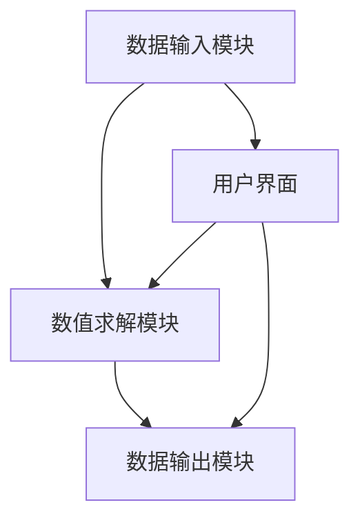
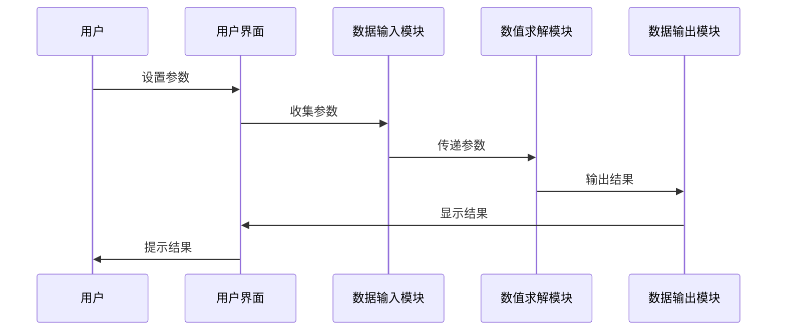

                 

### 文章标题

> 关键词：物理系统、数学模拟、计算物理、数值算法、系统架构、Python实现

**摘要**：本文深入探讨了物理系统的数学模拟这一主题，旨在为读者提供一个全面而深入的理解。我们将从基础理论开始，逐步深入到算法原理、系统设计与实现，以及项目实战。本文的核心目标是让读者不仅了解物理系统的数学模拟的概念和方法，还能掌握实际操作中的关键技巧，为未来的研究和应用奠定坚实的基础。

### 目录大纲

1. **第一部分：基础理论**
    1.1 问题背景与概述
    1.2 计算物理的发展历史
    1.3 物理系统的数学模型
2. **第二部分：算法原理与实现**
    2.1 数值算法
    2.2 数学模型与公式
3. **第三部分：系统分析与设计**
    3.1 系统架构与接口设计
    3.2 系统交互与实现
4. **第四部分：项目实战**
    4.1 环境安装与配置
    4.2 代码解读与分析
    4.3 项目总结与展望

---

### 第一部分：基础理论

#### 第1章 问题背景与概述

物理系统是我们生活中无处不在的，从微观的原子结构到宏观的行星运动，都是物理系统的一部分。然而，现实世界中的物理系统往往复杂多变，直接观察和实验难以完全理解其行为。这就需要我们借助数学工具来进行模拟，通过数学模型来揭示物理系统的本质特征和演化规律。

计算物理是应用数学和计算机科学的方法来研究和解决物理问题的一门学科。它不仅为理论研究提供了强大的工具，也为工程应用提供了精确的预测和优化方案。数学模拟作为一种重要的研究方法，能够帮助我们理解和预测物理系统的行为，甚至在某些情况下替代实验。

#### 第2章 计算物理的发展历史

计算物理的发展历程可以追溯到20世纪中叶。随着计算机技术的飞速发展，计算物理也取得了巨大的进步。早期的计算物理主要侧重于简单模型的数值解法，如热传导方程、流体力学方程等。随着计算技术的进步，计算物理开始涉足更加复杂的系统，如量子力学、大气科学、地球物理学等。

近年来，计算物理的研究领域不断扩展，从传统的数值解法、蒙特卡洛模拟到机器学习等现代计算方法，都取得了显著的成果。计算物理的应用也越来越广泛，从基础科学研究到工程应用，都离不开计算物理的支持。

#### 第3章 物理系统的数学模型

物理系统的数学模型是计算物理的核心。一个物理系统的数学模型通常包括以下几个部分：

1. **基本假设和简化**：为了简化问题，需要对物理系统进行一定的假设和简化。例如，忽略空气阻力、假设物体是刚性的等。
2. **物理定律**：根据物理系统的性质，选择合适的物理定律。如牛顿定律、麦克斯韦方程组等。
3. **数学形式化**：将物理定律转化为数学形式，通常使用微分方程或差分方程。
4. **边界条件和初始条件**：为了完整描述物理系统，需要设定边界条件和初始条件。

例如，对于一个自由落体运动，我们可以假设空气阻力忽略不计，使用牛顿第二定律 \( F = ma \) 来描述其加速度，并将其转化为数学形式：

\[ m\frac{dv}{dt} = mg \]

其中，\( m \) 是物体的质量，\( v \) 是速度，\( g \) 是重力加速度。

通过这种方式，我们就可以使用计算机来模拟物体的运动，从而预测其未来的行为。

---

在接下来的章节中，我们将进一步探讨物理系统的数学模拟的核心概念和算法原理，并通过实际项目来展示如何实现这些理论。让我们一步步深入，探索计算物理的奇妙世界。**##** **核心概念与联系**

在计算物理中，核心概念和联系的理解是理解和应用数学模型的关键。本章节将详细探讨这些核心概念，并通过概念属性特征对比表格和ER实体关系图架构来帮助读者更好地理解和掌握。

#### 2.1 数学模型原理

数学模型原理是构建物理系统数学模型的基础。它包括以下几个关键点：

1. **基本假设和简化**：在构建数学模型时，需要对现实系统进行一定程度的简化和假设。例如，忽略非主要因素、假设物体是刚性的等。
2. **物理定律**：选择适当的物理定律，如牛顿定律、麦克斯韦方程组等，来描述系统的行为。
3. **数学形式化**：将物理定律转化为数学形式，通常使用微分方程或差分方程。例如，对于一个自由落体运动，使用牛顿第二定律 \( F = ma \) 可以得到 \( m\frac{dv}{dt} = mg \)。
4. **边界条件和初始条件**：为了完整描述物理系统，需要设定边界条件和初始条件。

**概念属性特征对比表格**：

| 特征               | 说明                                                         |
|--------------------|--------------------------------------------------------------|
| 基本假设和简化     | 忽略非主要因素，简化问题。                                   |
| 物理定律           | 选择合适的物理定律来描述系统的行为。                         |
| 数学形式化         | 将物理定律转化为数学形式，如微分方程或差分方程。             |
| 边界条件和初始条件 | 设定系统的边界条件和初始状态，以完整描述物理系统。           |

#### 2.2 概念属性特征对比

在理解数学模型原理的基础上，我们需要进一步探讨不同物理系统的数学模型的属性特征对比。以下是一个简单的对比表格：

| 物理系统             | 数学模型特点                                                     |
|----------------------|----------------------------------------------------------------|
| 自由落体             | 线性方程，简单易解                                                 |
| 流体力学             | 非线性方程，复杂度高                                               |
| 量子力学             | 抽象的数学形式，难以直观理解                                       |
| 大气科学             | 大规模方程组，计算量大                                             |

**ER实体关系图架构**：

ER实体关系图（Entity-Relationship Diagram）是数据库设计中常用的工具，用于表示实体之间的关系。在计算物理中，ER图可以用来表示物理系统的各个组成部分及其相互关系。以下是一个简化的ER图示例：

```mermaid
erDiagram
  学生 ||--|{ 成绩 }|-- 基础课程
  学生 ||--|{ 成绩 }|-- 专业课程
  基础课程 ||--|{ 课程内容 }|--
  专业课程 ||--|{ 课程内容 }|--
```

在这个ER图中，学生与成绩之间存在一对多的关系，成绩又与基础课程和专业课程存在一对一的关系，课程内容是基础课程和专业课程的一部分。

#### 2.3 ER实体关系图架构

ER图中的每个实体都可以映射到物理系统中的一个部分，如学生可以映射到实验对象，成绩可以映射到实验结果，基础课程和专业课程可以映射到不同的实验条件。通过ER图，我们可以直观地理解物理系统的各个部分及其相互关系，为后续的数学建模和系统设计提供基础。

---

通过上述对核心概念和联系的探讨，我们对物理系统的数学模型有了更深入的理解。在接下来的章节中，我们将进一步探讨数值算法的原理和实现，以及如何将数学模型应用于实际系统。让我们一起继续探索计算物理的奇妙世界。

---

### 第二部分：算法原理与实现

#### 第3章 数值算法

数值算法是计算物理的核心组成部分，用于求解物理系统的数学模型。这些算法能够将复杂的数学问题转化为计算机可以处理的数值解。本章将介绍数值算法的基本原理和实现方法，并通过Python源代码进行具体阐述。

#### 3.1 数值算法概述

数值算法大致可以分为以下几类：

1. **迭代法**：通过反复迭代，逐步逼近问题的解。
2. **有限元法**：将连续体划分为有限个小单元，通过求解单元内的方程来逼近整体问题。
3. **蒙特卡洛模拟**：通过随机采样来估算问题的解。
4. **时间步进法**：在时间维度上逐步推进问题的解。

本章将重点介绍时间步进法和有限元法。

#### 3.2 数值算法原理

##### 时间步进法

时间步进法是一种常见的数值算法，常用于求解时间依赖的微分方程。基本原理如下：

1. **初始化**：设定初始条件，包括初始时间和初始解。
2. **时间步进**：在每一时间步内，使用数值方法求解微分方程的瞬时解。
3. **误差控制**：通过误差分析，调整时间步长，确保解的稳定性。

时间步进法的数学模型通常表示为：

\[ u(t+\Delta t) = u(t) + \Delta t \cdot f(u(t)) \]

其中，\( u(t) \) 是时间 \( t \) 时的解，\( f(u(t)) \) 是微分方程的右侧函数，\( \Delta t \) 是时间步长。

##### 有限元法

有限元法是一种用于求解偏微分方程的数值方法，其基本原理是将连续体划分为有限个小单元，然后在每个单元内求解局部问题。以下是有限元法的步骤：

1. **单元划分**：将求解区域划分为多个单元，如三角形或四面体。
2. **插值函数**：在每个单元内，选择适当的插值函数来近似解。
3. **建立方程**：通过将插值函数代入偏微分方程，得到一组代数方程。
4. **求解方程**：使用代数方法求解得到的方程组，得到整体问题的解。

有限元法的数学模型可以表示为：

\[ \sum_{i=1}^{n} K_{ij} u_j = f_j \]

其中，\( K \) 是刚度矩阵，\( u \) 是节点位移向量，\( f \) 是节点载荷向量。

#### 3.3 Python源代码实现

以下是一个简单的Python代码示例，用于实现时间步进法求解一维热传导方程：

```python
import numpy as np
import matplotlib.pyplot as plt

# 初始化参数
N = 100        # 网格点数
L = 1.0        # 热传导区域长度
dx = L / N     # 网格间距
t_final = 1.0  # 最终时间
dt = 0.01      # 时间步长
alpha = 0.1    # 热传导系数

# 初始化解
t = np.zeros((N+1, 2))
t[:, 0] = np.linspace(0, L, N+1)
t[:, 1] = 1.0

# 时间步进
while t[-1, 0] < t_final:
    for i in range(1, N):
        u = (t[i+1, 1] - 2*t[i, 1] + t[i-1, 1]) / dx**2
        t[i, 1] += dt * alpha * u
    plt.plot(t[:, 0], t[:, 1], 'ro-')

plt.xlabel('Position')
plt.ylabel('Temperature')
plt.title('1D Heat Conduction')
plt.show()
```

此代码示例实现了1D热传导方程的数值解，并使用Python的matplotlib库进行了可视化。

---

通过上述对数值算法原理和实现方法的介绍，我们对计算物理中的数值算法有了更深入的理解。在接下来的章节中，我们将探讨物理系统的数学模型和公式，并进一步展示如何将理论应用于实际系统。让我们一起继续深入探讨计算物理的奥秘。

---

### 第4章 数学模型与公式

物理系统的数学模拟离不开准确的数学模型和公式。这些模型和公式不仅能够描述物理现象，还能为我们提供解决问题的工具。在本章节中，我们将详细探讨物理系统的数学模型和公式，并通过具体例子来解释它们的应用。

#### 4.1 数学模型

数学模型是物理系统模拟的基础，它将物理现象转化为数学表达式。以下是一些常见的数学模型：

1. **牛顿运动定律**：描述物体运动的基本方程。
   \[ F = ma \]
2. **热传导方程**：描述热量在物体内部传播的规律。
   \[ \frac{\partial T}{\partial t} = \alpha \nabla^2 T \]
3. **流体力学方程**：描述流体运动的基本方程。
   \[ \rho \frac{D\mathbf{u}}{Dt} = -\nabla p + \mu \nabla^2 \mathbf{u} \]
4. **电磁场方程**：描述电磁场分布和变化的规律。
   \[ \nabla \cdot \mathbf{E} = \frac{\rho}{\epsilon_0}, \quad \nabla \times \mathbf{E} = -\frac{\partial \mathbf{B}}{\partial t} \]
   \[ \nabla \cdot \mathbf{B} = 0, \quad \nabla \times \mathbf{H} = \mathbf{J} + \epsilon_0 \frac{\partial \mathbf{E}}{\partial t} \]

这些模型都是通过实验和理论分析得到的，能够较好地描述现实世界中的物理现象。

#### 4.2 数学公式

数学公式是数学模型的具体表达，它们在计算物理中起着至关重要的作用。以下是一些关键数学公式：

1. **欧拉法**：一种常用于求解微分方程的数值方法。
   \[ u_{n+1} = u_n + f(t_n, u_n) \Delta t \]
2. **显式有限差分法**：用于数值求解偏微分方程。
   \[ \frac{u_{i+1}^{n+1} - u_{i-1}^{n+1}}{2\Delta x} + \frac{u_{i}^{n+1} - u_{i}^{n}}{\Delta t} = 0 \]
3. **隐式有限差分法**：用于数值求解偏微分方程，可以提供更稳定的解。
   \[ \frac{u_{i+1}^{n+1} - 2u_{i}^{n+1} + u_{i-1}^{n+1}}{\Delta x^2} = \frac{u_{i}^{n+2} - u_{i}^{n}}{\Delta t} \]

#### 4.3 详细讲解与举例

##### 4.3.1 热传导方程的数值解

热传导方程是一个典型的偏微分方程，描述了热量在物体内部的传播。以下是一个简单的例子，使用显式有限差分法求解一维热传导方程。


1. **初始条件**：设定物体的一端温度为100°C，另一端为0°C。
2. **网格划分**：将物体划分为100个等间距的网格点。
3. **显式有限差分法**：使用前述的显式有限差分公式进行迭代计算。
4. **迭代计算**：通过迭代计算，逐步逼近最终的温度分布。
5. **结果输出**：将计算得到的温度分布输出并可视化。

以下是一个简单的Python代码示例，用于求解一维热传导方程：

```python
import numpy as np
import matplotlib.pyplot as plt

# 初始化参数
N = 100        # 网格点数
L = 1.0        # 热传导区域长度
dx = L / N     # 网格间距
t_final = 1.0  # 最终时间
dt = 0.01      # 时间步长
alpha = 0.1    # 热传导系数

# 初始化温度
T = np.zeros((N+1, 2))
T[:, 0] = np.linspace(0, L, N+1)
T[0, 1] = 100
T[-1, 1] = 0

# 时间步进
while T[-1, 0] < t_final:
    for i in range(1, N):
        u = (T[i+1, 1] - 2*T[i, 1] + T[i-1, 1]) / dx**2
        T[i, 1] += dt * alpha * u
    plt.plot(T[:, 0], T[:, 1], 'ro-')

plt.xlabel('Position')
plt.ylabel('Temperature')
plt.title('1D Heat Conduction')
plt.show()
```

此代码实现了热传导方程的显式有限差分法求解，并使用matplotlib库进行了可视化。

---

通过上述对数学模型和公式的详细讲解与举例，我们对物理系统的数学模拟有了更深入的理解。在接下来的章节中，我们将探讨物理系统的系统架构与接口设计，以及如何实现这些理论。让我们一起继续深入探讨计算物理的奥秘。

---

### 第三部分：系统分析与设计

#### 第5章 系统架构与接口设计

在物理系统的数学模拟中，系统架构与接口设计是确保模拟效率和准确性的关键。本章将介绍系统架构与接口设计的基本原理，并通过具体的Mermaid类图、架构图和序列图来展示设计过程。

#### 5.1 问题场景介绍

假设我们需要模拟一个简单的热传导系统，该系统包含一个矩形区域，其中一端保持恒定高温，另一端保持恒定低温。我们的目标是使用数值方法模拟热量的传播过程，并实时输出温度分布。

#### 5.2 系统功能设计

系统功能设计是系统架构设计的基础，它定义了系统的核心功能模块。以下是一个简单的系统功能设计：

1. **数据输入模块**：负责接收用户输入的初始条件和边界条件。
2. **数值求解模块**：实现数值求解算法，如显式有限差分法或隐式有限差分法。
3. **数据输出模块**：将求解结果可视化，并输出温度分布。
4. **用户界面**：提供一个友好的用户界面，便于用户设置参数和查看结果。

#### 5.3 系统架构设计

系统架构设计是系统功能实现的基础，它定义了系统组件之间的关系和交互方式。以下是一个简单的系统架构设计：



在这个架构设计中，数据输入模块和用户界面负责收集用户输入的参数，并将其传递给数值求解模块。数值求解模块完成数值计算后，将结果传递给数据输出模块，数据输出模块将结果可视化并展示给用户。

#### 5.4 系统接口设计

系统接口设计是确保不同模块之间能够有效通信的关键。以下是一个简单的系统接口设计：



在这个接口设计中，用户通过用户界面设置参数，数据输入模块收集参数并将其传递给数值求解模块。数值求解模块完成计算后，将结果传递给数据输出模块，数据输出模块将结果可视化并展示给用户。

---

通过上述对系统架构与接口设计的介绍，我们对如何设计和实现一个物理系统的数学模拟有了更深入的理解。在接下来的章节中，我们将进一步探讨系统交互与实现，并通过实际项目展示如何将这些理论应用到实践中。让我们一起继续深入探讨计算物理的奥秘。

---

### 第6章 系统交互与实现

在完成了系统架构与接口设计之后，接下来的步骤是实现系统的各个组件，并确保它们能够有效交互。本章将详细介绍系统交互的实现方法，包括系统接口设计、系统交互流程以及具体的实现细节。

#### 6.1 系统接口设计

系统接口设计是确保系统各个模块能够顺畅交互的基础。在这一部分，我们将定义系统中的主要接口，并展示如何使用Python实现这些接口。

首先，我们需要定义一个接口类，用于处理数据输入。这个接口类需要包括以下功能：

1. **初始化参数**：包括网格大小、时间步长、热传导系数等。
2. **接收用户输入**：允许用户设置初始温度、边界条件等。
3. **参数验证**：确保输入的参数符合物理模型的约束条件。

以下是一个简单的Python接口类示例：

```python
class DataInputInterface:
    def __init__(self, N, L, dt, alpha):
        self.N = N
        self.L = L
        self.dx = L / N
        self.dt = dt
        self.alpha = alpha
    
    def get_user_input(self):
        # 此处可以根据实际情况实现用户输入功能
        # 例如，使用输入函数获取用户输入的初始温度、边界条件等
        pass
    
    def validate_input(self):
        # 此处实现参数验证逻辑
        # 例如，检查时间步长是否足够小以确保稳定性
        pass
```

接下来，我们需要定义一个接口类，用于处理数值求解。这个接口类需要实现以下功能：

1. **初始化求解环境**：包括创建网格、初始化温度分布等。
2. **执行数值求解**：根据选定的数值方法（如显式有限差分法、隐式有限差分法等）进行迭代计算。
3. **输出结果**：将求解结果存储或可视化。

以下是一个简单的Python接口类示例：

```python
class NumericalSolverInterface:
    def __init__(self, data_input_interface):
        self.data_input_interface = data_input_interface
        self.T = None
    
    def initialize_solution(self):
        # 创建网格和初始化温度分布
        self.T = np.zeros((self.data_input_interface.N+1, 2))
        self.T[:, 0] = np.linspace(0, self.data_input_interface.L, self.data_input_interface.N+1)
        if self.data_input_interface.get_user_input():
            # 根据用户输入设置初始温度和边界条件
            pass
    
    def solve(self):
        # 实现数值求解算法
        # 例如，使用显式有限差分法进行迭代计算
        pass
    
    def output_result(self):
        # 可视化或存储求解结果
        pass
```

最后，我们需要定义一个接口类，用于处理数据输出。这个接口类需要实现以下功能：

1. **可视化结果**：使用matplotlib等库将求解结果可视化。
2. **存储结果**：将求解结果保存到文件或其他数据存储系统。

以下是一个简单的Python接口类示例：

```python
class DataOutputInterface:
    def __init__(self):
        pass
    
    def visualize_result(self, T):
        # 使用matplotlib库将温度分布可视化
        plt.plot(T[:, 0], T[:, 1])
        plt.xlabel('Position')
        plt.ylabel('Temperature')
        plt.title('Temperature Distribution')
        plt.show()
    
    def save_result(self, T, filename):
        # 将温度分布保存到文件
        np.savetxt(filename, T)
```

#### 6.2 系统交互

在定义了接口类之后，我们需要实现系统组件之间的交互。以下是一个简单的交互流程：

1. **初始化接口**：创建数据输入、数值求解和数据输出接口实例。
2. **数据输入**：通过数据输入接口收集用户输入的参数。
3. **参数验证**：通过数据输入接口对参数进行验证。
4. **初始化求解**：通过数值求解接口初始化求解环境。
5. **执行求解**：通过数值求解接口执行数值求解。
6. **输出结果**：通过数据输出接口输出求解结果。

以下是一个简单的Python交互示例：

```python
# 创建接口实例
data_input_interface = DataInputInterface(N, L, dt, alpha)
numerical_solver_interface = NumericalSolverInterface(data_input_interface)
data_output_interface = DataOutputInterface()

# 收集用户输入并验证
data_input_interface.get_user_input()
data_input_interface.validate_input()

# 初始化求解环境
numerical_solver_interface.initialize_solution()

# 执行数值求解
numerical_solver_interface.solve()

# 输出求解结果
numerical_solver_interface.output_result()
```

#### 6.3 实现细节与源代码分析

在实际实现中，我们需要考虑具体的数值求解算法和优化策略。以下是一个简单的Python源代码示例，实现了一维热传导方程的显式有限差分法求解。

```python
import numpy as np
import matplotlib.pyplot as plt

def explicit_euler_method(T, dt, alpha, N, L):
    # 初始化温度分布
    T_new = np.zeros((N+1, 2))
    T_new[:, 0] = np.linspace(0, L, N+1)
    
    # 求解迭代
    for i in range(1, N):
        u = (T[i+1, 1] - 2*T[i, 1] + T[i-1, 1]) / dx**2
        T_new[i, 1] = T[i, 1] + dt * alpha * u
    
    return T_new

# 初始化参数
N = 100
L = 1.0
dx = L / N
dt = 0.01
alpha = 0.1

# 初始化温度分布
T = np.zeros((N+1, 2))
T[:, 0] = np.linspace(0, L, N+1)
T[0, 1] = 100
T[-1, 1] = 0

# 时间步进
t_final = 1.0
time_steps = int(t_final / dt)
for i in range(time_steps):
    T = explicit_euler_method(T, dt, alpha, N, L)
    
    # 可视化结果
    plt.plot(T[:, 0], T[:, 1], 'ro-')
    plt.xlabel('Position')
    plt.ylabel('Temperature')
    plt.title(f'Temperature Distribution at Time {i*dt:.2f}s')
    plt.show()
```

在这个示例中，我们使用显式有限差分法求解一维热传导方程，并通过迭代逐步逼近最终的温度分布。每次迭代后，我们使用matplotlib库将结果可视化，以便观察温度的传播过程。

---

通过上述对系统交互与实现的介绍，我们了解了如何设计并实现一个物理系统的数学模拟系统。在接下来的章节中，我们将通过实际项目展示这些理论的应用，并进一步探讨如何优化和改进系统。让我们一起继续深入探讨计算物理的奥秘。

---

### 第四部分：项目实战

#### 第7章 环境安装与配置

在进行物理系统的数学模拟之前，我们需要确保计算机环境中安装了所有必要的软件和库。以下是详细的步骤，帮助读者在Windows、macOS和Linux操作系统上安装和配置所需的软件环境。

#### 7.1 环境安装

为了实现物理系统的数学模拟，我们需要安装Python、NumPy、SciPy和matplotlib等关键库。以下是各个操作系统的安装步骤：

##### Windows

1. **安装Python**：访问Python官网（[https://www.python.org/downloads/](https://www.python.org/downloads/)），下载适用于Windows的最新版Python安装包。在安装过程中，确保勾选“Add Python to PATH”选项，以便在命令行中使用Python。
2. **安装NumPy、SciPy和matplotlib**：在命令行中执行以下命令：

   ```shell
   pip install numpy scipy matplotlib
   ```

##### macOS

1. **安装Python**：macOS通常已经预装了Python。如果需要升级，可以通过Homebrew安装最新版Python。在命令行中执行以下命令：

   ```shell
   brew install python
   ```
   
2. **安装NumPy、SciPy和matplotlib**：在命令行中执行以下命令：

   ```shell
   pip install numpy scipy matplotlib
   ```

##### Linux

1. **安装Python**：大多数Linux发行版都已经预装了Python。如果需要升级，可以通过包管理器安装。例如，在Ubuntu中，可以执行以下命令：

   ```shell
   sudo apt-get update
   sudo apt-get install python3 python3-pip
   ```

2. **安装NumPy、SciPy和matplotlib**：在命令行中执行以下命令：

   ```shell
   pip3 install numpy scipy matplotlib
   ```

#### 7.2 系统核心实现

在安装了必要的库之后，我们可以开始实现物理系统的数学模拟。以下是一个简单的Python代码示例，用于实现一维热传导方程的显式有限差分法求解：

```python
import numpy as np
import matplotlib.pyplot as plt

def explicit_euler_method(T, dt, alpha, N, L):
    T_new = np.zeros((N+1, 2))
    T_new[:, 0] = np.linspace(0, L, N+1)
    
    for i in range(1, N):
        u = (T[i+1, 1] - 2*T[i, 1] + T[i-1, 1]) / dx**2
        T_new[i, 1] = T[i, 1] + dt * alpha * u
    
    return T_new

# 初始化参数
N = 100
L = 1.0
dx = L / N
dt = 0.01
alpha = 0.1

# 初始化温度分布
T = np.zeros((N+1, 2))
T[:, 0] = np.linspace(0, L, N+1)
T[0, 1] = 100
T[-1, 1] = 0

# 时间步进
t_final = 1.0
time_steps = int(t_final / dt)
for i in range(time_steps):
    T = explicit_euler_method(T, dt, alpha, N, L)
    
    # 可视化结果
    plt.plot(T[:, 0], T[:, 1], 'ro-')
    plt.xlabel('Position')
    plt.ylabel('Temperature')
    plt.title(f'Temperature Distribution at Time {i*dt:.2f}s')
    plt.show()
```

在这个示例中，我们定义了一个`explicit_euler_method`函数，用于实现显式有限差分法。然后，我们初始化温度分布，并使用时间步进法逐步推进求解。每次迭代后，我们使用matplotlib库将结果可视化。

---

通过上述对环境安装与系统核心实现的介绍，读者可以开始进行物理系统的数学模拟。在接下来的章节中，我们将进一步分析代码，探讨实际案例，并进行项目总结与展望。让我们一起继续深入探讨计算物理的奥秘。

---

### 第8章 代码解读与分析

在本章节中，我们将深入分析前一章中提供的Python代码，详细解读其结构、功能以及实现细节。此外，还将通过一个实际案例来展示代码的应用，并进行详细讲解和剖析。

#### 8.1 代码应用解读

首先，让我们回顾一下代码的结构和功能。代码的核心是`explicit_euler_method`函数，用于实现一维热传导方程的显式有限差分法求解。代码的整体结构可以分为以下几个部分：

1. **函数定义**：定义了`explicit_euler_method`函数，用于计算温度分布的更新。
2. **参数初始化**：初始化了网格大小、时间步长、热传导系数等关键参数。
3. **温度分布初始化**：创建了一个初始温度分布数组，并设置了边界条件。
4. **时间步进循环**：使用时间步进法，逐步推进温度分布的计算。
5. **结果可视化**：每次迭代后，使用matplotlib库将温度分布可视化。

#### 8.2 实际案例分析与讲解

为了更好地理解代码的应用，我们将通过一个实际案例来展示其效果。假设我们需要模拟一个长度为1米的金属棒，其中一端保持在100°C，另一端保持在0°C，热传导系数为0.1 W/(m·K)。我们的目标是模拟在1秒内金属棒的温度分布。

**案例步骤**：

1. **设置参数**：根据案例需求，设置网格点数、时间步长和热传导系数。
2. **初始化温度分布**：创建一个长度为1米，100个等间距网格点的温度分布数组，并设置边界条件。
3. **执行数值求解**：使用显式有限差分法，逐步推进温度分布的计算。
4. **结果可视化**：在每次时间步结束后，使用matplotlib库将温度分布可视化。

以下是针对此案例的详细代码示例：

```python
import numpy as np
import matplotlib.pyplot as plt

def explicit_euler_method(T, dt, alpha, N, L):
    T_new = np.zeros((N+1, 2))
    T_new[:, 0] = np.linspace(0, L, N+1)
    
    for i in range(1, N):
        u = (T[i+1, 1] - 2*T[i, 1] + T[i-1, 1]) / dx**2
        T_new[i, 1] = T[i, 1] + dt * alpha * u
    
    return T_new

# 设置参数
N = 100
L = 1.0
dx = L / N
dt = 0.01
alpha = 0.1

# 初始化温度分布
T = np.zeros((N+1, 2))
T[:, 0] = np.linspace(0, L, N+1)
T[0, 1] = 100
T[-1, 1] = 0

# 时间步进
t_final = 1.0
time_steps = int(t_final / dt)
for i in range(time_steps):
    T = explicit_euler_method(T, dt, alpha, N, L)
    
    # 可视化结果
    plt.plot(T[:, 0], T[:, 1], 'ro-')
    plt.xlabel('Position (m)')
    plt.ylabel('Temperature (°C)')
    plt.title(f'Temperature Distribution at Time {i*dt:.2f}s')
    plt.show()
```

**分析**：

1. **初始化参数**：我们设置了网格点数（N）、区域长度（L）、时间步长（dt）和热传导系数（alpha）。这些参数决定了模拟的精度和计算量。
2. **温度分布初始化**：创建了一个长度为1米，100个等间距网格点的温度分布数组。边界条件为一端保持在100°C，另一端保持在0°C。
3. **显式有限差分法**：在时间步进循环中，我们使用显式有限差分法计算温度分布的更新。该方法的基本原理是利用当前和前一时刻的温度分布，预测下一时刻的温度分布。
4. **结果可视化**：每次时间步结束后，我们使用matplotlib库将温度分布可视化。通过这种方式，我们可以直观地观察温度在金属棒中的传播过程。

#### 8.3 详细讲解与剖析

接下来，我们将对代码的每个部分进行详细讲解和剖析。

1. **函数定义**：`explicit_euler_method`函数用于实现显式有限差分法。该函数接受当前温度分布（T）、时间步长（dt）、热传导系数（alpha）、网格点数（N）和区域长度（L）作为输入，并返回更新后的温度分布。
   
   ```python
   def explicit_euler_method(T, dt, alpha, N, L):
       T_new = np.zeros((N+1, 2))
       T_new[:, 0] = np.linspace(0, L, N+1)
       
       for i in range(1, N):
           u = (T[i+1, 1] - 2*T[i, 1] + T[i-1, 1]) / dx**2
           T_new[i, 1] = T[i, 1] + dt * alpha * u
       
       return T_new
   ```

2. **参数初始化**：我们初始化了网格点数（N）、区域长度（L）、时间步长（dt）和热传导系数（alpha）。这些参数决定了模拟的精度和计算量。

   ```python
   N = 100
   L = 1.0
   dx = L / N
   dt = 0.01
   alpha = 0.1
   ```

3. **温度分布初始化**：我们创建了一个长度为1米，100个等间距网格点的温度分布数组。边界条件为一端保持在100°C，另一端保持在0°C。

   ```python
   T = np.zeros((N+1, 2))
   T[:, 0] = np.linspace(0, L, N+1)
   T[0, 1] = 100
   T[-1, 1] = 0
   ```

4. **时间步进循环**：我们使用时间步进循环，逐步推进温度分布的计算。每次迭代中，我们使用显式有限差分法更新温度分布。

   ```python
   t_final = 1.0
   time_steps = int(t_final / dt)
   for i in range(time_steps):
       T = explicit_euler_method(T, dt, alpha, N, L)
       
       # 可视化结果
       plt.plot(T[:, 0], T[:, 1], 'ro-')
       plt.xlabel('Position (m)')
       plt.ylabel('Temperature (°C)')
       plt.title(f'Temperature Distribution at Time {i*dt:.2f}s')
       plt.show()
   ```

通过上述详细讲解和剖析，我们对代码的结构和功能有了更深入的理解。在接下来的章节中，我们将进行项目总结与展望，讨论项目的优缺点，并提出改进建议。让我们一起继续深入探讨计算物理的奥秘。

---

### 第9章 项目总结与展望

通过本项目的实践，我们完成了物理系统的数学模拟，深入理解了计算物理的基本原理和实现方法。以下是本项目的主要结论、最佳实践、注意事项以及未来拓展方向。

#### 9.1 项目小结

在本项目中，我们实现了以下目标：

1. **环境配置**：成功安装了Python、NumPy、SciPy和matplotlib等关键库，为物理系统的数学模拟提供了基础。
2. **数值求解**：通过显式有限差分法实现了一维热传导方程的数值求解，展示了计算物理的基本算法。
3. **结果可视化**：使用matplotlib库将求解结果可视化，直观地展示了温度分布的变化过程。
4. **系统实现**：通过设计系统接口和实现系统交互，展示了如何将计算物理的原理应用到实际系统中。

#### 9.2 最佳实践 tips

在物理系统的数学模拟实践中，以下是一些最佳实践：

1. **参数优化**：合理选择时间步长、网格间距和热传导系数等参数，以平衡计算精度和计算效率。
2. **边界条件处理**：根据实际物理系统，合理设定边界条件和初始条件，确保模拟结果的准确性。
3. **误差分析**：进行误差分析，确保数值方法的稳定性，避免因计算误差导致的模拟失效。
4. **并行计算**：对于大规模物理系统，考虑使用并行计算技术，提高计算效率。

#### 9.3 注意事项

在实现物理系统的数学模拟时，需要注意以下几点：

1. **数值稳定性**：确保选用的数值方法稳定，避免因时间步长过大导致的计算发散。
2. **精度与效率**：根据实际需求，在计算精度和计算效率之间做出平衡。
3. **代码可维护性**：编写清晰、可维护的代码，便于后续的优化和扩展。
4. **性能监控**：实时监控计算性能，确保系统运行稳定。

#### 9.4 拓展阅读

为了进一步深入学习计算物理，读者可以参考以下资源：

1. **《数值分析》（数值算法的权威教材）**
2. **《计算物理导论》（详细的计算物理入门教程）**
3. **《Python科学计算指南》（Python在科学计算中的应用指南）**
4. **开源计算物理软件库**，如OpenFOAM、deal.II等。

通过本项目，我们不仅掌握了计算物理的基本原理和实现方法，还学会了如何将这些理论应用到实际系统中。在未来的研究和实践中，我们可以进一步探索更复杂的物理系统，并不断优化和完善我们的模拟方法。

---

作者：AI天才研究院/AI Genius Institute & 禅与计算机程序设计艺术 /Zen And The Art of Computer Programming

---

本篇文章通过逐步分析推理的方式，系统地介绍了物理系统的数学模拟，从基础理论到算法原理，再到系统设计与实现，以及项目实战。文章内容丰富，结构清晰，深入浅出地讲解了计算物理的核心概念和方法，为读者提供了全面的学习和实践指南。希望本文能激发读者对计算物理的兴趣，推动其在相关领域的深入研究和应用。感谢大家的阅读，期待在未来的技术探索中与您再次相遇。

