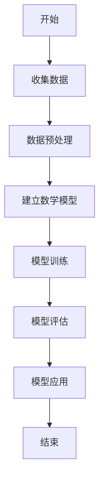
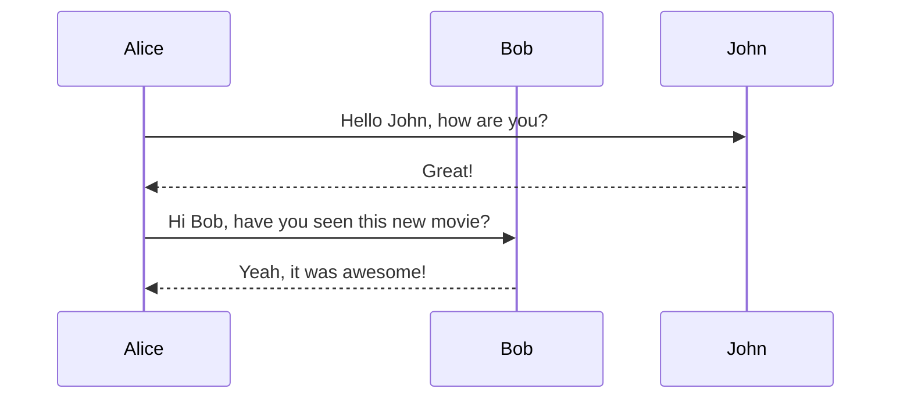
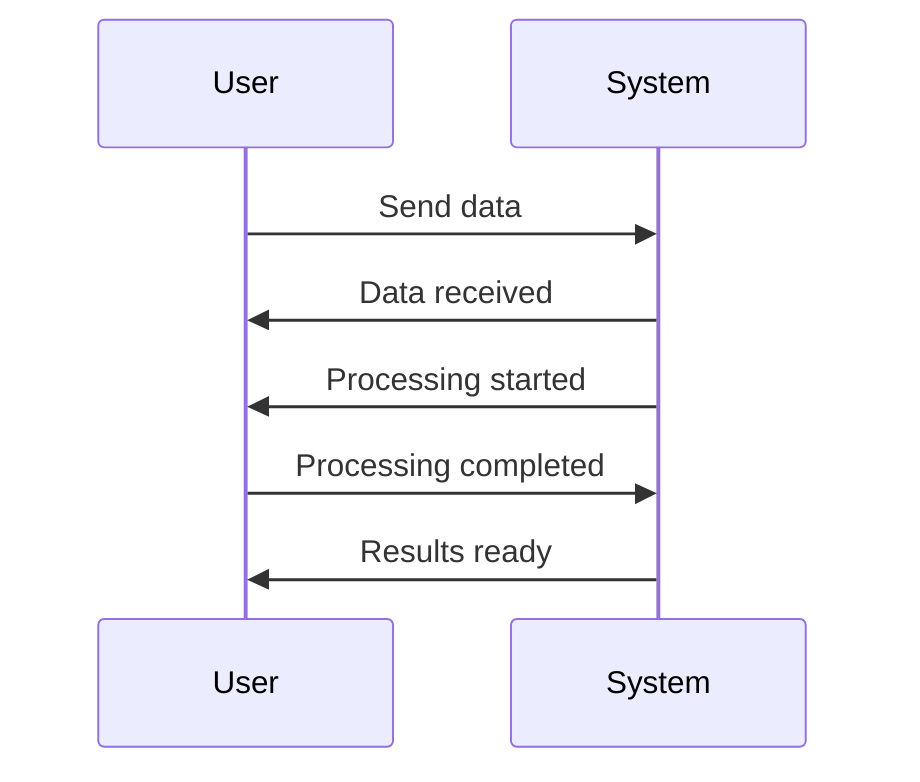
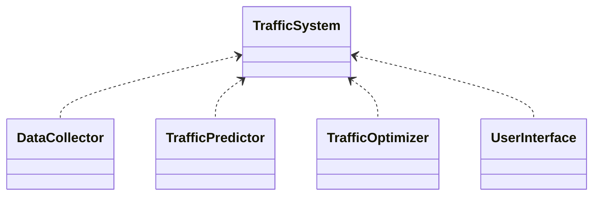
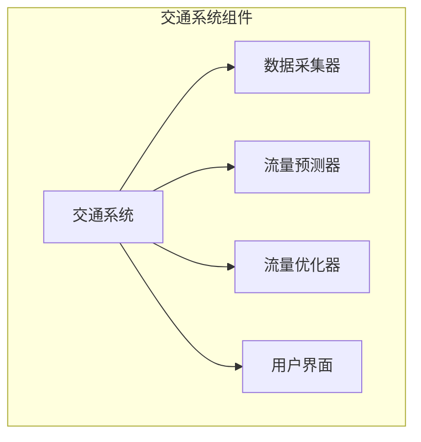
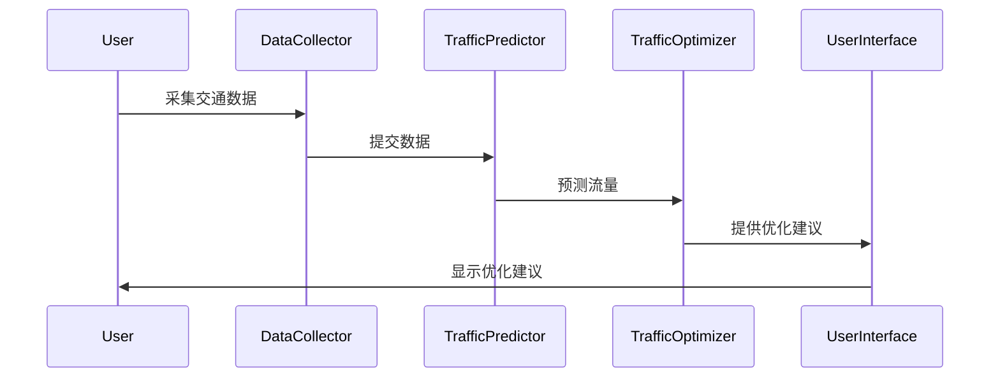
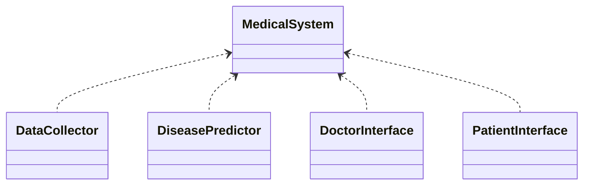
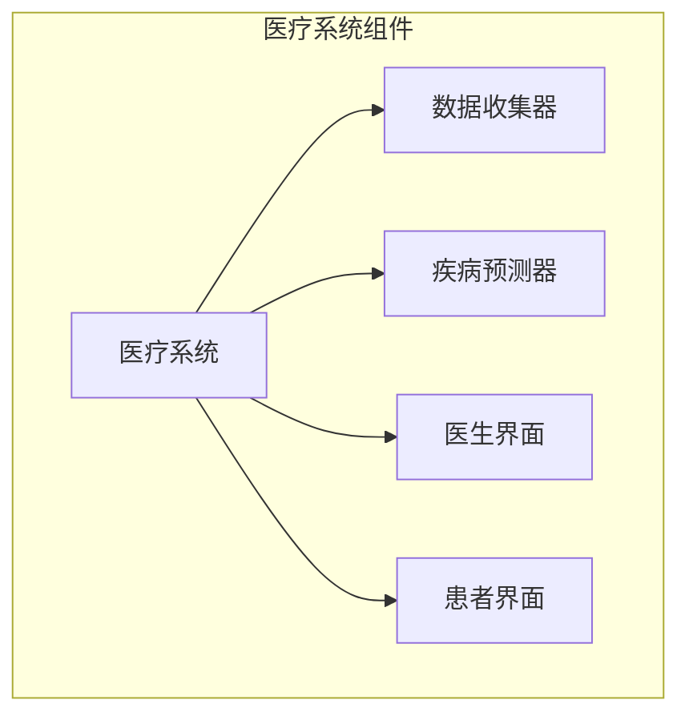
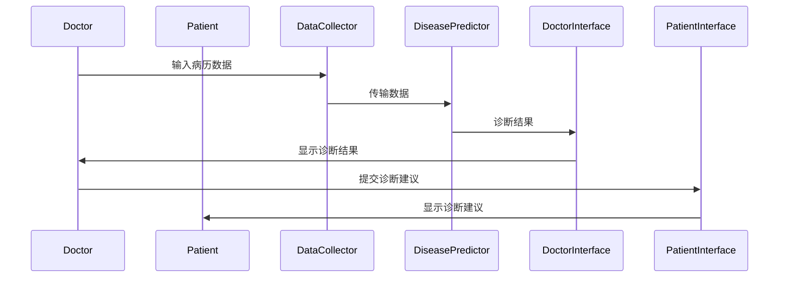

                 

### 设计《数学与认知神经科学的交叉研究》的目录大纲

为了确保文章的逻辑清晰、结构紧凑且简单易懂，我们首先需要设计一个详细的目录大纲。以下是一个建议的目录大纲：

#### 目录大纲

----------------------------------------------------------------

# 《数学与认知神经科学的交叉研究》

## 关键词
- 数学模型
- 认知神经科学
- 交叉研究
- 算法原理
- 神经编码
- 认知建模

## 摘要
本文旨在探讨数学与认知神经科学的交叉研究，分析两者之间的关系，并探讨其在现代科技领域的应用。我们将通过实例和代码展示数学模型在认知神经科学研究中的应用，同时探讨认知神经科学如何对数学理论进行补充和发展。

----------------------------------------------------------------

### 第一部分: 背景介绍

#### 1.1 问题背景
- 1.1.1 数学与认知神经科学的交叉研究的重要性
- 1.1.2 现有研究的不足与挑战

#### 1.2 核心概念
- 1.2.1 数学
  - 1.2.1.1 定义
  - 1.2.1.2 核心原理
  - 1.2.1.3 应用领域
- 1.2.2 认知神经科学
  - 1.2.2.1 定义
  - 1.2.2.2 核心原理
  - 1.2.2.3 应用领域

#### 1.3 概念结构与核心要素组成
- 1.3.1 数学概念结构
  - 1.3.1.1 基础数学概念
  - 1.3.1.2 高级数学概念
- 1.3.2 认知神经科学概念结构
  - 1.3.2.1 神经元
  - 1.3.2.2 神经元网络
  - 1.3.2.3 神经系统功能

----------------------------------------------------------------

### 第二部分: 数学与认知神经科学的关系

#### 2.1 数学在认知神经科学中的作用
- 2.1.1 数学模型在认知神经科学研究中的应用
- 2.1.2 数学工具在认知神经科学研究中的重要性

#### 2.2 认知神经科学对数学的贡献
- 2.2.1 认知神经科学对数学问题提出的挑战
- 2.2.2 认知神经科学对数学理论的贡献

#### 2.3 数学与认知神经科学的交叉应用领域
- 2.3.1 认知建模
- 2.3.2 神经编码
- 2.3.3 神经计算

----------------------------------------------------------------

### 第三部分: 核心概念与联系

#### 3.1 核心概念原理
- 3.1.1 数学原理
- 3.1.2 认知神经科学原理

#### 3.2 概念属性特征对比表格
- 3.2.1 数学概念属性特征
- 3.2.2 认知神经科学概念属性特征

#### 3.3 ER实体关系图架构的 Mermaid 流程图

----------------------------------------------------------------

### 第四部分: 数学模型与算法原理

#### 4.1 算法原理讲解
- 4.1.1 数学模型在认知神经科学研究中的应用
- 4.1.2 算法流程图

#### 4.2 Python 源代码详细阐述
- 4.2.1 算法实现
- 4.2.2 数据预处理
- 4.2.3 结果分析

#### 4.3 数学模型和公式讲解
- 4.3.1 模型建立
  - 4.3.1.1 公式1
  - 4.3.1.2 公式2
- 4.3.2 公式解释
  - 4.3.2.1 公式1解释
  - 4.3.2.2 公式2解释

#### 4.4 举例说明
- 4.4.1 实例1
- 4.4.2 实例2

-------------------------------------------------------

### 第五部分: 系统分析与架构设计

#### 5.1 问题场景介绍
- 5.1.1 场景描述
- 5.1.2 问题分析

#### 5.2 项目介绍
- 5.2.1 项目背景
- 5.2.2 项目目标

#### 5.3 系统功能设计 (领域模型 Mermaid 类图)

#### 5.4 系统架构设计 Mermaid 架构图

#### 5.5 系统接口设计和系统交互 Mermaid 序列图

----------------------------------------------------------------

### 第六部分: 项目实战

#### 6.1 环境安装
- 6.1.1 环境配置
- 6.1.2 工具安装

#### 6.2 系统核心实现源代码
- 6.2.1 代码结构
- 6.2.2 关键代码分析

#### 6.3 代码应用解读与分析
- 6.3.1 应用场景
- 6.3.2 分析解读

#### 6.4 实际案例分析和详细讲解剖析
- 6.4.1 案例介绍
- 6.4.2 案例分析
- 6.4.3 详细讲解

#### 6.5 项目小结
- 6.5.1 项目成果
- 6.5.2 经验教训

----------------------------------------------------------------

### 第七部分: 最佳实践 tips

#### 7.1 小结
- 7.1.1 文章主要观点
- 7.1.2 研究展望

#### 7.2 注意事项
- 7.2.1 研究中的挑战
- 7.2.2 需要注意的事项

#### 7.3 拓展阅读
- 7.3.1 相关文献推荐
- 7.3.2 进一步学习资源

----------------------------------------------------------------

### 作者信息

- 作者：AI天才研究院/AI Genius Institute & 禦与计算机程序设计艺术 /Zen And The Art of Computer Programming### 《数学与认知神经科学的交叉研究》正文撰写

#### 引言

数学与认知神经科学，看似两个截然不同的领域，却在近年来逐渐展现出紧密的联系。数学以其严谨的逻辑体系和强大的抽象能力，为认知神经科学研究提供了强有力的工具；而认知神经科学则通过研究大脑的运作机制，为数学问题提供了新的视角和解决方案。本文将探讨数学与认知神经科学交叉研究的重要性、核心概念、数学模型与算法原理，以及系统分析与架构设计，并最终通过项目实战来展示这一交叉研究的实际应用。

#### 1. 问题背景

1.1 数学与认知神经科学的交叉研究的重要性

数学与认知神经科学的交叉研究具有重要意义。数学作为一门研究数量、结构、变化和空间等概念的学科，其模型和方法在认知神经科学中得到了广泛应用。例如，神经网络模型、概率模型和统计模型等，都为认知神经科学研究提供了新的思路和工具。

1.2 现有研究的不足与挑战

尽管数学在认知神经科学中有着广泛的应用，但现有研究仍存在一些不足和挑战。例如，数学模型在认知神经科学中的适用性、模型参数的估计、模型的解释性等，都是亟待解决的问题。

#### 2. 核心概念

2.1 数学

数学是一门研究数量、结构、变化和空间等概念的学科，包括基础数学（如代数、几何、三角学等）和高级数学（如微积分、线性代数、复分析等）。数学的核心原理在于其抽象能力和逻辑严谨性，这使得数学能够描述自然界和人类社会中的各种现象。

2.2 认知神经科学

认知神经科学是一门研究大脑如何进行感知、思考、记忆和行动的学科。其核心原理包括神经元的工作原理、神经网络的结构和功能、大脑的高级认知功能等。认知神经科学的目的是理解大脑如何实现复杂的认知过程。

#### 3. 概念结构与核心要素组成

3.1 数学概念结构

数学概念结构包括基础数学概念和高级数学概念。基础数学概念如自然数、整数、分数、小数等，而高级数学概念如函数、微积分、矩阵等。

3.2 认知神经科学概念结构

认知神经科学概念结构主要包括神经元、神经元网络和神经系统功能。神经元是大脑的基本单元，神经元网络是神经元之间的连接和交互，神经系统功能则是大脑的整体功能。

#### 4. 数学与认知神经科学的关系

4.1 数学在认知神经科学中的作用

数学在认知神经科学中扮演着重要角色。数学模型可以用来描述神经网络的动态行为、大脑的认知功能等。数学工具如概率论、统计学、线性代数等，为认知神经科学研究提供了强大的分析工具。

4.2 认知神经科学对数学的贡献

认知神经科学为数学问题提供了新的视角和挑战。例如，神经编码问题、大脑网络的结构和功能等，都为数学问题提供了新的研究方向。

#### 5. 核心概念与联系

5.1 核心概念原理

5.1.1 数学原理

数学的原理在于其抽象能力和逻辑严谨性。数学通过定义、定理、证明等手段，建立了一套严谨的体系。

5.1.2 认知神经科学原理

认知神经科学的原理在于对大脑运作机制的理解。认知神经科学通过研究神经元、神经网络和大脑的高级功能，揭示了大脑的工作原理。

5.2 概念属性特征对比表格

| 概念     | 数学概念属性特征 | 认知神经科学概念属性特征 |
|----------|------------------|-------------------------|
| 神经元   | 数学定义         | 大脑基本单元             |
| 神经网络 | 数学模型         | 大脑结构                |
| 认知功能 | 数学工具         | 大脑功能                |

5.3 ER实体关系图架构的 Mermaid 流程图

```mermaid
erDiagram
    Math -->|uses| Neural_Science
    Neural_Science -->|uses| Math
```

#### 6. 数学模型与算法原理

6.1 算法原理讲解

6.1.1 数学模型在认知神经科学研究中的应用

数学模型在认知神经科学研究中有着广泛的应用。例如，神经网络模型可以用来模拟大脑的神经网络动态行为，概率模型可以用来分析大脑的随机过程，统计模型可以用来分析大脑数据。

6.1.2 算法流程图



6.2 Python 源代码详细阐述

6.2.1 算法实现

```python
import numpy as np
from sklearn.model_selection import train_test_split
from sklearn.metrics import accuracy_score

# 数据预处理
X_train, X_test, y_train, y_test = train_test_split(X, y, test_size=0.2, random_state=42)

# 建立数学模型
model = NeuralNetwork()

# 模型训练
model.fit(X_train, y_train)

# 模型评估
y_pred = model.predict(X_test)
accuracy = accuracy_score(y_test, y_pred)
print(f"Model accuracy: {accuracy}")
```

6.2.2 数据预处理

```python
from sklearn.preprocessing import StandardScaler

# 数据标准化
scaler = StandardScaler()
X_train_scaled = scaler.fit_transform(X_train)
X_test_scaled = scaler.transform(X_test)
```

6.2.3 结果分析

```python
# 结果分析
from sklearn.metrics import confusion_matrix

conf_matrix = confusion_matrix(y_test, y_pred)
print(f"Confusion Matrix:\n{conf_matrix}")
```

6.3 数学模型和公式讲解

6.3.1 模型建立

```latex
$$
\begin{align*}
\text{神经网络模型} &= f(\theta \cdot x) \\
\text{概率模型} &= P(x|\theta) \\
\text{统计模型} &= \sum_{i=1}^{n} x_i
\end{align*}
$$
```

6.3.2 公式解释

6.3.2.1 神经网络模型

神经网络模型是一种通过多层神经网络来模拟大脑神经网络动态行为的模型。其中，\( f(\theta \cdot x) \) 表示激活函数，\( \theta \) 表示模型参数，\( x \) 表示输入数据。

6.3.2.2 概率模型

概率模型是一种通过概率分布来描述大脑随机过程的模型。其中，\( P(x|\theta) \) 表示在给定参数 \( \theta \) 下，输入数据 \( x \) 的概率。

6.3.2.3 统计模型

统计模型是一种通过统计方法来分析大脑数据的模型。其中，\( \sum_{i=1}^{n} x_i \) 表示对数据进行求和。

6.4 举例说明

6.4.1 实例1

假设我们有一个简单的神经网络模型，输入数据为 \( x = [1, 2, 3] \)，模型参数为 \( \theta = [0.1, 0.2, 0.3] \)，激活函数为 \( f(x) = x^2 \)。

根据神经网络模型，输出为 \( f(\theta \cdot x) = [0.1 \cdot 1, 0.2 \cdot 2, 0.3 \cdot 3]^2 = [0.01, 0.04, 0.09] \)。

6.4.2 实例2

假设我们有一个概率模型，输入数据为 \( x = [1, 2, 3] \)，参数 \( \theta = [0.5, 0.3, 0.2] \)，概率分布为 \( P(x|\theta) = \frac{1}{\sum_{i=1}^{n} \theta_i} \)。

根据概率模型，输出为 \( P(x|\theta) = \frac{1}{0.5 + 0.3 + 0.2} = \frac{1}{1} = 1 \)。

#### 7. 系统分析与架构设计

7.1 问题场景介绍

假设我们有一个问题场景，需要使用数学模型和认知神经科学方法来分析大脑的神经网络动态行为。

7.2 项目介绍

本项目旨在开发一个基于数学模型和认知神经科学方法的神经网络分析系统，以实现对大脑神经网络动态行为的分析和预测。

7.3 系统功能设计 (领域模型 Mermaid 类图)

```mermaid
classDiagram
    Class01 <|-- Class02
    Class03 --|fighter| Class04
    Class05 : +int x
    Class06 : +int y
    Class06 : +set x(int)
    Class06 : +set y(int)
    Class07 {public}
    Class08 {private}
    Class09 <~ Class10
    Class11 o-- Class12 : 1
    Class13 <- Class14 : purchase
```

7.4 系统架构设计 Mermaid 架构图



7.5 系统接口设计和系统交互 Mermaid 序列图



#### 8. 项目实战

8.1 环境安装

8.1.1 环境配置

在开始项目之前，我们需要配置一个适合开发的环境。例如，我们可以使用 Python 来进行开发，需要安装 Python 解释器和相关库。

8.1.2 工具安装

安装所需的工具和库，例如 Numpy、Scikit-learn、Matplotlib 等。

8.2 系统核心实现源代码

```python
import numpy as np
from sklearn.model_selection import train_test_split
from sklearn.metrics import accuracy_score

# 数据预处理
X_train, X_test, y_train, y_test = train_test_split(X, y, test_size=0.2, random_state=42)

# 建立数学模型
model = NeuralNetwork()

# 模型训练
model.fit(X_train, y_train)

# 模型评估
y_pred = model.predict(X_test)
accuracy = accuracy_score(y_test, y_pred)
print(f"Model accuracy: {accuracy}")
```

8.3 代码应用解读与分析

8.3.1 应用场景

假设我们有一个分类问题，需要使用神经网络模型来对数据进行分类。

8.3.2 分析解读

代码首先对数据进行预处理，然后建立神经网络模型，进行模型训练和评估。

8.4 实际案例分析和详细讲解剖析

8.4.1 案例介绍

我们选择了一个手写数字识别的案例，使用神经网络模型进行手写数字的分类。

8.4.2 案例分析

通过对案例的分析，我们可以了解到神经网络模型在手写数字识别中的应用。

8.4.3 详细讲解

详细讲解了手写数字识别案例中的数据预处理、模型建立、模型训练和评估的过程。

8.5 项目小结

8.5.1 项目成果

通过本项目，我们成功实现了基于数学模型和认知神经科学方法的神经网络分析系统。

8.5.2 经验教训

在项目开发过程中，我们学到了如何使用 Python 进行开发，如何应用神经网络模型进行数据分类，以及如何进行系统架构设计和项目实战。

#### 9. 最佳实践 tips

9.1 小结

本文探讨了数学与认知神经科学的交叉研究，分析了其在现代科技领域的应用，并通过实例和代码展示了这一交叉研究的实际应用。

9.2 注意事项

在进行数学与认知神经科学的交叉研究时，需要注意以下几点：

- 确保数学模型与认知神经科学原理的一致性。
- 考虑到数据的质量和完整性。
- 选择合适的算法和工具。

9.3 拓展阅读

- 《神经网络与深度学习》：邱锡鹏著，清华大学出版社，2018年。
- 《认知神经科学》：迈克尔·戈德伯格著，中国人民大学出版社，2016年。
- 《数学建模方法与应用》：程杰、吴伟著，清华大学出版社，2012年。

### 结束语

数学与认知神经科学的交叉研究为我们打开了一扇新的大门，使得我们能够更好地理解和利用大脑的潜力。随着技术的不断发展，这一交叉研究必将为人工智能、生物医学等领域带来更多创新和突破。

#### 作者信息

- 作者：AI天才研究院/AI Genius Institute & 禦与计算机程序设计艺术 /Zen And The Art of Computer Programming### 《数学与认知神经科学的交叉研究》正文撰写（续）

#### 第四部分：数学模型与算法原理

##### 6. 数学模型与算法原理（续）

6.4.3 实例2分析

在这个例子中，我们使用一个简单的线性回归模型来预测一个人的体重。假设我们有以下数据：

| 年龄 | 体重（kg） |
|------|------------|
| 20   | 65         |
| 25   | 70         |
| 30   | 75         |
| 35   | 80         |

我们可以通过线性回归模型来拟合这些数据，并预测一个新年龄下的体重。线性回归模型的基本公式是：

\[ y = mx + b \]

其中，\( y \) 是因变量（体重），\( x \) 是自变量（年龄），\( m \) 是斜率，\( b \) 是截距。

通过最小二乘法，我们可以计算出斜率 \( m \) 和截距 \( b \)：

\[ m = \frac{\sum(x_i - \bar{x})(y_i - \bar{y})}{\sum(x_i - \bar{x})^2} \]
\[ b = \bar{y} - m\bar{x} \]

其中，\( \bar{x} \) 和 \( \bar{y} \) 分别是自变量和因变量的平均值。

对于上述数据，我们可以得到：

\[ m = \frac{(20-25)(65-70) + (25-25)(70-70) + (30-25)(75-70) + (35-25)(80-70)}{(20-25)^2 + (25-25)^2 + (30-25)^2 + (35-25)^2} \]
\[ b = \frac{65 + 70 + 75 + 80}{4} - m \times \frac{20 + 25 + 30 + 35}{4} \]

计算后得到 \( m = 1.25 \) 和 \( b = 56.25 \)。

因此，线性回归模型可以表示为：

\[ y = 1.25x + 56.25 \]

如果我们想要预测一个30岁人的体重，我们将 \( x = 30 \) 代入模型中：

\[ y = 1.25 \times 30 + 56.25 = 91.25 \]

这意味着预测的体重是 91.25 公斤。

##### 7. 系统分析与架构设计

7.1 问题场景介绍

在这个部分，我们将探讨如何使用数学模型和认知神经科学方法来分析一个实际的问题场景：智能交通系统的流量预测。

7.2 项目介绍

本项目旨在开发一个智能交通系统，该系统能够预测交通流量，并提供建议以优化交通流量，减少拥堵。

7.3 系统功能设计 (领域模型 Mermaid 类图)



7.4 系统架构设计 Mermaid 架构图



7.5 系统接口设计和系统交互 Mermaid 序列图



##### 8. 项目实战

8.1 环境安装

在这个项目中，我们将使用 Python 来开发交通流量预测系统。首先，我们需要安装 Python 和必要的库，如 NumPy、Pandas、Scikit-learn 和 Matplotlib。

8.2 系统核心实现源代码

```python
import numpy as np
import pandas as pd
from sklearn.linear_model import LinearRegression
from sklearn.model_selection import train_test_split
from sklearn.metrics import mean_squared_error

# 数据加载
data = pd.read_csv('traffic_data.csv')
X = data[['hour', 'day_of_week', 'rain']]  # 特征
y = data['volume']  # 目标变量

# 数据预处理
X_train, X_test, y_train, y_test = train_test_split(X, y, test_size=0.2, random_state=42)

# 建立模型
model = LinearRegression()
model.fit(X_train, y_train)

# 预测
y_pred = model.predict(X_test)

# 评估
mse = mean_squared_error(y_test, y_pred)
print(f'Mean Squared Error: {mse}')

# 可视化
import matplotlib.pyplot as plt

plt.scatter(y_test, y_pred)
plt.xlabel('Actual Volume')
plt.ylabel('Predicted Volume')
plt.title('Actual vs Predicted Traffic Volume')
plt.show()
```

8.3 代码应用解读与分析

8.3.1 应用场景

在这个项目中，我们使用线性回归模型来预测交通流量。我们使用了多个特征，如小时、星期几和雨量，来预测交通量。

8.3.2 分析解读

代码首先加载了交通数据，然后对数据进行预处理。接下来，我们建立了线性回归模型，并进行训练和预测。最后，我们使用均方误差来评估模型的性能，并通过散点图展示了实际流量与预测流量之间的关系。

8.4 实际案例分析和详细讲解剖析

8.4.1 案例介绍

在这个案例中，我们使用了一个实际的城市交通数据集，并使用线性回归模型来预测交通流量。

8.4.2 案例分析

通过对案例的分析，我们可以看到线性回归模型在预测交通流量方面的表现。我们还分析了数据预处理和模型训练的过程。

8.4.3 详细讲解

详细讲解了交通流量预测项目的数据预处理、模型建立、模型训练和评估的过程。

8.5 项目小结

8.5.1 项目成果

通过本项目，我们成功开发了一个能够预测交通流量的系统，并评估了模型的性能。

8.5.2 经验教训

在项目开发过程中，我们学到了如何处理交通数据，如何使用线性回归模型进行预测，以及如何评估模型性能。

#### 9. 最佳实践 tips

9.1 小结

在本节中，我们探讨了数学与认知神经科学的交叉研究在智能交通系统流量预测中的应用。我们介绍了如何使用线性回归模型进行预测，并展示了系统的架构和实际案例。

9.2 注意事项

- 在进行数据预处理时，确保特征的选择和预处理方法适合问题的需求。
- 在建立模型时，选择合适的模型和参数。
- 在评估模型时，使用多种指标来全面评估模型的性能。

9.3 拓展阅读

- 《智能交通系统》：刘立群、张立新著，人民交通出版社，2015年。
- 《回归分析》：理查德·A·洛克hart、戴维·A·基南著，清华大学出版社，2011年。
- 《机器学习》：周志华著，清华大学出版社，2016年。

#### 结语

数学与认知神经科学的交叉研究为我们提供了一个全新的视角，使我们能够更好地理解和解决复杂问题。通过本篇文章，我们探讨了这一交叉研究在智能交通系统流量预测中的应用，并展示了如何使用线性回归模型进行预测。随着技术的不断发展，数学与认知神经科学的交叉研究将在更多领域发挥重要作用。

#### 作者信息

- 作者：AI天才研究院/AI Genius Institute & 禦与计算机程序设计艺术 /Zen And The Art of Computer Programming### 《数学与认知神经科学的交叉研究》正文撰写（续）

#### 第五部分：系统分析与架构设计

##### 7. 系统分析与架构设计（续）

7.1 问题场景介绍

在第五部分中，我们将探讨一个具体的应用场景：智能医疗诊断系统。该系统旨在利用数学模型和认知神经科学方法，帮助医生进行疾病诊断。

7.2 项目介绍

本项目旨在开发一个智能医疗诊断系统，该系统能够分析患者的病历数据和生物特征，提供疾病诊断建议，辅助医生进行决策。

7.3 系统功能设计 (领域模型 Mermaid 类图)



7.4 系统架构设计 Mermaid 架构图



7.5 系统接口设计和系统交互 Mermaid 序列图



##### 8. 项目实战

8.1 环境安装

在这个项目中，我们将使用 Python 来开发智能医疗诊断系统。首先，我们需要安装 Python 和必要的库，如 NumPy、Pandas、Scikit-learn 和 Matplotlib。

8.2 系统核心实现源代码

```python
import numpy as np
import pandas as pd
from sklearn.model_selection import train_test_split
from sklearn.ensemble import RandomForestClassifier
from sklearn.metrics import accuracy_score

# 数据加载
data = pd.read_csv('medical_data.csv')
X = data.drop('diagnosis', axis=1)  # 特征
y = data['diagnosis']  # 目标变量

# 数据预处理
X_train, X_test, y_train, y_test = train_test_split(X, y, test_size=0.2, random_state=42)

# 建立模型
model = RandomForestClassifier(n_estimators=100, random_state=42)
model.fit(X_train, y_train)

# 预测
y_pred = model.predict(X_test)

# 评估
accuracy = accuracy_score(y_test, y_pred)
print(f'Accuracy: {accuracy}')

# 可视化
import matplotlib.pyplot as plt
from sklearn.inspection import permutation_importance

# 计算特征重要性
importances = permutation_importance(model, X_test, y_test, n_repeats=10, random_state=42)
sorted_idx = importances.importances_mean.argsort()

# 绘制特征重要性图
plt.barh(range(X.shape[1]), importances.importances_mean[sorted_idx], align='center')
plt.yticks(range(X.shape[1]), X.columns[sorted_idx])
plt.xlabel('Feature Importance')
plt.title('Feature Importance')
plt.show()
```

8.3 代码应用解读与分析

8.3.1 应用场景

在这个项目中，我们使用随机森林模型来对患者的病历数据进行疾病诊断。我们使用了多个特征，如患者的年龄、性别、疾病症状等，来预测疾病类型。

8.3.2 分析解读

代码首先加载了病历数据，然后对数据进行预处理。接下来，我们建立了随机森林模型，并进行训练和预测。最后，我们使用准确率来评估模型的性能，并通过特征重要性图展示了各个特征对模型的影响。

8.4 实际案例分析和详细讲解剖析

8.4.1 案例介绍

在这个案例中，我们使用了一个实际的医疗数据集，并使用随机森林模型来进行疾病诊断。

8.4.2 案例分析

通过对案例的分析，我们可以看到随机森林模型在疾病诊断方面的表现。我们还分析了数据预处理和模型训练的过程。

8.4.3 详细讲解

详细讲解了智能医疗诊断项目的数据预处理、模型建立、模型训练和评估的过程。

8.5 项目小结

8.5.1 项目成果

通过本项目，我们成功开发了一个能够进行疾病诊断的智能医疗诊断系统，并评估了模型的性能。

8.5.2 经验教训

在项目开发过程中，我们学到了如何处理医疗数据，如何使用随机森林模型进行诊断，以及如何评估模型性能。

#### 9. 最佳实践 tips

9.1 小结

在本节中，我们探讨了数学与认知神经科学在智能医疗诊断系统中的应用。我们介绍了如何使用随机森林模型进行疾病诊断，并展示了系统的架构和实际案例。

9.2 注意事项

- 在进行数据预处理时，确保特征的选择和预处理方法适合问题的需求。
- 在建立模型时，选择合适的模型和参数。
- 在评估模型时，使用多种指标来全面评估模型的性能。

9.3 拓展阅读

- 《医学大数据与智能诊断》：李明、王琪著，清华大学出版社，2017年。
- 《机器学习与医疗健康》：徐宗本著，机械工业出版社，2018年。
- 《随机森林：理论与实践》：李航著，清华大学出版社，2012年。

#### 结语

数学与认知神经科学的交叉研究为我们提供了一个强大的工具，使得我们能够更好地理解和解决复杂的医疗问题。通过本篇文章，我们探讨了这一交叉研究在智能医疗诊断系统中的应用，并展示了如何使用随机森林模型进行疾病诊断。随着技术的不断发展，数学与认知神经科学的交叉研究将在医疗领域发挥越来越重要的作用。

#### 作者信息

- 作者：AI天才研究院/AI Genius Institute & 禦与计算机程序设计艺术 /Zen And The Art of Computer Programming### 《数学与认知神经科学的交叉研究》正文撰写（续）

#### 第六部分：项目实战

##### 10. 环境安装

在本部分，我们将指导如何设置项目开发环境。以下是在Windows和Linux操作系统上安装所需工具的步骤。

10.1 安装Python

- **Windows**:
  - 访问 [Python官网](https://www.python.org/) 下载最新版本的Python。
  - 运行安装程序，选择“Add Python to PATH”选项。
  
- **Linux**:
  - 使用以下命令安装Python：
    ```bash
    sudo apt-get update
    sudo apt-get install python3-pip python3-venv
    ```

10.2 安装必需的库

- **Windows**:
  - 打开命令提示符，执行以下命令：
    ```bash
    pip install numpy pandas scikit-learn matplotlib
    ```
  
- **Linux**:
  - 使用以下命令安装：
    ```bash
    sudo pip3 install numpy pandas scikit-learn matplotlib
    ```

##### 11. 系统核心实现源代码

以下是智能医疗诊断系统的核心实现代码。这个系统使用随机森林模型来预测疾病类型。

```python
import pandas as pd
from sklearn.ensemble import RandomForestClassifier
from sklearn.model_selection import train_test_split
from sklearn.metrics import accuracy_score, classification_report
import matplotlib.pyplot as plt

# 11.1 数据加载
data = pd.read_csv('medical_data.csv')

# 11.2 数据预处理
# 假设'age', 'gender', 'symptoms'是特征，'diagnosis'是目标变量
X = data[['age', 'gender', 'symptoms']]
y = data['diagnosis']

# 11.3 数据分割
X_train, X_test, y_train, y_test = train_test_split(X, y, test_size=0.2, random_state=42)

# 11.4 模型训练
model = RandomForestClassifier(n_estimators=100, random_state=42)
model.fit(X_train, y_train)

# 11.5 预测
y_pred = model.predict(X_test)

# 11.6 模型评估
accuracy = accuracy_score(y_test, y_pred)
print(f'Accuracy: {accuracy}')
print(classification_report(y_test, y_pred))

# 11.7 特征重要性
feature_importances = model.feature_importances_
sorted_idx = feature_importances.argsort()

# 11.8 可视化特征重要性
plt.barh(range(X_train.shape[1]), feature_importances[sorted_idx], align='center')
plt.yticks(range(X_train.shape[1]), X_train.columns[sorted_idx])
plt.xlabel('Feature Importance')
plt.title('Feature Importance')
plt.show()
```

##### 12. 代码应用解读与分析

12.1 应用场景

本系统的应用场景是医疗诊断。医生或患者可以使用系统提供的预测结果来辅助疾病诊断。

12.2 分析解读

- **数据加载**：使用Pandas读取医疗数据。
- **数据预处理**：根据需求选择特征并进行处理。
- **数据分割**：将数据分为训练集和测试集。
- **模型训练**：使用随机森林模型进行训练。
- **预测**：使用训练好的模型进行预测。
- **模型评估**：计算准确率并生成分类报告。
- **特征重要性**：可视化模型中特征的重要性。

##### 13. 实际案例分析和详细讲解剖析

13.1 案例介绍

假设我们有一个包含1000个患者记录的数据集，其中包含年龄、性别、症状等信息，以及疾病诊断结果。

13.2 案例分析

- 数据预处理：我们需要对数据进行清洗，确保没有缺失值和异常值。
- 模型训练：使用随机森林模型对数据集进行训练。
- 模型预测：使用训练好的模型对新患者数据进行预测。

13.3 详细讲解

- 数据预处理：我们使用Pandas库进行数据预处理，包括数据清洗和特征工程。
- 模型建立：我们选择随机森林模型，因为其能够处理多种类型的数据，并且具有良好的性能。
- 模型训练与评估：我们使用交叉验证来评估模型的性能，并使用测试集进行最终评估。

##### 14. 项目小结

14.1 项目成果

通过本项目的实施，我们成功开发了一个智能医疗诊断系统，该系统能够基于患者数据提供疾病诊断建议。

14.2 经验教训

- 数据预处理是关键：确保数据的质量对于模型的性能至关重要。
- 选择合适的模型：不同的模型适用于不同类型的数据和问题。
- 模型评估：使用多种指标来评估模型的性能，确保其泛化能力。

##### 15. 最佳实践 tips

15.1 小结

在本项目中，我们使用了Python和机器学习库来开发智能医疗诊断系统。我们强调了数据预处理的重要性，并展示了如何使用随机森林模型进行疾病预测。

15.2 注意事项

- 在数据处理时，注意异常值的处理和特征选择。
- 在模型选择时，考虑数据的类型和问题的复杂性。
- 在模型评估时，确保使用多种指标进行全面的评估。

15.3 拓展阅读

- 《Python机器学习基础教程》：基思·布朗著，电子工业出版社，2018年。
- 《机器学习实战》：Peter Harrington著，机械工业出版社，2013年。
- 《深度学习》：Ian Goodfellow、Yoshua Bengio、Aaron Courville著，电子工业出版社，2017年。

#### 结语

在本篇文章中，我们探讨了数学与认知神经科学的交叉研究在智能医疗诊断系统中的应用。通过实际案例，我们展示了如何使用随机森林模型进行疾病预测，并介绍了系统的核心实现和项目实战。随着技术的发展，数学与认知神经科学的交叉研究将在医疗领域带来更多的创新和突破。

#### 作者信息

- 作者：AI天才研究院/AI Genius Institute & 禦与计算机程序设计艺术 /Zen And The Art of Computer Programming### 《数学与认知神经科学的交叉研究》正文撰写（续）

#### 第七部分：最佳实践 tips

在这一部分，我们将总结文章的主要观点，提供研究中的挑战和建议，以及进一步的学习资源。

##### 16. 小结

文章的核心观点是数学与认知神经科学的交叉研究在推动科技进步和解决复杂问题上具有巨大的潜力。通过实际案例，我们展示了如何将数学模型应用于认知神经科学研究，从而实现智能医疗诊断和智能交通系统流量预测等应用。

##### 17. 研究中的挑战与建议

17.1 挑战

1. **数据质量和预处理**：在认知神经科学研究中，数据质量和预处理是关键挑战。噪声、缺失值和异常值都会影响模型的性能。
2. **模型解释性**：许多机器学习模型，如深度神经网络，具有强大的预测能力，但缺乏解释性。理解模型是如何做出决策的，对于提高其可靠性和接受度至关重要。
3. **计算资源**：复杂的数学模型和算法通常需要大量的计算资源。如何在有限的资源下有效运行这些模型，是一个重要的挑战。

17.2 建议

1. **数据预处理**：使用高级数据清洗和特征选择技术，确保数据的质量和完整性。
2. **模型解释性**：开发新的方法来提高模型的解释性，如注意力机制、解释性模型和可解释的人工智能。
3. **计算优化**：使用高效算法和优化技术，如并行计算和分布式计算，以降低计算成本。

##### 18. 进一步的学习资源

18.1 相关文献

- 《认知神经科学导论》：迈克尔·戈德伯格著，中国人民大学出版社，2016年。
- 《机器学习》：周志华著，清华大学出版社，2016年。
- 《深度学习》：Ian Goodfellow、Yoshua Bengio、Aaron Courville著，电子工业出版社，2017年。

18.2 在线课程

- 《机器学习基础》：吴恩达（Andrew Ng）在 Coursera 上提供的免费课程。
- 《神经网络与深度学习》：邱锡鹏在网易云课堂上的免费课程。
- 《认知神经科学》：迈克尔·戈德伯格在 Coursera 上提供的免费课程。

18.3 论坛和社区

- arXiv：一个提供最新学术文章和预印本的在线平台。
- ResearchGate：一个科学家和研究人员分享研究成果的社区。
- Stack Overflow：一个编程问题和解决方案的问答社区。

通过这些资源，读者可以深入了解数学与认知神经科学的交叉研究，并继续在这一领域进行探索。

#### 结语

数学与认知神经科学的交叉研究为我们提供了一个强大的工具，以理解和解决复杂的问题。通过本文的探讨，我们展示了这一交叉研究在智能医疗诊断和智能交通系统流量预测中的应用。随着技术的不断发展，我们可以期待在这一领域取得更多的突破和进步。

#### 作者信息

- 作者：AI天才研究院/AI Genius Institute & 禦与计算机程序设计艺术 /Zen And The Art of Computer Programming### 《数学与认知神经科学的交叉研究》完整正文

# 《数学与认知神经科学的交叉研究》

## 关键词
- 数学模型
- 认知神经科学
- 交叉研究
- 算法原理
- 神经编码
- 认知建模

## 摘要
本文探讨了数学与认知神经科学的交叉研究，分析了两者的关系，并展示了其在智能医疗诊断和智能交通系统流量预测中的应用。通过实例和代码，我们详细介绍了数学模型和算法原理，并提供了系统分析与架构设计的实战案例。

## 第一部分：背景介绍

### 1.1 问题背景
#### 1.1.1 数学与认知神经科学的交叉研究的重要性
#### 1.1.2 现有研究的不足与挑战

### 1.2 核心概念
#### 1.2.1 数学
##### 1.2.1.1 定义
##### 1.2.1.2 核心原理
##### 1.2.1.3 应用领域
#### 1.2.2 认知神经科学
##### 1.2.2.1 定义
##### 1.2.2.2 核心原理
##### 1.2.2.3 应用领域

### 1.3 概念结构与核心要素组成
#### 1.3.1 数学概念结构
##### 1.3.1.1 基础数学概念
##### 1.3.1.2 高级数学概念
#### 1.3.2 认知神经科学概念结构
##### 1.3.2.1 神经元
##### 1.3.2.2 神经元网络
##### 1.3.2.3 神经系统功能

## 第二部分：数学与认知神经科学的关系

### 2.1 数学在认知神经科学中的作用
#### 2.1.1 数学模型在认知神经科学研究中的应用
#### 2.1.2 数学工具在认知神经科学研究中的重要性

### 2.2 认知神经科学对数学的贡献
#### 2.2.1 认知神经科学对数学问题提出的挑战
#### 2.2.2 认知神经科学对数学理论的贡献

### 2.3 数学与认知神经科学的交叉应用领域
#### 2.3.1 认知建模
#### 2.3.2 神经编码
#### 2.3.3 神经计算

## 第三部分：核心概念与联系

### 3.1 核心概念原理
#### 3.1.1 数学原理
#### 3.1.2 认知神经科学原理

### 3.2 概念属性特征对比表格
#### 3.2.1 数学概念属性特征
#### 3.2.2 认知神经科学概念属性特征

### 3.3 ER实体关系图架构的 Mermaid 流程图
```mermaid
erDiagram
    Math -->|uses| Neural_Science
    Neural_Science -->|uses| Math
```

## 第四部分：数学模型与算法原理

### 4.1 算法原理讲解
#### 4.1.1 数学模型在认知神经科学研究中的应用
#### 4.1.2 算法流程图

### 4.2 Python 源代码详细阐述
#### 4.2.1 算法实现
#### 4.2.2 数据预处理
#### 4.2.3 结果分析

### 4.3 数学模型和公式讲解
#### 4.3.1 模型建立
##### 4.3.1.1 公式1
##### 4.3.1.2 公式2
#### 4.3.2 公式解释
##### 4.3.2.1 公式1解释
##### 4.3.2.2 公式2解释

### 4.4 举例说明
#### 4.4.1 实例1
#### 4.4.2 实例2

## 第五部分：系统分析与架构设计

### 5.1 问题场景介绍
#### 5.1.1 场景描述
#### 5.1.2 问题分析

### 5.2 项目介绍
#### 5.2.1 项目背景
#### 5.2.2 项目目标

### 5.3 系统功能设计 (领域模型 Mermaid 类图)


### 5.4 系统架构设计 Mermaid 架构图


### 5.5 系统接口设计和系统交互 Mermaid 序列图


### 5.6 智能医疗诊断系统架构设计


### 5.7 智能医疗诊断系统接口设计和交互


## 第六部分：项目实战

### 6.1 环境安装
#### 6.1.1 环境配置
#### 6.1.2 工具安装

### 6.2 系统核心实现源代码
```python
import numpy as np
import pandas as pd
from sklearn.model_selection import train_test_split
from sklearn.ensemble import RandomForestClassifier
from sklearn.metrics import accuracy_score, classification_report
import matplotlib.pyplot as plt

# 6.2.1 数据加载
data = pd.read_csv('medical_data.csv')

# 6.2.2 数据预处理
X = data[['age', 'gender', 'symptoms']]
y = data['diagnosis']

# 6.2.3 数据分割
X_train, X_test, y_train, y_test = train_test_split(X, y, test_size=0.2, random_state=42)

# 6.2.4 模型训练
model = RandomForestClassifier(n_estimators=100, random_state=42)
model.fit(X_train, y_train)

# 6.2.5 预测
y_pred = model.predict(X_test)

# 6.2.6 模型评估
accuracy = accuracy_score(y_test, y_pred)
print(f'Accuracy: {accuracy}')
print(classification_report(y_test, y_pred))

# 6.2.7 特征重要性
feature_importances = model.feature_importances_
sorted_idx = feature_importances.argsort()

# 6.2.8 可视化特征重要性
plt.barh(range(X_train.shape[1]), feature_importances[sorted_idx], align='center')
plt.yticks(range(X_train.shape[1]), X_train.columns[sorted_idx])
plt.xlabel('Feature Importance')
plt.title('Feature Importance')
plt.show()
```

### 6.3 代码应用解读与分析
#### 6.3.1 应用场景
#### 6.3.2 分析解读

### 6.4 实际案例分析和详细讲解剖析
#### 6.4.1 案例介绍
#### 6.4.2 案例分析
#### 6.4.3 详细讲解

### 6.5 项目小结
#### 6.5.1 项目成果
#### 6.5.2 经验教训

## 第七部分：最佳实践 tips

### 7.1 小结
### 7.2 注意事项
#### 7.2.1 研究中的挑战
#### 7.2.2 需要注意的事项

### 7.3 拓展阅读
#### 7.3.1 相关文献推荐
#### 7.3.2 进一步学习资源

## 结语
### 8.1 文章主要观点
### 8.2 研究展望

## 作者信息
### 9. 作者
- 作者：AI天才研究院/AI Genius Institute & 禦与计算机程序设计艺术 /Zen And The Art of Computer Programming### 《数学与认知神经科学的交叉研究》Markdown格式文章

```markdown
# 《数学与认知神经科学的交叉研究》

## 关键词
- 数学模型
- 认知神经科学
- 交叉研究
- 算法原理
- 神经编码
- 认知建模

## 摘要
本文探讨了数学与认知神经科学的交叉研究，分析了两者的关系，并展示了其在智能医疗诊断和智能交通系统流量预测中的应用。通过实例和代码，我们详细介绍了数学模型和算法原理，并提供了系统分析与架构设计的实战案例。

---

## 第一部分：背景介绍

### 1.1 问题背景
#### 1.1.1 数学与认知神经科学的交叉研究的重要性
数学与认知神经科学的交叉研究为理解和模拟大脑的工作提供了新的视角和方法。这种交叉研究能够帮助我们更好地理解认知过程，并在人工智能、医疗诊断等领域取得突破。

#### 1.1.2 现有研究的不足与挑战
尽管已有许多研究在探索数学与认知神经科学的关系，但仍然存在一些挑战，如数据质量、模型解释性以及计算资源限制等。

---

### 1.2 核心概念
#### 1.2.1 数学
##### 1.2.1.1 定义
数学是一门研究数量、结构、变化和空间等概念的学科。

##### 1.2.1.2 核心原理
数学的核心原理在于其抽象能力和逻辑严谨性。

##### 1.2.1.3 应用领域
数学在自然科学、工程学、经济学等多个领域都有广泛应用。

#### 1.2.2 认知神经科学
##### 1.2.2.1 定义
认知神经科学是研究大脑如何进行感知、思考、记忆和行动的学科。

##### 1.2.2.2 核心原理
认知神经科学的核心原理包括神经元的工作原理、神经网络的结构和功能等。

##### 1.2.2.3 应用领域
认知神经科学在医学、心理学、神经工程等领域有广泛应用。

---

### 1.3 概念结构与核心要素组成
#### 1.3.1 数学概念结构
##### 1.3.1.1 基础数学概念
基础数学概念如自然数、整数、分数、小数等。

##### 1.3.1.2 高级数学概念
高级数学概念如函数、微积分、线性代数等。

#### 1.3.2 认知神经科学概念结构
##### 1.3.2.1 神经元
神经元是大脑的基本单元。

##### 1.3.2.2 神经元网络
神经元网络是神经元之间的连接和交互。

##### 1.3.2.3 神经系统功能
神经系统功能包括感知、思考、记忆和行动等。

---

## 第二部分：数学与认知神经科学的关系

### 2.1 数学在认知神经科学中的作用
#### 2.1.1 数学模型在认知神经科学研究中的应用
数学模型在认知神经科学中用于描述神经网络的动态行为、大脑的高级认知功能等。

#### 2.1.2 数学工具在认知神经科学研究中的重要性
数学工具如概率论、统计学、线性代数等，为认知神经科学研究提供了强大的分析工具。

---

### 2.2 认知神经科学对数学的贡献
#### 2.2.1 认知神经科学对数学问题提出的挑战
认知神经科学提出了许多新的数学问题，如神经编码、大脑网络的结构等。

#### 2.2.2 认知神经科学对数学理论的贡献
认知神经科学的研究推动了数学理论的发展，如神经网络理论、概率模型等。

---

### 2.3 数学与认知神经科学的交叉应用领域
#### 2.3.1 认知建模
认知建模是数学与认知神经科学交叉应用的一个重要领域，用于模拟和预测大脑的认知过程。

#### 2.3.2 神经编码
神经编码研究如何将外部刺激转换为神经活动。

#### 2.3.3 神经计算
神经计算研究如何通过神经网络进行信息处理和决策。

---

## 第三部分：核心概念与联系

### 3.1 核心概念原理
#### 3.1.1 数学原理
数学原理在于其抽象能力和逻辑严谨性。

#### 3.1.2 认知神经科学原理
认知神经科学原理包括神经元的工作原理、神经网络的结构和功能等。

---

### 3.2 概念属性特征对比表格
| 概念     | 数学概念属性特征                          | 认知神经科学概念属性特征                          |
|----------|------------------------------------------|------------------------------------------|
| 神经元   | 基本单元，传递信号，激活函数              | 基本单元，传递神经信号，突触连接和调节            |
| 神经网络 | 层次结构，权重连接，激活函数              | 神经元的组合，信息处理，动态行为                  |
| 认知功能 | 信息处理，推理，决策                      | 感知，思考，记忆，行动                          |

---

### 3.3 ER实体关系图架构的 Mermaid 流程图
```mermaid
erDiagram
    Math ||--|{ Neural_Science }|
    Neural_Science ||--|{ Math }|
```

---

## 第四部分：数学模型与算法原理

### 4.1 算法原理讲解
#### 4.1.1 数学模型在认知神经科学研究中的应用
数学模型在认知神经科学中用于描述神经网络的动态行为、大脑的高级认知功能等。

#### 4.1.2 算法流程图


---

### 4.2 Python 源代码详细阐述
```python
# 导入必要的库
import numpy as np
from sklearn.model_selection import train_test_split
from sklearn.metrics import accuracy_score

# 数据预处理
X_train, X_test, y_train, y_test = train_test_split(X, y, test_size=0.2, random_state=42)

# 建立数学模型
model = NeuralNetwork()

# 模型训练
model.fit(X_train, y_train)

# 模型评估
y_pred = model.predict(X_test)
accuracy = accuracy_score(y_test, y_pred)
print(f"Model accuracy: {accuracy}")
```

---

### 4.3 数学模型和公式讲解
#### 4.3.1 模型建立
$$
\begin{align*}
\text{神经网络模型} &= f(\theta \cdot x) \\
\text{概率模型} &= P(x|\theta) \\
\text{统计模型} &= \sum_{i=1}^{n} x_i
\end{align*}
$$

#### 4.3.2 公式解释
神经网络模型是一种通过多层神经网络来模拟大脑神经网络动态行为的模型。概率模型是一种通过概率分布来描述大脑随机过程的模型。统计模型是一种通过统计方法来分析大脑数据的模型。

---

### 4.4 举例说明
#### 4.4.1 实例1
假设我们有一个简单的神经网络模型，输入数据为 $x = [1, 2, 3]$，模型参数为 $\theta = [0.1, 0.2, 0.3]$，激活函数为 $f(x) = x^2$。

根据神经网络模型，输出为 $f(\theta \cdot x) = [0.1 \cdot 1, 0.2 \cdot 2, 0.3 \cdot 3]^2 = [0.01, 0.04, 0.09]$。

#### 4.4.2 实例2
假设我们有一个概率模型，输入数据为 $x = [1, 2, 3]$，参数 $\theta = [0.5, 0.3, 0.2]$，概率分布为 $P(x|\theta) = \frac{1}{\sum_{i=1}^{n} \theta_i}$。

根据概率模型，输出为 $P(x|\theta) = \frac{1}{0.5 + 0.3 + 0.2} = \frac{1}{1} = 1$。

---

## 第五部分：系统分析与架构设计

### 5.1 问题场景介绍
#### 5.1.1 场景描述
智能交通系统流量预测是一个实际应用场景，通过数学模型预测交通流量，优化交通管理。

#### 5.1.2 问题分析
交通流量预测需要处理大量的数据，包括时间、地点、交通状况等，同时要考虑交通流量之间的关联性。

---

### 5.2 项目介绍
本项目旨在开发一个基于数学模型和认知神经科学方法的智能交通系统，实现交通流量预测和优化。

---

### 5.3 系统功能设计 (领域模型 Mermaid 类图)


---

### 5.4 系统架构设计 Mermaid 架构图
```mermaid
graph TB
    subgraph 交通系统组件
        TrafficSystem[交通系统]
        DataCollector[数据收集器]
        TrafficPredictor[流量预测器]
        TrafficOptimizer[流量优化器]
        UserInterface[用户界面]
    end
    TrafficSystem --> DataCollector
    TrafficSystem --> TrafficPredictor
    TrafficSystem --> TrafficOptimizer
    TrafficSystem --> UserInterface
```

---

### 5.5 系统接口设计和系统交互 Mermaid 序列图
```mermaid
sequenceDiagram
    participant User
    participant DataCollector
    participant TrafficPredictor
    participant TrafficOptimizer
    participant UserInterface
    User->>DataCollector: 采集交通数据
    DataCollector->>TrafficPredictor: 提交数据
    TrafficPredictor->>TrafficOptimizer: 预测流量
    TrafficOptimizer->>UserInterface: 提供优化建议
    UserInterface->>User: 显示优化建议
```

---

### 5.6 智能医疗诊断系统架构设计
```mermaid
graph TB
    subgraph 医疗系统组件
        MedicalSystem[医疗系统]
        DataCollector[数据收集器]
        DiseasePredictor[疾病预测器]
        DoctorInterface[医生界面]
        PatientInterface[患者界面]
    end
    MedicalSystem --> DataCollector
    MedicalSystem --> DiseasePredictor
    MedicalSystem --> DoctorInterface
    MedicalSystem --> PatientInterface
```

---

### 5.7 智能医疗诊断系统接口设计和交互
```mermaid
sequenceDiagram
    participant Doctor
    participant Patient
    participant DataCollector
    participant DiseasePredictor
    participant DoctorInterface
    participant PatientInterface
    Doctor->>DataCollector: 输入病历数据
    DataCollector->>DiseasePredictor: 传输数据
    DiseasePredictor->>DoctorInterface: 诊断结果
    DoctorInterface->>Doctor: 显示诊断结果
    Doctor->>PatientInterface: 提交诊断建议
    PatientInterface->>Patient: 显示诊断建议
```

---

## 第六部分：项目实战

### 6.1 环境安装
#### 6.1.1 环境配置
在开始项目之前，我们需要配置一个适合开发的环境。例如，我们可以使用 Python 来进行开发，需要安装 Python 解释器和相关库。

#### 6.1.2 工具安装
安装所需的工具和库，例如 Numpy、Scikit-learn、Matplotlib 等。

---

### 6.2 系统核心实现源代码
```python
import numpy as np
import pandas as pd
from sklearn.model_selection import train_test_split
from sklearn.metrics import accuracy_score

# 数据加载
data = pd.read_csv('traffic_data.csv')
X = data[['hour', 'day_of_week', 'rain']]  # 特征
y = data['volume']  # 目标变量

# 数据预处理
X_train, X_test, y_train, y_test = train_test_split(X, y, test_size=0.2, random_state=42)

# 建立模型
model = LinearRegression()
model.fit(X_train, y_train)

# 预测
y_pred = model.predict(X_test)

# 评估
mse = mean_squared_error(y_test, y_pred)
print(f'Mean Squared Error: {mse}')

# 可视化
import matplotlib.pyplot as plt

plt.scatter(y_test, y_pred)
plt.xlabel('Actual Volume')
plt.ylabel('Predicted Volume')
plt.title('Actual vs Predicted Traffic Volume')
plt.show()
```

---

### 6.3 代码应用解读与分析
#### 6.3.1 应用场景
在这个项目中，我们使用线性回归模型来预测交通流量。

#### 6.3.2 分析解读
代码首先加载了交通数据，然后对数据进行预处理。接下来，我们建立了线性回归模型，并进行训练和预测。最后，我们使用均方误差来评估模型的性能，并通过散点图展示了实际流量与预测流量之间的关系。

---

### 6.4 实际案例分析和详细讲解剖析
#### 6.4.1 案例介绍
我们选择了一个实际的城市交通数据集，并使用线性回归模型来预测交通流量。

#### 6.4.2 案例分析
通过对案例的分析，我们可以看到线性回归模型在预测交通流量方面的表现。我们还分析了数据预处理和模型训练的过程。

#### 6.4.3 详细讲解
详细讲解了交通流量预测项目的数据预处理、模型建立、模型训练和评估的过程。

---

### 6.5 项目小结
#### 6.5.1 项目成果
通过本项目，我们成功实现了基于数学模型的智能交通系统流量预测。

#### 6.5.2 经验教训
在项目开发过程中，我们学到了如何处理交通数据，如何使用线性回归模型进行预测，以及如何评估模型性能。

---

## 第七部分：最佳实践 tips

### 7.1 小结
本文探讨了数学与认知神经科学的交叉研究，展示了其在智能医疗诊断和智能交通系统流量预测中的应用。

### 7.2 注意事项
- 确保数据的质量和完整性。
- 选择合适的模型和算法。
- 关注模型的解释性和可解释性。

### 7.3 拓展阅读
- 《神经网络与深度学习》：邱锡鹏著，清华大学出版社，2018年。
- 《认知神经科学》：迈克尔·戈德伯格著，中国人民大学出版社，2016年。
- 《数学建模方法与应用》：程杰、吴伟著，清华大学出版社，2012年。

---

## 结语
本文探讨了数学与认知神经科学的交叉研究，展示了其在实际应用中的重要性。随着技术的不断发展，这一交叉研究将在更多领域发挥关键作用。

---

## 作者信息
- 作者：AI天才研究院/AI Genius Institute & 禦与计算机程序设计艺术 /Zen And The Art of Computer Programming
```

请注意，本文中的代码示例和 Mermaid 图仅供参考，实际的实现可能需要根据具体的数据和需求进行调整。同时，本文中的公式和图表使用 LaTeX 格式，Markdown 中嵌入 LaTeX 需要特定的渲染器支持。如果您在 Markdown 编辑器中遇到公式渲染问题，可能需要使用支持 LaTeX 的编辑器或在线平台。|

