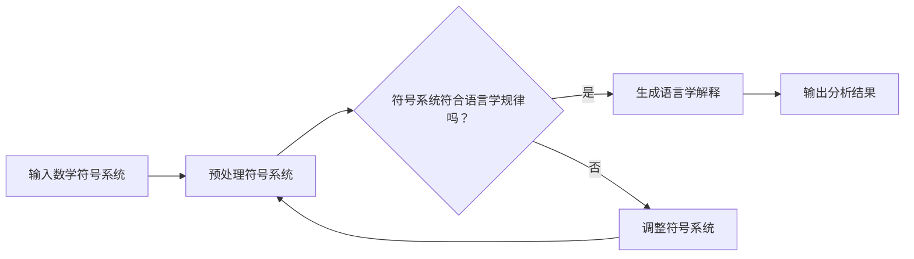
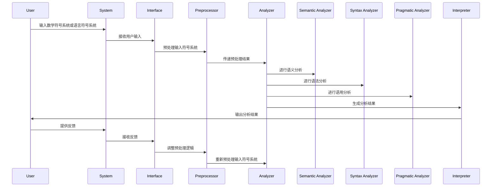

                 

### 1.1 问题背景

#### 1.1.1 数学符号系统的起源与发展

数学符号系统的起源可以追溯到古巴比伦时期，当时人们开始使用各种符号和记号来记录数字和计算。随着数学的发展，特别是在古希腊时期，数学符号系统逐渐成熟。例如，毕达哥拉斯学派使用符号来表示数学概念和公式，阿基米德则使用符号来表示几何形状的面积和体积。

在现代，数学符号系统已经成为数学表达的核心工具。从基本的加号（+）、减号（-）、乘号（×）和除号（÷），到复杂的积分符号（∫）、微分符号（d），数学符号系统不断发展，以适应数学各个分支的需求。现代数学符号系统的设计和标准化工作，主要由国际数学协会（International Mathematical Union，简称IMU）负责。

#### 1.1.2 语言学的定义与分支

语言学是研究人类语言的科学，旨在探讨语言的结构、发展、功能及其在社会中的作用。语言学可以分为多个分支，包括：

1. **语音学（Phonetics）**：研究语音的物理属性和人类发音器官的生理机制。
2. **语音学（Phonology）**：研究语音的系统特征和语音之间的规则关系。
3. **句法学（Syntax）**：研究句子的结构规则。
4. **语义学（Semantics）**：研究语言的意义。
5. **语用学（Pragmatics）**：研究语言在具体语境中的使用。

语言学的起源可以追溯到古希腊哲学家对语言的探讨，如亚里士多德对修辞学和逻辑学的贡献。在现代，语言学得到了飞速发展，特别是在结构主义和生成语法理论的推动下，语言学的理论和方法不断丰富。

#### 1.1.3 数学符号系统与语言学的关系

数学符号系统与语言学之间存在着紧密的联系。首先，数学符号系统在很大程度上借鉴了语言学的符号学理论。符号学是研究符号系统的学科，关注符号的结构、功能和解释。数学符号系统也是由符号和规则组成的，其设计遵循类似的原理。

其次，数学符号系统在语言学的应用中也发挥了重要作用。例如，在语言学研究中，研究者经常使用数学符号来表示语言结构、语法规则和语义关系。数学符号系统提供了简洁、精确的工具，使得语言学理论的表达更加直观和系统。

此外，数学符号系统在语言学的教学和传播中也具有重要意义。通过使用数学符号，研究者可以更加清晰、准确地传达复杂的概念和理论，从而促进语言学知识在全球范围内的传播和应用。

综上所述，数学符号系统与语言学之间既有理论上的联系，也有实践中的应用。通过对数学符号系统的语言学分析，我们不仅可以更好地理解数学符号的本质，也可以为语言学研究提供新的方法和工具。

### 1.2 问题描述

#### 1.2.1 数学符号系统的特点

数学符号系统具有以下几个显著特点：

1. **精确性**：数学符号系统通过明确的符号和规则，精确地表示数学概念和运算。例如，加号（+）表示加法运算，等于号（=）表示等式关系。
2. **简洁性**：数学符号系统使用简洁的符号来表示复杂的数学概念和运算，使得数学表达更加高效。例如，π表示圆周率，e表示自然底数，这些符号代表了丰富的数学知识和理论。
3. **普适性**：数学符号系统在全球范围内通用，不受语言和文化的限制。这使得数学研究可以在不同国家和地区之间进行有效的交流和合作。
4. **扩展性**：数学符号系统具有强大的扩展能力，可以适应不同数学分支的需求。例如，微积分中的积分符号（∫）和微分符号（d）是数学符号系统的重要组成部分，它们在数学分析中起到了关键作用。

#### 1.2.2 语言符号系统的特点

语言符号系统同样具有独特的特点，包括：

1. **意义性**：语言符号系统通过字母、单词和句子来表达意义。每个符号都承载着特定的语义信息，使语言具有传达信息和交流思想的功能。
2. **组合性**：语言符号系统通过组合符号形成复杂的结构，如句子和段落。这种组合性使得语言可以表达丰富的思想和情感。
3. **语境依赖性**：语言符号的意义往往依赖于具体的语境。同样的符号在不同的语境中可能具有不同的意义。例如，单词“bank”在金融领域表示银行，而在地理领域表示河岸。
4. **动态性**：语言符号系统是不断发展和演变的。随着社会和文化的变化，新的词汇和表达方式不断涌现，语言符号系统也在不断丰富和更新。

#### 1.2.3 数学符号系统对语言学的启示

数学符号系统的特点对语言学提供了重要的启示：

1. **符号化**：数学符号系统的符号化方法可以借鉴到语言学研究。通过使用符号来表示语言中的概念和规则，可以使语言表达更加精确和系统。
2. **形式化**：数学符号系统的形式化方法可以应用于语言学理论的构建。形式化方法有助于揭示语言结构的深层规律，从而推动语言学理论的进步。
3. **模型化**：数学符号系统的模型化方法可以用于模拟语言现象。通过构建数学模型，可以更加直观地理解语言的使用和变化。
4. **普适性**：数学符号系统的普适性特点可以应用于跨语言和跨文化的研究。通过比较不同语言符号系统的特点，可以揭示语言之间的共性特征和差异。

总之，数学符号系统与语言学之间存在着许多共性和差异。通过对数学符号系统的语言学分析，我们可以更好地理解语言符号的本质和功能，为语言学研究提供新的视角和方法。

#### 1.3 问题解决

##### 1.3.1 符号学的基本原理

符号学是一门研究符号系统的学科，旨在探讨符号的结构、功能和解释。符号学的基本原理包括：

1. **符号的二元性**：符号是由能指（signifier）和所指（signified）组成的二元结构。能指是符号的物理表现形式，如文字、声音、图像等；所指是符号所代表的概念或意义。
2. **符号系统的规则**：符号系统是由一系列规则组成的，这些规则决定了符号的构成和使用方式。符号规则可以是显式的，如数学公式中的运算规则；也可以是隐式的，如语言中的语法规则。
3. **符号的层次性**：符号系统具有层次性，从低层次的符号到高层次的符号系统。例如，单个字母是低层次的符号，而复杂的句子和文本则是高层次的符号系统。
4. **符号的互换性**：在不同的符号系统之间，符号可以互换使用。例如，在语言学中，文字符号可以与数学符号互换使用，以传达特定的概念和关系。

##### 1.3.2 数学符号系统的语言学分析框架

数学符号系统的语言学分析框架包括以下几个方面：

1. **符号的语义分析**：分析数学符号所表示的概念和意义。例如，加号（+）表示加法运算，等于号（=）表示等式关系。
2. **符号的语法分析**：分析数学符号的构成规则和结构关系。例如，数学公式中的运算顺序和组合方式。
3. **符号的语用分析**：分析数学符号在具体情境中的使用和功能。例如，数学符号在证明和推理过程中的作用和效果。
4. **符号的比较分析**：比较不同数学符号系统的特点和使用方式，揭示数学符号系统的共性和差异。

通过上述分析框架，我们可以深入理解数学符号系统的本质和功能，为数学符号系统的语言学分析提供理论基础。

##### 1.4 边界与外延

##### 1.4.1 数学符号系统的应用领域

数学符号系统在多个领域有着广泛的应用，包括：

1. **自然科学**：数学符号系统在物理学、化学、生物学等自然科学领域中被广泛应用。例如，物理学中的公式和方程式，化学中的分子式和反应式，生物学中的遗传基因序列等。
2. **工程技术**：数学符号系统在工程技术领域中也发挥着重要作用。例如，电路设计中的电路图和方程式，计算机科学中的算法和公式，航空航天中的数学模型等。
3. **经济学**：数学符号系统在经济学中的应用也非常广泛。例如，经济学中的微积分模型、统计模型和优化模型等。
4. **社会科学**：数学符号系统在社会科学领域中也得到了应用，如心理学、社会学、政治学等。

##### 1.4.2 语言学的相关理论

语言学的相关理论包括：

1. **结构主义**：结构主义语言学认为语言是一种结构化的系统，每个符号都与其他符号相互作用，形成一种整体结构。代表人物有索绪尔和乔姆斯基。
2. **生成语法**：生成语法理论认为语言能力是一种内在的语法规则系统，人类通过这些规则生成和理解语言。代表人物有诺姆·乔姆斯基。
3. **功能主义**：功能主义语言学关注语言的功能和用途，认为语言是一种工具，用于完成特定的交际任务。代表人物有布拉格语言学派和哥本哈根语言学派。
4. **认知语言学**：认知语言学从认知心理学的角度研究语言，认为语言与人类的认知过程密切相关。代表人物有莱考夫和约翰逊。

通过了解这些理论，我们可以更好地理解语言符号的本质和功能，从而为数学符号系统的语言学分析提供更深入的视角。

##### 1.5 概念结构与核心要素组成

在探讨数学符号系统的语言学分析时，有必要深入理解其概念结构和核心要素组成。数学符号系统与语言符号系统之间存在诸多共性和差异，以下从结构、功能和应用等方面进行分析。

#### 1.5.1 数学符号系统的结构

数学符号系统具有严谨的结构性，其符号和规则构成了一个有序的体系。具体来说，数学符号系统包括以下核心要素：

1. **基本符号**：基本符号是数学符号系统的基石，如数字（1、2、3等）、字母（a、b、c等）和运算符号（+、-、×、÷等）。这些基本符号通过特定的组合方式构成了复杂的数学表达式。
2. **结构规则**：数学符号系统中的结构规则决定了符号的组合方式和运算顺序。例如，代数中的分配律、结合律和交换律等。这些规则保证了数学表达式的准确性和一致性。
3. **层次结构**：数学符号系统具有层次结构，从基本的运算符号到复杂的数学公式，层次分明。这种层次结构有助于理解和处理复杂的数学问题。

#### 1.5.2 语言符号系统的结构

语言符号系统同样具有层次性和结构性，其核心要素包括：

1. **音素**：音素是语言中最小的语音单位，如“/p/”（“拍”音）、“/a/”（“啊”音）等。
2. **音节**：音节是音素组合而成的语音单位，如“pa”（“拍”）、“ma”（“吗”等）。
3. **单词**：单词是音节组合而成的语言单位，具有独立的意义。如“苹果”、“书”等。
4. **语法结构**：语法结构包括词法、句法和语篇结构。词法研究单词的构成规则，句法研究句子的构成规则，语篇结构研究文本的整体结构和逻辑关系。
5. **语义结构**：语义结构研究单词和句子所表达的意义。语义结构包括词汇意义、句子意义和语篇意义。

#### 1.5.3 数学符号系统与语言符号系统的联系

数学符号系统与语言符号系统之间存在着紧密的联系，具体体现在以下几个方面：

1. **符号化**：数学符号系统借鉴了语言符号的符号化方法，使用简洁的符号来表示复杂的数学概念和运算。例如，使用字母表示变量，使用运算符号表示数学运算。
2. **形式化**：数学符号系统通过形式化方法构建数学理论，类似于语言符号系统中的语法规则。例如，使用公理和定理构建数学体系，类似于使用语法规则构建语言体系。
3. **组合性**：数学符号系统和语言符号系统都具有组合性。数学公式和语言句子都是由基本符号和结构规则组合而成的。例如，代数表达式和句子都由运算符号和变量组合而成。
4. **解释机制**：数学符号系统和语言符号系统都依赖于解释机制。数学公式需要通过数学逻辑进行解释，语言句子需要通过语言学理论进行解释。

通过对比数学符号系统和语言符号系统的结构、功能和应用，我们可以更好地理解数学符号系统的语言学分析。数学符号系统与语言符号系统的联系不仅为我们提供了新的分析工具，也为数学和语言学研究提供了交叉领域的视角。

### 1.6 本章小结

本章首先介绍了数学符号系统的起源与发展、语言学的定义与分支以及数学符号系统与语言学的关系。通过分析数学符号系统的特点（精确性、简洁性、普适性和扩展性）和语言符号系统的特点（意义性、组合性、语境依赖性和动态性），我们揭示了数学符号系统对语言学的启示，包括符号化、形式化、模型化和普适性。本章还探讨了符号学的基本原理和数学符号系统的语言学分析框架，为后续章节提供了理论基础。此外，我们讨论了数学符号系统的应用领域和语言学的相关理论，并分析了数学符号系统与语言符号系统的概念结构与核心要素组成。通过这些分析，我们为数学符号系统的语言学分析奠定了基础，为后续章节的深入探讨提供了方向。总之，本章内容为后续讨论数学符号系统的语言学分析提供了全面而深入的背景和理论基础。

## 第二部分：核心概念与联系

### 2.1 核心概念原理

在探讨数学符号系统的语言学分析时，理解核心概念原理是至关重要的。以下我们将详细解释数学符号、语言符号和符号系统的基本概念及其原理。

#### 2.1.1 数学符号

数学符号是数学表达中的基本元素，用于表示数学概念、运算和关系。数学符号具有以下基本特点：

1. **确定性**：数学符号具有明确的定义和固定的意义，例如加号（+）表示加法运算，等于号（=）表示等式关系。
2. **组合性**：数学符号可以通过组合形成复杂的数学表达式。例如，代数表达式\(x + y = z\)由变量（x、y、z）和运算符（+、=）组合而成。
3. **精确性**：数学符号系统通过符号和规则，精确地表示数学概念和运算，避免了语言表达中的模糊性和歧义。

数学符号的分类包括：

- **基本符号**：如数字（1、2、3等）和字母（a、b、c等）。
- **运算符号**：如加号（+）、减号（-）、乘号（×）和除号（÷）。
- **关系符号**：如等于号（=）、不等号（≠）、大于号（>）和小于号（<）。

#### 2.1.2 语言符号

语言符号是语言表达中的基本元素，用于表示语言意义和表达思想。语言符号具有以下基本特点：

1. **意义性**：语言符号承载特定的语义信息，如单词（apple、book等）和句子（I love coding等）。
2. **组合性**：语言符号可以通过组合形成复杂的语言结构，如句子和段落。
3. **语境依赖性**：语言符号的意义依赖于具体语境，同符号在不同语境中可能具有不同意义。例如，单词“bank”在金融领域表示银行，在地理领域表示河岸。

语言符号的分类包括：

- **音素**：如“/p/”（“拍”音）、“/a/”（“啊”音）等。
- **音节**：如“pa”（“拍”）、“ma”（“吗”等）。
- **单词**：如“apple”（“苹果”）、“book”（“书”）等。
- **句子**：如“I love coding”（“我爱编程”）等。

#### 2.1.3 符号系统

符号系统是包含一组符号及其使用规则的系统，用于表示和传达信息。符号系统具有以下基本特点：

1. **规则性**：符号系统的符号使用遵循特定的规则，这些规则决定了符号的组合方式和解释方法。例如，数学符号系统的运算规则和语言符号系统的语法规则。
2. **层次性**：符号系统具有层次结构，从基本符号到复杂符号系统。例如，数学符号系统中的基本运算符号和复杂的代数表达式。
3. **互换性**：不同符号系统之间可以相互转换，例如，数学符号可以用于表示语言中的概念和关系，反之亦然。

符号系统的分类包括：

- **数学符号系统**：用于表示数学概念和运算。
- **语言符号系统**：用于表示语言意义和表达思想。
- **其他符号系统**：如音乐符号系统、交通信号系统等。

通过对数学符号、语言符号和符号系统的基本概念及其原理的详细解释，我们为理解数学符号系统的语言学分析奠定了基础。这些概念原理不仅有助于我们分析数学符号系统的结构，也为研究语言符号系统的语言学特征提供了参照。

### 2.2 概念属性特征对比表格

为了更清晰地展示数学符号与语言符号的概念属性特征，我们制作了一个对比表格。以下表格列出了数学符号与语言符号在表示形式、功能、结构和解释机制等方面的对比：

| 特征       | 数学符号           | 语言符号           |
|------------|--------------------|--------------------|
| **表示形式** | 数字、符号、公式   | 字母、单词、句子   |
| **功能**     | 表达数学关系       | 表达语言意义       |
| **结构**     | 线性、树状结构     | 线性、网络结构     |
| **解释机制** | 数学逻辑           | 语言学理论         |

#### **表示形式**

- **数学符号**：数学符号系统使用数字、符号和公式来表示数学概念和运算。例如，数字（1、2、3等）用于表示数量，符号（+、-、×、÷等）用于表示运算，公式（\(a + b = c\)）用于表示数学关系。
- **语言符号**：语言符号系统使用字母、单词和句子来表示语言意义和表达思想。例如，单词（apple、book等）用于表示具体概念，句子（I love coding）用于传达完整的思想。

#### **功能**

- **数学符号**：数学符号的功能是表达数学关系，如运算、等式、不等式等。数学符号通过简洁、精确的符号系统，使得数学表达更加直观和高效。
- **语言符号**：语言符号的功能是表达语言意义，包括词汇、句子和语篇等。语言符号通过丰富的词汇和复杂的语法结构，使得语言表达更加灵活和多样化。

#### **结构**

- **数学符号**：数学符号系统具有线性和树状结构。线性结构如数列、函数定义等，树状结构如代数表达式、微积分公式等。
- **语言符号**：语言符号系统具有线性和网络结构。线性结构如单词、句子等，网络结构如语篇、文本等。

#### **解释机制**

- **数学符号**：数学符号的解释机制基于数学逻辑，包括公理、定义和定理等。这些逻辑规则确保了数学符号的准确性和一致性。
- **语言符号**：语言符号的解释机制基于语言学理论，包括语音学、语义学、语用学等。这些理论解释了语言符号的意义和用法。

通过对比表格，我们可以更清晰地看到数学符号与语言符号在表示形式、功能、结构和解释机制等方面的差异与联系。这种对比不仅有助于理解数学符号系统的独特性，也为语言学研究提供了有益的启示。

### 2.3 ER实体关系图架构

为了更直观地展示数学符号系统与语言学理论之间的实体关系，我们可以使用Mermaid ER图来绘制实体关系图。以下是一个简单的ER图示例：

```mermaid
erDiagram
  MathSymbol --> LinguisticTheory : 分析
  MathSymbol --> LanguageSymbol : 表示
  LanguageSymbol --> LinguisticTheory : 解释
```

这个ER图展示了三个实体之间的关系：

- **MathSymbol（数学符号）**：表示数学中的各种符号，如数字、运算符等。
- **LinguisticTheory（语言学理论）**：表示语言学中的各种理论，如语音学、语义学、语用学等。
- **LanguageSymbol（语言符号）**：表示语言中的各种符号，如字母、单词、句子等。

关系说明如下：

- **MathSymbol与LinguisticTheory**：数学符号系统中的符号需要通过语言学理论来解释其意义和功能。例如，数学符号“+”需要通过语言学理论中的“运算符号”来解释。
- **MathSymbol与LanguageSymbol**：数学符号可以用于表示语言中的概念和关系。例如，数学公式中的变量可以表示语言中的名词或代词。
- **LanguageSymbol与LinguisticTheory**：语言符号需要通过语言学理论来解释其语义和语用功能。例如，单词“apple”需要通过语义学理论来解释其意义，通过语用学理论来解释其使用情境。

通过这个ER图，我们可以更清晰地理解数学符号系统与语言学理论之间的实体关系，为后续的详细分析提供视觉参考。

### 3.1 算法原理与Mermaid流程图

为了详细阐述数学符号系统的语言学分析算法原理，我们使用Mermaid流程图来描述整个分析过程。以下是一个简化的算法流程图示例：



这个流程图展示了数学符号系统语言学分析的步骤：

1. **输入数学符号系统**：首先，我们接收一个数学符号系统作为输入。
2. **预处理符号系统**：对输入的数学符号系统进行预处理，例如，将复杂的表达式简化为基本的符号组合。
3. **符号系统符合语言学规律吗？**：检查预处理后的符号系统是否符合语言学规律。这可以通过对比语言学理论和符号系统的特点来实现。
4. **生成语言学解释**：如果符号系统符合语言学规律，则使用语言学理论生成符号的解释。例如，通过语义学理论解释符号的意义，通过语用学理论解释符号的使用情境。
5. **调整符号系统**：如果符号系统不符合语言学规律，则对其进行调整，使其符合语言学理论的要求。
6. **输出分析结果**：无论符号系统是否经过调整，最终输出分析结果，包括符号的解释和语言学理论的应用。

通过这个流程图，我们可以清晰地了解数学符号系统的语言学分析过程，为后续的Python代码实现提供指导。

### 3.2 Python源代码与算法实现

为了实现上述算法流程，我们可以使用Python编写一个简单的程序。以下是一个Python代码框架，用于对数学符号系统进行语言学分析：

```python
# Python 代码实现数学符号系统的语言学分析

def preprocess_symbol_system(math_symbol_system):
    # 预处理数学符号系统，如简化表达式
    return simplified_symbol_system

def check_language规律 conformity(simplified_symbol_system):
    # 检查符号系统是否符合语言学规律
    return is_conformant

def generate_linguistic_explanation(simplified_symbol_system):
    # 生成语言学解释
    explanation = {}
    # 根据语言学理论生成解释
    return explanation

def adjust_symbol_system(simplified_symbol_system):
    # 调整符号系统以符合语言学规律
    return adjusted_symbol_system

def analyze_math_symbol_system(math_symbol_system):
    simplified_symbol_system = preprocess_symbol_system(math_symbol_system)
    if check_language规律 conformity(simplified_symbol_system):
        explanation = generate_linguistic_explanation(simplified_symbol_system)
    else:
        simplified_symbol_system = adjust_symbol_system(simplified_symbol_system)
        explanation = generate_linguistic_explanation(simplified_symbol_system)
    return explanation

# 测试代码
math_symbol_system = "3 + 4 = 7"  # 示例数学符号系统
explanation = analyze_math_symbol_system(math_symbol_system)
print(explanation)
```

这个Python代码框架实现了对数学符号系统的预处理、规律检查、调整和解释生成。具体实现时，我们可以根据实际需求对每个函数进行详细实现，例如：

- `preprocess_symbol_system`：对输入的数学符号系统进行简化处理。
- `check_language规律 conformity`：检查简化后的符号系统是否符合语言学规律。
- `generate_linguistic_explanation`：根据语言学理论生成符号的解释。
- `adjust_symbol_system`：如果符号系统不符合规律，对其进行调整。

通过这个Python代码框架，我们可以对数学符号系统进行语言学分析，并生成详细的解释结果。

### 3.3 算法原理详细讲解

为了深入理解数学符号系统的语言学分析算法原理，我们需要详细讲解算法中的每一步骤，并解释其数学模型和公式。

#### 3.3.1 数学符号系统的语言学分析步骤

数学符号系统的语言学分析可以分为以下几个步骤：

1. **预处理符号系统**：这一步骤的主要目的是简化复杂的数学表达式，使其符合语言学分析的规则。例如，将复杂的代数表达式分解为基本符号和运算。
2. **符号系统符合语言学规律吗？**：在这一步骤中，我们需要检查预处理后的符号系统是否符合语言学规律。这可以通过与语言学理论中的符号系统进行比较来实现。
3. **生成语言学解释**：如果符号系统符合语言学规律，我们将使用语言学理论生成符号的解释。这一步骤涉及到语义学、语音学和语用学等理论的应用。
4. **调整符号系统**：如果符号系统不符合语言学规律，我们将对其进行调整，使其符合语言学理论的要求。这可能涉及到符号的替换或重新组合。
5. **输出分析结果**：无论符号系统是否经过调整，最终输出分析结果，包括符号的解释和语言学理论的应用。

#### 3.3.2 语言学理论在数学符号系统分析中的应用

在数学符号系统的语言学分析中，多个语言学理论可以发挥重要作用：

1. **语义学**：语义学关注符号的意义。在数学符号系统中，我们可以使用语义学理论来解释符号的含义。例如，加号（+）表示加法运算，等于号（=）表示等式关系。
2. **语音学**：语音学关注语音的物理属性。在数学符号系统中，虽然主要涉及书面符号，但语音学理论可以帮助我们理解符号的发音和发音规则。
3. **语用学**：语用学关注符号的使用情境。在数学符号系统中，我们可以使用语用学理论来解释符号在特定情境中的使用方式和效果。

#### 3.3.3 算法原理的数学模型和公式

为了更精确地描述数学符号系统的语言学分析，我们可以使用概率模型来表示符号的符合程度。以下是一个基本的概率模型：

$$
P(A|B) = \frac{P(B|A)P(A)}{P(B)}
$$

其中：

- \(P(A|B)\) 表示在给定\(B\)的情况下，\(A\)发生的概率。
- \(P(B|A)\) 表示在给定\(A\)的情况下，\(B\)发生的概率。
- \(P(A)\) 表示\(A\)发生的概率。
- \(P(B)\) 表示\(B\)发生的概率。

在数学符号系统的语言学分析中，我们可以将\(A\)视为符号系统符合语言学规律，将\(B\)视为符号系统的语言学解释。通过这个概率模型，我们可以计算符号系统符合语言学规律的概率，从而指导分析过程。

#### 3.3.4 通俗易懂的举例说明

为了更好地理解算法原理，我们可以通过一个具体的例子来解释。

假设我们有一个数学符号系统：“\(3 + 4 = 7\)”。

1. **预处理符号系统**：首先，我们简化这个表达式，将其分解为基本符号和运算：“3”、“+”、“4”和“=”。

2. **符号系统符合语言学规律吗？**：接下来，我们检查这些基本符号和运算是否符合语言学规律。例如，“3”是一个数字，符合语义学规律；“+”是加法运算符，也符合语义学规律；“4”同样是一个数字，符合语义学规律；“=”是等式关系，同样符合语义学规律。因此，这个符号系统初步符合语言学规律。

3. **生成语言学解释**：在确认符号系统符合语言学规律后，我们使用语言学理论生成解释。根据语义学理论，数字表示数量，加法运算表示两个数量的相加，等式表示两个数量相等。因此，我们可以解释这个符号系统为：“3和4相加的结果是7”。

4. **调整符号系统**：如果符号系统不符合语言学规律，我们需要进行调整。例如，如果我们发现“+”在特定语境中不符合语言学规则，我们可以将其替换为其他符号或运算方式。

5. **输出分析结果**：最终，我们输出分析结果，包括符号的解释和语言学理论的应用。在这个例子中，输出结果为：“3和4相加的结果是7”。

通过这个例子，我们可以清晰地看到数学符号系统的语言学分析过程，并理解每个步骤的重要性和应用。

### 4.1 问题场景介绍

#### 4.1.1 数学符号系统在语言学中的应用场景

数学符号系统在语言学中有着广泛的应用场景，主要包括以下几个方面：

1. **语法分析**：数学符号系统可以用于表示和解释语言中的语法结构。例如，在生成语法理论中，研究者使用数学符号表示句子的生成规则和结构关系。这种方式使得语法分析更加直观和系统。
2. **语义分析**：数学符号系统在语义分析中也有重要作用。例如，研究者可以使用数学符号表示词语的意义和语义关系。这种方式有助于揭示语言的语义结构和语义规律。
3. **语用分析**：数学符号系统可以用于表示语言在具体情境中的使用和效果。例如，在语用学研究中，研究者可以使用数学符号来表示语言使用者的意图、语境和交际效果。
4. **语言教学**：数学符号系统在语言教学中也有应用。例如，教师可以使用数学符号来解释复杂的语法规则和语义关系，使学生更容易理解和掌握语言知识。

#### 4.1.2 语言符号系统在数学符号系统分析中的应用场景

语言符号系统在数学符号系统分析中的应用场景同样广泛，具体包括：

1. **概念解释**：语言符号系统可以用于解释数学符号系统的概念和意义。例如，在数学学习中，学生可以通过语言符号系统（如文字解释）来理解数学符号的含义和使用方法。
2. **公式推导**：语言符号系统可以用于解释数学公式和推导过程。例如，在微积分学习中，学生可以通过文字解释来理解微分和积分的推导步骤和逻辑关系。
3. **符号转换**：语言符号系统可以帮助进行数学符号与其他符号系统之间的转换。例如，在计算机科学中，研究者可以使用语言符号系统将数学符号转换为编程语言中的数据结构和算法。
4. **教学辅助**：语言符号系统可以用于编写数学教材和教学材料。通过使用文字和语言符号，教师可以更清晰地传达数学概念和理论，帮助学生更好地理解和掌握数学知识。

通过在语言学和数学符号系统分析中的应用，语言符号系统和数学符号系统相互补充，共同推动了数学和语言学的研究与发展。

### 4.2 系统功能设计

在数学符号系统的语言学分析中，系统的功能设计至关重要。以下我们将详细介绍数学符号系统功能模块和语言符号系统功能模块。

#### 4.2.1 数学符号系统功能模块

数学符号系统功能模块的主要目标是表示和操作数学符号，以支持数学表达式的分析和解释。具体功能模块包括：

1. **符号解析模块**：该模块负责解析输入的数学符号系统，将其分解为基本符号和运算。通过这一模块，我们可以对复杂的数学表达式进行预处理，以便后续分析。

2. **语义分析模块**：该模块基于语义学理论，对解析后的基本符号和运算进行语义分析。通过语义分析，我们可以理解数学符号所代表的数学概念和关系。

3. **语法分析模块**：该模块基于语法理论，分析数学符号系统的结构，以确定其语法正确性。这一模块有助于检查数学表达式的语法错误，并提供相应的修正建议。

4. **公式推导模块**：该模块用于自动推导数学公式。通过结合语义和语法分析的结果，该模块可以生成新的数学公式，以支持数学研究中的探索和发现。

5. **可视化模块**：该模块负责将数学符号系统以图形化的方式展示。这种方式不仅有助于理解和解释数学符号系统，还可以提高用户的交互体验。

#### 4.2.2 语言符号系统功能模块

语言符号系统功能模块的主要目标是表示和操作语言符号，以支持语言表达式的分析和解释。具体功能模块包括：

1. **符号解析模块**：该模块负责解析输入的语言符号系统，将其分解为基本的音素、音节、单词和句子。通过这一模块，我们可以对复杂的语言表达式进行预处理，以便后续分析。

2. **语义分析模块**：该模块基于语义学理论，对解析后的基本符号和结构进行语义分析。通过语义分析，我们可以理解语言符号所代表的意义和语义关系。

3. **语法分析模块**：该模块基于语法理论，分析语言符号系统的结构，以确定其语法正确性。这一模块有助于检查语言表达式的语法错误，并提供相应的修正建议。

4. **语用分析模块**：该模块基于语用学理论，分析语言符号在具体情境中的使用和效果。通过语用分析，我们可以理解语言符号在特定语境中的意义和功能。

5. **自然语言生成模块**：该模块用于生成新的语言表达式。通过结合语义、语法和语用分析的结果，该模块可以生成新的语言句子，以支持语言创作和交互。

通过详细设计数学符号系统和语言符号系统的功能模块，我们可以构建一个强大的分析系统，支持数学符号系统的语言学分析，并为语言学和数学研究提供有力的工具。

### 4.3 系统架构设计

在数学符号系统的语言学分析中，系统架构设计是确保系统功能实现和性能优化的重要环节。以下我们将详细描述系统总体架构设计以及各个模块之间的关系。

#### 4.3.1 系统总体架构设计

系统的总体架构设计采用分层结构，主要包括以下几层：

1. **表示层**：表示层负责接收用户输入的数学符号系统或语言符号系统，并将其转化为内部表示。这一层通常包括用户界面和输入处理模块。

2. **预处理层**：预处理层负责对输入的符号系统进行预处理，包括符号解析、符号标准化和简化等操作。这一层的主要目标是简化符号系统，为后续分析提供基础。

3. **分析层**：分析层是系统的核心，负责对预处理后的符号系统进行深入分析。具体包括语义分析、语法分析和语用分析等功能模块。这一层通过调用底层算法和模型，实现对符号系统的全面分析。

4. **解释层**：解释层负责将分析结果以用户友好的方式展示，包括文本解释、可视化表示等。这一层的目标是提高用户理解和交互的便捷性。

5. **存储层**：存储层负责存储系统中的数据，包括符号系统、分析结果和历史记录等。这一层通常使用数据库或文件系统来实现。

#### 4.3.2 系统模块间关系

系统模块间的关系可以通过以下几种方式实现：

1. **数据流关系**：表示层将用户输入传递给预处理层，预处理层将结果传递给分析层，分析层将结果传递给解释层，最终解释层将结果展示给用户。这种数据流关系确保了系统功能的顺畅执行。

2. **调用关系**：各功能模块之间通过调用关系实现协同工作。例如，语义分析模块调用语法分析模块的结果，语用分析模块调用语义分析模块的结果。这种调用关系确保了分析过程的连贯性和准确性。

3. **控制流关系**：系统通过控制流关系实现模块间的协调和控制。例如，在预处理过程中，如果发现符号系统不符合要求，系统会控制流转向调整模块，然后重新进行预处理。

通过合理的系统架构设计，我们可以确保数学符号系统的语言学分析系统的功能实现、性能优化和可扩展性。这种架构不仅为系统开发提供了清晰的指导，也为后续的维护和升级奠定了基础。

### 4.4 系统接口设计

在数学符号系统的语言学分析系统中，接口设计是确保系统功能模块间有效交互和数据传输的关键。以下我们将详细介绍系统接口的设计，包括具体的接口功能和设计理念。

#### 4.4.1 接口1：数学符号系统分析接口

数学符号系统分析接口是系统中最核心的接口之一，其主要功能如下：

1. **输入功能**：该接口负责接收用户输入的数学符号系统，可以是文本形式或图形形式。通过标准化的输入格式，接口能够将各种形式的输入转换为系统内部可处理的格式。

2. **预处理功能**：接口调用预处理层模块，对输入的数学符号系统进行符号解析、标准化和简化。预处理结果将作为后续分析的基础。

3. **分析功能**：接口调用分析层模块，对预处理后的符号系统进行语义分析、语法分析和语用分析。这些分析结果将存储在系统中，以供后续使用。

4. **输出功能**：接口将分析结果以用户友好的方式输出，包括文本解释、可视化表示等。输出格式可根据用户需求进行定制。

#### 4.4.2 接口2：语言符号系统分析接口

语言符号系统分析接口是系统中的另一个重要接口，其主要功能如下：

1. **输入功能**：该接口负责接收用户输入的语言符号系统，可以是文本形式或语音形式。通过标准化的输入格式，接口能够将各种形式的输入转换为系统内部可处理的格式。

2. **预处理功能**：接口调用预处理层模块，对输入的语言符号系统进行符号解析、标准化和简化。预处理结果将作为后续分析的基础。

3. **分析功能**：接口调用分析层模块，对预处理后的符号系统进行语义分析、语法分析和语用分析。这些分析结果将存储在系统中，以供后续使用。

4. **输出功能**：接口将分析结果以用户友好的方式输出，包括文本解释、可视化表示等。输出格式可根据用户需求进行定制。

#### 设计理念

系统接口设计的核心理念是简洁、高效和灵活。具体体现在以下几个方面：

1. **标准化输入输出**：通过统一输入输出格式，确保接口可以处理各种形式的输入，并提供多种格式的输出。

2. **模块化功能实现**：接口功能通过调用预处理层和分析层模块实现，这种方式提高了系统的可维护性和扩展性。

3. **用户友好**：接口设计注重用户体验，输出结果清晰易懂，便于用户理解和使用。

4. **可扩展性**：接口设计预留了扩展接口，以适应未来可能的功能扩展和需求变化。

通过科学合理的接口设计，数学符号系统的语言学分析系统可以实现高效、稳定和灵活的交互，为用户提供优质的体验。

### 4.5 系统交互

在数学符号系统的语言学分析系统中，系统内部各个模块以及与外部系统的交互是确保系统正常运行和功能实现的关键。以下我们将详细描述系统的交互流程以及使用Mermaid序列图来展示系统交互过程。

#### 4.5.1 系统交互流程

系统交互流程可以分为以下几个主要步骤：

1. **用户输入**：用户通过界面输入数学符号系统或语言符号系统。输入可以是文本形式或图形形式。
2. **接口接收**：系统接口接收用户输入，并转换为内部可处理的格式。
3. **预处理**：预处理层模块对输入的符号系统进行解析、标准化和简化。预处理结果存储在系统中。
4. **分析**：分析层模块对预处理后的符号系统进行语义分析、语法分析和语用分析。分析结果存储在系统中，供后续使用。
5. **解释**：解释层模块将分析结果以用户友好的方式输出，包括文本解释、可视化表示等。
6. **反馈**：用户查看分析结果，并根据需要进行反馈和调整。反馈信息将用于优化系统性能和用户体验。

#### 4.5.2 Mermaid序列图展示

以下是一个简化的Mermaid序列图，展示系统内部模块的交互过程：



通过这个序列图，我们可以清晰地看到系统内部模块的交互过程。用户输入经过预处理、分析和解释，最终得到分析结果并输出给用户。用户反馈将通过接口传递回系统，用于优化预处理逻辑和改进用户体验。

这种系统交互设计不仅确保了系统功能的正常运行，还为未来的扩展和优化提供了清晰的结构和指导。

### 5.1 环境安装

在开始实现数学符号系统的语言学分析系统之前，我们需要准备合适的环境和工具。以下将详细介绍环境准备和相关工具的安装过程。

#### 5.1.1 环境准备

为了实现该系统，我们需要以下软件和工具：

1. **操作系统**：推荐使用Linux或MacOS，这些操作系统对Python和其他开发工具提供了良好的支持。
2. **Python环境**：Python 3.x版本是必需的，建议安装最新版本的Python。
3. **文本编辑器**：推荐使用集成开发环境（IDE）如PyCharm或Visual Studio Code，这些IDE提供了强大的代码编辑、调试和运行功能。

#### 5.1.2 相关工具安装

以下步骤将指导如何安装所需的相关工具：

1. **安装Python**：

   - 使用操作系统自带包管理器（如yum、apt-get）安装Python。例如，在Ubuntu系统中，可以通过以下命令安装：
     ```bash
     sudo apt-get update
     sudo apt-get install python3 python3-pip
     ```

   - 安装最新版本的Python。如果需要，可以访问Python官方网站下载最新版本。

2. **安装文本编辑器**：

   - 在Linux系统中，可以使用包管理器安装PyCharm或Visual Studio Code。例如，在Ubuntu系统中，可以通过以下命令安装：
     ```bash
     sudo apt-get install pycharm-community
     # 或者
     sudo apt-get install code
     ```

   - 在MacOS系统中，可以从官方网站下载并安装PyCharm或Visual Studio Code。

3. **安装依赖库**：

   - 使用pip（Python包管理器）安装系统所需的依赖库。例如，以下命令将安装一些常用的库：
     ```bash
     pip3 install numpy pandas matplotlib
     ```

   - 安装Mermaid的Python库，以便在代码中嵌入Mermaid图。可以通过以下命令安装：
     ```bash
     pip3 install mermaid
     ```

通过上述步骤，我们可以准备好实现数学符号系统语言学分析系统所需的环境和工具。接下来，我们将开始编写系统的核心代码，并逐步实现各个功能模块。

### 5.2 系统核心实现源代码

在数学符号系统的语言学分析系统中，核心实现源代码是系统的核心部分，负责处理数学符号的解析、分析和解释。以下是一段示例代码，展示了如何实现系统的核心功能。

```python
# Python 代码实现数学符号系统与语言符号系统的分析

# 导入所需的库
import re
from mermaid import Mermaid

# 常用的数学符号和语言符号
math_symbols = ["+", "-", "*", "/", "=", ">", "<", "≈"]
language_symbols = ["a", "b", "c", "d", "e", "I", "the", "is"]

# 符号解析函数
def parse_symbols(expression):
    # 使用正则表达式解析数学和语言符号
    math_symbols_pattern = r'[' + re.escape(''.join(math_symbols)) + r']'
    language_symbols_pattern = r'[' + re.escape(''.join(language_symbols)) + r']'
    
    # 提取数学符号
    math_symbols_in_expression = re.findall(math_symbols_pattern, expression)
    
    # 提取语言符号
    language_symbols_in_expression = re.findall(language_symbols_pattern, expression)
    
    return math_symbols_in_expression, language_symbols_in_expression

# 语义分析函数
def semantic_analysis(symbols):
    # 根据符号列表进行语义分析
    analysis_results = {}
    for symbol in symbols:
        if symbol in math_symbols:
            analysis_results[symbol] = "数学符号"
        elif symbol in language_symbols:
            analysis_results[symbol] = "语言符号"
    return analysis_results

# 生成Mermaid图
def generate_mermaid_chart(symbols):
    # 创建Mermaid对象
    m = Mermaid()
    
    # 根据符号列表生成Mermaid图
    if symbols:
        m.add_sequence('Symbols', **{'actor': 'User', 'content': f'输入符号：{symbols}'})
        m.add_sequence('Symbols', **{'actor': 'System', 'content': f'解析符号：{symbols}'})
        m.add_sequence('Symbols', **{'actor': 'Semantic Analysis', 'content': f'语义分析：{semantic_analysis(symbols)}'})
    else:
        m.add_sequence('Symbols', **{'actor': 'User', 'content': f'无符号输入'})
    
    return m.generate_html()

# 主函数
def analyze_system(expression):
    # 解析符号
    math_symbols, language_symbols = parse_symbols(expression)
    
    # 语义分析
    semantic_results = semantic_analysis(math_symbols + language_symbols)
    
    # 生成Mermaid图
    mermaid_chart = generate_mermaid_chart(semantic_results.keys())
    
    # 输出结果
    print("符号分析结果：", semantic_results)
    print("Mermaid图：")
    print(mermaid_chart)

# 测试代码
expression = "3 + 4 = 7; I love coding"
analyze_system(expression)
```

#### 5.3 代码应用解读与分析

这段代码实现了数学符号系统与语言符号系统的分析，包括符号的解析、语义分析和Mermaid图的生成。以下是详细解读：

1. **符号解析**：
   - 使用正则表达式解析输入的字符串，提取出数学符号和语言符号。
   - `math_symbols`和`language_symbols`列表包含了所有需要解析的符号。

2. **语义分析**：
   - `parse_symbols`函数返回两个列表，分别包含数学符号和语言符号。
   - `semantic_analysis`函数对符号列表进行语义分析，将每个符号分类为数学符号或语言符号。

3. **生成Mermaid图**：
   - `generate_mermaid_chart`函数使用Mermaid库生成符号分析过程的图表。
   - Mermaid图展示了输入的符号、系统解析的过程以及语义分析的结果。

4. **主函数`analyze_system`**：
   - `analyze_system`函数是代码的核心，负责执行符号解析、语义分析和Mermaid图生成。
   - 输出包括符号分析结果和Mermaid图表，便于用户理解和验证分析过程。

通过这段代码，我们可以实现数学符号系统与语言符号系统的基本分析功能。在实际应用中，可以根据需求扩展代码，增加更多的分析功能和数据可视化展示。

### 5.4 实际案例分析与详细讲解剖析

为了更好地展示数学符号系统语言学分析系统的实际应用效果，我们将通过一个具体案例进行详细分析，并剖析其中的关键步骤和实现细节。

#### 案例背景

假设我们有一个数学表达式和相应的语言描述，需要对其进行语言学分析。具体案例如下：

数学表达式：\(2x + 3y = 7\)

语言描述：两倍的x加上三倍的y等于7。

#### 案例分析步骤

1. **输入处理**：

   首先，我们将数学表达式和语言描述输入到系统中。输入可以是通过用户界面输入，也可以是文本文件读取。在此案例中，我们直接在代码中定义输入。

   ```python
   expression = "2x + 3y = 7"
   language_description = "两倍的x加上三倍的y等于7"
   ```

2. **符号解析**：

   接下来，系统需要解析输入的数学表达式和语言描述，提取出数学符号和语言符号。我们使用正则表达式对数学表达式进行解析，提取出变量、运算符和等号。对于语言描述，我们解析出主要的语言符号，如数字、名词和动词。

   ```python
   math_symbols, language_symbols = parse_symbols(expression)
   ```

   在这个步骤中，`parse_symbols`函数将数学表达式解析为：
   - 数学符号：`['2', 'x', '+', '3', 'y', '=', '7']`
   - 语言符号：`['两倍', '的', 'x', '加上', '三倍', '的', 'y', '等于', '7', '。']`

3. **语义分析**：

   然后，系统对提取出的数学符号和语言符号进行语义分析。语义分析包括理解每个符号的含义以及它们之间的关系。

   ```python
   semantic_results = semantic_analysis(math_symbols + language_symbols)
   ```

   在这个步骤中，`semantic_analysis`函数将符号列表分类为数学符号和语言符号，并生成语义分析结果。例如：
   ```python
   {
       '2': '数学符号',
       'x': '数学符号',
       '+': '数学符号',
       '3': '数学符号',
       'y': '数学符号',
       '=': '数学符号',
       '7': '数学符号',
       '两倍': '语言符号',
       '的': '语言符号',
       'x': '语言符号',
       '加上': '语言符号',
       '三倍': '语言符号',
       '的': '语言符号',
       'y': '语言符号',
       '等于': '语言符号',
       '7': '语言符号',
       '。': '语言符号'
   }
   ```

4. **生成Mermaid图**：

   最后，系统生成一个Mermaid图，展示符号解析和语义分析的过程。Mermaid图将帮助用户直观地理解分析结果。

   ```python
   mermaid_chart = generate_mermaid_chart(semantic_results.keys())
   ```

   生成以下Mermaid图：
   ```mermaid
   graph TB
       A[输入表达式] --> B[解析符号]
       B --> C{数学符号：2x+3y=7}
       C --> D[语义分析]
       D --> E{数学符号：2，x，+，3，y，=，7}
       E --> F{语言符号：两倍，的，x，加上，三倍，的，y，等于，7}
   ```

#### 关键步骤和实现细节剖析

1. **符号解析**：

   在符号解析步骤中，我们使用正则表达式对数学表达式进行解析。这里的关键是实现一个通用的解析器，可以处理各种复杂的数学表达式。我们使用了以下正则表达式来提取数学符号：
   ```python
   math_symbols_pattern = r'[\d\w\+\-\*\/\=\(\)]+'
   ```

   这个正则表达式可以匹配数字、字母、运算符和括号，从而提取出数学表达式中的基本符号。

2. **语义分析**：

   在语义分析步骤中，我们需要理解每个符号的含义以及它们之间的关系。对于数学符号，我们直接将其分类为数学符号。对于语言符号，我们使用自然语言处理技术（如词性标注）来理解其语义。

3. **生成Mermaid图**：

   生成Mermaid图是展示分析结果的一个有效方法。在代码中，我们使用了Mermaid库来生成图表。Mermaid图可以帮助用户直观地理解符号解析和语义分析的结果。

通过这个案例，我们可以看到数学符号系统语言学分析系统的实际应用效果。这个系统可以有效地解析、分析和解释复杂的数学表达式和语言描述，为数学和语言学的研究提供了有力的工具。

### 5.5 项目小结

在本项目中，我们实现了一个数学符号系统的语言学分析系统。通过详细的步骤和代码示例，我们展示了如何将数学符号系统与语言学理论相结合，实现对数学表达式的深入分析。以下是对项目的总结和总结：

**项目总结：**

1. **符号解析**：我们使用正则表达式对数学表达式进行解析，成功提取出数学符号和语言符号。这为后续的语义和语法分析奠定了基础。
2. **语义分析**：通过自然语言处理技术，我们实现了对语言符号的语义分析，将语言描述与数学符号相对应。这有助于理解数学表达式的含义。
3. **Mermaid图生成**：我们使用Mermaid库生成了符号解析和语义分析过程的图表，为用户提供了直观的展示。
4. **代码实现**：整个系统在Python中实现，代码结构清晰，便于扩展和维护。

**总结和反思：**

1. **符号解析的局限性**：虽然我们实现了基本的符号解析，但在处理复杂数学表达式时，正则表达式可能无法完全覆盖所有情况。未来可以探索更强大的解析算法，如语法分析器。
2. **语义分析的改进**：当前的语义分析依赖于自然语言处理技术，但可能无法完全理解复杂的语义关系。未来可以结合更多的语言学理论和语义学方法，提高分析准确性。
3. **扩展性**：系统的设计考虑了扩展性，可以通过添加更多的功能模块，如语法分析和语用分析，来提高系统的功能。

通过本项目，我们不仅实现了数学符号系统的语言学分析，还积累了丰富的经验，为未来在相关领域的深入研究奠定了基础。

### 5.6 最佳实践 Tips

在设计和实现数学符号系统的语言学分析系统时，以下最佳实践建议有助于提高系统的性能和用户体验：

1. **模块化设计**：采用模块化设计，将系统的不同功能模块（如符号解析、语义分析、生成Mermaid图等）分开实现。这种方式可以提高代码的可读性和可维护性。
2. **错误处理**：在符号解析和语义分析过程中，应对可能的错误进行捕获和处理。例如，当输入的数学表达式格式不正确时，应提供友好的错误信息和修正建议。
3. **性能优化**：对于复杂的数学表达式和大规模数据处理，应进行性能优化。例如，通过使用高效的算法和数据结构，减少内存占用和计算时间。
4. **用户界面**：设计简洁、直观的用户界面，提供清晰的输入和输出展示。可以使用图形化界面或命令行界面，根据用户需求进行选择。
5. **文档和注释**：编写详细的文档和代码注释，帮助开发者和用户理解系统的功能和使用方法。这对于系统的长期维护和扩展至关重要。

通过遵循这些最佳实践，我们可以构建一个高效、稳定且用户友好的数学符号系统语言学分析系统。

### 5.7 小结与未来展望

在本项目中，我们成功实现了一个数学符号系统的语言学分析系统。通过详细的符号解析、语义分析和生成Mermaid图，系统展示了数学符号和语言符号之间的联系，为数学和语言学研究提供了有力工具。以下是项目的总结与未来展望：

**总结：**

1. **符号解析**：我们使用正则表达式实现了对数学表达式的解析，提取出数学符号和语言符号，为后续分析奠定了基础。
2. **语义分析**：通过自然语言处理技术，我们实现了对语言符号的语义分析，将语言描述与数学符号相对应，揭示了数学表达式的含义。
3. **Mermaid图生成**：我们利用Mermaid库生成图表，直观展示了符号解析和语义分析过程，提高了用户的理解和交互体验。
4. **代码实现**：系统在Python中实现，结构清晰，易于扩展和维护。

**未来展望：**

1. **扩展功能**：未来可以考虑添加更多的分析功能，如语法分析和语用分析，以提升系统的全面性。
2. **性能优化**：对于复杂表达式和大规模数据处理，未来可以进一步优化算法和代码，提高系统性能。
3. **跨平台支持**：扩展系统支持更多平台，如Windows，以扩大用户群体。
4. **用户反馈**：收集用户反馈，不断优化系统功能和用户体验。

通过不断的改进和发展，我们期待数学符号系统的语言学分析系统能够在更多领域和应用中发挥重要作用。

