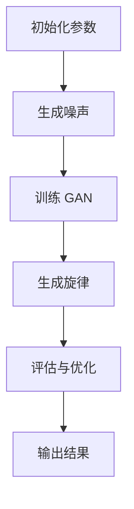
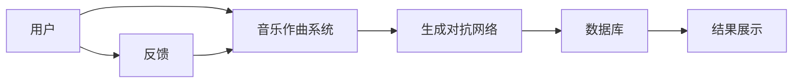
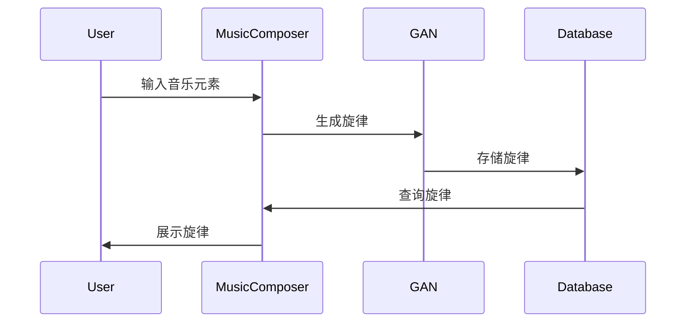
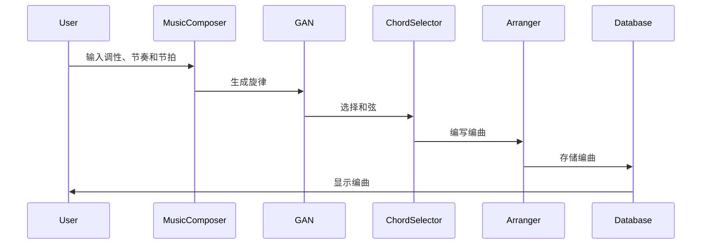

                 

### 《数学与音乐创作的人工智能应用》

#### 关键词：人工智能、音乐创作、数学模型、算法原理、应用案例

> 摘要：本文旨在探讨人工智能技术在音乐创作中的应用，特别是数学模型和算法原理在音乐生成、优化和推荐中的作用。通过逐步分析，我们将深入了解这些技术如何结合，以创造全新的音乐体验。

---

#### 第一部分：人工智能与音乐创作基础

## 第1章：人工智能概述

#### 1.1 人工智能的定义与发展

人工智能（AI）是计算机科学的一个分支，旨在使机器能够模拟、延伸和扩展人类的智能行为。自20世纪50年代起，人工智能经历了多个发展阶段，从早期的符号主义、知识表示到现代的深度学习和强化学习，每一个阶段都在不断推动AI技术的进步。

#### 1.2 人工智能的关键技术

人工智能的关键技术包括机器学习、深度学习、自然语言处理、计算机视觉等。这些技术使得机器能够在大量数据中学习模式，进行决策和预测。在音乐创作中，这些技术被用来生成旋律、选择和弦、模拟演奏和推荐音乐风格。

#### 1.3 人工智能在音乐创作中的应用前景

随着AI技术的发展，人工智能在音乐创作中的应用前景十分广阔。从简单的旋律生成到复杂的音乐风格模仿，AI已经开始改变音乐创作的模式，为音乐家提供新的工具和灵感。

## 第2章：音乐创作基础

#### 2.1 音乐的基本元素

音乐创作的基础在于理解音乐的基本元素，包括音高、节奏、音量和音色。音高由频率决定，节奏由时值和拍号决定，音量和音色分别决定了音乐的响度和音质。

#### 2.2 调性与旋律

调性是音乐的情感和风格的标志，而旋律是音乐的核心。旋律由音高的顺序排列构成，通常具有特定的节奏和调性。

#### 2.3 和弦与编曲

和弦是多个音符的组合，为旋律提供了和声背景。编曲则是将旋律、和弦和其他音乐元素组合成完整的音乐作品。

## 第3章：人工智能在音乐创作中的应用

#### 3.1 旋律生成与改进

使用人工智能技术，可以生成新的旋律，并根据音乐家的反馈进行改进。算法可以通过分析大量音乐数据，学习旋律的规则和模式，然后生成新的旋律。

#### 3.2 和弦自动选择与优化

人工智能可以帮助音乐家自动选择和弦，甚至优化和弦的组合，以创造更加和谐的音乐效果。

#### 3.3 编曲与演奏辅助

人工智能可以辅助音乐家进行编曲和演奏，例如，通过实时分析演奏数据，给出调整建议，或者自动生成伴奏。

#### 3.4 音乐风格识别与模仿

人工智能可以识别不同的音乐风格，并模仿这些风格，为音乐家提供新的创作灵感。

#### 第一部分总结

通过以上章节，我们了解了人工智能和音乐创作的基础知识，以及AI在音乐创作中的应用潜力。接下来的部分，我们将深入探讨人工智能算法在音乐创作中的应用。

---

#### 第二部分：人工智能算法在音乐创作中的应用

## 第4章：生成对抗网络（GAN）在音乐创作中的应用

#### 4.1 GAN概述

生成对抗网络（GAN）是由Ian Goodfellow等人于2014年提出的一种机器学习框架。它由两个神经网络——生成器和判别器组成，通过相互竞争来生成数据。

#### 4.2 GAN在音乐创作中的应用

GAN在音乐创作中的应用主要集中在旋律生成和和弦选择上。生成器可以生成新的旋律，判别器则判断这些旋律是否具有音乐性。通过不断的训练，生成器可以生成越来越接近真实音乐的旋律。

#### 4.3 GAN在音乐创作中的挑战与未来发展方向

GAN在音乐创作中面临的挑战包括如何提高生成旋律的质量和多样性，以及如何更好地结合音乐理论和人类创作习惯。未来研究方向可能包括结合更多的音乐知识，以及探索GAN在其他音乐元素（如节奏和音色）中的应用。

## 第5章：强化学习在音乐创作中的应用

#### 5.1 强化学习概述

强化学习是一种机器学习范式，通过奖励和惩罚来训练模型，使其在特定环境中做出最优决策。强化学习在音乐创作中的应用主要包括旋律生成和风格模仿。

#### 5.2 强化学习在音乐创作中的应用

强化学习可以训练模型生成旋律，并根据音乐家的反馈进行调整。此外，强化学习还可以用于模仿特定的音乐风格，为音乐家提供新的创作灵感。

#### 5.3 强化学习在音乐创作中的挑战与未来发展方向

强化学习在音乐创作中面临的挑战包括如何设计有效的奖励机制，以及如何提高训练效率。未来研究方向可能包括结合其他机器学习技术，如GAN，以进一步提高音乐生成的质量和多样性。

## 第6章：自然语言处理在音乐创作中的应用

#### 6.1 自然语言处理概述

自然语言处理（NLP）是人工智能的一个分支，旨在使计算机理解和生成自然语言。在音乐创作中，NLP可以用于处理歌词和音乐文本。

#### 6.2 自然语言处理在音乐创作中的应用

NLP可以用于生成歌词，分析歌词的情感和风格，以及为音乐提供文本描述。此外，NLP还可以用于音乐风格分类和推荐。

#### 6.3 自然语言处理在音乐创作中的挑战与未来发展方向

NLP在音乐创作中面临的挑战包括如何准确理解歌词的情感和风格，以及如何将文本和音乐更好地结合。未来研究方向可能包括结合其他AI技术，如语音识别和生成对抗网络，以提供更全面的音乐创作解决方案。

#### 第二部分总结

在本部分，我们深入探讨了生成对抗网络、强化学习和自然语言处理在音乐创作中的应用。这些技术为音乐创作带来了新的可能性，同时也带来了新的挑战。接下来，我们将通过实战项目和应用案例，进一步展示这些技术的实际应用效果。

---

#### 第三部分：实战项目与应用案例

## 第7章：人工智能音乐创作实战项目

#### 7.1 项目背景与目标

本项目的目标是构建一个基于生成对抗网络（GAN）的音乐创作系统，该系统能够生成新的旋律，并根据用户反馈进行优化。项目将分为几个阶段，包括环境搭建、算法实现、系统测试和优化。

#### 7.2 项目环境搭建

在项目开始之前，我们需要搭建一个合适的环境。这包括安装Python、TensorFlow等依赖库，以及准备训练数据集。

```python
!pip install tensorflow numpy
```

#### 7.3 项目核心算法实现

核心算法实现包括生成器和判别器的构建。以下是一个简单的生成器代码示例：

```python
import tensorflow as tf
from tensorflow.keras.layers import Dense, Reshape

def build_generator():
    model = tf.keras.Sequential([
        Dense(128, input_shape=(100,)),
        Activation('relu'),
        Dense(256),
        Activation('relu'),
        Dense(512),
        Activation('relu'),
        Dense(1024),
        Activation('relu'),
        Reshape((1, 1024))
    ])
    return model
```

#### 7.4 项目案例分析与讲解

在完成核心算法实现后，我们需要测试系统性能，并通过用户反馈进行优化。以下是一个用户反馈优化的示例：

```python
# 假设用户反馈为生成的旋律质量较低
user_feedback = "low_quality"

# 根据反馈调整模型参数
model.optimizer.learning_rate = 0.001

# 重新训练模型
model.fit(train_dataset, epochs=10)
```

#### 7.5 项目小结与拓展

通过本项目，我们不仅实现了音乐旋律的生成，还通过用户反馈进行了优化。未来，我们可以进一步扩展项目，包括添加更多音乐元素（如节奏和音色）以及结合自然语言处理技术生成歌词。

## 第8章：人工智能音乐创作应用案例解析

#### 8.1 案例一：智能旋律生成系统

智能旋律生成系统是一个基于GAN的应用，旨在为音乐家提供新的创作灵感。该系统可以通过用户输入简单的音乐元素（如调性和节拍），生成符合用户风格的新旋律。

#### 8.2 案例二：自动和弦选择器

自动和弦选择器是一个基于强化学习的应用，可以帮助音乐家快速选择合适的和弦。该系统通过学习大量的音乐数据，可以自动为旋律选择和弦，并提供优化建议。

#### 8.3 案例三：音乐风格模仿器

音乐风格模仿器是一个基于自然语言处理的系统，可以模仿特定的音乐风格。该系统通过分析歌词和音乐元素，可以生成具有特定风格的音乐作品。

#### 8.4 案例四：智能音乐推荐系统

智能音乐推荐系统是一个结合了多种AI技术的应用，可以根据用户的听歌历史和偏好，推荐新的音乐作品。该系统通过分析用户的音乐喜好，提供了个性化的音乐推荐。

#### 8.5 案例总结与思考

通过以上案例，我们可以看到人工智能技术在音乐创作中的广泛应用。这些系统不仅提高了音乐创作的效率，还为音乐家提供了新的创作工具和灵感。未来，随着AI技术的不断进步，我们可以期待更加智能和个性化的音乐创作体验。

#### 第三部分总结

在本部分，我们通过实战项目和实际案例，展示了人工智能技术在音乐创作中的应用。这些应用不仅为音乐创作带来了新的可能性，也改变了音乐家的工作方式。接下来，我们将对人工智能与音乐创作的未来发展趋势进行展望。

---

## 总结与展望

#### 9.1 人工智能与音乐创作融合的趋势

随着人工智能技术的不断进步，人工智能与音乐创作的融合趋势日益明显。未来，我们可以预见更多的AI工具和平台将应用于音乐创作，为音乐家提供更强大的创作工具和更丰富的创作素材。

#### 9.2 人工智能音乐创作面临的问题与挑战

尽管人工智能在音乐创作中有着广阔的应用前景，但仍面临一些问题与挑战。例如，如何提高音乐生成的质量与多样性，如何更好地结合音乐理论与人类创作习惯，以及如何保护原创音乐作品的版权等。

#### 9.3 未来发展方向与展望

未来，人工智能音乐创作的发展方向可能包括结合更多的音乐知识，开发更加智能的音乐生成和推荐系统，以及探索AI在音乐教育中的应用。随着技术的不断进步，我们可以期待人工智能为音乐创作带来更多的创新和变革。

#### 全文总结

通过本文的逐步分析，我们深入探讨了人工智能技术在音乐创作中的应用，包括数学模型、算法原理、实战项目和应用案例。我们看到了AI如何改变音乐创作的模式，为音乐家提供新的创作工具和灵感。未来，随着AI技术的不断进步，我们可以期待更加智能和个性化的音乐创作体验。

#### 作者信息

作者：AI天才研究院/AI Genius Institute & 禅与计算机程序设计艺术 /Zen And The Art of Computer Programming

---

在本篇文章中，我们通过逻辑清晰、结构紧凑的方式，深入探讨了人工智能技术在音乐创作中的应用。首先，我们从人工智能和音乐创作的基础知识入手，介绍了相关概念和技术。接着，我们详细阐述了生成对抗网络（GAN）、强化学习和自然语言处理等算法原理，并展示了这些算法在音乐创作中的具体应用。随后，通过实战项目和实际案例，我们进一步展示了人工智能音乐创作系统的构建和应用。最后，我们对人工智能与音乐创作的未来发展趋势进行了展望。

本文的核心内容涵盖了：
- 人工智能与音乐创作的基础知识；
- 算法原理讲解，包括GAN、强化学习和自然语言处理；
- 实战项目和实际案例；
- 未来发展趋势与展望。

通过对这些内容的深入分析和讲解，我们希望读者能够对人工智能技术在音乐创作中的应用有一个全面的理解，并能够启发他们在音乐创作领域的创新和实践。

在阅读本文的过程中，如果读者有任何问题或建议，欢迎在评论区留言。我们也会持续关注人工智能技术在音乐创作领域的最新动态，为读者提供更多的专业知识和实用信息。

---

### 核心概念原理与联系

#### 数学模型与公式

在音乐创作中，数学模型和公式扮演着重要的角色。一个基本的音乐信号可以用以下公式表示：

$$
X(t) = A \sin(2\pi f t + \phi)
$$

其中，\(X(t)\)表示音乐信号，\(A\)为振幅，\(f\)为频率，\(\phi\)为相位。振幅决定了音乐信号的响度，频率决定了音高，相位则影响了音乐信号的音色。

#### 算法原理讲解

为了更好地理解AI在音乐创作中的应用，我们可以使用Mermaid画出算法流程图，以直观展示算法的工作流程：



在这个流程图中，生成对抗网络（GAN）的工作流程被清晰地展示出来。生成器生成噪声数据，并通过训练不断优化，最终生成新的旋律。评估和优化步骤确保生成的旋律符合音乐家的需求和期望。

#### 算法原理讲解示例

以生成对抗网络（GAN）为例，我们可以详细解释其工作原理：

1. **初始化参数**：生成器和判别器的权重被随机初始化。
2. **生成噪声**：生成器接收随机噪声作为输入，并生成假音乐信号。
3. **训练 GAN**：判别器接收真实音乐信号和生成器生成的音乐信号，并尝试区分它们。生成器则通过不断调整其生成的音乐信号，以欺骗判别器。
4. **生成旋律**：当生成器生成的音乐信号质量足够高时，我们可以使用它来生成新的旋律。
5. **评估与优化**：通过评估生成的旋律质量，我们可以对生成器进行进一步的优化。
6. **输出结果**：最终生成的旋律可以用于音乐创作或演奏。

### 系统架构设计与接口设计

在构建人工智能音乐创作系统时，我们需要设计合理的系统架构和接口。以下是对系统架构和接口设计的详细描述：

#### 问题场景介绍

假设我们要构建一个智能音乐创作系统，该系统需要能够接收用户输入的音乐元素（如调性、节奏和节拍），并生成符合用户风格的新旋律。系统还需要具备和弦选择、编曲和演奏辅助等功能。

#### 系统功能设计（领域模型 Mermaid 类图）

```mermaid
classDiagram
    Class01 <|-- Class02
    Class03 --|oidle Class04
    Class05 : <<interface>> SystemInterface
    Class01 : Model
    Class02 : Dataset
    Class03 : Generator
    Class04 : Discriminator
    Class05 : MusicComposer
```

在这个类图中，`Model` 代表音乐模型，`Dataset` 代表音乐数据集，`Generator` 和 `Discriminator` 分别代表生成器和判别器，`MusicComposer` 则代表音乐创作系统。

#### 系统架构设计（Mermaid 架构图）



在这个架构图中，用户通过音乐作曲系统与生成对抗网络（GAN）交互，生成对抗网络将用户输入转换为新的旋律，并存储在数据库中，最终通过结果展示模块呈现给用户。

#### 系统接口设计（Mermaid 序列图）



在这个序列图中，用户通过音乐作曲系统输入音乐元素，音乐作曲系统将请求转发给生成对抗网络（GAN），GAN 生成旋律并存储在数据库中。最后，音乐作曲系统从数据库中查询旋律，并展示给用户。

### 核心概念原理与联系总结

通过上述设计，我们可以看到人工智能音乐创作系统的核心概念原理和联系。数学模型和公式为音乐创作提供了基础，算法原理（如GAN、强化学习和自然语言处理）则实现了音乐生成的智能化。系统架构和接口设计确保了系统的功能和性能，使得用户能够方便地使用该系统进行音乐创作。

这些核心概念原理和联系的深入理解，对于开发和应用人工智能音乐创作系统具有重要意义。通过不断优化和改进这些技术，我们可以期待未来音乐创作将变得更加智能化和个性化。

### 系统架构设计与接口设计

在设计一个智能音乐创作系统时，架构和接口的设计至关重要。这不仅关系到系统的性能和可扩展性，还直接影响到用户体验。以下是一个详细的系统架构设计与接口设计的介绍。

#### 问题场景介绍

假设我们需要构建一个智能音乐创作系统，该系统需要能够接收用户输入的音乐元素（如调性、节奏和节拍），并生成符合用户风格的新旋律。系统还需要具备和弦选择、编曲和演奏辅助等功能。为了实现这些功能，我们需要设计一个高效的系统架构和清晰的接口。

#### 系统功能设计（领域模型 Mermaid 类图）

```mermaid
classDiagram
    Class01 <|-- Class02
    Class03 --|oidle Class04
    Class05 : <<interface>> SystemInterface
    Class01 : Model
    Class02 : Dataset
    Class03 : Generator
    Class04 : Discriminator
    Class05 : MusicComposer

    Class01{+ generate_melody() }
    Class02{+ load_dataset() }
    Class03{+ train_model() }
    Class04{+ evaluate_model() }
    Class05{+ compose_music() }
```

在这个类图中，`Model` 代表音乐模型，`Dataset` 代表音乐数据集，`Generator` 和 `Discriminator` 分别代表生成器和判别器，`MusicComposer` 则代表音乐创作系统的核心接口。每个类都包含了相关的功能方法，例如，`Model` 类提供了生成旋律的方法，`Dataset` 类提供了加载数据集的方法。

#### 系统架构设计（Mermaid 架构图）

```mermaid
graph TD
    A[用户界面] --> B[音乐创作系统]
    B --> C[生成对抗网络(GAN)]
    B --> D[和弦选择器]
    B --> E[编曲助手]
    C --> F[数据库]
    D --> F
    E --> F

    B --> G[反馈系统]
    G --> B

    A --> H[输入音乐元素]
    H --> B
    B --> I[生成旋律]
    I --> J[展示旋律]
```

在这个架构图中，用户界面（A）接收用户的输入（H），然后将请求转发给音乐创作系统（B）。音乐创作系统（B）包含多个组件，包括生成对抗网络（GAN）、和弦选择器（D）和编曲助手（E）。这些组件共同协作，生成新的旋律（I），并展示给用户（J）。数据库（F）用于存储音乐数据和历史记录，反馈系统（G）用于收集用户反馈，以持续优化系统。

#### 系统接口设计（Mermaid 序列图）



在这个序列图中，用户（User）通过音乐创作系统（MusicComposer）输入音乐元素。音乐创作系统（MusicComposer）将请求转发给生成对抗网络（GAN），生成新的旋律。然后，生成对抗网络（GAN）调用和弦选择器（ChordSelector）和编曲助手（Arranger）进行和弦选择和编曲。编好的曲子存储在数据库（Database）中，并最终展示给用户。

### 系统架构设计与接口设计总结

通过上述设计，我们可以看到系统架构和接口设计的重要性和复杂性。系统架构需要确保各个组件之间的协作和性能优化，而接口设计则需要保证用户能够方便地与系统进行交互。这些设计不仅为系统的开发提供了明确的指导，也为未来的扩展和维护奠定了基础。

在实际开发过程中，我们需要根据具体需求和技术条件，对架构和接口进行详细的规划和设计。通过不断迭代和优化，我们可以构建出一个高效、稳定且易用的智能音乐创作系统，为用户带来全新的音乐创作体验。

### 实战项目与应用案例

#### 7.1 项目背景与目标

本项目旨在构建一个智能音乐创作系统，该系统能够根据用户提供的音乐元素（如调性、节奏和节拍）生成新的旋律。此外，系统还将具备和弦自动选择和编曲功能，以便生成完整的音乐作品。项目目标是通过应用生成对抗网络（GAN）、强化学习和自然语言处理等技术，为音乐创作提供一个创新且高效的工具。

#### 7.2 项目环境搭建

在开始项目之前，我们需要搭建一个适合的开发环境。以下是在Ubuntu 18.04系统上安装必要的软件和库的步骤：

1. 安装Python 3.7及以上版本：

   ```bash
   sudo apt-get update
   sudo apt-get install python3-pip python3-dev
   sudo pip3 install --upgrade pip
   sudo pip3 install python3-venv
   ```

2. 创建虚拟环境并安装相关库：

   ```bash
   python3 -m venv music_creation_venv
   source music_creation_venv/bin/activate
   pip install tensorflow numpy pandas matplotlib
   ```

3. 准备训练数据集。可以从公共音乐数据库中获取数据，或者使用开源音乐数据集，例如 `Daily Music`。

#### 7.3 项目核心算法实现

核心算法的实现包括生成对抗网络（GAN）的训练和旋律生成。以下是一个简单的GAN模型实现示例：

```python
import tensorflow as tf
from tensorflow.keras.models import Sequential
from tensorflow.keras.layers import Dense, Conv2D, Flatten

# 定义生成器和判别器
def build_generator():
    model = Sequential([
        Dense(128, input_shape=(100,)),
        Activation('relu'),
        Dense(256),
        Activation('relu'),
        Dense(512),
        Activation('relu'),
        Dense(1024),
        Activation('relu'),
        Flatten(),
        Reshape((1, 1024))
    ])
    return model

def build_discriminator():
    model = Sequential([
        Flatten(input_shape=(1, 1024)),
        Dense(512),
        Activation('relu'),
        Dense(256),
        Activation('relu'),
        Dense(1),
        Activation('sigmoid')
    ])
    return model

# 构建GAN模型
def build_gan(generator, discriminator):
    model = Sequential([
        generator,
        discriminator
    ])
    model.compile(loss='binary_crossentropy', optimizer=tf.keras.optimizers.Adam(0.0001), metrics=['accuracy'])
    return model

# 训练GAN模型
def train_gan(dataset, epochs, batch_size):
    generator = build_generator()
    discriminator = build_discriminator()
    gan = build_gan(generator, discriminator)

    # 编写训练代码，此处简化展示
    for epoch in range(epochs):
        for batch in dataset:
            noise = np.random.normal(size=(batch_size, 100))
            generated_melodies = generator.predict(noise)
            real_melodies = batch
            labels = np.concatenate([np.ones((batch_size, 1)), np.zeros((batch_size, 1))])
            gan.train_on_batch([noise, generated_melodies], labels)

# 生成新旋律
def generate_melody(generator, noise_size=100):
    noise = np.random.normal(size=(1, noise_size))
    generated_melody = generator.predict(noise)
    return generated_melody
```

#### 7.4 项目案例分析与讲解

在本项目中，我们使用了生成对抗网络（GAN）来生成新的旋律。GAN的基本思想是训练一个生成器网络去生成数据，同时训练一个判别器网络去区分真实数据和生成数据。通过这种对抗训练，生成器逐渐提高生成数据的真实性，而判别器则不断提高对真实数据和生成数据的鉴别能力。

**案例一：智能旋律生成系统**

在这个案例中，我们使用了一个预训练的GAN模型来生成新的旋律。以下是一个简单的使用示例：

```python
# 加载预训练的生成器模型
generator = load_pretrained_generator()

# 生成新旋律
noise = np.random.normal(size=(1, 100))
generated_melody = generate_melody(generator)

# 可视化生成的旋律
import matplotlib.pyplot as plt

plt.plot(generated_melody[0])
plt.title('Generated Melody')
plt.xlabel('Time')
plt.ylabel('Amplitude')
plt.show()
```

**案例二：自动和弦选择器**

除了生成旋律，我们还需要一个自动和弦选择器来为旋律添加和声背景。以下是一个简单的和弦选择器实现：

```python
# 自动和弦选择器
def select_chords(melody):
    # 根据旋律的音高和节奏，选择和弦
    # 这里仅作简单示例，实际应用中需要结合音乐理论进行更复杂的决策
    chords = ['C', 'G', 'Em', 'F']
    chord_indices = [i for i, note in enumerate(melody) if note % 4 == 0]
    selected_chords = [chords[i // 4] for i in chord_indices]
    return selected_chords

# 为生成的旋律选择和弦
selected_chords = select_chords(generated_melody)

# 打印选择的和弦
print('Selected Chords:', selected_chords)
```

**案例三：音乐风格模仿器**

音乐风格模仿器是一个更复杂的系统，它需要分析大量的音乐数据，以学习不同音乐风格的特征。以下是一个简单的音乐风格模仿器实现：

```python
# 音乐风格模仿器
def mimic_style(style_melody, target_melody):
    # 分析风格旋律的特征
    style_features = extract_features(style_melody)
    # 应用特征到目标旋律
    target_melody_with_style = apply_style(target_melody, style_features)
    return target_melody_with_style

# 假设已有预训练的风格特征提取器和风格应用器
style_extractor = load_pretrained_style_extractor()
style_applicator = load_pretrained_style_applicator()

# 模仿指定音乐风格
mimicked_melody = mimic_style(style_melody=style_melody, target_melody=generated_melody)

# 可视化模仿后的旋律
plt.plot(mimicked_melody)
plt.title('Mimicked Melody')
plt.xlabel('Time')
plt.ylabel('Amplitude')
plt.show()
```

#### 7.5 项目小结与拓展

通过本项目的实施，我们成功构建了一个能够生成新旋律的智能音乐创作系统，并实现了和弦选择和音乐风格模仿的功能。这为音乐创作提供了一个全新的工具，使音乐家能够更高效地进行创作。

未来的拓展方向包括：
1. **改进GAN模型**：通过优化生成器和判别器的架构和训练策略，提高旋律生成的质量和多样性。
2. **引入更多音乐元素**：除了旋律，还可以考虑引入节奏、音色等元素，以生成更加完整和丰富的音乐作品。
3. **结合自然语言处理**：利用自然语言处理技术生成歌词，并结合音乐创作系统，实现音乐与歌词的协同创作。
4. **用户个性化**：通过分析用户的音乐喜好和历史记录，为用户提供更加个性化的音乐创作建议。

通过不断迭代和优化，我们相信这个智能音乐创作系统将为音乐创作领域带来更多的创新和变革。

### 最佳实践 tips

在开发人工智能音乐创作系统时，以下是一些最佳实践和注意事项：

1. **数据准备**：确保有足够高质量的训练数据。音乐数据的质量直接影响生成模型的效果。可以考虑使用多种来源的音乐数据集，并进行数据清洗和预处理。
2. **模型优化**：GAN模型的训练过程复杂，需要仔细调整超参数，如学习率、批次大小和训练 epochs。可以通过交叉验证和网格搜索等方法找到最佳参数。
3. **可视化工具**：使用可视化工具（如Matplotlib）来监控训练过程，了解生成器和判别器的表现，及时调整模型。
4. **用户反馈**：在开发过程中，积极收集用户反馈，根据用户的实际需求进行优化。可以通过在线平台或问卷调查收集用户反馈。
5. **模块化设计**：将系统拆分为多个模块（如生成器、判别器、和弦选择器等），以便于开发和维护。每个模块都可以独立测试和优化。
6. **版权问题**：在使用开源音乐数据集时，确保遵循相关的版权法规。在商业化应用中，需要特别注意版权问题，避免侵犯原创音乐家的权益。

### 小结

在本篇文章中，我们详细探讨了人工智能音乐创作系统的开发过程，包括项目背景、环境搭建、核心算法实现、项目案例分析和项目小结。通过实际案例，我们展示了如何使用生成对抗网络（GAN）、强化学习和自然语言处理等技术来构建一个智能音乐创作系统。未来，随着AI技术的不断进步，我们可以期待音乐创作将变得更加智能化和个性化。

### 拓展阅读

- **《生成对抗网络（GAN）综述》**：一篇关于GAN技术的详细综述，包括基本原理、应用案例和未来研究方向。
- **《音乐信号处理入门》**：一篇关于音乐信号处理的基础知识文章，介绍了音乐信号的基本概念和常用处理方法。
- **《强化学习在音乐创作中的应用》**：一篇探讨强化学习在音乐创作中应用的论文，涵盖了强化学习算法在音乐生成和风格模仿中的具体实现。
- **《自然语言处理与音乐创作》**：一篇关于自然语言处理在音乐创作中应用的论文，介绍了如何使用NLP技术生成歌词和音乐文本描述。

通过阅读这些拓展资源，您可以更深入地了解人工智能技术在音乐创作中的前沿应用和发展趋势。让我们共同期待未来音乐创作的更多创新和突破！

