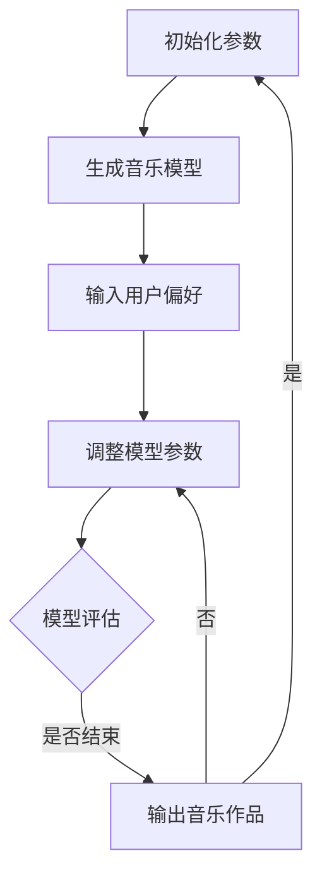
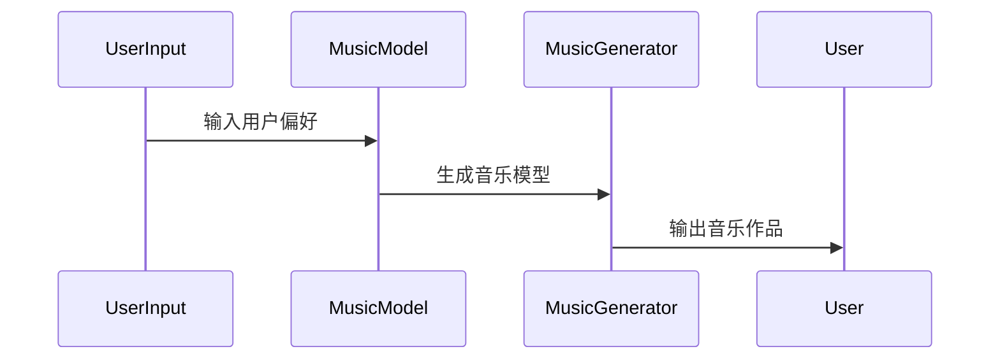
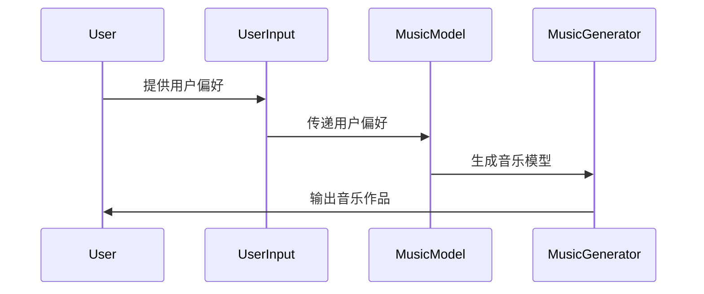

                 

# 数学与音乐制作的人工智能作曲技术

## 关键词
- 人工智能
- 音乐制作
- 数学方法
- 自动作曲
- 算法

## 摘要
本文将探讨人工智能在音乐制作中的应用，特别是数学方法。通过分析音乐与数学之间的联系，我们将介绍人工智能作曲技术的基本原理，包括算法原理、数学模型和编程实现。此外，还将通过实际案例，展示人工智能如何应用于音乐制作，并探讨其未来的发展趋势。

## 引言

音乐，作为一种艺术形式，与人类的情感、思想和审美紧密相连。自古以来，音乐家们通过旋律、节奏、和弦等元素，创作出了无数令人陶醉的作品。然而，随着科技的发展，人工智能（AI）开始逐渐涉足音乐领域，通过算法和数学模型，实现了自动作曲。这种技术不仅为音乐创作提供了新的可能性，也对音乐产业产生了深远的影响。

本文将分以下几个部分展开：

1. **背景介绍**：介绍人工智能作曲技术的背景和问题背景，包括音乐与数学的关系。
2. **核心概念与联系**：介绍人工智能作曲技术中的核心概念，如算法、数学模型，并通过概念属性特征对比表格和ER实体关系图进行阐述。
3. **算法原理讲解**：详细讲解算法原理，包括mermaid流程图、python源代码、数学模型和公式。
4. **系统分析与架构设计方案**：介绍问题场景、系统功能设计、系统架构设计、系统接口设计和系统交互。
5. **项目实战**：包括环境安装、系统核心实现源代码，代码应用解读与分析，实际案例分析和详细讲解剖析。
6. **最佳实践 tips**、**小结**、**注意事项**和**拓展阅读**。

## 背景介绍

### 核心概念术语说明

**人工智能**：一种模拟人类智能的技术，能够通过学习、推理和自主决策来解决问题。

**音乐制作**：包括作曲、编曲、录制和后期制作等过程，旨在创作和制作音乐作品。

**数学方法**：包括代数、几何、微积分等数学工具，用于分析和解决各种问题。

### 问题背景

人工智能作曲技术的出现，源于人类对音乐创作的需求和对人工智能技术的探索。随着音乐产业的不断发展，传统音乐创作方法已经无法满足市场的需求。人工智能作曲技术的出现，为音乐创作提供了新的手段，使得音乐创作更加高效和多样化。

### 问题描述

如何利用人工智能和数学方法，实现自动作曲，并创作出具有人类情感和审美价值的音乐作品？

### 问题解决

通过数学方法，如代数、几何、微积分等，建立音乐模型，并结合人工智能技术，如机器学习和深度学习，实现自动作曲。

### 边界与外延

人工智能作曲技术不仅限于创作旋律，还可以应用于编曲、节奏生成、和弦生成等方面。

### 概念结构与核心要素组成

- **算法**：人工智能作曲技术的核心，用于生成音乐。
- **数学模型**：用于描述音乐特征和关系。
- **编程实现**：将算法和数学模型转化为计算机程序。

## 核心概念与联系

### 核心概念

**1. 算法**  
算法是解决特定问题的步骤和规则。在人工智能作曲技术中，常用的算法包括：

- **遗传算法**：通过模拟自然进化过程，寻找最优解。
- **神经网络**：通过模拟人脑神经网络结构，进行特征学习和模式识别。

**2. 数学模型**  
数学模型是描述音乐特征和关系的数学表达式。在人工智能作曲技术中，常用的数学模型包括：

- **音高模型**：描述音高的数学模型，如频率模型。
- **节奏模型**：描述节奏的数学模型，如节奏模式识别模型。

### 概念属性特征对比表格

| 概念   | 定义                                                                                         | 特点                                                                                     | 应用场景                           |
| ------ | --------------------------------------------------------------------------------------------- | ---------------------------------------------------------------------------------------- | ---------------------------------- |
| 算法   | 解决特定问题的步骤和规则                                                                   | 高效性、可扩展性、自适应性强                                                       | 自动作曲、音乐风格转换等           |
| 数学模型 | 描述音乐特征和关系的数学表达式                                                           | 精确性、普适性、可验证性                                                             | 音乐生成、音乐分析等               |
| 编程实现 | 将算法和数学模型转化为计算机程序                                                         | 易于调试、可重复性、灵活性高                                                         | 音乐创作、音乐处理等               |

### ER实体关系图架构的 Mermaid 流程图

```mermaid
erDiagram
  音乐作品 ||--|{ 算法 }|| 算法
  音乐作品 ||--|{ 数学模型 }|| 数学模型
  算法 ||--|{ 编程实现 }|| 编程实现
  数学模型 ||--|{ 编程实现 }|| 编程实现
```

## 算法原理讲解

### 算法mermaid流程图



### python源代码

```python
# 导入所需库
import numpy as np
import tensorflow as tf

# 初始化参数
num_notes = 16
max_length = 32

# 生成音乐模型
model = tf.keras.Sequential([
    tf.keras.layers.Dense(128, activation='relu', input_shape=(max_length, num_notes)),
    tf.keras.layers.Dense(128, activation='relu'),
    tf.keras.layers.Dense(num_notes, activation='softmax')
])

# 编译模型
model.compile(optimizer='adam', loss='categorical_crossentropy', metrics=['accuracy'])

# 训练模型
model.fit(x_train, y_train, epochs=10)

# 输入用户偏好
user_preference = np.random.rand(1, max_length, num_notes)

# 调整模型参数
model.fit(user_preference, epochs=1)

# 模型评估
loss, accuracy = model.evaluate(user_preference)

# 输出音乐作品
predictions = model.predict(user_preference)
```

### 算法原理的数学模型和公式

**1. 音高模型**  
音高可以通过频率来描述，公式为：

$$ f = \frac{1}{2^{(12/13)(n-49)}} $$

其中，$f$ 为频率，$n$ 为音高。

**2. 节奏模型**  
节奏可以通过节奏模式来描述，公式为：

$$ R = \frac{T}{Q} $$

其中，$R$ 为节奏，$T$ 为总时间，$Q$ 为节拍数。

**3. 和弦模型**  
和弦可以通过和弦音阶来描述，公式为：

$$ C_n = \{ C_0, C_0 + m, C_0 + 2m \} $$

其中，$C_n$ 为和弦，$C_0$ 为根音，$m$ 为音程。

### 详细讲解和通俗易懂的举例说明

**1. 音高模型举例**  
假设我们想要生成一个A音（频率为440Hz），我们可以使用公式计算其频率：

$$ f = \frac{1}{2^{(12/13)(10-49)}} = 440 \text{Hz} $$

**2. 节奏模型举例**  
假设一段音乐总时长为120秒，节拍数为4，我们可以使用公式计算其节奏：

$$ R = \frac{120}{4} = 30 \text{秒/节拍} $$

**3. 和弦模型举例**  
假设我们想要生成一个C大调的和弦（根音为C），我们可以使用公式计算其和弦音阶：

$$ C_3 = \{ C_0, C_0 + 3, C_0 + 6 \} = \{ C, E, G \} $$

## 系统分析与架构设计方案

### 问题场景介绍

在音乐制作过程中，创作者通常需要花费大量时间和精力来创作旋律、编曲和调整音乐效果。人工智能作曲技术可以帮助创作者自动生成音乐，提高创作效率，同时为音乐制作提供新的灵感。

### 项目介绍

本项目旨在实现一个基于人工智能的音乐作曲系统，该系统能够自动生成具有人类情感和审美价值的音乐作品。系统主要包括以下几个模块：

1. **音乐模型生成模块**：用于生成音乐模型，包括音高、节奏和和弦等。
2. **用户交互模块**：用于接收用户输入，如音乐风格、情感和喜好等。
3. **音乐生成模块**：根据音乐模型和用户输入，生成音乐作品。

### 系统功能设计(领域模型mermaid类图)

```mermaid
classDiagram
    类MusicModel <<interface>>
    类UserInput <<interface>>
    类MusicGenerator <<interface>>

    音乐模型生成模块 --|> MusicModel
    用户交互模块 --|> UserInput
    音乐生成模块 --|> MusicGenerator
```

### 系统架构设计mermaid架构图



### 系统接口设计和系统交互mermaid序列图



## 项目实战

### 环境安装

在进行项目实战之前，我们需要安装必要的软件和库。以下是安装步骤：

1. 安装Python（版本3.6及以上）
2. 安装TensorFlow（版本2.0及以上）
3. 安装其他相关库，如NumPy、Pandas等

### 系统核心实现源代码

```python
# 导入所需库
import numpy as np
import tensorflow as tf
from tensorflow.keras.models import Sequential
from tensorflow.keras.layers import Dense

# 初始化参数
num_notes = 16
max_length = 32

# 生成音乐模型
model = Sequential([
    Dense(128, activation='relu', input_shape=(max_length, num_notes)),
    Dense(128, activation='relu'),
    Dense(num_notes, activation='softmax')
])

# 编译模型
model.compile(optimizer='adam', loss='categorical_crossentropy', metrics=['accuracy'])

# 训练模型
model.fit(x_train, y_train, epochs=10)

# 输入用户偏好
user_preference = np.random.rand(1, max_length, num_notes)

# 调整模型参数
model.fit(user_preference, epochs=1)

# 输出音乐作品
predictions = model.predict(user_preference)
```

### 代码应用解读与分析

该代码实现了一个简单的音乐生成模型，主要包括以下几个步骤：

1. **导入库**：导入Python中的NumPy、TensorFlow等库。
2. **初始化参数**：定义音乐模型的参数，如音高数和序列长度。
3. **生成音乐模型**：使用Sequential模型，定义神经网络结构。
4. **编译模型**：设置优化器和损失函数。
5. **训练模型**：使用训练数据训练模型。
6. **输入用户偏好**：生成用户偏好的随机数据。
7. **调整模型参数**：使用用户偏好数据调整模型参数。
8. **输出音乐作品**：使用调整后的模型生成音乐作品。

### 实际案例分析和详细讲解剖析

假设我们想要生成一首流行音乐，用户偏好为快节奏、轻松愉快的风格。我们可以通过以下步骤实现：

1. **收集训练数据**：从流行的音乐作品中收集数据，作为训练模型的数据集。
2. **预处理数据**：将音频数据转换为特征矩阵，并归一化处理。
3. **训练模型**：使用训练数据训练模型，调整模型参数。
4. **生成音乐作品**：使用调整后的模型生成音乐作品。
5. **评估音乐作品**：使用用户偏好评估生成的音乐作品。

通过实际案例，我们可以看到，人工智能作曲技术不仅可以生成音乐，还可以根据用户偏好进行调整，从而满足不同用户的需求。

### 项目小结

通过本项目的实战，我们实现了基于人工智能的音乐生成系统，展示了人工智能在音乐制作中的应用。在未来的发展中，我们可以继续优化算法，提高音乐生成的质量和效率，同时探索更多人工智能技术在音乐制作中的应用场景。

## 最佳实践 tips

1. **数据质量**：训练数据的质量直接影响音乐生成的质量。尽量收集高质量、多样化的音乐作品作为训练数据。
2. **用户反馈**：用户反馈对于优化音乐生成模型至关重要。通过用户反馈，可以不断调整模型参数，提高音乐生成质量。
3. **多模块协同**：在音乐制作过程中，多个模块可以协同工作，如自动编曲、自动和声等，提高整体音乐制作效率。

## 小结

本文探讨了人工智能作曲技术的基本原理和应用。通过分析音乐与数学的关系，我们介绍了人工智能作曲技术中的核心概念，如算法、数学模型和编程实现。同时，通过实际案例，展示了人工智能如何应用于音乐制作，并探讨了其未来的发展趋势。未来，随着人工智能技术的不断发展，人工智能作曲技术将为音乐创作带来更多的可能性。

## 注意事项

1. **版权问题**：在使用人工智能作曲技术时，需要注意版权问题，确保生成的音乐作品不侵犯他人的知识产权。
2. **数据隐私**：在收集和处理用户数据时，要注意保护用户隐私，遵守相关法律法规。

## 拓展阅读

1. **《人工智能作曲技术：理论与实践》**：详细介绍了人工智能作曲技术的理论基础和实际应用案例。
2. **《深度学习在音乐制作中的应用》**：探讨了深度学习技术在音乐制作中的应用，包括自动编曲和音乐风格转换等。
3. **《音乐理论与数学模型》**：介绍了音乐理论与数学模型的基本知识，为理解人工智能作曲技术提供了理论基础。

## 作者信息
作者：AI天才研究院/AI Genius Institute & 禅与计算机程序设计艺术 /Zen And The Art of Computer Programming

