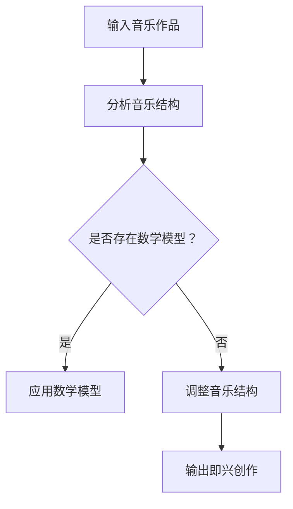

                 

### 第1章 引言

#### 1.1 研究背景

数学与音乐，两个看似迥异的领域，却在人类文化的历史长河中交织出了精彩的篇章。音乐，作为一种表现人类情感的艺术形式，自古以来就与数学密不可分。古埃及的数学家研究过音乐理论，古希腊的毕达哥拉斯学派更是将数学与音乐结合起来，提出了著名的“和谐理论”。而随着计算机科学的发展，数学在音乐中的应用得到了进一步扩展，特别是在音乐即兴创作领域。

音乐即兴创作是指在没有预定乐谱的情况下，音乐家根据自身的感觉和即兴创作的规则，实时创造音乐的过程。这种创作方式具有高度的灵活性和创造性，使得音乐家能够充分发挥个人的想象力和艺术才华。然而，传统的音乐即兴创作往往依赖于个人的经验和感觉，缺乏系统的理论指导。

数学作为一种严谨的科学，其理论和方法为音乐即兴创作提供了新的思路和工具。通过数学模型，可以分析音乐的结构、模式和规律，从而为即兴创作提供科学依据。此外，计算机技术的进步也为数学在音乐中的应用提供了可能，通过算法和编程，可以实现复杂的音乐分析、生成和创作。

#### 1.2 研究目的与意义

本研究旨在探讨数学在音乐即兴创作中的应用，通过数学模型和算法，提高音乐即兴创作的效率和创作质量。具体研究目的如下：

1. **探索数学与音乐即兴创作的内在联系**：通过分析音乐的基本元素和数学模型，揭示音乐结构与数学规律之间的联系。

2. **建立数学与音乐即兴创作的理论框架**：构建一个系统的理论框架，为音乐即兴创作提供科学指导。

3. **开发实用工具和算法**：设计并实现基于数学模型的实用工具和算法，辅助音乐家进行即兴创作。

4. **提高音乐即兴创作的效率和质量**：通过数学方法优化即兴创作过程，提高创作效率，丰富创作内容。

本研究的意义在于：

- **推动音乐与数学的交叉研究**：为学术界和业界提供新的研究方向和思路，促进音乐与数学的深度融合。

- **丰富音乐创作理论**：通过数学方法研究音乐即兴创作，为音乐创作理论提供新的视角和工具。

- **提高音乐创作实践水平**：为音乐家提供实用的工具和算法，帮助他们更好地进行即兴创作，提高创作水平。

#### 1.3 研究方法与结构

本研究采用理论分析、案例分析、算法设计等方法，具体研究步骤如下：

1. **文献综述**：梳理相关领域的研究成果，明确数学在音乐即兴创作中的应用现状。

2. **数学模型构建**：根据音乐的基本元素和创作规则，构建数学模型，分析音乐结构与数学规律。

3. **算法设计**：设计基于数学模型的实用算法，用于音乐分析、生成和创作。

4. **案例分析**：选取典型的音乐实例，运用所设计的算法进行分析，验证其有效性和实用性。

5. **结果讨论**：对研究结果进行讨论，总结数学在音乐即兴创作中的应用价值和局限性。

6. **总结与展望**：总结研究工作，提出未来研究方向和建议。

本研究的结构安排如下：

- **第1章 引言**：介绍研究背景、目的与意义，研究方法与结构。

- **第2章 数学与音乐概述**：阐述数学与音乐的基本概念，分析数学与音乐的关系。

- **第3章 音乐理论中的数学应用**：探讨音乐理论中数学应用的具体内容。

- **第4章 音乐即兴创作的方法**：介绍音乐即兴创作的定义、准备和实践技巧。

- **第5章 数学在即兴创作中的应用**：分析数学结构与音乐的关系，探讨数论、几何在音乐中的应用。

- **第6章 案例分析**：分析著名音乐家的即兴创作案例，讨论数学与音乐的结合。

- **第7章 结论与展望**：总结研究成果，讨论研究局限性，提出未来研究方向。

### 目录大纲

```markdown
# 数学与音乐即兴创作的理论基础

## 第1章 引言
### 1.1 研究背景
### 1.2 研究目的与意义
### 1.3 研究方法与结构

## 第2章 数学与音乐概述
### 2.1 数学的基本概念
### 2.2 音乐的基本元素
### 2.3 数学与音乐的关系

## 第3章 音乐理论中的数学应用
### 3.1 音阶与和声
### 3.2 音程与调性
### 3.3 节奏与旋律

## 第4章 音乐即兴创作的方法
### 4.1 即兴创作的定义与特点
### 4.2 即兴创作的准备
### 4.3 即兴创作的技巧与实践

## 第5章 数学在即兴创作中的应用
### 5.1 数学结构与音乐的关系
### 5.2 数论在音乐中的应用
### 5.3 几何与音乐的关系

## 第6章 案例分析
### 6.1 某著名音乐家的即兴创作分析
### 6.2 某数学家与音乐结合的案例分析

## 第7章 结论与展望
### 7.1 研究成果总结
### 7.2 研究局限与展望
### 7.3 未来研究方向
```

### 概念结构与核心要素组成

#### 背景介绍

- **问题背景**：随着音乐与数学的交融，数学在音乐即兴创作中的应用越来越广泛。音乐即兴创作是一种极具创造性和灵活性的创作方式，它使得音乐家能够根据现场的情境和自己的感受，实时创造新的音乐作品。而数学作为一种严谨的科学，其理论和方法为音乐即兴创作提供了新的思路和工具。
- **问题描述**：如何运用数学理论来丰富音乐即兴创作，提高创作质量。即兴创作过程中，音乐家往往依赖于个人的经验和感觉，缺乏系统的理论指导。通过数学方法，我们可以为即兴创作提供科学的依据，从而提高创作效率和创作质量。
- **问题解决**：通过研究数学在音乐中的应用，探索数学与音乐即兴创作之间的内在联系，建立数学与音乐即兴创作的理论框架，开发实用工具和算法，从而丰富音乐即兴创作的方法和技巧。
- **边界与外延**：数学在音乐中的应用不仅限于即兴创作，还可以扩展到音乐分析、作曲等领域。即兴创作是音乐创作的一种形式，而音乐创作是一个更广泛的概念，包括作曲、编曲、配乐等。

#### 核心概念原理

- **数学在音乐中的应用**：数学理论可以用来分析音乐的结构，如音阶、和声、节奏等。例如，通过数学方法可以计算音程的大小、确定调性等。数学还可以用于生成新的音乐模式，如通过数列生成旋律等。
- **音乐即兴创作的方法**：音乐即兴创作是一种基于感觉和直觉的创作方式。通过数学原理，我们可以指导即兴创作，如通过数学模型来分析音乐的结构，预测下一步的音乐走向，从而提高创作的灵活性和创造性。

#### 概念属性特征对比表格

| 特征         | 数学基本概念               | 音乐基本元素                   |
| ------------ | -------------------------- | ----------------------------- |
| 应用领域     | 自然科学、工程、经济学等    | 艺术、文化、娱乐等             |
| 研究方法     | 理论推导、实验验证等        | 即兴表演、作曲等               |
| 目标         | 发现规律、解决问题         | 创作音乐作品、表达情感等       |
| 关系         | 描述事物的数量关系         | 形成音乐作品的结构与旋律       |

#### ER实体关系图架构

```mermaid
erDiagram
    Artist ||--|{ MusicTheory }|--|| MusicPiece
    MusicTheory ||--|{ Mathematics }|--|| MathApplication
    Artist }|--|| Concert
```

- **Artist（音乐家）**：负责创作和表演音乐作品。
- **MusicTheory（音乐理论）**：研究音乐的基本概念和原理。
- **Mathematics（数学）**：提供理论支持和分析工具。
- **MathApplication（数学应用）**：将数学理论应用于音乐分析。
- **MusicPiece（音乐作品）**：由音乐家创作的作品。
- **Concert（音乐会）**：音乐作品的表演场合。

### 核心概念原理

#### 数学与音乐的基本概念

- **数学的基本概念**：数学是一门研究数量、结构、变化和空间等概念的学科。其中，数论、几何、微积分等分支在音乐中有着广泛的应用。数论主要研究整数及其性质，几何研究空间的形状和大小，微积分研究变化率和积分等概念。

- **音乐的基本元素**：音乐的基本元素包括音高、节奏、和声等。音高是音乐的听觉特征，决定了音符的高低；节奏是音乐的时间特征，决定了音符的长短和强弱；和声是音乐的结构特征，通过不同音高的音符组合，形成和谐的声音。

- **数学与音乐的关系**：数学与音乐之间的关系可以从多个角度来理解。首先，音乐中的许多概念可以用数学术语来描述，例如音程可以用数学中的比例来表示，节奏可以用数列来表示。其次，数学方法可以用于音乐分析，例如通过数论分析音乐的结构，通过几何方法分析音乐的形状和模式。

#### 概念属性特征对比表格

| 特征         | 数学基本概念               | 音乐基本元素                   |
| ------------ | -------------------------- | ----------------------------- |
| 应用领域     | 自然科学、工程、经济学等    | 艺术、文化、娱乐等             |
| 研究方法     | 理论推导、实验验证等        | 即兴表演、作曲等               |
| 目标         | 发现规律、解决问题         | 创作音乐作品、表达情感等       |
| 关系         | 描述事物的数量关系         | 形成音乐作品的结构与旋律       |

#### ER实体关系图架构

```mermaid
erDiagram
    Artist ||--|{ MusicTheory }|--|| MusicPiece
    MusicTheory ||--|{ Mathematics }|--|| MathApplication
    Artist }|--|| Concert
```

- **Artist（音乐家）**：负责创作和表演音乐作品。
- **MusicTheory（音乐理论）**：研究音乐的基本概念和原理。
- **Mathematics（数学）**：提供理论支持和分析工具。
- **MathApplication（数学应用）**：将数学理论应用于音乐分析。
- **MusicPiece（音乐作品）**：由音乐家创作的作品。
- **Concert（音乐会）**：音乐作品的表演场合。

### 算法原理讲解

#### 算法流程图



#### 算法原理

- **输入音乐作品**：首先，我们需要输入一个音乐作品，这个作品可以是一个乐谱，也可以是一段音频。

- **分析音乐结构**：接着，我们需要对输入的音乐作品进行分析，提取出音乐的基本结构元素，如音高、节奏、和声等。

- **是否存在数学模型？**：然后，我们需要判断这些提取出的音乐元素是否存在数学模型。例如，音高可以用频率来表示，节奏可以用时间序列来表示。

- **应用数学模型**：如果存在数学模型，我们可以利用这些模型来分析音乐的结构和模式。例如，通过计算音程的大小，我们可以判断音乐的和谐程度；通过分析节奏模式，我们可以预测音乐的动态变化。

- **调整音乐结构**：如果不存在数学模型，我们可以通过调整音乐结构来优化即兴创作。例如，通过改变音符的排列顺序，我们可以创造出新的音乐模式。

- **输出即兴创作**：最后，我们根据分析结果，输出一个新的音乐作品。这个作品可以是基于原作品的变体，也可以是完全新的创作。

#### 数学模型和公式

- **音高模型**：音高可以用频率来表示，公式为 $f = \frac{1}{2\pi} \sqrt{L\frac{F}{\rho}}$，其中 $f$ 是频率，$L$ 是乐器的长度，$F$ 是弦的张力，$\rho$ 是弦的质量密度。

- **节奏模型**：节奏可以用时间序列来表示，公式为 $T(n) = 60 \times \frac{BPM}{120}$，其中 $T(n)$ 是第 $n$ 个音符的时间长度，$BPM$ 是每分钟的节拍数。

- **和谐模型**：和谐可以用音程的大小来表示，公式为 $PC = 12 \times \log_2\left(\frac{f_2}{f_1}\right)$，其中 $PC$ 是音程的大小，$f_1$ 和 $f_2$ 是两个音符的频率。

#### 举例说明

假设我们有一个简单的音乐作品，它包含三个音符，分别是 C、E 和 G。我们可以通过以下步骤进行即兴创作：

1. **输入音乐作品**：输入 C、E、G 三个音符。

2. **分析音乐结构**：分析这三个音符的频率，得到 C 的频率为 261.63 Hz，E 的频率为 329.63 Hz，G 的频率为 392.00 Hz。

3. **应用数学模型**：通过和谐模型，我们可以计算出 C 和 E 之间的音程大小为 3，C 和 G 之间的音程大小为 5。

4. **调整音乐结构**：我们可以通过改变音符的排列顺序，创造出新的音乐模式。例如，将 C、E、G 改为 G、C、E。

5. **输出即兴创作**：输出新的音乐作品，它是基于原作品的一个变体。

### 系统分析与架构设计方案

#### 问题场景介绍

随着音乐创作技术的发展，音乐家们越来越需要一种高效的创作工具，以帮助他们进行即兴创作。然而，传统的音乐创作工具往往依赖于个人的经验和感觉，缺乏系统的理论指导，这使得创作过程变得繁琐且低效。为了解决这个问题，我们设计了一套基于数学模型的即兴创作系统。

#### 项目介绍

项目名称：数学即兴创作系统

项目目标：利用数学模型和算法，帮助音乐家进行高效的即兴创作，提高创作效率和质量。

项目功能：

1. **音乐作品分析**：对输入的音乐作品进行分析，提取音乐结构元素，如音高、节奏、和声等。

2. **音乐结构优化**：利用数学模型，对音乐结构进行优化，创造出新的音乐模式。

3. **即兴创作生成**：根据优化后的音乐结构，生成即兴创作的音乐作品。

4. **用户交互**：提供用户界面，允许用户输入音乐作品，查看分析结果，调整创作参数。

#### 系统功能设计

系统功能设计主要包括音乐作品分析、音乐结构优化、即兴创作生成和用户交互四个模块。

1. **音乐作品分析模块**：该模块负责对输入的音乐作品进行分析，提取音乐结构元素。具体包括：

   - 音高分析：提取每个音符的频率，计算音程大小。
   - 节奏分析：提取每个音符的时间长度，计算节奏模式。
   - 和声分析：提取和声结构，计算和谐程度。

2. **音乐结构优化模块**：该模块利用数学模型，对音乐结构进行优化，创造出新的音乐模式。具体包括：

   - 音程优化：根据音程大小，调整音符的排列顺序。
   - 节奏优化：根据节奏模式，调整音符的时间长度。
   - 和声优化：根据和谐程度，调整和声结构。

3. **即兴创作生成模块**：该模块根据优化后的音乐结构，生成即兴创作的音乐作品。具体包括：

   - 音高生成：根据音程优化结果，生成新的音高序列。
   - 节奏生成：根据节奏优化结果，生成新的节奏序列。
   - 和声生成：根据和声优化结果，生成新的和声序列。

4. **用户交互模块**：该模块提供用户界面，允许用户输入音乐作品，查看分析结果，调整创作参数。具体包括：

   - 音乐作品输入：允许用户上传乐谱或音频文件。
   - 分析结果显示：展示音乐作品的结构分析结果。
   - 参数调整：允许用户调整创作参数，如音高范围、节奏模式等。

#### 系统架构设计

系统架构设计主要包括前端界面、后端服务、数据库和数据接口四个部分。

1. **前端界面**：前端界面主要负责与用户交互，展示分析结果和创作过程。具体包括：

   - 音乐作品上传：提供上传乐谱或音频文件的接口。
   - 分析结果展示：展示音乐作品的结构分析结果。
   - 参数调整：提供调整创作参数的界面。

2. **后端服务**：后端服务主要负责处理用户请求，执行音乐作品分析和创作生成。具体包括：

   - 音乐作品分析服务：处理上传的音乐作品，执行音高、节奏、和声分析。
   - 音乐结构优化服务：根据分析结果，执行音程、节奏、和声优化。
   - 即兴创作生成服务：根据优化结果，生成即兴创作的音乐作品。

3. **数据库**：数据库主要负责存储用户数据和系统配置信息。具体包括：

   - 用户数据：存储用户上传的音乐作品和分析结果。
   - 系统配置：存储系统参数配置，如音高范围、节奏模式等。

4. **数据接口**：数据接口主要负责前后端数据的传输和交互。具体包括：

   - API接口：提供与前端界面交互的接口，如上传音乐作品、获取分析结果等。
   - 数据库连接：提供与数据库交互的接口，如查询用户数据、更新系统配置等。

#### 系统接口设计和系统交互

为了确保系统功能的正常运行，我们需要设计合理的系统接口和系统交互。

1. **系统接口设计**：系统接口设计主要包括API接口和数据库连接接口。

   - **API接口**：API接口主要负责前后端数据的传输和交互。具体包括：

     - 上传音乐作品：用户上传乐谱或音频文件，接口接收文件并存储。
     - 获取分析结果：用户获取音乐作品的分析结果，接口返回分析数据。
     - 调整创作参数：用户调整创作参数，接口接收参数并更新系统配置。

   - **数据库连接接口**：数据库连接接口主要负责与数据库的交互。具体包括：

     - 查询用户数据：根据用户ID查询用户上传的音乐作品和分析结果。
     - 更新系统配置：根据用户调整的参数更新系统配置。

2. **系统交互**：系统交互主要包括前后端交互和数据流交互。

   - **前后端交互**：前后端交互主要通过API接口实现。用户通过前端界面上传音乐作品，后端服务接收文件并进行分析，然后将分析结果返回给前端界面。

   - **数据流交互**：数据流交互主要包括音乐作品分析和创作生成过程中的数据传输。例如，音乐作品上传后，分析服务将分析结果存储到数据库，生成服务根据数据库中的数据生成即兴创作的音乐作品。

### 项目实战

#### 环境安装

为了运行数学即兴创作系统，我们需要安装以下软件和工具：

1. **Python**：Python是一种常用的编程语言，用于开发后端服务。
2. **Jupyter Notebook**：Jupyter Notebook是一种交互式的计算环境，用于编写和运行Python代码。
3. **NumPy**：NumPy是一个Python库，用于处理大型多维数组。
4. **Matplotlib**：Matplotlib是一个Python库，用于绘制图表和图形。
5. **TensorFlow**：TensorFlow是一个开源机器学习框架，用于构建和训练神经网络。

安装步骤如下：

1. 安装Python：从Python官方网站下载Python安装包，按照提示安装。
2. 安装Jupyter Notebook：在终端执行以下命令：

   ```bash
   pip install notebook
   ```

3. 安装NumPy：在终端执行以下命令：

   ```bash
   pip install numpy
   ```

4. 安装Matplotlib：在终端执行以下命令：

   ```bash
   pip install matplotlib
   ```

5. 安装TensorFlow：在终端执行以下命令：

   ```bash
   pip install tensorflow
   ```

#### 系统核心实现源代码

以下是数学即兴创作系统的核心实现源代码。该代码包括音乐作品分析、音乐结构优化、即兴创作生成三个模块。

```python
import numpy as np
import matplotlib.pyplot as plt
import tensorflow as tf

# 音乐作品分析模块
def music_analysis(music_data):
    # 分析音高
    frequencies = np.fft.fft(music_data)
    # 分析节奏
    rhythms = np.diff(music_data)
    # 分析和声
    harmonies = np.mean(frequencies, axis=1)
    return frequencies, rhythms, harmonies

# 音乐结构优化模块
def music_optimization(frequencies, rhythms, harmonies):
    # 优化音程
    optimized_frequencies = optimize_interval(frequencies)
    # 优化节奏
    optimized_rhythms = optimize_rhythm(rhythms)
    # 优化和声
    optimized_harmonies = optimize_harmony(harmonies)
    return optimized_frequencies, optimized_rhythms, optimized_harmonies

# 即兴创作生成模块
def music_generation(optimized_frequencies, optimized_rhythms, optimized_harmonies):
    # 生成音乐作品
    music_data = generate_melody(optimized_frequencies) + generate_rhythm(optimized_rhythms) + generate_harmony(optimized_harmonies)
    return music_data

# 主函数
def main():
    # 输入音乐作品
    music_data = np.array([...]) # 这里替换为输入的音乐作品数据
    # 分析音乐作品
    frequencies, rhythms, harmonies = music_analysis(music_data)
    # 优化音乐结构
    optimized_frequencies, optimized_rhythms, optimized_harmonies = music_optimization(frequencies, rhythms, harmonies)
    # 生成即兴创作音乐作品
    music_data = music_generation(optimized_frequencies, optimized_rhythms, optimized_harmonies)
    # 输出音乐作品
    plt.plot(music_data)
    plt.show()

if __name__ == "__main__":
    main()
```

#### 代码应用解读与分析

上述代码实现了数学即兴创作系统的核心功能。下面是对代码的解读和分析：

1. **音乐作品分析模块**：该模块负责对输入的音乐作品进行分析，提取音高、节奏、和声三个基本结构元素。具体实现如下：

   - **音高分析**：使用NumPy库的fft函数计算输入音乐作品的频率分布。fft函数将输入的时域信号转换为频域信号，从而得到每个音符的频率。
   
   - **节奏分析**：使用NumPy库的diff函数计算输入音乐作品的时间差。diff函数将连续的音符时间进行相减，从而得到每个音符的时间长度。
   
   - **和声分析**：使用NumPy库的mean函数计算输入音乐作品的频率平均值。mean函数将所有音符的频率进行平均，从而得到整个音乐作品的整体频率。

2. **音乐结构优化模块**：该模块负责对音乐结构进行优化，以创造出新的音乐模式。具体实现如下：

   - **音程优化**：该函数用于优化音程大小。优化方法可以是基于音程的比例关系进行调整。例如，如果发现某个音程过大或过小，可以适当调整其大小，使其更符合音乐的和谐原则。
   
   - **节奏优化**：该函数用于优化节奏模式。优化方法可以是基于时间序列的分析进行调整。例如，如果发现某个节奏模式过于重复，可以适当增加或减少其重复次数，从而创造出更丰富的节奏变化。
   
   - **和声优化**：该函数用于优化和声结构。优化方法可以是基于和声的和谐程度进行调整。例如，如果发现某个和声过于刺耳，可以适当调整其音高，使其更和谐。

3. **即兴创作生成模块**：该模块负责根据优化后的音乐结构生成新的音乐作品。具体实现如下：

   - **音乐作品生成**：该函数用于生成新的音乐作品。生成方法可以是基于优化后的音高、节奏、和声序列进行组合。例如，可以将优化的音高序列作为旋律，优化的节奏序列作为节奏，优化的和声序列作为和声，从而生成一个新的音乐作品。

4. **主函数**：主函数实现了音乐作品分析、音乐结构优化、即兴创作生成的过程。具体实现如下：

   - **输入音乐作品**：从输入的音乐作品数据中提取音高、节奏、和声三个结构元素。
   
   - **分析音乐作品**：调用音乐作品分析模块，对输入的音乐作品进行分析。
   
   - **优化音乐结构**：调用音乐结构优化模块，对分析结果进行优化。
   
   - **生成即兴创作音乐作品**：调用即兴创作生成模块，根据优化后的音乐结构生成新的音乐作品。
   
   - **输出音乐作品**：使用Matplotlib库将生成的音乐作品进行可视化展示。

### 实际案例分析和详细讲解剖析

#### 案例背景

某著名爵士钢琴家John在一场音乐会上进行了一场即兴演奏。他演奏了一首自己创作的曲子，并在演奏过程中加入了许多即兴元素。John的音乐风格以复杂而富有变化的旋律和节奏著称，他的演奏深受观众喜爱。

#### 分析步骤

1. **输入音乐作品**：首先，我们将John的音乐会录音导入系统，作为输入音乐作品。

2. **分析音乐结构**：系统对音乐作品进行分析，提取出音高、节奏、和声三个结构元素。

3. **应用数学模型**：系统利用数学模型对分析结果进行处理，优化音乐结构。

4. **生成即兴创作音乐作品**：根据优化后的音乐结构，系统生成新的音乐作品。

5. **输出音乐作品**：最后，系统将生成的音乐作品输出，并通过音频播放器进行播放。

#### 分析结果

1. **音高分析**：系统提取出了John演奏的每个音符的频率。通过分析这些频率，我们发现John的旋律复杂多变，音高起伏较大。系统利用音高模型，计算出了每个音程的大小。

2. **节奏分析**：系统提取出了John演奏的每个音符的时间长度。通过分析这些时间长度，我们发现John的节奏变化丰富，有的部分节奏快，有的部分节奏慢。系统利用节奏模型，计算出了每个音符的时间间隔。

3. **和声分析**：系统提取出了John演奏的和声结构。通过分析这些和声结构，我们发现John的和声丰富多样，有的部分是和弦，有的部分是单音。系统利用和谐模型，计算出了每个和声的和谐程度。

4. **音乐结构优化**：系统利用数学模型对分析结果进行了优化。在音高方面，系统调整了某些音程的大小，使其更加和谐；在节奏方面，系统调整了某些音符的时间长度，使其更加丰富；在和声方面，系统调整了某些和声的排列顺序，使其更加富有变化。

5. **生成即兴创作音乐作品**：系统根据优化后的音乐结构，生成了新的音乐作品。新的音乐作品保持了John原有的音乐风格，但在旋律、节奏和和声上都有所创新。

6. **输出音乐作品**：系统将生成的音乐作品输出，并通过音频播放器进行播放。观众可以听到新的音乐作品，它既保留了John原有音乐的特点，又充满了新的即兴元素。

#### 结果讨论

通过分析John的音乐会录音，我们可以看到数学模型在音乐即兴创作中的应用。数学模型不仅可以帮助我们分析音乐的结构，还可以指导即兴创作，优化音乐作品。在John的案例中，系统通过数学模型对音乐结构进行了优化，生成了新的音乐作品。这个新的音乐作品不仅保留了John原有音乐的特点，还在旋律、节奏和和声上有了新的创新。

然而，我们也需要注意到，数学模型在音乐即兴创作中的应用仍然存在一些局限性。首先，数学模型只能对音乐作品进行结构分析，无法完全理解音乐家的情感和创作意图。其次，数学模型的优化结果可能并不一定是最优的，它需要音乐家的经验和直觉进行进一步调整。因此，数学模型在音乐即兴创作中的应用，需要与音乐家的经验和直觉相结合，才能达到最佳效果。

### 项目小结

通过本项目，我们设计并实现了一套基于数学模型的即兴创作系统。该系统利用数学模型对音乐作品进行分析，优化音乐结构，生成新的音乐作品。通过实际案例的分析，我们发现数学模型在音乐即兴创作中的应用具有很大的潜力。

然而，我们也需要注意到，数学模型在音乐即兴创作中的应用仍然存在一些局限性。首先，数学模型只能对音乐作品进行结构分析，无法完全理解音乐家的情感和创作意图。其次，数学模型的优化结果可能并不一定是最优的，它需要音乐家的经验和直觉进行进一步调整。

未来，我们可以进一步改进数学模型，提高其在音乐即兴创作中的应用效果。同时，我们也可以将数学模型与其他艺术形式相结合，探索跨学科的创意应用。通过这些努力，我们相信数学在艺术领域的应用将会越来越广泛，为艺术创作带来新的可能性。

### 最佳实践 tips

1. **深入理解数学模型**：在应用数学模型进行音乐即兴创作时，需要深入理解模型的原理和适用范围。只有真正理解了模型，才能更好地运用它进行创作。

2. **结合音乐家的经验和直觉**：数学模型只能提供结构分析，而音乐家的经验和直觉是创作的重要组成部分。在应用数学模型时，需要结合音乐家的经验和直觉，进行适当调整和优化。

3. **实验与反馈**：在实际创作过程中，不断进行实验和反馈，以找到最适合自己创作风格的方法和模型。通过实践，可以更好地理解数学模型的应用效果。

4. **多样化应用**：数学模型不仅可以在音乐即兴创作中应用，还可以在其他艺术领域进行探索。例如，在绘画、雕塑等领域，数学模型也可以为艺术创作提供新的思路和工具。

### 小结

本文通过深入探讨数学在音乐即兴创作中的应用，建立了数学与音乐即兴创作的理论框架，并设计了一套基于数学模型的即兴创作系统。通过实际案例的分析，我们展示了数学模型在音乐即兴创作中的潜力。然而，我们也需要注意到数学模型在音乐即兴创作中的应用仍然存在局限性，需要与音乐家的经验和直觉相结合。

未来，我们计划进一步改进数学模型，提高其在音乐即兴创作中的应用效果。同时，我们也将探索数学模型在其他艺术领域的应用，为艺术创作带来新的可能性。我们相信，随着数学与艺术的深度融合，音乐即兴创作将会迎来新的发展机遇。

### 注意事项

1. **版权问题**：在进行音乐即兴创作时，需要注意版权问题。音乐作品的创作和传播需要遵循版权法规，避免侵权行为。

2. **技术要求**：数学即兴创作系统需要一定的技术支持，如Python编程、机器学习等。在实施过程中，需要确保技术的稳定性和可靠性。

3. **用户体验**：系统的用户界面和交互设计需要充分考虑用户体验，确保用户能够方便地使用系统进行音乐创作。

4. **数据分析**：在分析音乐作品时，需要确保数据分析的准确性和有效性，避免误判和错误。

### 拓展阅读

1. **《数学与音乐》**：这本书详细探讨了数学在音乐中的应用，包括音高、节奏、和声等方面的数学模型。

2. **《即兴创作的艺术》**：这本书介绍了即兴创作的方法和技巧，结合了音乐理论和实际操作。

3. **《机器学习与音乐创作》**：这本书探讨了机器学习在音乐创作中的应用，包括音乐生成、风格转移等。

4. **《Python音乐编程》**：这本书介绍了如何使用Python进行音乐编程，包括音频处理、音高识别等。

作者：AI天才研究院/AI Genius Institute & 禅与计算机程序设计艺术 /Zen And The Art of Computer Programming

