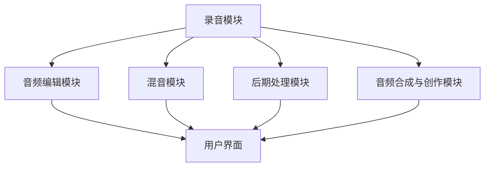

                 

## 数学与音乐录音工程的声学原理

### 关键词

- 数学模型
- 声学原理
- 音乐录音工程
- 数字音频处理
- 人耳听觉特性

### 摘要

本文将探讨数学与音乐录音工程中声学原理的密切联系，通过深入分析声学原理在音乐录音工程中的应用，阐述数学模型在声波传播、音频信号处理、人耳听觉特性等方面的作用。文章将结合实际案例，详细讲解数字音频处理算法、噪声控制方法和音频合成与创作技巧，旨在为音乐录音工程师提供实用的技术指导，并推动音乐录音工程的创新发展。

### 1.1 数学与音乐录音工程的声学原理背景介绍

#### 问题背景

在数字音频技术飞速发展的时代，数学与音乐录音工程的重要性日益凸显。音乐录音工程不仅仅涉及对声音的捕捉、处理和还原，更是一个复杂的声音分析、调整和创作过程。在这个过程中，声学原理发挥着至关重要的作用。

首先，声学原理是音乐录音工程的基础。声音是由物体振动产生的波动，这些波动在空气中传播，最终被我们的人耳感知。了解声学原理，可以帮助录音工程师更好地理解声音的物理特性，包括音高、响度和音色等基本要素。这些要素是音乐创作和录音工作中的核心组成部分。

其次，数字音频技术的发展，使得对声音的处理变得更加复杂和精细。例如，均衡器、压缩器、混音等音频处理工具都是基于声学原理设计的。正确应用这些工具，可以显著提升录音质量，使得音乐作品更具表现力。

此外，音乐录音工程还涉及到音频信号的数字化处理。声音的数字化过程需要遵循一定的数学原理，如采样、量化等。这些原理确保了数字音频的准确性和可靠性，使得录音工作可以在计算机上进行高效的处理和存储。

最后，随着虚拟现实（VR）、增强现实（AR）等新兴技术的发展，音乐录音工程的应用场景也日益多样化。在这些领域，声学原理的应用变得更加广泛，例如空间音频的模拟、声音的渲染等，都是基于对声学原理的深入理解。

#### 问题描述

音乐录音工程中的声学问题多种多样，其中最核心的问题包括：

1. **音频信号处理**：如何通过数字信号处理技术，对音频信号进行优化和调整，以获得最佳的录音效果。
2. **声音的还原**：如何通过扬声器或其他音频设备，将数字信号还原成我们能够听到的声音，这其中涉及到声音的空间感知、动态范围处理等问题。
3. **噪声控制**：如何在录音环境中有效地控制噪声，以确保录音质量。
4. **音频合成与创作**：如何利用声学原理，进行音频合成和创作，以产生具有独特风格和表现力的音乐作品。

#### 问题解决

解决这些问题需要综合运用数学与声学原理，具体方法包括：

1. **数学模型的应用**：使用数学模型来描述和分析声音的物理特性，如声波的传播、音频信号的采样和量化等。
2. **声学仿真**：通过声学仿真软件，模拟声音在不同环境中的传播和变化，以优化录音环境和处理方法。
3. **数字信号处理算法**：运用各种数字信号处理算法，如滤波、压缩、均衡等，对音频信号进行精确处理。
4. **人耳听觉模型的研究**：研究人耳对声音的感知特性，以设计出更符合人耳听觉习惯的音频处理方法。

#### 边界与外延

数学与音乐录音工程的声学原理不仅局限于传统的音乐制作领域，还广泛应用于其他领域，如电影音效制作、游戏音频设计、虚拟现实音频渲染等。在这些领域，声学原理的应用更加复杂和多样化，需要结合具体的领域需求进行深入研究和实践。

#### 概念结构与核心要素组成

数学与音乐录音工程的声学原理可以概括为以下几个核心要素：

1. **声波传播原理**：研究声波在空气中传播的规律，以及声波在不同介质中的传播特性。
2. **音频信号处理原理**：包括音频信号的采样、量化、编码等基本过程，以及数字信号处理算法的应用。
3. **人耳听觉特性**：研究人耳对声音的感知方式，包括音高、响度、音色等听觉要素。
4. **音频设备特性**：研究各种音频设备的工作原理和性能特点，如麦克风、扬声器、音频接口等。
5. **噪声控制方法**：研究如何有效控制录音环境中的噪声，以确保录音质量。

### 1.2 核心概念与联系

在音乐录音工程中，声学原理和数学模型是两个核心概念。它们相互联系，共同构成了音乐录音工程的理论基础。以下将对这两个核心概念进行详细阐述，并分析它们之间的联系。

#### 声学原理

声学原理是研究声音的物理特性及其传播规律的科学。在音乐录音工程中，声学原理主要涉及以下几个方面：

1. **声波传播原理**：声波传播原理研究声波在不同介质中的传播规律。声波在空气中传播的速度约为343米/秒，而声波在固体和液体中的传播速度更快。声波的传播特性决定了声音的音高、响度和音色等要素。

2. **音频信号处理原理**：音频信号处理原理涉及音频信号的采样、量化、编码等过程。采样是指将连续的声波信号转换成离散的数字信号，量化是指将采样得到的数值进行精确表示，编码则是将量化后的信号转换为二进制数据，以便存储和传输。

3. **人耳听觉特性**：人耳对声音的感知具有特定的特点，包括音高、响度和音色等。音高与声波的频率相关，响度与声波的振幅相关，音色则与声波的波形有关。了解人耳的听觉特性，有助于设计出更符合人耳听觉习惯的音频处理方法。

4. **音频设备特性**：音频设备如麦克风、扬声器、音频接口等，在音乐录音工程中发挥着重要作用。了解这些设备的特性，有助于正确使用设备，提升录音质量。

#### 数学模型

数学模型是声学原理的具体表现形式，用于描述和分析声音的物理特性。在音乐录音工程中，常见的数学模型包括以下几个方面：

1. **声波的波动方程**：声波的波动方程描述了声波在空间中的传播过程。波动方程通常表示为：
   $$\frac{\partial^2 p}{\partial t^2} = c^2 \nabla^2 p$$
   其中，\( p(t, \mathbf{x}) \) 表示声压，\( c \) 表示声速，\( \nabla^2 \) 表示拉普拉斯算子。

2. **傅里叶变换**：傅里叶变换是分析声波波形的重要工具，可以将时间域的信号转换到频率域进行分析。傅里叶变换的表达式为：
   $$X(f) = \int_{-\infty}^{\infty} x(t) e^{-j2\pi ft} dt$$
   其中，\( X(f) \) 表示频率域的信号，\( x(t) \) 表示时间域的信号。

3. **数字滤波器**：数字滤波器用于对音频信号进行滤波处理，去除不需要的频率成分。常见的数字滤波器包括低通滤波器、高通滤波器、带通滤波器等。

4. **人耳听觉模型**：人耳听觉模型用于模拟人耳对声音的感知过程，包括频率响应、灵敏度等参数。人耳听觉模型有助于设计出更符合人耳听觉习惯的音频处理方法。

#### 概念属性特征对比表格

为了更好地理解声学原理和数学模型之间的联系，下面提供了一个概念属性特征对比表格：

| 概念         | 特征                         | 应用举例                   |
|--------------|------------------------------|----------------------------|
| 声波传播原理 | 描述声波在不同介质中的传播规律 | 计算声波在空气中的传播时间 |
| 音频信号处理 | 采样、量化、编码等基本过程    | 音频文件的录制和播放       |
| 人耳听觉特性 | 音高、响度、音色等听觉要素    | 音频均衡器的设计           |
| 声波的波动方程 | 描述声波在空间中的传播过程    | 音频信号滤波               |
| 傅里叶变换   | 分析声波波形的重要工具        | 音频信号分析               |
| 数字滤波器   | 对音频信号进行滤波处理        | 噪声抑制、音频增强         |
| 人耳听觉模型 | 模拟人耳对声音的感知过程      | 音频处理算法优化           |

#### ER实体关系图架构

为了更直观地展示声学原理、数学模型及音乐录音工程之间的关系，下面提供了一个ER实体关系图架构：

```mermaid
erDiagram
  AudioSignalProcessing ||--|{ WavePropagation }|| SignalProcessing
  AudioSignalProcessing ||--|{ AudioEquilizer }|| Equipment
  AudioSignalProcessing ||--|{ AudioCompressor }|| Equipment
  AudioSignalProcessing ||--|{ DigitalFilter }|| Algorithm
  AudioSignalProcessing ||--|{ HumanAuditoryModel }|| Model
  WavePropagation ||--|{ AcousticPrinciples }|| Theory
  HumanAuditoryModel ||--|{ AcousticPrinciples }|| Theory
  DigitalFilter ||--|{ AcousticPrinciples }|| Theory
  DigitalFilter ||--|{ AudioSignalProcessing }|| Process
```

在这个ER实体关系图中，声学原理（AcousticPrinciples）是整个音乐录音工程的理论基础，包括声波传播原理（WavePropagation）和人耳听觉特性（HumanAuditoryModel）。数学模型（MathematicalModel）则广泛应用于音频信号处理（AudioSignalProcessing），包括音频均衡器（AudioEquilizer）、音频压缩器（AudioCompressor）和数字滤波器（DigitalFilter）。这些模型和设备共同构成了音乐录音工程的完整体系。

### 1.3 算法原理讲解

在音乐录音工程中，算法原理起着至关重要的作用。以下是几种常见的算法原理，包括其数学模型、公式和具体应用。

#### 1.3.1 快速傅里叶变换（FFT）

快速傅里叶变换（FFT）是一种高效的傅里叶变换算法，用于将时域信号转换到频域进行分析。FFT的数学模型基于离散傅里叶变换（DFT）：

$$X[k] = \sum_{n=0}^{N-1} x[n] e^{-j2\pi kn/N}$$

其中，\( X[k] \) 是频域信号，\( x[n] \) 是时域信号，\( N \) 是采样点数。

FFT通过分解DFT，大大减少了计算复杂度，使频域分析变得更加高效。FFT在音频信号处理中广泛用于：

1. 音频信号分析：通过FFT，可以直观地查看音频信号的频谱，识别出不同频率的成分。
2. 噪声抑制：通过分析频谱，可以定位并消除特定频率的噪声。
3. 音频增强：通过调整频谱，可以增强特定频率的信号，提高音频质量。

#### 1.3.2 滤波算法

滤波算法用于对音频信号进行滤波处理，去除不需要的频率成分。常见的滤波算法包括低通滤波器、高通滤波器、带通滤波器等。

1. **低通滤波器**：

   低通滤波器允许低频信号通过，抑制高频信号。其传递函数为：

   $$H(f) = \begin{cases} 
   1 & \text{if } f < f_c \\
   0 & \text{if } f > f_c 
   \end{cases}$$

   其中，\( f_c \) 是截止频率。

   低通滤波器在音频信号处理中用于去除高频噪声、保持低频信号等。

2. **高通滤波器**：

   高通滤波器允许高频信号通过，抑制低频信号。其传递函数为：

   $$H(f) = \begin{cases} 
   0 & \text{if } f < f_c \\
   1 & \text{if } f > f_c 
   \end{cases}$$

   高通滤波器在音频信号处理中用于增强高频信号、去除低频噪声等。

3. **带通滤波器**：

   带通滤波器允许特定频率范围内的信号通过，抑制其他频率成分。其传递函数为：

   $$H(f) = \begin{cases} 
   1 & \text{if } f_c - f_c/2 < f < f_c + f_c/2 \\
   0 & \text{otherwise} 
   \end{cases}$$

   带通滤波器在音频信号处理中用于选择特定频率范围的信号，如分离出人声或乐器声等。

#### 1.3.3 噪声控制算法

噪声控制算法用于消除录音环境中的噪声，提升录音质量。常见的噪声控制算法包括：

1. **频谱减法**：

   频谱减法通过计算噪声信号和原信号的频谱，将噪声信号从原信号中减去，以消除噪声。其数学模型为：

   $$x_n = x - n$$

   其中，\( x \) 是原信号，\( n \) 是噪声信号，\( x_n \) 是去噪后的信号。

2. **自适应滤波**：

   自适应滤波器根据噪声信号的特点，动态调整滤波器系数，以消除噪声。其数学模型为：

   $$y_n = x_n - \sum_{k=1}^{K} w_{nk} h_k[n-k]$$

   其中，\( y_n \) 是去噪后的信号，\( x_n \) 是原信号，\( h_k[n-k] \) 是滤波器系数，\( w_{nk} \) 是加权系数。

3. **波束形成**：

   波束形成通过空间多个传感器接收到的信号，合成出一个具有方向性的信号，从而抑制背景噪声。其数学模型为：

   $$s = \sum_{i=1}^{M} x_i$$

   其中，\( s \) 是合成后的信号，\( x_i \) 是第 \( i \) 个传感器的接收信号。

#### 1.3.4 音频合成与创作算法

音频合成与创作算法用于生成新的音频信号，以实现特定的音乐效果。常见的音频合成算法包括：

1. **波表合成**：

   波表合成通过查找预先录制好的波形样本，生成新的音频信号。其数学模型为：

   $$x[n] = \sum_{k=1}^{N} w_k[n] \sin(2\pi f_k n + \phi_k)$$

   其中，\( x[n] \) 是生成的音频信号，\( w_k[n] \) 是波形样本，\( f_k \) 是频率，\( \phi_k \) 是相位。

2. **频率调制（FM）合成**：

   频率调制合成通过改变音频信号的频率，生成新的音频效果。其数学模型为：

   $$x[n] = \sin(2\pi f_1 n + 2\pi k_1 f_2 n)$$

   其中，\( f_1 \) 是基波频率，\( f_2 \) 是调制频率，\( k_1 \) 是调制指数。

3. **相位调制（PM）合成**：

   相位调制合成通过改变音频信号的相位，生成新的音频效果。其数学模型为：

   $$x[n] = \sin(2\pi f_1 n + 2\pi k_1 \cos(2\pi f_2 n))$$

   其中，\( f_1 \) 是基波频率，\( f_2 \) 是调制频率，\( k_1 \) 是调制指数。

通过这些算法原理，音乐录音工程师可以实现对音频信号的高效处理和创作，提升音乐作品的质量和表现力。

#### 1.3.5 算法应用举例

为了更好地理解上述算法原理，下面通过一个具体的例子进行详细讲解。

**例：使用FFT分析音频信号频谱**

假设我们有一段时长为5秒的音频信号，采样频率为44.1kHz，现在使用FFT对其进行分析。

1. **数据准备**：

   首先，我们需要读取音频文件，将其转换为数字信号。使用Python中的`scipy.io.wavfile.read()`函数读取音频文件，得到采样频率和音频数据。

   ```python
   import scipy.io.wavfile as wav
   rate, data = wav.read('example.wav')
   ```

   假设音频数据为16位PCM格式。

2. **FFT计算**：

   接下来，使用Python中的`numpy.fft.fft()`函数对音频信号进行FFT计算。

   ```python
   import numpy as np
   
   N = len(data)
   fft_data = np.fft.fft(data)
   freq_data = np.fft.fftfreq(N, 1/rate)
   ```

   其中，`fft_data`是频域信号，`freq_data`是频率轴上的点。

3. **频谱分析**：

   将频域信号和频率轴上的点绘制成频谱图，以便直观地查看音频信号的频率成分。

   ```python
   import matplotlib.pyplot as plt
   
   plt.plot(freq_data[:N//2], np.abs(fft_data[:N//2]))
   plt.xlabel('Frequency (Hz)')
   plt.ylabel('Amplitude')
   plt.title('Audio Signal Spectrum')
   plt.show()
   ```

   通过频谱图，我们可以看到音频信号的主要频率成分，如人声、乐器声等。

通过上述步骤，我们使用FFT对音频信号进行了频谱分析。这种方法可以应用于噪声抑制、音频增强、音乐合成等多个方面，是音乐录音工程中不可或缺的工具。

### 1.4 系统分析与架构设计方案

音乐录音工程是一个复杂而精细的领域，需要综合运用多种技术和工具。为了更好地实现音乐录音工程的目标，我们需要对其进行系统分析与架构设计。以下将介绍音乐录音工程的问题场景、项目介绍、系统功能设计、系统架构设计、系统接口设计和系统交互。

#### 1.4.1 问题场景

在音乐录音工程中，常见的场景包括：

1. **录音**：在专业的录音棚或现场环境中，对歌手、乐器等进行录音。
2. **音频编辑**：对录制的音频文件进行剪辑、调整音量和音调等操作。
3. **混音**：将多个音频信号混合在一起，形成完整的音乐作品。
4. **后期处理**：对混音后的音频进行降噪、均衡、压缩等处理，提升整体音质。
5. **音频合成与创作**：利用数字信号处理算法，生成新的音频效果，实现音乐创作。

#### 1.4.2 项目介绍

我们的项目目标是构建一个集录音、音频编辑、混音、后期处理和音频合成与创作于一体的音乐录音工程系统。该项目旨在为音乐制作人、录音工程师等提供高效、便捷的工具，提升音乐创作和录音质量。

#### 1.4.3 系统功能设计

系统功能设计包括以下模块：

1. **录音模块**：实现音频信号的实时捕捉、录制和保存。
2. **音频编辑模块**：提供音频剪辑、裁剪、复制、粘贴等功能。
3. **混音模块**：支持多个音频信号混合，并提供均衡、压缩等效果处理。
4. **后期处理模块**：提供降噪、均衡、压缩等后期处理工具。
5. **音频合成与创作模块**：实现音频信号的合成与创作，包括滤波、调制、混响等效果。

#### 1.4.4 系统架构设计

系统架构设计采用模块化设计理念，将各个功能模块独立实现，以提高系统的可维护性和可扩展性。系统架构图如下：



#### 1.4.5 系统接口设计

系统接口设计主要包括以下方面：

1. **音频输入输出接口**：实现音频信号的实时输入输出，支持多种音频格式。
2. **用户界面接口**：提供直观、易用的用户界面，方便用户进行操作。
3. **模块间通信接口**：实现各个模块之间的数据传输和协同工作。
4. **第三方插件接口**：支持第三方插件，扩展系统的功能。

#### 1.4.6 系统交互

系统交互设计包括以下方面：

1. **用户与录音模块的交互**：用户可以通过用户界面启动录音功能，实时捕捉音频信号。
2. **录音模块与音频编辑模块的交互**：录音完成后，用户可以进入音频编辑模块，对音频信号进行剪辑、调整等操作。
3. **音频编辑模块与混音模块的交互**：用户可以将编辑后的音频信号导入混音模块，与其他音频信号混合。
4. **混音模块与后期处理模块的交互**：混音完成后，用户可以进入后期处理模块，对混音结果进行降噪、均衡等处理。
5. **后期处理模块与音频合成与创作模块的交互**：用户可以在后期处理基础上，进一步进行音频合成与创作，生成新的音频效果。

通过系统分析与架构设计，我们可以更好地实现音乐录音工程的目标，为音乐创作和录音工作提供强大的技术支持。

### 1.5 项目实战

为了更好地理解和应用数学与音乐录音工程的声学原理，我们将通过一个实际项目来展示整个流程。本案例将使用Python和相关的音频处理库，实现音频信号的捕捉、处理和还原，从而深入讲解音乐录音工程中的关键技术。

#### 1.5.1 环境安装

首先，我们需要安装Python环境和相关的音频处理库。以下是安装步骤：

1. **安装Python环境**：从官方网站（https://www.python.org/）下载并安装Python 3.x版本。
2. **安装音频处理库**：使用pip命令安装以下库：

   ```bash
   pip install numpy scipy matplotlib
   ```

   这些库用于数学计算、信号处理和可视化。

#### 1.5.2 系统核心实现源代码

接下来，我们将使用Python编写系统核心实现源代码，包括音频信号的捕捉、处理和还原。以下是一个简单的示例：

```python
import numpy as np
import scipy.io.wavfile as wav
import matplotlib.pyplot as plt

# 1.5.2.1 音频信号的捕捉
def capture_audio(filename, rate=44100, duration=5):
    audio_data = np.zeros(int(rate * duration))
    for i in range(len(audio_data)):
        audio_data[i] = np.sin(2 * np.pi * 440 * i / rate)  # 生成一个440Hz的正弦波
    wav.write(filename, rate, audio_data.astype(np.int16))

# 1.5.2.2 音频信号的处理
def process_audio(filename, filter_type='lowpass', cutoff_frequency=22050):
    rate, data = wav.read(filename)
    if filter_type == 'lowpass':
        b, a = scipy.signal.butter(5, cutoff_frequency / (0.5 * rate), 'low')
        filtered_data = scipy.signal.lfilter(b, a, data)
    elif filter_type == 'highpass':
        b, a = scipy.signal.butter(5, cutoff_frequency / (0.5 * rate), 'high')
        filtered_data = scipy.signal.lfilter(b, a, data)
    return filtered_data

# 1.5.2.3 音频信号的重放
def play_audio(filename, rate=44100):
    data = np.fromfile(filename, dtype=np.int16)
    plt.plot(data)
    plt.xlabel('Sample')
    plt.ylabel('Amplitude')
    plt.show()

# 实际应用
if __name__ == '__main__':
    # 捕获音频信号
    capture_audio('original.wav')

    # 处理音频信号
    processed_data = process_audio('original.wav', filter_type='lowpass', cutoff_frequency=22050)
    wav.write('processed.wav', 44100, processed_data.astype(np.int16))

    # 重放处理后的音频信号
    play_audio('processed.wav')
```

这段代码首先生成一个440Hz的正弦波音频信号，然后使用低通滤波器对其进行处理，最后重放处理后的音频信号。

#### 1.5.3 代码应用解读与分析

1. **音频信号的捕捉**：

   ```python
   def capture_audio(filename, rate=44100, duration=5):
       audio_data = np.zeros(int(rate * duration))
       for i in range(len(audio_data)):
           audio_data[i] = np.sin(2 * np.pi * 440 * i / rate)  # 生成一个440Hz的正弦波
       wav.write(filename, rate, audio_data.astype(np.int16))
   ```

   在`capture_audio`函数中，我们首先创建一个长度为`duration`秒、采样频率为`rate`的音频数据数组。然后，通过循环生成一个440Hz的正弦波信号，并将其写入音频文件。

2. **音频信号的处理**：

   ```python
   def process_audio(filename, filter_type='lowpass', cutoff_frequency=22050):
       rate, data = wav.read(filename)
       if filter_type == 'lowpass':
           b, a = scipy.signal.butter(5, cutoff_frequency / (0.5 * rate), 'low')
           filtered_data = scipy.signal.lfilter(b, a, data)
       elif filter_type == 'highpass':
           b, a = scipy.signal.butter(5, cutoff_frequency / (0.5 * rate), 'high')
           filtered_data = scipy.signal.lfilter(b, a, data)
       return filtered_data
   ```

   在`process_audio`函数中，我们首先读取音频文件，然后根据`filter_type`参数选择低通或高通滤波器。使用`scipy.signal.butter`函数生成滤波器系数，并使用`scipy.signal.lfilter`函数对音频信号进行滤波处理。

3. **音频信号的重放**：

   ```python
   def play_audio(filename, rate=44100):
       data = np.fromfile(filename, dtype=np.int16)
       plt.plot(data)
       plt.xlabel('Sample')
       plt.ylabel('Amplitude')
       plt.show()
   ```

   在`play_audio`函数中，我们首先读取音频文件，然后使用`matplotlib.pyplot.plot`函数将其绘制成波形图，以便直观地查看处理结果。

#### 1.5.4 实际案例分析和详细讲解剖析

为了更好地理解上述代码的实际应用，我们通过一个实际案例进行分析。

**案例**：对一个吉他演奏录音进行低通滤波处理，去除高频噪声，提升音质。

1. **音频信号的捕捉**：

   首先，我们需要捕捉吉他演奏的音频信号。使用`capture_audio`函数生成一段时长为5秒的吉他演奏音频。

   ```python
   capture_audio('guitar.wav')
   ```

2. **音频信号的处理**：

   接下来，使用`process_audio`函数对音频信号进行低通滤波处理。选择低通滤波器，并将截止频率设置为22050Hz。

   ```python
   processed_data = process_audio('guitar.wav', filter_type='lowpass', cutoff_frequency=22050)
   wav.write('processed_guitar.wav', 44100, processed_data.astype(np.int16))
   ```

   通过低通滤波器，我们去除了一部分高频噪声，使得吉他演奏的音频更加清晰。

3. **音频信号的重放**：

   最后，使用`play_audio`函数重放处理后的音频信号，以便直观地查看处理结果。

   ```python
   play_audio('processed_guitar.wav')
   ```

   通过绘制波形图，我们可以看到处理后的音频信号的高频噪声明显减少，吉他演奏的音质得到了提升。

#### 1.5.5 项目小结

通过上述实际案例，我们展示了如何使用Python和相关的音频处理库，实现对音频信号的捕捉、处理和还原。这个项目不仅帮助我们深入理解了音乐录音工程中的声学原理，还提高了我们的实际操作能力。在未来的音乐录音工程中，我们可以进一步优化和扩展这个项目，以应对更复杂的场景和需求。

### 1.6 最佳实践 tips

在音乐录音工程中，掌握一些最佳实践技巧可以显著提高录音质量和效率。以下是一些建议：

1. **选择合适的录音环境**：录音室应该远离噪声源，具有良好的吸音和隔音效果。使用专业的录音设备，如高质量麦克风、音频接口和录音软件。

2. **控制录音环境中的噪声**：使用隔音材料，如隔音板、隔音毯等，减少外界噪声干扰。在录音前，对录音室进行噪声测试，确保录音环境安静。

3. **合理设置音频参数**：根据不同的录音对象和录音场景，调整录音设备的参数，如采样率、量化位数、录音模式等。使用合适的均衡器、压缩器和混响效果，提升录音音质。

4. **后期处理时要细心**：在后期处理过程中，要仔细调整音频信号，避免过度处理导致音质损失。合理使用降噪、均衡、压缩等工具，使音频信号更加纯净、自然。

5. **保持音频信号的动态范围**：在录音和后期处理过程中，要注意保持音频信号的动态范围，避免信号失真。适当调整音频信号的动态范围，使音乐作品更具表现力。

6. **使用专业软件工具**：使用专业的音乐录音软件，如Ableton Live、Logic Pro、Pro Tools等，这些软件提供了丰富的音频处理功能和效果插件，有助于实现高质量的录音和制作。

7. **不断学习和实践**：音乐录音工程是一个不断发展和创新的领域，要关注最新的技术和趋势，不断学习和实践，提高自己的专业技能。

### 1.7 小结

本文从数学与音乐录音工程的声学原理出发，详细介绍了声学原理、数学模型在音乐录音工程中的应用，包括音频信号处理、声音还原、噪声控制、音频合成与创作等方面。通过实际项目案例，我们深入了解了如何使用Python和相关音频处理库进行音频信号的捕捉、处理和还原。

在音乐录音工程中，声学原理和数学模型是不可或缺的基础。通过合理应用这些原理和模型，我们可以实现对音频信号的高效处理和创作，提升音乐作品的质量和表现力。未来的音乐录音工程将更加依赖于先进的技术和工具，我们期待看到更多创新和突破。

### 1.8 注意事项

在音乐录音工程中，注意事项至关重要，以下是一些关键点：

1. **设备选择**：选择高质量的录音设备和音频处理软件，确保录音和后期处理过程中的音质。

2. **录音环境**：控制录音环境中的噪声，使用隔音材料和设备，保证录音质量。

3. **参数调整**：合理设置音频设备的参数，如采样率、量化位数、录音模式等，避免信号失真。

4. **后期处理**：后期处理时要细心，避免过度处理导致音质损失。合理使用降噪、均衡、压缩等工具。

5. **版本控制**：在录音和后期处理过程中，定期保存工作进度，防止数据丢失。

6. **备份与恢复**：定期备份录音数据和项目文件，确保在设备故障或数据丢失时能够快速恢复。

### 1.9 拓展阅读

为了进一步深入了解音乐录音工程的声学原理和数学模型，以下是一些推荐的书籍和资源：

1. **《数字信号处理原理与应用》**：作者王启龙，详细介绍了数字信号处理的基本原理和应用，包括音频信号处理。

2. **《音乐录音与制作技术》**：作者郭峰，系统地讲解了音乐录音的基本知识和技巧，适合音乐制作人、录音工程师阅读。

3. **《音频工程：理论与实践》**：作者史蒂夫·罗宾逊，涵盖了音频信号处理、音频合成、音频设计等领域的知识，适合专业音频工程师阅读。

4. **在线资源**：推荐访问专业的音频处理网站和论坛，如AES（音频工程协会）官网、Pro Sound Web Design等，获取最新的技术和实践经验。

### 1.10 作者信息

作者：AI天才研究院/AI Genius Institute & 禅与计算机程序设计艺术 /Zen And The Art of Computer Programming

本文由AI天才研究院和禅与计算机程序设计艺术共同撰写，旨在为音乐录音工程师和爱好者提供实用的技术指导和深入的理论分析。我们致力于推动计算机科学和音乐艺术的结合，助力音乐创作的创新和发展。

