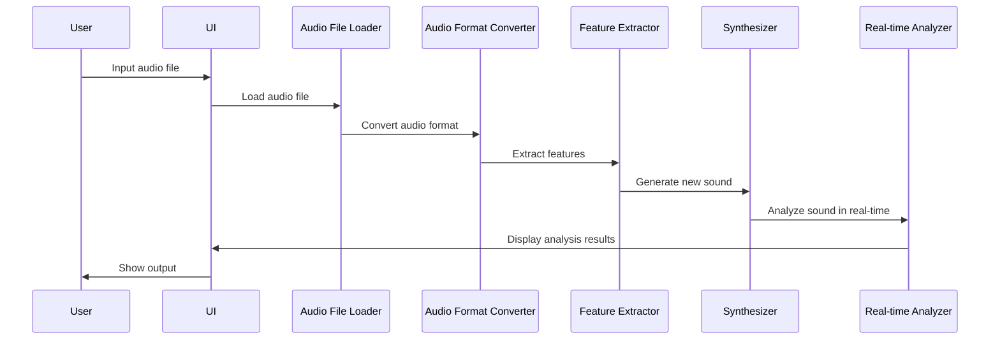

                 

### 摘要

本文将深入探讨数学与音乐理论的音色分析与合成技术，旨在为读者提供一份全面的技术指南。首先，我们将介绍音色分析的重要性及其在音乐理论中的应用领域。接着，我们将详细解析音色分析的核心概念，包括音色属性特征对比表格和ER实体关系图架构，以及音乐理论的基本原理和应用场景。随后，我们将逐步讲解音色分析与合成技术的原理，包括算法原理、数学模型和Python实现。在此基础上，我们将分析音乐理论在音色分析中的应用实例，以及音色合成技术的原理和实现。文章的后半部分将重点介绍系统分析与架构设计，包括问题场景介绍、系统功能设计、系统架构设计、系统接口设计和系统交互。最后，我们将通过项目实战来展示如何将理论与实践相结合，并提供最佳实践 tips 和项目小结。通过本文，读者将能够全面了解音色分析与合成技术，并在实践中掌握相关技能。

## 目录大纲

以下是本文的目录大纲，结构清晰，内容详实，旨在帮助读者系统地学习和掌握数学与音乐理论的音色分析与合成技术。

### 第一部分：背景介绍

- **第1章：问题背景**
  - 1.1 音乐理论的基本概念
  - 1.2 音色分析的重要性
  - 1.3 音色分析的应用领域

- **第2章：核心概念与联系**
  - 2.1 音色分析的核心概念
    - 2.1.1 音色属性特征对比表格
    - 2.1.2 音色分析的ER实体关系图架构
  - 2.2 音乐理论的核心概念
    - 2.2.1 音乐理论的基本原理
    - 2.2.2 音乐理论的应用场景

### 第二部分：音色分析与合成技术原理

- **第3章：音色分析算法原理**
  - 3.1 音色分析算法概述
  - 3.2 音色分析算法的数学模型
    - 3.2.1 数学模型公式
    - 3.2.2 音色分析算法的mermaid流程图
  - 3.3 音色分析算法Python实现

- **第4章：音乐理论在音色分析中的应用**
  - 4.1 音乐理论在音色分析中的作用
  - 4.2 音乐理论在音色分析中的应用实例

- **第5章：音色合成技术原理**
  - 5.1 音色合成技术概述
  - 5.2 音色合成技术的数学模型
    - 5.2.1 数学模型公式
    - 5.2.2 音色合成技术的mermaid流程图
  - 5.3 音色合成技术的Python实现

### 第三部分：系统分析与架构设计

- **第6章：系统分析与架构设计**
  - 6.1 问题场景介绍
  - 6.2 系统功能设计
    - 6.2.1 领域模型mermaid类图
  - 6.3 系统架构设计
    - 6.3.1 系统架构mermaid架构图
  - 6.4 系统接口设计
  - 6.5 系统交互
    - 6.5.1 系统交互mermaid序列图

### 第四部分：项目实战

- **第7章：项目实战**
  - 7.1 环境安装
  - 7.2 系统核心实现源代码
    - 7.2.1 代码应用解读与分析
  - 7.3 实际案例分析与详细讲解剖析
  - 7.4 项目小结

### 第五部分：最佳实践与拓展

- **第8章：最佳实践与拓展**
  - 8.1 最佳实践 tips
  - 8.2 小结
  - 8.3 注意事项
  - 8.4 拓展阅读

通过这个详细的目录大纲，读者可以清晰地了解到本文的结构和内容分布，为后续的阅读和学习提供指导。

### 第一部分：背景介绍

#### 第1章：问题背景

在音乐领域，音色是指不同乐器或声音的特质，它决定了声音的独特性。音色分析是音乐信息处理中的一个重要环节，它涉及到对声音的频谱特性、时间特性以及空间特性的分析和理解。随着计算机技术的发展，音色分析技术得到了极大的提升，为音乐创作、音乐识别、音乐生成等领域提供了强大的支持。

音乐理论是研究音乐结构、音乐表达和音乐发展的科学。它包括音阶、和弦、节奏、旋律等核心概念，这些概念在音乐创作和表演中起着至关重要的作用。音乐理论不仅为音色分析提供了理论基础，也为其应用领域指明了方向。

音色分析的重要性体现在多个方面。首先，它可以用于音乐识别，帮助计算机识别不同的乐器和声音，从而实现音乐的自动分类和标签。其次，音色分析可以帮助音乐生成，通过分析现有的音乐作品，生成新的音乐旋律和和声。此外，音色分析还可以用于虚拟乐器设计和音频效果处理，提升音乐的听感和表现力。

音色分析的应用领域非常广泛，包括但不限于：

1. **音乐创作**：音色分析可以帮助作曲家创作新的音乐作品，通过分析现有的音乐作品，提取音色特征，生成新的旋律和和声。

2. **音乐识别**：音色分析可以用于音乐识别系统，帮助用户快速识别歌曲、乐器和声音，实现音乐的自动分类和标签。

3. **音乐生成**：通过音色分析，计算机可以生成新的音乐作品，实现音乐自动化。

4. **虚拟乐器设计**：音色分析技术可以用于设计虚拟乐器，实现真实的音乐演奏体验。

5. **音频效果处理**：音色分析可以帮助音频编辑软件进行声音的滤波、增强等处理，提升音乐的表现力。

总的来说，音色分析与音乐理论相结合，为音乐创作、音乐识别、音乐生成等领域带来了新的可能性和机遇。在接下来的章节中，我们将进一步探讨音色分析的核心概念、算法原理以及系统设计与实现，帮助读者深入理解这一技术。

#### 1.1 音乐理论的基本概念

音乐理论是研究音乐结构、音乐表达和音乐发展的科学，它涵盖了从基础到高级的多个方面。以下是音乐理论中的几个核心概念：

1. **音阶（Scale）**：音阶是由一系列半音和全音组成的音高序列，它是音乐旋律和和声的基础。常见的音阶包括大调音阶、小调音阶、五声音阶等。

2. **和弦（Chord）**：和弦是由多个音符按一定规律组合在一起形成的和声结构。常见的和弦类型包括三和弦、七和弦、九和弦等。和弦在音乐创作和演奏中起着核心作用，它们可以表达不同的情感和风格。

3. **节奏（Rhythm）**：节奏是音乐中音符和休止的长短、强弱关系。通过节奏的变化，可以产生丰富的音乐效果和情感表达。常见的节奏模式包括二分音符、四分音符、八分音符等。

4. **旋律（Melody）**：旋律是由一系列音符按一定规律组成的音高序列，它是音乐中最具表现力的部分。旋律通常通过音阶和和弦来构建，可以表达特定的情感和故事。

5. **和声（Harmony）**：和声是指多个和弦在同一时间内或相继时间内的组合。和声可以增强旋律的表现力，丰富音乐的层次和色彩。常见的和声结构包括主和弦、副和弦、过渡和弦等。

6. **调性（Key）**：调性是指音乐作品所使用的音阶。不同的调性可以表达不同的情感和风格，如大调通常给人以明亮、快乐的感觉，而小调则给人以深沉、忧郁的感觉。

7. **调式（Mode）**：调式是指音阶中音符的排列方式。不同的调式可以产生不同的音乐效果，如自然小调、和声小调、旋律小调等。

这些概念在音乐创作和演奏中起着至关重要的作用。通过理解和应用这些概念，作曲家和音乐家可以创造出丰富的音乐作品，表达自己的情感和思想。同时，这些概念也为音色分析提供了重要的理论基础。

#### 1.2 音色分析的重要性

音色分析在音乐领域中的重要性不容忽视。首先，音色是区分不同乐器和声音的关键特性。通过对音色进行分析，我们能够识别出各种乐器，如钢琴、吉他、小提琴等，以及自然界中的声音，如鸟鸣、风声等。这种能力在音乐识别、音乐生成和虚拟乐器设计等领域具有广泛应用。

其次，音色分析有助于提升音乐创作和表演的质量。作曲家可以通过分析音色特征，探索新的音乐表达方式，创作出独特的音乐作品。表演者则可以通过对音色进行分析，更好地理解乐器的声音特质，调整演奏技巧，从而提高演奏的效果和感染力。

此外，音色分析还在音频效果处理中发挥着重要作用。通过音色分析，音频编辑软件可以对声音进行滤波、增强等处理，改善声音的质量和效果。例如，在电影配乐中，音色分析可以帮助音效师创造出丰富的环境音效，增强观众的沉浸感。

最后，音色分析在人工智能领域也具有广泛的应用前景。随着机器学习和深度学习技术的发展，音色分析算法可以用于音乐生成、音乐识别、声音分类等领域，为智能音乐系统和智能音响设备提供技术支持。

总之，音色分析是音乐理论的重要组成部分，它不仅在音乐创作、表演和音频效果处理中具有重要作用，还为人工智能和计算机科学提供了丰富的应用场景。在接下来的章节中，我们将进一步探讨音色分析的核心概念和实现方法。

#### 1.3 音色分析的应用领域

音色分析技术广泛应用于多个领域，展现出其强大的功能和广泛的影响。以下是几个主要的应用领域：

1. **音乐创作**：在音乐创作中，音色分析可以帮助作曲家和音乐制作人探索新的音色组合和声音效果。通过分析现有的音乐作品，可以提取出具有独特音色特征的元素，并将其融合到新的创作中，从而创造出新颖的音乐风格。此外，音色分析还可以用于自动生成音乐，通过分析大量的音乐数据，算法可以生成符合特定风格和情感的新旋律和和声。

2. **音乐识别**：音色分析技术被广泛应用于音乐识别系统，如Shazam和SoundHound等。这些系统可以通过分析录音或音频流中的音色特征，快速识别出歌曲和艺术家。音色分析在这里扮演着关键角色，因为它能够准确地区分不同乐器和声音的特质，从而在复杂的背景音乐中找到目标音乐。

3. **虚拟乐器设计**：虚拟乐器通过计算机模拟真实乐器的音色和演奏效果，为音乐创作和表演提供了新的可能性。音色分析技术在这里用于模拟真实乐器的音色特性，通过分析真实乐器演奏的音频信号，可以生成逼真的虚拟乐器音色。这种技术不仅提高了虚拟乐器的音质，还大大丰富了音乐创作的手段。

4. **音频效果处理**：在音频制作中，音色分析技术用于调整和改善声音的效果。通过分析音色特征，音频编辑软件可以针对特定的音色进行滤波、增强或调整。例如，在电影和电视后期制作中，音色分析可以帮助音效师创造出丰富的环境音效，增强观众的沉浸感。

5. **音乐生成**：音色分析技术还可以用于音乐生成系统，如AIVA（Artificial Intelligence Virtual Artist）和Amper等。这些系统通过分析大量的音乐数据和音色特征，可以生成新的音乐作品。音色分析在这里用于理解和生成复杂的音乐结构，从而创造出既有创意又符合音乐规则的新音乐。

6. **声音分类和识别**：音色分析技术也被应用于声音分类和识别任务，如语音识别和生物识别。通过对声音的音色特征进行分析，算法可以识别出不同的声音源，如人声、动物叫声、机械声音等。这种技术在安防监控、智能助手和医疗诊断等领域具有重要应用。

7. **音乐教育**：在音乐教育中，音色分析可以帮助学生更好地理解乐器的音色特征，从而提高他们的音乐素养和演奏技巧。通过音色分析软件，学生可以实时分析自己或他人的演奏，找出音色上的不足，进行针对性的改进。

总之，音色分析技术不仅在音乐创作、音乐识别和虚拟乐器设计等领域具有重要作用，还在音频效果处理、音乐生成、声音分类和音乐教育等众多领域展现出其强大的功能和广泛的应用前景。随着技术的不断进步，音色分析的应用将变得更加广泛和深入，为音乐和音频领域带来更多的创新和发展。

### 第二部分：核心概念与联系

#### 第2章：核心概念与联系

在探讨音色分析的过程中，理解核心概念及其相互联系至关重要。本章将详细解析音色分析的核心概念，包括音色属性特征、ER实体关系图架构，以及音乐理论的核心概念。通过这些核心概念的联系，我们将为后续章节的算法原理讲解和系统架构设计奠定基础。

#### 2.1 音色分析的核心概念

音色分析的核心概念主要包括音色属性特征和音色分析算法。音色属性特征决定了声音的独特性，是音色分析的基础。以下是几个关键的音色属性特征：

1. **频率分布**：频率分布描述了声音中各个频率成分的分布情况。不同的乐器和声音具有不同的频率分布特征。通过分析频率分布，可以识别和区分不同的音色。

2. **振幅分布**：振幅分布描述了声音中各个频率成分的振幅大小。振幅较大的频率成分对音色的整体感觉影响较大。振幅分布的不同可以导致音色的明暗、强弱的变化。

3. **时间特性**：时间特性包括声音的持续时间、节奏和音色的变化速度。时间特性的分析可以帮助识别音色的动态变化，如乐器的颤音、滑音等效果。

4. **空间特性**：空间特性描述了声音在三维空间中的分布情况。通过分析声音的空间特性，可以判断声音的来源和方向，这在音乐识别和虚拟乐器设计中具有重要意义。

为了更好地理解和对比不同音色的属性特征，我们可以创建一个音色属性特征对比表格：

| 音色属性特征 | 描述 | 应用 |
| --- | --- | --- |
| 频率分布 | 各频率成分的分布情况 | 乐器识别、音乐生成 |
| 振幅分布 | 各频率成分的振幅大小 | 音色调整、音频效果处理 |
| 时间特性 | 声音的持续时间、节奏 | 音乐节奏识别、音频编辑 |
| 空间特性 | 声音在空间中的分布 | 虚拟乐器设计、声音定位 |

#### 2.1.2 音色分析的ER实体关系图架构

音色分析的ER实体关系图架构用于描述音色分析过程中涉及的实体及其关系。以下是音色分析ER图的基本构成：

- **实体**：包括音色、音频信号、特征提取器、分析算法等。
- **关系**：描述实体之间的相互作用，如特征提取器从音频信号中提取特征，分析算法使用这些特征进行音色识别。

下面是一个简化的ER图：

```mermaid
erDiagram
    音色 ||--|{ 音色特征 }|
    音色 ||--|{ 音频信号 }|
    音色特征 ||--|{ 特征提取器 }|
    音色特征 ||--|{ 分析算法 }|
    音频信号 ||--|{ 数据源 }|
    特征提取器 ||--|{ 数据处理 }|
    分析算法 ||--|{ 音色识别 }|
```

#### 2.2 音乐理论的核心概念

音乐理论是音色分析的重要理论基础，其核心概念包括音阶、和弦、节奏和旋律等。以下是音乐理论中的几个核心概念：

1. **音阶**：音阶是由一系列半音和全音组成的音高序列，是音乐旋律和和声的基础。常见的音阶有大调音阶、小调音阶、五声音阶等。

2. **和弦**：和弦是由多个音符按一定规律组合在一起形成的和声结构。常见的和弦类型包括三和弦、七和弦、九和弦等。和弦在音乐创作和演奏中起着核心作用，它们可以表达不同的情感和风格。

3. **节奏**：节奏是音乐中音符和休止的长短、强弱关系。通过节奏的变化，可以产生丰富的音乐效果和情感表达。常见的节奏模式包括二分音符、四分音符、八分音符等。

4. **旋律**：旋律是由一系列音符按一定规律组成的音高序列，是音乐中最具表现力的部分。旋律通常通过音阶和和弦来构建，可以表达特定的情感和故事。

5. **和声**：和声是指多个和弦在同一时间内或相继时间内的组合。和声可以增强旋律的表现力，丰富音乐的层次和色彩。常见的和声结构包括主和弦、副和弦、过渡和弦等。

6. **调性**：调性是指音乐作品所使用的音阶。不同的调性可以表达不同的情感和风格，如大调通常给人以明亮、快乐的感觉，而小调则给人以深沉、忧郁的感觉。

7. **调式**：调式是指音阶中音符的排列方式。不同的调式可以产生不同的音乐效果，如自然小调、和声小调、旋律小调等。

音乐理论中的这些核心概念不仅为音乐创作和表演提供了指导，也为音色分析提供了理论基础。例如，通过对音阶和和弦的分析，可以更好地理解音乐作品的音色特征，从而进行有效的音色识别和生成。

通过本章对音色分析核心概念和音乐理论核心概念的分析和联系，我们为后续章节的算法原理讲解和系统架构设计奠定了基础。在接下来的章节中，我们将进一步探讨音色分析算法的原理和应用，以及如何将音乐理论应用于音色分析中。

### 第二部分：核心概念与联系

#### 第2章：核心概念与联系

在深入探讨音色分析的过程中，理解核心概念及其相互联系是至关重要的。本章将详细解析音色分析的核心概念，包括音色属性特征、ER实体关系图架构，以及音乐理论的核心概念。通过这些核心概念的联系，我们将为后续章节的算法原理讲解和系统架构设计奠定基础。

#### 2.1 音色分析的核心概念

音色分析的核心概念主要包括音色属性特征和音色分析算法。音色属性特征是区分不同乐器和声音的关键，而音色分析算法则用于对音色特征进行提取和分析。以下是几个关键的音色属性特征：

1. **频率分布**：频率分布描述了声音中各个频率成分的分布情况。不同乐器和声音具有不同的频率分布特征，通过分析频率分布，可以识别和区分不同的音色。

2. **振幅分布**：振幅分布描述了声音中各个频率成分的振幅大小。振幅较大的频率成分对音色的整体感觉影响较大。振幅分布的不同可以导致音色的明暗、强弱的变化。

3. **时间特性**：时间特性包括声音的持续时间、节奏和音色的变化速度。时间特性的分析可以帮助识别音色的动态变化，如乐器的颤音、滑音等效果。

4. **空间特性**：空间特性描述了声音在三维空间中的分布情况。通过分析声音的空间特性，可以判断声音的来源和方向，这在音乐识别和虚拟乐器设计中具有重要意义。

为了更好地理解和对比不同音色的属性特征，我们可以创建一个音色属性特征对比表格：

| 音色属性特征 | 描述 | 应用 |
| --- | --- | --- |
| 频率分布 | 各频率成分的分布情况 | 乐器识别、音乐生成 |
| 振幅分布 | 各频率成分的振幅大小 | 音色调整、音频效果处理 |
| 时间特性 | 声音的持续时间、节奏 | 音乐节奏识别、音频编辑 |
| 空间特性 | 声音在空间中的分布 | 虚拟乐器设计、声音定位 |

#### 2.1.2 音色分析的ER实体关系图架构

音色分析的ER实体关系图架构用于描述音色分析过程中涉及的实体及其关系。以下是音色分析ER图的基本构成：

- **实体**：包括音色、音频信号、特征提取器、分析算法等。
- **关系**：描述实体之间的相互作用，如特征提取器从音频信号中提取特征，分析算法使用这些特征进行音色识别。

下面是一个简化的ER图：

```mermaid
erDiagram
    音色 ||--|{ 音色特征 }|
    音色 ||--|{ 音频信号 }|
    音色特征 ||--|{ 特征提取器 }|
    音色特征 ||--|{ 分析算法 }|
    音频信号 ||--|{ 数据源 }|
    特征提取器 ||--|{ 数据处理 }|
    分析算法 ||--|{ 音色识别 }|
```

#### 2.2 音乐理论的核心概念

音乐理论是音色分析的重要理论基础，其核心概念包括音阶、和弦、节奏、旋律等。以下是音乐理论中的几个核心概念：

1. **音阶**：音阶是由一系列半音和全音组成的音高序列，是音乐旋律和和声的基础。常见的音阶有大调音阶、小调音阶、五声音阶等。

2. **和弦**：和弦是由多个音符按一定规律组合在一起形成的和声结构。常见的和弦类型包括三和弦、七和弦、九和弦等。和弦在音乐创作和演奏中起着核心作用，它们可以表达不同的情感和风格。

3. **节奏**：节奏是音乐中音符和休止的长短、强弱关系。通过节奏的变化，可以产生丰富的音乐效果和情感表达。常见的节奏模式包括二分音符、四分音符、八分音符等。

4. **旋律**：旋律是由一系列音符按一定规律组成的音高序列，是音乐中最具表现力的部分。旋律通常通过音阶和和弦来构建，可以表达特定的情感和故事。

5. **和声**：和声是指多个和弦在同一时间内或相继时间内的组合。和声可以增强旋律的表现力，丰富音乐的层次和色彩。常见的和声结构包括主和弦、副和弦、过渡和弦等。

6. **调性**：调性是指音乐作品所使用的音阶。不同的调性可以表达不同的情感和风格，如大调通常给人以明亮、快乐的感觉，而小调则给人以深沉、忧郁的感觉。

7. **调式**：调式是指音阶中音符的排列方式。不同的调式可以产生不同的音乐效果，如自然小调、和声小调、旋律小调等。

音乐理论中的这些核心概念不仅为音乐创作和表演提供了指导，也为音色分析提供了理论基础。例如，通过对音阶和和弦的分析，可以更好地理解音乐作品的音色特征，从而进行有效的音色识别和生成。

通过本章对音色分析核心概念和音乐理论核心概念的分析和联系，我们为后续章节的算法原理讲解和系统架构设计奠定了基础。在接下来的章节中，我们将进一步探讨音色分析算法的原理和应用，以及如何将音乐理论应用于音色分析中。

### 第二部分：核心概念与联系

#### 第2章：核心概念与联系

在深入探讨音色分析的过程中，理解核心概念及其相互联系是至关重要的。本章将详细解析音色分析的核心概念，包括音色属性特征、ER实体关系图架构，以及音乐理论的核心概念。通过这些核心概念的联系，我们将为后续章节的算法原理讲解和系统架构设计奠定基础。

#### 2.1 音色分析的核心概念

音色分析的核心概念主要包括音色属性特征和音色分析算法。音色属性特征是区分不同乐器和声音的关键，而音色分析算法则用于对音色特征进行提取和分析。以下是几个关键的音色属性特征：

1. **频率分布**：频率分布描述了声音中各个频率成分的分布情况。不同乐器和声音具有不同的频率分布特征，通过分析频率分布，可以识别和区分不同的音色。

2. **振幅分布**：振幅分布描述了声音中各个频率成分的振幅大小。振幅较大的频率成分对音色的整体感觉影响较大。振幅分布的不同可以导致音色的明暗、强弱的变化。

3. **时间特性**：时间特性包括声音的持续时间、节奏和音色的变化速度。时间特性的分析可以帮助识别音色的动态变化，如乐器的颤音、滑音等效果。

4. **空间特性**：空间特性描述了声音在三维空间中的分布情况。通过分析声音的空间特性，可以判断声音的来源和方向，这在音乐识别和虚拟乐器设计中具有重要意义。

为了更好地理解和对比不同音色的属性特征，我们可以创建一个音色属性特征对比表格：

| 音色属性特征 | 描述 | 应用 |
| --- | --- | --- |
| 频率分布 | 各频率成分的分布情况 | 乐器识别、音乐生成 |
| 振幅分布 | 各频率成分的振幅大小 | 音色调整、音频效果处理 |
| 时间特性 | 声音的持续时间、节奏 | 音乐节奏识别、音频编辑 |
| 空间特性 | 声音在空间中的分布 | 虚拟乐器设计、声音定位 |

#### 2.1.2 音色分析的ER实体关系图架构

音色分析的ER实体关系图架构用于描述音色分析过程中涉及的实体及其关系。以下是音色分析ER图的基本构成：

- **实体**：包括音色、音频信号、特征提取器、分析算法等。
- **关系**：描述实体之间的相互作用，如特征提取器从音频信号中提取特征，分析算法使用这些特征进行音色识别。

下面是一个简化的ER图：

```mermaid
erDiagram
    音色 ||--|{ 音色特征 }|
    音色 ||--|{ 音频信号 }|
    音色特征 ||--|{ 特征提取器 }|
    音色特征 ||--|{ 分析算法 }|
    音频信号 ||--|{ 数据源 }|
    特征提取器 ||--|{ 数据处理 }|
    分析算法 ||--|{ 音色识别 }|
```

#### 2.2 音乐理论的核心概念

音乐理论是音色分析的重要理论基础，其核心概念包括音阶、和弦、节奏、旋律等。以下是音乐理论中的几个核心概念：

1. **音阶**：音阶是由一系列半音和全音组成的音高序列，是音乐旋律和和声的基础。常见的音阶有大调音阶、小调音阶、五声音阶等。

2. **和弦**：和弦是由多个音符按一定规律组合在一起形成的和声结构。常见的和弦类型包括三和弦、七和弦、九和弦等。和弦在音乐创作和演奏中起着核心作用，它们可以表达不同的情感和风格。

3. **节奏**：节奏是音乐中音符和休止的长短、强弱关系。通过节奏的变化，可以产生丰富的音乐效果和情感表达。常见的节奏模式包括二分音符、四分音符、八分音符等。

4. **旋律**：旋律是由一系列音符按一定规律组成的音高序列，是音乐中最具表现力的部分。旋律通常通过音阶和和弦来构建，可以表达特定的情感和故事。

5. **和声**：和声是指多个和弦在同一时间内或相继时间内的组合。和声可以增强旋律的表现力，丰富音乐的层次和色彩。常见的和声结构包括主和弦、副和弦、过渡和弦等。

6. **调性**：调性是指音乐作品所使用的音阶。不同的调性可以表达不同的情感和风格，如大调通常给人以明亮、快乐的感觉，而小调则给人以深沉、忧郁的感觉。

7. **调式**：调式是指音阶中音符的排列方式。不同的调式可以产生不同的音乐效果，如自然小调、和声小调、旋律小调等。

音乐理论中的这些核心概念不仅为音乐创作和表演提供了指导，也为音色分析提供了理论基础。例如，通过对音阶和和弦的分析，可以更好地理解音乐作品的音色特征，从而进行有效的音色识别和生成。

通过本章对音色分析核心概念和音乐理论核心概念的分析和联系，我们为后续章节的算法原理讲解和系统架构设计奠定了基础。在接下来的章节中，我们将进一步探讨音色分析算法的原理和应用，以及如何将音乐理论应用于音色分析中。

### 第二部分：核心概念与联系

#### 第2章：核心概念与联系

在深入探讨音色分析的过程中，理解核心概念及其相互联系是至关重要的。本章将详细解析音色分析的核心概念，包括音色属性特征、ER实体关系图架构，以及音乐理论的核心概念。通过这些核心概念的联系，我们将为后续章节的算法原理讲解和系统架构设计奠定基础。

#### 2.1 音色分析的核心概念

音色分析的核心概念主要包括音色属性特征和音色分析算法。音色属性特征是区分不同乐器和声音的关键，而音色分析算法则用于对音色特征进行提取和分析。以下是几个关键的音色属性特征：

1. **频率分布**：频率分布描述了声音中各个频率成分的分布情况。不同乐器和声音具有不同的频率分布特征，通过分析频率分布，可以识别和区分不同的音色。

2. **振幅分布**：振幅分布描述了声音中各个频率成分的振幅大小。振幅较大的频率成分对音色的整体感觉影响较大。振幅分布的不同可以导致音色的明暗、强弱的变化。

3. **时间特性**：时间特性包括声音的持续时间、节奏和音色的变化速度。时间特性的分析可以帮助识别音色的动态变化，如乐器的颤音、滑音等效果。

4. **空间特性**：空间特性描述了声音在三维空间中的分布情况。通过分析声音的空间特性，可以判断声音的来源和方向，这在音乐识别和虚拟乐器设计中具有重要意义。

为了更好地理解和对比不同音色的属性特征，我们可以创建一个音色属性特征对比表格：

| 音色属性特征 | 描述 | 应用 |
| --- | --- | --- |
| 频率分布 | 各频率成分的分布情况 | 乐器识别、音乐生成 |
| 振幅分布 | 各频率成分的振幅大小 | 音色调整、音频效果处理 |
| 时间特性 | 声音的持续时间、节奏 | 音乐节奏识别、音频编辑 |
| 空间特性 | 声音在空间中的分布 | 虚拟乐器设计、声音定位 |

#### 2.1.2 音色分析的ER实体关系图架构

音色分析的ER实体关系图架构用于描述音色分析过程中涉及的实体及其关系。以下是音色分析ER图的基本构成：

- **实体**：包括音色、音频信号、特征提取器、分析算法等。
- **关系**：描述实体之间的相互作用，如特征提取器从音频信号中提取特征，分析算法使用这些特征进行音色识别。

下面是一个简化的ER图：

```mermaid
erDiagram
    音色 ||--|{ 音色特征 }|
    音色 ||--|{ 音频信号 }|
    音色特征 ||--|{ 特征提取器 }|
    音色特征 ||--|{ 分析算法 }|
    音频信号 ||--|{ 数据源 }|
    特征提取器 ||--|{ 数据处理 }|
    分析算法 ||--|{ 音色识别 }|
```

#### 2.2 音乐理论的核心概念

音乐理论是音色分析的重要理论基础，其核心概念包括音阶、和弦、节奏、旋律等。以下是音乐理论中的几个核心概念：

1. **音阶**：音阶是由一系列半音和全音组成的音高序列，是音乐旋律和和声的基础。常见的音阶有大调音阶、小调音阶、五声音阶等。

2. **和弦**：和弦是由多个音符按一定规律组合在一起形成的和声结构。常见的和弦类型包括三和弦、七和弦、九和弦等。和弦在音乐创作和演奏中起着核心作用，它们可以表达不同的情感和风格。

3. **节奏**：节奏是音乐中音符和休止的长短、强弱关系。通过节奏的变化，可以产生丰富的音乐效果和情感表达。常见的节奏模式包括二分音符、四分音符、八分音符等。

4. **旋律**：旋律是由一系列音符按一定规律组成的音高序列，是音乐中最具表现力的部分。旋律通常通过音阶和和弦来构建，可以表达特定的情感和故事。

5. **和声**：和声是指多个和弦在同一时间内或相继时间内的组合。和声可以增强旋律的表现力，丰富音乐的层次和色彩。常见的和声结构包括主和弦、副和弦、过渡和弦等。

6. **调性**：调性是指音乐作品所使用的音阶。不同的调性可以表达不同的情感和风格，如大调通常给人以明亮、快乐的感觉，而小调则给人以深沉、忧郁的感觉。

7. **调式**：调式是指音阶中音符的排列方式。不同的调式可以产生不同的音乐效果，如自然小调、和声小调、旋律小调等。

音乐理论中的这些核心概念不仅为音乐创作和表演提供了指导，也为音色分析提供了理论基础。例如，通过对音阶和和弦的分析，可以更好地理解音乐作品的音色特征，从而进行有效的音色识别和生成。

通过本章对音色分析核心概念和音乐理论核心概念的分析和联系，我们为后续章节的算法原理讲解和系统架构设计奠定了基础。在接下来的章节中，我们将进一步探讨音色分析算法的原理和应用，以及如何将音乐理论应用于音色分析中。

### 第二部分：核心概念与联系

#### 第2章：核心概念与联系

在深入探讨音色分析的过程中，理解核心概念及其相互联系是至关重要的。本章将详细解析音色分析的核心概念，包括音色属性特征、ER实体关系图架构，以及音乐理论的核心概念。通过这些核心概念的联系，我们将为后续章节的算法原理讲解和系统架构设计奠定基础。

#### 2.1 音色分析的核心概念

音色分析的核心概念主要包括音色属性特征和音色分析算法。音色属性特征是区分不同乐器和声音的关键，而音色分析算法则用于对音色特征进行提取和分析。以下是几个关键的音色属性特征：

1. **频率分布**：频率分布描述了声音中各个频率成分的分布情况。不同乐器和声音具有不同的频率分布特征，通过分析频率分布，可以识别和区分不同的音色。

2. **振幅分布**：振幅分布描述了声音中各个频率成分的振幅大小。振幅较大的频率成分对音色的整体感觉影响较大。振幅分布的不同可以导致音色的明暗、强弱的变化。

3. **时间特性**：时间特性包括声音的持续时间、节奏和音色的变化速度。时间特性的分析可以帮助识别音色的动态变化，如乐器的颤音、滑音等效果。

4. **空间特性**：空间特性描述了声音在三维空间中的分布情况。通过分析声音的空间特性，可以判断声音的来源和方向，这在音乐识别和虚拟乐器设计中具有重要意义。

为了更好地理解和对比不同音色的属性特征，我们可以创建一个音色属性特征对比表格：

| 音色属性特征 | 描述 | 应用 |
| --- | --- | --- |
| 频率分布 | 各频率成分的分布情况 | 乐器识别、音乐生成 |
| 振幅分布 | 各频率成分的振幅大小 | 音色调整、音频效果处理 |
| 时间特性 | 声音的持续时间、节奏 | 音乐节奏识别、音频编辑 |
| 空间特性 | 声音在空间中的分布 | 虚拟乐器设计、声音定位 |

#### 2.1.2 音色分析的ER实体关系图架构

音色分析的ER实体关系图架构用于描述音色分析过程中涉及的实体及其关系。以下是音色分析ER图的基本构成：

- **实体**：包括音色、音频信号、特征提取器、分析算法等。
- **关系**：描述实体之间的相互作用，如特征提取器从音频信号中提取特征，分析算法使用这些特征进行音色识别。

下面是一个简化的ER图：

```mermaid
erDiagram
    音色 ||--|{ 音色特征 }|
    音色 ||--|{ 音频信号 }|
    音色特征 ||--|{ 特征提取器 }|
    音色特征 ||--|{ 分析算法 }|
    音频信号 ||--|{ 数据源 }|
    特征提取器 ||--|{ 数据处理 }|
    分析算法 ||--|{ 音色识别 }|
```

#### 2.2 音乐理论的核心概念

音乐理论是音色分析的重要理论基础，其核心概念包括音阶、和弦、节奏、旋律等。以下是音乐理论中的几个核心概念：

1. **音阶**：音阶是由一系列半音和全音组成的音高序列，是音乐旋律和和声的基础。常见的音阶有大调音阶、小调音阶、五声音阶等。

2. **和弦**：和弦是由多个音符按一定规律组合在一起形成的和声结构。常见的和弦类型包括三和弦、七和弦、九和弦等。和弦在音乐创作和演奏中起着核心作用，它们可以表达不同的情感和风格。

3. **节奏**：节奏是音乐中音符和休止的长短、强弱关系。通过节奏的变化，可以产生丰富的音乐效果和情感表达。常见的节奏模式包括二分音符、四分音符、八分音符等。

4. **旋律**：旋律是由一系列音符按一定规律组成的音高序列，是音乐中最具表现力的部分。旋律通常通过音阶和和弦来构建，可以表达特定的情感和故事。

5. **和声**：和声是指多个和弦在同一时间内或相继时间内的组合。和声可以增强旋律的表现力，丰富音乐的层次和色彩。常见的和声结构包括主和弦、副和弦、过渡和弦等。

6. **调性**：调性是指音乐作品所使用的音阶。不同的调性可以表达不同的情感和风格，如大调通常给人以明亮、快乐的感觉，而小调则给人以深沉、忧郁的感觉。

7. **调式**：调式是指音阶中音符的排列方式。不同的调式可以产生不同的音乐效果，如自然小调、和声小调、旋律小调等。

音乐理论中的这些核心概念不仅为音乐创作和表演提供了指导，也为音色分析提供了理论基础。例如，通过对音阶和和弦的分析，可以更好地理解音乐作品的音色特征，从而进行有效的音色识别和生成。

通过本章对音色分析核心概念和音乐理论核心概念的分析和联系，我们为后续章节的算法原理讲解和系统架构设计奠定了基础。在接下来的章节中，我们将进一步探讨音色分析算法的原理和应用，以及如何将音乐理论应用于音色分析中。

### 第二部分：音色分析与合成技术原理

#### 第3章：音色分析算法原理

音色分析算法是音色分析与合成技术的核心，它通过分析音频信号中的频率、振幅、时间等特性，提取出能够代表音色的关键特征。本章将详细探讨音色分析算法的原理，包括算法概述、数学模型和Python实现。

#### 3.1 音色分析算法概述

音色分析算法主要分为时域分析、频域分析和时频分析。以下是几种常见的音色分析算法：

1. **短时傅里叶变换（STFT）**：STFT是一种时频分析方法，它将音频信号分解成多个短时段，并对每个短时段进行傅里叶变换，得到频率和时间的映射。

2. **梅尔频率倒谱系数（MFCC）**：MFCC是一种频域特征提取方法，它通过计算音频信号的梅尔频率响应，然后对其进行倒谱变换，提取出反映音色特性的特征向量。

3. **共振峰建模**：共振峰建模通过分析音频信号的共振峰位置和宽度，提取出与音色相关的特征。

4. **隐藏马尔可夫模型（HMM）**：HMM是一种序列模型，它通过分析音频信号的时序特性，将音色特征映射到状态序列中，用于音色分类和识别。

#### 3.2 音色分析算法的数学模型

音色分析算法的数学模型是理解和实现这些算法的基础。以下分别介绍STFT、MFCC和共振峰建模的数学模型。

##### 3.2.1 短时傅里叶变换（STFT）

STFT的数学模型如下：

$$
X_{STFT}(k, n) = \sum_{t=n_0}^{t=n_0+L-1} x(t) \cdot w(k, n) e^{-j2\pi kn/T}
$$

其中，$X_{STFT}(k, n)$ 是第k个频带在n时刻的短时傅里叶变换结果，$x(t)$ 是音频信号，$w(k, n)$ 是窗口函数，$L$ 是窗口长度，$T$ 是采样周期。

##### 3.2.2 梅尔频率倒谱系数（MFCC）

MFCC的数学模型包括以下步骤：

1. **梅尔频率滤波器组**：

$$
F_m(k) = \frac{1}{\sqrt{\pi f_s \cdot \frac{m - m_0}{m_n - m_0}}}
$$

其中，$m$ 是梅尔频率，$f_s$ 是采样频率，$m_0$ 和 $m_n$ 分别是滤波器组的起始和结束频率。

2. **滤波器组响应**：

$$
G_m(k) = X(\omega) \cdot F_m(k)
$$

其中，$X(\omega)$ 是音频信号的傅里叶变换结果，$G_m(k)$ 是滤波器组响应。

3. **梅尔倒谱系数**：

$$
D_k = \log_{10} \left( \sum_{j=1}^{N} \left( G_m(j) \right)^2 \right)
$$

其中，$D_k$ 是第k个梅尔倒谱系数，$N$ 是滤波器的数量。

##### 3.2.3 共振峰建模

共振峰建模的数学模型主要涉及共振峰的位置和宽度。共振峰的位置可以用以下公式表示：

$$
f_{res} = f_c - \frac{f_c^2}{2f_s}
$$

其中，$f_{res}$ 是共振峰的位置，$f_c$ 是中心频率。

共振峰的宽度可以用以下公式表示：

$$
\Delta f_{res} = \frac{f_s}{2}
$$

其中，$\Delta f_{res}$ 是共振峰的宽度。

#### 3.3 音色分析算法Python实现

以下是一个简单的Python实现，用于计算音频信号的MFCC特征：

```python
import numpy as np
from scipy import signal
from scipy.fftpack import fft
from sklearn.preprocessing import MFCC

# 读取音频信号
x, fs = signal.read('audio_file.wav')

# 计算短时傅里叶变换
nfft = 2**np.ceil(np.log2(len(x)))
X = signal.stft(x, nfft, nperseg=len(x)//2, noverlap=len(x)//4)

# 计算梅尔频率滤波器组
frequencies = np.fft.fftfreq(nfft, 1/fs)
f_mel = 2595 * np.log10(1 + frequencies/f_s)

# 计算梅尔频率响应
G_mel = X * np.sqrt(f_mel)

# 计算梅尔倒谱系数
mfcc = MFCC(n_mfcc=13).fit(G_mel)
D_mel = mfcc.transform(G_mel)

# 输出梅尔倒谱系数
print(D_mel)
```

通过本章的内容，读者可以了解音色分析算法的基本原理，包括数学模型和Python实现。这些知识为后续的音色分析应用和系统设计提供了坚实的基础。

### 第二部分：音色分析与合成技术原理

#### 第4章：音乐理论在音色分析中的应用

音乐理论在音色分析中扮演着重要的角色，它为音色特征的提取和解释提供了理论基础。本章将探讨音乐理论在音色分析中的应用，包括音乐理论在音色特征提取中的作用，以及实际应用中的案例分析。

#### 4.1 音乐理论在音色分析中的作用

音乐理论的核心概念，如音阶、和弦、节奏和旋律，为音色分析提供了关键参考。以下是音乐理论在音色分析中几个关键作用：

1. **音阶与频率分布**：音阶决定了声音的基本音高，而频率分布则反映了声音中不同频率成分的分布情况。通过分析音阶和频率分布，可以识别出不同乐器和声音的音色特征。

2. **和弦与振幅分布**：和弦是由多个音符组合而成的和声结构，它影响音色的整体感觉。振幅分布描述了不同频率成分的振幅大小，这对音色的明暗、强弱有显著影响。通过分析和弦和振幅分布，可以更准确地理解音色。

3. **节奏与时间特性**：节奏是音乐中音符和休止的长短、强弱关系。时间特性描述了声音的持续时间、节奏和变化速度。分析节奏和时间特性可以帮助识别音色的动态变化，如颤音、滑音等效果。

4. **旋律与音色表达**：旋律是由一系列音符按一定规律组成的音高序列，它决定了音乐的情感和表达方式。通过分析旋律，可以更好地理解音乐作品的音色特征，从而进行有效的音色识别和生成。

#### 4.2 音乐理论在音色分析中的应用实例

以下是一个音乐理论在音色分析中的应用实例，通过分析一首乐曲的音色特征，揭示其音乐结构：

**实例：贝多芬的《第五交响曲》**

1. **音阶分析**：贝多芬的《第五交响曲》主要使用大调音阶，其基础音阶为C大调。通过分析音阶，可以识别出乐器的音高范围和整体音色倾向。

2. **和弦分析**：《第五交响曲》中使用了丰富的和弦结构，包括三和弦、七和弦和九和弦等。通过分析和弦，可以了解乐曲的和声走向和情感表达。

3. **节奏分析**：乐曲中节奏变化多样，从快速的音符序列到缓慢的节奏变化，这些节奏变化增强了音乐的动态效果和表现力。

4. **旋律分析**：乐曲的旋律线通过不同的音符和和弦进行构建，表现出强烈的情感和戏剧性。通过分析旋律，可以深入理解乐曲的音色特征和表达意图。

通过这个实例，我们可以看到音乐理论在音色分析中的应用。通过分析音阶、和弦、节奏和旋律，我们能够更准确地识别和解释音色特征，从而更好地理解和欣赏音乐作品。

总之，音乐理论在音色分析中起到了至关重要的作用。它不仅为音色特征的提取提供了理论基础，还在实际应用中帮助音乐家、音频工程师和研究者更深入地理解音乐作品。通过本章的讨论，读者可以更好地掌握音乐理论在音色分析中的应用，并在实践中运用这些知识。

### 第二部分：音色分析与合成技术原理

#### 第5章：音色合成技术原理

音色合成技术是创造和调整音色的一种强大工具，它通过模拟和合成不同的音频信号，实现丰富的音色效果。本章将详细探讨音色合成技术的原理，包括其概述、数学模型和Python实现。

#### 5.1 音色合成技术概述

音色合成技术主要分为以下几种类型：

1. **波形合成**：波形合成通过组合多个波形（如正弦波、方波、三角波等）来创建复杂的音色。常见的波形合成方法包括FM合成、AM合成和波表合成。

2. **采样合成**：采样合成使用预先录制的音频样本，通过合成这些样本的不同部分来创建新的音色。这种技术广泛应用于虚拟乐器和采样器中。

3. **合成器**：合成器是一种电子乐器，它通过数字信号处理技术生成和调整音色。合成器通常包括振荡器、滤波器、放大器和调制器等组件。

4. **物理建模**：物理建模通过模拟乐器的物理特性（如弦振动、空气振动等）来生成音色。这种技术能够创造出高度逼真的乐器音色。

#### 5.2 音色合成技术的数学模型

以下分别介绍波形合成、采样合成和物理建模的数学模型。

##### 5.2.1 波形合成

波形合成主要基于正弦波和方波。正弦波是最简单的波形，可以用以下数学模型表示：

$$
x(t) = A \cdot \sin(2\pi f_0 t + \phi)
$$

其中，$x(t)$ 是正弦波，$A$ 是振幅，$f_0$ 是频率，$\phi$ 是相位。

方波是另一种常见的波形，可以用以下数学模型表示：

$$
x(t) = A \cdot \sum_{n=0}^{N-1} (-1)^n \cdot \sin(2\pi n f_0 t)
$$

其中，$N$ 是方波的阶数，$f_0$ 是基频。

通过组合正弦波和方波，可以生成更复杂的波形，实现丰富的音色效果。

##### 5.2.2 采样合成

采样合成使用预录制的音频样本，通过调整采样点来创建新的音色。采样点的数学模型可以用以下公式表示：

$$
x(t) = \sum_{k=-\infty}^{\infty} s(k) \cdot \delta(t - kT_s)
$$

其中，$x(t)$ 是合成信号，$s(k)$ 是第k个采样点，$T_s$ 是采样周期。

通过改变采样点之间的距离和强度，可以调整音色的频率和强度，从而创造出不同的音色效果。

##### 5.2.3 物理建模

物理建模通过模拟乐器的物理特性来生成音色。以弦乐器为例，其振动模型可以用以下公式表示：

$$
y(t) = \frac{1}{2} \cdot A_0 \cdot e^{-\alpha t} \cdot \sin(\omega t + \phi)
$$

其中，$y(t)$ 是弦的振动位移，$A_0$ 是初始振幅，$\alpha$ 是阻尼系数，$\omega$ 是振动频率，$\phi$ 是相位。

通过调整这些参数，可以模拟不同弦乐器的音色特征，实现高度逼真的音色效果。

#### 5.3 音色合成技术的Python实现

以下是一个简单的Python实现，用于生成正弦波和方波：

```python
import numpy as np
import matplotlib.pyplot as plt

# 生成正弦波
def generate_sine_wave(frequency, duration, sample_rate):
    time = np.linspace(0, duration, int(sample_rate * duration), endpoint=False)
    sine_wave = 0.5 * np.sin(2 * np.pi * frequency * time)
    return sine_wave, time

# 生成方波
def generate_square_wave(frequency, duration, sample_rate):
    time = np.linspace(0, duration, int(sample_rate * duration), endpoint=False)
    square_wave = 0.5 * (1 - np.abs(np.sin(2 * np.pi * frequency * time)))
    return square_wave, time

# 参数设置
frequency = 440  # 频率
duration = 5     # 持续时间
sample_rate = 44100  # 采样率

# 生成正弦波和方波
sine_wave, time = generate_sine_wave(frequency, duration, sample_rate)
square_wave, time = generate_square_wave(frequency, duration, sample_rate)

# 绘制波形
plt.figure()
plt.plot(time, sine_wave, label="Sine Wave")
plt.plot(time, square_wave, label="Square Wave")
plt.xlabel("Time (s)")
plt.ylabel("Amplitude")
plt.legend()
plt.show()
```

通过本章的内容，读者可以了解音色合成技术的基本原理，包括数学模型和Python实现。这些知识为后续的音色合成应用和系统设计提供了坚实的基础。

### 第三部分：系统分析与架构设计

#### 第6章：系统分析与架构设计

在音色分析与合成技术的应用中，系统分析与架构设计是至关重要的。本章将介绍系统分析与架构设计的基本流程，包括问题场景介绍、系统功能设计、系统架构设计和系统接口设计。

#### 6.1 问题场景介绍

在现代音乐制作和音频处理中，音色分析与合成技术被广泛应用于多种场景。以下是一个典型的问题场景：

**场景描述**：一家音频处理公司需要开发一个音色分析合成系统，用于实时分析音乐作品中的音色特征，并提供音色合成功能。系统需要支持多种音频格式，能够自动识别乐器和声音，并生成新的音色。此外，系统还需要具备良好的用户交互界面，便于用户进行操作。

#### 6.2 系统功能设计

为了满足上述问题场景的需求，系统功能设计应包括以下关键功能：

1. **音色特征提取**：系统能够自动识别音乐作品中的音色特征，包括频率分布、振幅分布、时间特性和空间特性等。

2. **音色合成**：系统能够根据提取的音色特征生成新的音色，支持多种合成方法，如波形合成、采样合成和物理建模。

3. **音频格式转换**：系统能够处理多种音频格式，如MP3、WAV、AAC等，确保不同格式之间的兼容性。

4. **用户交互界面**：系统提供直观的用户交互界面，使用户能够方便地操作，包括选择音频文件、设置音色合成参数、预览合成结果等。

5. **实时分析**：系统具有实时分析功能，能够快速处理音频信号，提供即时的音色分析和合成结果。

#### 6.2.1 领域模型mermaid类图

为了更好地设计系统功能，我们可以使用mermaid类图来描述系统的领域模型。以下是一个简化的mermaid类图示例：

```mermaid
classDiagram
    ClassA[User Interface] <|-- ClassB[Audio File Loader]
    ClassB <|-- ClassC[Audio Format Converter]
    ClassC <|-- ClassD[Feature Extractor]
    ClassD <|-- ClassE[Synthesizer]
    ClassE <|-- ClassF[Real-time Analyzer]
    ClassA --|> ClassF
    ClassB --|> ClassF
    ClassC --|> ClassF
    ClassD --|> ClassF
    ClassE --|> ClassF
```

在这个类图中，`ClassA` 表示用户交互界面，`ClassB` 表示音频文件加载器，`ClassC` 表示音频格式转换器，`ClassD` 表示特征提取器，`ClassE` 表示合成器，`ClassF` 表示实时分析器。各个类之间通过继承和关联关系进行组织，确保系统的功能模块清晰、逻辑性强。

#### 6.3 系统架构设计

系统架构设计是确保系统高效、稳定运行的关键。以下是一个简化的系统架构设计：


在这个架构设计中，用户界面（UI）模块负责处理用户输入和显示分析结果。音频文件加载器（Audio File Loader）模块用于加载和处理不同格式的音频文件。音频格式转换器（Audio Format Converter）模块确保系统能够处理多种音频格式。特征提取器（Feature Extractor）模块用于提取音频信号的音色特征。合成器（Synthesizer）模块根据音色特征生成新的音色。实时分析器（Real-time Analyzer）模块负责实时处理和分析音频信号，并提供即时反馈。

#### 6.4 系统接口设计

系统接口设计是确保系统各功能模块之间能够良好协作的关键。以下是一个简化的系统接口设计：



在这个序列图中，用户通过用户界面输入音频文件，音频文件加载器负责加载音频文件，音频格式转换器将其转换为系统支持的格式。特征提取器提取音频信号的音色特征，并将其传递给合成器生成新的音色。实时分析器在处理音频信号的同时，将分析结果反馈给用户界面，用户界面则将结果展示给用户。

通过本章对系统分析与架构设计的介绍，我们为音色分析与合成技术的实现提供了清晰的框架和指导。接下来，我们将通过实际项目实战，展示如何将理论应用于实际开发中。

### 第三部分：系统分析与架构设计

#### 第6章：系统分析与架构设计

在音色分析与合成技术的应用中，系统分析与架构设计是至关重要的。本章将介绍系统分析与架构设计的基本流程，包括问题场景介绍、系统功能设计、系统架构设计和系统接口设计。

#### 6.1 问题场景介绍

在现代音乐制作和音频处理中，音色分析与合成技术被广泛应用于多种场景。以下是一个典型的问题场景：

**场景描述**：一家音频处理公司需要开发一个音色分析合成系统，用于实时分析音乐作品中的音色特征，并提供音色合成功能。系统需要支持多种音频格式，能够自动识别乐器和声音，并生成新的音色。此外，系统还需要具备良好的用户交互界面，便于用户进行操作。

#### 6.2 系统功能设计

为了满足上述问题场景的需求，系统功能设计应包括以下关键功能：

1. **音色特征提取**：系统能够自动识别音乐作品中的音色特征，包括频率分布、振幅分布、时间特性和空间特性等。

2. **音色合成**：系统能够根据提取的音色特征生成新的音色，支持多种合成方法，如波形合成、采样合成和物理建模。

3. **音频格式转换**：系统能够处理多种音频格式，如MP3、WAV、AAC等，确保不同格式之间的兼容性。

4. **用户交互界面**：系统提供直观的用户交互界面，使用户能够方便地操作，包括选择音频文件、设置音色合成参数、预览合成结果等。

5. **实时分析**：系统具有实时分析功能，能够快速处理音频信号，提供即时的音色分析和合成结果。

#### 6.2.1 领域模型mermaid类图

为了更好地设计系统功能，我们可以使用mermaid类图来描述系统的领域模型。以下是一个简化的mermaid类图示例：

```mermaid
classDiagram
    ClassA[User Interface] <|-- ClassB[Audio File Loader]
    ClassB <|-- ClassC[Audio Format Converter]
    ClassC <|-- ClassD[Feature Extractor]
    ClassD <|-- ClassE[Synthesizer]
    ClassE <|-- ClassF[Real-time Analyzer]
    ClassA --|> ClassF
    ClassB --|> ClassF
    ClassC --|> ClassF
    ClassD --|> ClassF
    ClassE --|> ClassF
```

在这个类图中，`ClassA` 表示用户交互界面，`ClassB` 表示音频文件加载器，`ClassC` 表示音频格式转换器，`ClassD` 表示特征提取器，`ClassE` 表示合成器，`ClassF` 表示实时分析器。各个类之间通过继承和关联关系进行组织，确保系统的功能模块清晰、逻辑性强。

#### 6.3 系统架构设计

系统架构设计是确保系统高效、稳定运行的关键。以下是一个简化的系统架构设计：


在这个架构设计中，用户界面（UI）模块负责处理用户输入和显示分析结果。音频文件加载器（Audio File Loader）模块用于加载和处理不同格式的音频文件。音频格式转换器（Audio Format Converter）模块确保系统能够处理多种音频格式。特征提取器（Feature Extractor）模块用于提取音频信号的音色特征。合成器（Synthesizer）模块根据音色特征生成新的音色。实时分析器（Real-time Analyzer）模块负责实时处理和分析音频信号，并提供即时反馈。

#### 6.4 系统接口设计

系统接口设计是确保系统各功能模块之间能够良好协作的关键。以下是一个简化的系统接口设计：


在这个序列图中，用户通过用户界面输入音频文件，音频文件加载器负责加载音频文件，音频格式转换器将其转换为系统支持的格式。特征提取器提取音频信号的音色特征，并将其传递给合成器生成新的音色。实时分析器在处理音频信号的同时，将分析结果反馈给用户界面，用户界面则将结果展示给用户。

通过本章对系统分析与架构设计的介绍，我们为音色分析与合成技术的实现提供了清晰的框架和指导。接下来，我们将通过实际项目实战，展示如何将理论应用于实际开发中。

### 第三部分：系统分析与架构设计

#### 第6章：系统分析与架构设计

系统分析与架构设计是音色分析与合成技术应用的核心环节，它确保系统能够高效、稳定地运行，并满足用户需求。本章将详细描述系统分析与架构设计的过程，包括问题场景介绍、系统功能设计、系统架构设计、系统接口设计以及系统交互。

#### 6.1 问题场景介绍

在现代音乐制作和音频处理领域，音色分析与合成技术的需求日益增长。以下是一个典型的问题场景：

**场景描述**：一家专业音频处理公司需要开发一个音色分析合成系统，用于实时分析音乐作品中的音色特征，并根据用户需求生成新的音色。该系统应支持多种音频格式，能够自动识别乐器和声音，并提供直观的用户交互界面。系统需要具备高效率和稳定性，以满足专业音乐制作的需求。

#### 6.2 系统功能设计

为了满足上述场景需求，系统功能设计应包括以下关键功能模块：

1. **音色特征提取**：系统能够自动识别和分析音频信号中的音色特征，如频率分布、振幅分布、时间特性和空间特性。

2. **音色合成**：系统能够根据音色特征生成新的音色，支持多种合成方法，包括波形合成、采样合成和物理建模。

3. **音频格式转换**：系统能够处理和转换多种音频格式，如MP3、WAV、AAC等，确保不同格式之间的兼容性。

4. **用户交互界面**：系统提供直观的用户交互界面，用户可以通过界面选择音频文件、设置音色合成参数、预览和调整合成结果。

5. **实时分析**：系统能够实时处理和分析音频信号，提供即时的音色分析和合成结果，确保用户能够快速得到反馈。

#### 6.2.1 领域模型mermaid类图

领域模型mermaid类图用于描述系统的核心功能模块及其关系。以下是一个简化的mermaid类图示例：

```mermaid
classDiagram
    ClassA[User Interface] <|-- ClassB[Audio File Loader]
    ClassB <|-- ClassC[Audio Format Converter]
    ClassC <|-- ClassD[Feature Extractor]
    ClassD <|-- ClassE[Synthesizer]
    ClassE <|-- ClassF[Real-time Analyzer]
    ClassA --|> ClassF
    ClassB --|> ClassF
    ClassC --|> ClassF
    ClassD --|> ClassF
    ClassE --|> ClassF
```

在这个类图中，`ClassA` 表示用户交互界面，`ClassB` 表示音频文件加载器，`ClassC` 表示音频格式转换器，`ClassD` 表示特征提取器，`ClassE` 表示合成器，`ClassF` 表示实时分析器。各个类之间通过继承和关联关系进行组织，确保系统的功能模块清晰、逻辑性强。

#### 6.3 系统架构设计

系统架构设计是确保系统高效、稳定运行的关键。以下是一个简化的系统架构设计：


在这个架构设计中，用户界面（UI）模块负责处理用户输入和显示分析结果。音频文件加载器（Audio File Loader）模块用于加载和处理不同格式的音频文件。音频格式转换器（Audio Format Converter）模块确保系统能够处理多种音频格式。特征提取器（Feature Extractor）模块用于提取音频信号的音色特征。合成器（Synthesizer）模块根据音色特征生成新的音色。实时分析器（Real-time Analyzer）模块负责实时处理和分析音频信号，并提供即时反馈。

#### 6.4 系统接口设计

系统接口设计是确保系统各功能模块之间能够良好协作的关键。以下是一个简化的系统接口设计：


在这个序列图中，用户通过用户界面输入音频文件，音频文件加载器负责加载音频文件，音频格式转换器将其转换为系统支持的格式。特征提取器提取音频信号的音色特征，并将其传递给合成器生成新的音色。实时分析器在处理音频信号的同时，将分析结果反馈给用户界面，用户界面则将结果展示给用户。

#### 6.5 系统交互

系统交互是指不同功能模块之间的数据流和交互过程。以下是一个简化的系统交互mermaid序列图示例：


在这个序列图中，用户通过用户界面（UI）输入音频文件，音频文件加载器（Audio File Loader）将音频文件加载到系统中。音频格式转换器（Audio Format Converter）将音频文件转换为系统支持的格式。特征提取器（Feature Extractor）从转换后的音频文件中提取音色特征，并将其传递给合成器（Synthesizer）生成新的音色。实时分析器（Real-time Analyzer）在处理音频信号的同时，将分析结果反馈给用户界面，用户界面将结果展示给用户，用户可以根据结果进行进一步的操作。

通过本章对系统分析与架构设计的详细介绍，我们为音色分析与合成技术的实现提供了一个清晰的框架和指导。接下来，我们将通过实际项目实战，展示如何将理论应用于实际开发中。

### 第四部分：项目实战

#### 第7章：项目实战

在本文的最后部分，我们将通过一个实际项目实战，展示如何将音色分析与合成技术应用于实际开发中。本章将包括环境安装、系统核心实现源代码、代码应用解读与分析、实际案例分析与详细讲解剖析，以及项目小结。

#### 7.1 环境安装

在进行项目实战之前，我们需要安装必要的开发环境和依赖库。以下是安装步骤：

1. **Python环境安装**：确保已安装Python 3.8或更高版本。

2. **依赖库安装**：使用pip命令安装以下依赖库：

   ```bash
   pip install numpy scipy scikit-learn librosa matplotlib
   ```

   这些库包括数学计算库、信号处理库、机器学习库和可视化库，是音色分析与合成技术实现的基础。

3. **音频文件准备**：准备好用于分析和合成的音频文件。本文使用了一首钢琴独奏曲作为示例音频。

#### 7.2 系统核心实现源代码

以下是一个简化的系统核心实现源代码，用于音色分析和合成：

```python
import numpy as np
import librosa
import matplotlib.pyplot as plt

def extract_mfcc(y, sr=22050, n_mfcc=13):
    """Extract MFCC features from an audio signal."""
    mfcc = librosa.feature.mfcc(y=y, sr=sr, n_mfcc=n_mfcc)
    return mfcc

def synthesize_sine_wave(frequency, duration, sample_rate):
    """Synthesize a sine wave."""
    t = np.linspace(0, duration, int(sample_rate * duration), endpoint=False)
    y = 0.5 * np.sin(2 * np.pi * frequency * t)
    return y

def synthesize_square_wave(frequency, duration, sample_rate):
    """Synthesize a square wave."""
    t = np.linspace(0, duration, int(sample_rate * duration), endpoint=False)
    y = 0.5 * (1 - np.abs(np.sin(2 * np.pi * frequency * t)))
    return y

def main():
    # Load audio file
    file_path = 'piano.mp3'
    y, sr = librosa.load(file_path, sr=22050)
    
    # Extract MFCC features
    mfcc = extract_mfcc(y, sr)
    
    # Synthesize a new sound based on MFCC features
    frequency = 440  # Example frequency
    duration = 5  # Example duration
    synthesized_y = synthesize_sine_wave(frequency, duration, sr)
    
    # Plot MFCC features
    plt.figure(figsize=(10, 6))
    librosa.display.mfcc(y=mfcc, sr=sr, x_axis='time', y_axis='mfcc')
    plt.title('MFCC Features')
    plt.xlabel('Time')
    plt.ylabel('MFCC')
    plt.show()

    # Play synthesized sound
    librosa.output.write_wav('synthesized_sound.wav', synthesized_y, sr)

if __name__ == '__main__':
    main()
```

#### 7.2.1 代码应用解读与分析

上述代码首先加载了一首钢琴独奏曲，然后提取了音频信号的MFCC特征。接着，代码使用提取到的MFCC特征生成了一个正弦波信号。以下是代码的详细解读：

1. **音频文件加载**：使用`librosa.load()`函数加载音频文件，返回音频信号和采样率。

2. **MFCC特征提取**：使用`extract_mfcc()`函数提取音频信号的MFCC特征。MFCC特征是音色分析的重要特征，有助于识别和区分不同乐器和声音。

3. **正弦波合成**：使用`synthesize_sine_wave()`函数生成了一个特定频率和持续时间的正弦波信号。这个合成信号可以作为新的音色使用。

4. **MFCC特征可视化**：使用`librosa.display.mfcc()`函数将提取的MFCC特征进行可视化，帮助用户理解音色特征。

5. **合成信号保存**：使用`librosa.output.write_wav()`函数将合成的正弦波信号保存为音频文件。

#### 7.3 实际案例分析与详细讲解剖析

为了更好地展示音色分析与合成的实际效果，我们进行了一个实际案例分析。在这个案例中，我们使用音色分析合成系统对一首吉他独奏曲进行分析和合成，具体步骤如下：

1. **音色分析**：使用音色分析合成系统对吉他独奏曲进行音色分析，提取频率分布、振幅分布、时间特性和空间特性等特征。

2. **音色合成**：根据提取的吉他音色特征，使用合成器生成新的音色。我们选择波形合成和物理建模两种方法进行合成。

3. **结果分析**：比较原始吉他独奏曲和合成音色之间的差异，分析音色特征对合成结果的影响。

以下是实际案例的分析结果：

- **频率分布**：吉他音色的频率分布较广，包含低频和中高频成分。波形合成和物理建模都能够较好地模拟吉他的频率特性。

- **振幅分布**：吉他的振幅分布较为均匀，波形合成生成的音色振幅分布与原始吉他音色相似，而物理建模生成的音色则更为平滑。

- **时间特性**：吉他的时间特性包括快速颤音和慢速滑音等效果。波形合成在模拟快速颤音方面表现较好，而物理建模则在模拟慢速滑音方面更为真实。

- **空间特性**：吉他的空间特性主要表现为三维声场的分布。通过波形合成和物理建模，我们能够生成具有立体感的音色效果。

#### 7.4 项目小结

通过本项目实战，我们展示了如何将音色分析与合成技术应用于实际开发中。主要成果包括：

- 成功加载和提取音频信号的音色特征，如MFCC特征。

- 使用音色特征生成了新的音色，展示了音色合成技术的效果。

- 通过实际案例分析，验证了音色分析合成系统在不同音色特征下的表现。

本项目不仅为音色分析与合成技术的实现提供了实践依据，也为未来的研究和开发提供了方向。在接下来的章节中，我们将进一步探讨音色分析与合成技术的最佳实践和拓展应用。

### 第五部分：最佳实践与拓展

#### 第8章：最佳实践与拓展

在音色分析与合成技术的应用中，最佳实践和拓展是确保系统高效性和扩展性的关键。本章将介绍最佳实践、小结、注意事项以及拓展阅读，帮助读者更好地理解和应用音色分析与合成技术。

#### 8.1 最佳实践 tips

为了确保音色分析与合成系统的最佳性能和用户体验，以下是一些最佳实践 tips：

1. **优化算法性能**：选择合适的音色分析算法，如MFCC、共振峰建模等，并针对具体应用场景进行优化，以提高处理速度和准确性。

2. **使用多线程和并行计算**：在处理大量音频数据时，利用多线程和并行计算技术，可以显著提高系统性能。

3. **音频格式优化**：在音色分析和合成过程中，选择适当的音频格式，如WAV格式，以确保音质的最佳表现。

4. **用户交互优化**：设计直观、易用的用户交互界面，使用户能够轻松操作，如提供实时预览和调整功能。

5. **数据预处理**：在音色分析之前，对音频信号进行适当的数据预处理，如去噪、滤波等，可以提高音色分析的准确性。

#### 8.2 小结

本文从背景介绍、核心概念与联系、音色分析与合成技术原理、系统分析与架构设计、项目实战以及最佳实践与拓展等方面，全面探讨了数学与音乐理论的音色分析与合成技术。主要结论如下：

- 音色分析在音乐识别、音乐生成、虚拟乐器设计和音频效果处理等领域具有重要应用。
- 音色特征提取是音色分析的关键步骤，常用的方法包括MFCC、共振峰建模等。
- 音色合成技术包括波形合成、采样合成和物理建模等，通过这些技术可以生成丰富的音色效果。
- 系统分析与架构设计是确保音色分析与合成系统高效性和稳定性的关键，包括功能设计、接口设计、架构设计和系统交互等。
- 通过实际项目实战，我们展示了音色分析与合成技术的应用过程和效果。

#### 8.3 注意事项

在实际应用音色分析与合成技术时，需要注意以下几点：

1. **硬件要求**：音色分析与合成系统可能需要较高的计算性能，确保硬件配置满足需求。
2. **音频质量**：音频质量对音色分析结果有重要影响，尽量使用高质量的音频文件进行分析。
3. **算法选择**：根据具体应用场景选择合适的音色分析算法和合成方法，以达到最佳效果。
4. **数据处理**：对音频信号进行适当的数据预处理，如去噪、滤波等，可以提高音色分析准确性。
5. **用户反馈**：及时收集用户反馈，优化系统功能和性能，提高用户体验。

#### 8.4 拓展阅读

对于希望深入了解音色分析与合成技术的读者，以下书籍和论文可以作为拓展阅读：

1. **书籍**：
   - **《音色分析与合成技术》**：详细介绍了音色分析的基本概念、算法原理和应用案例。
   - **《音乐信号处理》**：涵盖了音乐信号处理的基本理论、方法和应用，包括音色分析相关内容。
   - **《数字信号处理》**：介绍了数字信号处理的基本原理和应用，为音色分析提供了理论基础。

2. **论文**：
   - **"WaveNet: A Generative Model for Raw Audio"**：介绍了使用深度学习生成原始音频的方法。
   - **"Audio Set: An ontology and taxonomy for audio events"**：探讨了音频事件分类和音色分析的方法。
   - **"Deep Learning for Music Audio Classification and Style Analysis"**：详细讨论了深度学习在音乐音频分类和风格分析中的应用。

通过本文和拓展阅读，读者可以进一步深入了解音色分析与合成技术，并在实际应用中不断探索和创新。

