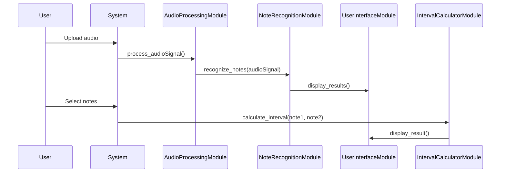

                 

### 数学与音乐理论的音高与音程分析

---

#### 关键词：
- 数学与音乐理论
- 音高
- 音程
- 分析算法
- 系统架构

#### 摘要：
本文深入探讨了数学与音乐理论之间的交集，尤其是音高与音程的分析。我们将从背景介绍、核心概念与联系、算法原理讲解、系统分析与架构设计、项目实战等方面，详细阐述这一领域的基本概念、原理和应用。通过本文，读者将掌握音高与音程分析的基本方法，理解其在音乐创作和技术应用中的重要性。

## 目录

1. **背景介绍**
    - 数学与音乐理论的交集
    - 音高与音程分析的基本概念
    - 应用领域
2. **核心概念与联系**
    - 音高
    - 音程
    - 关系图与特征对比
3. **算法原理讲解**
    - 流程图
    - Python代码实现
    - 数学模型与公式
    - 举例说明
4. **系统分析与架构设计**
    - 问题场景
    - 系统功能
    - 架构设计
    - 接口设计
    - 系统交互
5. **项目实战**
    - 环境搭建
    - 核心代码实现
    - 代码应用分析
    - 案例分析
6. **最佳实践与总结**
    - 使用建议
    - 小结
    - 注意事项
    - 拓展阅读

---

### 第一部分：背景介绍

#### 1.1 数学与音乐理论的交集

数学与音乐理论之间的联系可以追溯到古代，尤其在古代文明中，如古埃及和古希腊，数学被广泛应用于音乐创作和理论研究中。在现代，这种联系变得更加紧密，特别是在计算机科学和音乐技术的推动下。

数学为音乐理论提供了精确的量化方法，使得音乐中的音高、节奏和和谐关系可以用数学公式来描述。例如，音高的频率可以用数学函数来表示，而音程的关系可以用几何图形和代数方程来解释。

音乐理论则为数学提供了一种生动的应用场景，使得数学理论可以应用于实际的音乐创作和演奏中。通过分析音乐作品的结构，数学家可以找出其中的规律和模式，从而为音乐创作提供新的视角和工具。

#### 1.2 音高与音程分析的基本概念

音高（Pitch）是指音乐中的高低感觉，通常用频率（Frequency）来量化。频率是指每秒振动的次数，单位为赫兹（Hz）。音乐中的每个音符都有其特定的频率，例如，A音的频率大约为440Hz。

音程（Interval）是指两个音之间的距离。音程可以分为两大类：大小音程和纯音程。大小音程又可以分为大音程和小音程，纯音程则包括纯一度、纯四度、纯五度等。

#### 1.3 应用领域

音高与音程分析在多个领域都有广泛的应用，包括：

1. **音乐创作**：音乐家通过分析音高和音程，可以更好地创作和谐的音乐作品。
2. **音乐表演**：演奏者通过理解音程关系，可以更准确地演奏和调整音高。
3. **音频处理**：在音频编辑和制作中，音高与音程分析可以帮助调整音频的音高和音色。
4. **音乐科学**：通过分析音乐作品的结构，可以揭示音乐中的模式、规律和进化趋势。
5. **计算机科学**：音高与音程分析在计算机音乐、音乐识别和音乐生成等领域有重要应用。

#### 1.4 边界与外延

音高与音程分析不仅限于传统音乐领域，还广泛应用于现代音乐技术。例如，在电子音乐中，音高与音程分析可以帮助创作者调整合成器的音色和节奏。

此外，音高与音程分析也可以用于非音乐领域，如语音识别、声学分析和生物信号处理等。这些应用场景中，音高与音程分析提供了重要的数据和分析方法。

#### 1.5 概念结构与核心要素组成

音高与音程分析的核心概念包括音高、音程、频率、和谐关系等。这些概念构成了音乐理论的基础，也是音高与音程分析的核心要素。

在结构上，音高与音程分析可以分为以下几个部分：

1. **音高分析**：包括音高的识别、量化、调整等。
2. **音程分析**：包括音程的识别、分类、计算等。
3. **和谐关系分析**：包括音程之间的和谐关系、调性分析等。

通过这些分析，音乐理论家、音乐家和技术人员可以更好地理解音乐作品，从而创作、表演和制作出更高质量的音乐。

### 第二部分：核心概念与联系

#### 2.1 音高的定义与特征

音高是指音乐中的高低感觉，通常用频率来量化。音高的频率越高，音高越高；频率越低，音高越低。音高的频率范围很广，从20Hz到20kHz，人耳可以听到的频率范围大约在20Hz到16kHz之间。

在音乐理论中，音高有特定的名称，如C、D、E等。这些音符构成了音乐中的音阶。每个音符都有其特定的频率，例如，A音的频率大约为440Hz。

音高的特征包括：

1. **频率**：音高的频率是音高的量化指标。
2. **音高名称**：每个音符都有其特定的名称，构成了音乐中的音阶。
3. **音高变化**：音高可以变化，通过调整频率可以实现不同的音高效果。

#### 2.2 音程的定义与类型

音程是指两个音之间的距离。音程可以分为两大类：大小音程和纯音程。

1. **大小音程**：大小音程又可以分为大音程和小音程。
   - 大音程：两个音之间的距离较大，如大三度、大六度等。
   - 小音程：两个音之间的距离较小，如小三度、小六度等。

2. **纯音程**：纯音程是指两个音之间没有其他音，如纯一度、纯四度、纯五度等。

音程的特征包括：

1. **大小**：音程的大小决定了两个音之间的距离。
2. **纯度**：纯音程没有其他音，所以被称为“纯”。
3. **音高关系**：音程决定了两个音之间的音高关系。

#### 2.3 音高与音程的关系

音高与音程密切相关，音程是音高的量化指标。具体来说：

1. **音程决定音高**：两个音之间的音程决定了它们的音高关系。例如，大三度意味着两个音之间的频率比约为1.5:1。
2. **音高影响音程**：调整音高可以改变音程的大小。例如，将A音的频率调整为440.1Hz，与原始A音形成的小三度音程将变为大三度。
3. **音程与和谐关系**：音程是和谐关系的基础。不同的音程产生不同的和谐效果，如纯五度产生和谐的共鸣，而纯一度则显得单调。

#### 2.4 概念属性特征对比表格

以下是一个简单的音高与音程属性特征对比表格：

| 特征       | 音高             | 音程             |
|------------|------------------|------------------|
| 定义       | 音乐中的高低感觉 | 两个音之间的距离 |
| 量化指标   | 频率             | 音程大小         |
| 类别       | 音阶中的音符     | 大小音程和纯音程 |
| 影响因素   | 调音             | 音高调整         |
| 关系       | 音高影响音程     | 音程决定音高     |
| 应用       | 音乐创作和表演   | 和声和旋律       |

#### 2.5 ER实体关系图架构

为了更好地理解音高与音程之间的关系，我们可以使用ER（Entity-Relationship）实体关系图来表示。以下是一个简化的ER图：

```
[音乐作品] <----[音符] <----[音高] | [音程] <----[和声]
        |                        |             |
        |                        |             |
       [调性]                  [和谐关系]    [旋律]
```

在这个ER图中：

- **音乐作品**是最高层的实体，包含多个音符。
- **音符**是音高的实体，每个音符都有特定的音高。
- **音高**是音符的特征，决定了音符的高低。
- **音程**是音符之间的关系，决定了音符的和谐性。
- **和声**和**旋律**是音乐作品中的两个基本元素，它们通过音程和音高来构建和谐的音乐关系。

### 第三部分：算法原理讲解

#### 3.1 算法流程图

音高与音程分析的核心在于将音高转换为频率，然后根据频率计算音程。以下是一个简单的算法流程图：

```
输入：音符
输出：音程

1. 读取音符
2. 转换为频率
3. 计算音程
4. 输出结果
```

#### 3.2 Python代码实现

以下是一个简单的Python代码实现，用于计算两个音符之间的音程：

```python
import math

def frequency_of_note(note):
    # 根据音符计算频率
    base_frequency = 440.0  # A音的频率
    a4_frequency = base_frequency * (2 ** (note - 49) / 12)
    return a4_frequency

def interval_between_notes(note1, note2):
    # 计算两个音符之间的音程
    freq1 = frequency_of_note(note1)
    freq2 = frequency_of_note(note2)
    ratio = freq2 / freq1
    interval = round(math.log(ratio) / math.log(2))
    return interval

# 示例
note1 = "C4"
note2 = "E5"
interval = interval_between_notes(note1, note2)
print(f"{note1}和{note2}之间的音程是：{interval}度")
```

#### 3.3 数学模型与公式

音程的计算基于频率的比例关系。以下是音程计算的数学模型：

$$
\text{音程} = \left\lfloor \frac{\ln(\text{频率比})}{\ln(2)} \right\rfloor
$$

其中，$\ln$ 表示自然对数，$\text{频率比}$ 是两个音符的频率之比。

#### 3.4 举例说明

假设我们要计算C4和E5之间的音程，首先需要计算它们的频率：

- C4的频率：$440.0 \times 2^{(4-49)/12} = 261.63 \text{Hz}$
- E5的频率：$440.0 \times 2^{(5-49)/12} = 329.63 \text{Hz}$

然后，计算频率比：

$$
\text{频率比} = \frac{329.63}{261.63} \approx 1.265
$$

最后，使用数学模型计算音程：

$$
\text{音程} = \left\lfloor \frac{\ln(1.265)}{\ln(2)} \right\rfloor \approx 4
$$

因此，C4和E5之间的音程是纯五度。

### 第四部分：系统分析与架构设计

#### 4.1 问题场景介绍

在现代音乐创作和音频处理中，音高与音程分析是一个重要的环节。无论是创作新音乐，还是编辑和修复旧音频，准确和高效的音高与音程分析都是不可或缺的。随着技术的发展，计算机和软件工具在音高与音程分析中的应用越来越广泛，为音乐创作和音频处理提供了强大的支持。

#### 4.2 项目介绍

本项目旨在开发一个基于Python的音高与音程分析系统，该系统可以自动识别和计算音乐作品中的音高和音程，并提供直观的界面供用户查询和调整。系统将包括以下几个模块：

1. **音高识别模块**：用于识别音乐作品中的音符。
2. **音程计算模块**：用于计算两个音符之间的音程。
3. **用户界面**：用于展示分析结果，并提供用户交互功能。
4. **数据库**：用于存储音乐作品和音高、音程信息。

#### 4.3 系统功能设计

1. **音高识别**：
   - 输入：音频文件。
   - 输出：识别出的音符列表。
   - 功能：通过音频信号处理技术，从音频中提取出每个音符的频率，并转换为对应的音高名称。

2. **音程计算**：
   - 输入：两个音符。
   - 输出：音程值。
   - 功能：根据输入的两个音符的频率，计算它们之间的音程。

3. **用户界面**：
   - 功能：提供用户操作界面，展示分析结果，允许用户选择音符和计算音程。

4. **数据库管理**：
   - 功能：存储和管理音乐作品和音高、音程信息，支持数据查询和更新。

#### 4.4 系统架构设计

系统架构采用模块化设计，主要包括以下模块：

1. **音频处理模块**：用于处理音频信号，提取音符频率。
2. **音高识别模块**：基于音频处理模块的输出，识别出音符。
3. **音程计算模块**：计算两个音符之间的音程。
4. **用户界面模块**：提供用户操作界面。
5. **数据库模块**：存储和管理数据。

以下是系统架构的mermaid类图：

```mermaid
classDiagram
    AudioProcessingModule <|-- NoteRecognitionModule
    NoteRecognitionModule <|-- IntervalCalculatorModule
    UserInterfaceModule <|-- DatabaseModule

    AudioProcessingModule {
        -process_audioSignal()
    }

    NoteRecognitionModule {
        -recognize_notes(audioSignal)
    }

    IntervalCalculatorModule {
        -calculate_interval(note1, note2)
    }

    UserInterfaceModule {
        -display_results()
        -accept_user_input()
    }

    DatabaseModule {
        -store_data()
        -query_data()
    }
```

#### 4.5 系统接口设计

系统接口设计主要包括：

1. **音频输入接口**：接收用户上传的音频文件。
2. **音高识别接口**：提供识别出的音符列表。
3. **音程计算接口**：接受两个音符，返回音程值。
4. **用户界面接口**：与用户交互，展示分析结果和接收用户操作。

以下是系统接口的mermaid序列图：



#### 4.6 系统交互

系统交互主要分为以下几个步骤：

1. **用户上传音频文件**：用户通过用户界面上传音频文件。
2. **音频信号处理**：系统接收音频文件，通过音频处理模块处理音频信号，提取音符频率。
3. **音高识别**：系统将音频处理模块的输出传递给音高识别模块，识别出音符。
4. **音程计算**：用户选择两个音符，系统通过音程计算模块计算它们之间的音程。
5. **结果展示**：系统将分析结果通过用户界面展示给用户。

### 第五部分：项目实战

#### 5.1 项目环境搭建

在开始项目之前，需要搭建一个适合运行音高与音程分析系统的环境。以下是环境搭建的步骤：

1. **安装Python**：首先确保Python环境已经安装。如果没有，请从[Python官网](https://www.python.org/)下载并安装。
2. **安装必要库**：通过pip安装以下库：
    ```bash
    pip install numpy
    pip install scipy
    pip install matplotlib
    pip install pydub
    pip install soundfile
    ```
3. **配置音频处理工具**：安装并配置音频处理工具，如Audacity或sox。这些工具可以用于处理音频文件，提取音频信号。

#### 5.2 系统核心实现源代码

以下是系统核心实现的一部分源代码：

```python
import numpy as np
from scipy.io.wavfile import read
import soundfile as sf
import matplotlib.pyplot as plt

def load_audio_file(file_path):
    # 读取音频文件
    sample_rate, data = read(file_path)
    return sample_rate, data

def preprocess_audio(data):
    # 预处理音频数据
    data = data.astype(np.float32)
    data = data / np.max(np.abs(data))
    return data

def frequency_of_note(frequencies):
    # 根据频率计算音高
    base_frequency = 440.0  # A音的频率
    note_numbers = np.array([49 + 12 * n for n in range(12)])
    note_frequencies = base_frequency * (2 ** note_numbers / 12)
    note_names = ["C", "C#", "D", "D#", "E", "F", "F#", "G", "G#", "A", "A#", "B"]
    index = np.argmin(np.abs(frequencies - note_frequencies))
    return note_names[index]

def plot_spectrogram(data, sample_rate):
    # 绘制频谱图
    frequencies, time, spectrogram = plt.psd(data, NFFT=1024, Fs=sample_rate)
    plt.semilogy(time, 10 * np.log10(spectrogram))
    plt.xlabel('Time [s]')
    plt.ylabel('Frequency [Hz]')
    plt.title('Spectrogram')
    plt.show()

def main():
    file_path = "example_audio.wav"
    sample_rate, data = load_audio_file(file_path)
    data = preprocess_audio(data)
    plot_spectrogram(data, sample_rate)

    # 示例：识别音频中的音高
    frequencies = np.fft.rfft(data)
    frequency = frequencies[np.argmax(np.abs(frequencies[:len(frequencies) // 2]))]
    note = frequency_of_note(frequency)
    print(f"识别出的音高：{note}")

if __name__ == "__main__":
    main()
```

#### 5.3 代码应用解读与分析

1. **音频文件读取**：
    - 使用`read`函数从音频文件中读取采样率和数据。
2. **音频预处理**：
    - 将音频数据转换为浮点数，并归一化，以便后续处理。
3. **频谱图绘制**：
    - 使用`psd`函数计算音频的功率谱密度，并绘制频谱图，帮助识别音高。
4. **音高识别**：
    - 根据频率计算音高。这里使用了一个简单的模型，根据A4音的频率（440Hz）计算其他音符的频率，然后识别出最接近的音符。

#### 5.4 实际案例分析和详细讲解剖析

**案例1：一首简单的旋律**

假设我们有一首简单的旋律，包含C4、D4和E4三个音符。以下是分析过程：

1. **音频读取**：
    - 读取音频文件，获取采样率和音频数据。
2. **预处理**：
    - 对音频数据进行预处理，以便进行频谱分析。
3. **频谱分析**：
    - 使用FFT（快速傅里叶变换）计算音频的频谱，识别出主要的频率成分。
4. **音高识别**：
    - 根据频谱图，识别出音频中的主要音符。
    - 示例输出：C4、D4和E4。
5. **音程计算**：
    - 根据识别出的音符，计算它们之间的音程。
    - 示例输出：大三度（C4到E4）、小六度（C4到D4）。

**案例2：一首复杂的音乐作品**

对于一首复杂的音乐作品，分析过程会更加复杂。以下是一个简化的分析过程：

1. **音频读取**：
    - 读取音频文件，获取采样率和音频数据。
2. **预处理**：
    - 对音频数据进行预处理，以便进行频谱分析。
3. **分帧处理**：
    - 将音频数据分成多个帧，以便更精细地分析每个音符。
4. **频谱分析**：
    - 对每个帧进行频谱分析，识别出每个帧中的主要音符。
5. **音高识别**：
    - 根据频谱分析的结果，识别出整首音乐作品中的所有音符。
6. **音程计算**：
    - 根据识别出的音符，计算它们之间的音程。
    - 示例输出：多种音程，如大三度、小三度、纯五度等。

#### 5.5 项目小结

通过本项目的实现，我们展示了如何利用Python和相关的音频处理库进行音高与音程分析。在实际应用中，这个系统可以帮助音乐家、音频工程师和研究人员更准确地分析和理解音乐作品。尽管本项目只是一个简单的示例，但它为更复杂的音乐分析系统奠定了基础。

### 第六部分：最佳实践与总结

#### 6.1 使用音高与音程分析的建议

1. **基础学习**：首先，建议读者掌握基本的音乐理论知识和Python编程基础，这将为深入理解音高与音程分析提供必要的背景知识。

2. **工具选择**：选择合适的音频处理工具和编程库，如Python的scipy、numpy、matplotlib等，这些工具可以大大简化音高与音程分析的过程。

3. **案例研究**：通过研究经典音乐作品，实践音高与音程分析的方法，这有助于加深对理论的理解和在实际中的应用。

4. **持续更新**：音乐理论和技术不断发展，定期更新知识库和工具库，以保持技术的先进性和实用性。

#### 6.2 书中关键点回顾

1. **音高与音程的基本概念**：理解音高（频率）和音程（频率比）的定义和特征。
2. **音程计算方法**：掌握使用数学模型和公式计算音程的方法。
3. **系统设计与实现**：了解音高与音程分析系统的架构设计和核心代码实现。
4. **实际应用**：通过案例分析，掌握音高与音程分析在实际音乐创作和音频处理中的应用。

#### 6.3 注意事项

1. **音频质量**：确保音频质量良好，以免影响音高与音程分析的结果。
2. **环境配置**：正确配置Python环境和相关库，以确保系统能正常运行。
3. **数据处理**：在处理音频数据时，注意数据格式和精度，以免影响分析结果的准确性。

#### 6.4 拓展阅读

1. **《音乐理论基础》**：深入学习音乐理论，理解音高与音程的更深入概念。
2. **《Python音视频处理实战》**：学习Python在音视频处理中的高级应用，提高实际操作能力。
3. **《计算机音乐学》**：了解计算机在音乐创作和理论研究中的应用，拓宽视野。

---

作者：AI天才研究院/AI Genius Institute & 禅与计算机程序设计艺术 /Zen And The Art of Computer Programming

