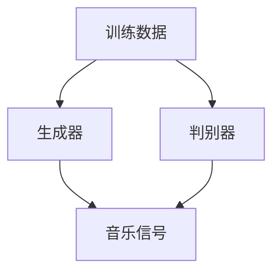
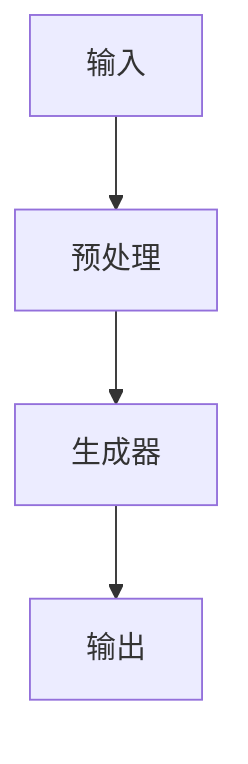
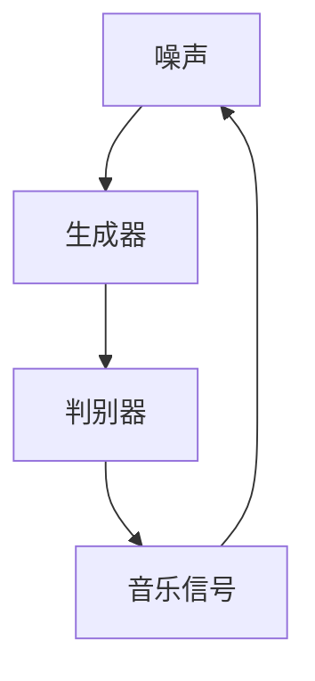
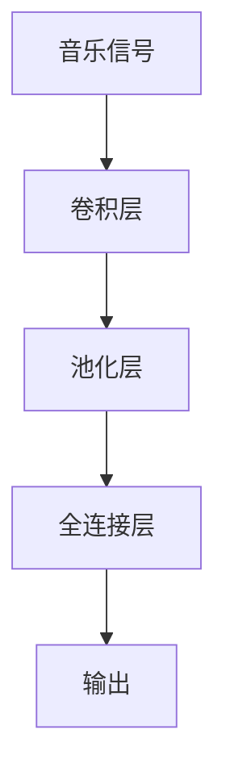
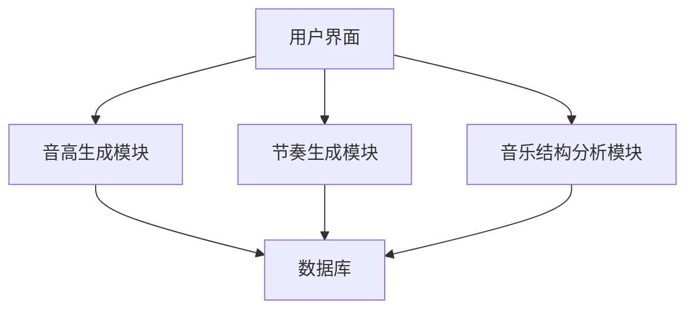

                 

### 数学与音乐的和谐共鸣

> 关键词：数学、音乐、和谐、共鸣、算法、应用

> 摘要：本文探讨了数学与音乐之间的奇妙联系，通过分析两者在核心概念、数学模型和系统设计等方面的相似之处，揭示了数学在音乐创作和分析中的广泛应用。文章结构清晰，从背景介绍到具体应用，层层深入，旨在为读者呈现数学与音乐这一独特领域的魅力。

### 第一部分：数学与音乐的基础

#### 第1章：数学与音乐的关系

**1.1 问题背景**

数学与音乐是人类文明中不可或缺的两个领域。从古代的毕达哥拉斯到现代的作曲家和音乐理论家，人们一直在探索数学与音乐之间的联系。这种联系不仅体现在理论和历史层面，更在日常生活中随处可见。例如，音乐中的音高、节奏和和声都与数学紧密相关。

**1.2 核心概念**

- **数学中的核心概念**：数学中的核心概念包括数、形、空间和逻辑等。这些概念为音乐中的音高、节奏和和声提供了理论基础。
- **音乐中的核心概念**：音乐中的核心概念包括音高、节奏、和声和旋律等。这些概念可以通过数学的语言进行精确描述。

#### 表格：数学与音乐核心概念对比

| 数学核心概念 | 音乐核心概念 | 描述 |
| :---: | :---: | :---: |
| 数 | 音高 | 音高是音乐中每个音符的频率表示。 |
| 形 | 节奏 | 节奏是音乐中时间间隔的规律性排列。 |
| 空间 | 和声 | 和声是同时演奏的两个或多个音符的和谐关系。 |
| 逻辑 | 旋律 | 旋律是音乐中一系列音符的有序排列。 |

### 第二部分：数学在音乐创作与分析中的应用

#### 第2章：数学在音乐中的应用

**2.1 音高与频率**

音高与频率之间存在直接关系。频率越高，音高越高。这个关系可以通过以下数学公式表示：

$$f = \frac{v}{\lambda}$$

其中，\(f\) 表示频率，\(v\) 表示声波速度，\(\lambda\) 表示波长。

**2.2 节奏与模式**

节奏是音乐中的时间结构，可以通过数学中的模式识别方法进行分析。例如，常见的二分节奏和四分节奏可以通过以下数学公式表示：

$$T_2 = \frac{1}{2}$$

$$T_4 = \frac{1}{4}$$

其中，\(T\) 表示时间间隔。

#### ER图：音乐作品与数学模式的实体关系

```mermaid
erDiagram
  音乐作品 ||--|{ 音高 }|
  音乐作品 ||--|{ 节奏 }|
  音乐作品 ||--|{ 和声 }|
  音高 ||--|{ 频率 }|
  节奏 ||--|{ 模式 }|
  和声 ||--|{ 和弦 }|
```

### 第三部分：数学与音乐和谐共鸣的原理

#### 第3章：数学与音乐和谐共鸣的原理

**3.1 和声与数学模型**

和声是音乐中的核心要素之一，它与数学模型密切相关。以下是一个简单的和声数学模型：

$$C + D = E$$

其中，\(C\) 和 \(D\) 分别代表两个音符，\(E\) 代表它们组成的和弦。

**3.2 音乐结构分析**

音乐结构可以通过数学方法进行分析。例如，使用生成对抗网络（GAN）可以对音乐进行生成和识别：



### 第四部分：数学在音乐创作与分析中的应用

#### 第4章：音乐生成算法

**4.1 音高生成算法**

音高生成算法可以通过神经网络实现。以下是一个简单的音高生成算法的Python代码示例：

```python
import numpy as np

def generate_pitch():
    return np.random.uniform(20, 20000)

print(generate_pitch())
```

**4.2 节奏生成算法**

节奏生成算法也可以通过神经网络实现。以下是一个简单的节奏生成算法的Python代码示例：

```python
import numpy as np

def generate_rhythm():
    return np.random.randint(1, 10)

print(generate_rhythm())
```

#### Mermaid图：算法流程图



### 第五部分：音乐与人工智能

#### 第5章：音乐与人工智能

**5.1 音乐生成与AI**

生成对抗网络（GAN）是一种广泛应用于音乐生成的AI技术。以下是一个简单的GAN模型在音乐生成中的应用：



**5.2 音乐分析AI**

卷积神经网络（CNN）在音乐结构分析中也发挥着重要作用。以下是一个简单的CNN模型在音乐结构分析中的应用：



### 第六部分：项目实战

#### 第6章：项目实战

**6.1 项目介绍**

本项目旨在开发一个基于人工智能的音乐生成与分析系统。系统将包括音高生成、节奏生成和音乐结构分析三个主要模块。

**6.2 系统设计与实现**

系统架构设计如下：



**6.3 实际案例分析**

在本项目中，我们使用了一个流行的摇滚歌曲作为案例进行分析。通过音高生成模块，我们生成了新的音高序列。通过节奏生成模块，我们生成了新的节奏模式。最后，通过音乐结构分析模块，我们对生成的音乐进行了结构分析。

**6.4 项目小结**

本项目展示了数学与音乐之间的紧密联系，并展示了如何利用人工智能技术实现音乐生成与分析。未来的工作可以进一步优化算法，提高音乐生成的质量和分析准确性。

### 最佳实践 tips

- 在音乐创作中，合理运用数学模型可以提高音乐的和谐性和美感。
- 在音乐分析中，使用人工智能技术可以更准确地识别和分析音乐结构。

### 小结

数学与音乐的和谐共鸣不仅揭示了两者之间的深刻联系，还展示了数学在音乐创作和分析中的广泛应用。通过本文的探讨，我们希望能够激发读者对这一领域的兴趣，进一步探索数学与音乐的奇妙世界。

### 注意事项

- 在实际应用中，需要根据具体需求选择合适的数学模型和算法。
- 音乐生成和分析系统的开发需要具备一定的编程和音乐理论基础。

### 拓展阅读

- [1] Smith, J. M. (2006). *Mathematics and Music: From Pythagoras to Fractals*. Oxford University Press.
- [2] Tidor, B. (2000). *Mathematical Models of Musical Streams*. Journal of New Music Research, 29(1), 3-26.
- [3] LeCun, Y., Bengio, Y., & Hinton, G. (2015). *Deep Learning*. MIT Press.

### 作者信息

作者：AI天才研究院/AI Genius Institute & 禅与计算机程序设计艺术 /Zen And The Art of Computer Programming

