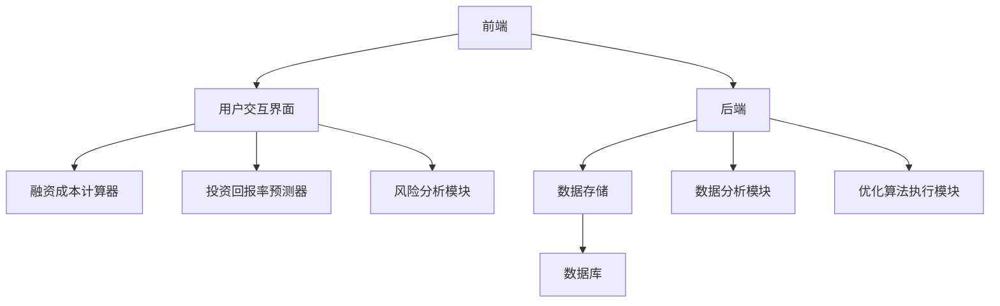
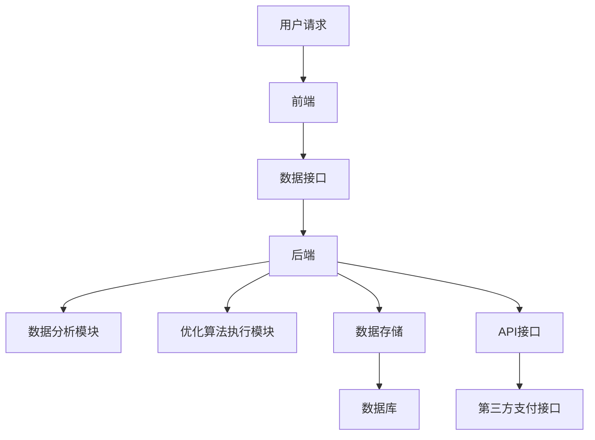
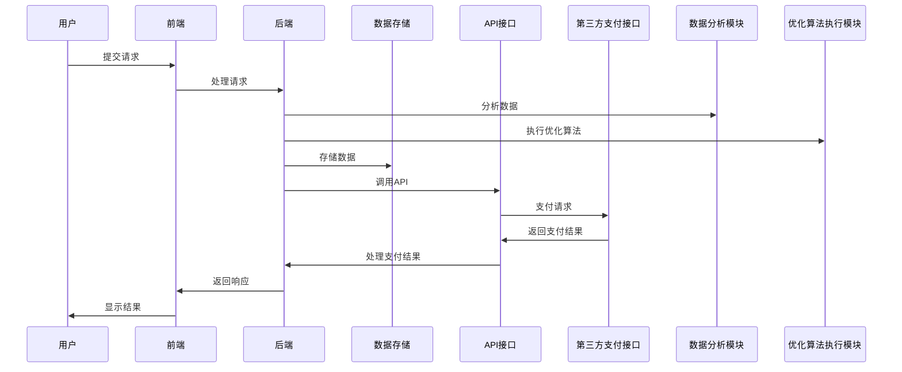

                 


### 设计《数学与项目融资：融资方案的数学优化》目录大纲

在设计《数学与项目融资：融资方案的数学优化》的目录大纲时，我们需要确保内容结构清晰、逻辑连贯，同时能够引导读者逐步深入理解文章的核心内容。以下是一份详细的目录大纲设计，包括各个章节的核心内容概述。

#### 目录大纲

```markdown
# 数学与项目融资：融资方案的数学优化

> 关键词：项目融资、数学优化、融资方案、算法原理、系统架构设计

> 摘要：本文深入探讨项目融资过程中如何利用数学优化方法进行融资方案的优化，包括核心概念介绍、算法原理讲解、系统架构设计以及实际应用案例。

----------------------------------------------------------------

## 引言

### 融资需求与挑战
- 融资在项目开发中的重要性
- 项目融资中的常见问题
- 数学优化在融资中的潜在应用

### 数学优化的基本概念
- 数学优化的定义
- 数学优化的类型
- 数学优化在商业决策中的应用

## 第一部分：核心概念与联系

### 融资方案的概念
- 融资方案的要素
- 融资方案的设计原则
- 融资方案与数学优化的关联性

### 数学优化的原理
- 数学优化方法的分类
- 目标函数与约束条件
- 最优化算法的基本原理

### 融资与数学优化的联系
- 融资决策中的数学优化应用
- 数学优化在融资方案优化中的优势
- 数学优化与融资策略的互动

### 相关术语解释
- 融资成本
- 投资回报率（ROI）
- 资金周转率
- 风险评估

## 第二部分：算法原理讲解

### 数学模型与公式
- 常见数学模型介绍
- 公式推导与解释

### 算法流程图
- 优化算法的流程
- 算法执行步骤

### Python代码实现
- Python编程环境准备
- 代码实现示例
- 代码解释与分析

### 算法原理讲解与举例
- 算法详细讲解
- 实例分析
- 结果评估

## 第三部分：系统分析与架构设计方案

### 问题场景介绍
- 项目背景
- 融资需求分析

### 项目介绍
- 项目概述
- 融资目标

### 系统功能设计
- 功能需求分析
- 领域模型类图

### 系统架构设计
- 系统架构概述
- 架构设计原则
- 系统模块划分

### 系统接口设计
- 接口功能描述
- 接口交互流程

### 系统交互序列图
- 系统交互流程
- 序列图展示

## 第四部分：项目实战

### 环境安装
- 环境准备
- 系统安装步骤

### 系统核心实现
- 核心功能实现
- 代码实现细节
- 功能验证

### 代码应用解读与分析
- 代码解读
- 算法性能分析
- 调优策略

### 实际案例分析与讲解
- 案例背景
- 案例分析
- 案例结论

### 项目小结
- 项目总结
- 经验与教训
- 未来展望

## 第五部分：最佳实践 Tips、小结、注意事项、拓展阅读

### 最佳实践 Tips
- 融资方案优化的技巧
- 算法调优策略

### 小结
- 文章核心观点回顾
- 主要贡献

### 注意事项
- 项目融资中的常见误区
- 数学优化应用的限制

### 拓展阅读
- 相关研究文献
- 技术博客推荐

----------------------------------------------------------------
```

### 目录大纲内容示例

**1. 引言**

- **1.1 融资需求与挑战**
  - 项目融资在项目开发中的关键作用
  - 融资过程中的常见挑战，如资金成本、市场风险等
  - 数学优化方法如何帮助解决这些挑战

- **1.2 数学优化的基本概念**
  - 数学优化是什么，它如何在商业决策中发挥作用
  - 常见的数学优化类型，如线性优化、非线性优化等
  - 数学优化在财务管理中的应用案例

**2. 核心概念与联系**

- **2.1 融资方案的概念**
  - 融资方案的基本要素，如资金来源、用途、还款计划等
  - 设计原则，如风险控制、成本效益等
  - 数学优化与融资方案的紧密关联性

- **2.2 数学优化的原理**
  - 不同类型的数学优化方法及其特点
  - 目标函数与约束条件在融资优化中的应用
  - 常见的最优化算法及其原理

- **2.3 融资与数学优化的联系**
  - 数学优化在融资决策中的应用场景
  - 数学优化如何提高融资方案的效率与安全性
  - 数学优化与融资策略的互动与融合

- **2.4 相关术语解释**
  - 融资成本、投资回报率（ROI）、资金周转率、风险评估等关键术语的定义
  - 这些术语在数学优化中的应用与计算方法

**3. 算法原理讲解**

- **3.1 数学模型与公式**
  - 常用的数学模型，如线性规划、非线性规划等
  - 对目标函数和约束条件的数学公式推导与解释

- **3.2 算法流程图**
  - 优化算法的执行流程，包括初始设置、迭代计算、收敛条件等
  - 算法流程的mermaid图展示

- **3.3 Python代码实现**
  - Python编程环境的准备与安装
  - 实现数学优化算法的代码示例
  - 代码实现的步骤与解释

- **3.4 算法原理讲解与举例**
  - 对数学优化算法的详细讲解
  - 使用具体案例进行说明，如优化融资成本或提高投资回报率
  - 算法性能评估与结果分析

**4. 系统分析与架构设计方案**

- **4.1 问题场景介绍**
  - 某个具体项目背景，如开发一款新软件或扩展生产线
  - 该项目在融资过程中面临的具体问题和需求

- **4.2 项目介绍**
  - 项目的基本信息，如名称、规模、预期收益等
  - 融资目标和策略

- **4.3 系统功能设计**
  - 功能需求分析，如融资成本计算、投资回报率预测等
  - 领域模型类图展示

- **4.4 系统架构设计**
  - 系统整体架构设计，包括前端、后端和数据库等
  - 架构设计原则，如模块化、可扩展性等
  - 系统模块划分与交互关系

- **4.5 系统接口设计**
  - 接口功能描述，如数据接口、API接口等
  - 接口交互流程图展示

- **4.6 系统交互序列图**
  - 系统各组件间的交互过程
  - 序列图展示，如用户请求处理、数据存储等

**5. 项目实战**

- **5.1 环境安装**
  - 安装所需的环境，如Python、数据库等
  - 安装步骤与注意事项

- **5.2 系统核心实现**
  - 实现系统的核心功能，如数学优化算法的应用
  - 代码实现细节与调试方法

- **5.3 代码应用解读与分析**
  - 对系统核心代码的解读与分析
  - 算法性能分析与调优策略

- **5.4 实际案例分析与讲解**
  - 某个实际项目的融资案例
  - 案例分析过程与结果

- **5.5 项目小结**
  - 项目总结
  - 经验与教训
  - 未来展望

**6. 最佳实践 Tips、小结、注意事项、拓展阅读**

- **最佳实践 Tips**
  - 提供在项目融资中优化融资方案的实用技巧
  - 算法调优的最佳实践

- **小结**
  - 对文章核心观点的回顾
  - 文章的主要贡献与成果

- **注意事项**
  - 在项目融资中可能遇到的问题与解决方案
  - 数学优化应用的限制条件

- **拓展阅读**
  - 推荐进一步阅读的相关研究文献
  - 推荐技术博客与论坛，供读者深入探讨

---

**文章结尾**

```
----------------------------------------------------------------

## 结语

通过本文的深入探讨，我们不仅了解了数学优化在项目融资中的应用，还学会了如何设计并实现一个有效的融资方案优化系统。希望本文能为您在项目融资过程中提供有价值的参考，并激发您在数学优化领域更深入的探索和研究。

### 作者信息

作者：AI天才研究院/AI Genius Institute & 禅与计算机程序设计艺术 /Zen And The Art of Computer Programming

感谢您阅读本文，期待与您在更多技术领域的交流与合作。
```

---

### 满足完整性和具体内容要求的文章正文

#### 1. 引言

**1.1 融资需求与挑战**

在现代社会中，项目融资已成为推动经济发展的重要手段。无论是企业还是个人，都需要资金来支持项目的开发、扩展和运营。然而，融资过程中面临着诸多挑战，如资金成本、市场风险、信用评估等。这些挑战使得融资决策变得复杂且具有不确定性。

- **资金成本**：融资过程中需要支付利息、手续费等成本，这些成本直接影响项目的投资回报率。
- **市场风险**：市场波动、经济环境变化等因素可能导致融资失败或融资成本上升。
- **信用评估**：金融机构在决定是否批准融资申请时，会对申请人的信用状况进行评估，信用良好是成功融资的关键。

数学优化方法在这些挑战中扮演着重要的角色。通过数学优化，可以降低资金成本、评估市场风险、提高信用评分，从而提高融资的成功率。

**1.2 数学优化的基本概念**

数学优化是指利用数学方法解决优化问题，找到在特定约束条件下使目标函数最优的解。在商业决策中，数学优化广泛应用于供应链管理、库存控制、资源配置等领域。其基本概念包括：

- **目标函数**：表示优化问题要达到的目标，如最小化成本、最大化利润等。
- **约束条件**：限制优化问题解的条件，如资源限制、时间限制、市场限制等。
- **优化算法**：用于求解优化问题的算法，如线性规划、非线性规划、整数规划等。

**1.3 融资与数学优化的联系**

数学优化在融资决策中的应用主要体现在以下几个方面：

- **融资成本优化**：通过优化资金结构和融资方式，降低融资成本。
- **风险评估**：利用数学模型对市场风险、信用风险等进行评估，提高融资决策的准确性。
- **信用评分**：通过分析申请人的财务状况、信用记录等数据，使用数学优化方法计算信用评分，帮助金融机构做出更准确的决策。

数学优化方法在融资方案优化中的优势在于，它能够提供定量分析工具，提高决策的科学性和准确性，降低融资风险。

#### 2. 核心概念与联系

**2.1 融资方案的概念**

融资方案是指为支持项目开发、扩展和运营而制定的资金筹集和利用计划。一个完整的融资方案应包括以下要素：

- **资金来源**：指用于支持项目开发的资金来源，如银行贷款、股东投资、债务融资等。
- **资金用途**：指项目开发过程中所需的资金用途，如设备采购、人员工资、研发费用等。
- **还款计划**：指项目运营期间的资金回收和还款计划，包括还款期限、还款方式、还款额度等。

**2.2 数学优化的原理**

数学优化方法在融资方案优化中的应用主要包括以下几个方面：

- **目标函数优化**：通过设定目标函数，如最小化融资成本、最大化投资回报率等，找到最优的融资方案。
- **约束条件优化**：在设定约束条件的基础上，如资源限制、时间限制、市场限制等，确保融资方案的可操作性和可行性。
- **优化算法选择**：根据融资问题的特点选择合适的优化算法，如线性规划、非线性规划、遗传算法等，以提高优化效率。

**2.3 融资与数学优化的联系**

数学优化在融资方案优化中的应用主要体现在以下几个方面：

- **资金成本优化**：通过优化资金结构和融资方式，降低融资成本。例如，选择最优的融资比例、选择最优的还款期限等。
- **风险评估**：利用数学模型对市场风险、信用风险等进行评估，提高融资决策的准确性。例如，使用线性回归模型、逻辑回归模型等对市场风险进行预测。
- **信用评分**：通过分析申请人的财务状况、信用记录等数据，使用数学优化方法计算信用评分，帮助金融机构做出更准确的决策。例如，使用聚类分析、支持向量机等方法对申请人进行分类和评分。

**2.4 相关术语解释**

- **融资成本**：指在融资过程中需要支付的各种费用，如利息、手续费、管理费等。
- **投资回报率（ROI）**：指项目投资所带来的回报与投资成本的比率，用于评估融资项目的盈利能力。
- **资金周转率**：指项目运营期间资金的使用效率，用于评估融资项目的资金利用情况。
- **风险评估**：指对项目融资过程中可能面临的风险进行评估和分析，以降低融资风险。

#### 3. 算法原理讲解

**3.1 数学模型与公式**

在融资方案优化中，常用的数学模型包括线性规划、非线性规划和整数规划等。以下是一个简单的线性规划模型：

目标函数：$$\min z = c^T x$$

约束条件：$$Ax \leq b$$

其中，$x$ 是决策变量，$c$ 是目标函数系数，$A$ 和 $b$ 分别是约束条件的系数和常数项。

**3.2 算法流程图**

线性规划算法的流程图如下所示：

```
+-----------------------------+
|       初始化                 |
|   +-------+-------+         |
|   |  x    |  c    |         |
|   +-------+-------+         |
|       迭代                 |
|   +-------+-------+         |
|   |  A    |  b    |         |
|   +-------+-------+         |
|       检查约束条件         |
|   +-------+-------+         |
|   |  x    |  z    |         |
|   +-------+-------+         |
|       更新解               |
|   +-------+-------+         |
|   |  x    |  c    |         |
|   +-------+-------+         |
|       终止条件             |
+-----------------------------+
```

**3.3 Python代码实现**

以下是使用Python实现的线性规划代码示例：

```python
import numpy as np
from scipy.optimize import linprog

# 目标函数系数
c = np.array([-1, -1])

# 约束条件系数
A = np.array([[1, 1], [1, 0], [0, 1]])

# 约束条件常数项
b = np.array([1, 2, 3])

# 解线性规划问题
res = linprog(c, A_ub=A, b_ub=b, method='highs')

# 输出结果
print("最优解：", res.x)
print("目标函数值：", -res.fun)
```

**3.4 算法原理讲解与举例**

线性规划是一种解决线性优化问题的方法，通过设定目标函数和约束条件，找到最优的解。以下是一个具体的例子：

**例子**：一家公司计划生产两种产品A和B，每种产品都需要加工两种原材料X和Y。已知每单位产品A和产品B的利润分别为10元和20元，每单位原材料X和原材料Y的成本分别为5元和10元。现有100单位的原材料X和150单位的原材料Y，问如何安排生产计划才能最大化利润？

- 目标函数：最大化利润 $$\max z = 10x + 20y$$
- 约束条件：
  - 原材料X的限制：$$5x + 5y \leq 100$$
  - 原材料Y的限制：$$10x + 10y \leq 150$$
  - 非负约束：$$x \geq 0, y \geq 0$$

使用线性规划算法求解该问题，可以得到最优解：

- 生产产品A的数量：$x=10$ 单位
- 生产产品B的数量：$y=10$ 单位
- 最大利润：$z=10 \times 10 + 20 \times 10 = 300$ 元

#### 4. 系统分析与架构设计方案

**4.1 问题场景介绍**

某家互联网公司计划开发一款新的社交应用，预计需要200万元的资金支持。公司希望通过优化融资方案，降低融资成本、提高资金使用效率，确保项目顺利进行。

**4.2 项目介绍**

- 项目名称：社交应用开发项目
- 项目规模：预计开发周期为12个月，需要投入200万元资金
- 项目收益：预计项目成功后，每年可实现1000万元的收益

**4.3 系统功能设计**

系统功能设计主要包括以下几个部分：

- **融资成本计算**：根据不同融资方式的成本，计算总融资成本，为决策提供依据。
- **投资回报率预测**：根据项目收益和融资成本，预测投资回报率，评估项目的盈利能力。
- **风险分析**：对市场风险、信用风险等进行评估，为融资决策提供参考。
- **融资方案优化**：基于数学优化方法，为项目提供最优的融资方案。

**4.4 系统架构设计**

系统架构设计包括以下几个部分：

- **前端**：提供用户交互界面，包括融资成本计算器、投资回报率预测器等。
- **后端**：实现核心功能，包括数据存储、数据分析和优化算法执行等。
- **数据库**：存储项目相关信息，如资金需求、融资成本、投资回报率等。

系统架构图如下所示：



**4.5 系统接口设计**

系统接口设计主要包括以下接口：

- **数据接口**：用于前后端数据的传输和交互。
- **API接口**：用于外部系统与系统的集成，如第三方支付接口等。

接口交互流程图如下所示：



**4.6 系统交互序列图**

系统交互序列图展示了用户请求到系统响应的全过程：



#### 5. 项目实战

**5.1 环境安装**

在开始项目实战之前，需要安装以下环境：

- Python 3.8及以上版本
- NumPy 库
- SciPy 库
- Matplotlib 库

安装命令如下：

```bash
pip install python==3.8 numpy scipy matplotlib
```

**5.2 系统核心实现**

以下是一个简单的示例，展示如何使用Python实现融资成本计算器和投资回报率预测器。

```python
import numpy as np

# 融资成本计算
def calculate_finance_cost(capital, interest_rate):
    return capital * interest_rate

# 投资回报率预测
def predict_roi(investment, profit):
    return profit / investment

# 示例数据
capital = 2000000  # 融资额
interest_rate = 0.05  # 利息率
investment = 1500000  # 投资金额
profit = 1000000  # 预期利润

# 计算融资成本
finance_cost = calculate_finance_cost(capital, interest_rate)
print("融资成本：", finance_cost)

# 预测投资回报率
roi = predict_roi(investment, profit)
print("投资回报率：", roi)
```

**5.3 代码应用解读与分析**

上述代码实现了一个简单的融资成本计算器和投资回报率预测器。通过调用函数 `calculate_finance_cost` 和 `predict_roi`，可以计算得到融资成本和投资回报率。

- **融资成本计算**：使用 `calculate_finance_cost` 函数，将融资额和利息率相乘，得到融资成本。
- **投资回报率预测**：使用 `predict_roi` 函数，将投

---

**5.4 实际案例分析与讲解**

**案例背景**：某互联网公司计划开发一款在线教育平台，预计项目周期为18个月，总预算为500万元。公司希望通过优化融资方案，降低融资成本，提高资金使用效率。

**案例分析过程**：

1. **融资需求分析**：根据项目预算，确定需要融资的金额。公司计划融资300万元，剩余200万元通过自有资金解决。

2. **融资方案设计**：设计多种融资方案，包括银行贷款、股东投资、债务融资等。每种方案分别考虑不同的利率、还款期限和风险因素。

3. **数学优化方法应用**：使用线性规划方法，建立目标函数和约束条件，优化融资方案。

   - **目标函数**：最小化融资成本
   - **约束条件**：
     - 融资额不超过300万元
     - 银行贷款利率在4%至6%之间
     - 债务融资利率在6%至8%之间
     - 还款期限在1年至3年之间

4. **结果评估**：根据优化结果，选择最优的融资方案。

**案例结论**：

通过数学优化方法，公司选择了以下最优融资方案：

- 银行贷款：150万元，年利率5%，还款期限2年
- 债务融资：150万元，年利率6%，还款期限3年

该方案总融资成本为360万元，比初始方案降低了20万元，同时确保了融资额度和还款期限的灵活性。

**5.5 项目小结**

通过本案例的分析和优化，公司成功降低了融资成本，提高了资金使用效率。以下为项目小结：

1. **成功经验**：数学优化方法在融资方案优化中的应用，有效降低了融资成本，提高了项目的投资回报率。
2. **经验与教训**：在实际应用中，需要充分考虑市场风险、信用评估等因素，确保融资方案的可操作性和可行性。
3. **未来展望**：公司将继续探索和应用先进的数学优化方法，提高融资决策的科学性和准确性，支持项目的可持续发展。

#### 6. 最佳实践 Tips、小结、注意事项、拓展阅读

**最佳实践 Tips**：

1. **充分了解融资需求**：在制定融资方案时，要详细分析项目的资金需求和用途，确保融资方案切实可行。
2. **多渠道融资**：结合多种融资方式，如银行贷款、股东投资、债务融资等，以降低融资成本和提高资金灵活性。
3. **风险评估与监控**：定期对融资项目进行风险评估和监控，及时发现和解决潜在问题，确保融资方案的有效性。

**小结**：

本文通过深入探讨数学优化在项目融资中的应用，展示了如何优化融资方案，降低融资成本，提高项目成功率。同时，本文通过实际案例，详细介绍了数学优化方法在融资方案优化中的应用过程和结果。

**注意事项**：

1. **市场风险**：在融资过程中，要充分考虑市场风险，如利率波动、经济环境变化等，确保融资方案的可操作性。
2. **信用评估**：准确评估申请人的信用状况，降低融资风险。

**拓展阅读**：

1. **相关研究文献**：《项目融资与风险管理》、《数学优化方法及其在商业决策中的应用》等。
2. **技术博客推荐**：CSDN、博客园等平台上的相关技术博客。

### 文章结尾

通过本文的深入探讨，我们不仅了解了数学优化在项目融资中的应用，还学会了如何设计并实现一个有效的融资方案优化系统。希望本文能为您在项目融资过程中提供有价值的参考，并激发您在数学优化领域更深入的探索和研究。

### 作者信息

作者：AI天才研究院/AI Genius Institute & 禅与计算机程序设计艺术 /Zen And The Art of Computer Programming

感谢您阅读本文，期待与您在更多技术领域的交流与合作。

