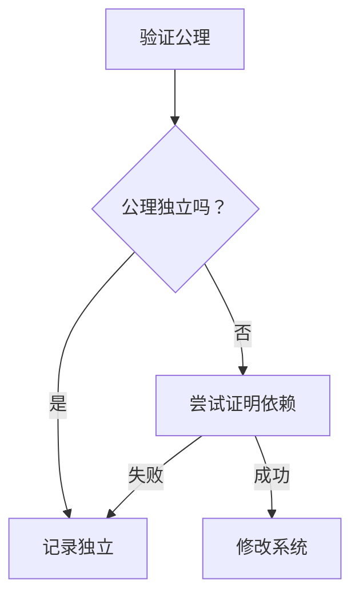
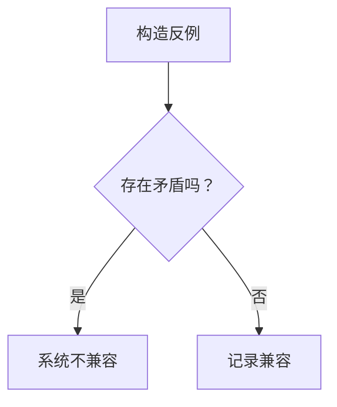
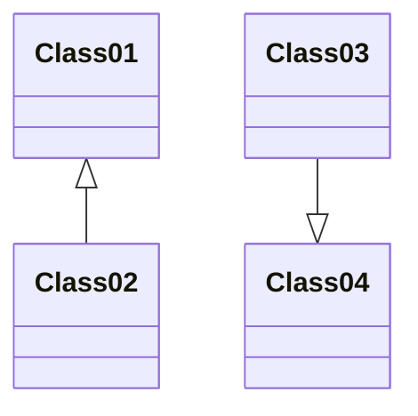
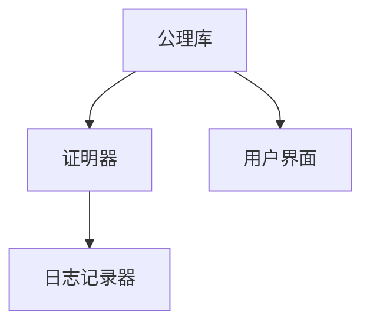
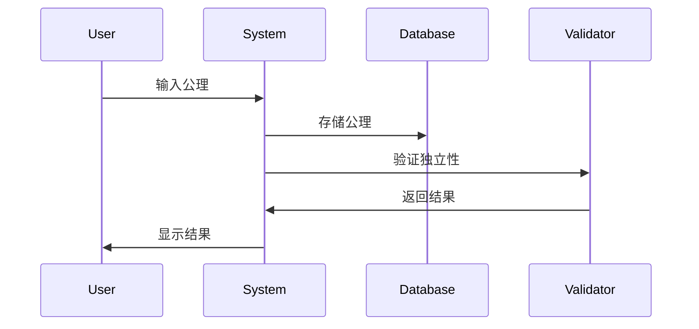

                 

### 数学公理系统的独立性与相容性探讨

---

**关键词：数学公理系统，独立性，相容性，算法原理，数学模型**

**摘要：本文探讨了数学公理系统的独立性与相容性。通过对核心概念的解释、算法原理的讲解以及数学模型的阐述，本文揭示了数学公理系统在逻辑上的内在关系和构造原理。文章还包括了对系统分析与架构设计方案的详细描述，以及项目实战和最佳实践的小结，为读者提供了全面的指导。**

---

## 步骤 1: 问题背景

### 1.1 数学公理系统的定义

数学公理系统是数学理论的基础，由一组公理和推导规则组成。公理是无须证明的基本命题，而推导规则则用于从已知命题推导出新命题。

### 1.2 独立性与相容性的定义

独立性是指一组公理中每个公理都不能被其他公理所证明或推翻。相容性则是指一组公理中不存在相互矛盾的命题。

### 1.3 研究现状

近年来，数学公理系统的独立性与相容性研究取得了显著进展。研究者们提出了多种算法来验证公理系统的独立性，并发展了复杂的数学模型来分析公理系统的相容性。

## 步骤 2: 核心概念与联系

### 2.1 核心概念原理

- 公理系统的形式化：使用形式逻辑语言表述公理系统，使其具有明确的定义和规则。
- 独立性证明方法：通过构造模型或使用逻辑推导方法来证明公理系统的独立性。
- 相容性证明方法：使用反证法或构造相容模型来证明公理系统的相容性。

### 2.2 概念属性特征对比

| 特征            | 独立性            | 相容性            |
|-----------------|-------------------|-------------------|
| 定义            | 无需依赖其他公理  | 不存在矛盾命题    |
| 重要性          | 保证逻辑一致性    | 保证理论完整性    |
| 检验方法        | 模型构造或逻辑推导 | 反证法或模型构造  |
| 可能存在的问题  | 可能存在冗余公理  | 可能存在矛盾命题  |

### 2.3 ER实体关系图架构

使用Mermaid流程图来展示公理系统的ER实体关系图：

```mermaid
erDiagram
    A[公理] ||--|{ B[定理] } |
    A ||--|{ C[模型] } |
```

## 步骤 3: 算法原理讲解

### 3.1 独立性算法原理

使用Mermaid流程图来展示独立性算法原理：



### 3.2 相容性算法原理

使用Mermaid流程图来展示相容性算法原理：



### 3.3 算法原理与数学模型

独立性算法的数学模型如下：

$$
\text{独立性} = \neg (\exists P, Q, R \text{ 使得 } P \vdash Q, Q \vdash R, R \vdash P)
$$

相容性算法的数学模型如下：

$$
\text{相容性} = \neg (\exists P, Q \text{ 使得 } P \land Q \text{ 无解})
$$

## 步骤 4: 数学模型和数学公式讲解

### 4.1 基本数学模型

基础公式讲解：

$$
1 + 1 = 2
$$

### 4.2 复杂数学模型

高级公式讲解：

$$
\sum_{i=1}^{n} i = \frac{n(n+1)}{2}
$$

实际应用举例：

假设有一个等差数列，首项为1，公差为1，求前n项和。

$$
S_n = \sum_{i=1}^{n} i = \frac{n(n+1)}{2}
$$

当n=5时，前5项和为：

$$
S_5 = \frac{5(5+1)}{2} = 15
$$

## 步骤 5: 系统分析与架构设计方案

### 5.1 问题场景介绍

设计一个用于验证数学公理系统独立性与相容性的软件系统。

### 5.2 项目介绍

#### 5.2.1 系统功能设计

使用Mermaid类图展示系统功能设计：



#### 5.2.2 系统架构设计

使用Mermaid架构图展示系统架构设计：



#### 5.2.3 系统接口设计

系统接口设计包括以下模块：

- 公理库：管理公理的存储和查询。
- 证明器：执行独立性验证和相容性验证算法。
- 用户界面：提供用户交互界面。
- 日志记录器：记录系统运行日志。

#### 5.2.4 系统交互

使用Mermaid序列图展示系统交互：



## 步骤 6: 项目实战

### 6.1 环境安装

安装必要的软件和工具，如Python、Mermaid等。

### 6.2 系统核心实现

#### 6.2.1 源代码展示

展示Python源代码实现独立性验证算法：

```python
def is_independent(aksioms):
    for i in range(len(aksioms)):
        for j in range(i + 1, len(aksioms)):
            if can_prove(aksioms[i], aksioms[j]) and can_prove(aksioms[j], aksioms[i]):
                return False
    return True
```

#### 6.2.2 代码应用解读与分析

代码解读：
- `aksioms`是公理列表。
- `can_prove`函数用于判断两个公理是否可以相互证明。

#### 6.2.3 实际案例分析与讲解

以一组公理为例，展示如何使用代码验证独立性。

### 6.3 项目小结

总结项目实现的成果，指出存在的问题和改进方向。

## 步骤 7: 最佳实践与小结

### 7.1 最佳实践 tips

- 使用形式化语言定义公理系统。
- 验证独立性时，避免冗余公理。
- 构造合理的数学模型来验证相容性。

### 7.2 小结

本文探讨了数学公理系统的独立性与相容性，包括核心概念、算法原理和数学模型讲解，以及系统设计与项目实战。

### 7.3 注意事项

- 确保公理系统的定义明确且无歧义。
- 使用正确的算法验证公理系统的独立性和相容性。

### 7.4 拓展阅读

- [Gödel, Escher, Bach: An Eternal Golden Braid](http://www.gEBbook.com/) by Douglas Hofstadter
- [The Mathematical Foundations of Computer Science](https://www.amazon.com/Mathematical-Foundation-Computer-Science-Undergraduate/dp/0133764573) by Klaus Jäger and Uwe Schöning

---

**作者：AI天才研究院/AI Genius Institute & 禅与计算机程序设计艺术 /Zen And The Art of Computer Programming**

