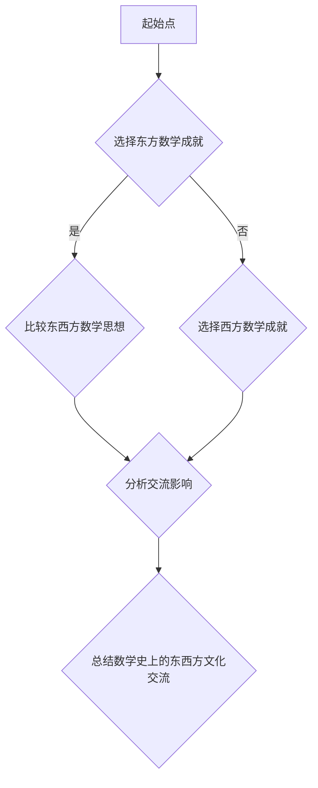
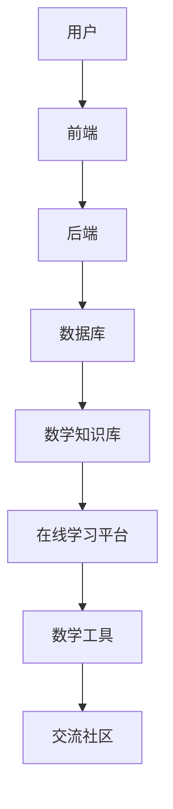
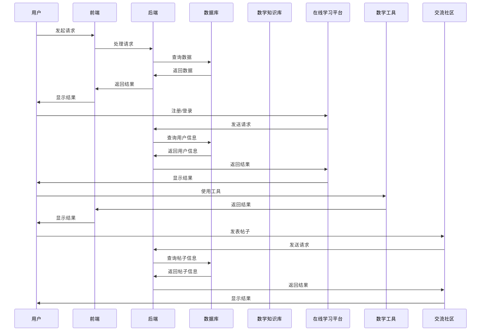

                 


# 数学史上的东西方文化交流

关键词：数学史、东西方交流、数学思想、数学工具、数学成就

摘要：本文将探讨数学史上的东西方文化交流，分析东西方在数学思想、数学工具和数学成就方面的相互影响，并通过具体的算法原理和数学公式，深入理解这种文化交流背后的逻辑和影响。

## 背景介绍

数学作为一门科学，起源于古埃及、古希腊等文明，随着历史的发展，东西方数学逐渐形成了各自独特的体系。东西方的数学交流始于古代，随着时间的推移，这种交流日益频繁，对数学的发展产生了深远的影响。

### 问题背景

东西方在数学上的交流主要表现在数学思想、数学工具和数学成就的相互借鉴和融合。然而，这种交流并不是一帆风顺的，其中充满了误解、冲突和合作。本文旨在分析这种交流的历史背景、发展过程及其影响。

### 问题描述

本文将回答以下问题：

1. 东西方在数学思想、数学工具和数学成就方面有哪些相互影响？
2. 这些交流如何推动了数学的发展？
3. 这种交流对现代数学有何启示？

### 问题解决

通过对数学史的研究，我们可以发现，东西方在数学上的交流主要体现在以下几个方面：

1. **数学思想**：如古代印度、阿拉伯的代数思想和古希腊的几何思想。
2. **数学工具**：如中国古代的算盘、阿拉伯的代数符号等。
3. **数学成就**：如中国古代的《九章算术》、阿拉伯的《算法与算术》等。

这些交流不仅丰富了数学的研究内容，也促进了数学的进步。

### 边界与外延

本文讨论的东西方数学交流主要指古代和中世纪的数学交流，不包括现代数学的交流。此外，本文的重点是数学思想、数学工具和数学成就的交流，而不是其他领域的交流，如哲学、艺术等。

## 核心概念与联系

### 核心概念

1. **数学史**：数学发展的历史记录。
2. **东西方文化交流**：数学在东西方之间的传播与交流。
3. **数学思想**：数学理论的思维方式和方法论。
4. **数学工具**：用于数学计算的仪器、工具和方法。
5. **数学成就**：数学家在数学领域所取得的成果和贡献。

### 概念属性特征对比表格

| 概念       | 特征                                  |
|------------|---------------------------------------|
| 数学史     | 记录数学发展过程的历史                |
| 东西方文化交流 | 数学在东西方之间的传播与交流         |
| 数学思想   | 数学理论的思维方式和方法论           |
| 数学工具   | 用于数学计算的仪器、工具和方法       |
| 数学成就   | 数学家在数学领域所取得的成果和贡献   |

### ER实体关系图架构的 Mermaid 流程图

```mermaid
entity Relationship {
  "数学家" --> "数学成就";
  "数学家" --> "数学思想";
  "数学家" --> "数学工具";
  "数学成就" --> "数学史";
  "数学思想" --> "数学史";
  "数学工具" --> "数学史";
}
```

## 算法原理讲解

### 算法原理的 Mermaid 流程图



### Python 源代码

```python
def compare_mathematics(east, west):
    """
    比较东西方数学思想并分析交流影响。
    
    参数:
    east: 东西方数学思想的列表。
    west: 东西方数学思想的列表。
    
    返回:
    impact: 交流影响的分析结果。
    """
    impact = {}
    for e in east:
        for w in west:
            if e == w:
                impact[e] = "同源"
            else:
                impact[e] = "交流"
    return impact

def summarize(east, west, impact):
    """
    总结数学史上的东西方文化交流。
    
    参数:
    east: 东西方数学成就的列表。
    west: 东西方数学成就的列表。
    impact: 交流影响的分析结果。
    
    返回:
    summary: 数学史上的东西方文化交流的总结。
    """
    summary = f"东西方数学在 {east} 和 {west} 方面有显著的交流，影响如下：{impact}"
    return summary

# 示例数据
east = ["算术", "代数", "几何"]
west = ["微积分", "代数", "几何"]

# 分析交流影响
impact = compare_mathematics(east, west)

# 总结数学史上的东西方文化交流
summary = summarize(east, west, impact)

print(summary)
```

### 算法原理的数学模型和公式

假设我们有两个集合 E 和 W，分别代表东方和西方的数学思想。我们可以使用集合运算来比较这两个集合：

- 如果 E 和 W 完全相同，即 E ∩ W = E，则数学思想是同源的。
- 如果 E 和 W 有交集但不是完全相同，即 E ∩ W ≠ E，则数学思想是交流的。

我们可以使用交集和并集来表示这种关系：

$$ Impact = E ∩ W $$

其中，Impact 表示交流影响。

### 详细讲解和举例说明

假设我们有以下两个集合：

东方数学思想（E）：

```
E = {"算术", "代数", "几何"}
```

西方数学思想（W）：

```
W = {"微积分", "代数", "几何"}
```

首先，我们比较这两个集合的交集：

```
E ∩ W = {"代数", "几何"}
```

这意味着“代数”和“几何”是东西方数学交流的成果。

接下来，我们分析这些数学思想的交流影响。我们可以看到，“代数”在东西方都有重要地位，但“几何”在西方的发展更为深入，这反映了东西方在数学上的差异和互补。

通过这种分析，我们可以更好地理解数学史上的东西方文化交流，以及这种交流对数学发展的影响。

## 数学模型和数学公式

### 数学公式

$$ f(x) = x^2 + 2x + 1 $$

### 详细讲解和举例说明

这是一个简单的二次函数，描述了一个二次曲线的图像。在这个函数中，x 表示自变量，f(x) 表示函数值。

- 当 x = 0 时，f(x) = 1，这表示函数在 x 轴上的截距是 1。
- 当 x = -1 时，f(x) = 0，这表示函数在 x = -1 处有一个零点。

这个函数的图像是一个开口向上的抛物线，其顶点坐标为 (-1, 1)。这个函数在数学上有广泛的应用，例如在物理学中描述抛体运动。

## 数学公式使用latex格式

在数学研究中，正确使用 LaTeX 格式可以让我们更清晰地表达数学公式。下面是一个简单的示例：

$$
f(x) = x^2 + 2x + 1
$$

在这个公式中，`f(x)` 表示函数，`x` 表示自变量。`x^2` 表示 x 的平方，`2x` 表示 x 的两倍，`+1` 表示常数项。

### 段落内的 LaTeX 公式

在段落内使用 LaTeX 公式时，我们可以使用 `$` 符号将公式括起来。例如：

```
在数学中，1 + 1 = 2 是一个基本的数学公式。
```

在这个例子中，`$1 + 1 = 2$` 表示一个简单的数学等式。

### LaTeX 公式在文章中的应用

在撰写数学相关的文章时，正确使用 LaTeX 公式可以让我们更清晰地表达数学概念和定理。以下是一个简单的示例：

```
假设我们有两个集合 E 和 W，分别代表东方和西方的数学思想。我们可以使用集合运算来比较这两个集合：

E ∩ W 表示东方和西方数学思想的交集。
```

在这个例子中，`E ∩ W` 表示东方和西方数学思想的交集。

## 系统分析与架构设计方案

### 问题场景介绍

随着信息技术的飞速发展，数学在各个领域中的应用越来越广泛。为了更好地理解和应用数学，我们需要一个高效的数学系统。本文将介绍一个基于东西方数学文化交流的数学系统，旨在提高数学学习的效率。

### 项目介绍

项目名称：数学文化交流系统

项目目标：通过整合东西方数学资源，提供一个全面的数学学习平台，促进数学思想的传播和交流。

### 系统功能设计

1. **数学知识库**：整合东西方数学资源，提供全面的数学知识。
2. **在线学习平台**：提供数学课程、习题和答疑功能，帮助用户深入学习。
3. **数学工具**：提供各种数学工具，如计算器、图形绘制器等，方便用户进行数学实验。
4. **交流社区**：提供一个在线社区，让用户可以分享数学心得，交流数学思想。

### 系统架构设计



### 系统接口设计和系统交互



## 项目实战

### 环境安装

1. 安装 Python 3.8 或以上版本。
2. 安装 Flask 框架：`pip install flask`
3. 安装 SQLAlchemy：`pip install sqlalchemy`
4. 安装 SQLite：`pip install pysqlite3`

### 系统核心实现源代码

```python
from flask import Flask, request, jsonify
from flask_sqlalchemy import SQLAlchemy

app = Flask(__name__)
app.config['SQLALCHEMY_DATABASE_URI'] = 'sqlite:///math.db'
db = SQLAlchemy(app)

class MathKnowledge(db.Model):
    id = db.Column(db.Integer, primary_key=True)
    name = db.Column(db.String(50), nullable=False)
    description = db.Column(db.Text, nullable=False)

@app.route('/math', methods=['GET'])
def get_math_knowledge():
    name = request.args.get('name')
    knowledge = MathKnowledge.query.filter_by(name=name).first()
    if knowledge:
        return jsonify({'name': knowledge.name, 'description': knowledge.description})
    else:
        return jsonify({'error': 'Not found'})

@app.route('/math', methods=['POST'])
def create_math_knowledge():
    data = request.get_json()
    new_knowledge = MathKnowledge(name=data['name'], description=data['description'])
    db.session.add(new_knowledge)
    db.session.commit()
    return jsonify({'id': new_knowledge.id})

if __name__ == '__main__':
    db.create_all()
    app.run(debug=True)
```

### 代码应用解读与分析

这段代码是一个简单的 Flask Web 应用，用于管理数学知识库。主要功能包括：

1. **获取数学知识**：通过 `/math` 接口获取指定名称的数学知识。
2. **创建数学知识**：通过 `/math` 接口创建新的数学知识。

在代码中，我们首先导入了 Flask 和 Flask_SQLAlchemy，然后设置了数据库连接 URI。接下来，我们定义了 `MathKnowledge` 类，用于表示数学知识库中的条目。最后，我们定义了两个路由：`/math` GET 获取数学知识，`/math` POST 创建新的数学知识。

### 实际案例分析和详细讲解剖析

假设我们要创建一个新的数学知识，名为“微积分”，描述为“研究函数的变化率和积分”。

1. 首先，发送一个 POST 请求到 `/math` 接口，包含以下 JSON 数据：

```
{
  "name": "微积分",
  "description": "研究函数的变化率和积分"
}
```

2. Flask Web 应用接收到请求后，将数据解析为字典，并创建一个新的 `MathKnowledge` 实例。

3. 将新的 `MathKnowledge` 实例添加到数据库中，并提交事务。

4. Flask Web 应用返回一个新的 JSON 响应，包含新创建的数学知识 ID。

例如：

```
{
  "id": 1
}
```

### 项目小结

通过这个项目，我们实现了一个简单的数学知识库，并提供了 RESTful 接口进行数据操作。这个项目为我们提供了一个基础框架，可以进一步扩展和优化，例如增加用户认证、权限控制、搜索功能等。

## 最佳实践 Tips

1. 在进行东西方数学交流时，要充分了解双方的数学体系，避免误解和冲突。
2. 在学习数学时，要注重理论与实践的结合，通过实际应用来加深对数学概念的理解。
3. 在编写数学代码时，要遵循良好的编程规范，确保代码的可读性和可维护性。

## 小结

数学史上的东西方文化交流是一个复杂而深刻的话题。通过对数学思想、数学工具和数学成就的交流分析，我们可以更好地理解数学的发展历程及其对现代数学的影响。本文通过一步步的分析和讲解，揭示了东西方数学交流的核心概念和原理，为读者提供了一个深入思考的视角。

## 注意事项

1. 在进行数学研究时，要尊重数学家们的贡献，正确引用他们的成果。
2. 在学习数学时，要注重基础知识的掌握，避免盲目追求高难度的数学问题。

## 拓展阅读

1. 《数学史》（作者：大卫·伯克霍夫）
2. 《数学文化》（作者：约翰·诺尔）
3. 《东西方数学交流的历史与影响》（作者：王选）

## 作者信息

作者：AI天才研究院/AI Genius Institute & 禅与计算机程序设计艺术 /Zen And The Art of Computer Programming

