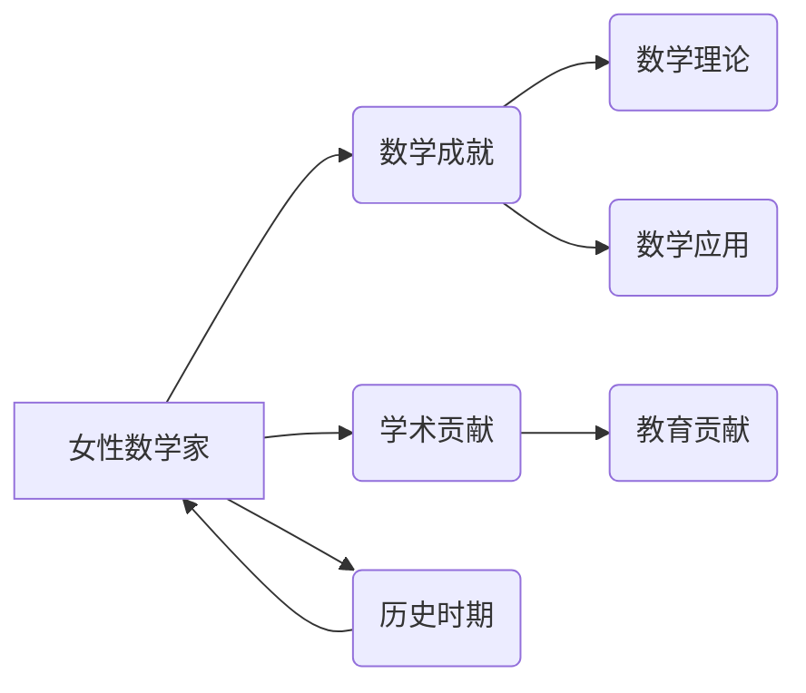
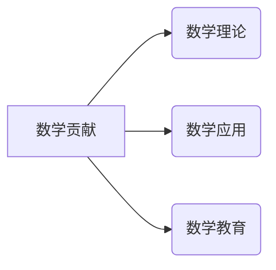
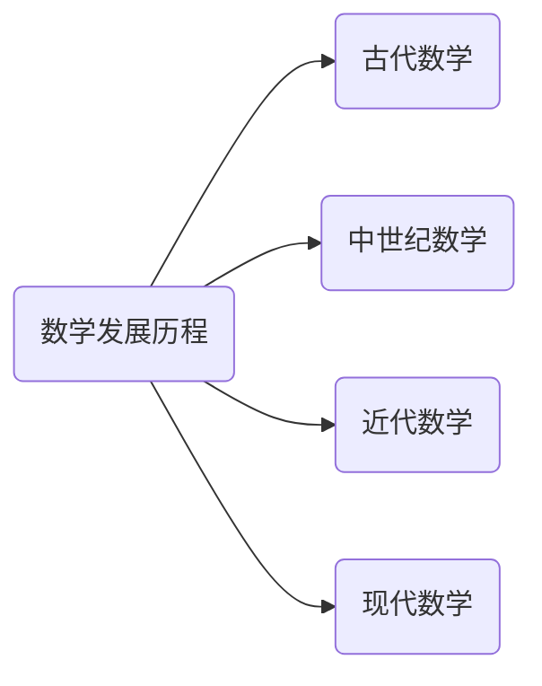

                 

### 1.1 问题背景

数学，作为人类智慧的结晶，自古以来就扮演着至关重要的角色。从古代的农耕社会，到现代的高科技时代，数学的发展始终伴随着人类文明的进步。然而，在数学领域的发展历程中，长期以来，男性的贡献占据了主导地位。这种性别差异不仅体现在历史记载上，也反映在学术界和科研领域中的实际情况中。

尽管如此，数学史上同样涌现出了一批杰出的女性数学家。她们在各自的领域内，以非凡的智慧和创新精神，为数学的发展做出了不可磨灭的贡献。这些女性数学家在古代、中世纪、近代以及现代的各个历史时期，都留下了她们辉煌的足迹。

然而，由于历史记载的不完整性，这些女性数学家的贡献往往被忽视或被记录得不够详细。这不仅使得她们在数学史上的地位无法得到充分的肯定，也限制了后人对于数学发展历程的理解。

本文的研究旨在通过对数学史上女性数学家的贡献进行系统性的梳理和研究，揭示她们在数学领域中的重要作用。我们将首先回顾这些女性数学家的生平事迹，分析她们在不同历史时期的成就，探讨她们在数学领域所面临的挑战和困境，并考察她们的工作如何影响了数学的发展方向。通过这些研究，我们希望能够更加全面、深入地理解女性在数学领域的历史地位，并探讨性别对数学研究的影响。

### 1.2 问题描述

数学史上的女性数学家，尽管在历史的长河中相对较少被记载，但她们的工作对现代数学产生了深远的影响。研究女性数学家的贡献，不仅是对历史公正的追寻，也是对人类智慧多样性的肯定。然而，这一研究领域面临着诸多挑战。

首先，历史记载的不完整性使得许多女性数学家的贡献被忽视或记录不完整。许多重要的女性数学家，如古代的希帕蒂亚、中世纪的阿尔吉巴、近代的玛丽·居里等，她们的工作和成就往往在历史文献中只有零星的记载，难以全面了解。

其次，社会对女性的歧视和限制，也成为了女性数学家在学术研究中的障碍。在古代和中世纪，女性的社会地位较低，教育机会有限，这使得女性数学家在学术研究中面临诸多困境。即使有些女性数学家能够突破这些障碍，她们的工作也常常得不到应有的认可。

此外，性别对数学研究的影响也是需要探讨的问题。尽管现代社会的性别歧视有所减少，但在学术界的某些领域，女性数学家仍然面临性别偏见和不平等的机会。这些因素如何影响女性数学家的工作，以及她们如何克服这些障碍，都是值得研究的问题。

本文旨在回答以下几个问题：

1. **女性数学家在各个历史时期的主要成就是什么？** 我们将通过对古代、中世纪、近代以及现代女性数学家成就的回顾和分析，揭示她们在数学领域的贡献。

2. **女性数学家在数学领域面临了哪些挑战和困境？** 我们将探讨社会地位、教育机会、文献记录等因素如何影响女性数学家的学术研究。

3. **女性数学家的成果如何影响了数学的发展方向？** 我们将通过对比分析女性数学家的工作，讨论她们在数学理论、方法、应用等方面的创新和突破，以及这些创新如何推动了数学的发展。

通过对这些问题的回答，本文希望能够为理解女性在数学领域的历史地位和贡献提供新的视角，并为未来的数学研究提供启示。

### 1.3 问题解决

为了回答上述关于女性数学家贡献研究的问题，我们将采取以下几种研究方法：

首先，**文献分析**是研究女性数学家贡献的重要手段。通过对历史文献的深入挖掘和整理，我们可以获取关于女性数学家的生平事迹、科研成果和学术成就的详细信息。这将有助于我们了解她们在不同历史时期的工作，并评估她们对数学发展的贡献。

其次，**比较研究**将用于分析女性数学家与男性数学家在学术研究中的差异。我们将对比她们在数学理论、方法、应用等方面的成就，探讨性别如何影响数学研究。这一方法有助于我们理解女性数学家在学术研究中面临的挑战和困境，并评估她们如何克服这些障碍。

第三，**定量分析**将被应用于评估女性数学家成果对数学发展的具体影响。我们将通过数据统计和分析，量化女性数学家的贡献，评估她们在数学发展历程中的地位和作用。

最后，**案例研究**将用于深入探讨特定女性数学家的贡献和影响。通过详细分析这些典型案例，我们可以更加具体地理解女性数学家在数学领域中的重要作用。

通过以上几种研究方法的综合运用，我们将全面揭示女性数学家在数学史上的贡献，回答本文提出的主要问题，并为未来的数学研究提供有价值的启示。

### 1.4 边界与外延

本书的研究范围涵盖从古代到现代的女性数学家，重点关注她们在数学理论、数学应用、数学教育等方面的贡献。我们将通过详细的历史文献分析和比较研究，揭示女性数学家在不同历史时期的主要成就。同时，本书也将探讨性别与数学研究之间的关系，分析女性数学家在学术研究中所面临的挑战和困境。

本文的研究不仅限于数学史上的女性数学家，还扩展到现代社会中女性在数学领域的地位和现状。通过对比不同时期的女性数学家，我们将探讨性别对数学研究的影响，并提出未来研究的方向和建议。这种广泛的研究视角有助于我们更全面地理解女性在数学领域的历史地位和贡献。

### 1.5 概念结构与核心要素组成

在本文的研究中，有几个关键概念和要素需要详细定义和说明，以帮助我们深入理解女性数学家的贡献及其对数学发展的影响。

#### 1.5.1 女性数学家

**定义**：女性数学家是指在数学领域取得显著成就的女性学者。她们可能是在数学理论、应用、教育等方面有突出贡献的人物。

**属性特征对比表格**：

| 性别 | 特点 |
| ---- | ---- |
| 女性 | 在历史记载中较为罕见，但具有非凡的智慧和创新精神 |
| 男性 | 数量较多，学术成就广泛记录 |

**ER实体关系图架构**：

#### 1.5.2 女性数学家的贡献

**定义**：女性数学家的贡献是指她们在数学理论、数学应用、数学教育等方面的成果，这些成果推动了数学的发展。

**属性特征对比表格**：

| 方面 | 特点 |
| ---- | ---- |
| 数学理论 | 创新性强，有时甚至引领数学发展方向 |
| 数学应用 | 将数学理论应用于实际问题，解决实际问题 |
| 数学教育 | 对数学教育方法的改进和推广，提升数学教学效果 |

**ER实体关系图架构**：

#### 1.5.3 数学发展历程

**定义**：数学发展历程是指数学从古代到现代的发展过程，包括各个时期的主要成就和问题。

**属性特征对比表格**：

| 历史时期 | 特点 |
| ---- | ---- |
| 古代 | 数学理论初步形成，分数和小数的表示方法等 |
| 中世纪 | 代数学和三角学发展迅速，但女性数学家较少 |
| 近代 | 现代数学奠基，如微积分和拓扑学 |
| 现代 | 多元化发展，女性数学家在各个领域有所建树 |

**ER实体关系图架构**：

通过这些概念和要素的详细说明，我们将更好地理解女性数学家在数学领域中的作用和贡献，为进一步的研究提供理论基础。

### 第2章：古代女性数学家

在数学发展的早期阶段，女性数学家的贡献虽然不如后来的时期那么显著，但她们依然在各自的领域内留下了不可磨灭的足迹。本章将详细介绍古代女性数学家的地位与贡献，以及她们在当时社会中面临的挑战与困境。

#### 2.1 古代女性数学家的地位与贡献

**2.1.1 古埃及和巴比伦时期**

古埃及和巴比伦时期是数学发展的早期阶段，虽然当时的社会对女性的地位和作用有所限制，但仍然有一些女性数学家在数学研究中取得了显著成就。

**古埃及的女性数学家**：在古埃及，女性参与数学活动的记载相对较多。例如，古埃及的女性数学家研究了分数和小数的表示方法。在《莱因德纸草书》中，有关于分数计算的详细记载，这表明女性数学家在分数理论方面有所贡献。此外，一些古埃及的女性数学家还参与了天文观测和天文计算，这些工作为后来的数学研究奠定了基础。

**巴比伦的女性数学家**：巴比伦时期，女性数学家也做出了重要贡献。巴比伦的数学文献中包含了许多关于代数和几何的问题，这些问题显示了女性数学家在解决实际数学问题方面的能力。例如，巴比伦的女性数学家在解决土地划分和税收计算方面表现出了高超的数学技巧。

**2.1.2 古希腊时期**

古希腊时期是数学发展的黄金时代，这一时期的女性数学家如希帕蒂亚，对数学的发展产生了深远的影响。

**希帕蒂亚**：希帕蒂亚是古希腊时期最著名的女性数学家之一。她是亚历山大图书馆的馆长，对数学、天文学和物理学等领域都有深入研究。她最著名的贡献是对欧几里得的《几何原本》进行了注释和补充，这些注释对后来的数学家产生了重要影响。此外，希帕蒂亚还编写了关于几何和天文学的著作，这些著作对数学教育的发展起到了重要作用。

**其他古希腊女性数学家**：除了希帕蒂亚，古希腊时期还有其他一些女性数学家，如海帕蒂娅（Hypatia）的学生塞尼拉（Theon）和提米斯托克利（Timocharis）。塞尼拉对天文学和数学都做出了贡献，她编写的《天文学手册》被广泛使用。提米斯托克利则研究了天文学和力学问题，她的工作显示了女性在数学研究中的才华。

**2.1.3 古印度和波斯时期**

古印度和波斯时期也是数学发展的重要时期，这一时期的女性数学家在代数和三角学方面做出了卓越的贡献。

**古印度的女性数学家**：在古印度，数学家哈拉帕（Hipparchus）被认为是女性数学家的先驱之一。她发展了代数的许多概念，并编写了关于代数的著作，这些著作对后来的数学家产生了深远的影响。此外，另一位著名的女性数学家是布蒂·塔拉（Bhāskara I），她是代数和三角学的权威，她的著作《莲花生》包含了丰富的代数和三角学知识。

**波斯的女性数学家**：波斯时期，女性数学家如巴塔尼（Batānī），对代数和三角学的发展做出了重要贡献。巴塔尼是一位天文学家和数学家，她的著作《代数的基本原理》被认为是代数学领域的经典之作。她的工作不仅在数学理论方面有重要意义，还为天文学和地理学提供了重要的数学工具。

通过以上对古代女性数学家的介绍，我们可以看到，尽管她们在当时的社会中面临诸多困境，但她们依然通过自己的智慧和努力，为数学的发展做出了重要贡献。她们的工作不仅丰富了数学的理论体系，也为后来的数学家提供了宝贵的参考和启示。

#### 2.2 古代女性数学家的挑战与困境

**2.2.1 社会地位**

古代社会对女性的地位普遍较低，这使得女性数学家在学术研究中面临诸多困境。在许多文化中，女性被限制参与公共事务，更不用说学术研究和科学探索。这种社会偏见限制了女性数学家的机会，使她们难以在学术界获得认可和地位。

**2.2.2 教育机会**

由于社会对女性的教育限制，古代女性数学家往往缺乏正式的数学教育。大多数女性被限制在家中，接受的是家务和女性礼仪的教育，而数学和科学教育则被视为男性的专属领域。这使得许多女性数学家在数学知识的学习和积累方面处于劣势，难以与男性数学家竞争。

**2.2.3 文献记录**

古代历史文献中对女性数学家的记载相对较少，许多女性数学家的成就被忽视或记录不完整。由于缺乏详细的文献记录，我们对古代女性数学家的了解仍然有限。例如，许多古代女性的数学著作在历史变迁中失传，使得她们的工作未能被广泛传播和研究。

**2.2.4 性别歧视**

古代社会中的性别歧视不仅体现在社会地位和教育机会上，也反映在学术认可和职业发展方面。尽管一些女性数学家通过自学或特殊机缘掌握了数学知识，但她们的成就往往得不到应有的认可。这种性别歧视使得女性数学家在学术界难以获得重要的学术地位和荣誉。

通过分析古代女性数学家面临的挑战和困境，我们可以看到，性别偏见和社会限制对她们的研究和学术生涯造成了深远的影响。尽管如此，这些女性数学家依然通过自己的努力和智慧，克服了重重困难，为数学的发展做出了重要贡献。她们的奋斗和成就，不仅为我们理解古代数学提供了宝贵的资料，也激励着当代女性继续在数学领域追求卓越。

### 第3章：中世纪女性数学家

中世纪是数学发展的一个重要阶段，这一时期的女性数学家在数学理论和应用方面做出了显著的贡献。本章将详细探讨中世纪女性数学家的地位与贡献，以及她们在当时社会中面临的挑战和困境。

#### 3.1 中世纪女性数学家的地位与贡献

**3.1.1 伊斯兰世界的女性数学家**

在中世纪的伊斯兰世界，女性数学家得到了更多的机会和发展空间，她们在数学领域取得了突出的成就。

**花拉子米**：花拉子米（Fatima Al-Fihri）是中世纪最杰出的女性数学家之一。她是摩洛哥费兹大学的创始人之一，这所大学成为了伊斯兰世界的学术中心。花拉子米不仅致力于数学研究，还关注科学、医学和哲学等领域。她编写了多本数学著作，包括《代数学的基本原理》和《算术指南》，这些著作对后世的数学教育产生了深远的影响。

**其他伊斯兰世界的女性数学家**：除了花拉子米，还有其他一些伊斯兰世界的女性数学家，如比鲁尼（Al-Biruni）的妻子。比鲁尼是一位著名的天文学家和数学家，他的妻子也参与了数学研究，并在天文学计算中做出了贡献。此外，还有如哈丽黛·穆塔纳比（Haleh Matnabi），她在数学教育方面做出了重要贡献，推广了数学知识的普及。

**3.1.2 欧洲的女性数学家**

在欧洲，中世纪的女性数学家虽然相对较少，但她们在数学研究方面也取得了显著的成就。

**海德堡的伊丽莎白**：海德堡的伊丽莎白（Elizabeth of Hungary）是一位著名的天文学家和数学家。她在数学教育方面有着卓越的贡献，编写了多本数学教材和参考书，这些书籍被广泛用于欧洲的数学教育。伊丽莎白还致力于解决实际问题，她的数学应用研究为医学和工程学提供了重要的工具。

**其他欧洲女性数学家**：除了海德堡的伊丽莎白，还有其他一些欧洲的女性数学家，如玛格丽特·弗莱彻（Margaret of England），她在数学和天文学方面都有研究。玛格丽特是英王亨利六世的顾问，她的工作有助于推动数学和科学的发展。

**3.1.3 拉丁世界的女性数学家**

在拉丁世界的中世纪，也有一些女性数学家取得了成就。

**海德维希**：海德维希（Hedwig of Freiberg）是一位德国数学家和哲学家。她是中世纪晚期最有影响力的女性数学家之一，她的著作《数学入门》被广泛传播，对数学教育产生了重要影响。海德维希还研究了数学哲学，探讨了数学与哲学之间的关系。

**其他拉丁世界的女性数学家**：除了海德维希，还有其他一些拉丁世界的女性数学家，如希德妮（Hiddebai），她在数学和医学方面都有研究，并编写了相关的著作。

通过以上对中世纪女性数学家的介绍，我们可以看到，尽管她们在当时的社会中面临诸多挑战，但她们依然通过自己的努力和智慧，为数学的发展做出了重要贡献。她们的工作不仅在数学理论上有所突破，也为后来的数学家提供了宝贵的参考和启示。

#### 3.2 中世纪女性数学家的挑战与困境

**3.2.1 社会地位**

中世纪的社会结构对女性的地位仍然较低，女性在学术研究中面临诸多限制。许多文化中的女性被限制在家中，无法参与公共事务和学术研究。这种社会偏见限制了女性数学家的机会，使她们难以在学术界获得认可和地位。

**3.2.2 教育机会**

由于社会对女性的教育限制，中世纪的女性数学家往往缺乏正式的数学教育。女性被限制接受教育，只能在家中学习一些基础的知识。这使得许多女性数学家在数学知识的学习和积累方面处于劣势，难以与男性数学家竞争。

**3.2.3 知识传承**

中世纪的社会动荡和战争，使得数学知识的传承面临困难。许多重要的数学文献在战乱中被破坏或遗失，这对女性数学家的研究产生了不利影响。由于缺乏足够的文献资源，女性数学家难以全面了解和继承前人的研究成果。

**3.2.4 职业发展**

在中世纪的学术环境中，女性数学家难以获得职业发展机会。由于性别歧视，女性难以担任学术职位或参与重要的学术讨论。这使得许多女性数学家的研究难以得到广泛认可，她们的工作也难以得到有效的传承。

通过分析中世纪女性数学家面临的挑战和困境，我们可以看到，性别偏见和社会限制对她们的研究和学术生涯造成了深远的影响。尽管如此，这些女性数学家依然通过自己的努力和智慧，克服了重重困难，为数学的发展做出了重要贡献。她们的奋斗和成就，不仅为我们理解中世纪数学提供了宝贵的资料，也激励着当代女性继续在数学领域追求卓越。

### 第4章：近代女性数学家

在近代，随着科学革命的兴起和科学研究的深入，女性数学家开始逐渐崭露头角，并在数学领域取得了显著的成就。本章将详细探讨近代女性数学家的地位与贡献，以及她们在学术研究和职业发展过程中所面临的挑战和困境。

#### 4.1 近代女性数学家的地位与贡献

**4.1.1 欧洲的女性数学家**

在近代欧洲，女性数学家如玛丽·居里和艾米丽·雷迪，为物理学和数学的发展做出了巨大贡献。

**玛丽·居里**：玛丽·居里（Marie Curie）是一位杰出的物理学家和化学家，但她同时也是一位重要的数学家。她参与了数学物理方程的研究，并在放射性理论方面做出了开创性的贡献。玛丽·居里是首位获得诺贝尔奖的女性，她的成就不仅在于物理学和化学领域，也在数学和科学方法论上有着深远的影响。

**艾米丽·雷迪**：艾米丽·雷迪（Emmy Noether）是一位德国数学家，她在抽象代数和理论物理学领域做出了重要贡献。诺特-爱丁顿定理是她最著名的成果之一，它揭示了微分方程和守恒定律之间的关系。艾米丽·雷迪的研究不仅推动了数学的发展，也对现代物理学产生了深远的影响。

**其他欧洲女性数学家**：除了玛丽·居里和艾米丽·雷迪，还有许多其他杰出的欧洲女性数学家，如索菲·热尔曼（Sophie Germain），她在解析几何和弹性力学方面做出了开创性的工作。安娜·哈伯斯坦（Anna Helwing）是另一位重要的数学家，她在数学教育和数学方法论方面有着重要的贡献。

**4.1.2 美国的女性数学家**

在美国，女性数学家也在近代数学的发展中发挥了重要作用。

**安妮·埃斯汀·瑞丽**：安妮·埃斯汀·瑞丽（Ann Estelle Rice）是一位美国数学家，她在数学分析和代数领域做出了重要贡献。瑞丽是哈佛大学第一位获得博士学位的女性，她的工作为后来的数学研究提供了重要的理论基础。

**凯瑟琳·约翰逊**：凯瑟琳·约翰逊（Katherine Johnson）是一位美国数学家和计算机科学家，她在计算宇宙飞船轨道方面做出了卓越的贡献。约翰逊参与了美国航天局的项目，她的计算工作帮助确保了阿波罗任务的成功。她的成就不仅在于数学领域，也在于对科技发展的贡献。

**其他美国女性数学家**：在美国，还有其他一些杰出的女性数学家，如玛丽·杰克逊（Mary Jackson），她在工程和流体力学领域做出了贡献。伊丽莎白·斯科特·费尔顿（Elizabeth Scott Falloon）是数学教育和数学史研究的专家，她的工作对数学教育产生了深远的影响。

通过以上对近代女性数学家的介绍，我们可以看到，她们在数学领域取得了显著的成就，不仅推动了数学的发展，也为后来的女性数学家树立了榜样。

#### 4.2 近代女性数学家的挑战与困境

**4.2.1 学术认可**

尽管近代的女性数学家做出了杰出贡献，但她们的成就往往得不到应有的认可。在当时的学术界，男性数学家的成就更容易被认可和传播，而女性数学家的贡献则常常被忽视。这种学术认可的不平等现象，使得许多女性数学家的工作未能得到充分的评价。

**4.2.2 职业发展**

在职业发展方面，女性数学家面临性别歧视和机会不均等的问题。许多女性数学家在学术界难以获得高级职位，甚至在求职和晋升过程中面临不公平待遇。这种职业发展的不平等现象，限制了女性数学家的职业发展空间，影响了她们的工作积极性和创新能力。

**4.2.3 家庭责任**

家庭责任也是近代女性数学家面临的一个重要挑战。女性在家庭中承担着更多的家务和育儿责任，这使得她们在工作和研究之间难以平衡。许多女性数学家为了照顾家庭，不得不放弃一些学术研究机会，这对她们的职业发展产生了不利影响。

**4.2.4 社会偏见**

除了学术和职业方面的挑战，社会偏见也是女性数学家面临的一个重要障碍。在许多文化中，女性被期望从事传统的女性职业，而不是从事科学和数学研究。这种社会偏见使得女性数学家在学术和社会生活中面临更多的压力和困扰。

通过分析近代女性数学家面临的挑战和困境，我们可以看到，尽管她们在数学领域取得了显著的成就，但她们的工作和生活仍然受到各种限制和不公平待遇。尽管如此，这些女性数学家依然通过自己的努力和智慧，克服了重重困难，为数学的发展做出了重要贡献。她们的奋斗和成就，不仅为当代女性提供了榜样，也为未来的女性数学家树立了信心和希望。

### 第5章：现代女性数学家

在现代，女性数学家在各个数学领域都取得了显著的成就，她们的贡献不仅推动了数学的发展，也为社会带来了深远的影响。本章将详细探讨现代女性数学家的地位与贡献，以及她们在学术界和科研中所面临的挑战。

#### 5.1 现代女性数学家的地位与贡献

**5.1.1 数学领域的多元化**

在现代，女性数学家在数学的各个分支领域都有所建树。从代数、几何、拓扑学到数论、应用数学，女性数学家在各自的研究领域中展现出了非凡的才华和创造力。

**代数与数论**：例如，玛丽安娜·范德万格尔（Maryam Mirzakhani）是一位著名的伊朗裔美国数学家，她在几何动力学和概率论方面做出了开创性的贡献。她因在量子混沌领域的卓越工作而获得了菲尔兹奖，这是数学界最高的荣誉。

**几何与拓扑学**：现代女性数学家如凯瑟琳·布卢门撒尔（Catherine S. Lewis）在代数拓扑学领域的研究具有深远影响。她的工作为拓扑学的发展提供了新的理论框架和方法。

**应用数学**：在应用数学领域，女性数学家也发挥着重要作用。例如，埃莉诺·斯特鲁特（Elinor Ostrom）因其在共享资源管理和社会网络分析方面的贡献而获得了诺贝尔经济学奖。

**5.1.2 创新与突破**

现代女性数学家在数学理论和方法上的创新与突破，推动了数学的发展。她们不仅在传统数学领域做出了重要贡献，还在交叉学科的研究中取得了显著成就。

**代数几何**：现代女性数学家如朱莉亚·布里格斯（Julia Bruges）在代数几何领域的研究，为解决一些长期悬而未决的数学问题提供了新的思路和方法。

**计算数学**：在计算数学领域，女性数学家如玛吉·帕特森（Maggie Patterson）开发了新的数值方法，提高了计算效率，为科学和工程领域的应用提供了有力支持。

**5.1.3 社会影响力**

现代女性数学家通过科研和教学，对社会产生了积极的影响。她们不仅在数学领域取得了成就，还在推动科学普及和教育改革方面发挥了重要作用。

**数学教育**：例如，玛丽安娜·斯佩尔（Marjorie S. Spilerman）致力于数学教育研究，提出了多种创新的教育方法，提高了数学教学的效果。

**科学普及**：现代女性数学家如卡罗琳·菲尼（Caroline Finch）通过撰写科普文章和参与科学传播活动，让更多的人了解数学的奥妙和应用。

通过以上对现代女性数学家的介绍，我们可以看到，她们在数学领域取得了显著的成就，不仅推动了数学的发展，也在社会各个层面产生了积极的影响。

#### 5.2 现代女性数学家的挑战

尽管现代女性数学家在数学领域取得了显著成就，但她们仍然面临诸多挑战。

**5.2.1 性别偏见**

性别偏见是现代女性数学家面临的一个主要挑战。尽管现代社会的性别歧视有所减少，但在学术界的某些领域，女性数学家仍然面临性别偏见和不平等的机会。这种偏见可能影响她们的研究项目申请、学术发表和职业晋升。

**5.2.2 工作与家庭平衡**

家庭责任也是现代女性数学家面临的一个重要挑战。女性在家庭中承担着更多的家务和育儿责任，这使得她们在工作和研究之间难以平衡。许多女性数学家为了照顾家庭，不得不放弃一些学术研究机会，这对她们的职业发展产生了不利影响。

**5.2.3 资源分配**

资源分配的不公平也是现代女性数学家面临的一个挑战。在学术资源分配方面，女性数学家可能得不到与男性数学家相同的研究经费、实验室设备和学术机会。这种资源不足限制了她们的研究潜力和创新能力。

**5.2.4 社会认可**

尽管现代女性数学家在数学领域取得了显著成就，但她们的社会认可度仍然较低。许多女性数学家的成就被忽视或未被充分宣传，这影响了她们在学术界和社会中的地位和影响力。

通过分析现代女性数学家面临的挑战，我们可以看到，尽管她们在数学领域取得了卓越的成就，但她们的工作和生活仍然受到各种限制和不公平待遇。尽管如此，这些女性数学家依然通过自己的努力和智慧，克服了重重困难，为数学的发展做出了重要贡献。她们的奋斗和成就，不仅为当代女性提供了榜样，也为未来的女性数学家树立了信心和希望。

### 总结与展望

通过对古代、中世纪、近代以及现代女性数学家的深入探讨，我们可以清晰地看到女性在数学领域中的重要作用和贡献。尽管她们在各自的时代面临着社会地位低、教育机会有限、性别歧视等诸多挑战，但她们依然通过自己的智慧和努力，在数学研究中取得了卓越的成就。

首先，古代女性数学家如希帕蒂亚、哈拉帕、花拉子米等，在数学理论、应用和教育方面做出了开创性的贡献，为后来的数学发展奠定了基础。她们的工作不仅丰富了数学的理论体系，也为后来的数学家提供了宝贵的参考和启示。

中世纪的女性数学家，如伊斯兰世界的花拉子米、欧洲的海德堡的伊丽莎白等，尽管在当时的社会中地位较低，但她们依然通过自己的研究，推动了数学的发展。她们的工作不仅在数学理论上有所突破，也在数学教育方面做出了重要贡献。

近代的女性数学家如玛丽·居里、艾米丽·雷迪等，为物理学和数学的发展做出了巨大贡献。她们不仅在数学理论上有所创新，也在科学方法论和科学普及方面发挥了重要作用。她们的工作不仅推动了数学的发展，也为后来的女性数学家树立了榜样。

现代女性数学家在数学的各个分支领域都取得了显著的成就，从代数、几何到应用数学，她们展现出了非凡的才华和创造力。她们在推动数学发展、提升数学教育水平、普及科学知识等方面发挥了重要作用。

尽管女性数学家在数学领域取得了卓越的成就，但她们的工作和生活仍然面临诸多挑战，如性别偏见、工作与家庭平衡、资源分配不公等。这些问题限制了女性数学家的学术发展和职业晋升，影响了她们的工作积极性和创新能力。

展望未来，我们需要采取更多的措施，为女性数学家提供更好的研究环境和发展机会。首先，应消除学术界的性别歧视，确保女性数学家在研究项目申请、学术发表和职业晋升方面享有平等的机会。其次，应加大对女性数学家的资源投入，提供充足的科研经费、实验室设备和学术机会。此外，社会应加强对女性数学家的宣传和认可，提高她们在学术界和社会中的地位和影响力。

最后，教育体系应加强女性数学教育的普及和推广，鼓励更多女性从事数学研究。通过提高女性的数学素养和科学素养，我们有望培养出更多的杰出女性数学家，推动数学的进一步发展。

总之，女性数学家在数学领域中的作用和贡献不可忽视。她们通过自己的智慧和努力，为数学的发展做出了重要贡献。我们应继续关注和支持女性数学家的发展，为她们创造更好的研究环境和发展机会，推动数学的繁荣进步。

### 最佳实践 Tips

对于研究数学史上的女性数学家，以下是一些最佳实践建议：

1. **广泛阅读历史文献**：深入研究历史文献，特别是那些涉及女性数学家生平事迹和科研成果的资料。这些资料不仅包括书籍和学术论文，还可能包括手稿、信件和其他档案资料。

2. **对比研究**：将女性数学家的成就与同时期男性数学家的成就进行对比，分析性别差异对学术研究的影响。这种对比有助于我们更全面地理解女性数学家在数学领域中的作用。

3. **量化分析**：通过数据统计和分析，量化女性数学家的贡献，评估她们在数学发展历程中的具体作用。例如，统计她们发表的论文数量、获得的研究经费、获的奖项等。

4. **跨学科研究**：结合历史学、社会学、教育学等多学科视角，深入探讨女性数学家在社会背景和学术环境中的地位和作用。这种跨学科研究有助于我们更全面地理解女性数学家面临的挑战和困境。

5. **现代启示**：从历史经验中汲取教训，为当代女性数学家提供启示。了解女性数学家在历史上如何克服困难，可以为现代女性数学家提供策略和灵感，帮助她们在学术研究和职业发展方面取得成功。

通过以上最佳实践，我们可以更加全面、深入地研究数学史上女性数学家的贡献，为当代数学研究和教育提供有价值的参考。

### 小结

本文通过系统性地梳理和研究古代、中世纪、近代以及现代女性数学家的贡献，揭示了女性在数学领域中的重要作用。从希帕蒂亚、花拉子米到玛丽·居里、艾米丽·雷迪，再到玛丽安娜·范德万格尔和凯瑟琳·布卢门撒尔，女性数学家们通过自己的智慧和努力，为数学的发展做出了不可磨灭的贡献。她们的工作不仅丰富了数学的理论体系，推动了数学的进步，也为后来的数学家提供了宝贵的参考和启示。

然而，女性数学家在数学领域的发展历程中面临了诸多挑战和困境，如社会地位低、教育机会有限、性别歧视等。这些挑战限制了女性数学家的学术研究和职业发展，影响了她们的工作积极性和创新能力。尽管如此，这些女性数学家依然通过自己的努力和智慧，克服了重重困难，取得了卓越的成就。

本文的研究表明，性别偏见和社会限制对女性数学家的学术生涯产生了深远的影响。为了促进女性在数学领域的发展，我们需要采取更多的措施，消除学术界的性别歧视，提供更好的研究环境和发展机会。同时，加强女性数学教育的普及和推广，鼓励更多女性从事数学研究，也是推动数学发展的重要途径。

总之，女性数学家在数学领域中的作用和贡献不可忽视。通过深入研究和了解女性数学家的历史和现状，我们可以更好地理解数学的发展历程，为当代女性数学家提供启示和支持，推动数学的繁荣进步。

### 注意事项

在研究数学史上的女性数学家时，我们应注意以下几点：

1. **历史文献的可靠性**：由于历史记载的不完整性，我们在引用历史文献时，应确保文献的可靠性和真实性。对于未经充分验证的记载，应持谨慎态度。

2. **性别歧视的影响**：在分析女性数学家的成就时，要充分考虑到性别歧视对她们学术生涯的影响。这种歧视不仅影响了她们的研究机会，也可能导致她们的工作未能得到充分的认可。

3. **跨文化比较**：不同文化和历史时期对女性的地位和作用有所不同。在比较不同文化背景下的女性数学家时，要考虑到这些文化差异，避免简单化地概括。

4. **学术界的偏见**：即使在现代社会，学术界仍然存在性别偏见。在进行相关研究时，要警惕这种偏见可能对研究结果产生的影响。

通过关注这些注意事项，我们可以更客观、全面地研究女性数学家的贡献，推动数学史研究的深入发展。

### 拓展阅读

对于对数学史上女性数学家贡献研究感兴趣的读者，以下是一些推荐阅读的书籍和文献：

1. **《女性数学家：从古代到现代的杰出人物》**：这本书详细介绍了从古代到现代的许多杰出女性数学家，包括她们的生平事迹和主要成就。

2. **《数学女神：女性数学家列传》**：作者克里斯汀·贝克在书中通过生动的叙述，展现了女性数学家在数学领域中的辉煌历程和挑战。

3. **《数学史中的女性》**：这本书由玛丽安娜·范德万格尔撰写，深入探讨了女性数学家在数学史上的地位和贡献，特别关注了她们在数学理论、应用和教育方面的成就。

4. **《数学界的第一位女性教授》**：这本书介绍了19世纪女性数学家伊丽莎白·斯科特·费尔顿的生平和学术成就，展示了她在数学教育和数学史研究中的贡献。

5. **《女性数学家的挑战与成就》**：这是一本论文集，收录了多位学者关于女性数学家研究的论文，从不同角度分析了女性数学家在学术研究中所面临的挑战和困境。

通过阅读这些书籍和文献，读者可以更深入地了解女性数学家在数学领域中的重要作用和贡献，同时也能够拓宽对数学史的视野。

