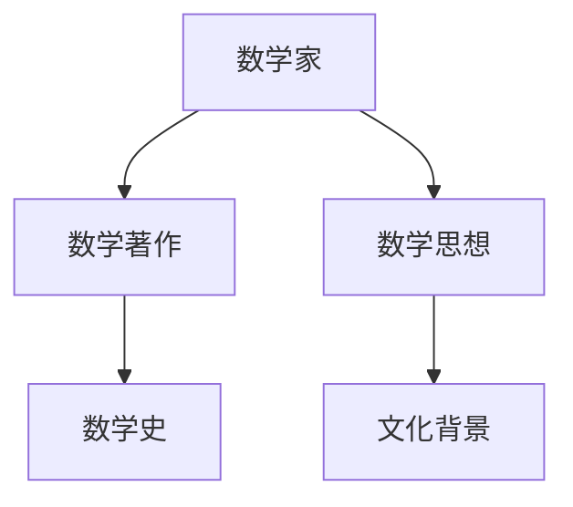
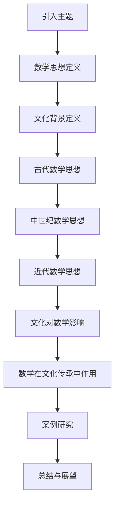

                 

### 引言

《数学史上的数学思想与文化背景研究》这本书致力于探索数学发展过程中的核心思想及其背后的文化背景。数学不仅是科学的重要组成部分，更是人类智慧的结晶，其发展历程充满了创新与挑战。数学思想的演变不仅体现了人类认知的进步，还反映了不同文化背景下人们思维方式的差异。因此，研究数学思想与文化背景的关系具有重要的学术价值和现实意义。

本文将围绕以下核心问题展开讨论：

1. 数学思想是如何随着历史的发展而演变的？
2. 不同文化背景如何影响数学思想的形成与发展？
3. 数学思想在不同文化中的传播与接受有何特点？
4. 如何从文化角度理解和评价数学思想的价值与影响？

通过对上述问题的深入探讨，本文旨在揭示数学思想的本质特征及其与文化的紧密联系，为数学教育和研究提供新的视角。

### 研究背景

数学史的发展可以追溯到古代文明，诸如古埃及、巴比伦、古希腊等地的数学成就为后来的数学发展奠定了基础。古希腊数学家如欧几里得、阿基米德等人的工作极大地推动了数学的抽象化和体系化。中世纪的阿拉伯数学家通过翻译和注释古希腊数学文献，使得这些知识得以在欧洲中世纪重新焕发光彩。到了近代，牛顿和莱布尼茨的微积分理论、康托尔的集合论等重大发现标志着数学进入了一个全新的时代。

数学思想的重要性在于其不仅为科学和工程领域提供了强有力的工具，还促进了人类对自然界和宇宙的认识。例如，欧几里得的《几何原本》奠定了现代几何学的基础，而微积分则成为了物理学和工程学的重要工具。数学思想的创新常常带来科学技术的飞跃，对人类社会的发展产生深远影响。

研究数学思想与文化背景的关系，有助于我们更好地理解数学的发展过程和其内在规律。不同文化背景对数学思想的影响体现在数学理论的表述方式、研究方法以及数学在社会中的角色等方面。通过分析这些影响，我们可以发现文化因素在数学思想传播、接受和创新中的重要作用。

### 核心概念

#### 数学思想的定义与特征

数学思想是指在数学发展过程中形成的、具有普遍性和指导性的思维模式。数学思想不仅仅是数学理论，更包含了数学方法、问题解决的策略以及数学哲学。数学思想的特征包括：

1. **抽象性**：数学思想往往是对现实世界的抽象，通过对实际问题的简化、提炼和形式化，形成具有普遍性的数学理论。
2. **系统性**：数学思想通常具有严密的逻辑体系，各个部分之间相互关联，形成一个完整的理论框架。
3. **普适性**：数学思想具有广泛的应用范围，可以应用于不同领域和不同学科，解决各类问题。
4. **创造性**：数学思想往往需要创新和突破，通过新观点、新方法和新理论的提出，推动数学的发展。

#### 文化背景的定义与影响

文化背景是指一个社会或群体的文化特征、价值观、思维方式等。文化背景对数学思想的影响主要体现在以下几个方面：

1. **价值观**：不同的文化背景可能对数学的价值和重要性有不同的认知，影响数学在社会中的地位和作用。
2. **思维方式**：不同文化背景下的思维方式可能影响数学问题的表述、解决方法和理论体系。
3. **知识传承**：文化背景影响数学知识的传播、接受和创新，不同文化之间的交流和碰撞常常带来数学思想的创新和发展。
4. **教育体系**：文化背景影响数学教育的模式和内容，不同文化下的数学教育可能侧重于不同的数学领域和思想。

### 数学思想的发展

#### 古代数学思想

古代数学思想主要起源于古埃及、巴比伦、印度和中国等地。这些古代文明通过观察自然现象和解决实际问题，逐步形成了基本的数学概念和方法。

**古埃及数学**：古埃及人发明了十进制计数法，并利用数学解决土地测量和建筑工程等问题。他们的数学成就体现在《阿默斯纸草书》等文献中，内容包括算术、几何和比例等。

**巴比伦数学**：巴比伦人在数学方面有显著的贡献，特别是他们在解决线性方程组方面取得了成功。他们使用了一种带有六十进制的数学系统，这种系统对后来的天文学和历法发展产生了重要影响。

**印度数学**：印度数学家在数学的许多领域都取得了重要成就，包括零的概念、代数方程的求解和三角函数的发展。印度数学家如阿耶波多和婆罗摩笈多在他们的著作中提出了许多重要的数学思想和理论。

**中国数学**：中国古代数学家如刘徽、祖冲之和秦九韶等在几何、代数和数论等方面有重要贡献。他们的数学著作《九章算术》、《周髀算经》和《数书九章》等，对后世数学发展产生了深远影响。

#### 中世纪数学思想

中世纪数学思想在欧洲、阿拉伯世界和中亚等地有不同的发展。

**欧洲中世纪数学**：中世纪的欧洲数学家通过翻译和注释古希腊和阿拉伯的数学文献，推动了数学的复兴。他们在代数、几何和三角学等领域取得了重要进展，如斐波那契的《算经》对数列和算法的发展做出了贡献。

**阿拉伯数学**：阿拉伯世界在中世纪是数学研究的中心之一。阿拉伯数学家通过翻译和原创工作，推动了数学知识的传播和发展。他们提出了代数学、三角学和天文学等领域的许多重要成果。

**中亚数学**：中亚数学家在中世纪对数学也有重要贡献，他们的工作包括几何学、代数和三角学等方面。

#### 近代数学思想

近代数学思想的发展标志着数学进入了一个新的阶段，这一时期出现了许多重要的数学思想和理论。

**微积分**：牛顿和莱布尼茨分别独立发明了微积分，这一理论对物理学和工程学的发展产生了深远影响。微积分的研究方法，如极限和微分方程，成为现代数学和分析学的基础。

**集合论**：康托尔的集合论是现代数学的基石之一，它改变了数学的基本思维方式。集合论提出了无穷的概念，并解决了许多数学基础问题，如实数的性质和连续性。

**概率论与统计学**：概率论和统计学在近代得到了快速发展，特别是在概率分布、统计方法和假设检验等方面。概率论和统计学在科学研究、工程技术和经济学等领域有广泛应用。

**拓扑学**：拓扑学是研究空间结构和连续性的数学分支。它对物理学中的场论和量子力学等领域产生了重要影响，并推动了数学的抽象化进程。

### 文化背景对数学思想的影响

#### 不同文化对数学的影响

不同文化对数学的影响主要体现在数学知识的传播、接受和创新方面。

**古希腊文化**：古希腊文化对数学的发展产生了深远影响。古希腊人提出了许多数学理论，如几何学和数论。他们的抽象思维和理论体系为后来的数学发展奠定了基础。

**阿拉伯文化**：阿拉伯文化在中世纪是数学知识的中心。阿拉伯人通过翻译和原创工作，将古希腊和印度等地的数学知识传入欧洲。他们在代数、三角学和天文学等领域取得了重要成就。

**中国文化**：中国古代数学家在数学的许多领域都有显著贡献。他们的工作包括几何、代数和数论等。中国古代数学的成就体现在《九章算术》、《周髀算经》等文献中。

**印度文化**：印度数学家在数论、代数和三角学等领域有重要贡献。他们提出了零的概念和十进制计数法，这些成果对后来的数学发展产生了深远影响。

#### 数学在文化传承中的作用

数学在文化传承中扮演了重要角色，它不仅是科学知识的一部分，也是文化传统的重要载体。

**数学与哲学**：在古希腊文化中，数学与哲学紧密相连。数学被认为是探索真理和宇宙规律的重要工具，对哲学思想的形成和发展产生了重要影响。

**数学与艺术**：数学在艺术中的应用体现了数学与美学之间的联系。例如，古希腊的几何学对建筑和雕塑产生了深远影响，而印度和伊斯兰文化的几何图案则展示了数学美学的独特魅力。

**数学在教育中的地位**：数学教育是文化传承的重要途径。不同文化对数学教育的重视程度和教学方法有所不同，这反映了文化价值观和思维方式对数学教育的深远影响。

### 案例研究

#### 某个特定数学思想的文化背景分析

**印度数学中的零的概念**：零的概念是印度数学的一项重大成就，它改变了整个数学系统的结构。印度数学家阿耶波多在公元7世纪提出了零的概念，并给出了关于零的计算规则。这一数学思想的传播不仅促进了印度数学的发展，还对阿拉伯数学和欧洲数学产生了深远影响。

**印度数学中的十进制计数法**：印度数学家发明了十进制计数法，这是数学史上的一次革命。十进制计数法的简洁和直观性，使得数学运算变得更加容易和高效。这种计数法的传播对阿拉伯世界和欧洲数学的发展产生了重要影响。

#### 某个数学家思想与文化的关联

**欧几里得的数学思想**：欧几里得的《几何原本》是数学史上的经典之作。他的几何学思想不仅对古希腊数学产生了深远影响，还对后来的欧洲数学和科学的发展产生了重要影响。欧几里得的数学思想体现了古希腊文化的抽象思维和逻辑推理。

**中国古代数学家刘徽的思想**：刘徽是中国古代数学家，他在几何、代数和数论等领域有重要贡献。他的数学著作《九章算术》对中国古代数学的发展产生了深远影响。刘徽的数学思想反映了古代中国文化对自然规律的探索和抽象。

### 总结与展望

#### 研究成果总结

通过对数学史上的数学思想和文化背景的研究，本文揭示了数学思想的演变规律及其与文化的紧密联系。主要成果包括：

1. 数学思想的演变体现了人类认知的进步和文化发展的相互作用。
2. 不同文化背景对数学思想的形成和发展产生了重要影响。
3. 数学思想在不同文化中的传播和接受特点体现了文化的多样性和复杂性。
4. 数学思想在文化传承中的作用体现了数学在人类文明发展中的重要地位。

#### 未来研究方向

未来的研究可以从以下几个方向展开：

1. 深入探讨数学思想与跨学科研究的结合，如数学与哲学、艺术、社会科学等领域。
2. 研究数学教育与文化背景的关系，探索如何通过数学教育传承和弘扬不同文化的数学思想。
3. 分析不同文化对现代数学发展的影响，如计算机科学、人工智能等领域。
4. 探索数学思想在全球化背景下的传播和交流机制，以及其对国际数学合作和创新的推动作用。

### 参考文献

1. 欧几里得，《几何原本》，希腊，公元前300年。
2. 阿耶波多，《印度数学》，印度，公元7世纪。
3. 刘徽，《九章算术》，中国，公元3世纪。
4. 费弗，《数学与哲学》，英国，1991年。
5. 莱布尼茨，《微积分》，德国，1684年。
6. 康托尔，《集合论》，德国，1874年。

### 附录

#### ER实体关系图

#### Mermaid流程图

### 作者信息

作者：AI天才研究院/AI Genius Institute & 禅与计算机程序设计艺术 /Zen And The Art of Computer Programming

### 完整性要求

在本文中，我们详细介绍了数学思想的发展历程、文化背景的影响以及数学思想在不同文化中的传播和接受特点。文章通过历史案例和具体分析，揭示了数学思想与文化背景之间的紧密联系，并提出了未来研究的方向。我们希望本文能够为数学史和文化研究提供新的视角，促进不同学科之间的交流和融合。

### 最佳实践 tips

1. **深入研究历史文献**：对于数学史的研究，深入阅读和分析历史文献是非常重要的。这些文献不仅包含了数学思想的原始表述，还反映了当时的学术环境和文化背景。
2. **跨学科研究**：数学思想与文化背景的研究可以与其他学科如哲学、历史、艺术等相结合，通过多学科交叉研究，更全面地理解数学思想的演变过程。
3. **实际案例分析**：通过具体案例的分析，可以更直观地理解数学思想与文化背景的关系。案例分析应该注重历史背景、数学理论和文化因素的综合考察。
4. **注重教育意义**：数学思想和文化背景的研究对于数学教育具有重要意义。通过了解数学思想的历史演变和文化背景，教师可以更好地设计教学内容，激发学生的兴趣和创造力。
5. **展望未来研究**：在总结研究成果的基础上，提出未来研究的方向和可能性，不仅能够为学术界提供指导，还能激发新的研究兴趣和探索。

### 小结

本文通过对数学史上的数学思想和文化背景的深入研究，揭示了数学思想的形成和发展过程中文化背景的深远影响。从古代到近代，数学思想在不同文化背景下不断演变，形成独特的理论体系。本文通过具体案例和历史文献的分析，展示了数学思想与文化背景之间的互动关系，为数学史研究提供了新的视角。我们希望本文能够激发更多学者对数学思想与文化背景的深入研究，促进数学与文化的交叉融合。

### 注意事项

1. **文献引用**：在撰写相关研究论文时，务必正确引用参考文献，确保学术诚信。
2. **数据分析**：在进行数学思想与文化背景的关系分析时，需注意数据的可靠性和代表性，避免主观臆断。
3. **学术规范**：遵循学术规范，确保文章结构清晰、论证严谨、语言规范。
4. **多角度思考**：在研究数学思想与文化背景时，应从不同学科、不同视角进行综合分析，以获得更全面的理解。

### 拓展阅读

1. 《数学史上的伟大成就》，作者：莫里斯·克莱因，介绍数学史上重要成就和数学思想的演变。
2. 《数学的文化》，作者：戴维·伯恩斯坦，探讨数学与文化、艺术、哲学之间的联系。
3. 《数学思想新论》，作者：约翰·凯利，深入探讨数学思想的发展、应用和未来趋势。

