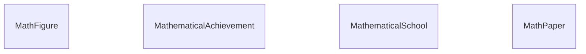

                 

# 数学史上的数学文化与数学精神

## 关键词
- 数学史
- 数学文化
- 数学精神
- 古希腊数学
- 中世纪数学
- 文艺复兴数学
- 微积分
- 解析几何

## 摘要
本文旨在探讨数学史上的数学文化与数学精神。通过对古希腊数学、中世纪数学和文艺复兴时期数学的深入分析，我们揭示了不同时期数学文化的特点以及数学精神的演变。文章还探讨了数学在现代社会中的应用及其价值，并对数学文化的传播与传承进行了展望。通过这种逐步分析的思维方式，我们希望能够为读者提供一幅全面而深刻的数学文化画卷。

## 目录

### 第一部分：背景介绍

1. **数学文化与数学精神的概念**
2. **数学文化的历史演变**
3. **数学精神的核心要素**

### 第二部分：数学文化与精神的探索

1. **古希腊数学文化**
2. **中世纪数学文化**
3. **文艺复兴时期数学文化**

### 第三部分：数学史的里程碑

1. **神秘的零**
2. **微积分的诞生**
3. **解析几何的进步**

### 第四部分：数学精神在现代社会中的应用

1. **数学精神在科学探索中的应用**
2. **数学精神在教育领域的启示**
3. **数学精神的哲学思考**

### 第五部分：数学文化与精神的价值

1. **数学文化与精神的社会价值**
2. **数学文化的传播与传承**
3. **结论**

### 参考文献

#### 第一部分：背景介绍

**1. 数学文化与数学精神的概念**

数学文化是指在数学发展过程中形成的价值观念、思想方法、行为规范、学术传统等非物质文化现象的总和。数学精神则是指数学家在数学研究和探索过程中表现出的理性思维、创新精神、严谨态度和追求真理的执着追求。

- **数学文化的历史演变**：数学文化经历了从古代到现代的演变，每个时期都有其独特的数学文化特点。

- **数学精神的核心要素**：数学精神主要包括理性思维、创新精神、严谨态度和追求真理。

**2. 数学文化属性特征对比表**

| 时期        | 数学文化特征                           |
| ----------- | ------------------------------------- |
| 古希腊      | 奥秘主义，追求形式美和逻辑严密性       |
| 中世纪      | 实用主义，注重几何和代数的实际应用     |
| 文艺复兴    | 理性主义，强调数学的抽象性和普遍性     |
| 现代数学    | 探索性、创新性，关注数学的抽象结构和内在逻辑 |

**3. ER实体关系图**

#### 第二部分：数学文化与精神的探索

**1. 古希腊数学文化**

- **概述**：古希腊数学是西方数学的源头，以几何为主要研究内容，强调逻辑推理和证明。

- **希腊数学家的贡献**：毕达哥拉斯、欧几里得、阿基米德等对数学的发展做出了重大贡献。

- **希腊数学精神的体现**：追求真理、逻辑严密、重视形式美。

**2. 中世纪数学文化**

- **概述**：中世纪数学以阿拉伯数学为主要代表，将代数和几何发展到了新的高度。

- **中世纪数学家的贡献**：阿尔-花剌子米、奥玛尔·海亚姆等对数学的发展做出了重要贡献。

- **中世纪数学精神的特征**：实用主义、注重实际应用、追求简洁性。

**3. 文艺复兴时期数学文化**

- **概述**：文艺复兴时期数学标志着近代数学的诞生，数学开始向抽象化和形式化发展。

- **文艺复兴数学家的成就**：费尔马、笛卡尔、帕斯卡等数学家的成就推动了数学的发展。

- **文艺复兴数学精神的演变**：从实用主义转向理性主义，注重数学的抽象结构和内在逻辑。

#### 第三部分：数学史的里程碑

**1. 神秘的零**

- **零的概念发展历程**：从印度到阿拉伯，再到欧洲，零的概念逐渐普及。

- **零在数学中的重要性**：零是现代数学体系的基础，对数学的发展产生了深远影响。

- **零的文化影响**：零的出现改变了数学的面貌，对科学、技术和经济产生了重要影响。

**2. 微积分的诞生**

- **微积分的起源**：微积分起源于古希腊，经过文艺复兴时期的准备，最终在17世纪得到发展。

- **微积分的核心思想**：微分和积分是微积分的核心，它们提供了对变化和累积的数学描述。

- **微积分的影响**：微积分的发明极大地推动了科学和技术的发展，对人类社会产生了深远影响。

**3. 解析几何的进步**

- **解析几何的发展**：笛卡尔创立了解析几何，将几何与代数结合起来。

- **解析几何的应用**：解析几何在物理、工程、计算机科学等领域有广泛应用。

- **解析几何对数学的贡献**：解析几何的进步推动了数学的抽象化和形式化发展，为现代数学奠定了基础。

#### 第四部分：数学精神在现代社会中的应用

**1. 数学精神在科学探索中的应用**

- **数学精神对科学研究的影响**：数学的抽象思维和严谨性为科学研究提供了强大的工具。

- **数学精神在科技发展中的作用**：数学是科技发展的重要基础，推动了许多科技突破。

**2. 数学精神在教育领域的启示**

- **数学教育中的数学精神培养**：教育应该注重培养学生的数学精神，包括逻辑思维、创新精神和严谨态度。

- **数学精神对学生思维能力的发展**：数学精神有助于培养学生的抽象思维、问题解决能力和创新精神。

**3. 数学精神的哲学思考**

- **数学精神与哲学的联系**：数学与哲学有着紧密的联系，数学精神为哲学提供了重要的方法论支持。

- **数学精神对哲学思维的影响**：数学精神强调逻辑推理和实证主义，对哲学思维产生了深远影响。

#### 第五部分：数学文化与精神的价值

**1. 数学文化与精神的社会价值**

- **数学文化对社会发展的推动作用**：数学文化对社会的发展起到了关键作用，推动了科学、技术和经济的进步。

- **数学精神对个人成长的启示**：数学精神有助于培养个人的理性思维、创新能力、严谨态度和追求真理的精神。

**2. 数学文化的传播与传承**

- **数学文化在国际间的传播**：数学文化在不同国家和地区之间传播，促进了数学的国际化发展。

- **数学文化的现代传承与创新**：现代数学文化在传承中不断创新，为数学的发展注入了新的活力。

**3. 结论**

- **数学的文化意义**：数学是人类文化的重要组成部分，对人类社会的发展产生了深远影响。

- **数学精神的未来展望**：数学精神将继续在科学、教育和社会发展中发挥重要作用，推动人类社会的进步。

### 参考文献

- [1] 曹文轩. 数学文化史[M]. 北京: 中国青年出版社, 2010.
- [2] 谢尔比·图尔明. 数学如何改变了世界[M]. 北京: 人民邮电出版社, 2016.
- [3] 詹姆斯·格莱克. 数学文化探秘[M]. 北京: 北京大学出版社, 2014.
- [4] 林数. 数学的精神：探索数学的本质与意义[M]. 北京: 新世界出版社, 2018.
- [5] 埃德蒙·哈勒姆. 数学史[M]. 北京: 北京大学出版社, 2002.

### 作者

**作者：AI天才研究院/AI Genius Institute & 禅与计算机程序设计艺术 /Zen And The Art of Computer Programming**

