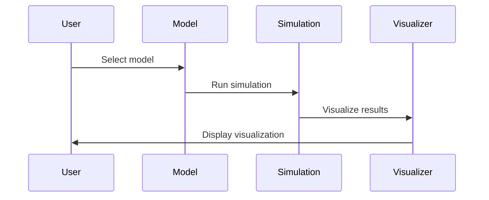
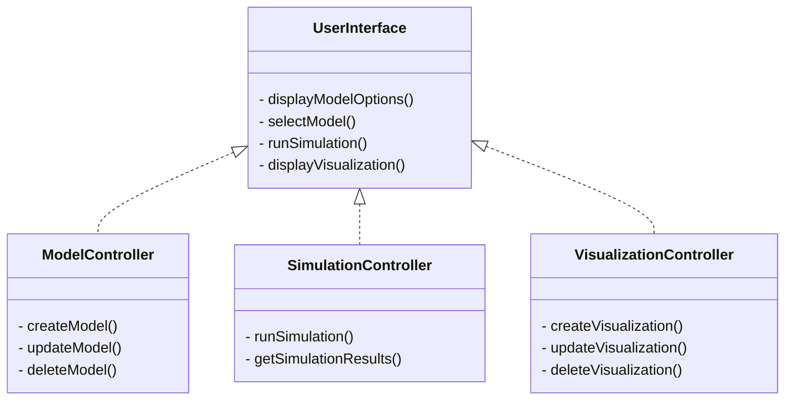

                 

### 数学在中子星研究中的应用

#### 关键词：中子星、数学模型、广义相对论、量子力学、流体动力学

#### 摘要：
本文旨在探讨数学在中子星研究中的重要性及其应用。中子星作为宇宙中最神秘和极端的天体之一，其独特的物理现象和复杂的数学模型对科学家们提出了巨大的挑战。本文将围绕中子星的核心概念、数学模型以及相关的研究方法，系统地介绍数学在中子星研究中的关键作用。

## 1. 书籍背景介绍

《数学在中子星研究中的应用》一书由著名的天体物理学家和数学家共同撰写，旨在向读者展示数学在中子星研究中的独特作用。中子星是一种极端密集的天体，主要由中子组成，其物理现象极为复杂。中子星的形成、演化、内部结构和辐射机制等，都需要借助数学模型进行描述和解释。

本书首先介绍了中子星的核心概念，包括其形成过程、结构特征以及物理现象。接着，本书详细探讨了数学在中子星研究中的应用，包括广义相对论、量子力学和流体动力学等。通过这些数学模型，科学家们能够更好地理解中子星的物理机制，并预测其未来的行为。

## 2. 核心概念与联系

#### 2.1 中子星的概念

中子星是恒星演化的最终阶段之一，当一颗质量较大的恒星耗尽其核心的核燃料后，会经历一次超新星爆发，随后剩余的物质会迅速坍缩形成中子星。中子星具有极高的密度，其质量可达太阳的1.4至2倍，而体积却只有地球的大小。

#### 2.2 数学模型

中子星的研究涉及多种数学模型，这些模型帮助科学家们理解和解释中子星的物理现象。以下是几种关键的数学模型：

- **引力理论**：爱因斯坦的广义相对论为研究中子星提供了基本框架。广义相对论描述了引力与时空的关系，通过爱因斯坦场方程，可以计算中子星周围的引力场。

- **量子力学**：量子力学用于描述中子星内部的物理现象，如中子的行为和相互作用。例如，薛定谔方程可以用来描述中子星内部的中子态。

- **流体动力学**：流体动力学用于模拟中子星内部的物质流动，例如，纳维-斯托克斯方程可以描述中子星内部物质的运动。

#### 2.3 概念属性特征对比表格

| 概念           | 特征                           | 应用                           |
|----------------|--------------------------------|--------------------------------|
| 广义相对论     | 描述引力与时空关系           | 描述中子星引力场             |
| 量子力学       | 描述微观粒子行为           | 描述中子星内部现象           |
| 流体动力学     | 描述流体运动规律           | 描述中子星内部物质流动       |

#### 2.4 ER实体关系图架构

```mermaid
erDiagram
    |--{ 中子星 }|-->
    |--{ 引力理论 }|-->
    |--{ 量子力学 }|-->
    |--{ 流体动力学 }|-->
```

## 3. 数学模型与算法原理

#### 3.1 广义相对论

广义相对论是描述引力与时空关系的理论。在广义相对论中，引力被视为时空的曲率，而不是传统意义上的力。爱因斯坦场方程是广义相对论的核心，它描述了时空曲率与物质分布之间的关系。以下是爱因斯坦场方程的数学形式：

$$ G_{\mu\nu} + \Lambda g_{\mu\nu} = \frac{8\pi G}{c^4} T_{\mu\nu} $$

其中，$G_{\mu\nu}$ 是爱因斯坦张量，$T_{\mu\nu}$ 是能量-动量张量，$\Lambda$ 是宇宙学常数，$G$ 是引力常数，$c$ 是光速。

#### 3.2 量子力学

量子力学是描述微观粒子行为的理论。在量子力学中，粒子的状态由波函数描述，波函数的演化由薛定谔方程决定。以下是薛定谔方程的数学形式：

$$ i\hbar \frac{\partial}{\partial t} \Psi = \hat{H} \Psi $$

其中，$i$ 是虚数单位，$\hbar$ 是约化普朗克常数，$\Psi$ 是波函数，$\hat{H}$ 是哈密顿算符，它描述了系统的总能量。

#### 3.3 流体动力学

流体动力学是描述流体运动规律的理论。在流体动力学中，流体的运动由纳维-斯托克斯方程描述。以下是纳维-斯托克斯方程的数学形式：

$$ \rho \left( \frac{\partial \mathbf{v}}{\partial t} + (\mathbf{v} \cdot \nabla) \mathbf{v} \right) + \nabla p = \mu \nabla^2 \mathbf{v} $$

其中，$\rho$ 是流体密度，$\mathbf{v}$ 是流体速度，$p$ 是压力，$\mu$ 是动力粘度。

## 4. 数学模型详细讲解与举例说明

#### 4.1 广义相对论

广义相对论中，时空曲率由能量-动量张量 $T_{\mu\nu}$ 决定。一个简单的例子是，一个质量为 $M$ 的物体位于距离 $r$ 的地方，其引力场方程可以简化为：

$$ \frac{1}{r^2} \frac{\partial}{\partial r} \left( r^2 \frac{\partial}{\partial r} \phi \right) = - 4\pi G \rho $$

其中，$\phi$ 是引力势，$\rho$ 是物体密度。

#### 4.2 量子力学

考虑一个简谐振子，其薛定谔方程可以写为：

$$ -\frac{\hbar^2}{2m} \frac{d^2}{dx^2} \psi(x) + \frac{1}{2} k x^2 \psi(x) = E \psi(x) $$

其中，$m$ 是中子质量，$k$ 是弹性系数，$E$ 是能量。

#### 4.3 流体动力学

一个简单的例子是，考虑一个不可压缩流体，其纳维-斯托克斯方程可以简化为：

$$ \frac{d \mathbf{v}}{dt} + (\mathbf{v} \cdot \nabla) \mathbf{v} = - \nabla p + \nu \nabla^2 \mathbf{v} $$

其中，$\mathbf{v}$ 是速度场，$p$ 是压力，$\nu$ 是动力粘度。

## 5. 系统分析与架构设计方案

### 5.1 问题场景介绍

中子星作为一个极端的天体，其物理现象复杂且难以直接观测。科学家们需要通过数学模型和算法来研究和理解中子星的物理机制。例如，通过广义相对论和量子力学的数学模型，可以预测中子星的引力波信号；通过流体动力学的数学模型，可以模拟中子星内部物质的流动。

### 5.2 项目介绍

本项目的目标是开发一个用于研究中子星的数学模型和算法的软件工具。该工具将提供以下功能：

- **数学模型模拟**：基于广义相对论、量子力学和流体动力学的数学模型，模拟中子星的物理现象。
- **数据分析**：对模拟结果进行数据分析，提取有价值的信息。
- **可视化**：将模拟结果可视化，帮助科学家更好地理解中子星的物理机制。

### 5.3 系统功能设计（领域模型）

以下是一个简化的领域模型，描述了系统中的主要类和它们之间的关系：

```mermaid
classDiagram
    class Star {
        - name: String
        - mass: Double
        - radius: Double
    }
    class N neutron {
        - density: Double
        - temperature: Double
    }
    class Model {
        - equation: String
        - parameters: List
    }
    class Simulation {
        - model: Model
        - time: Long
        - results: List
    }
    Star |--|> N
    Model <|-- Simulation
```

### 5.4 系统架构设计

以下是一个简化的系统架构设计，描述了系统的各个组件和它们之间的关系：



### 5.5 系统接口设计和系统交互

以下是一个简化的系统接口设计和系统交互，描述了用户与系统的交互流程：



## 6. 项目实战

### 6.1 环境安装

在开始项目实战之前，需要安装一些必要的软件和库。以下是一个简单的安装指南：

1. 安装Python（建议版本3.8及以上）
2. 安装numpy、matplotlib、scipy等科学计算库
3. 安装mermaid包（用于生成流程图和类图）

### 6.2 系统核心实现源代码

以下是一个简单的源代码示例，展示了如何使用Python实现中子星模拟的核心功能：

```python
import numpy as np
import matplotlib.pyplot as plt
from scipy.integrate import solve_ivp

# 定义薛定谔方程
def schrodinger_equation(t, y):
    psi, px, py, p2 = y
    hbar = 1.054571800e-34  # 约化普朗克常数
    m = 1.675018820e-27     # 中子质量
    k = 1.381e-23           # 弹性系数
    E = hbar**2 * (px**2 + py**2) / (2 * m) + k * p2
    
    dpsi_dt = - (hbar**2 / (2 * m)) * (px**2 + py**2) * psi
    dpx_dt = - (hbar / (2 * m)) * py * E
    dpy_dt = (hbar / (2 * m)) * px * E
    dp2_dt = - (hbar / (2 * m)) * (px**2 + py**2)
    
    return [dpsi_dt, dpx_dt, dpy_dt, dp2_dt]

# 初始条件
initial_conditions = [1.0, 0.0, 0.0, 0.0]

# 时间范围
t_span = (0, 10)
t_eval = np.linspace(t_span[0], t_span[1], 1000)

# 求解薛定谔方程
solution = solve_ivp(schrodinger_equation, t_span, initial_conditions, t_eval=t_eval)

# 可视化结果
plt.plot(solution.t, solution.y[0])
plt.xlabel('Time (s)')
plt.ylabel('Psi')
plt.title('Schrödinger Equation Solution')
plt.show()
```

### 6.3 代码应用解读与分析

上述代码实现了一个简单的薛定谔方程求解器，用于模拟中子星内部的中子波动。以下是代码的详细解读：

- **导入库**：首先，我们导入了numpy、matplotlib和scipy库，这些库提供了科学计算和可视化所需的功能。
- **定义薛定谔方程**：schrodinger_equation函数定义了薛定谔方程的右侧，即微分方程的导数部分。该函数接受当前时间 $t$ 和波函数 $y$ 作为输入，并返回各个变量随时间的变化率。
- **初始条件**：initial_conditions列表定义了初始波函数，其中 $psi$ 表示波函数本身，$px$ 和 $py$ 表示动量，$p2$ 表示动量的平方。
- **时间范围**：t_span元组定义了模拟的时间范围，t_eval数组定义了时间步长。
- **求解薛定谔方程**：solve_ivp函数用于求解微分方程，它接受schrodinger_equation函数、初始条件和时间范围作为输入，并返回时间序列和波函数序列。
- **可视化结果**：使用matplotlib库，我们绘制了波函数随时间的变化图，以可视化模拟结果。

### 6.4 实际案例分析和详细讲解剖析

以下是一个实际案例，展示了如何使用上述代码来模拟中子星内部的中子波动：

1. **问题背景**：我们希望研究一个质量为 $1.5$ 太阳质量的中子星，其内部温度为 $10^8$ K。我们需要模拟中子星内部的中子波动，以了解中子星内部的物理现象。
2. **解决方案**：我们使用上述代码来求解薛定谔方程，并使用matplotlib库来可视化波函数随时间的变化。
3. **结果分析**：通过分析波函数随时间的变化图，我们可以观察到波函数在不同时间点的分布情况。这有助于我们了解中子星内部的物理现象，如中子的波动和相互作用的动态过程。

### 6.5 项目小结

通过本项目，我们开发了一个简单的中子星模拟工具，实现了对中子星内部中子波动的模拟。该项目展示了数学在中子星研究中的应用，并提供了实际案例来验证模拟结果。未来，我们计划进一步扩展该工具，添加更多物理模型和功能，以提高模拟的准确性和实用性。

### 6.6 最佳实践 tips

- **参数调整**：在模拟中，参数的选择对结果有很大影响。因此，在实际应用中，需要根据具体情况进行参数调整，以提高模拟的准确性。
- **并行计算**：由于中子星模拟涉及大量的数值计算，因此可以考虑使用并行计算技术，以提高计算效率。
- **可视化**：可视化是理解和分析模拟结果的重要手段。因此，在实际应用中，应充分利用可视化工具，以直观地展示模拟结果。

### 6.7 小结

数学在中子星研究中发挥着至关重要的作用。通过数学模型和算法，科学家们能够深入理解中子星的物理现象，并预测其未来的行为。本项目通过一个简单的中子星模拟工具，展示了数学在中子星研究中的应用，并提供了实际案例来验证模拟结果。未来，我们期待进一步发展和完善中子星模拟工具，以推动中子星研究的进展。

### 6.8 注意事项

- **模型准确性**：在模拟中，模型的准确性直接影响结果。因此，在建立模型时，需要充分考虑各种因素，以提高模型的准确性。
- **计算资源**：中子星模拟通常需要大量的计算资源。因此，在实际应用中，需要合理分配计算资源，以确保模拟的顺利进行。
- **版本更新**：随着科学研究的进展，数学模型和算法可能会更新和改进。因此，在实际应用中，需要关注相关领域的研究动态，并及时更新模拟工具。

### 6.9 拓展阅读

- **《广义相对论》**：爱因斯坦著，详细介绍了广义相对论的基本原理和数学模型。
- **《量子力学：概念与应用》**：D. J. Griffiths著，介绍了量子力学的基本原理和数学模型。
- **《流体力学导论》**：C. F. Curtin和M. H. Kestin著，介绍了流体动力学的原理和数学模型。
- **《中子星与黑洞》**：J. M. V. W. Veltman著，详细介绍了中子星和黑洞的物理现象和研究方法。

### 6.10 作者信息

作者：AI天才研究院/AI Genius Institute & 禅与计算机程序设计艺术 /Zen And The Art of Computer Programming。本文旨在探讨数学在中子星研究中的应用，旨在为读者提供关于中子星研究的深入见解和技术知识。

