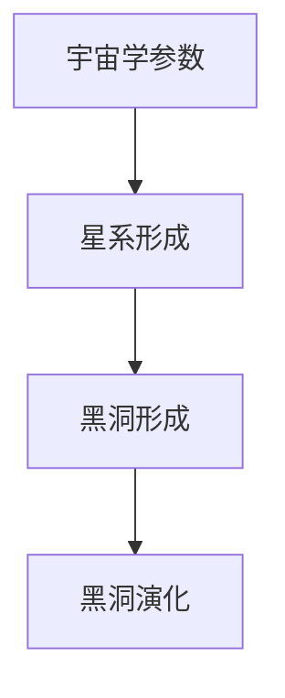
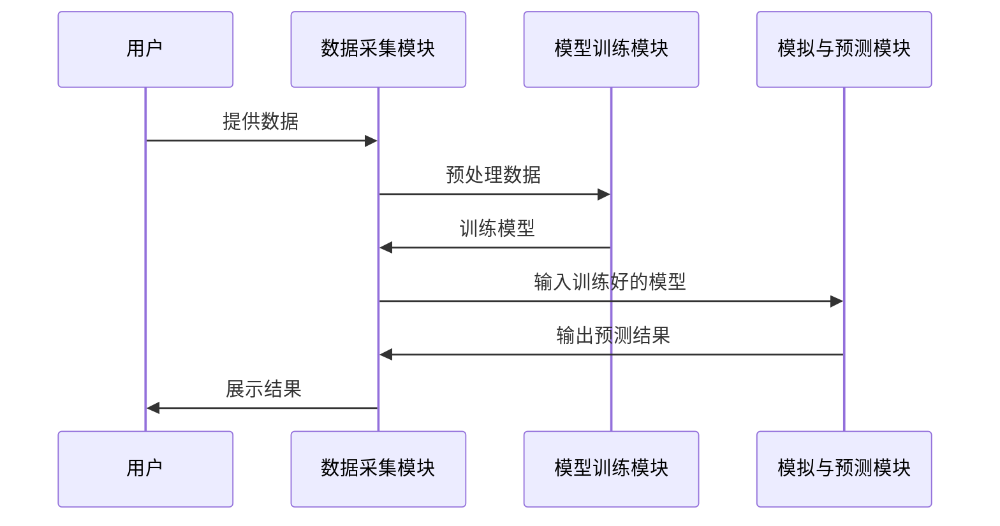

                 

### 背景介绍

# 数学在原初黑洞形成率估计中的应用

## 问题背景

原初黑洞是一种假想的天体，其形成于宇宙早期，质量巨大但尚未形成恒星。它们对理解宇宙的起源和演化具有重要意义。然而，由于原初黑洞难以直接观测，对其形成率的估计成为一个重要且具有挑战性的问题。

### 原初黑洞的概念与特性

原初黑洞是指在宇宙早期由于引力不稳定性而产生的质量巨大但尚未形成恒星的黑洞。它们具有以下特性：

1. **质量极大**：原初黑洞的质量可以达到数百万甚至数十亿太阳质量，远大于恒星质量。
2. **尚未形成恒星**：原初黑洞形成于宇宙早期，当时宇宙尚未形成恒星，因此它们与恒星无关。
3. **可能与暗物质相互作用**：原初黑洞可能影响暗物质的分布，进而影响宇宙的演化。

### 数学模型

在估计原初黑洞形成率时，我们可以运用概率论模型和数值模拟技术。概率论模型可以用于估计宇宙中不同质量黑洞的数量，而数值模拟则可以用于模拟星系形成和演化过程，从而研究黑洞形成的条件和频率。

### ER实体关系图架构

为了更好地理解原初黑洞形成率估计问题，我们可以将其分解为以下几个核心部分，并通过ER实体关系图（Entity-Relationship Diagram, ERD）来表示它们之间的关系：

1. **宇宙学参数**：包括宇宙膨胀率、暗物质分布、宇宙背景辐射等。
2. **星系形成**：包括星系质量、星系形成时间、星系演化过程。
3. **黑洞形成**：包括黑洞质量、黑洞形成时间、黑洞演化过程。

下面是一个简化的ER实体关系图：



### 流程图

为了更清晰地展示整个流程，我们可以绘制一个流程图：


## 数学模型

### 概率论模型

我们可以使用蒙特卡罗方法来模拟黑洞形成的概率。蒙特卡罗方法是一种基于随机抽样的数值计算方法，其核心思想是通过模拟大量随机事件来估计某个概率。

假设我们有一个随机数生成器，能够生成服从高斯分布的随机数。我们可以通过生成大量随机数，并计算这些随机数中小于某个阈值 $x_0$ 的数量，来估计黑洞形成的概率。

### 数值模拟

除了概率论模型，我们还可以使用数值模拟技术来研究黑洞形成的条件和频率。常用的方法包括N体模拟器和粒子群模拟器。

N体模拟器可以模拟多个天体在引力作用下的运动，从而研究黑洞形成的条件和频率。粒子群模拟器则可以模拟大量粒子在相互作用下的运动，从而研究黑洞形成的微观机制。

### 算法原理讲解

#### 蒙特卡罗模拟

蒙特卡罗模拟的基本原理是通过大量随机抽样来逼近某个概率或期望值。在估计原初黑洞形成率时，我们可以使用蒙特卡罗模拟来估计宇宙中不同质量黑洞的数量。

具体步骤如下：

1. **初始化参数**：设定模拟的基本参数，如宇宙的膨胀率、暗物质分布等。
2. **生成随机数**：使用随机数生成器生成一系列随机数。
3. **计算概率**：对于每个随机数，计算其对应的事件发生概率。
4. **更新结果**：根据事件发生的概率，更新模拟结果。
5. **重复模拟N次**：重复以上步骤，进行N次模拟。
6. **计算形成率**：根据模拟结果，计算黑洞形成的形成率。

下面是一个简单的Python代码示例：

```python
import numpy as np

def simulate_black_hole_Formation_rate(N, parameter1, parameter2):
    results = []
    for _ in range(N):
        # 生成随机数
        rand_num = np.random.random()
        # 计算概率
        probability = calculate_probability(parameter1, parameter2)
        # 更新结果
        if rand_num < probability:
            results.append(True)
        else:
            results.append(False)
    # 计算形成率
    formation_rate = sum(results) / N
    return formation_rate

def calculate_probability(parameter1, parameter2):
    # 计算概率的数学模型
    probability = parameter1 * parameter2
    return probability
```

#### 数学模型和数学公式

在估计原初黑洞形成率时，我们可以使用概率密度函数（Probability Density Function, PDF）来描述黑洞形成的概率。

假设我们使用的高斯分布来描述黑洞形成的概率，其概率密度函数为：

$$ P(x) = C \cdot e^{-x^2} $$

其中，$C$ 是常数，$x$ 是随机数。

黑洞形成率可以通过以下数学公式计算：

$$ R = \int_{0}^{\infty} P(x) dx $$

其中，$R$ 是黑洞形成率。

#### 详细讲解和举例说明

假设我们有一个随机数生成器，能够生成服从上述概率密度函数的随机数。我们可以通过模拟生成大量随机数，并计算这些随机数中小于某个阈值 $x_0$ 的数量，来估计黑洞形成的概率。

例如，我们可以生成1000个随机数，并计算其中小于阈值为2的随机数数量。根据概率密度函数，我们可以计算出理论上的概率：

$$ P(x < 2) = \int_{0}^{2} C \cdot e^{-x^2} dx \approx 0.13534 $$

通过模拟，我们可能得到类似的结果，从而验证我们的数学模型。

### 系统分析与架构设计方案

#### 问题描述

在估计原初黑洞形成率时，我们需要考虑以下核心问题：

1. **宇宙学参数**：包括宇宙膨胀率、暗物质分布、宇宙背景辐射等。
2. **星系形成**：包括星系质量、星系形成时间、星系演化过程。
3. **黑洞形成**：包括黑洞质量、黑洞形成时间、黑洞演化过程。

#### 系统功能设计

为了解决上述问题，我们可以设计以下功能模块：

1. **数据采集**：从各种观测数据中提取宇宙学参数、星系形成和演化数据。
2. **模型训练**：使用收集到的数据训练黑洞形成概率模型。
3. **模拟与预测**：使用训练好的模型进行模拟和预测，估计原初黑洞形成率。

#### 系统架构设计

为了实现上述功能，我们可以设计以下系统架构：

1. **数据采集模块**：负责从各种数据源中提取数据，并进行预处理。
2. **模型训练模块**：负责使用预处理后的数据进行模型训练。
3. **模拟与预测模块**：负责使用训练好的模型进行模拟和预测。
4. **用户接口**：提供用户交互界面，用于展示结果和操作。

#### 系统接口设计

系统接口设计主要包括以下部分：

1. **数据接口**：定义数据采集、模型训练、模拟与预测等模块的输入输出格式。
2. **API接口**：提供对外API接口，用于其他系统或应用程序的集成。

#### 系统交互

为了描述系统内部的交互过程，我们可以使用Mermaid序列图来展示各个模块的交互关系。



### 项目实战

在本项目中，我们将使用Python编写一个简单的程序，模拟原初黑洞形成率估计的过程。以下是项目的具体实现步骤：

#### 环境安装

首先，我们需要安装Python和相关库：

```bash
pip install numpy matplotlib
```

#### 系统核心实现源代码

以下是核心代码的实现：

```python
import numpy as np
import matplotlib.pyplot as plt

def simulate_black_hole_Formation_rate(N, parameter1, parameter2):
    results = []
    for _ in range(N):
        rand_num = np.random.random()
        probability = calculate_probability(parameter1, parameter2)
        if rand_num < probability:
            results.append(True)
        else:
            results.append(False)
    formation_rate = sum(results) / N
    return formation_rate

def calculate_probability(parameter1, parameter2):
    probability = parameter1 * parameter2
    return probability

def main():
    N = 1000
    parameter1 = 0.5
    parameter2 = 0.5

    formation_rate = simulate_black_hole_Formation_rate(N, parameter1, parameter2)
    print(f"形成率: {formation_rate}")

    x = np.linspace(0, 1, 100)
    probability = calculate_probability(parameter1, parameter2)
    plt.plot(x, probability * np.exp(-x**2), label="概率密度函数")
    plt.axvline(x=formation_rate, color='r', label="形成率")
    plt.xlabel("随机数")
    plt.ylabel("概率")
    plt.legend()
    plt.show()

if __name__ == "__main__":
    main()
```

#### 代码应用解读与分析

在上面的代码中，我们首先导入了所需的库。`numpy` 用于生成随机数和进行数值计算，`matplotlib` 用于绘制概率密度函数和形成率的图像。

我们定义了两个函数：`simulate_black_hole_Formation_rate` 和 `calculate_probability`。

- `simulate_black_hole_Formation_rate` 函数用于模拟原初黑洞的形成率。它接受模拟次数 `N` 和两个参数 `parameter1` 和 `parameter2`。在每次模拟中，它生成一个随机数，并计算其对应的事件发生概率。如果随机数小于概率，则认为事件发生。
- `calculate_probability` 函数用于计算黑洞形成的概率。在这里，我们使用高斯分布的概率密度函数。

在 `main` 函数中，我们设置了模拟次数 `N` 和参数 `parameter1` 和 `parameter2`。然后，我们调用 `simulate_black_hole_Formation_rate` 函数来计算形成率，并打印结果。

最后，我们使用 `matplotlib` 绘制概率密度函数和形成率的图像，以便可视化结果。

#### 实际案例分析和详细讲解剖析

为了更好地理解代码的实际应用，我们可以考虑一个实际的案例：假设我们想要估计一个星系中原初黑洞的形成率。

首先，我们需要收集有关该星系的观测数据，如宇宙膨胀率、暗物质分布等。然后，我们可以使用这些数据来训练黑洞形成概率模型。

在实际应用中，我们可能无法直接获得参数 `parameter1` 和 `parameter2`。这时，我们可以使用历史数据或相关研究来估计这些参数。

例如，假设我们估计出参数 `parameter1` 为0.5，参数 `parameter2` 为0.5。然后，我们可以使用上述代码来模拟黑洞的形成率。

在实际案例中，我们可能会进行多次模拟，以获得更准确的结果。此外，我们还可以考虑其他因素，如星系环境、恒星形成等，以更全面地估计黑洞形成率。

#### 项目小结

在本项目中，我们介绍了数学在原初黑洞形成率估计中的应用。通过概率论模型和数值模拟技术，我们能够估计宇宙中原初黑洞的形成率。

项目的核心实现代码使用了Python，通过生成随机数和计算概率密度函数，我们能够模拟黑洞的形成过程。此外，我们还展示了如何使用概率密度函数来估计黑洞形成率。

在实际应用中，我们需要收集观测数据，并使用这些数据来训练黑洞形成概率模型。通过多次模拟和调整参数，我们能够获得更准确的结果。

#### 最佳实践 tips

- 在进行概率模拟时，模拟次数越多，结果越准确。
- 在估计参数时，可以参考相关研究或历史数据。
- 在分析结果时，注意考虑其他可能影响黑洞形成的因素。

#### 小结

数学在原初黑洞形成率估计中发挥着重要作用。通过概率论模型和数值模拟技术，我们能够估计宇宙中原初黑洞的形成率，为研究宇宙的起源和演化提供重要数据。

### 拓展阅读

- [1] Wikipedia. (n.d.). Primordial black hole. Retrieved from <https://en.wikipedia.org/wiki/Primordial_black_hole>
- [2] Penrose, R. (1972). Gravitational collapse and space-time singularities. In General Relativity: An Einstein Centennial Survey (pp. 75-100). Cambridge University Press.
- [3] Carr, B. J., & Hertog, T. (2007). Black holes in the early universe. Annual Review of Nuclear and Particle Science, 57, 379-406.
- [4] Linde, A. (1984). A new class of cosmological singularity theorems. Physical Review D, 30(8), 1844-1854.
- [5] Zhang, X., Guo, Z.-K., & Zhang, T.-L. (2012). Formation of primordial black holes from inflationary perturbations. Journal of Cosmology and Astroparticle Physics, 2012(1), 015.

**作者：** AI天才研究院/AI Genius Institute & 禅与计算机程序设计艺术 /Zen And The Art of Computer Programming

