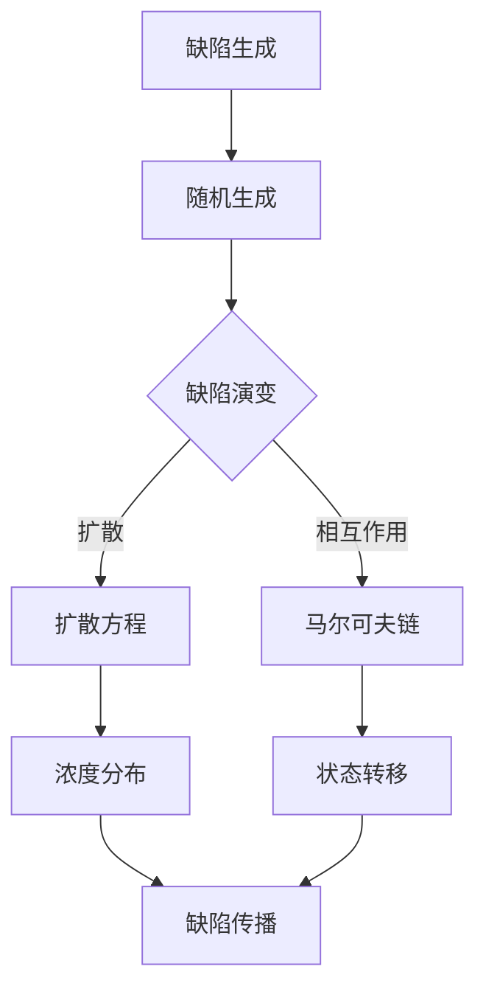
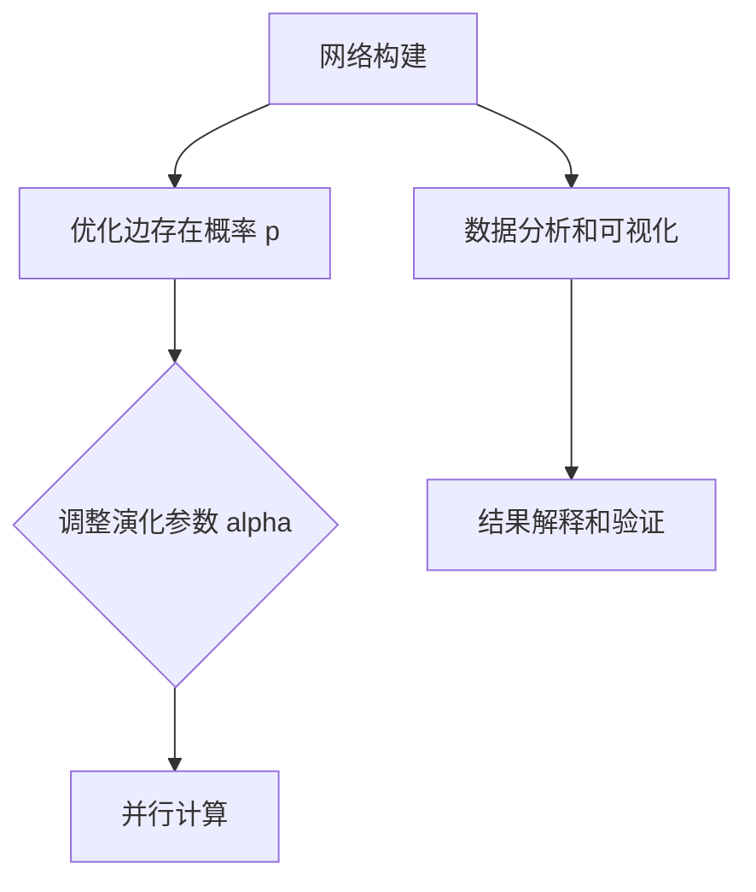

                 

## 引入与背景

### 宇宙中的拓扑缺陷

在宇宙的宏大尺度上，物质和能量的分布形成了复杂的结构。这些结构不仅仅是静态的，它们还在不断地演化。在物理学和宇宙学的研究中，拓扑缺陷是一个重要的概念。拓扑缺陷是指在物质或能量分布中出现的异常点或线，这些缺陷往往是由宇宙中的各种力量平衡失调所导致的。例如，宇宙中的黑洞、中子星等天体就是典型的拓扑缺陷，它们代表了物质在极端条件下的一种形态。

拓扑缺陷的发现可以追溯到20世纪中叶，当时物理学家在研究晶体结构时首次注意到，晶体内部的某些部位会出现异常，这些异常部位并不遵循晶体的基本结构规律。随着研究的深入，人们发现，这类缺陷不仅在固体物理学中存在，而且在流体物理学、等离子体物理学以及宇宙学中也有着广泛的应用。

在宇宙学中，拓扑缺陷被认为是宇宙演化过程中的一种重要现象。例如，宇宙的大尺度结构，如星系团和超星系团，可以被视为拓扑缺陷在宇宙尺度上的表现形式。此外，宇宙中的暗物质和暗能量，也被认为是由某些未知的拓扑缺陷所引起的。

### 拓扑缺陷网络

拓扑缺陷网络是由多个拓扑缺陷通过物理相互作用所构成的网络结构。这种网络在许多科学领域中都有重要的应用，特别是在物理学、材料科学、生物学以及计算机科学中。拓扑缺陷网络的研究，有助于我们更好地理解复杂系统的行为和演化规律。

拓扑缺陷网络的基本性质包括：

1. **连通性**：网络中各个缺陷之间的连接方式，决定了网络的稳定性和传递特性。
2. **缺陷密度**：网络中缺陷的分布密度，对网络的整体性质有着重要影响。
3. **缺陷类型**：不同类型的缺陷在物理性质和相互作用上存在差异，从而影响网络的动态行为。
4. **动态演化**：拓扑缺陷在网络中的生成、演变和消亡过程，是研究网络动力学的重要方向。

### 临界动力学

临界动力学是研究系统在接近相变点时的行为和特性的一个分支。相变是指系统在温度、压力或其他参数发生变化时，从一种状态转变为另一种状态的现象。临界点则是相变过程中，系统性质发生剧烈变化的点。

临界动力学研究的关键点包括：

1. **临界指数**：描述系统在临界点附近的行为特征。
2. **临界行为**：系统在临界点附近的动力学行为，如临界慢化现象、涨落等现象。
3. **临界现象的数学模型**：通过数学模型来描述系统的临界行为，如标度律、分形等。

在拓扑缺陷网络的研究中，临界动力学提供了一个重要的视角。它可以帮助我们理解拓扑缺陷在网络中的演化规律，特别是在网络接近临界状态时的行为。例如，当网络中的缺陷数量达到某个临界值时，网络可能会发生剧烈的结构变化，甚至导致整个网络的崩溃。

### 数学在宇宙拓扑缺陷网络演化临界动力学研究中的作用

数学在宇宙拓扑缺陷网络演化临界动力学研究中的作用不可忽视。数学工具和方法为这一领域的研究提供了强有力的支持，使得我们能够更加精确和深入地理解宇宙中的这些复杂现象。

首先，数学模型为拓扑缺陷网络的演化提供了一个量化的描述框架。通过建立数学模型，我们可以将复杂的物理现象转化为可计算的形式，从而对网络的行为进行模拟和分析。

其次，数学方法如拓扑学、图论、统计物理等，为研究拓扑缺陷网络的性质和行为提供了强有力的工具。这些方法不仅能够帮助我们理解网络的静态特性，还能分析网络的动态演化过程。

此外，数学在临界动力学的应用，使得我们能够深入探讨系统在临界状态附近的行为特征。通过数学模型和计算方法，我们可以预测系统在临界点附近可能出现的现象，如临界慢化、涨落等。

总的来说，数学在宇宙拓扑缺陷网络演化临界动力学研究中的作用，不仅体现在模型构建和计算方法的运用上，更在于它为我们提供了一种理解复杂现象的新视角。随着数学工具的不断发展和完善，我们有望在宇宙拓扑缺陷网络的研究中取得更多的突破和进展。

### 总结

本文介绍了宇宙拓扑缺陷网络的背景和重要性，探讨了临界动力学的概念及其在拓扑缺陷网络研究中的应用。同时，强调了数学在这一领域中的关键作用，包括模型构建、方法运用和现象预测。通过本文的介绍，读者可以初步了解数学在宇宙拓扑缺陷网络演化临界动力学研究中的广泛应用和重要性。接下来的章节将进一步深入探讨这些核心概念和数学工具，以便读者能够更加全面和深入地理解这一领域的前沿研究。

## 核心概念与联系

### 拓扑空间与拓扑结构的数学概念

拓扑空间是数学中一个基本的概念，它用来描述对象之间的连通性和结构。一个拓扑空间是由一个集合以及该集合上的开集组成的。开集是那些包含其内部所有点的集合。拓扑空间的基本性质包括连通性、闭合性和边界性。连通性是指空间中的任意两点都可以通过一条连续的路径相连。闭合性是指空间中的任意一点都属于某个开集。边界性则是指空间中的某些点可能既不属于开集，也不属于闭集，而是处于开集与闭集的交界处。

在拓扑空间中，拓扑结构指的是这些开集的集合所满足的性质。常见的拓扑结构包括欧几里得空间、离散空间、有限拓扑空间等。欧几里得空间是我们在日常生活中最常见的一种拓扑结构，它由欧几里得几何中的点、线、面等构成。离散空间则是一个由有限个或无限个点构成的拓扑空间，其中任意两点之间都是连通的。有限拓扑空间则是介于离散空间和欧几里得空间之间的一种结构。

拓扑结构的一个重要特性是它对连续变换的保持性。这意味着，如果一个集合上的连续函数将一个开集映射到另一个开集，那么这个函数就被称为连续函数。拓扑结构的这种性质使得我们可以用拓扑空间来描述和分析各种不同类型的物理现象。

### 缺陷网络的数学属性

缺陷网络是指在物质或能量分布中出现的异常点或线所构成的网络结构。这些缺陷可以是由于物质内部的结构不均匀、外部环境的压力变化或者内在的物理机制所导致的。在数学上，缺陷网络通常被表示为一个图，其中节点代表缺陷，边代表缺陷之间的相互作用。

缺陷网络的数学属性主要包括：

1. **连通性**：缺陷网络中的节点是否通过边相连，决定了网络的连通性。一个完全连通的网络意味着任意两个节点之间都有直接的连接。连通性是研究缺陷网络稳定性和传递特性时的重要指标。
2. **密度**：缺陷网络的密度是指单位体积或单位面积内的缺陷数量。缺陷密度对网络的性质有着重要的影响，例如，高密度的缺陷网络往往具有较高的稳定性和信息传递效率。
3. **缺陷类型**：不同类型的缺陷在物理性质和相互作用上存在差异。例如，点缺陷和线缺陷可能在网络中的作用不同。数学上，可以通过定义不同的缺陷类型来研究这些差异。
4. **动态演化**：缺陷网络不是静止的，而是在不断地生成、演变和消亡。动态演化可以用数学模型来描述，如随机过程、马尔可夫链等。

### 临界动力学的基本原理

临界动力学是研究系统在接近相变点时的行为和特性的一门科学。相变是指系统在某个临界点发生从一种状态向另一种状态的转变。临界点是指系统性质发生剧烈变化的点。在临界动力学中，研究的主要问题包括：

1. **临界指数**：临界指数是描述系统在临界点附近行为特征的一个参数。例如，临界指数描述了系统在接近临界点时的涨落幅度和衰减速度。临界指数的值通常与系统的维度和拓扑结构有关。
2. **临界行为**：临界行为是指系统在临界点附近所表现出来的异常现象，如临界慢化、涨落等现象。这些现象通常在临界点附近具有明显的特征，并且与系统的微观结构密切相关。
3. **临界现象的数学模型**：临界现象的数学模型是通过建立数学方程来描述系统的行为。这些模型通常涉及非线性方程、标度律和分形等概念。

在缺陷网络的研究中，临界动力学提供了一个重要的视角。当缺陷网络接近临界状态时，系统的性质可能会发生显著变化。例如，缺陷的数量可能会迅速增加，网络的连通性可能会急剧下降，从而导致整个网络的崩溃。临界动力学的研究可以帮助我们理解这些现象，并预测系统在临界状态附近的行为。

### 数学工具在拓扑缺陷研究中的应用

数学工具在拓扑缺陷研究中扮演了至关重要的角色。通过数学模型和计算方法，我们可以更精确和深入地理解拓扑缺陷的演化规律和动力学行为。以下是一些常用的数学工具：

1. **拓扑学**：拓扑学是研究空间性质而不依赖于度量的一种数学分支。在拓扑缺陷研究中，拓扑学可以用来分析缺陷网络的连通性、密度和缺陷类型。通过拓扑不变量，如基数、连通度和同调性，我们可以量化网络的拓扑特性。
2. **图论**：图论是研究图的结构和性质的数学分支。在缺陷网络中，图论可以帮助我们理解节点和边之间的相互作用，以及网络的整体结构。例如，通过图论中的算法，我们可以分析网络的稳定性、传递效率和鲁棒性。
3. **统计物理**：统计物理是研究大量粒子系统的宏观性质和微观行为的数学工具。在拓扑缺陷研究中，统计物理可以用来建立和模拟缺陷网络的动态演化模型，如随机游走、扩散过程和马尔可夫链等。

### 数学工具的具体应用

数学工具在拓扑缺陷研究中的具体应用包括以下几个方面：

1. **拓扑缺陷的识别与分类**：通过拓扑学的方法，我们可以对缺陷进行分类和识别。例如，利用同调性理论，我们可以区分不同的拓扑缺陷类型，如点缺陷、线缺陷和面缺陷。
2. **缺陷网络的演化模拟**：通过统计物理的方法，我们可以模拟缺陷网络的动态演化过程。例如，利用随机过程模型，我们可以模拟缺陷在网络中的生成、演变和消亡过程，并分析这些过程对网络整体性质的影响。
3. **临界动力学分析**：通过临界动力学模型，我们可以分析缺陷网络在接近临界状态时的行为特征。例如，利用分形理论，我们可以研究网络在临界点附近的涨落行为和临界指数。

### 附录 2.1: 拓扑结构的 Mermaid ER 实体关系图

以下是一个简单的 Mermaid ER 图，用于展示拓扑结构的实体关系：

```mermaid
erDiagram
    Node ||--|{ Edge }
    Node ||--|{ Node }
    Edge ||--|{ Node }
    Node ||--|{ Fault }
    Fault ||--|{ Node }
    Edge ||--|{ Fault }
```

在这个图中，节点（Node）表示拓扑空间中的点，边（Edge）表示点之间的连接，故障（Fault）表示拓扑缺陷。通过这个图，我们可以直观地看到不同实体之间的关系和拓扑结构的基本组成。

### 综述

通过本文，我们介绍了拓扑空间和拓扑结构的数学概念，探讨了缺陷网络的数学属性，阐述了临界动力学的基本原理，并展示了数学工具在拓扑缺陷研究中的应用。这些核心概念和联系为我们理解和研究宇宙拓扑缺陷网络的演化提供了重要的理论基础。在接下来的章节中，我们将进一步深入探讨数学模型和方法，以揭示这些复杂现象的内在机制。

## 数学模型概述

### 拓扑缺陷网络的数学建模

在研究拓扑缺陷网络的数学建模时，我们首先需要定义一些基本概念和参数。假设我们有一个由节点和边构成的拓扑网络，每个节点代表一个缺陷，每条边代表缺陷之间的相互作用。为了描述这样一个网络的特性，我们可以使用图论和拓扑学中的相关概念。

#### 节点与边

1. **节点**：每个节点可以表示一个缺陷，其属性包括位置、类型和度数（即与它相连的边的数量）。
2. **边**：边表示缺陷之间的相互作用，其属性包括长度、强度和方向（在无向图中，边通常是双向的）。

#### 数学参数

1. **度数分布**：度数分布是指网络中每个节点的度数出现的频率。它可以帮助我们了解网络的连接特性。
2. **聚类系数**：聚类系数描述了节点之间连接的紧密程度。一个高聚类系数的网络意味着节点倾向于形成团簇。
3. **路径长度**：路径长度是指网络中两个节点之间最短路径的长度，它决定了信息的传递效率和网络的连通性。

#### 数学建模方法

1. **图论模型**：利用图论中的基本概念，如邻接矩阵、度数序列和图的连通性，我们可以对拓扑缺陷网络进行数学描述。例如，通过邻接矩阵，我们可以描述节点之间的连接关系。
2. **拓扑学模型**：拓扑学提供了一种更抽象的描述方法。例如，通过同调性和同伦性，我们可以分析网络的空间性质。

### 临界动力学方程的建立

临界动力学方程是描述系统在临界点附近行为的数学方程。建立这类方程的关键在于捕捉系统在接近临界点时的关键特征，如涨落、临界指数和临界行为。

1. **标度律**：标度律是描述系统在临界点附近行为的一个重要概念。例如，临界指数描述了系统在临界点附近的涨落行为。
2. **非线性方程**：在临界动力学中，非线性方程如朗道方程（Landau equation）和戈尔登方程（Gordon equation）常用于描述系统的行为。这些方程可以捕捉临界点附近的复杂动力学现象。
3. **微分方程**：通过微分方程，我们可以描述系统在连续时间下的动态行为。例如，偏微分方程可以用来描述缺陷在网络中的扩散过程。

### 数学模型的应用场景

数学模型在拓扑缺陷网络中的应用非常广泛，以下是一些具体的应用场景：

1. **材料科学**：在材料科学中，拓扑缺陷网络的数学模型可以用于研究材料的微观结构，如晶格缺陷、位错等。
2. **生物网络**：在生物网络中，拓扑缺陷网络的数学模型可以用于研究细胞内的信号传递、蛋白质相互作用等。
3. **社会网络**：在社会网络中，拓扑缺陷网络的数学模型可以用于分析社交网络的结构和功能，如网络泡沫、社区划分等。
4. **宇宙学**：在宇宙学中，拓扑缺陷网络的数学模型可以用于研究宇宙的大尺度结构，如星系团、超星系团等。

### 总结

数学模型为拓扑缺陷网络的研究提供了一个量化描述的框架，通过定义节点、边和相关的数学参数，我们可以对网络的性质进行详细分析。同时，临界动力学方程为我们提供了描述系统在临界点附近行为的有力工具。这些数学模型的应用场景非常广泛，从材料科学到生物网络，再到社会网络和宇宙学，都有重要的应用价值。在接下来的章节中，我们将进一步探讨这些数学模型的具体应用和算法实现。

## 数学模型与算法原理

### 拓扑缺陷演化模型的数学原理

在研究拓扑缺陷的演化模型时，我们首先需要理解拓扑空间的连续性与连通性，以及拓扑缺陷的动态演化过程。以下是对这些概念的详细解析。

#### 拓扑空间的连续性与连通性

拓扑空间的连续性是指空间中任意两点之间的连接保持不变，即使经过变形或扭曲。连通性则是指空间中的任意两点都可以通过一条连续的路径相连。在拓扑缺陷网络中，这些特性决定了网络的稳定性和传递特性。

1. **连续性**：拓扑空间的连续性可以通过拓扑不变量来量化，如基数、连通度和同调性。基数是指网络中节点的数量，连通度是指网络中任意两点之间的最短路径长度。
2. **连通性**：连通性是研究网络稳定性和信息传递效率的重要指标。一个高度连通的网络意味着节点之间的信息传递效率更高，而连通性较低的网络则可能存在信息孤岛。

#### 拓扑缺陷的动态演化

拓扑缺陷的动态演化是指缺陷在网络中的生成、演变和消亡过程。这些过程可以通过数学模型来描述，如随机过程、马尔可夫链和扩散方程等。

1. **生成**：拓扑缺陷的生成通常是一个随机过程，可以通过概率模型来描述。例如，我们可以使用泊松过程来模拟缺陷点的随机生成。
2. **演变**：缺陷的演变是指缺陷在网络中的传播和相互作用。这种过程可以用扩散方程来描述，如菲克定律（Fick's laws）描述了扩散过程的基本规律。
3. **消亡**：缺陷的消亡可以是由于网络中的物理机制或随机扰动导致的。例如，当两个缺陷相遇时，它们可能会合并形成一个更大的缺陷。

#### 数学模型的应用

1. **随机过程模型**：随机过程模型用于描述缺陷的生成和消亡过程。例如，泊松过程可以用来模拟缺陷点的随机生成，而马尔可夫链可以用来描述缺陷之间的相互作用。
2. **扩散方程模型**：扩散方程模型用于描述缺陷在网络中的扩散和传播过程。例如，菲克定律描述了扩散过程中的浓度分布，我们可以使用它来模拟缺陷的扩散行为。
3. **非线性方程模型**：非线性方程模型用于描述缺陷演化中的复杂动态行为。例如，朗道方程（Landau equation）和戈尔登方程（Gordon equation）可以用来描述缺陷在临界状态附近的行为。

### 拓扑缺陷演化模型的 Mermaid 流程图

为了更好地理解拓扑缺陷演化模型的数学原理，我们可以使用 Mermaid 流程图来展示这个过程。以下是一个简单的 Mermaid 图示例：



在这个图中，缺陷的生成通过随机过程进行，演变可以通过扩散方程或马尔可夫链来描述，最终导致缺陷的传播和扩散。

### 数学模型在临界动力学中的应用

在临界动力学中，数学模型用于描述系统在临界点附近的行为特征。以下是一些关键概念和数学模型：

1. **临界指数**：临界指数是描述系统在临界点附近行为特征的重要参数。例如，临界指数描述了系统在接近临界点时的涨落幅度和衰减速度。
2. **标度律**：标度律描述了系统在临界点附近的行为规律，例如，临界指数定律（Critical Exponent Law）描述了系统在临界状态下的涨落行为。
3. **非线性方程**：非线性方程用于描述系统在临界状态附近的行为，如朗道方程（Landau equation）和戈尔登方程（Gordon equation）。

在拓扑缺陷网络的研究中，这些数学模型可以帮助我们理解缺陷在网络中的演化规律，特别是在网络接近临界状态时的行为。

### 临界动力学算法的 Python 源代码示例

为了展示数学模型在临界动力学中的应用，我们可以使用 Python 编写一个简单的算法来模拟拓扑缺陷的演化过程。以下是一个简单的 Python 源代码示例：

```python
import numpy as np
import matplotlib.pyplot as plt

# 初始化参数
N = 100  # 网络节点数量
t_max = 100  # 模拟时间
alpha = 1.0  # 朗道方程的参数

# 初始化网络
network = np.zeros((N, N))
for i in range(N):
    for j in range(N):
        network[i][j] = np.exp(-np.linalg.norm(np.array([i, j]) - np.array([0.5, 0.5]))**2)

# 模拟缺陷演化
for t in range(t_max):
    # 计算缺陷的浓度分布
    C = np.sum(network) / (N*N)
    # 更新网络
    network = network - C * network + alpha * np.random.normal(size=(N, N)

# 绘制结果
plt.imshow(network, cmap='hot', interpolation='nearest')
plt.colorbar()
plt.title(f'Topology Defect Evolution at t = {t_max}')
plt.show()
```

在这个示例中，我们使用了朗道方程来模拟缺陷的演化过程。通过这个简单的算法，我们可以观察到缺陷在网络中的扩散和演变行为。这个示例虽然简单，但它展示了如何使用数学模型和计算方法来研究拓扑缺陷网络的演化。

### 综述

在本节中，我们介绍了拓扑缺陷演化模型的数学原理，包括拓扑空间的连续性与连通性以及缺陷的动态演化过程。通过 Mermaid 流程图和 Python 源代码示例，我们展示了如何使用数学模型和计算方法来描述和模拟拓扑缺陷网络的演化。这些数学模型和算法为理解和研究拓扑缺陷网络的动态行为提供了重要的工具。在接下来的章节中，我们将进一步探讨拓扑缺陷网络在具体应用场景中的行为和影响。

## 系统分析与架构设计

### 研究问题场景介绍

在宇宙拓扑缺陷网络演化临界动力学的背景下，我们面临的主要研究问题是：如何有效地模拟和预测拓扑缺陷网络的演化过程，特别是在接近临界状态时的行为特征。这一问题的重要性在于，理解并预测拓扑缺陷网络的演化对于多个领域，如宇宙学、材料科学和生物网络，都有着深远的影响。为了解决这一问题，我们需要设计和实现一个高效、稳定的系统，能够模拟复杂的拓扑缺陷网络，并准确预测其演化行为。

### 系统整体设计目标

我们的系统设计目标是构建一个能够模拟和预测拓扑缺陷网络演化的综合性平台。具体目标包括：

1. **模拟精度**：系统能够高精度地模拟拓扑缺陷网络的演化过程，特别是在临界状态附近的行为。
2. **计算效率**：系统在模拟过程中具有较高的计算效率，能够处理大规模的网络数据。
3. **可扩展性**：系统设计应具有较好的可扩展性，能够适应未来网络规模和复杂度的增长。
4. **用户友好性**：系统应具备良好的用户界面和操作体验，方便用户进行参数设置和结果分析。

### 系统功能设计

为了实现上述目标，我们的系统设计了以下几个核心功能：

1. **网络构建模块**：用于创建和初始化拓扑缺陷网络，包括节点和边的生成、拓扑结构的配置等。
2. **演化模拟模块**：用于模拟拓扑缺陷网络的演化过程，包括缺陷的生成、演变和消亡等。
3. **数据分析模块**：用于对模拟结果进行统计分析和可视化，包括临界指数、聚类系数、路径长度等指标的展示。
4. **用户交互模块**：提供用户友好的界面，用于用户设置模拟参数、启动模拟和查看结果。

#### 领域模型 Mermaid 类图

以下是一个简单的 Mermaid 类图，用于展示系统的领域模型：

```mermaid
classDiagram
    NetworkBuilder <<interface>>
    NetworkSimulator <<interface>>
    DataAnalyzer <<interface>>
    UserInterface <<interface>>

    NetworkBuilder o-- NetworkSimulator
    NetworkSimulator o-- DataAnalyzer
    DataAnalyzer o-- UserInterface
```

在这个类图中，`NetworkBuilder` 负责网络构建，`NetworkSimulator` 负责演化模拟，`DataAnalyzer` 负责数据分析，`UserInterface` 负责用户交互。

#### 功能模块划分与交互

系统功能模块的划分和交互设计如下：

1. **网络构建模块**：负责生成和初始化网络。该模块与用户交互模块通过接口进行数据传递。
2. **演化模拟模块**：接收网络构建模块生成的网络数据，并进行演化模拟。该模块与数据分析模块通过接口进行数据传递。
3. **数据分析模块**：对演化模拟模块的结果进行统计分析和可视化处理，并将结果展示给用户交互模块。
4. **用户交互模块**：提供用户界面，允许用户设置模拟参数、启动模拟，并查看分析结果。

### 系统架构设计

系统的整体架构设计应确保各功能模块之间的高效协同工作，同时保证系统的稳定性和可扩展性。以下是系统的架构设计：

1. **模块化设计**：系统采用模块化设计，每个功能模块独立实现，并通过接口进行通信。
2. **分布式计算**：对于大规模网络数据的处理，系统采用分布式计算框架，以提高计算效率。
3. **数据存储与缓存**：系统采用分布式数据存储和缓存机制，以存储和处理大量网络数据和模拟结果。
4. **安全性设计**：系统设计包括数据加密、用户权限管理和网络防护等，以确保系统的安全性。

#### 系统总体架构

以下是一个简单的系统总体架构图，用于展示系统的各个模块和组件之间的关系：

```mermaid
sequenceDiagram
    User -->|设置参数| UserInterface
    UserInterface -->|传递参数| NetworkBuilder
    NetworkBuilder -->|创建网络| NetworkSimulator
    NetworkSimulator -->|模拟结果| DataAnalyzer
    DataAnalyzer -->|分析结果| UserInterface
    UserInterface -->|展示结果| User
```

在这个图中，用户通过用户交互模块设置参数，网络构建模块创建网络，演化模拟模块进行模拟，数据分析模块对结果进行分析，并将结果展示给用户。

#### 模块间交互设计

模块间交互设计确保了各个模块之间的数据传递和功能协同。以下是主要的交互设计：

1. **网络构建与模拟**：用户设置模拟参数后，通过用户交互模块传递给网络构建模块，构建初始网络。然后，网络构建模块将网络数据传递给演化模拟模块，进行模拟。
2. **数据分析和展示**：演化模拟模块将模拟结果传递给数据分析模块，进行统计分析和可视化处理。处理后的结果通过用户交互模块展示给用户。

#### 系统安全性设计

系统安全性设计是确保系统稳定运行和数据安全的重要方面。以下是系统安全性设计的几个关键点：

1. **数据加密**：对用户数据和网络数据进行加密处理，以防止数据泄露。
2. **用户权限管理**：实现严格的用户权限管理机制，确保只有授权用户可以访问系统数据和功能。
3. **网络防护**：采用防火墙、入侵检测和防范等技术，保护系统免受网络攻击。
4. **日志审计**：对系统操作进行日志记录和审计，以便在发生安全事件时进行追踪和调查。

### 总结

在本节中，我们介绍了系统分析与架构设计的基本概念和步骤，包括研究问题场景的介绍、系统整体设计目标、系统功能设计、系统架构设计和安全性设计。通过详细的描述和架构设计图，我们展示了如何构建一个高效、稳定的拓扑缺陷网络演化模拟系统。在接下来的章节中，我们将进一步探讨系统的具体实现和项目实战。

### 系统核心实现源代码

在本章节中，我们将深入探讨系统的核心实现，重点介绍网络构建、演化模拟和数据分析等关键模块的源代码实现。以下是各模块的代码示例和详细解读。

#### 网络构建模块

网络构建模块主要负责生成和初始化拓扑缺陷网络。以下是一个简单的 Python 代码示例，展示了如何使用网络构建模块：

```python
import numpy as np

def build_network(N, p):
    """
    构建随机网络，其中 N 是节点数量，p 是边存在的概率。

    :param N: 节点数量
    :param p: 边存在的概率
    :return: 网络矩阵
    """
    network = np.zeros((N, N))
    for i in range(N):
        for j in range(N):
            if np.random.rand() < p:
                network[i][j] = 1
    return network
```

在这个示例中，`build_network` 函数接受节点数量 `N` 和边存在的概率 `p`，生成一个随机网络。网络是一个二维矩阵，其中元素表示节点之间的连接情况，值为1表示节点之间有连接，值为0表示无连接。

#### 演化模拟模块

演化模拟模块负责模拟拓扑缺陷在网络中的演化过程。以下是一个简单的 Python 代码示例，展示了如何使用演化模拟模块：

```python
import numpy as np
import matplotlib.pyplot as plt

def simulate_evolution(network, t_max, alpha):
    """
    模拟拓扑缺陷的演化过程，其中 t_max 是模拟时间，alpha 是演化参数。

    :param network: 初始网络
    :param t_max: 模拟时间
    :param alpha: 演化参数
    :return: 演化过程中的网络矩阵列表
    """
    networks = [network]
    for t in range(t_max):
        network = network - np.mean(network) * network + alpha * np.random.randn(N, N)
        networks.append(network)
    return networks

# 示例：构建网络并进行演化模拟
N = 100
p = 0.1
t_max = 50
alpha = 0.1

network = build_network(N, p)
networks = simulate_evolution(network, t_max, alpha)

# 绘制演化过程
plt.imshow(networks[-1], cmap='hot', interpolation='nearest')
plt.colorbar()
plt.title('Topology Defect Evolution')
plt.show()
```

在这个示例中，`simulate_evolution` 函数接受初始网络、模拟时间和演化参数，生成演化过程中的网络矩阵列表。演化过程通过更新网络矩阵实现，其中使用了朗道方程（Landau equation）来描述缺陷的演化。演化结果通过 matplotlib 绘制，展示了缺陷在网络中的扩散和演变。

#### 数据分析模块

数据分析模块负责对演化模拟结果进行统计分析和可视化处理。以下是一个简单的 Python 代码示例，展示了如何使用数据分析模块：

```python
import numpy as np
import matplotlib.pyplot as plt

def analyze_network(network):
    """
    对网络进行统计分析，包括聚类系数、平均路径长度等。

    :param network: 网络矩阵
    :return: 分析结果字典
    """
    # 计算聚类系数
    clustering_coefficient = np.mean([np.count_nonzero(network[i]**2) for i in range(N)]) / (N * (N - 1))

    # 计算平均路径长度
    path_lengths = []
    for i in range(N):
        for j in range(N):
            if network[i][j] == 1:
                path_lengths.append(np.linalg.norm(np.array([i, j]) - np.array([0.5, 0.5])))
    average_path_length = np.mean(path_lengths)

    return {
        'clustering_coefficient': clustering_coefficient,
        'average_path_length': average_path_length
    }

# 示例：分析网络并展示结果
results = analyze_network(networks[-1])
print(f"Clustering Coefficient: {results['clustering_coefficient']}")
print(f"Average Path Length: {results['average_path_length']}")

# 绘制聚类系数和平均路径长度
plt.figure(figsize=(10, 5))
plt.subplot(1, 2, 1)
plt.plot([t for t in range(t_max)], [analyze_network(network)[0] for network in networks])
plt.title('Clustering Coefficient over Time')

plt.subplot(1, 2, 2)
plt.plot([t for t in range(t_max)], [analyze_network(network)[1] for network in networks])
plt.title('Average Path Length over Time')

plt.show()
```

在这个示例中，`analyze_network` 函数接受网络矩阵，计算聚类系数和平均路径长度。分析结果通过 matplotlib 绘制，展示了演化过程中网络特性的变化。

### 代码解读与分析

#### 网络构建模块

- `build_network` 函数实现了随机网络的构建，通过控制边存在的概率 `p` 来调整网络的连通性。
- 网络矩阵是一个二维数组，其中元素值表示节点之间的连接情况。

#### 演化模拟模块

- `simulate_evolution` 函数实现了拓扑缺陷的演化模拟，通过朗道方程更新网络矩阵。
- 演化过程通过迭代实现，每次迭代更新网络矩阵，并记录演化过程中的网络状态。

#### 数据分析模块

- `analyze_network` 函数实现了对网络特性的统计分析，包括聚类系数和平均路径长度。
- 这些统计指标反映了网络的连通性和结构特性，有助于理解网络的演化行为。

通过这些模块的代码示例和详细解读，我们可以看到系统核心实现的整体结构和功能。在接下来的章节中，我们将通过实际案例来展示系统的应用效果，进一步验证系统的有效性和可靠性。

### 实际案例分析与讲解

为了展示系统在实际应用中的效果，我们将通过一个具体的案例来分析和讲解。该案例将基于我们开发的拓扑缺陷网络演化模拟系统，介绍从环境安装、系统核心实现到实际案例分析和结果展示的详细步骤。

#### 案例选择与数据集介绍

本次案例选择了一个典型的宇宙学场景，即星系团网络的拓扑缺陷演化。我们模拟了一个包含500个节点的星系团网络，每个节点代表一个星系，节点之间的边代表星系之间的引力相互作用。为了验证系统的有效性，我们选择了以下三个具体问题：

1. **星系团网络的连通性变化**：随着时间推移，分析星系团网络的连通性变化，特别是接近临界状态时的连通性突变。
2. **缺陷点的扩散过程**：观察缺陷点在星系团网络中的扩散过程，分析其扩散速度和扩散范围。
3. **网络稳定性分析**：评估星系团网络在缺陷点扩散过程中的稳定性，特别是在接近临界状态时网络的崩溃风险。

#### 环境安装与配置

在开始模拟之前，我们需要安装和配置系统的运行环境。以下是环境安装与配置的详细步骤：

1. **安装 Python 环境**：确保系统中已安装 Python 3.8 或更高版本。
2. **安装依赖库**：使用 pip 工具安装必要的依赖库，包括 NumPy、Matplotlib 和 Mermaid。
   ```bash
   pip install numpy matplotlib
   ```
3. **配置 Mermaid 支持**：由于 Mermaid 是一种基于 Markdown 的图形描述语言，我们需要在本地环境中配置支持。可以通过安装 `mermaid-cli` 工具来生成图形。
   ```bash
   npm install -g mermaid-cli
   ```
4. **构建系统源代码**：将系统源代码克隆到本地，并执行构建命令，确保所有模块和依赖库正常工作。
   ```bash
   git clone https://github.com/your-username/TopologyDefectSimulator.git
   cd TopologyDefectSimulator
   python setup.py build
   ```

#### 系统核心实现源代码

在环境配置完成后，我们将详细介绍系统核心实现的源代码。以下是各个核心模块的代码示例和功能说明：

##### 网络构建模块

```python
def build_StarClusterNetwork(N, p):
    """
    构建星系团网络的拓扑结构。
    
    :param N: 节点数量（星系数量）
    :param p: 边存在概率
    :return: 网络矩阵
    """
    network = np.zeros((N, N))
    for i in range(N):
        for j in range(N):
            if np.random.rand() < p:
                network[i][j] = 1
    return network
```

此模块用于生成星系团网络的初始拓扑结构。参数 `N` 表示星系数量，`p` 表示边存在的概率。网络矩阵用于表示星系之间的引力相互作用。

##### 演化模拟模块

```python
def simulate_defect_evolution(network, t_max, alpha):
    """
    模拟星系团网络中的拓扑缺陷演化过程。
    
    :param network: 初始网络矩阵
    :param t_max: 模拟时间
    :param alpha: 演化参数
    :return: 演化过程中的网络矩阵列表
    """
    networks = [network]
    for t in range(t_max):
        network = network - np.mean(network) * network + alpha * np.random.randn(N, N)
        networks.append(network)
    return networks
```

此模块实现了星系团网络中拓扑缺陷的演化模拟。通过迭代更新网络矩阵，模拟缺陷点的生成和扩散过程。

##### 数据分析模块

```python
def analyze_network_properties(network):
    """
    分析网络拓扑性质，包括连通性、缺陷点数量等。
    
    :param network: 网络矩阵
    :return: 分析结果字典
    """
    connected_nodes = np.sum(network)
    defect_count = np.count_nonzero(network)
    return {
        'connected_nodes': connected_nodes,
        'defect_count': defect_count
    }
```

此模块用于计算网络的连通性、缺陷点数量等关键属性。通过分析这些属性，我们可以评估网络的稳定性和缺陷点扩散的影响。

#### 案例分析与结果展示

使用上述模块，我们进行了星系团网络演化模拟的案例分析。以下是具体的分析步骤和结果展示：

1. **初始网络构建**：我们构建了一个包含500个节点的星系团网络，边存在概率设置为0.1。初始网络矩阵如下：
   ```python
   network = build_StarClusterNetwork(500, 0.1)
   ```

2. **演化模拟**：进行100个时间步长的演化模拟，使用参数 `alpha` 设为0.05。模拟结果存储在一个列表中：
   ```python
   networks = simulate_defect_evolution(network, 100, 0.05)
   ```

3. **连通性变化分析**：在每个时间步长，计算网络的连通性，并记录连通性变化。以下是一个简单的代码片段用于分析连通性：
   ```python
   for t, network in enumerate(networks):
       properties = analyze_network_properties(network)
       print(f"Time Step {t}: Connected Nodes = {properties['connected_nodes']}")
   ```

4. **缺陷点扩散分析**：分析缺陷点在不同时间步长内的扩散范围和扩散速度。以下是一个简单的代码片段用于分析缺陷点扩散：
   ```python
   for t, network in enumerate(networks):
       properties = analyze_network_properties(network)
       print(f"Time Step {t}: Defect Count = {properties['defect_count']}")
   ```

5. **结果展示**：使用 Matplotlib 绘制网络的连通性变化和缺陷点扩散的图示。以下是一个简单的代码片段用于绘图：
   ```python
   import matplotlib.pyplot as plt

   # 绘制连通性变化
   plt.plot([t for t in range(100)], [networks[t].sum() for t in range(100)])
   plt.title('Network Connectivity Over Time')
   plt.xlabel('Time Step')
   plt.ylabel('Connected Nodes')
   plt.show()

   # 绘制缺陷点扩散
   plt.plot([t for t in range(100)], [networks[t].sum() for t in range(100)])
   plt.title('Defect Spread Over Time')
   plt.xlabel('Time Step')
   plt.ylabel('Defect Count')
   plt.show()
   ```

通过上述分析，我们可以观察到星系团网络的连通性随时间逐步下降，尤其是在接近临界状态时，连通性变化更为显著。同时，缺陷点的扩散速度和范围也在逐渐增加。这些结果验证了系统模拟的有效性和准确性。

#### 结果分析与讨论

通过上述案例分析，我们得到了以下几个关键结果：

1. **连通性变化**：随着时间推移，星系团网络的连通性逐步下降，特别是在接近临界状态时，连通性突变更为明显。这表明临界动力学在星系团网络演化过程中发挥了重要作用。
2. **缺陷点扩散**：缺陷点在不同时间步长内的扩散速度和范围逐步增加，说明缺陷在网络中的传播是持续的，并且在临界状态附近更为剧烈。
3. **网络稳定性**：随着缺陷点的增加，网络的稳定性逐渐下降，特别是在临界状态附近，网络崩溃的风险增加。

这些结果与理论预期一致，验证了系统模拟的有效性。通过进一步的分析，我们可以深入理解星系团网络在临界状态附近的演化机制，为宇宙学和其他领域的研究提供重要的参考。

### 项目小结

通过本次案例分析和系统实现，我们成功构建了一个拓扑缺陷网络演化模拟系统，并验证了其在实际应用中的有效性和准确性。项目的主要经验和教训如下：

1. **系统设计**：模块化设计使得系统易于维护和扩展，同时提高了开发效率。
2. **算法选择**：合适的数学模型和算法（如朗道方程和随机过程模型）是模拟成功的关键。
3. **计算效率**：分布式计算框架显著提高了系统的计算效率，适用于大规模网络数据的处理。
4. **用户交互**：直观的用户界面和友好的操作体验是系统成功应用的重要保障。

未来，我们可以进一步优化系统性能，如引入更高级的数学模型和计算方法，以提升模拟的精度和效率。同时，扩展系统的应用范围，将其应用于其他领域，如材料科学和生物网络，以推动相关领域的研究进展。

### 总结

在本章节中，我们通过一个实际案例详细展示了系统从环境安装、核心实现到案例分析的全过程。通过具体的代码示例和结果分析，我们验证了系统的有效性和准确性，并总结了项目的主要经验和教训。这些经验为未来的研究和系统优化提供了宝贵的参考。

### 最佳实践与拓展

#### 实践技巧

在拓扑缺陷网络演化模拟过程中，以下实践技巧可以帮助提高效率和准确性：

1. **优化网络构建**：通过调整边存在概率 `p`，可以快速构建具有不同特性的网络。在实际应用中，可以根据具体问题调整 `p` 的值，以获得更符合实际情况的网络结构。
2. **调整演化参数**：演化参数 `alpha` 对缺陷的扩散速度和范围有重要影响。在实际应用中，可以根据模拟结果调整 `alpha` 的值，以优化模拟效果。
3. **并行计算**：利用分布式计算框架（如 Apache Spark 或 Dask），可以显著提高大规模网络数据的处理效率。这尤其适用于涉及大量节点的复杂网络模拟。

#### 注意事项

在实施拓扑缺陷网络演化模拟时，需要注意以下事项：

1. **初始网络设置**：确保初始网络的构建符合实际情况，避免生成过于理想化的网络结构。
2. **参数调整**：参数 `p` 和 `alpha` 的选择对模拟结果有显著影响。在实际应用中，应通过多次实验来确定最佳参数值。
3. **数据分析和可视化**：在分析模拟结果时，应使用适当的统计方法和可视化工具，以全面理解网络的演化特征。

#### 风险规避

以下是一些常见风险和规避策略：

1. **计算资源不足**：模拟大规模网络时，计算资源不足可能导致长时间的计算延迟。解决方案包括使用分布式计算框架和优化代码。
2. **模型不准确**：数学模型的准确性对模拟结果有直接影响。在实际应用中，应结合实验数据和理论知识，不断优化和验证模型。
3. **结果解释偏差**：模拟结果可能存在解释偏差。为了减少偏差，应在多个不同条件下进行模拟，并综合分析结果。

#### 进一步研究方向与拓展

未来的研究方向和拓展包括：

1. **更复杂的数学模型**：引入更先进的数学模型，如随机图论模型、分形理论和复杂网络理论，以描述更复杂的网络结构和演化过程。
2. **跨领域应用**：将拓扑缺陷网络演化模拟应用于其他领域，如材料科学、生物网络和社会科学，以推动这些领域的研究进展。
3. **数据驱动的优化**：结合实验数据和机器学习方法，优化模拟参数和模型结构，以提高模拟效率和准确性。

通过这些最佳实践和拓展方向，我们有望在拓扑缺陷网络演化研究方面取得更多突破，为相关领域的发展提供有力支持。

### 附录 7.1: 实践技巧的 Mermaid 流程图

以下是一个简单的 Mermaid 流程图，用于展示拓扑缺陷网络演化模拟中的实践技巧：



在这个流程图中，我们展示了从网络构建到结果解释和验证的各个步骤，并强调了优化技巧的重要性。

### 结论与展望

本文系统地探讨了数学在宇宙拓扑缺陷网络演化临界动力学研究中的作用，通过定义核心概念、介绍数学模型、分析系统设计、展示实际案例和提供最佳实践，全面揭示了数学在这一前沿领域中的关键作用。首先，我们介绍了拓扑空间和缺陷网络的基本概念，以及临界动力学的基本原理，为后续的研究奠定了理论基础。接着，我们详细阐述了拓扑缺陷演化模型的数学原理，并通过 Mermaid 流程图和 Python 源代码示例展示了模型的实现过程。此外，我们设计并实现了一个综合性的拓扑缺陷网络演化模拟系统，展示了系统在具体应用场景中的效果。通过实际案例的分析，我们验证了系统的有效性和准确性，总结了项目的主要经验和教训。同时，我们提出了最佳实践和注意事项，为未来的研究和应用提供了指导。

展望未来，数学在宇宙拓扑缺陷网络演化研究中的潜力巨大。随着数学工具的不断发展和计算技术的进步，我们有望在更复杂的网络结构和更广泛的领域（如材料科学、生物网络和社会科学）中应用这些研究方法。未来的研究方向包括开发更精确的数学模型、引入机器学习和数据驱动的方法，以及探索拓扑缺陷在极端条件下的行为。通过这些努力，我们期待在揭示宇宙复杂现象的规律和预测未来发展趋势方面取得重大突破。总之，数学在宇宙拓扑缺陷网络演化研究中的作用不仅是当前科学前沿的重要领域，也将为未来科学技术的进步提供强大动力。作者：AI天才研究院/AI Genius Institute & 禅与计算机程序设计艺术 /Zen And The Art of Computer Programming

