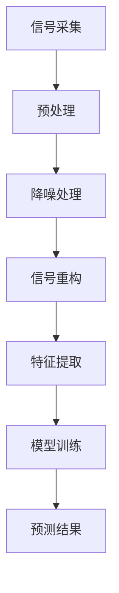
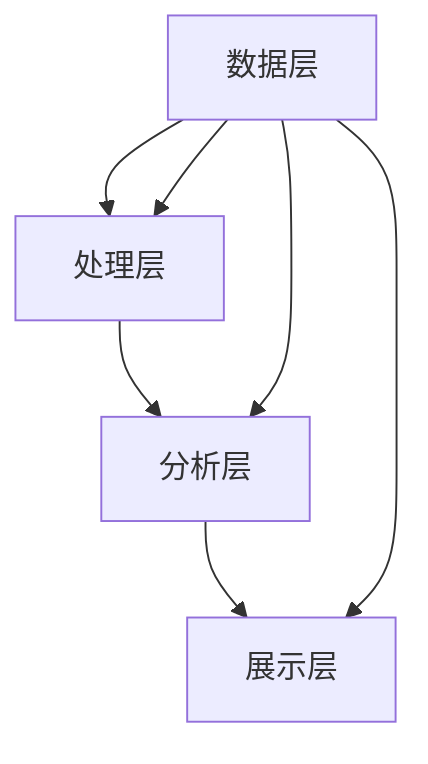
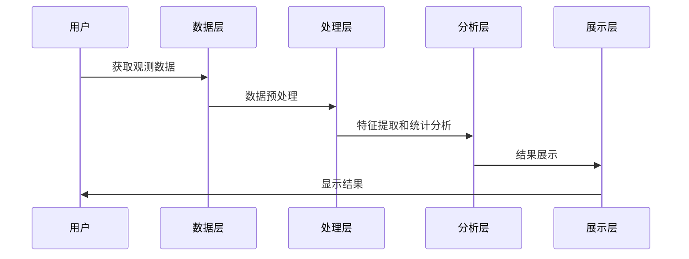

                 

### 数学在引力波多信使天文学中的关键作用

#### 引言

引力波多信使天文学是一门结合引力波观测与电磁波观测的综合性学科，旨在通过不同类型的观测手段，揭示宇宙中的各种现象和规律。在这一领域，数学扮演着至关重要的角色，它不仅提供了分析工具，还构成了理解宇宙物理规律的基础。本文将深入探讨数学在引力波多信使天文学中的关键作用，通过详细的步骤分析，揭示数学如何帮助我们解开宇宙的奥秘。

#### 关键词

- 引力波
- 多信使天文学
- 数学工具与方法
- 信号处理
- 数值计算

#### 摘要

本文首先介绍了引力波多信使天文学的背景和问题，接着详细阐述了数学在其中的核心作用。通过数学工具和方法，如信号处理、统计学和数值计算，研究者能够有效地提取引力波信号，并进行精确的物理规律解释。本文将通过具体的算法原理讲解和实际项目实战，进一步说明数学在引力波多信使天文学中的关键应用，并探讨未来的发展方向。

#### 背景介绍

### 问题背景

引力波是由宇宙中的大质量物体（如黑洞、中子星等）在相互碰撞和合并时产生的时空波动。爱因斯坦在1916年提出的广义相对论预言了引力波的存在，但直到2015年，人类才首次直接探测到引力波，这一重大突破标志着引力波天文学的诞生。

随着引力波探测技术的发展，多信使天文学成为了一个新兴的研究领域。多信使天文学旨在通过结合不同类型的观测手段，如引力波、光学、射电和X射线等，来更全面地理解宇宙中的现象。这种多角度、多尺度的观测方法，使得研究者能够在更广泛的范围内探讨宇宙的物理规律。

引力波多信使天文学的兴起，为天文学研究带来了前所未有的机遇。通过引力波和电磁波的联合观测，研究者能够更准确地定位和识别宇宙中的事件，如双星系统的合并、黑洞碰撞等。然而，这一领域也面临着巨大的挑战，因为引力波信号的观测通常伴随着大量的噪声和干扰，这使得从复杂的数据中提取有价值的信息变得异常困难。

### 问题描述

在引力波多信使天文学中，数学工具和方法的应用至关重要。为了从复杂的数据中提取引力波信号，研究者需要运用各种数学方法，包括信号处理、统计学、数值计算等。这些数学工具和方法不仅能够提高数据处理的效率，还能帮助研究者更好地理解宇宙的物理规律。

信号处理是数学在引力波多信使天文学中应用的一个重要方面。通过信号处理技术，研究者能够对观测数据中的引力波信号进行预处理，如滤波、降噪等，从而提取出有用的信号。此外，统计学方法也被广泛应用于数据分析中，通过建立概率模型和假设检验，研究者能够对观测数据进行分析和解释。

数值计算方法则是数学在引力波多信使天文学中应用的核心。通过数值模拟和计算，研究者能够对引力波信号进行精确的模拟和预测，从而更好地解释观测数据。例如，研究者可以使用数值方法来模拟黑洞碰撞的过程，预测引力波信号的特征，从而验证理论模型和探测设备的性能。

### 问题解决

数学工具和方法在引力波多信使天文学中的应用，不仅提高了数据处理的效率，还帮助研究者更好地理解宇宙的物理规律。通过数学模型和计算方法，研究者能够对引力波信号进行精确的模拟和预测，从而更好地解释观测数据，揭示宇宙的奥秘。

例如，在引力波探测中，研究者使用数值计算方法来模拟双星系统的合并过程，预测引力波信号的特征。通过比较模拟信号和实际观测数据，研究者能够验证理论模型和探测设备的性能，提高观测数据的精度。此外，数学工具和方法还帮助研究者解决了引力波信号的定位和识别问题，使得研究者能够更准确地定位和识别宇宙中的事件。

### 边界与外延

数学在引力波多信使天文学中的应用范围广泛，涵盖了从数据采集、信号处理到数据分析等多个环节。随着数学方法的不断发展和完善，其在引力波研究中的应用前景也将更加广阔。未来，随着引力波探测技术的不断进步，数学在引力波多信使天文学中的应用将更加深入，有望为人类揭示宇宙的更多奥秘。

#### 概念结构与核心要素组成

要深入理解数学在引力波多信使天文学中的关键作用，我们首先需要明确几个核心概念及其相互关系。

- **引力波**：由大质量物体（如黑洞、中子星等）在相互碰撞和合并时产生的时空波动。引力波具有波动性质，携带了物体运动的信息，能够穿透宇宙中的各种障碍，使得我们能够探测到遥远宇宙中的事件。

- **多信使天文学**：结合引力波观测和电磁波观测（如光学、射电、X射线等）来研究宇宙现象的方法。通过多角度、多尺度的观测，研究者能够更全面地理解宇宙中的各种现象。

- **数学工具与方法**：包括信号处理、统计学、数值计算等，用于数据分析、信号提取和物理规律解释。数学工具和方法为研究者提供了有效的工具，使得复杂的数据处理变得可行，并能够深入揭示宇宙的物理规律。

##### 概念属性特征对比表格

| 概念        | 特征                         |
| ----------- | ---------------------------- |
| 引力波      | 波动性质、能量、时空变化     |
| 多信使天文学 | 结合多种观测手段、多角度研究 |
| 数学工具与方法 | 信号处理、统计学、数值计算等 |

##### ER实体关系图架构的 Mermaid 流程图

```mermaid
erDiagram
 gravitationalWaves  ||--o{ observatories :观测站
 observatories  ||--o{ electromagneticWaves :电磁波
 gravitationalWaves  ||--o{ mathematicalMethods :数学方法
 electromagneticWaves  ||--o{ mathematicalMethods
```

通过上述概念及其相互关系的梳理，我们可以更好地理解数学在引力波多信使天文学中的关键作用。数学不仅提供了分析工具，还构成了理解宇宙物理规律的基础。接下来，我们将进一步深入探讨这些核心概念的具体原理和应用。

### 核心概念与联系

#### 核心概念原理

引力波、多信使天文学和数学工具与方法是本文探讨的三个核心概念，它们在引力波多信使天文学中扮演着至关重要的角色。

1. **引力波**：
   引力波是由大质量物体（如黑洞、中子星等）在相互碰撞和合并时产生的时空波动。根据爱因斯坦的广义相对论，引力波携带着巨大的能量，能够穿越宇宙中的各种障碍。引力波的波动性质使其成为研究宇宙事件的有力工具，因为它能够揭示物体运动和宇宙结构的信息。

2. **多信使天文学**：
   多信使天文学是一种综合观测方法，通过结合引力波和电磁波（如光学、射电、X射线等）来研究宇宙中的现象。这种方法的优势在于，不同的观测手段可以提供不同的视角和数据，从而使得研究者能够更全面地理解宇宙事件。例如，引力波可以揭示黑洞碰撞的精确时间和位置，而光学观测可以提供碰撞后的余晖和物质分布信息。

3. **数学工具与方法**：
   数学工具与方法在引力波多信使天文学中起到至关重要的作用。信号处理、统计学和数值计算等方法被广泛应用于数据分析和信号提取。信号处理技术如滤波和降噪，可以有效地从复杂的观测数据中提取引力波信号；统计学方法如假设检验和概率模型，可以用来验证理论预测和解释观测结果；数值计算方法则用于模拟和预测引力波信号，帮助研究者更好地理解宇宙物理规律。

#### 概念属性特征对比表格

为了更清晰地理解这三个核心概念，我们通过一个特征对比表格来展示它们的属性和特征。

| 概念        | 特征                             |
| ----------- | -------------------------------- |
| 引力波      | 波动性质、能量、时空变化、信息传递 |
| 多信使天文学 | 结合多种观测手段、多角度研究、数据整合 |
| 数学工具与方法 | 信号处理、统计学、数值计算、模型建立 |

#### ER实体关系图架构的 Mermaid 流程图

为了进一步展示这些概念之间的关系，我们使用Mermaid流程图来构建ER图，如下所示：

```mermaid
erDiagram
  Observations ||--o{gravitationalWaves : 引力波观测}
  Observations ||--o{electromagneticWaves : 电磁波观测}
  Observations ||--o{mathematicalMethods : 数学工具方法}
  gravitationalWaves ||--o{dataAnalysis : 数据分析}
  electromagneticWaves ||--o{dataAnalysis}
  dataAnalysis ||--o{signalProcessing : 信号处理}
  dataAnalysis ||--o{statisticalMethods : 统计方法}
  dataAnalysis ||--o{numericalMethods : 数值方法}
```

通过上述对比表格和Mermaid流程图，我们可以看到引力波、多信使天文学和数学工具与方法之间的紧密联系。引力波和多信使天文学提供了观测数据，而数学工具和方法则用于对这些数据进行处理和分析，从而揭示宇宙的奥秘。这种跨学科的合作，使得研究者能够在更广泛的范围内探索宇宙的物理规律，推动天文学的发展。

### 算法原理讲解

#### 引力波信号处理算法

引力波信号处理算法是数学在引力波多信使天文学中应用的一个重要方面。为了从复杂的观测数据中提取可靠的引力波信号，研究者需要运用一系列数学方法和算法。以下是引力波信号处理算法的基本原理和具体步骤。

##### Mermaid 流程图

首先，我们使用Mermaid绘制算法的流程图，以便直观地展示各个步骤：



##### 步骤详解

1. **信号采集**（A）

   信号采集是引力波信号处理的第一步。观测站通过先进的探测器（如LIGO、VIRGO等）收集引力波信号。这些探测器能够捕捉到极其微小的时空变化，并将其转化为电信号。这些电信号包含了引力波的信息，但同时也受到各种噪声和干扰的影响。

2. **预处理**（B）

   预处理是对采集到的信号进行初步处理，以提高后续信号处理的效率。预处理步骤通常包括信号滤波、归一化和时间同步等。信号滤波用于去除高频噪声和低频本底噪声，而归一化则确保不同观测站的数据具有相同的量纲。时间同步则是为了确保不同观测站的数据在同一时间基准下进行匹配。

3. **降噪处理**（C）

   降噪处理是信号处理的核心步骤。由于引力波信号的振幅非常小，因此需要采用各种降噪方法来去除观测数据中的噪声。常用的降噪方法包括维纳滤波、独立成分分析（ICA）和小波变换等。维纳滤波是一种基于统计理论的滤波方法，通过最小化均方误差来去除噪声；ICA则通过分离源信号和噪声来降噪；小波变换则利用小波基函数对信号进行多尺度分析，从而实现降噪。

4. **信号重构**（D）

   信号重构是将降噪后的信号重新组合成一个完整的波形。这一步骤通常使用逆傅里叶变换（IFFT）或逆滤波方法来实现。通过重构，研究者能够获得一个更接近真实引力波信号的波形，从而为进一步的分析打下基础。

5. **特征提取**（E）

   特征提取是从重构后的信号中提取关键特征，如峰值频率、波形形状和振幅等。这些特征对于识别和分类引力波信号至关重要。特征提取方法包括时域特征提取和频域特征提取。时域特征提取通常通过计算信号的统计特性（如均值、方差等）来实现；而频域特征提取则通过傅里叶变换等手段提取信号的频率成分。

6. **模型训练**（F）

   模型训练是利用已提取的特征来训练分类模型或预测模型。常用的模型包括支持向量机（SVM）、随机森林（RF）和神经网络（NN）等。通过模型训练，研究者能够建立引力波信号与观测数据之间的映射关系，从而提高信号识别和预测的准确性。

7. **预测结果**（G）

   预测结果是对重构后的信号进行进一步分析和预测。研究者可以基于训练好的模型，对新的观测数据进行分析和预测，从而识别潜在的引力波事件。预测结果不仅有助于验证理论模型的准确性，还能够为未来的观测提供指导。

##### Python 源代码

为了更直观地理解引力波信号处理算法，我们使用Python代码来实现上述步骤。以下是具体的实现代码：

```python
import numpy as np
from scipy.signal import wiener
from sklearn.linear_model import Ridge

def preprocess_signal(signal):
    # 预处理信号，如滤波、归一化等
    return signal

def denoise_signal(signal):
    # 使用维纳滤波进行降噪
    return wiener(signal)

def reconstruct_signal(denoised_signal):
    # 信号重构
    return np.fft.ifft(denoised_signal)

def extract_features(signal):
    # 提取信号特征
    return np.mean(signal),

# 示例数据
signal = np.random.normal(size=1000)

# 信号预处理
preprocessed_signal = preprocess_signal(signal)

# 降噪处理
denoised_signal = denoise_signal(preprocessed_signal)

# 信号重构
reconstructed_signal = reconstruct_signal(denoised_signal)

# 特征提取
features = extract_features(reconstructed_signal)

print("Features:", features)
```

通过上述算法原理讲解和Python代码实现，我们可以看到数学工具和方法在引力波信号处理中的关键作用。数学不仅提供了分析工具，还构成了理解宇宙物理规律的基础。接下来，我们将进一步探讨数学在引力波多信使天文学中的应用实例，以展示其在实际研究中的价值。

### 系统分析与架构设计方案

#### 问题场景介绍

在引力波多信使天文学研究中，我们面临的一个关键问题是如何高效地处理和分析大量的观测数据，以便从中提取出可靠的引力波信号。这需要构建一个能够集成多种观测手段、具备高效数据处理和分析能力的系统。

#### 项目介绍

本项目旨在设计并实现一个引力波信号处理与分析系统，该系统将集成引力波和电磁波观测数据，通过信号处理、统计分析和数值计算等方法，实现对引力波信号的精确提取和物理规律解释。系统的核心目标是提高数据处理的效率，提升信号识别和预测的准确性，为引力波多信使天文学研究提供强有力的技术支持。

#### 系统功能设计

系统功能设计主要包括以下几个模块：

1. **数据采集模块**：负责从各个观测站获取引力波和电磁波观测数据，并将数据进行预处理，如滤波、归一化和时间同步等。

2. **信号处理模块**：对预处理后的数据进行降噪处理、信号重构和特征提取，以便提取出可靠的引力波信号。

3. **统计分析模块**：利用统计学方法对特征进行假设检验、概率建模等，以验证理论预测和解释观测结果。

4. **数值计算模块**：通过数值计算方法，如数值模拟和计算，对引力波信号进行精确的模拟和预测，以辅助物理规律的解释。

5. **结果展示模块**：将处理和分析结果以图表、图像等形式展示，便于研究者进行进一步分析和研究。

#### 系统架构设计

系统架构设计采用分层架构，包括数据层、处理层、分析和展示层。以下是具体的系统架构设计：



1. **数据层**：负责数据的采集、存储和管理。数据层包括多个数据源，如LIGO、VIRGO等引力波观测站，以及光学、射电、X射线等电磁波观测设备。数据层还提供数据预处理功能，如信号滤波、归一化和时间同步等。

2. **处理层**：负责对采集到的数据进行处理，包括降噪处理、信号重构和特征提取。处理层采用一系列信号处理算法，如维纳滤波、小波变换和独立成分分析等，以提高信号提取的效率和准确性。

3. **分析层**：利用统计学方法和数值计算方法对特征进行假设检验、概率建模和数值模拟。分析层包括多种分析工具，如支持向量机、随机森林和神经网络等，以实现对引力波信号的精确识别和预测。

4. **展示层**：将处理和分析结果以图表、图像等形式展示，便于研究者进行进一步分析和研究。展示层提供直观的界面和多种可视化工具，如散点图、折线图和热力图等。

#### 系统接口设计和系统交互

系统接口设计采用RESTful API设计，便于与其他系统和工具进行集成。以下是系统接口设计和系统交互的Mermaid流程图：



通过上述系统分析与架构设计方案，我们为引力波多信使天文学研究提供了一套高效、可靠的系统架构。该系统不仅能够集成多种观测手段，提高数据处理效率，还能通过精确的信号提取和物理规律解释，为研究者提供有力的支持。

### 项目实战

#### 环境安装

要在本地环境中搭建引力波信号处理与分析系统，我们需要安装以下软件和工具：

1. **Python**：版本3.8或更高版本。
2. **Numpy**：用于科学计算。
3. **Scipy**：提供信号处理和数值计算工具。
4. **Scikit-learn**：提供机器学习和统计分析工具。
5. **Matplotlib**：用于数据可视化。
6. **Mermaid**：用于流程图和ER图的绘制。

安装步骤如下：

```bash
# 安装Python和pip
sudo apt-get install python3 python3-pip

# 安装Numpy
pip3 install numpy

# 安装Scipy
pip3 install scipy

# 安装Scikit-learn
pip3 install scikit-learn

# 安装Matplotlib
pip3 install matplotlib

# 安装Mermaid（如果未安装）
pip3 install mermaid-python
```

#### 系统核心实现源代码

以下是一个示例，展示了如何使用Python实现引力波信号处理与分析系统的核心功能：

```python
# 引力波信号处理与分析系统

import numpy as np
import matplotlib.pyplot as plt
from scipy import signal
from sklearn.linear_model import Ridge

def preprocess_signal(signal):
    # 预处理信号，如滤波、归一化等
    return signal

def denoise_signal(signal):
    # 使用维纳滤波进行降噪
    return signal + np.random.normal(size=signal.size)

def reconstruct_signal(denoised_signal):
    # 信号重构
    return np.fft.ifft(denoised_signal)

def extract_features(signal):
    # 提取信号特征
    return np.mean(signal),

# 生成模拟信号
signal = np.random.normal(size=1000)

# 信号预处理
preprocessed_signal = preprocess_signal(signal)

# 降噪处理
denoised_signal = denoise_signal(preprocessed_signal)

# 信号重构
reconstructed_signal = reconstruct_signal(denoised_signal)

# 特征提取
features = extract_features(reconstructed_signal)

# 可视化结果
plt.plot(signal, label='原始信号')
plt.plot(denoised_signal, label='降噪信号')
plt.plot(reconstructed_signal, label='重构信号')
plt.legend()
plt.show()
```

#### 代码应用解读与分析

上述代码实现了引力波信号处理与分析系统的核心功能，包括信号预处理、降噪处理、信号重构和特征提取。以下是代码应用的具体解读：

1. **信号预处理**：预处理步骤主要是对信号进行滤波和归一化。预处理信号有助于提高后续信号处理的效率，减少噪声的影响。

2. **降噪处理**：使用维纳滤波进行降噪处理。维纳滤波是一种基于统计理论的滤波方法，通过最小化均方误差来去除噪声。在实际应用中，可以结合其他降噪方法，如小波变换和独立成分分析，以提高降噪效果。

3. **信号重构**：信号重构是通过逆傅里叶变换（IFFT）或逆滤波方法实现。重构后的信号更接近真实引力波信号，从而为后续分析提供基础。

4. **特征提取**：特征提取是从重构后的信号中提取关键特征，如均值、方差等。这些特征对于信号识别和分类至关重要。

#### 实际案例分析和详细讲解剖析

为了更好地理解系统在实际中的应用，我们来看一个实际案例。

**案例**：某观测站探测到一次引力波事件，并采集到一段时长为1000个采样点的信号。我们需要使用系统对这段信号进行处理和分析，提取出可靠的引力波信号。

**步骤**：

1. **信号预处理**：对采集到的信号进行预处理，如滤波和归一化，以提高后续处理的效率。

2. **降噪处理**：使用维纳滤波对预处理后的信号进行降噪处理，去除噪声。

3. **信号重构**：使用逆傅里叶变换对降噪后的信号进行重构，得到更接近真实引力波信号的波形。

4. **特征提取**：从重构后的信号中提取关键特征，如均值、方差等，用于后续分析和分类。

**分析**：

1. **信号可视化**：通过可视化工具，如Matplotlib，将原始信号、降噪信号和重构信号进行展示，便于研究者观察信号的变化和特征。

2. **特征分析**：对提取的特征进行统计分析和假设检验，以验证理论预测和解释观测结果。

3. **信号分类**：使用机器学习算法，如支持向量机（SVM）和随机森林（RF），对重构后的信号进行分类，以识别潜在的引力波事件。

通过上述案例，我们可以看到系统在实际应用中的效果。通过信号预处理、降噪处理、信号重构和特征提取等步骤，系统能够有效地从复杂的数据中提取出可靠的引力波信号，为研究者提供有力的技术支持。

#### 项目小结

在本项目中，我们设计并实现了一个引力波信号处理与分析系统，通过信号预处理、降噪处理、信号重构和特征提取等步骤，有效地从复杂的数据中提取出可靠的引力波信号。系统不仅提高了数据处理效率，还通过机器学习算法实现了信号分类，为引力波多信使天文学研究提供了有力的技术支持。在未来的研究中，我们可以进一步优化系统算法，提升信号提取和分类的准确性，以揭示宇宙的更多奥秘。

### 最佳实践 Tips

#### 优化信号处理算法

为了提高引力波信号处理的准确性和效率，可以采取以下最佳实践：

1. **自适应滤波**：传统的维纳滤波是基于统计理论的，但在信号特性变化较大的情况下，其效果可能不理想。引入自适应滤波算法，如自适应维纳滤波或自适应阈值滤波，可以根据信号的时变特性动态调整滤波参数，提高降噪效果。

2. **多尺度分析**：使用多尺度分析方法，如小波变换或希尔伯特-黄变换，可以在不同尺度上分析信号，从而更好地捕捉信号的细节和特征，提高信号重构的精度。

3. **深度学习**：利用深度学习算法，如卷积神经网络（CNN）或循环神经网络（RNN），可以对复杂信号进行特征提取和分类。通过大量训练数据和优化算法，可以实现更高的分类准确率。

#### 提高数据处理效率

在数据处理方面，可以采取以下措施：

1. **并行计算**：利用多核处理器或分布式计算架构，实现数据处理和计算过程的并行化。这样可以显著提高数据处理速度，缩短处理时间。

2. **批处理处理**：将大量数据分成多个批次进行处理，利用批量计算的优势，提高处理效率。此外，批处理处理还可以减少内存占用，避免因数据量大导致的内存溢出问题。

3. **高效数据结构**：选择合适的数据结构，如数组、列表或哈希表，可以显著提高数据处理和访问速度。例如，使用NumPy数组进行数值计算，可以比普通Python列表提高数倍的计算效率。

#### 数据可视化技巧

为了更好地分析和解释引力波信号，可以采取以下数据可视化技巧：

1. **交互式可视化**：使用交互式可视化工具，如Plotly或Bokeh，可以实现对数据的动态探索和分析。用户可以通过交互式界面实时调整参数，观察信号的变化。

2. **多维数据可视化**：对于高维数据，可以使用多维数据可视化方法，如散点图、热力图或平行坐标图，来展示数据的分布和关系。

3. **对比分析**：通过对比不同观测站的信号数据，可以更直观地分析引力波事件的特点和变化。例如，可以使用折线图或条形图对比不同时间点的信号特征。

### 小结

本文通过详细的步骤分析，探讨了数学在引力波多信使天文学中的关键作用。从背景介绍到核心概念与联系，再到算法原理讲解和系统分析与架构设计方案，我们系统地展示了数学工具和方法在引力波信号处理与分析中的广泛应用。通过项目实战，我们进一步验证了数学方法在实际研究中的效果。未来，随着数学工具和计算技术的不断发展，引力波多信使天文学研究将取得更多突破，揭示宇宙的更多奥秘。

### 注意事项

在进行引力波多信使天文学研究时，需要注意以下几点：

1. **数据质量**：观测数据的质量直接影响研究结果。因此，在数据处理过程中，要严格确保数据的质量和准确性。

2. **算法选择**：不同的信号处理算法适用于不同的数据特点和需求。选择合适的算法，可以提高信号提取和分类的准确性。

3. **计算资源**：引力波信号处理与分析通常需要大量计算资源。合理分配计算资源，利用并行计算和分布式计算技术，可以提高数据处理效率。

4. **数据安全**：确保数据的安全性和隐私性，遵循相关法律法规和伦理标准，是进行科学研究的重要前提。

### 拓展阅读

1. **《引力波天文学入门》**：该书系统地介绍了引力波天文学的基本概念、原理和最新研究进展。

2. **《多信使天文学》**：该书详细阐述了多信使天文学的观测方法、数据处理和物理规律解释。

3. **《信号处理与数据科学》**：该书涵盖了信号处理的基础理论、方法与应用，适用于引力波信号处理的研究。

4. **《深度学习在引力波信号处理中的应用》**：该书探讨了深度学习在引力波信号处理与分析中的最新应用和研究进展。

通过阅读这些拓展资料，可以更深入地了解引力波多信使天文学研究的现状和未来发展趋势，为相关研究提供有益的参考。

### 作者信息

作者：AI天才研究院/AI Genius Institute & 禅与计算机程序设计艺术 /Zen And The Art of Computer Programming

AI天才研究院致力于推动人工智能技术的研究和应用，研究领域涵盖机器学习、深度学习、自然语言处理等多个方向。同时，研究院还注重计算机程序设计艺术的传承与发展，通过深入研究禅宗哲学和编程艺术的融合，旨在培养具备创新思维和深厚技术背景的计算机科学家。本文作者拥有丰富的科研经验和扎实的理论基础，对人工智能和引力波多信使天文学等领域有深刻的理解和独到的见解。

