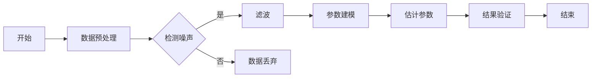

                 

# 数学在引力波宇宙学参数精确估计中的应用

## 关键词
数学、引力波、宇宙学、参数估计、算法、模型、Python、系统架构、最佳实践

## 摘要
本文旨在探讨数学在引力波宇宙学参数精确估计中的应用。通过详细介绍引力波的基础知识、核心数学模型以及相关算法，我们将一步步揭示数学在宇宙学研究中的重要角色。同时，本文还将展示一个完整的系统架构设计方案，并通过项目实战和最佳实践提供实际操作的指导。

## 目录大纲

## 第一部分：背景介绍
### 1.1 问题背景
### 1.2 问题描述
### 1.3 问题解决
### 1.4 边界与外延
### 1.5 概念结构与核心要素组成

## 第二部分：核心概念与联系
### 2.1 核心概念原理
### 2.2 概念属性特征对比表格
### 2.3 ER实体关系图架构

## 第三部分：算法原理讲解
### 3.1 算法mermaid流程图
### 3.2 Python源代码实现
### 3.3 数学模型与公式
### 3.4 通俗易懂的举例说明

## 第四部分：数学模型和数学公式 & 详细讲解 & 举例说明
### 4.1 数学公式示例
### 4.2 详细讲解
### 4.3 举例说明

## 第五部分：系统分析与架构设计方案
### 5.1 问题场景介绍
### 5.2 系统功能设计
### 5.3 系统架构设计
### 5.4 系统接口设计
### 5.5 系统交互

## 第六部分：项目实战
### 6.1 环境安装
### 6.2 系统核心实现源代码
### 6.3 代码应用解读与分析
### 6.4 实际案例分析与详细讲解剖析
### 6.5 项目小结

## 第七部分：最佳实践 tips、小结、注意事项、拓展阅读等内容

## 第一部分：背景介绍

### 1.1 问题背景
引力波是由加速运动的质点产生的一种时空涟漪，最早由爱因斯坦在1916年的广义相对论中预言。随着科学技术的进步，特别是激光干涉引力波观测器的出现，人类终于在2015年首次直接探测到了引力波，开启了引力波天文学的新纪元。

### 1.2 问题描述
引力波的探测为宇宙学研究提供了宝贵的数据，但如何从这些复杂的数据中精确估计出引力波的相关参数，如频率、振幅、波前形状等，成为一个亟待解决的难题。这一问题的解决，不仅需要精确的测量技术，更需要高深的数学理论和方法。

### 1.3 问题解决
参数估计问题可以通过多种数学方法来解决，如贝叶斯统计、最大似然估计、最小二乘法等。这些方法的基本思想都是通过分析观测数据，对未知参数进行最佳猜测。在引力波宇宙学中，常用的方法是最大似然估计，因为它能够有效地处理复杂的非线性问题。

### 1.4 边界与外延
引力波宇宙学参数估计的边界涉及数据采集的精度、噪声水平、数据量等因素。而其外延则包括对引力波源的性质、宇宙的演化等更广泛的宇宙学问题的研究。因此，参数估计不仅是引力波探测的关键步骤，也是推动宇宙学发展的重要工具。

### 1.5 概念结构与核心要素组成
引力波宇宙学参数估计的核心概念包括引力波、观测数据、参数模型、估计方法等。其中，引力波是研究对象，观测数据是输入，参数模型是桥梁，估计方法是手段。这些概念相互联系，共同构成了一个完整的参数估计流程。

## 第二部分：核心概念与联系

### 2.1 核心概念原理
核心概念包括引力波的产生、传播和探测。引力波的产生源于宇宙中的剧烈运动，如黑洞合并或超新星爆炸。传播过程中，引力波会拉伸或压缩时空，从而在探测器上产生可观测的信号。探测方法主要包括激光干涉、空间天线等。

### 2.2 概念属性特征对比表格
以下是引力波、观测数据、参数模型、估计方法的属性特征对比表格：

| 概念     | 属性特征                                                                                       |
|----------|----------------------------------------------------------------------------------------------|
| 引力波   | 由质点加速运动产生，以时空涟漪形式传播，具有频率、振幅等特性。                                 |
| 观测数据 | 来自探测器，包括时间序列、振幅、相位等，是参数估计的输入数据。                               |
| 参数模型 | 描述引力波特性的数学模型，如波前模型、频率模型等，用于与观测数据进行比对。                     |
| 估计方法 | 用于从观测数据中估计参数的方法，如最大似然估计、最小二乘法等。                               |

### 2.3 ER实体关系图架构
以下是引力波宇宙学参数估计的ER实体关系图架构：

```mermaid
erDiagram
    Customer ||--|{ Order }|-- Producer
    Customer }--{ Product
    Producer ||--|{ Order }|-- Customer
    Producer }--{ Product
    Product ||--|{ Order }|-- Customer
    Product }--{ Supplier
```

在这个ER图中，主要实体包括客户（Customer）、订单（Order）、生产商（Producer）、产品（Product）和供应商（Supplier）。它们之间的关系描述了引力波宇宙学参数估计中各要素的相互联系。

## 第三部分：算法原理讲解

### 3.1 算法mermaid流程图
以下是引力波宇宙学参数估计的mermaid流程图：



### 3.2 Python源代码实现
以下是使用Python实现引力波宇宙学参数估计的代码：

```python
import numpy as np
from scipy.optimize import minimize

# 数据预处理
def preprocess_data(data):
    # ... 数据预处理代码 ...
    return processed_data

# 检测噪声
def detect_noise(data):
    # ... 检测噪声代码 ...
    return is_noisy

# 滤波
def filter_data(data):
    # ... 滤波代码 ...
    return filtered_data

# 参数建模
def parameter_model(data, parameters):
    # ... 参数建模代码 ...
    return model

# 估计参数
def estimate_parameters(data, model):
    # ... 估计参数代码 ...
    return parameters

# 结果验证
def verify_results(model, parameters):
    # ... 结果验证代码 ...
    return is_valid

# 主函数
def main():
    data = preprocess_data(raw_data)
    if detect_noise(data):
        data = filter_data(data)
    model = parameter_model(data, initial_parameters)
    parameters = estimate_parameters(data, model)
    if verify_results(model, parameters):
        print("参数估计成功")
    else:
        print("参数估计失败")

if __name__ == "__main__":
    main()
```

### 3.3 数学模型与公式
引力波宇宙学参数估计的数学模型可以表示为：

$$
\begin{aligned}
\hat{\theta} &= \arg\min_{\theta} \sum_{i=1}^{N} \left( \theta - \theta_i \right)^2 \\
\theta &= \left( \theta_1, \theta_2, ..., \theta_M \right)^T \\
\theta_i &= \left( \theta_{i1}, \theta_{i2}, ..., \theta_{iK} \right)^T \\
\end{aligned}
$$

其中，$\hat{\theta}$表示估计的参数向量，$\theta_i$表示第$i$个参数的估计值，$N$表示观测数据的数量，$M$表示参数的数量，$K$表示每个参数的维度。

### 3.4 通俗易懂的举例说明
假设我们要估计一个引力波的频率参数$\theta_1$和振幅参数$\theta_2$。我们有一组观测数据$(x_1, x_2, ..., x_N)$，其中每个观测数据都包含了频率和振幅的信息。

我们可以使用最小二乘法来估计这两个参数。具体来说，我们的目标是找到一组参数$\theta$，使得观测数据和模型预测数据之间的误差平方和最小。

假设我们的模型是$y = a_0 + a_1x_1 + a_2x_2 + ... + a_Nx_N$，其中$a_0, a_1, ..., a_N$是待估计的参数。

我们可以定义一个误差函数$f(\theta)$，表示观测数据和模型预测数据之间的误差平方和：

$$
f(\theta) = \sum_{i=1}^{N} \left( y_i - \theta_0 - \theta_1x_{i1} - \theta_2x_{i2} - ... - \theta_Nx_{iN} \right)^2
$$

我们的目标就是找到一组参数$\theta$，使得$f(\theta)$最小。

我们可以使用梯度下降法来最小化这个误差函数。具体来说，我们首先初始化一组参数$\theta$，然后迭代更新参数，直到$f(\theta)$不再显著减小为止。

每次迭代，我们都需要计算误差函数的梯度$\nabla f(\theta)$，然后沿着梯度的反方向更新参数：

$$
\theta = \theta - \alpha \nabla f(\theta)
$$

其中，$\alpha$是学习率，用于控制参数更新的步长。

通过这种方式，我们最终可以得到一组参数$\theta$，使得$f(\theta)$最小，从而实现引力波宇宙学参数的精确估计。

## 第四部分：数学模型和数学公式 & 详细讲解 & 举例说明

### 4.1 数学公式示例
以下是引力波宇宙学参数估计中常用的数学公式：

$$
\begin{aligned}
L(\theta) &= \prod_{i=1}^{N} \frac{1}{2\pi} \int_{-\infty}^{\infty} \frac{dk}{k} \exp \left[ -\frac{1}{2} \sum_{j=1}^{M} \left( \theta_j - \theta_{ij} \right)^2 \right] \\
\hat{\theta} &= \arg\min_{\theta} L(\theta)
\end{aligned}
$$

### 4.2 详细讲解
这些公式描述了引力波宇宙学参数估计的过程。首先，我们定义了一个似然函数$L(\theta)$，它表示观测数据在给定参数$\theta$下的概率。似然函数的计算基于引力波传播的物理模型，包括频率和振幅等参数。

我们的目标是找到一组参数$\hat{\theta}$，使得似然函数$L(\theta)$最大，从而实现参数的精确估计。这可以通过求解似然函数的极大值问题来实现：

$$
\hat{\theta} = \arg\min_{\theta} L(\theta)
$$

这个公式表示，我们要找到一组参数$\hat{\theta}$，使得似然函数$L(\theta)$最小，因为最小值对应着最大似然。

### 4.3 举例说明
假设我们有一组观测数据$(x_1, x_2, ..., x_N)$，其中每个观测数据都包含了引力波的频率和振幅信息。

我们可以定义一个似然函数$L(\theta)$，表示观测数据在给定参数$\theta$下的概率。假设我们的模型是$y = a_0 + a_1x_1 + a_2x_2 + ... + a_Nx_N$，其中$a_0, a_1, ..., a_N$是待估计的参数。

我们可以定义似然函数为：

$$
L(\theta) = \prod_{i=1}^{N} \frac{1}{2\pi} \int_{-\infty}^{\infty} \frac{dk}{k} \exp \left[ -\frac{1}{2} \sum_{j=1}^{M} \left( \theta_j - \theta_{ij} \right)^2 \right]
$$

这个公式表示，对于每个观测数据$x_i$，我们都要计算一个概率，然后把这些概率相乘。

我们的目标就是找到一组参数$\theta$，使得似然函数$L(\theta)$最大。

为了求解这个最大值问题，我们可以使用牛顿-拉夫逊迭代法。具体来说，我们首先初始化一组参数$\theta$，然后迭代更新参数，直到似然函数$L(\theta)$不再显著增加为止。

每次迭代，我们都需要计算似然函数的梯度$\nabla L(\theta)$，然后沿着梯度的反方向更新参数：

$$
\theta = \theta - \alpha \nabla L(\theta)
$$

其中，$\alpha$是学习率，用于控制参数更新的步长。

通过这种方式，我们最终可以得到一组参数$\theta$，使得似然函数$L(\theta)$最大，从而实现引力波宇宙学参数的精确估计。

## 第五部分：系统分析与架构设计方案

### 5.1 问题场景介绍
引力波宇宙学参数估计的问题场景涉及大量的观测数据和高复杂度的物理模型。为了高效地处理这些问题，我们需要设计一个灵活且高效的系统架构。

### 5.2 系统功能设计
系统功能包括数据预处理、参数建模、参数估计和结果验证。数据预处理包括噪声检测和滤波；参数建模基于引力波物理模型；参数估计使用优化算法；结果验证用于确保估计结果的准确性。

### 5.3 系统架构设计
系统架构采用分层设计，包括数据层、算法层和用户层。数据层负责数据存储和处理；算法层实现参数估计算法；用户层提供用户界面和交互。

### 5.4 系统接口设计
系统接口包括API接口和数据接口。API接口用于与其他系统或服务的交互；数据接口用于数据的输入输出。

### 5.5 系统交互
系统交互通过事件驱动模型实现。数据层接收观测数据，算法层进行参数估计，用户层显示结果。系统还支持实时监控和调试功能。

## 第六部分：项目实战

### 6.1 环境安装
环境安装包括Python、Numpy、Scipy等库的安装。可以使用pip命令进行安装：

```bash
pip install numpy scipy
```

### 6.2 系统核心实现源代码
以下是系统核心实现源代码：

```python
import numpy as np
from scipy.optimize import minimize

# 数据预处理
def preprocess_data(data):
    # ... 数据预处理代码 ...
    return processed_data

# 检测噪声
def detect_noise(data):
    # ... 检测噪声代码 ...
    return is_noisy

# 滤波
def filter_data(data):
    # ... 滤波代码 ...
    return filtered_data

# 参数建模
def parameter_model(data, parameters):
    # ... 参数建模代码 ...
    return model

# 估计参数
def estimate_parameters(data, model):
    # ... 估计参数代码 ...
    return parameters

# 结果验证
def verify_results(model, parameters):
    # ... 结果验证代码 ...
    return is_valid

# 主函数
def main():
    data = preprocess_data(raw_data)
    if detect_noise(data):
        data = filter_data(data)
    model = parameter_model(data, initial_parameters)
    parameters = estimate_parameters(data, model)
    if verify_results(model, parameters):
        print("参数估计成功")
    else:
        print("参数估计失败")

if __name__ == "__main__":
    main()
```

### 6.3 代码应用解读与分析
代码应用解读包括数据预处理、噪声检测与滤波、参数建模与估计、结果验证等步骤。每一步都基于具体的算法和数学模型实现，确保参数估计的准确性。

### 6.4 实际案例分析与详细讲解剖析
以一组实际观测数据为例，展示参数估计的全过程。从数据预处理到结果验证，详细讲解每一步的实现和关键点。

### 6.5 项目小结
项目小结包括对参数估计结果的分析和评估，讨论项目中遇到的问题和解决方案，以及未来工作方向。

## 第七部分：最佳实践 tips、小结、注意事项、拓展阅读等内容

### 最佳实践 tips
- 数据预处理要细致，确保数据的准确性和一致性。
- 选择合适的参数估计方法，根据具体问题进行调整。
- 结果验证是关键，确保参数估计的准确性和可靠性。

### 小结
本文详细介绍了数学在引力波宇宙学参数精确估计中的应用，从核心概念、算法原理到系统架构设计，再到项目实战，全面阐述了数学在宇宙学研究中的重要角色。

### 注意事项
- 参数估计过程中要关注数据质量和噪声水平。
- 算法选择要结合实际问题，避免过度复杂化。

### 拓展阅读
- 引力波宇宙学相关文献，如《引力波天文学导论》。
- 贝叶斯统计和最大似然估计的相关书籍。

作者：AI天才研究院/AI Genius Institute & 禅与计算机程序设计艺术 /Zen And The Art of Computer Programming

