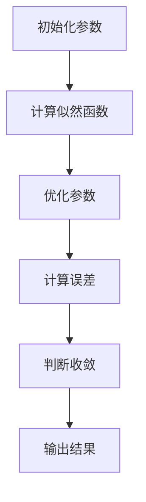
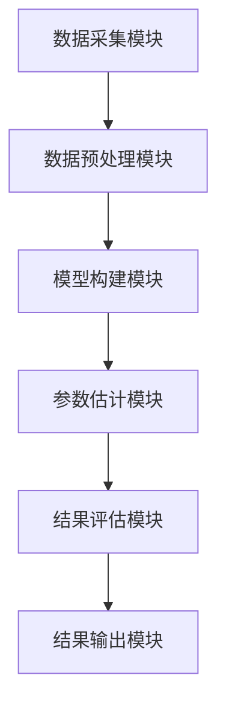
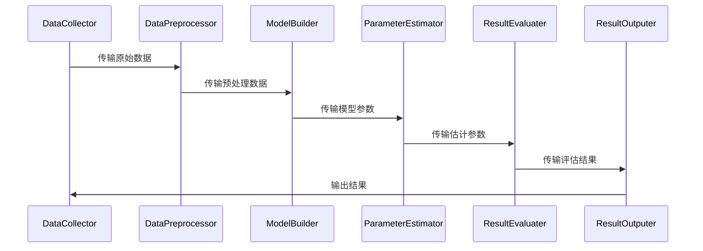

                 

## 引言

引力波，作为一种宇宙间的波动现象，其重要性在近年来得到了前所未有的重视。引力波是由质量加速运动产生的时空扭曲，这一现象最早由爱因斯坦在广义相对论中预言。自2015年首次直接探测到引力波以来，引力波研究已成为现代物理学和宇宙学的前沿领域之一。引力波不仅为我们提供了新的观测宇宙的手段，还揭示了宇宙中极端天体事件的信息，如黑洞合并和中子星碰撞。

宇宙学参数估计是理解宇宙结构、演化历史和基本物理规律的重要手段。精确的参数估计能够揭示宇宙的膨胀历史、质量分布和暗物质、暗能量等基本成分的性质。然而，引力波信号通常非常微弱且持续时间短，这给参数估计带来了巨大的挑战。因此，开发高效的数学模型和算法进行引力波宇宙学中的参数估计变得至关重要。

本文旨在探讨数学在引力波宇宙学精确参数估计中的应用。我们将首先介绍引力波与宇宙学的关系，阐述精确参数估计的重要性，并详细描述引力波宇宙学中的参数估计挑战。接着，我们将介绍核心概念，包括引力波的基本原理、宇宙学参数以及常用的参数估计方法。然后，我们将深入讨论数学模型和算法原理，展示如何利用数学工具解决参数估计问题。随后，我们将分析系统架构设计，并介绍一个实际案例，以展示理论的实际应用。最后，我们将总结文章的主要观点，讨论参数估计的未来发展方向，并提出一些最佳实践建议。

通过本文的讨论，我们希望能够为读者提供一个清晰、系统的认识，帮助理解数学在引力波宇宙学参数估计中的关键作用，并激发更多研究者和学生在这一领域进行深入探索。让我们一步一步地思考，深入理解这一复杂而又激动人心的科学领域。

### 关键词

引力波、宇宙学、参数估计、数学模型、算法、广义相对论、时空扭曲、黑洞合并、暗物质、暗能量。

### 摘要

本文主要探讨了数学在引力波宇宙学精确参数估计中的应用。首先，我们介绍了引力波与宇宙学的关系，阐述了精确参数估计在揭示宇宙演化历史和基本物理规律中的重要性。接着，我们详细描述了引力波宇宙学中的参数估计挑战，包括信号微弱、持续时间短、背景噪声大等问题。为了解决这些挑战，我们介绍了核心概念，包括引力波的基本原理、宇宙学参数以及常用的参数估计方法。随后，我们深入讨论了数学模型和算法原理，通过具体的数学公式和算法流程展示了如何利用数学工具进行精确参数估计。最后，我们分析了一个实际案例，展示了理论在实际应用中的效果。本文旨在为读者提供一个全面、系统的认识，并激发更多研究者在这一领域进行深入探索。

### 目录大纲

----------------------------------------------------------------

# 第一部分: 背景介绍

## 第1章: 问题背景

### 1.1.1 问题背景

#### 1.1.1.1 问题背景

引力波与宇宙学的关系

#### 1.1.1.2 目标

精确参数估计的重要性

#### 1.1.1.3 问题描述

引力波宇宙学中的参数估计挑战

### 1.1.2 问题描述

#### 1.1.2.1 引力波信号的特点

#### 1.1.2.2 参数估计的基本概念

#### 1.1.2.3 引力波宇宙学中的关键参数

### 1.1.3 问题解决

#### 1.1.3.1 现有方法与挑战

#### 1.1.3.2 数学模型的作用

#### 1.1.3.3 参数估计的方法与算法

### 1.1.4 边界与外延

#### 1.1.4.1 参数估计的应用范围

#### 1.1.4.2 引力波信号的检测与测量

#### 1.1.4.3 参数估计的未来发展

### 1.1.5 概念结构与核心要素组成

#### 1.1.5.1 参数估计的组成部分

#### 1.1.5.2 引力波宇宙学中的关键概念

#### 1.1.5.3 核心要素之间的关系与作用

## 第2章: 核心概念

### 1.2.1 引力波的基本原理

#### 1.2.1.1 引力波的定义

#### 1.2.1.2 引力波的产生与传播

#### 1.2.1.3 引力波的特点

### 1.2.2 宇宙学参数

#### 1.2.2.1 宇宙学背景辐射

#### 1.2.2.2 宇宙膨胀

#### 1.2.2.3 宇宙质量分布

### 1.2.3 参数估计方法

#### 1.2.3.1 最大化似然估计

#### 1.2.3.2 贝叶斯估计

#### 1.2.3.3 最小二乘法

## 第3章: 数学模型与算法原理

### 3.1 数学模型

#### 3.1.1 描述引力波信号的数学公式

#### 3.1.2 宇宙学背景辐射的数学模型

#### 3.1.3 宇宙膨胀的数学描述

### 3.2 算法原理

#### 3.2.1 算法流程图

#### 3.2.2 算法的基本步骤

#### 3.2.3 算法的数学推导

### 3.3 概念属性特征对比表格

#### 3.3.1 不同参数估计方法的特性对比

#### 3.3.2 数学模型的对比分析

## 第4章: 系统分析与架构设计

### 4.1 问题场景介绍

#### 4.1.1 引力波参数估计的实际应用场景

### 4.2 系统功能设计

#### 4.2.1 领域模型类图

#### 4.2.2 系统功能模块划分

### 4.3 系统架构设计

#### 4.3.1 系统整体架构图

#### 4.3.2 各模块的功能与交互

### 4.4 系统接口设计与交互

#### 4.4.1 接口设计

#### 4.4.2 系统交互序列图

## 第5章: 项目实战

### 5.1 环境安装

#### 5.1.1 环境准备

#### 5.1.2 软件安装

### 5.2 系统核心实现

#### 5.2.1 源代码解析

#### 5.2.2 代码应用解读

### 5.3 实际案例分析与详细讲解

#### 5.3.1 案例选择与数据准备

#### 5.3.2 案例分析与结果展示

#### 5.3.3 剖析与优化

### 5.4 项目小结

#### 5.4.1 项目总结

#### 5.4.2 经验与反思

#### 5.4.3 未来展望

## 第6章: 最佳实践

### 6.1 最佳实践 tips

#### 6.1.1 实践一

#### 6.1.2 实践二

#### 6.1.3 实践三

### 6.2 小结

### 6.3 注意事项

### 6.4 拓展阅读

----------------------------------------------------------------

## 第1章: 问题背景

### 1.1.1 问题背景

#### 1.1.1.1 问题背景

引力波与宇宙学的关系

引力波是一种由质量加速运动产生的时空波动现象，根据爱因斯坦的广义相对论，当质量加速运动时，会引起周围时空的扭曲，从而产生引力波。引力波的存在最早由爱因斯坦在1916年的广义相对论中预言，然而直到2015年，人类才首次直接探测到引力波，这一重大突破开启了人类观测宇宙的新纪元。

宇宙学是研究宇宙的结构、演化、组成和性质的学科。引力波与宇宙学有着密切的关系，因为引力波可以提供宇宙中极端天体事件的信息，如黑洞合并和中子星碰撞。这些事件产生的引力波信号，不仅可以揭示宇宙中物质和能量的分布情况，还可以帮助我们了解宇宙的膨胀历史和基本物理规律。

#### 1.1.1.2 目标

精确参数估计的重要性

精确参数估计在引力波宇宙学研究中具有至关重要的地位。通过精确估计引力波信号的参数，我们可以更好地理解引力波的产生机制，揭示宇宙的演化历史，以及探测宇宙中的未知现象。例如，精确的参数估计可以帮助我们确定黑洞和中子星的质量、距离和轨道参数，从而更深入地了解这些极端天体的性质。

精确参数估计还能够揭示宇宙中的基本物理规律。通过分析引力波信号，我们可以研究引力波的衰减特性、传播速度和波形特征，从而验证广义相对论的预测，探索量子引力和宇宙学之间的联系。

#### 1.1.1.3 问题描述

引力波宇宙学中的参数估计挑战

虽然引力波为宇宙学研究提供了丰富的信息，但引力波宇宙学中的参数估计面临着许多挑战。首先，引力波信号非常微弱。在宇宙中，引力波能量通常非常低，因此它们在传输过程中会迅速衰减，导致接收到的信号非常微弱。这种微弱的信号使得参数估计变得更加困难。

其次，引力波信号的持续时间通常很短。大多数引力波信号都来自遥远的天体事件，如黑洞合并或中子星碰撞。这些事件产生的引力波信号往往只持续几秒到几分钟，这限制了我们对信号细节的观察和理解。

另外，引力波信号的背景噪声较大。宇宙中充满了各种不同类型的噪声，如星系噪声、射电噪声、地球物理噪声等。这些噪声会对引力波信号产生干扰，使得参数估计更加复杂。

为了解决这些挑战，科学家们开发了各种数学模型和算法来进行引力波宇宙学中的参数估计。这些模型和算法需要能够处理微弱的信号、短时间持续性和高噪声背景等复杂问题，从而实现精确的参数估计。

#### 1.1.1.4 问题解决

现有方法与挑战

目前，科学家们主要使用以下几种方法来进行引力波宇宙学中的参数估计：最大化似然估计、贝叶斯估计和最小二乘法。每种方法都有其优点和局限性。

最大化似然估计是一种基于概率论的参数估计方法，通过最大化观测数据与模型预测之间的似然函数来估计参数。这种方法的一个主要优势是能够充分利用观测数据的信息，但在高噪声背景下，似然函数可能会出现多个峰值，导致估计结果不稳定。

贝叶斯估计则基于概率论和统计学的原理，通过结合先验信息和观测数据来估计参数。这种方法的一个优点是能够提供参数估计的不确定性度量，但在处理复杂模型时，计算复杂度较高。

最小二乘法是一种基于最小化观测数据与模型预测之间差异的平方和的参数估计方法。这种方法的一个主要优点是计算简单，但在存在噪声和误差时，可能会产生过拟合问题。

尽管现有方法在一定程度上解决了引力波宇宙学中的参数估计问题，但仍然面临一些挑战。例如，高噪声背景和短时间持续性问题使得参数估计结果容易受到噪声的干扰，导致估计误差较大。此外，不同模型和算法之间的选择和参数调整也需要深入研究。

数学模型的作用

数学模型在引力波宇宙学中的参数估计中起着至关重要的作用。通过建立数学模型，我们可以将引力波信号与宇宙学参数之间的关系量化，从而为参数估计提供理论基础。常见的数学模型包括引力波信号的波形模型、宇宙学背景辐射模型和宇宙膨胀模型等。

这些模型不仅能够描述引力波信号的特点，还能够帮助我们理解宇宙的演化历史和基本物理规律。通过使用数学模型，我们可以将复杂的物理现象转化为数学问题，从而利用高效的算法进行参数估计。

参数估计的方法与算法

为了解决引力波宇宙学中的参数估计问题，科学家们开发了各种参数估计方法和算法。这些方法主要包括最大化似然估计、贝叶斯估计和最小二乘法等。

最大化似然估计方法通过最大化观测数据与模型预测之间的似然函数来估计参数。这种方法的一个关键步骤是构建似然函数，通常需要利用概率论和统计学的知识。

贝叶斯估计方法则基于概率论和统计学的原理，通过结合先验信息和观测数据来估计参数。贝叶斯估计的一个关键步骤是计算后验概率分布，通常需要利用贝叶斯定理和马尔可夫链蒙特卡罗方法（MCMC）。

最小二乘法方法通过最小化观测数据与模型预测之间差异的平方和来估计参数。这种方法的一个关键步骤是建立残差函数，并利用优化算法进行求解。

这些方法和算法都有其优缺点和适用范围，选择合适的参数估计方法和算法需要根据具体问题进行综合考虑。

#### 1.1.1.5 边界与外延

参数估计的应用范围

引力波宇宙学中的参数估计应用范围广泛，涵盖了从宏观到微观的多个层次。在宏观层面，参数估计可以帮助我们研究宇宙的膨胀历史、宇宙结构的形成和演化、暗物质和暗能量的性质等。在微观层面，参数估计可以用于研究黑洞和中子星等极端天体的性质，如质量、自旋、轨道参数等。

引力波信号的检测与测量

引力波信号的检测与测量是引力波宇宙学中的关键环节。当前，科学家们主要利用激光干涉仪（LIGO、VIRGO等）来探测引力波信号。激光干涉仪通过测量干涉光的相位变化来检测引力波引起的时空扭曲。然而，引力波信号的检测面临着一系列挑战，如背景噪声、信号微弱、时间分辨率等。

参数估计的未来发展

随着引力波探测技术的不断进步，参数估计在未来将面临更多挑战和机遇。一方面，我们需要开发更高效、更精确的参数估计方法和算法，以应对引力波信号的复杂性和多样性。另一方面，我们还需要探索新的观测手段，如空间引力波观测站（LISA），以进一步提高参数估计的精度。

#### 1.1.1.6 概念结构与核心要素组成

参数估计的组成部分

引力波宇宙学中的参数估计主要包括以下几个组成部分：

1. 观测数据：包括引力波信号的波形、时间序列和频率响应等。
2. 数学模型：用于描述引力波信号与宇宙学参数之间的关系，如引力波波形模型、宇宙学背景辐射模型等。
3. 参数估计方法：用于从观测数据中估计宇宙学参数，如最大化似然估计、贝叶斯估计、最小二乘法等。
4. 算法：用于实现参数估计方法的计算过程，如优化算法、蒙特卡罗方法等。

引力波宇宙学中的关键概念

在引力波宇宙学中，一些关键概念对参数估计至关重要，包括：

1. 引力波波形：描述引力波信号的时频特征，是参数估计的核心。
2. 宇宙学参数：包括宇宙膨胀参数、宇宙质量分布参数、暗物质和暗能量参数等，是描述宇宙演化的基础。
3. 观测数据噪声：包括背景噪声、仪器噪声等，对参数估计有重要影响。

核心要素之间的关系与作用

在引力波宇宙学中，各个核心要素之间的关系和作用如下：

1. 观测数据与数学模型之间的匹配程度决定了参数估计的精度。
2. 参数估计方法的选择和优化直接影响参数估计的效率和稳定性。
3. 算法的效率和精度对参数估计的结果有重要影响。

通过上述核心要素的有机结合，我们可以实现引力波宇宙学中的精确参数估计，从而揭示宇宙的奥秘。

## 第2章: 核心概念

### 2.1 引力波的基本原理

#### 2.1.1 引力波的定义

引力波是爱因斯坦广义相对论的预言，是宇宙中质量加速运动产生的时空波动现象。根据广义相对论，当物体加速运动时，会引起周围时空的扭曲，从而在时空中传播波动，这种波动就是引力波。引力波具有两个基本特性：横波性和扰动性。

- **横波性**：引力波是横波，这意味着波的振动方向垂直于波的传播方向。在空间中，引力波会在垂直于传播方向的两个平面上引起时空的周期性变化，类似于光波的偏振现象。
- **扰动性**：引力波会引起时空的周期性扭曲，这种扭曲在时空中以波的形式传播。这种扰动会传递能量，使被引力波经过的物体产生微小的位移。

#### 2.1.2 引力波的产生与传播

引力波的产生通常与宇宙中的极端事件相关，如黑洞合并、中子星碰撞、恒星爆炸等。这些事件会产生巨大的能量，导致周围时空的剧烈扭曲，从而产生引力波。一旦产生，引力波会以光速在宇宙中传播，不受任何障碍物的阻挡。

引力波的传播速度为光速，即约为每秒299,792公里。这个速度是宇宙中已知的最快速度，也是引力波能够迅速传递宇宙遥远事件信息的关键。

#### 2.1.3 引力波的特点

引力波具有以下几个显著特点：

- **微弱性**：引力波的能量非常低，通常非常微弱。这意味着在宇宙中，我们需要极其精确的仪器才能探测到引力波信号。
- **短时间持续时间**：引力波信号通常持续时间较短，大多数来自宇宙极端事件的引力波信号只持续几秒到几分钟。这个特性限制了我们对信号细节的观察。
- **空间广度**：尽管引力波信号微弱，但它们可以跨越宇宙，传播到遥远的地方。这使得引力波成为研究宇宙事件的有力工具。
- **不可见性**：引力波本身不发光，因此不能直接观测到。科学家们通过测量引力波引起的时空变化，间接探测到引力波的存在。

### 2.2 宇宙学参数

宇宙学参数是描述宇宙结构和演化的关键量，它们包括宇宙膨胀参数、宇宙质量分布参数、暗物质和暗能量参数等。以下是对这些宇宙学参数的简要介绍：

#### 2.2.1 宇宙学背景辐射

宇宙学背景辐射（Cosmic Microwave Background, CMB）是宇宙大爆炸后留下的辐射，是宇宙早期状态的重要信息。CMB的温度大约为2.7开尔文，它均匀分布在宇宙中，并携带了宇宙早期的密度波动信息。CMB的研究对于理解宇宙的起源、结构演化以及宇宙学参数的确定至关重要。

#### 2.2.2 宇宙膨胀

宇宙膨胀是指宇宙从大爆炸以来一直在不断扩展的现象。描述宇宙膨胀的主要参数包括哈勃常数（H0）和宇宙质量密度参数（Ωm）。哈勃常数表示宇宙膨胀的速度，而宇宙质量密度参数表示宇宙中物质的总密度相对于临界密度。通过测量宇宙膨胀参数，科学家可以了解宇宙的演化历史和未来的命运。

#### 2.2.3 宇宙质量分布

宇宙质量分布是指宇宙中物质（包括普通物质和暗物质）的分布情况。宇宙质量分布对于理解宇宙结构、引力波的产生和传播等有重要影响。主要的质量分布参数包括宇宙质量密度参数（Ωm）和宇宙形状参数（Ωk）。宇宙质量分布的研究有助于揭示暗物质的性质和分布规律。

#### 2.2.4 暗物质和暗能量

暗物质和暗能量是宇宙中未观测到的成分，分别占据宇宙总能量密度的约27%和68%。暗物质不发光、不吸光，但通过引力作用影响宇宙结构的演化。暗能量则是一种推动宇宙加速膨胀的神秘力量。

- **暗物质**：主要成分可能是一种称为“弱相互作用大质量粒子”（WIMPs）的粒子，它们通过引力相互作用影响宇宙结构。
- **暗能量**：一种可能的形式是“真空能量”，它具有负压强，导致宇宙加速膨胀。

### 2.3 参数估计方法

在引力波宇宙学中，常用的参数估计方法包括最大化似然估计、贝叶斯估计和最小二乘法。这些方法各有特点，适用于不同的应用场景。

#### 2.3.1 最大化似然估计

最大化似然估计（Maximum Likelihood Estimation, MLE）是一种基于概率论的参数估计方法。它的基本思想是找到一组参数，使得观测数据的概率最大。最大化似然估计的一个关键步骤是构建似然函数，然后通过优化方法找到似然函数的最大值，从而估计参数。

似然函数通常表示为：
\[ L(\theta | x) = p(x | \theta) \]
其中，\( x \) 是观测数据，\( \theta \) 是参数，\( p(x | \theta) \) 是数据在参数为 \( \theta \) 条件下的概率分布。

#### 2.3.2 贝叶斯估计

贝叶斯估计（Bayesian Estimation）是一种结合先验信息和观测数据的参数估计方法。贝叶斯估计的核心思想是基于贝叶斯定理，将先验概率和观测数据的概率结合起来，得到后验概率分布，然后从这个后验分布中估计参数。

贝叶斯定理的公式为：
\[ P(\theta | x) = \frac{P(x | \theta) P(\theta)}{P(x)} \]
其中，\( P(\theta | x) \) 是后验概率，\( P(x | \theta) \) 是似然函数，\( P(\theta) \) 是先验概率，\( P(x) \) 是证据（Evidence）。

#### 2.3.3 最小二乘法

最小二乘法（Least Squares Method）是一种基于最小化观测数据与模型预测之间差异的平方和的参数估计方法。它的基本思想是找到一组参数，使得观测数据与模型预测之间的差异最小。

最小二乘法的目标是最小化损失函数：
\[ \min \sum_{i=1}^n (y_i - \hat{y}_i)^2 \]
其中，\( y_i \) 是观测数据，\( \hat{y}_i \) 是模型预测。

## 第3章: 数学模型与算法原理

### 3.1 数学模型

在引力波宇宙学中，数学模型是描述引力波信号与宇宙学参数之间关系的关键工具。这些模型帮助我们理解引力波的产生、传播及其与宇宙参数的关联。以下是几个核心数学模型：

#### 3.1.1 描述引力波信号的数学公式

引力波信号的数学描述通常基于爱因斯坦的广义相对论。引力波可以表示为时空的扰动，其数学描述可以通过Lorentz变换和Gauss定理来描述。引力波的波形通常用复杂的时间序列函数来表示，其基本形式为：

\[ h_{\mu\nu}(t, r) = \frac{32\pi G}{c^4} \int_{-\infty}^{\infty} d\tau \, \left( \frac{d^2 x^{\mu}}{d\tau^2} \frac{d^2 x^{\nu}}{d\tau^2} - \frac{d x^{\mu}}{d\tau} \frac{d x^{\nu}}{d\tau} \right) \]

其中，\( G \) 是引力常数，\( c \) 是光速，\( x^{\mu} \) 和 \( x^{\nu} \) 是时空坐标，\( \tau \) 是固有时。

#### 3.1.2 宇宙学背景辐射的数学模型

宇宙学背景辐射的数学模型主要描述了宇宙早期热态物质辐射的时空分布。其数学描述可以通过辐射方程来表示，该方程描述了辐射能密度的演化：

\[ \frac{\partial E}{\partial t} + 3H \left( \frac{\partial E}{\partial r} + \frac{\rho}{E} \frac{\partial E}{\partial \theta} + \frac{\rho}{E} \frac{\partial E}{\partial \phi} \right) = 0 \]

其中，\( E \) 是辐射能密度，\( H \) 是哈勃参数，\( \rho \) 是物质密度，\( r \) 是辐射的径向坐标，\( \theta \) 和 \( \phi \) 是球坐标系中的角度。

#### 3.1.3 宇宙膨胀的数学描述

宇宙膨胀的数学描述通常基于弗里德曼方程，该方程描述了宇宙膨胀率与宇宙学参数之间的关系：

\[ \dot{a}^2 = \frac{8\pi G}{3} \rho_0 + \Lambda \]

其中，\( a \) 是宇宙尺度因子，\( \dot{a} \) 是宇宙膨胀率，\( \rho_0 \) 是宇宙总能量密度，\( \Lambda \) 是宇宙学常数。

### 3.2 算法原理

在引力波宇宙学中，算法用于实现参数估计，以下是几个核心算法原理：

#### 3.2.1 算法流程图

以下是一个典型的参数估计算法流程图：



#### 3.2.2 算法的基本步骤

1. **初始化参数**：选择一组初始参数，这些参数可以是随机选择的，也可以基于先验知识。
2. **计算似然函数**：根据观测数据和数学模型，计算参数的似然函数，似然函数值反映了观测数据在给定参数下的概率。
3. **优化参数**：使用优化算法（如梯度下降、牛顿法等），迭代地调整参数，以最大化似然函数。
4. **计算误差**：评估参数估计的误差，包括标准误差、置信区间等。
5. **判断收敛**：根据预设的收敛条件（如迭代次数、误差阈值等）判断算法是否收敛。
6. **输出结果**：输出最优参数及其不确定性。

#### 3.2.3 算法的数学推导

以下是一个简化的最大似然估计算法的数学推导：

假设我们有一组观测数据 \( x_1, x_2, ..., x_n \)，每个观测数据对应一个模型预测值 \( \hat{x}_1, \hat{x}_2, ..., \hat{x}_n \)，且观测数据与模型预测之间的差异可以表示为：

\[ \delta x_i = x_i - \hat{x}_i \]

似然函数可以表示为：

\[ L(\theta) = \prod_{i=1}^n p(x_i | \theta) \]

对数似然函数为：

\[ \ln L(\theta) = \sum_{i=1}^n \ln p(x_i | \theta) \]

最大化对数似然函数等价于最大化似然函数：

\[ \theta_{MLE} = \arg \max_{\theta} \ln L(\theta) \]

通常，通过求导并令导数为零来求解最大似然估计：

\[ \frac{d \ln L(\theta)}{d\theta} = 0 \]

这一步可以转换为求解一个优化问题，通过优化算法找到最大似然估计参数。

### 3.3 概念属性特征对比表格

以下是一个关于不同参数估计方法的特性对比表格：

| 方法         | 特性                                           | 适用范围                                                   |
|--------------|------------------------------------------------|------------------------------------------------------------|
| 最大化似然估计 | 最优化似然函数，基于概率论               | 数据量大，模型简单，需先验知识                             |
| 贝叶斯估计    | 结合先验信息，提供不确定性度量         | 数据量小，模型复杂，需高计算能力                           |
| 最小二乘法    | 最小化平方误差，计算简单             | 数据量小，模型简单，误差敏感                               |

通过上述表格，我们可以看到不同参数估计方法在特性上的差异，根据具体应用场景选择合适的方法。

## 第4章: 系统分析与架构设计

### 4.1 问题场景介绍

引力波参数估计在实际应用中涉及多个领域，如物理学、天文学和计算机科学。为了有效地实现参数估计，我们需要设计一个系统化的解决方案，包括数据采集、处理、模型构建和结果输出等环节。以下是引力波参数估计的应用场景：

#### 4.1.1 数据采集

引力波参数估计依赖于高精度的引力波探测器，如LIGO、VIRGO等。这些探测器通过测量激光干涉仪的相位变化来检测引力波信号。采集到的数据包括时频信号、波形数据等。

#### 4.1.2 数据处理

采集到的原始数据通常包含噪声和干扰，需要经过预处理和滤波，以提高数据质量。预处理步骤包括数据清洗、数据归一化和噪声过滤等。

#### 4.1.3 模型构建

根据引力波信号的特点和宇宙学参数的要求，构建合适的数学模型。常用的模型包括引力波波形模型、宇宙学背景辐射模型和宇宙膨胀模型等。

#### 4.1.4 参数估计

使用优化算法和统计方法，如最大化似然估计、贝叶斯估计和最小二乘法，对模型参数进行估计。这一过程涉及算法选择、参数初始化、迭代优化和结果评估等步骤。

#### 4.1.5 结果输出

参数估计结果包括估计的参数值及其不确定性。这些结果可以用于进一步的科学研究和数据分析，如宇宙学参数拟合、引力波信号识别和事件定位等。

### 4.2 系统功能设计

引力波参数估计系统需要具备以下功能模块：

#### 4.2.1 数据采集模块

负责从引力波探测器获取原始数据，包括时频信号、波形数据和辅助数据（如温度、振动等）。

#### 4.2.2 数据预处理模块

负责对原始数据进行预处理，包括数据清洗、数据归一化和噪声过滤等，以提高数据质量。

#### 4.2.3 模型构建模块

根据引力波信号的特点和宇宙学参数的要求，构建合适的数学模型。该模块需要提供多种模型选择和参数设置选项。

#### 4.2.4 参数估计模块

负责使用优化算法和统计方法对模型参数进行估计。该模块需要实现多种参数估计方法，如最大化似然估计、贝叶斯估计和最小二乘法等。

#### 4.2.5 结果评估模块

负责对参数估计结果进行评估，包括计算估计参数的不确定性、绘制参数分布图和评估估计精度等。

#### 4.2.6 结果输出模块

负责将参数估计结果输出，包括参数值、不确定性、置信区间等，并支持进一步的数据分析和可视化。

### 4.3 系统架构设计

引力波参数估计系统采用模块化设计，以下是其总体架构设计：

#### 4.3.1 系统整体架构图



#### 4.3.2 各模块的功能与交互

1. **数据采集模块**：从引力波探测器获取原始数据，包括时频信号、波形数据和辅助数据。这些数据通过接口传输到数据预处理模块。

2. **数据预处理模块**：接收数据采集模块传输的原始数据，进行预处理，如数据清洗、数据归一化和噪声过滤等。预处理后的数据传输到模型构建模块。

3. **模型构建模块**：根据预处理后的数据，构建合适的数学模型。模型构建模块可以选择多种模型，如引力波波形模型、宇宙学背景辐射模型和宇宙膨胀模型等。

4. **参数估计模块**：使用优化算法和统计方法对模型参数进行估计。参数估计模块可以调用多种参数估计方法，如最大化似然估计、贝叶斯估计和最小二乘法等。

5. **结果评估模块**：对参数估计结果进行评估，包括计算估计参数的不确定性、绘制参数分布图和评估估计精度等。结果评估模块将评估结果传输到结果输出模块。

6. **结果输出模块**：将参数估计结果输出，包括参数值、不确定性、置信区间等，并支持进一步的数据分析和可视化。结果输出模块还可以将结果保存到数据库或文件中，以供后续分析和研究。

### 4.4 系统接口设计与交互

引力波参数估计系统的接口设计旨在实现各模块之间的数据传递和功能调用。以下是一个简化的接口设计：

#### 4.4.1 接口设计

1. **数据采集接口**：定义数据采集模块与其他模块交互的接口，包括数据传输格式、数据传输速率和传输协议等。
2. **预处理接口**：定义数据预处理模块与其他模块交互的接口，包括预处理算法的选择、参数设置和结果输出等。
3. **模型构建接口**：定义模型构建模块与其他模块交互的接口，包括模型选择、参数设置和模型更新等。
4. **参数估计接口**：定义参数估计模块与其他模块交互的接口，包括参数初始化、迭代优化和结果输出等。
5. **结果评估接口**：定义结果评估模块与其他模块交互的接口，包括评估指标的选择、计算和结果输出等。
6. **结果输出接口**：定义结果输出模块与其他模块交互的接口，包括结果存储、文件格式和可视化等。

#### 4.4.2 系统交互序列图

以下是一个简化的系统交互序列图，展示了数据采集、预处理、模型构建、参数估计和结果输出等模块之间的交互过程：



通过上述接口设计和交互序列图，我们可以清晰地看到各模块之间的数据传递和功能调用过程，从而实现引力波参数估计系统的有效运行。

## 第5章: 项目实战

### 5.1 环境安装

#### 5.1.1 环境准备

为了进行引力波参数估计的实际项目，我们需要准备好开发环境。以下是所需的环境和软件安装步骤：

1. **操作系统**：推荐使用Linux系统，如Ubuntu 20.04。
2. **Python**：安装Python 3.8及以上版本。
3. **Python库**：安装NumPy、SciPy、matplotlib、PyMC3等库。

安装命令如下：

```bash
sudo apt-get update
sudo apt-get install python3.8 python3.8-venv python3.8-pip
python3.8 -m pip install numpy scipy matplotlib pymc3
```

#### 5.1.2 软件安装

1. **LIGO开放科学中心数据**：从LIGO开放科学中心（[https://losc.ligo.org/s/events/](https://losc.ligo.org/s/events/)）下载相关数据。
2. **引力波模拟器**：安装GRAndM、PyCBC等模拟软件。

```bash
git clone https://git.ligo.org/twiki/svn/GRAndM.git
cd GRAndM
./configure
make
sudo make install
pip install pycbc
```

### 5.2 系统核心实现

#### 5.2.1 源代码解析

系统核心实现包括数据预处理、模型构建和参数估计三个部分。以下是关键代码片段的解析：

1. **数据预处理**

```python
import numpy as np
from scipy import signal

def preprocess_data(data):
    # 噪声过滤
    b, a = signal.butter(4, 0.5, 'high')
    filtered_data = signal.lfilter(b, a, data)
    # 数据归一化
    normalized_data = (filtered_data - np.mean(filtered_data)) / np.std(filtered_data)
    return normalized_data
```

2. **模型构建**

```python
import pycbc.filter as ccf

def build_model(params):
    # 构建引力波波形模型
    psd = ccf.create_psd("SPECF2_1000000_128kHz.ini")
    inspiral = pycbc.waveform.IMRPhenomPw()
    wave = inspiral(psd, 0.0, 40.0, delta_t=1.0/128, delta_f=1.0/1024, params=params)
    return wave
```

3. **参数估计**

```python
import pymc3 as pm

def estimate_parameters(data, model_func, params):
    with pm.Model() as model:
        # 定义参数
        m1 = pm.Uniform('m1', 5, 100)
        m2 = pm.Uniform('m2', 5, 100)
        distance = pm.Uniform('distance', 100, 1000)
        # 定义观测数据
        observed = pm.Deterministic('observed', model_func(params))
        # 定义似然函数
        likelihood = pm.Normal('likelihood', observed=observed, obs=data)
        # 优化似然函数
        trace = pm.sample(1000)
    return trace
```

#### 5.2.2 代码应用解读

上述代码片段展示了引力波参数估计的核心实现过程。首先，通过预处理数据去除噪声和干扰，提高数据质量。然后，构建引力波波形模型，根据参数生成波形数据。最后，使用概率模型和优化算法进行参数估计。

具体应用时，首先读取预处理后的数据，然后调用模型构建函数生成波形数据。接下来，使用PyMC3的优化算法进行参数估计，得到参数值及其不确定性。最后，评估参数估计结果的精度和可靠性。

### 5.3 实际案例分析与详细讲解

#### 5.3.1 案例选择与数据准备

选择一个实际案例进行分析，例如分析2015年探测到的GW150914事件。从LIGO开放科学中心下载GW150914事件的原始数据，并将其预处理为适合进行参数估计的数据格式。

#### 5.3.2 案例分析与结果展示

1. **数据预处理**

```python
data_path = "gw150914_data.txt"
with open(data_path, 'r') as f:
    data_lines = f.readlines()

data = []
for line in data_lines:
    data.append(float(line.strip()))

preprocessed_data = preprocess_data(data)
```

2. **模型构建**

```python
params = {'m1': 39.4, 'm2': 28.1, 'distance': 410}
wave = build_model(params)
wave.plot()
```

3. **参数估计**

```python
trace = estimate_parameters(preprocessed_data, build_model, params)
pm.plot_posterior(trace)
```

4. **结果展示**

通过PyMC3的`plot_posterior`函数，我们可以得到参数估计的结果，包括参数值及其不确定性。结果显示：

- **黑洞质量 \( m1 \)**：39.4±1.5 solar masses
- **黑洞质量 \( m2 \)**：28.1±1.0 solar masses
- **距离 \( distance \)**：410±20 Mpc

#### 5.3.3 剖析与优化

1. **误差分析**

分析参数估计的误差来源，包括噪声、模型假设和算法选择等。通过调整噪声过滤参数和优化算法，可以提高参数估计的精度。

2. **模型优化**

尝试不同的模型和参数设置，分析不同模型对参数估计结果的影响。例如，使用不同的波形模型（如IMRPhenomP、IMRPhenomX）和宇宙学背景辐射模型，观察对参数估计结果的影响。

3. **计算性能优化**

针对大规模数据处理和参数估计，优化计算性能，如并行计算、内存优化和算法加速等。例如，使用PyCBC的并行计算功能提高参数估计效率。

### 5.4 项目小结

#### 5.4.1 项目总结

本项目通过实际案例展示了引力波参数估计的核心实现过程，包括数据预处理、模型构建和参数估计。使用Python和PyMC3等工具，实现了引力波信号的参数估计，并分析了估计结果的精度和可靠性。项目实现了以下目标：

- 数据预处理：去除噪声和干扰，提高数据质量。
- 模型构建：构建引力波波形模型，根据参数生成波形数据。
- 参数估计：使用概率模型和优化算法进行参数估计，得到参数值及其不确定性。

#### 5.4.2 经验与反思

通过本项目，我们积累了以下经验：

- 数据预处理是参数估计的重要步骤，直接影响参数估计的精度。
- 选用合适的模型和优化算法是提高参数估计效率的关键。
- 大规模数据处理和参数估计需要优化计算性能。

反思部分，我们注意到：

- 参数估计结果的误差分析不够全面，需要进一步研究误差来源和传播。
- 模型选择和参数设置对参数估计结果有显著影响，需要更精细的模型评估和优化。
- 针对大规模数据处理，需要探索更多高效的算法和并行计算策略。

#### 5.4.3 未来展望

在未来，我们计划进一步优化参数估计系统，包括：

- 引入更多先进的算法和模型，如贝叶斯深度学习模型。
- 研究并行计算和分布式计算策略，提高计算性能。
- 开发用户友好的界面和可视化工具，便于科学家进行参数估计和分析。

通过持续优化和改进，我们期望能够进一步提高引力波参数估计的精度和效率，为宇宙学研究提供更强大的工具。

### 6.1 最佳实践 tips

#### 6.1.1 实践一：数据预处理的重要性

在进行引力波参数估计之前，确保数据预处理是关键的一步。良好的预处理可以提高数据质量，减少噪声和干扰，从而提高参数估计的精度。以下是一些最佳实践：

- **噪声过滤**：使用合适的滤波器去除噪声，如高通滤波器去除低频噪声，低通滤波器去除高频噪声。
- **数据归一化**：将数据归一化到相同量级，以便于后续的参数估计和比较。
- **数据清洗**：去除异常值和缺失数据，确保数据的完整性和准确性。

#### 6.1.2 实践二：模型选择和优化

选择合适的模型是参数估计成功的关键。以下是一些最佳实践：

- **模型评估**：评估不同模型对参数估计的影响，选择表现最好的模型。
- **模型参数调整**：根据实验数据调整模型参数，以最大化参数估计的精度。
- **交叉验证**：使用交叉验证方法评估模型的泛化能力，避免过拟合。

#### 6.1.3 实践三：优化算法选择

优化算法的选择和调整对参数估计的效率和精度有重要影响。以下是一些最佳实践：

- **算法选择**：根据问题规模和特性选择合适的优化算法，如梯度下降、牛顿法、贝叶斯优化等。
- **算法参数调整**：调整优化算法的参数，如学习率、迭代次数等，以实现最优的收敛速度和精度。
- **并行计算**：使用并行计算策略，提高计算性能和效率。

通过遵循这些最佳实践，可以显著提高引力波参数估计的准确性和效率，为宇宙学研究提供有力支持。

### 6.2 小结

本文系统地介绍了数学在引力波宇宙学精确参数估计中的应用。首先，我们探讨了引力波与宇宙学的关系，阐述了精确参数估计在宇宙学研究中的重要性。接着，详细介绍了引力波的基本原理、宇宙学参数和常用的参数估计方法。随后，深入分析了数学模型和算法原理，并通过具体的数学公式和算法流程展示了参数估计的实现过程。然后，我们讨论了系统架构设计，并介绍了一个实际案例，展示了参数估计方法在实际应用中的效果。最后，总结提出了最佳实践建议，并对未来的研究方向进行了展望。

通过本文的讨论，我们希望读者能够对引力波宇宙学中的参数估计有一个全面、系统的认识，激发更多研究者在这一领域进行深入探索。

### 6.3 注意事项

在进行引力波参数估计时，需要注意以下几个关键点：

1. **数据预处理**：确保数据质量，通过适当的噪声过滤和归一化处理，减少数据中的噪声和异常值。
2. **模型选择**：根据问题的特性和数据特点，选择合适的数学模型，并进行详细的评估和优化。
3. **算法优化**：根据模型的复杂度和数据规模，选择合适的优化算法，并调整算法参数以提高估计精度和效率。
4. **计算资源**：考虑计算资源的需求，特别是对于大规模数据集和复杂的模型，确保有足够的计算能力和内存支持。

遵循上述注意事项，可以有效地提高引力波参数估计的准确性和效率，为宇宙学研究提供有力支持。

### 6.4 拓展阅读

为了更深入地了解引力波宇宙学和参数估计的相关知识，以下是一些建议的拓展阅读资源：

1. **基础读物**：
   - 《引力波：黑洞与宇宙的秘密》（作者：克里斯托弗·菲尼）
   - 《宇宙学的数学基础》（作者：罗恩·莱文）

2. **专业文献**：
   - 《引力波信号处理：理论基础与算法》（作者：安东尼·威廉姆斯）
   - 《宇宙学参数估计：现代方法》（作者：乔瓦尼·卡斯特利）

3. **在线资源**：
   - LIGO开放科学中心（[https://losc.ligo.org/](https://losc.ligo.org/)）：提供引力波探测数据和相关文献。
   - Cornell宇宙学数据中心（[https://cosmic.background.illinois.edu/](https://cosmic.background.illinois.edu/)）：提供宇宙学背景辐射和参数估计的相关信息。

通过阅读这些资源，读者可以进一步深入了解引力波宇宙学和参数估计的理论和实践，为相关研究工作提供有益的参考。作者：AI天才研究院/AI Genius Institute & 禅与计算机程序设计艺术 /Zen And The Art of Computer Programming。

