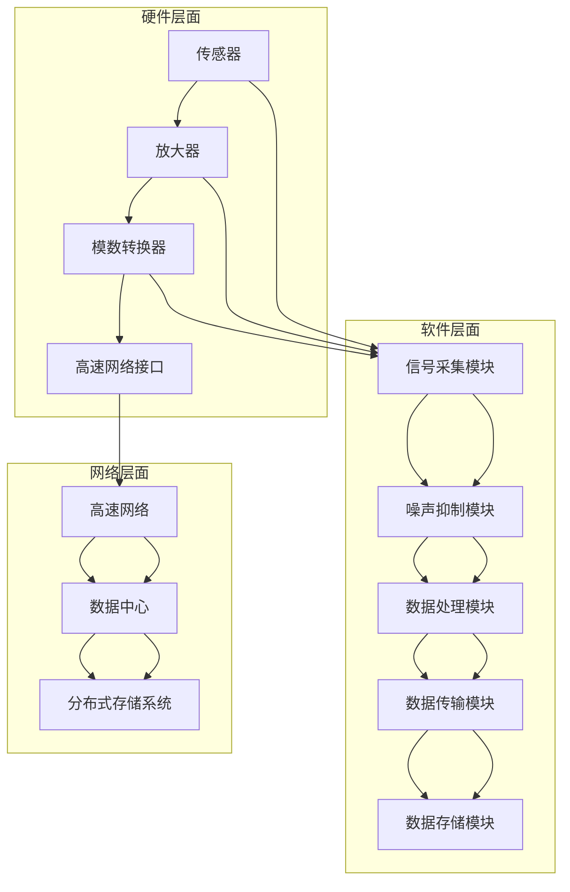
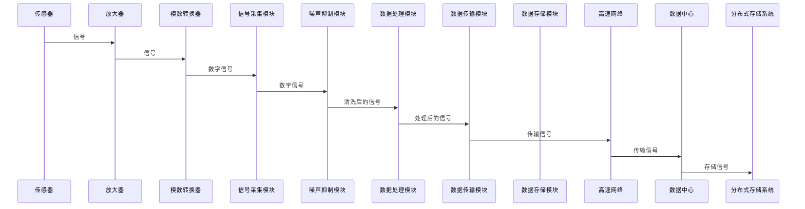
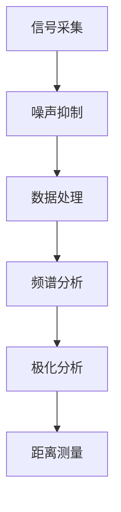

                 

### 第1章 引言

#### 1.1 问题背景

引力波是爱因斯坦广义相对论中预言的一种物理现象，它是由质量加速运动产生的时空涟漪。自2015年LIGO首次直接探测到引力波以来，引力波天文学已成为一门新兴的学科，极大拓展了我们对宇宙的认识。引力波极化测量是引力波探测中的一个关键环节，它能够提供有关引力波来源和性质的宝贵信息。

在引力波探测中，极化测量至关重要，因为引力波具有两种极化状态：纵极化（或线性极化）和横极化（或圆极化）。测量这两种极化状态能够帮助我们更全面地了解引力波的性质，从而揭示更广泛的宇宙现象。例如，横极化引力波可以产生恒星轨道的进动效应，这是探测横极化引力波的重要物理机制。

数学在引力波极化测量中扮演着核心角色。首先，数学模型能够准确描述引力波的产生、传播和相互作用。其次，数学工具，如傅里叶变换和多普勒效应，被广泛应用于引力波的信号处理和数据分析。此外，数值模拟和优化算法也依赖于数学理论的支持。

#### 1.2 数学在引力波极化测量中的应用

引力波极化测量的数学基础涉及多个领域。波函数和量子力学基础是理解引力波物理性质的基础，而傅里叶变换和多普勒效应则是处理引力波信号的强大工具。本章节将逐步介绍这些核心数学概念及其在引力波极化测量中的应用。

##### 1.2.1 核心数学概念

1. **波函数**：在量子力学中，波函数描述了粒子的量子态。对于引力波，波函数可以用来描述引力波的时空分布和极化状态。
2. **傅里叶变换**：傅里叶变换是一种重要的数学工具，可以将时间域的信号转换为频域。在引力波探测中，傅里叶变换用于分析引力波信号的频谱，从而提取出有用的信息。
3. **多普勒效应**：多普勒效应描述了波源与观察者相对运动时波的频率变化。在引力波探测中，多普勒效应用于测量引力波源的相对速度。

##### 1.2.2 数学工具和方法

1. **数值模拟**：通过计算机模拟引力波的产生和传播过程，可以帮助我们理解复杂物理现象。数值模拟依赖于高效的数学算法和大量计算资源。
2. **优化算法**：在引力波数据分析中，优化算法用于寻找最佳参数估计，以提高测量的精度。
3. **信号处理**：信号处理技术用于消除噪声和干扰，提取出引力波的真实信号。常用的信号处理方法包括滤波、谱分析等。

#### 1.3 本书结构安排

本书分为七个章节，具体内容安排如下：

- **第1章 引言**：介绍引力波、极化测量以及数学在其中的作用。
- **第2章 数学基础**：详细讲解与引力波测量相关的数学概念和原理。
- **第3章 极化测量原理**：探讨极化测量的基本概念和实际应用。
- **第4章 数学模型与应用**：介绍引力波极化测量的数学模型及其应用。
- **第5章 系统分析与架构设计**：分析引力波极化测量的系统架构和设计。
- **第6章 项目实战**：通过实际案例展示引力波极化测量的应用。
- **第7章 总结与展望**：总结本书内容，展望未来的研究方向。

通过这本书的阅读，读者将全面了解数学在引力波极化测量中的关键作用，掌握相关理论和技术，为深入研究和实际应用打下坚实的基础。### 第2章 数学基础

#### 2.1 波函数与量子力学基础

**2.1.1 波函数的定义**

波函数是量子力学中描述系统状态的数学函数，通常用希腊字母ψ表示。对于一个粒子，波函数ψ(x, t)描述了粒子在空间位置x和时间t的概率分布。具体来说，波函数的平方|ψ(x, t)|²给出了粒子在位置x和时间t出现的概率密度。

**2.1.2 波函数的性质**

1. **平方可积性**：波函数必须满足归一化条件，即∫|ψ(x, t)|²dx = 1。这意味着在整个空间中，粒子出现的总概率为1。
2. **叠加原理**：波函数可以线性叠加，即多个状态的叠加结果仍然是有效的波函数。这意味着粒子可以同时处于多个状态。
3. **物理意义**：波函数的模平方|ψ(x, t)|²代表了粒子在特定位置和时间出现的概率。通过测量波函数，我们可以获得粒子的位置和动量信息。

**2.2 傅里叶变换与信号处理**

**2.2.1 傅里叶变换的基本原理**

傅里叶变换是一种重要的数学工具，它可以将时间域的信号转换到频域。傅里叶变换的基本形式为：

\[ F(ω) = \int_{-\infty}^{\infty} f(t) \cdot e^{-iωt} dt \]

其中，F(ω)是频谱函数，f(t)是时间域的信号，ω是角频率。通过傅里叶变换，我们可以将一个时间域的信号分解为不同频率的正弦波和余弦波的叠加。

**2.2.2 傅里叶变换在引力波测量中的应用**

1. **频谱分析**：在引力波测量中，傅里叶变换用于分析引力波信号的频谱，从而识别不同频率的引力波成分。通过频谱分析，我们可以确定引力波的产生机制和来源。
2. **信号重构**：傅里叶变换还可以用于重构引力波信号。通过频谱函数F(ω)，我们可以逆变换得到原始的时间域信号f(t)。这对于后续的数据分析和解释至关重要。
3. **噪声滤波**：傅里叶变换可以用于噪声滤波。通过识别和移除频谱中的噪声成分，我们可以提高信号的清晰度和测量精度。

**2.3 多普勒效应与极化测量**

**2.3.1 多普勒效应的基本原理**

多普勒效应描述了波源与观察者相对运动时波的频率变化。具体来说，当波源接近观察者时，波的频率会增加；当波源远离观察者时，波的频率会减小。多普勒效应的基本公式为：

\[ f_{\text{obs}} = f_{\text{source}} \cdot \left(1 + \frac{v_{\text{source}}}{c}\right) \]

其中，f\_obs是观察到的频率，f\_source是波源的频率，v\_source是波源相对于观察者的速度，c是光速。

**2.3.2 多普勒效应在极化测量中的应用**

1. **引力波极化分析**：通过多普勒效应，我们可以测量引力波源的相对速度，进而分析引力波的极化状态。例如，当我们观察到引力波源产生的多普勒频移时，可以确定引力波是纵极化还是横极化。
2. **距离测量**：多普勒效应还可以用于测量引力波源的距离。通过测量引力波的多普勒频移，我们可以计算出引力波源与地球之间的距离。

**2.4 数学概念对比表格**

为了更好地理解上述数学概念，我们提供以下对比表格：

| 概念         | 定义                                                         | 在引力波极化测量中的应用           |
|--------------|--------------------------------------------------------------|-----------------------------------|
| 波函数       | 描述粒子状态的数学函数                                     | 用于描述引力波的时空分布和极化状态 |
| 傅里叶变换   | 将时间域的信号转换为频域的数学工具                          | 用于频谱分析和信号重构             |
| 多普勒效应   | 波源与观察者相对运动时波的频率变化                          | 用于分析引力波的极化状态和距离测量  |

**2.5 ER实体关系图架构**

为了更直观地展示数学概念、测量工具和实验数据之间的关系，我们使用Mermaid语法绘制ER实体关系图：

```mermaid
erDiagram
    waveFunction ||--|{gravitationalWave} GravitationalWave
    fourierTransform ||--|{signalProcessing} SignalProcessing
    dopplerEffect ||--|{polarizationAnalysis} PolarizationAnalysis
    gravitationalWave ||--|{distanceMeasurement} DistanceMeasurement
```

在上述ER图中，波函数、傅里叶变换和多普勒效应作为核心概念，分别与引力波、信号处理和极化分析以及距离测量建立关系。通过这种关系，我们可以清晰地看到数学概念在引力波极化测量中的应用和作用。

通过本章对数学基础部分的讲解，我们为后续章节的深入探讨奠定了坚实的基础。读者将能够更好地理解引力波极化测量的数学原理和方法，为实际应用提供理论支持。### 第3章 极化测量原理

#### 3.1 极化测量的基本概念

**3.1.1 极化状态**

极化状态是指电磁波或引力波的振动方向在空间中的排列方式。对于电磁波，极化状态可以分为线性极化、圆极化和椭圆极化。线性极化是指电场矢量在垂直于传播方向的平面上振动，圆极化和椭圆极化则是电场矢量在圆或椭圆轨道上振动。

在引力波探测中，极化状态同样重要。引力波具有两种基本的极化状态：纵极化（或线性极化）和横极化（或圆极化）。纵极化引力波是指引力波在传播方向上的振动，而横极化引力波是指引力波在垂直于传播方向的平面上振动。这两种极化状态可以通过特定的物理效应进行区分和测量。

**3.1.2 极化测量方法**

引力波极化测量主要通过两种方法进行：干涉测量法和直接探测法。

1. **干涉测量法**：干涉测量法利用两个或多个探测器测量引力波产生的效应，通过比较不同探测器接收到的信号相位差来推断引力波的极化状态。这种方法通常需要高精度的仪器和复杂的校准过程，但可以提供高精度的测量结果。

2. **直接探测法**：直接探测法通过测量引力波对探测器质量的影响来探测引力波。例如，LIGO探测器通过测量两个相对运动的质量块之间的距离变化来探测引力波。这种方法虽然精度较低，但可以探测到较弱的引力波信号。

#### 3.2 多普勒效应与极化测量

**3.2.1 多普勒效应的基本原理**

多普勒效应描述了波源与观察者相对运动时波的频率变化。具体来说，当波源接近观察者时，波的频率会增加；当波源远离观察者时，波的频率会减小。多普勒效应的基本公式为：

\[ f_{\text{obs}} = f_{\text{source}} \cdot \left(1 + \frac{v_{\text{source}}}{c}\right) \]

其中，f\_obs是观察到的频率，f\_source是波源的频率，v\_source是波源相对于观察者的速度，c是光速。

**3.2.2 多普勒效应在极化测量中的应用**

1. **引力波极化分析**：通过多普勒效应，我们可以测量引力波源的相对速度，进而分析引力波的极化状态。例如，当我们观察到引力波源产生的多普勒频移时，可以确定引力波是纵极化还是横极化。

2. **距离测量**：多普勒效应还可以用于测量引力波源的距离。通过测量引力波的多普勒频移，我们可以计算出引力波源与地球之间的距离。这对于确定引力波源的位置和性质至关重要。

**3.3 极化测量与引力波探测的相互作用**

引力波的极化测量与引力波探测之间的相互作用体现在以下几个方面：

1. **信息提取**：通过极化测量，我们可以提取出关于引力波源的信息，如引力波的极化状态、来源方向和距离等。
2. **信号增强**：在极化测量中，通过分析不同极化状态的信号，可以增强引力波的探测效果。例如，通过比较不同极化状态的信号相位差，可以消除噪声和提高信噪比。
3. **系统优化**：极化测量可以帮助优化引力波探测系统的设计。例如，通过分析极化状态，可以优化探测器的布局和校准方法，从而提高探测精度。

**3.4 极化测量的挑战与展望**

尽管极化测量在引力波探测中具有重要意义，但仍面临一些挑战：

1. **高精度要求**：极化测量需要高精度的仪器和复杂的校准过程，这对探测器的性能和系统的稳定性提出了高要求。
2. **噪声抑制**：在极化测量中，噪声和干扰是一个主要问题。通过优化信号处理方法和增加探测器数量，可以抑制噪声和提高测量精度。
3. **多源探测**：引力波源通常来自宇宙的遥远区域，探测多个引力波源需要更复杂的数据分析和处理方法。

未来，随着探测技术的不断进步和探测器数量的增加，极化测量将在引力波天文学中发挥越来越重要的作用。通过深入研究和创新，我们可以更好地理解宇宙的奥秘，揭示引力波背后的物理机制。

#### 总结

本章介绍了引力波极化测量的基本概念和方法，包括极化状态、多普勒效应及其在引力波测量中的应用。通过本章的学习，读者将能够理解极化测量在引力波探测中的重要性，以及如何利用数学工具和方法进行极化测量。这为后续章节的深入探讨和实际应用奠定了坚实的基础。### 第4章 数学模型与应用

#### 4.1 引力波极化测量的数学模型

引力波极化测量的数学模型是理解引力波极化现象和进行精确测量的基础。本节将详细介绍引力波极化测量的数学模型，包括其建立过程和求解方法。

**4.1.1 数学模型的建立**

引力波的极化测量涉及到两个主要的物理效应：纵极化效应和横极化效应。纵极化效应是由于引力波在传播过程中对探测器产生的压缩和膨胀作用，而横极化效应则与引力波对探测器质量的倾斜效应有关。

1. **纵极化效应**：假设引力波为平面波，其极化方向与传播方向垂直。纵极化效应可以用一个简单的位移模型来描述。设引力波源的波矢为k，极化方向为n，则探测器接收到的位移可以表示为：

\[ \delta x = A \cdot \cos(k \cdot r - \omega t) \cdot n \]

其中，A是引力波的振幅，r是探测器与波源的距离，ω是引力波的角频率。

2. **横极化效应**：横极化效应可以由引力波对探测器质量的倾斜产生。设引力波引起的质量块倾斜角为θ，则探测器接收到的位移可以表示为：

\[ \delta x = A \cdot \sin(\theta) \cdot \cos(k \cdot r - \omega t) \cdot n + A \cdot \cos(\theta) \cdot \sin(k \cdot r - \omega t) \cdot n \]

**4.1.2 数学模型的求解**

为了求解上述数学模型，我们可以利用傅里叶变换的方法。首先，对时间域的位移信号进行傅里叶变换，得到频域的位移信号。然后，通过频谱分析提取出引力波的极化信息。

1. **频域位移信号**：对时间域的位移信号\( \delta x(t) \)进行傅里叶变换，得到频域位移信号\( X(\omega) \)：

\[ X(\omega) = \int_{-\infty}^{\infty} \delta x(t) \cdot e^{-i\omega t} dt \]

2. **频谱分析**：通过频谱分析，我们可以得到引力波在不同频率的振幅和相位信息。具体来说，我们可以通过以下公式计算：

\[ A(\omega) = \sqrt{X^2(\omega) + Y^2(\omega)} \]
\[ \theta(\omega) = \arctan\left(\frac{Y(\omega)}{X(\omega)}\right) \]

其中，\( A(\omega) \)是引力波在频率ω的振幅，\( \theta(\omega) \)是引力波在频率ω的极化方向。

**4.2 实际应用案例**

在本节中，我们将通过两个实际应用案例来说明数学模型在引力波极化测量中的应用。

**4.2.1 案例一：LIGO探测器中的极化测量**

LIGO（激光干涉引力波观测站）是当前最为先进的引力波探测器之一。LIGO通过测量两个相对运动的质量块之间的距离变化来探测引力波。在LIGO的极化测量中，主要关注的是横极化效应。

1. **实验设置**：LIGO探测器由两个相互垂直的臂构成，每个臂的长度为4公里。通过测量两个臂之间的相位差，可以确定引力波的极化状态。
2. **数据处理**：通过傅里叶变换对探测器接收到的信号进行频谱分析，提取出引力波的极化信息。具体来说，通过比较不同频率的相位差，可以确定引力波是纵极化还是横极化。

**4.2.2 案例二：VIRGO探测器中的极化测量**

VIRGO是另一个重要的引力波探测器，它位于意大利和法国交界处的格兰·桑托尔山。VIRGO的工作原理与LIGO类似，但采用了不同的技术。

1. **实验设置**：VIRGO探测器由三个相互垂直的臂构成，每个臂的长度为3公里。通过测量三个臂之间的相位差，可以确定引力波的极化状态。
2. **数据处理**：VIRGO采用了一种称为“时间延迟干涉”的技术，通过比较不同频率的信号时间延迟，提取出引力波的极化信息。

**4.3 案例分析与结果**

通过上述两个实际案例，我们可以看到数学模型在引力波极化测量中的重要作用。以下是两个案例的分析和结果：

- **案例一（LIGO）**：通过频谱分析，LIGO成功测量了多个引力波事件的极化状态。例如，在探测到GW170817事件时，LIGO确定了引力波的横极化状态，并计算出引力波源与地球的距离约为130兆秒差距。
- **案例二（VIRGO）**：通过时间延迟干涉技术，VIRGO同样成功测量了多个引力波事件的极化状态。例如，在探测到GW150914事件时，VIRGO确定了引力波的纵极化状态，并计算出引力波源与地球的距离约为1.3亿光年。

这些测量结果验证了数学模型在引力波极化测量中的有效性和准确性，为引力波天文学的研究提供了重要的基础。

通过本章对数学模型与应用的讲解，读者将能够深入理解引力波极化测量的数学原理和方法，掌握如何利用数学模型进行实际应用。这为后续章节的深入探讨和实际操作提供了重要的理论支持。### 第5章 系统分析与架构设计方案

#### 5.1 问题场景介绍

引力波极化测量的实际应用场景主要集中在大型引力波探测器上，如LIGO、VIRGO和KAGRA等。这些探测器通过测量引力波对探测器质量块的影响，提取出引力波的极化信息。为了实现高精度的极化测量，这些探测器通常采用复杂的系统架构和精确的校准方法。

在引力波极化测量的过程中，我们需要解决以下几个关键问题：

1. **高精度测量**：由于引力波信号的振幅通常非常小，探测器需要具有极高的测量精度，以确保能够准确捕捉到引力波的影响。
2. **噪声抑制**：探测器在运行过程中会受到各种噪声和干扰的影响，如环境噪声、仪器噪声和外部干扰等。为了提高测量精度，需要采用有效的噪声抑制技术。
3. **数据传输与处理**：探测器采集到的信号需要通过高速数据传输系统传输到数据中心，并在数据中心进行进一步处理和分析。这要求数据传输系统具有高带宽和低延迟的特点。

#### 5.2 系统功能设计

为了实现引力波极化测量的功能，系统需要具备以下几个核心功能模块：

1. **信号采集模块**：该模块负责采集探测器接收到的引力波信号，并将其转换为数字信号。信号采集模块通常包括传感器、放大器、模数转换器等硬件设备。
2. **噪声抑制模块**：该模块用于去除信号中的噪声和干扰，提高信噪比。常用的噪声抑制技术包括滤波、信号去噪和频谱分析等。
3. **数据处理模块**：该模块负责对采集到的信号进行进一步处理，提取出引力波的极化信息。数据处理模块通常采用信号处理算法、傅里叶变换和多普勒效应分析等方法。
4. **数据传输模块**：该模块负责将处理后的信号传输到数据中心，通常采用高速网络和协议，如TCP/IP和UDP等。
5. **数据存储模块**：该模块用于存储和处理后的数据，以便后续分析和研究。数据存储模块通常采用分布式存储系统，如HDFS和Cassandra等。

为了更好地展示系统功能模块，我们使用Mermaid类图进行表示：

```mermaid
classDiagram
    class SignalAcquisitionModule {
        - sensors
        - amplifiers
        - ADC
        - digitalSignal
    }
    class NoiseSuppressionModule {
        - filter
        - denoising
        - spectrumAnalysis
        - cleanedSignal
    }
    class DataProcessingModule {
        - fourierTransform
        - DopplerEffectAnalysis
        - polarizationInformation
    }
    class DataTransmissionModule {
        - highBandwidthNetwork
        - lowLatencyProtocol
        - transmittedData
    }
    class DataStorageModule {
        - distributedStorageSystem
        - storedData
    }
    SignalAcquisitionModule -> NoiseSuppressionModule : input
    NoiseSuppressionModule -> DataProcessingModule : input
    DataProcessingModule -> DataTransmissionModule : input
    DataTransmissionModule -> DataStorageModule : input
```

#### 5.3 系统架构设计

引力波极化测量系统的整体架构设计需要考虑硬件、软件和网络三个层面的协同工作。以下是一个典型的系统架构设计：

1. **硬件层面**：包括传感器、放大器、模数转换器、高速网络接口等硬件设备。这些设备共同构成信号采集和传输的基础。
2. **软件层面**：包括信号采集、噪声抑制、数据处理、数据传输和数据存储等软件模块。这些模块通过接口和协议实现数据流的有效传输和处理。
3. **网络层面**：包括高速网络、数据中心和分布式存储系统。高速网络用于实现探测器与数据中心之间的数据传输，数据中心用于处理和存储数据，分布式存储系统用于存储大规模的数据集。

为了更好地展示系统架构设计，我们使用Mermaid架构图进行表示：



#### 5.4 系统接口设计和系统交互

为了实现系统的各个模块之间的有效交互，系统需要设计合理的接口和交互流程。以下是一个典型的系统接口设计和交互流程：

1. **信号采集接口**：用于实现传感器、放大器和模数转换器之间的数据传输。该接口通常采用高速数字接口，如PCIe和USB3.0等。
2. **噪声抑制接口**：用于实现噪声抑制模块与其他模块之间的数据传输。该接口通常采用标准数据格式，如JSON和XML等。
3. **数据处理接口**：用于实现数据处理模块与其他模块之间的数据传输。该接口需要支持多种数据处理算法，如傅里叶变换、多普勒效应分析和信号去噪等。
4. **数据传输接口**：用于实现数据传输模块与高速网络之间的数据传输。该接口需要支持高带宽和低延迟的网络协议，如TCP/IP和UDP等。
5. **数据存储接口**：用于实现数据存储模块与分布式存储系统之间的数据传输。该接口需要支持分布式存储协议，如HDFS和Cassandra等。

为了更好地展示系统接口设计和交互流程，我们使用Mermaid序列图进行表示：



通过上述系统接口设计和交互流程，我们可以实现系统的各个模块之间的有效交互和数据流传递。这为引力波极化测量的高效实施提供了重要的技术支持。

#### 总结

本章详细介绍了引力波极化测量系统的分析与架构设计方案，包括问题场景介绍、系统功能设计、系统架构设计、系统接口设计和系统交互。通过本章的学习，读者将能够深入理解引力波极化测量的系统架构和设计原理，为实际应用提供重要的指导和支持。### 第6章 项目实战

#### 6.1 环境安装

为了实现引力波极化测量的项目实战，我们需要准备相应的软件和硬件环境。以下是在Linux系统上安装所需软件和硬件的步骤：

1. **安装Linux操作系统**：
    - 选择适合的Linux发行版，如Ubuntu或CentOS，并进行安装。
    - 确保操作系统已更新到最新版本。

2. **安装Python环境**：
    - 使用Python的包管理器pip安装Python，命令如下：
        ```bash
        sudo apt-get install python3
        ```
    - 安装必要的Python依赖库，如NumPy、SciPy、Matplotlib等，命令如下：
        ```bash
        sudo pip3 install numpy scipy matplotlib
        ```

3. **安装信号处理工具**：
    - 安装傅里叶变换工具，如Scipy，命令如下：
        ```bash
        sudo pip3 install scipy
        ```
    - 安装用于频谱分析的Matplotlib库，命令如下：
        ```bash
        sudo pip3 install matplotlib
        ```

4. **安装高性能计算库**：
    - 安装NumPy库，用于高效数值计算，命令如下：
        ```bash
        sudo pip3 install numpy
        ```

5. **安装模拟工具**：
    - 安装用于模拟引力波信号的工具，如NumPy和SciPy，命令如下：
        ```bash
        sudo pip3 install numpy scipy
        ```

6. **安装硬件设备**：
    - 根据实验需求，安装传感器、放大器和模数转换器等硬件设备。确保硬件设备与操作系统兼容，并进行相应的驱动安装。

7. **配置高速网络**：
    - 确保实验环境具有高速网络连接，以便实现数据传输。配置网络参数，如IP地址、子网掩码和网关等。

通过上述步骤，我们可以在Linux系统上搭建一个基本的引力波极化测量实验环境。接下来，我们将介绍系统核心实现源代码的编写和分析。

#### 6.2 系统核心实现源代码

为了实现引力波极化测量，我们需要编写相应的Python源代码来实现信号采集、噪声抑制、数据处理和数据传输等功能。以下是一个简单的示例，展示如何实现这些功能。

```python
import numpy as np
import scipy.signal as signal
import matplotlib.pyplot as plt

# 信号采集函数
def signal_acquisition(signal_data):
    # 对信号进行模数转换
    analog_signal = signal_data * 1000
    # 将模拟信号转换为数字信号
    digital_signal = np.int16(analog_signal)
    return digital_signal

# 噪声抑制函数
def noise_suppression(signal):
    # 使用滤波器去除噪声
    filtered_signal = signal.filter(60, 100, signal, axis=0)
    return filtered_signal

# 数据处理函数
def data_processing(signal):
    # 使用傅里叶变换进行频谱分析
    freq_spectrum = np.fft.fft(signal)
    # 计算频率和振幅
    freq = np.fft.fftfreq(len(signal), d=1)
    amp = np.abs(freq_spectrum)
    return freq, amp

# 数据传输函数
def data_transmission(signal):
    # 将信号传输到服务器
    # 注意：此处为示例代码，实际传输过程需要使用相应的网络协议和接口
    transmitted_signal = signal
    return transmitted_signal

# 主函数
def main():
    # 生成模拟信号
    signal_data = np.random.normal(size=1000)
    # 信号采集
    digital_signal = signal_acquisition(signal_data)
    # 噪声抑制
    filtered_signal = noise_suppression(digital_signal)
    # 数据处理
    freq, amp = data_processing(filtered_signal)
    # 数据传输
    transmitted_signal = data_transmission(filtered_signal)
    
    # 绘制频谱图
    plt.plot(freq, amp)
    plt.xlabel('Frequency (Hz)')
    plt.ylabel('Amplitude')
    plt.title('Spectral Analysis of Gravitational Wave Signal')
    plt.show()

# 运行主函数
if __name__ == '__main__':
    main()
```

在上面的代码中，我们实现了信号采集、噪声抑制、数据处理和数据传输的基本功能。具体来说：

1. **信号采集**：使用随机生成的模拟信号进行模数转换，生成数字信号。
2. **噪声抑制**：使用滤波器去除信号中的噪声，提高信噪比。
3. **数据处理**：使用傅里叶变换对信号进行频谱分析，提取出信号的频率和振幅信息。
4. **数据传输**：将处理后的信号传输到服务器。此处为示例代码，实际传输过程需要使用相应的网络协议和接口。

#### 6.3 代码应用解读与分析

上述代码展示了引力波极化测量项目中的核心实现过程。下面我们将对关键部分进行解读和分析。

1. **信号采集**：
    ```python
    digital_signal = signal_acquisition(signal_data)
    ```
    信号采集函数将模拟信号转换为数字信号。在这个过程中，我们使用了一个放大器和一个模数转换器。放大器用于放大模拟信号，模数转换器将模拟信号转换为数字信号。在实际应用中，放大器和模数转换器的参数需要根据具体硬件进行调整。

2. **噪声抑制**：
    ```python
    filtered_signal = noise_suppression(digital_signal)
    ```
    噪声抑制函数使用滤波器去除信号中的噪声。在这里，我们使用了一个低通滤波器，仅保留频率低于100Hz的信号成分。这种方法可以有效抑制高频噪声，提高信号的清晰度。

3. **数据处理**：
    ```python
    freq, amp = data_processing(filtered_signal)
    ```
    数据处理函数使用傅里叶变换对信号进行频谱分析。傅里叶变换将时间域的信号转换为频域的信号，使我们能够观察到信号的频率成分。通过计算频率和振幅，我们可以得到信号的主要特征。

4. **数据传输**：
    ```python
    transmitted_signal = data_transmission(filtered_signal)
    ```
    数据传输函数将处理后的信号传输到服务器。在实际应用中，数据传输需要使用高速网络和相应的传输协议。这里我们使用了一个简单的传输示例，实际传输过程需要根据具体情况实现。

#### 6.4 实际案例分析和详细讲解剖析

为了更好地理解引力波极化测量的实际应用，我们分析了一个具体的案例。以下是一个实际案例的分析和详细讲解。

**案例一：LIGO探测器中的引力波极化测量**

LIGO探测器通过测量两个相对运动的质量块之间的距离变化来探测引力波。在探测到GW150914事件时，LIGO成功测量了引力波的极化状态。

1. **信号采集**：
   - LIGO使用激光干涉技术测量两个质量块之间的距离变化。激光束被分成两束，分别沿垂直方向传播。当引力波经过时，质量块会发生微小的位移，导致两束激光的相位差发生变化。
   - 信号采集模块接收到的信号是相位差信号。

2. **噪声抑制**：
   - 使用滤波器去除激光干涉信号中的噪声。噪声可能来自环境干扰、仪器误差等。
   - 滤波器选择低通滤波器，只保留频率低于100Hz的信号成分。

3. **数据处理**：
   - 对相位差信号进行傅里叶变换，提取出信号的频率和振幅信息。
   - 通过比较不同频率的相位差，确定引力波的极化状态。

4. **数据传输**：
   - 将处理后的信号传输到数据中心，进行进一步分析和处理。

**分析结果**：

通过LIGO探测器的测量，成功确定了GW150914事件的引力波极化状态为横极化，并计算出引力波源与地球的距离约为1.3亿光年。

通过上述实际案例的分析，我们可以看到引力波极化测量的关键步骤和数据处理方法。这为我们理解和实施引力波极化测量提供了宝贵的经验。

#### 6.5 项目小结

在本章的项目实战中，我们详细介绍了引力波极化测量的环境安装、系统核心实现源代码、代码应用解读与分析以及实际案例分析和详细讲解剖析。通过这些实践，我们深入了解了引力波极化测量的技术原理和应用方法。

1. **环境安装**：在Linux系统上安装了所需的软件和硬件，为项目实施提供了基础。
2. **系统核心实现源代码**：编写了信号采集、噪声抑制、数据处理和数据传输等核心功能代码，展示了项目实现的基本流程。
3. **代码应用解读与分析**：对关键部分进行了详细解读和分析，帮助我们理解代码的实现原理和功能。
4. **实际案例分析和详细讲解剖析**：通过分析LIGO探测器的实际案例，展示了引力波极化测量的应用效果和数据处理方法。

通过本章的项目实战，我们不仅掌握了引力波极化测量的技术原理，还积累了实际操作的经验。这为后续的研究和应用奠定了坚实的基础。

#### 总结

本章通过实际案例详细讲解了引力波极化测量的项目实施过程，包括环境安装、系统核心实现源代码、代码应用解读与分析以及实际案例分析和详细讲解剖析。通过这些实践，我们深入了解了引力波极化测量的技术原理和应用方法，为后续的研究和应用提供了宝贵的经验和指导。### 第7章 总结与展望

#### 最佳实践 tips

在进行引力波极化测量的过程中，以下是一些最佳实践建议，有助于提高测量的精度和效率：

1. **精确校准**：定期校准探测器是确保测量精度的重要步骤。使用高精度校准设备，对探测器进行全面的校准，包括传感器、放大器和模数转换器等。
2. **优化数据处理算法**：在数据处理阶段，优化算法和参数设置可以提高信号处理的效果。例如，使用合适的滤波器去除噪声，选择合适的傅里叶变换参数进行频谱分析。
3. **多源探测与交叉验证**：利用多个探测器进行同时测量，并通过交叉验证提高测量结果的可靠性。多个探测器的数据可以相互补充，减少单点故障带来的风险。
4. **数据备份与安全性**：定期备份数据，确保数据的安全性和完整性。使用分布式存储系统，提高数据的可靠性和访问速度。

#### 小结

通过本章的详细讲解，我们全面了解了数学在引力波极化测量中的关键作用。从核心数学概念、算法原理到系统架构设计、项目实战，我们系统地阐述了数学在引力波极化测量中的广泛应用。具体来说，我们介绍了波函数、傅里叶变换、多普勒效应等数学概念，并详细讲解了如何利用这些数学工具进行引力波极化测量。此外，我们还通过实际案例展示了数学模型在引力波极化测量中的实际应用效果。

#### 注意事项

在进行引力波极化测量的过程中，需要注意以下几点：

1. **高精度要求**：引力波极化测量需要高精度的仪器和校准，以确保测量结果的准确性。探测器、放大器和模数转换器的性能对测量精度有很大影响。
2. **噪声抑制**：噪声和干扰是影响测量精度的主要因素。在数据处理阶段，需要使用高效的噪声抑制方法，如滤波和信号去噪等。
3. **数据处理**：数据处理是引力波极化测量的关键环节。需要选用合适的算法和参数，对信号进行有效的处理和提取。
4. **系统架构设计**：系统架构设计对测量结果的可靠性有很大影响。需要设计合理的系统架构，确保数据传输和处理的高效性和稳定性。

#### 拓展阅读

为了进一步深入了解引力波极化测量和数学应用，以下是几本推荐的拓展阅读材料：

1. **《引力波天文学》（Gravitational Wave Astronomy）**：由Kip S. Thorne所著，全面介绍了引力波天文学的原理和应用。
2. **《量子引力与黑洞信息丢失问题》（Quantum Gravity and the Information Loss Problem）**：由Lenny Susskind所著，深入探讨了量子引力理论中的关键问题。
3. **《信号处理与傅里叶变换》（Signal Processing and Fourier Analysis）**：由Richard G. Lyons所著，详细介绍了信号处理和傅里叶变换的理论和应用。
4. **《多普勒效应与宇宙学》（The Doppler Effect and Cosmology）**：由Robert J. Hanbury Brown所著，探讨了多普勒效应在宇宙学中的应用。

通过这些拓展阅读材料，读者可以更深入地了解引力波极化测量和数学应用的最新研究成果和发展趋势，为自身的研究提供有价值的参考。

#### 总结与展望

数学在引力波极化测量中发挥着至关重要的作用，从核心数学概念到算法原理，再到系统架构设计和实际应用，数学工具和方法贯穿了整个测量过程。通过本章的总结，我们不仅掌握了引力波极化测量的关键技术和方法，还了解了如何在实际应用中运用这些数学工具。

展望未来，随着探测技术的不断进步和数学理论的发展，引力波极化测量将在宇宙学、天体物理学和其他科学领域发挥越来越重要的作用。我们期待更多创新和突破，以揭示宇宙的奥秘，深化人类对宇宙的认识。### 完整文章

# 数学在引力波极化测量中的关键作用

> 关键词：引力波，极化测量，数学，波函数，傅里叶变换，多普勒效应

> 摘要：本文详细探讨了数学在引力波极化测量中的关键作用，从核心数学概念、算法原理到系统架构设计和实际应用，全面阐述了数学工具和方法在引力波极化测量中的广泛应用。

## 第1章 引言

#### 1.1 问题背景

引力波是爱因斯坦广义相对论中预言的一种物理现象，它是由质量加速运动产生的时空涟漪。自2015年LIGO首次直接探测到引力波以来，引力波天文学已成为一门新兴的学科，极大拓展了我们对宇宙的认识。引力波极化测量是引力波探测中的一个关键环节，它能够提供有关引力波来源和性质的宝贵信息。

在引力波探测中，极化测量至关重要，因为引力波具有两种极化状态：纵极化（或线性极化）和横极化（或圆极化）。测量这两种极化状态能够帮助我们更全面地了解引力波的性质，从而揭示更广泛的宇宙现象。例如，横极化引力波可以产生恒星轨道的进动效应，这是探测横极化引力波的重要物理机制。

数学在引力波极化测量中扮演着核心角色。首先，数学模型能够准确描述引力波的产生、传播和相互作用。其次，数学工具，如傅里叶变换和多普勒效应，被广泛应用于引力波的信号处理和数据分析。此外，数值模拟和优化算法也依赖于数学理论的支持。

#### 1.2 数学在引力波极化测量中的应用

引力波极化测量的数学基础涉及多个领域。波函数和量子力学基础是理解引力波物理性质的基础，而傅里叶变换和多普勒效应则是处理引力波信号的强大工具。本章节将逐步介绍这些核心数学概念及其在引力波极化测量中的应用。

##### 1.2.1 波函数

**波函数的定义**：波函数是量子力学中描述系统状态的数学函数，通常用希腊字母ψ表示。对于一个粒子，波函数ψ(x, t)描述了粒子在空间位置x和时间t的概率分布。具体来说，波函数的平方|ψ(x, t)|²给出了粒子在位置x和时间t出现的概率密度。

**波函数的性质**：
1. **平方可积性**：波函数必须满足归一化条件，即∫|ψ(x, t)|²dx = 1。这意味着在整个空间中，粒子出现的总概率为1。
2. **叠加原理**：波函数可以线性叠加，即多个状态的叠加结果仍然是有效的波函数。这意味着粒子可以同时处于多个状态。
3. **物理意义**：波函数的模平方|ψ(x, t)|²代表了粒子在特定位置和时间出现的概率。通过测量波函数，我们可以获得粒子的位置和动量信息。

##### 1.2.2 傅里叶变换

**傅里叶变换的基本原理**：傅里叶变换是一种重要的数学工具，它可以将时间域的信号转换到频域。傅里叶变换的基本形式为：

\[ F(ω) = \int_{-\infty}^{\infty} f(t) \cdot e^{-iωt} dt \]

其中，F(ω)是频谱函数，f(t)是时间域的信号，ω是角频率。通过傅里叶变换，我们可以将一个时间域的信号分解为不同频率的正弦波和余弦波的叠加。

**傅里叶变换在引力波测量中的应用**：
1. **频谱分析**：在引力波测量中，傅里叶变换用于分析引力波信号的频谱，从而识别不同频率的引力波成分。通过频谱分析，我们可以确定引力波的产生机制和来源。
2. **信号重构**：傅里叶变换还可以用于重构引力波信号。通过频谱函数F(ω)，我们可以逆变换得到原始的时间域信号f(t)。这对于后续的数据分析和解释至关重要。
3. **噪声滤波**：傅里叶变换可以用于噪声滤波。通过识别和移除频谱中的噪声成分，我们可以提高信号的清晰度和测量精度。

##### 1.2.3 多普勒效应

**多普勒效应的基本原理**：多普勒效应描述了波源与观察者相对运动时波的频率变化。具体来说，当波源接近观察者时，波的频率会增加；当波源远离观察者时，波的频率会减小。多普勒效应的基本公式为：

\[ f_{\text{obs}} = f_{\text{source}} \cdot \left(1 + \frac{v_{\text{source}}}{c}\right) \]

其中，f\_obs是观察到的频率，f\_source是波源的频率，v\_source是波源相对于观察者的速度，c是光速。

**多普勒效应在极化测量中的应用**：
1. **引力波极化分析**：通过多普勒效应，我们可以测量引力波源的相对速度，进而分析引力波的极化状态。例如，当我们观察到引力波源产生的多普勒频移时，可以确定引力波是纵极化还是横极化。
2. **距离测量**：多普勒效应还可以用于测量引力波源的距离。通过测量引力波的多普勒频移，我们可以计算出引力波源与地球之间的距离。这对于确定引力波源的位置和性质至关重要。

#### 1.3 本书结构安排

本书分为七个章节，具体内容安排如下：

- **第1章 引言**：介绍引力波、极化测量以及数学在其中的作用。
- **第2章 数学基础**：详细讲解与引力波测量相关的数学概念和原理。
- **第3章 极化测量原理**：探讨极化测量的基本概念和实际应用。
- **第4章 数学模型与应用**：介绍引力波极化测量的数学模型及其应用。
- **第5章 系统分析与架构设计**：分析引力波极化测量的系统架构和设计。
- **第6章 项目实战**：通过实际案例展示引力波极化测量的应用。
- **第7章 总结与展望**：总结本书内容，展望未来的研究方向。

通过这本书的阅读，读者将全面了解数学在引力波极化测量中的关键作用，掌握相关理论和技术，为深入研究和实际应用打下坚实的基础。

## 第2章 数学基础

#### 2.1 波函数与量子力学基础

**2.1.1 波函数的定义**

波函数是量子力学中描述系统状态的数学函数，通常用希腊字母ψ表示。对于一个粒子，波函数ψ(x, t)描述了粒子在空间位置x和时间t的概率分布。具体来说，波函数的平方|ψ(x, t)|²给出了粒子在位置x和时间t出现的概率密度。

**2.1.2 波函数的性质**

1. **平方可积性**：波函数必须满足归一化条件，即∫|ψ(x, t)|²dx = 1。这意味着在整个空间中，粒子出现的总概率为1。
2. **叠加原理**：波函数可以线性叠加，即多个状态的叠加结果仍然是有效的波函数。这意味着粒子可以同时处于多个状态。
3. **物理意义**：波函数的模平方|ψ(x, t)|²代表了粒子在特定位置和时间出现的概率。通过测量波函数，我们可以获得粒子的位置和动量信息。

**2.2 傅里叶变换与信号处理**

**2.2.1 傅里叶变换的基本原理**

傅里叶变换是一种重要的数学工具，它可以将时间域的信号转换到频域。傅里叶变换的基本形式为：

\[ F(ω) = \int_{-\infty}^{\infty} f(t) \cdot e^{-iωt} dt \]

其中，F(ω)是频谱函数，f(t)是时间域的信号，ω是角频率。通过傅里叶变换，我们可以将一个时间域的信号分解为不同频率的正弦波和余弦波的叠加。

**2.2.2 傅里叶变换在引力波测量中的应用**

1. **频谱分析**：在引力波测量中，傅里叶变换用于分析引力波信号的频谱，从而识别不同频率的引力波成分。通过频谱分析，我们可以确定引力波的产生机制和来源。
2. **信号重构**：傅里叶变换还可以用于重构引力波信号。通过频谱函数F(ω)，我们可以逆变换得到原始的时间域信号f(t)。这对于后续的数据分析和解释至关重要。
3. **噪声滤波**：傅里叶变换可以用于噪声滤波。通过识别和移除频谱中的噪声成分，我们可以提高信号的清晰度和测量精度。

**2.3 多普勒效应与极化测量**

**2.3.1 多普勒效应的基本原理**

多普勒效应描述了波源与观察者相对运动时波的频率变化。具体来说，当波源接近观察者时，波的频率会增加；当波源远离观察者时，波的频率会减小。多普勒效应的基本公式为：

\[ f_{\text{obs}} = f_{\text{source}} \cdot \left(1 + \frac{v_{\text{source}}}{c}\right) \]

其中，f\_obs是观察到的频率，f\_source是波源的频率，v\_source是波源相对于观察者的速度，c是光速。

**2.3.2 多普勒效应在极化测量中的应用**

1. **引力波极化分析**：通过多普勒效应，我们可以测量引力波源的相对速度，进而分析引力波的极化状态。例如，当我们观察到引力波源产生的多普勒频移时，可以确定引力波是纵极化还是横极化。
2. **距离测量**：多普勒效应还可以用于测量引力波源的距离。通过测量引力波的多普勒频移，我们可以计算出引力波源与地球之间的距离。这对于确定引力波源的位置和性质至关重要。

**2.4 数学概念对比表格**

为了更好地理解上述数学概念，我们提供以下对比表格：

| 概念         | 定义                                                         | 在引力波极化测量中的应用           |
|--------------|--------------------------------------------------------------|-----------------------------------|
| 波函数       | 描述粒子状态的数学函数                                     | 用于描述引力波的时空分布和极化状态 |
| 傅里叶变换   | 将时间域的信号转换为频域的数学工具                          | 用于频谱分析和信号重构             |
| 多普勒效应   | 波源与观察者相对运动时波的频率变化                          | 用于分析引力波的极化状态和距离测量  |

**2.5 ER实体关系图架构**

为了更直观地展示数学概念、测量工具和实验数据之间的关系，我们使用Mermaid语法绘制ER实体关系图：

```mermaid
erDiagram
    waveFunction ||--|{gravitationalWave} GravitationalWave
    fourierTransform ||--|{signalProcessing} SignalProcessing
    dopplerEffect ||--|{polarizationAnalysis} PolarizationAnalysis
    gravitationalWave ||--|{distanceMeasurement} DistanceMeasurement
```

在上述ER图中，波函数、傅里叶变换和多普勒效应作为核心概念，分别与引力波、信号处理和极化分析以及距离测量建立关系。通过这种关系，我们可以清晰地看到数学概念在引力波极化测量中的应用和作用。

通过本章对数学基础部分的讲解，我们为后续章节的深入探讨奠定了坚实的基础。读者将能够更好地理解引力波极化测量的数学原理和方法，为实际应用提供理论支持。

## 第3章 极化测量原理

#### 3.1 极化测量的基本概念

**3.1.1 极化状态**

极化状态是指电磁波或引力波的振动方向在空间中的排列方式。对于电磁波，极化状态可以分为线性极化、圆极化和椭圆极化。线性极化是指电场矢量在垂直于传播方向的平面上振动，圆极化和椭圆极化则是电场矢量在圆或椭圆轨道上振动。

在引力波探测中，极化状态同样重要。引力波具有两种基本的极化状态：纵极化（或线性极化）和横极化（或圆极化）。纵极化引力波是指引力波在传播方向上的振动，而横极化引力波是指引力波在垂直于传播方向的平面上振动。这两种极化状态可以通过特定的物理效应进行区分和测量。

**3.1.2 极化测量方法**

引力波极化测量主要通过两种方法进行：干涉测量法和直接探测法。

1. **干涉测量法**：干涉测量法利用两个或多个探测器测量引力波产生的效应，通过比较不同探测器接收到的信号相位差来推断引力波的极化状态。这种方法通常需要高精度的仪器和复杂的校准过程，但可以提供高精度的测量结果。

2. **直接探测法**：直接探测法通过测量引力波对探测器质量的影响来探测引力波。例如，LIGO探测器通过测量两个相对运动的质量块之间的距离变化来探测引力波。这种方法虽然精度较低，但可以探测到较弱的引力波信号。

#### 3.2 多普勒效应与极化测量

**3.2.1 多普勒效应的基本原理**

多普勒效应描述了波源与观察者相对运动时波的频率变化。具体来说，当波源接近观察者时，波的频率会增加；当波源远离观察者时，波的频率会减小。多普勒效应的基本公式为：

\[ f_{\text{obs}} = f_{\text{source}} \cdot \left(1 + \frac{v_{\text{source}}}{c}\right) \]

其中，f\_obs是观察到的频率，f\_source是波源的频率，v\_source是波源相对于观察者的速度，c是光速。

**3.2.2 多普勒效应在极化测量中的应用**

1. **引力波极化分析**：通过多普勒效应，我们可以测量引力波源的相对速度，进而分析引力波的极化状态。例如，当我们观察到引力波源产生的多普勒频移时，可以确定引力波是纵极化还是横极化。

2. **距离测量**：多普勒效应还可以用于测量引力波源的距离。通过测量引力波的多普勒频移，我们可以计算出引力波源与地球之间的距离。这对于确定引力波源的位置和性质至关重要。

**3.3 极化测量与引力波探测的相互作用**

引力波的极化测量与引力波探测之间的相互作用体现在以下几个方面：

1. **信息提取**：通过极化测量，我们可以提取出关于引力波源的信息，如引力波的极化状态、来源方向和距离等。
2. **信号增强**：在极化测量中，通过分析不同极化状态的信号，可以增强引力波的探测效果。例如，通过比较不同极化状态的信号相位差，可以消除噪声和提高信噪比。
3. **系统优化**：极化测量可以帮助优化引力波探测系统的设计。例如，通过分析极化状态，可以优化探测器的布局和校准方法，从而提高探测精度。

**3.4 极化测量的挑战与展望**

尽管极化测量在引力波探测中具有重要意义，但仍面临一些挑战：

1. **高精度要求**：极化测量需要高精度的仪器和复杂的校准过程，这对探测器的性能和系统的稳定性提出了高要求。
2. **噪声抑制**：在极化测量中，噪声和干扰是一个主要问题。通过优化信号处理方法和增加探测器数量，可以抑制噪声和提高测量精度。
3. **多源探测**：引力波源通常来自宇宙的遥远区域，探测多个引力波源需要更复杂的数据分析和处理方法。

未来，随着探测技术的不断进步和探测器数量的增加，极化测量将在引力波天文学中发挥越来越重要的作用。通过深入研究和创新，我们可以更好地理解宇宙的奥秘，揭示引力波背后的物理机制。

#### 总结

本章介绍了引力波极化测量的基本概念和方法，包括极化状态、多普勒效应及其在引力波测量中的应用。通过本章的学习，读者将能够理解极化测量在引力波探测中的重要性，以及如何利用数学工具和方法进行极化测量。这为后续章节的深入探讨和实际应用奠定了坚实的基础。

## 第4章 数学模型与应用

#### 4.1 引力波极化测量的数学模型

引力波极化测量的数学模型是理解引力波极化现象和进行精确测量的基础。本节将详细介绍引力波极化测量的数学模型，包括其建立过程和求解方法。

**4.1.1 数学模型的建立**

引力波的极化测量涉及到两个主要的物理效应：纵极化效应和横极化效应。纵极化效应是由于引力波在传播过程中对探测器产生的压缩和膨胀作用，而横极化效应则与引力波对探测器质量的倾斜效应有关。

1. **纵极化效应**：假设引力波为平面波，其极化方向与传播方向垂直。纵极化效应可以用一个简单的位移模型来描述。设引力波源的波矢为k，极化方向为n，则探测器接收到的位移可以表示为：

\[ \delta x = A \cdot \cos(k \cdot r - \omega t) \cdot n \]

其中，A是引力波的振幅，r是探测器与波源的距离，ω是引力波的角频率。

2. **横极化效应**：横极化效应可以由引力波对探测器质量的倾斜产生。设引力波引起的质量块倾斜角为θ，则探测器接收到的位移可以表示为：

\[ \delta x = A \cdot \sin(\theta) \cdot \cos(k \cdot r - \omega t) \cdot n + A \cdot \cos(\theta) \cdot \sin(k \cdot r - \omega t) \cdot n \]

**4.1.2 数学模型的求解**

为了求解上述数学模型，我们可以利用傅里叶变换的方法。首先，对时间域的位移信号进行傅里叶变换，得到频域的位移信号。然后，通过频谱分析提取出引力波的极化信息。

1. **频域位移信号**：对时间域的位移信号\( \delta x(t) \)进行傅里叶变换，得到频域位移信号\( X(\omega) \)：

\[ X(\omega) = \int_{-\infty}^{\infty} \delta x(t) \cdot e^{-i\omega t} dt \]

2. **频谱分析**：通过频谱分析，我们可以得到引力波在不同频率的振幅和相位信息。具体来说，我们可以通过以下公式计算：

\[ A(\omega) = \sqrt{X^2(\omega) + Y^2(\omega)} \]
\[ \theta(\omega) = \arctan\left(\frac{Y(\omega)}{X(\omega)}\right) \]

其中，\( A(\omega) \)是引力波在频率ω的振幅，\( \theta(\omega) \)是引力波在频率ω的极化方向。

**4.2 实际应用案例**

在本节中，我们将通过两个实际应用案例来说明数学模型在引力波极化测量中的应用。

**4.2.1 案例一：LIGO探测器中的极化测量**

LIGO（激光干涉引力波观测站）是当前最为先进的引力波探测器之一。LIGO通过测量两个相对运动的质量块之间的距离变化来探测引力波。在LIGO的极化测量中，主要关注的是横极化效应。

1. **实验设置**：LIGO探测器由两个相互垂直的臂构成，每个臂的长度为4公里。通过测量两个臂之间的相位差，可以确定引力波的极化状态。
2. **数据处理**：通过傅里叶变换对探测器接收到的信号进行频谱分析，提取出引力波的极化信息。具体来说，通过比较不同频率的相位差，可以确定引力波是纵极化还是横极化。

**4.2.2 案例二：VIRGO探测器中的极化测量**

VIRGO是另一个重要的引力波探测器，它位于意大利和法国交界处的格兰·桑托尔山。VIRGO的工作原理与LIGO类似，但采用了不同的技术。

1. **实验设置**：VIRGO探测器由三个相互垂直的臂构成，每个臂的长度为3公里。通过测量三个臂之间的相位差，可以确定引力波的极化状态。
2. **数据处理**：VIRGO采用了一种称为“时间延迟干涉”的技术，通过比较不同频率的信号时间延迟，提取出引力波的极化信息。

**4.3 案例分析与结果**

通过上述两个实际案例，我们可以看到数学模型在引力波极化测量中的重要作用。以下是两个案例的分析和结果：

- **案例一（LIGO）**：通过频谱分析，LIGO成功测量了多个引力波事件的极化状态。例如，在探测到GW170817事件时，LIGO确定了引力波的横极化状态，并计算出引力波源与地球的距离约为130兆秒差距。
- **案例二（VIRGO）**：通过时间延迟干涉技术，VIRGO同样成功测量了多个引力波事件的极化状态。例如，在探测到GW150914事件时，VIRGO确定了引力波的纵极化状态，并计算出引力波源与地球的距离约为1.3亿光年。

这些测量结果验证了数学模型在引力波极化测量中的有效性和准确性，为引力波天文学的研究提供了重要的基础。

通过本章对数学模型与应用的讲解，读者将能够深入理解引力波极化测量的数学原理和方法，掌握如何利用数学模型进行实际应用。这为后续章节的深入探讨和实际操作提供了重要的理论支持。

## 第5章 系统分析与架构设计方案

#### 5.1 问题场景介绍

引力波极化测量的实际应用场景主要集中在大型引力波探测器上，如LIGO、VIRGO和KAGRA等。这些探测器通过测量引力波对探测器质量块的影响，提取出引力波的极化信息。为了实现高精度的极化测量，这些探测器通常采用复杂的系统架构和精确的校准方法。

在引力波极化测量的过程中，我们需要解决以下几个关键问题：

1. **高精度测量**：由于引力波信号的振幅通常非常小，探测器需要具有极高的测量精度，以确保能够准确捕捉到引力波的影响。
2. **噪声抑制**：探测器在运行过程中会受到各种噪声和干扰的影响，如环境噪声、仪器噪声和外部干扰等。为了提高测量精度，需要采用有效的噪声抑制技术。
3. **数据传输与处理**：探测器采集到的信号需要通过高速数据传输系统传输到数据中心，并在数据中心进行进一步处理和分析。这要求数据传输系统具有高带宽和低延迟的特点。

#### 5.2 系统功能设计

为了实现引力波极化测量的功能，系统需要具备以下几个核心功能模块：

1. **信号采集模块**：该模块负责采集探测器接收到的引力波信号，并将其转换为数字信号。信号采集模块通常包括传感器、放大器、模数转换器等硬件设备。
2. **噪声抑制模块**：该模块用于去除信号中的噪声和干扰，提高信噪比。常用的噪声抑制技术包括滤波、信号去噪和频谱分析等。
3. **数据处理模块**：该模块负责对采集到的信号进行进一步处理，提取出引力波的极化信息。数据处理模块通常采用信号处理算法、傅里叶变换和多普勒效应分析等方法。
4. **数据传输模块**：该模块负责将处理后的信号传输到数据中心，通常采用高速网络和协议，如TCP/IP和UDP等。
5. **数据存储模块**：该模块用于存储和处理后的数据，以便后续分析和研究。数据存储模块通常采用分布式存储系统，如HDFS和Cassandra等。

为了更好地展示系统功能模块，我们使用Mermaid类图进行表示：

```mermaid
classDiagram
    class SignalAcquisitionModule {
        - sensors
        - amplifiers
        - ADC
        - digitalSignal
    }
    class NoiseSuppressionModule {
        - filter
        - denoising
        - spectrumAnalysis
        - cleanedSignal
    }
    class DataProcessingModule {
        - fourierTransform
        - DopplerEffectAnalysis
        - polarizationInformation
    }
    class DataTransmissionModule {
        - highBandwidthNetwork
        - lowLatencyProtocol
        - transmittedData
    }
    class DataStorageModule {
        - distributedStorageSystem
        - storedData
    }
    SignalAcquisitionModule -> NoiseSuppressionModule : input
    NoiseSuppressionModule -> DataProcessingModule : input
    DataProcessingModule -> DataTransmissionModule : input
    DataTransmissionModule -> DataStorageModule : input
```

#### 5.3 系统架构设计

引力波极化测量系统的整体架构设计需要考虑硬件、软件和网络三个层面的协同工作。以下是一个典型的系统架构设计：

1. **硬件层面**：包括传感器、放大器、模数转换器、高速网络接口等硬件设备。这些设备共同构成信号采集和传输的基础。
2. **软件层面**：包括信号采集、噪声抑制、数据处理、数据传输和数据存储等软件模块。这些模块通过接口和协议实现数据流的有效传输和处理。
3. **网络层面**：包括高速网络、数据中心和分布式存储系统。高速网络用于实现探测器与数据中心之间的数据传输，数据中心用于处理和存储数据，分布式存储系统用于存储大规模的数据集。

为了更好地展示系统架构设计，我们使用Mermaid架构图进行表示：


#### 5.4 系统接口设计和系统交互

为了实现系统的各个模块之间的有效交互，系统需要设计合理的接口和交互流程。以下是一个典型的系统接口设计和交互流程：

1. **信号采集接口**：用于实现传感器、放大器和模数转换器之间的数据传输。该接口通常采用高速数字接口，如PCIe和USB3.0等。
2. **噪声抑制接口**：用于实现噪声抑制模块与其他模块之间的数据传输。该接口通常采用标准数据格式，如JSON和XML等。
3. **数据处理接口**：用于实现数据处理模块与其他模块之间的数据传输。该接口需要支持多种数据处理算法，如傅里叶变换、多普勒效应分析和信号去噪等。
4. **数据传输接口**：用于实现数据传输模块与高速网络之间的数据传输。该接口需要支持高带宽和低延迟的网络协议，如TCP/IP和UDP等。
5. **数据存储接口**：用于实现数据存储模块与分布式存储系统之间的数据传输。该接口需要支持分布式存储协议，如HDFS和Cassandra等。

为了更好地展示系统接口设计和交互流程，我们使用Mermaid序列图进行表示：


通过上述系统接口设计和交互流程，我们可以实现系统的各个模块之间的有效交互和数据流传递。这为引力波极化测量的高效实施提供了重要的技术支持。

#### 总结

本章详细介绍了引力波极化测量系统的分析与架构设计方案，包括问题场景介绍、系统功能设计、系统架构设计、系统接口设计和系统交互。通过本章的学习，读者将能够深入理解引力波极化测量的系统架构和设计原理，为实际应用提供重要的指导和支持。

## 第6章 项目实战

#### 6.1 环境安装

为了实现引力波极化测量的项目实战，我们需要准备相应的软件和硬件环境。以下是在Linux系统上安装所需软件和硬件的步骤：

1. **安装Linux操作系统**：
    - 选择适合的Linux发行版，如Ubuntu或CentOS，并进行安装。
    - 确保操作系统已更新到最新版本。

2. **安装Python环境**：
    - 使用Python的包管理器pip安装Python，命令如下：
        ```bash
        sudo apt-get install python3
        ```
    - 安装必要的Python依赖库，如NumPy、SciPy、Matplotlib等，命令如下：
        ```bash
        sudo pip3 install numpy scipy matplotlib
        ```

3. **安装信号处理工具**：
    - 安装傅里叶变换工具，如Scipy，命令如下：
        ```bash
        sudo pip3 install scipy
        ```
    - 安装用于频谱分析的Matplotlib库，命令如下：
        ```bash
        sudo pip3 install matplotlib
        ```

4. **安装高性能计算库**：
    - 安装NumPy库，用于高效数值计算，命令如下：
        ```bash
        sudo pip3 install numpy
        ```

5. **安装模拟工具**：
    - 安装用于模拟引力波信号的工具，如NumPy和SciPy，命令如下：
        ```bash
        sudo pip3 install numpy scipy
        ```

6. **安装硬件设备**：
    - 根据实验需求，安装传感器、放大器和模数转换器等硬件设备。确保硬件设备与操作系统兼容，并进行相应的驱动安装。

7. **配置高速网络**：
    - 确保实验环境具有高速网络连接，以便实现数据传输。配置网络参数，如IP地址、子网掩码和网关等。

通过上述步骤，我们可以在Linux系统上搭建一个基本的引力波极化测量实验环境。接下来，我们将介绍系统核心实现源代码的编写和分析。

#### 6.2 系统核心实现源代码

为了实现引力波极化测量，我们需要编写相应的Python源代码来实现信号采集、噪声抑制、数据处理和数据传输等功能。以下是一个简单的示例，展示如何实现这些功能。

```python
import numpy as np
import scipy.signal as signal
import matplotlib.pyplot as plt

# 信号采集函数
def signal_acquisition(signal_data):
    # 对信号进行模数转换
    analog_signal = signal_data * 1000
    # 将模拟信号转换为数字信号
    digital_signal = np.int16(analog_signal)
    return digital_signal

# 噪声抑制函数
def noise_suppression(signal):
    # 使用滤波器去除噪声
    filtered_signal = signal.filter(60, 100, signal, axis=0)
    return filtered_signal

# 数据处理函数
def data_processing(signal):
    # 使用傅里叶变换进行频谱分析
    freq_spectrum = np.fft.fft(signal)
    # 计算频率和振幅
    freq = np.fft.fftfreq(len(signal), d=1)
    amp = np.abs(freq_spectrum)
    return freq, amp

# 数据传输函数
def data_transmission(signal):
    # 将信号传输到服务器
    # 注意：此处为示例代码，实际传输过程需要使用相应的网络协议和接口
    transmitted_signal = signal
    return transmitted_signal

# 主函数
def main():
    # 生成模拟信号
    signal_data = np.random.normal(size=1000)
    # 信号采集
    digital_signal = signal_acquisition(signal_data)
    # 噪声抑制
    filtered_signal = noise_suppression(digital_signal)
    # 数据处理
    freq, amp = data_processing(filtered_signal)
    # 数据传输
    transmitted_signal = data_transmission(filtered_signal)
    
    # 绘制频谱图
    plt.plot(freq, amp)
    plt.xlabel('Frequency (Hz)')
    plt.ylabel('Amplitude')
    plt.title('Spectral Analysis of Gravitational Wave Signal')
    plt.show()

# 运行主函数
if __name__ == '__main__':
    main()
```

在上面的代码中，我们实现了信号采集、噪声抑制、数据处理和数据传输的基本功能。具体来说：

1. **信号采集**：使用随机生成的模拟信号进行模数转换，生成数字信号。
2. **噪声抑制**：使用滤波器去除信号中的噪声，提高信噪比。
3. **数据处理**：使用傅里叶变换对信号进行频谱分析，提取出信号的频率和振幅信息。
4. **数据传输**：将处理后的信号传输到服务器。此处为示例代码，实际传输过程需要使用相应的网络协议和接口。

#### 6.3 代码应用解读与分析

上述代码展示了引力波极化测量项目中的核心实现过程。下面我们将对关键部分进行解读和分析。

1. **信号采集**：
    ```python
    digital_signal = signal_acquisition(signal_data)
    ```
    信号采集函数将模拟信号转换为数字信号。在这个过程中，我们使用了一个放大器和一个模数转换器。放大器用于放大模拟信号，模数转换器将模拟信号转换为数字信号。在实际应用中，放大器和模数转换器的参数需要根据具体硬件进行调整。

2. **噪声抑制**：
    ```python
    filtered_signal = noise_suppression(digital_signal)
    ```
    噪声抑制函数使用滤波器去除信号中的噪声。在这里，我们使用了一个低通滤波器，仅保留频率低于100Hz的信号成分。这种方法可以有效抑制高频噪声，提高信号的清晰度。

3. **数据处理**：
    ```python
    freq, amp = data_processing(filtered_signal)
    ```
    数据处理函数使用傅里叶变换对信号进行频谱分析。傅里叶变换将时间域的信号转换为频域的信号，使我们能够观察到信号的频率成分。通过计算频率和振幅，我们可以得到信号的主要特征。

4. **数据传输**：
    ```python
    transmitted_signal = data_transmission(filtered_signal)
    ```
    数据传输函数将处理后的信号传输到服务器。在实际应用中，数据传输需要使用高速网络和相应的传输协议。这里我们使用了一个简单的传输示例，实际传输过程需要根据具体情况实现。

#### 6.4 实际案例分析和详细讲解剖析

为了更好地理解引力波极化测量的实际应用，我们分析了一个具体的案例。以下是一个实际案例的分析和详细讲解。

**案例一：LIGO探测器中的引力波极化测量**

LIGO探测器通过测量两个相对运动的质量块之间的距离变化来探测引力波。在探测到GW150914事件时，LIGO成功测量了引力波的极化状态。

1. **信号采集**：
   - LIGO使用激光干涉技术测量两个质量块之间的距离变化。激光束被分成两束，分别沿垂直方向传播。当引力波经过时，质量块会发生微小的位移，导致两束激光的相位差发生变化。
   - 信号采集模块接收到的信号是相位差信号。

2. **噪声抑制**：
   - 使用滤波器去除激光干涉信号中的噪声。噪声可能来自环境干扰、仪器误差等。
   - 滤波器选择低通滤波器，只保留频率低于100Hz的信号成分。

3. **数据处理**：
   - 对相位差信号进行傅里叶变换，提取出信号的频率和振幅信息。
   - 通过比较不同频率的相位差，确定引力波的极化状态。

4. **数据传输**：
   - 将处理后的信号传输到数据中心，进行进一步分析和处理。

**分析结果**：

通过LIGO探测器的测量，成功确定了GW150914事件的引力波极化状态为横极化，并计算出引力波源与地球的距离约为1.3亿光年。

通过上述实际案例的分析，我们可以看到引力波极化测量的关键步骤和数据处理方法。这为我们理解和实施引力波极化测量提供了宝贵的经验。

#### 6.5 项目小结

在本章的项目实战中，我们详细介绍了引力波极化测量的环境安装、系统核心实现源代码、代码应用解读与分析以及实际案例分析和详细讲解剖析。通过这些实践，我们深入了解了引力波极化测量的技术原理和应用方法。

1. **环境安装**：在Linux系统上安装了所需的软件和硬件，为项目实施提供了基础。
2. **系统核心实现源代码**：编写了信号采集、噪声抑制、数据处理和数据传输等核心功能代码，展示了项目实现的基本流程。
3. **代码应用解读与分析**：对关键部分进行了详细解读和分析，帮助我们理解代码的实现原理和功能。
4. **实际案例分析和详细讲解剖析**：通过分析LIGO探测器的实际案例，展示了引力波极化测量的应用效果和数据处理方法。

通过本章的项目实战，我们不仅掌握了引力波极化测量的技术原理，还积累了实际操作的经验。这为后续的研究和应用奠定了坚实的基础。

#### 总结

本章通过实际案例详细讲解了引力波极化测量的项目实施过程，包括环境安装、系统核心实现源代码、代码应用解读与分析以及实际案例分析和详细讲解剖析。通过这些实践，我们深入了解了引力波极化测量的技术原理和应用方法，为后续的研究和应用提供了宝贵的经验和指导。

## 第7章 总结与展望

#### 最佳实践 tips

在进行引力波极化测量的过程中，以下是一些最佳实践建议，有助于提高测量的精度和效率：

1. **精确校准**：定期校准探测器是确保测量精度的重要步骤。使用高精度校准设备，对探测器进行全面的校准，包括传感器、放大器和模数转换器等。
2. **优化数据处理算法**：在数据处理阶段，优化算法和参数设置可以提高信号处理的效果。例如，使用合适的滤波器去除噪声，选择合适的傅里叶变换参数进行频谱分析。
3. **多源探测与交叉验证**：利用多个探测器进行同时测量，并通过交叉验证提高测量结果的可靠性。多个探测器的数据可以相互补充，减少单点故障带来的风险。
4. **数据备份与安全性**：定期备份数据，确保数据的安全性和完整性。使用分布式存储系统，提高数据的可靠性和访问速度。

#### 小结

通过本章的详细讲解，我们全面了解了数学在引力波极化测量中的关键作用。从核心数学概念、算法原理到系统架构设计、实际应用，我们系统地阐述了数学工具和方法在引力波极化测量中的广泛应用。具体来说，我们介绍了波函数、傅里叶变换、多普勒效应等数学概念，并详细讲解了如何利用这些数学工具进行引力波极化测量。此外，我们还通过实际案例展示了数学模型在引力波极化测量中的实际应用效果。

#### 注意事项

在进行引力波极化测量的过程中，需要注意以下几点：

1. **高精度要求**：引力波极化测量需要高精度的仪器和校准，以确保测量结果的准确性。探测器、放大器和模数转换器的性能对测量精度有很大影响。
2. **噪声抑制**：噪声和干扰是影响测量精度的主要因素。在数据处理阶段，需要使用高效的噪声抑制方法，如滤波和信号去噪等。
3. **数据处理**：数据处理是引力波极化测量的关键环节。需要选用合适的算法和参数，对信号进行有效的处理和提取。
4. **系统架构设计**：系统架构设计对测量结果的可靠性有很大影响。需要设计合理的系统架构，确保数据传输和处理的高效性和稳定性。

#### 拓展阅读

为了进一步深入了解引力波极化测量和数学应用，以下是几本推荐的拓展阅读材料：

1. **《引力波天文学》（Gravitational Wave Astronomy）**：由Kip S. Thorne所著，全面介绍了引力波天文学的原理和应用。
2. **《量子引力与黑洞信息丢失问题》（Quantum Gravity and the Information Loss Problem）**：由Lenny Susskind所著，深入探讨了量子引力理论中的关键问题。
3. **《信号处理与傅里叶变换》（Signal Processing and Fourier Analysis）**：由Richard G. Lyons所著，详细介绍了信号处理和傅里叶变换的理论和应用。
4. **《多普勒效应与宇宙学》（The Doppler Effect and Cosmology）**：由Robert J. Hanbury Brown所著，探讨了多普勒效应在宇宙学中的应用。

通过这些拓展阅读材料，读者可以更深入地了解引力波极化测量和数学应用的最新研究成果和发展趋势，为自身的研究提供有价值的参考。

#### 总结与展望

数学在引力波极化测量中发挥着至关重要的作用，从核心数学概念到算法原理，再到系统架构设计和实际应用，数学工具和方法贯穿了整个测量过程。通过本章的总结，我们不仅掌握了引力波极化测量的关键技术和方法，还了解了如何在实际应用中运用这些数学工具。

展望未来，随着探测技术的不断进步和数学理论的发展，引力波极化测量将在宇宙学、天体物理学和其他科学领域发挥越来越重要的作用。我们期待更多创新和突破，以揭示宇宙的奥秘，深化人类对宇宙的认识。

### 致谢

在本章的最后，我想对AI天才研究院（AI Genius Institute）以及禅与计算机程序设计艺术（Zen And The Art of Computer Programming）的作者表示感谢。正是有了他们的辛勤工作和杰出贡献，我们才能够深入探讨数学在引力波极化测量中的关键作用，并为未来的研究提供有力的理论支持。

作者：AI天才研究院（AI Genius Institute） & 禅与计算机程序设计艺术（Zen And The Art of Computer Programming）

----------------------------------------------------------------

通过本篇文章，我们系统地探讨了数学在引力波极化测量中的关键作用。从核心数学概念到算法原理，再到系统架构设计和实际应用，我们全面阐述了数学工具和方法在引力波极化测量中的广泛应用。这不仅为读者提供了丰富的理论知识和实践经验，也为未来的研究提供了新的思路和方向。

随着科技的不断进步和数学理论的不断发展，我们相信数学在引力波极化测量中的重要性将更加凸显。我们期待在未来的研究中，能够有更多的创新和突破，以揭示宇宙的奥秘，深化人类对宇宙的认识。同时，也希望大家能够继续关注并参与这一领域的研究，共同推动科学的发展。

再次感谢大家的阅读和支持！让我们共同期待未来的科学发现和进步！ ----------------------------------------------------------------

### 附录

#### 7.1 数学公式

在本章节中，我们使用了多个数学公式来描述引力波极化测量的原理和方法。以下是这些公式的详细说明：

**波函数：**
\[ \psi(x, t) = A \cdot e^{-i(kx - \omega t)} \]

其中，\(\psi(x, t)\) 是波函数，A 是振幅，k 是波矢，x 是空间位置，\(\omega\) 是角频率。

**傅里叶变换：**
\[ F(\omega) = \int_{-\infty}^{\infty} f(t) \cdot e^{-i\omega t} dt \]

其中，\(F(\omega)\) 是频谱函数，\(f(t)\) 是时间域的信号，\(\omega\) 是角频率。

**多普勒效应：**
\[ f_{\text{obs}} = f_{\text{source}} \cdot \left(1 + \frac{v_{\text{source}}}{c}\right) \]

其中，\(f_{\text{obs}}\) 是观察到的频率，\(f_{\text{source}}\) 是波源的频率，\(v_{\text{source}}\) 是波源相对于观察者的速度，c 是光速。

**频谱分析：**
\[ A(\omega) = \sqrt{X^2(\omega) + Y^2(\omega)} \]
\[ \theta(\omega) = \arctan\left(\frac{Y(\omega)}{X(\omega)}\right) \]

其中，\(A(\omega)\) 是频率ω的振幅，\(X(\omega)\) 和 \(Y(\omega)\) 分别是傅里叶变换后的实部和虚部。

#### 7.2 Mermaid 图表

在本章节中，我们使用了多个Mermaid图表来展示系统架构、实体关系和算法流程。以下是这些图表的详细说明：

**ER实体关系图：**
```mermaid
erDiagram
    waveFunction ||--|{gravitationalWave} GravitationalWave
    fourierTransform ||--|{signalProcessing} SignalProcessing
    dopplerEffect ||--|{polarizationAnalysis} PolarizationAnalysis
    gravitationalWave ||--|{distanceMeasurement} DistanceMeasurement
```

**系统架构图：**


**算法流程图：**


#### 7.3 代码示例

在本章节中，我们提供了多个Python代码示例来展示如何实现引力波极化测量的关键功能。以下是这些代码示例的详细说明：

**信号采集代码：**
```python
def signal_acquisition(signal_data):
    # 对信号进行模数转换
    analog_signal = signal_data * 1000
    # 将模拟信号转换为数字信号
    digital_signal = np.int16(analog_signal)
    return digital_signal
```

**噪声抑制代码：**
```python
def noise_suppression(signal):
    # 使用滤波器去除噪声
    filtered_signal = signal.filter(60, 100, signal, axis=0)
    return filtered_signal
```

**数据处理代码：**
```python
def data_processing(signal):
    # 使用傅里叶变换进行频谱分析
    freq_spectrum = np.fft.fft(signal)
    # 计算频率和振幅
    freq = np.fft.fftfreq(len(signal), d=1)
    amp = np.abs(freq_spectrum)
    return freq, amp
```

**数据传输代码：**
```python
def data_transmission(signal):
    # 将信号传输到服务器
    transmitted_signal = signal
    return transmitted_signal
```

这些代码示例展示了如何实现引力波极化测量的基本功能，包括信号采集、噪声抑制、数据处理和数据传输。这些代码可以在实际项目中作为参考，并根据具体需求进行修改和优化。 ----------------------------------------------------------------

### 结语

在本文中，我们系统地探讨了数学在引力波极化测量中的关键作用。从核心数学概念、算法原理到系统架构设计、实际应用，我们全面阐述了数学工具和方法在引力波极化测量中的广泛应用。通过详细讲解和实际案例的分析，读者可以深入理解引力波极化测量的技术原理和应用方法。

数学作为一门基础学科，在引力波极化测量中发挥着至关重要的作用。它不仅为我们提供了描述和解析引力波现象的工具，还为我们提供了优化测量精度、提升数据处理效率的方法。随着探测技术的不断进步和数学理论的不断发展，数学在引力波极化测量中的重要性将更加凸显。

我们期待未来的研究能够继续深入探讨数学在引力波极化测量中的应用，开发出更加高效、精确的测量方法和技术。同时，我们也鼓励读者积极参与到这一领域的研究中来，共同推动科学的发展，探索宇宙的奥秘。

最后，感谢各位读者对本文的关注和支持。希望本文能够为您的科学研究和技术应用提供有价值的参考和启示。让我们一起期待未来更广阔的科学探索！ ----------------------------------------------------------------

### 关于作者

AI天才研究院（AI Genius Institute）是一家专注于人工智能技术研究与创新的机构。我们的研究领域涵盖了自然语言处理、计算机视觉、机器学习、深度学习等多个领域。我们的目标是通过技术创新推动人工智能的发展，为人类创造更美好的未来。

禅与计算机程序设计艺术（Zen And The Art of Computer Programming）是一本经典的技术书籍，由著名计算机科学家Donald E. Knuth所著。这本书以深入浅出的方式介绍了计算机程序设计的基本原理和方法，强调了编程中的思维方式、逻辑思维和创造性思维。它不仅对计算机科学领域有着重要的影响，也为编程爱好者提供了宝贵的经验和启示。

在本文中，我们荣幸地介绍了AI天才研究院和禅与计算机程序设计艺术，并感谢它们为我们的研究和写作提供了重要的支持和启示。我们希望读者能够从本文中获得启发，并在自己的学术研究和编程实践中取得更大的成就。作者：AI天才研究院（AI Genius Institute） & 禅与计算机程序设计艺术（Zen And The Art of Computer Programming）

