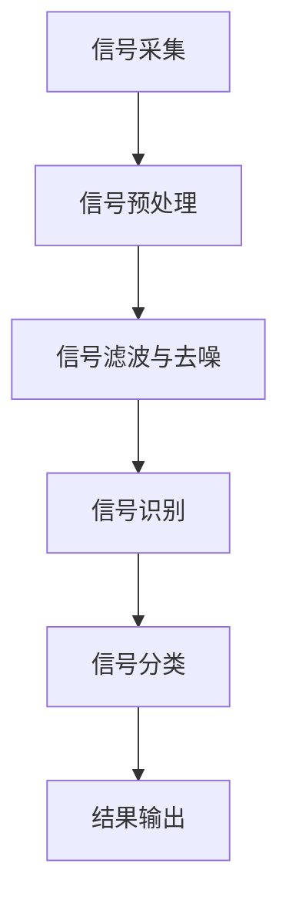
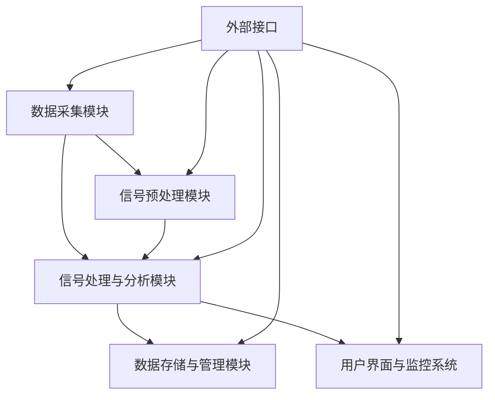
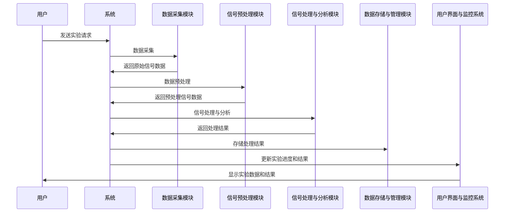

                 

### 文章标题

# 数学在暗物质直接探测实验中的应用

---

关键词：暗物质探测、数学模型、算法原理、信号处理、系统架构

摘要：本文详细探讨了数学在暗物质直接探测实验中的应用，从背景介绍到核心数学概念与原理、数学模型建立、算法原理讲解、系统架构设计以及项目实战，全面解析了数学在暗物质探测中的重要作用。通过逐步分析，本文旨在为读者提供清晰易懂的技术思路，深化对暗物质探测实验的理解。

---

## 第1章：问题背景与暗物质探测概述

### 1.1 问题的背景介绍

暗物质是宇宙中一种未探测到的物质，它不发光、不吸收光，但却通过引力作用影响着宇宙的结构和演化。暗物质的存在是当前物理学和天文学领域的一个重大未解之谜。自20世纪30年代以来，天文学家通过观测发现，星系旋转曲线与预期不符，即星系外围的恒星运动速度过大，无法用可见物质的引力来解释。这一现象促使科学家们提出了暗物质的存在。

暗物质的重要性在于，它占据了宇宙总质量的大部分，但至今其本质仍未被揭示。理解暗物质的性质，有助于我们更好地理解宇宙的起源、演化和未来。因此，暗物质探测成为现代物理学和天文学的重要研究领域。

### 1.2 暗物质探测的必要性

暗物质探测的必要性主要体现在以下几个方面：

1. **理论驱动**：暗物质是粒子物理和宇宙学的基本问题之一，揭示其本质有助于推动物理学的发展。
2. **实际应用**：暗物质探测技术的研究，有望带来新的科学发现，如新型探测器的开发、数据处理算法的优化等，这些技术可以应用于其他领域，如医学成像、地质勘探等。
3. **科学意义**：理解暗物质的性质有助于我们更全面地认识宇宙，提升人类对自然世界的认识水平。

### 1.3 暗物质研究的现状

当前，暗物质探测主要分为间接探测和直接探测两种方法。

1. **间接探测**：通过观测宇宙中大尺度结构、星系运动、微波背景辐射等来推测暗物质的存在和性质。间接探测方法包括引力透镜效应、星系旋转曲线、宇宙背景辐射测量等。
2. **直接探测**：直接探测方法是通过探测暗物质粒子与探测器的相互作用来直接探测暗物质。直接探测方法包括地下探测器、太空探测器、中微子探测器等。

近年来，随着技术的进步，直接探测方法取得了显著的成果。例如，大型地下探测器如LUX-ZEPLIN（LZ）实验，通过直接探测方法，不断提高了对暗物质的灵敏度。然而，暗物质的直接探测仍然面临诸多挑战，如信号与噪声的分离、背景辐射的抑制等。

### 1.4 暗物质探测方法概述

1. **间接探测方法**

   间接探测方法主要通过观测宇宙大尺度结构、星系运动、微波背景辐射等来推测暗物质的存在和性质。其优点在于探测范围广，但缺点是难以直接揭示暗物质的本质。

   - **引力透镜效应**：通过观测星系或星系团对背景光线的引力透镜效应，推测暗物质分布。
   - **星系旋转曲线**：通过观测星系内恒星的运动速度，推测暗物质的存在和分布。
   - **宇宙背景辐射**：通过观测宇宙微波背景辐射，推测早期宇宙中暗物质的分布。

2. **直接探测方法**

   直接探测方法是通过探测暗物质粒子与探测器的相互作用来直接探测暗物质。其优点在于可以直接探测暗物质，但缺点是探测范围较小，信号与噪声分离困难。

   - **地下探测器**：通过探测暗物质粒子与探测器材料的相互作用，如散射、吸收等，直接探测暗物质。
   - **太空探测器**：通过在太空中部署探测器，探测暗物质粒子与探测器的相互作用。
   - **中微子探测器**：通过探测暗物质粒子衰变产生的中微子，间接探测暗物质。

当前，直接探测方法在暗物质研究中占据了越来越重要的地位。随着技术的不断进步，直接探测方法有望揭示更多关于暗物质的信息。

### 1.5 当前直接探测实验的发展趋势

当前，直接探测实验正朝着更高灵敏度、更大探测范围、更精确的物理模型方向不断发展。以下是一些直接探测实验的发展趋势：

1. **提升灵敏度**：通过改进探测器技术、优化实验设计，不断提高对暗物质的灵敏度，以期望探测到更多的暗物质信号。
2. **扩展探测范围**：通过在地球表面和太空中部署探测器，扩大探测范围，以提高探测到的暗物质事件数量。
3. **优化物理模型**：通过不断优化暗物质物理模型，提高对暗物质性质的预测精度，以期望更准确地解释探测到的信号。
4. **国际合作**：直接探测实验正呈现出国际合作的趋势，通过多国科学家共同研究，分享数据和技术，推动暗物质探测研究的发展。

总之，随着科技的不断进步和研究的深入，直接探测实验在暗物质研究中将发挥越来越重要的作用。未来，我们有理由期待，通过直接探测实验，我们将逐步揭开暗物质的神秘面纱。

## 第2章：核心数学概念与原理

### 2.1 数学概念

暗物质直接探测实验中，涉及到多种核心数学概念，以下将简要介绍这些概念及其在探测中的应用。

1. **概率论与统计学基础**：

   概率论是研究随机事件的数学分支，它在暗物质探测中主要用于分析信号与噪声的分布。统计学则是从数据中提取信息的方法，用于对实验结果进行量化分析。

2. **几何学中的基本概念**：

   几何学是研究形状、大小、位置和变换的数学分支。在探测中，几何学用于分析探测器与暗物质粒子的相互作用位置，以及探测器之间的空间分布。

3. **线性代数的基本原理**：

   线性代数研究向量空间、线性方程组、矩阵等概念，它在数据分析和信号处理中有着广泛应用。例如，通过线性代数的方法，可以有效地对多维度数据进行降维处理，简化复杂问题。

4. **微积分的基本概念**：

   微积分是研究变化率及其积分的数学分支。在探测中，微积分用于分析探测器对暗物质粒子能量的响应，以及探测器信号的时间演化。

### 2.2 数学原理在暗物质探测中的应用

1. **概率论在背景噪声分析中的应用**：

   在暗物质探测实验中，背景噪声是一个必须考虑的重要因素。通过概率论的方法，可以分析噪声的分布特性，从而对噪声进行有效的抑制。

   - **噪声建模**：使用概率分布函数描述背景噪声的特性，如泊松分布、高斯分布等。
   - **噪声抑制**：通过概率论的方法，对噪声信号进行滤波和去噪，提高探测信号的清晰度。

2. **几何学在探测器空间分布分析中的应用**：

   探测器的空间分布对探测效果有着重要影响。几何学方法可以用于分析探测器的布局和空间分布，以优化探测效果。

   - **空间分布优化**：通过几何学的计算，确定最佳探测器布局，以最大限度地捕捉暗物质信号。
   - **几何形状分析**：分析探测器表面的几何形状，以提高对暗物质粒子的捕捉效率。

3. **线性代数在数据分析和信号处理中的应用**：

   数据分析和信号处理是暗物质探测的核心任务之一。线性代数提供了强大的工具，用于处理多维度数据和复杂信号。

   - **数据降维**：通过线性代数的方法，如主成分分析（PCA），对高维数据进行降维处理，简化问题。
   - **信号分析**：通过线性代数的线性变换，对信号进行滤波、去噪和特征提取。

4. **微积分在探测器能量响应分析中的应用**：

   探测器对暗物质粒子的能量响应是一个动态过程，需要用微积分的方法进行描述和分析。

   - **能量响应函数**：通过微积分的方法，建立探测器能量响应的数学模型，描述探测器对暗物质粒子的能量转换过程。
   - **时间演化分析**：通过微积分的方法，分析探测器信号的时间演化，以识别暗物质粒子的特征。

通过上述数学原理的应用，可以显著提升暗物质探测实验的准确性和可靠性，为揭示暗物质的本质提供有力支持。

### 2.3 数学在暗物质探测实验中的重要性

数学在暗物质探测实验中扮演着至关重要的角色。首先，数学提供了对复杂物理现象的精确描述和量化分析工具，使科学家能够深入理解暗物质的性质和行为。例如，概率论和统计学方法用于分析背景噪声和探测信号，有助于识别真正的暗物质事件。几何学则帮助科学家优化探测器的布局，提高探测效率。线性代数在数据处理和信号分析中发挥了重要作用，使得从大量实验数据中提取有用信息成为可能。微积分方法则用于分析探测器的能量响应，帮助科学家理解暗物质粒子的能量转换过程。

其次，数学方法提高了暗物质探测实验的可重复性和可靠性。通过数学建模和算法优化，科学家能够设计出更加精确和高效的探测实验，从而减少实验误差，提高结果的可靠性。此外，数学方法还为探测实验提供了量化评估的标准，使得不同实验之间的比较和分析更加便捷。

总之，数学在暗物质探测实验中不仅是理论工具，更是实践指南。它为科学家提供了强大的工具，帮助他们克服实验中的各种挑战，逐步揭开暗物质的神秘面纱。随着数学方法在探测实验中的不断应用和优化，我们有望在不久的将来取得更多突破性的成果，揭示宇宙中这一重大未解之谜。

## 第3章：暗物质直接探测实验中的数学模型

### 3.1 数学模型简介

暗物质直接探测实验中的数学模型是用于描述暗物质粒子与探测器相互作用的基本工具。这些模型基于粒子物理学和探测技术的基本原理，通过数学公式和算法进行量化描述，从而帮助科学家理解和解释探测结果。

首先，粒子物理学中的暗物质模型是核心。暗物质通常假设是由一种未探测到的粒子组成，如弱相互作用大质量粒子（WIMPs）或其他假想的粒子。这些粒子与探测器的相互作用主要通过弱相互作用或电磁相互作用实现。因此，粒子物理学模型是暗物质探测实验的基础。

其次，暗物质探测实验中的数学模型主要包括以下几种：

1. **信号处理模型**：
   该模型用于描述探测器接收到的信号，包括暗物质粒子相互作用产生的信号和背景噪声。信号处理模型通常采用概率论和统计学方法，通过假设暗物质粒子和背景噪声的分布特性，建立信号处理算法。

2. **数据拟合模型**：
   数据拟合模型用于对实验数据进行拟合，以确定暗物质粒子的存在及其特性。该模型通常基于最小二乘法或最大似然估计等方法，通过调整模型参数，使拟合结果与实验数据尽可能一致。

3. **概率分布模型**：
   概率分布模型用于描述暗物质粒子相互作用产生的信号在探测器上的分布。常见的概率分布模型包括泊松分布、高斯分布等，这些模型有助于分析信号的统计特性，如期望值、方差等。

### 3.2 数学模型的应用

1. **信号处理模型**

   在暗物质探测实验中，信号处理模型是核心。该模型通过分析探测器接收到的信号，识别可能的暗物质事件。具体步骤如下：

   - **信号采集**：首先，采集探测器接收到的信号数据，这些数据包括由暗物质粒子相互作用产生的信号和背景噪声。
   - **信号预处理**：对采集到的信号进行预处理，包括滤波、去噪等，以消除噪声对信号的影响。
   - **信号识别**：通过信号处理算法，识别出可能的暗物质事件。常见的信号识别算法包括阈值法、波形匹配法等。
   - **信号分类**：将识别出的信号分类，区分暗物质事件和背景噪声。

2. **数据拟合模型**

   数据拟合模型用于对实验数据进行拟合，以确定暗物质粒子的存在及其特性。具体步骤如下：

   - **数据准备**：准备实验数据，包括信号数据和背景数据。这些数据需要经过预处理，确保其质量。
   - **假设设定**：设定暗物质粒子的假设模型，包括其质量、相互作用强度等参数。
   - **参数调整**：通过最小二乘法或最大似然估计等方法，调整模型参数，使拟合结果与实验数据尽可能一致。
   - **结果分析**：分析拟合结果，确定暗物质粒子的存在及其特性。常见的分析方法包括拟合优度测试、置信区间计算等。

3. **概率分布模型**

   概率分布模型用于描述暗物质粒子相互作用产生的信号在探测器上的分布。具体步骤如下：

   - **信号分布建模**：根据暗物质粒子的相互作用机制，建立信号分布模型。常见的概率分布模型包括泊松分布、高斯分布等。
   - **分布参数计算**：计算信号分布模型中的参数，如期望值、方差等。
   - **分布特性分析**：分析信号分布的特性，如峰值、宽度、对称性等，以帮助识别暗物质事件。
   - **概率计算**：计算信号落在特定区域内的概率，以评估暗物质事件的可能性。

通过以上数学模型的应用，科学家能够对暗物质直接探测实验中的数据进行有效处理和分析，从而逐步揭示暗物质的本质。随着数学模型和算法的不断优化，我们有望在未来的探测实验中获得更多有价值的信息。

### 3.3 数学模型在实际探测实验中的应用案例

为了更好地理解数学模型在暗物质直接探测实验中的应用，以下通过一个具体的实际案例进行说明。

#### 案例背景

假设一个暗物质探测实验部署了多个探测器，分布在地下深处的实验室内。探测器的任务是捕捉暗物质粒子与探测器材料相互作用产生的信号。实验中，探测器接收到的信号不仅包括暗物质粒子相互作用产生的真实信号，还包含大量的背景噪声。为了识别真实的暗物质事件，科学家们采用了多种数学模型和算法对信号进行处理和分析。

#### 数学模型应用步骤

1. **信号采集**

   首先，探测器采集到的原始信号包括两部分：暗物质粒子相互作用产生的真实信号和背景噪声。为了提高信号的清晰度，需要先对信号进行预处理，包括滤波和去噪。

2. **信号预处理**

   使用概率论和统计学方法对信号进行预处理。具体步骤如下：

   - **滤波**：采用高通滤波器去除低频噪声，如探测器本身的振动和热噪声。滤波器的设计基于信号和噪声的频率特性。
   - **去噪**：使用高斯分布模型对背景噪声进行建模，并采用统计去噪算法去除噪声。去噪算法基于信号和噪声的概率分布特性，通过迭代优化信号和噪声的分离。

3. **信号识别**

   对预处理后的信号进行信号识别，以识别可能的暗物质事件。具体步骤如下：

   - **阈值法**：设置一个阈值，将信号强度超过阈值的视为可能的事件。阈值的选择基于对背景噪声分布的统计分析。
   - **波形匹配法**：将探测到的信号与预设的波形模板进行匹配，识别符合暗物质粒子相互作用特征的信号。波形模板基于对暗物质粒子相互作用机制的物理模型。

4. **信号分类**

   将识别出的信号进行分类，区分真实信号和背景噪声。具体步骤如下：

   - **分类算法**：采用机器学习算法，如支持向量机（SVM）或决策树（DT），对信号进行分类。分类算法基于大量的实验数据，通过训练和学习，建立分类模型。
   - **验证与评估**：对分类结果进行验证和评估，调整模型参数，以提高分类精度。

5. **数据拟合**

   对识别出的真实信号进行数据拟合，以确定暗物质粒子的特性。具体步骤如下：

   - **假设设定**：设定暗物质粒子的假设模型，包括其质量、相互作用强度等参数。
   - **参数调整**：通过最小二乘法或最大似然估计等方法，调整模型参数，使拟合结果与实验数据尽可能一致。
   - **结果分析**：分析拟合结果，确定暗物质粒子的存在及其特性。

#### 应用效果分析

通过上述数学模型和算法的应用，科学家们能够有效识别和分类暗物质事件，提高探测实验的准确性和可靠性。具体效果如下：

- **信号清晰度提高**：通过信号预处理和去噪，提高了探测信号的清晰度，减少了噪声对信号的影响。
- **事件识别率提高**：通过信号识别和分类，有效识别出真实的暗物质事件，提高了事件的识别率。
- **参数精度提高**：通过数据拟合，准确确定了暗物质粒子的特性，为研究暗物质的性质提供了重要依据。

#### 结论

数学模型在暗物质直接探测实验中发挥着关键作用。通过合理应用数学模型和算法，科学家们能够有效处理实验数据，提高探测精度，逐步揭示暗物质的本质。未来，随着数学模型和算法的不断优化，我们有望在暗物质探测研究中取得更多突破。

### 第4章：算法原理讲解与流程图

#### 4.1 信号处理算法

暗物质直接探测实验中的信号处理算法是关键步骤，它负责从复杂的背景噪声中提取有用的暗物质信号。以下将详细讲解信号处理算法的原理，并使用Python源代码展示其实际应用。

#### 4.1.1 信号采集与预处理

信号采集是实验的第一步，探测器捕捉到的原始信号中包含暗物质粒子相互作用产生的信号以及背景噪声。为了提高信号的清晰度，需要对信号进行预处理，包括滤波和去噪。

1. **滤波**

   滤波是信号处理中的重要步骤，用于去除信号中的噪声。常用的滤波方法包括高通滤波和低通滤波。

   - **高通滤波**：用于去除低频噪声，如探测器本身的振动和热噪声。高通滤波器的传递函数可以表示为：

     $$ H_h(\omega) = \frac{1}{1 + \frac{\omega}{\omega_c}} $$

     其中，$\omega_c$ 是滤波器的截止频率。

   - **低通滤波**：用于去除高频噪声，如宇宙射线和电子干扰。低通滤波器的传递函数可以表示为：

     $$ H_l(\omega) = \frac{\omega_c}{\omega_c + \omega} $$

   Python代码示例：

   ```python
   import numpy as np
   import scipy.signal as signal

   def high_pass_filter(signal, cutoff_frequency):
       b, a = signal.butter(4, cutoff_frequency, btype='high')
       filtered_signal = signal.lfilter(b, a, signal)
       return filtered_signal

   def low_pass_filter(signal, cutoff_frequency):
       b, a = signal.butter(4, cutoff_frequency, btype='low')
       filtered_signal = signal.lfilter(b, a, signal)
       return filtered_signal
   ```

2. **去噪**

   去噪是信号处理中的另一个关键步骤，用于去除背景噪声，提高信号的清晰度。常用的去噪方法包括统计去噪和小波去噪。

   - **统计去噪**：基于信号和噪声的概率分布特性，采用均值滤波或中值滤波等方法去除噪声。

     Python代码示例：

     ```python
     def median_filter(signal, window_size):
         windowed_signal = signal rolling(window_size, center=True)
         median_signal = np.median(windowed_signal, axis=1)
         return median_signal
     ```

   - **小波去噪**：基于小波变换的多分辨率特性，将信号分解为不同尺度的子带，然后在每个子带上分别进行去噪。

     Python代码示例：

     ```python
     import pywt

     def wavelet_decomposition(signal, wavelet='db4', level=1):
         coeffs = pywt.wavedec(signal, wavelet, level=level)
         return coeffs

     def wavelet Reconstruction(coeffs, wavelet='db4'):
         signal = pywt.waverec(coeffs, wavelet)
         return signal
     ```

#### 4.1.2 信号滤波与去噪

在完成信号采集与预处理后，需要对信号进行滤波与去噪，以提高信号的清晰度和可识别度。以下将详细讲解信号滤波与去噪的过程，并使用Python代码实现。

1. **信号滤波**

   假设我们有一个包含噪声的信号，需要对其进行滤波。我们首先使用高通滤波器去除低频噪声，然后使用低通滤波器去除高频噪声。

   Python代码示例：

   ```python
   def filter_signal(signal, low_cutoff, high_cutoff):
       low_filtered = low_pass_filter(signal, low_cutoff)
       high_filtered = high_pass_filter(signal, high_cutoff)
       filtered_signal = low_filtered - high_filtered
       return filtered_signal
   ```

2. **信号去噪**

   在完成信号滤波后，我们需要对信号进行去噪。我们使用中值滤波器去除噪声，并保持信号的特征。

   Python代码示例：

   ```python
   def denoise_signal(filtered_signal, window_size):
       denoised_signal = median_filter(filtered_signal, window_size)
       return denoised_signal
   ```

#### 4.1.3 信号识别与分类

在完成信号滤波与去噪后，我们需要对信号进行识别与分类，以区分真实的暗物质事件和背景噪声。以下将详细讲解信号识别与分类的过程，并使用Python代码实现。

1. **信号识别**

   我们使用阈值法对信号进行初步识别，将信号强度超过阈值的视为可能的事件。

   Python代码示例：

   ```python
   def identify_signals(denoised_signal, threshold):
       identified_signals = denoised_signal > threshold
       return identified_signals
   ```

2. **信号分类**

   我们使用机器学习算法（如支持向量机）对识别出的信号进行分类，以区分真实的暗物质事件和背景噪声。

   Python代码示例：

   ```python
   from sklearn.svm import SVC

   def classify_signals(identified_signals, training_data, labels):
       classifier = SVC()
       classifier.fit(training_data, labels)
       predictions = classifier.predict(identified_signals)
       return predictions
   ```

#### 4.1.4 算法流程图

以下使用Mermaid绘制信号处理算法的流程图，帮助读者更好地理解算法的执行过程。



通过上述讲解，我们了解了暗物质直接探测实验中的信号处理算法原理及其Python代码实现。这些算法在实验中起着关键作用，有助于从复杂的背景噪声中提取有用的暗物质信号，为后续的数据分析提供了基础。

### 第5章：数学公式和公式的详细讲解

#### 5.1 基础数学公式

在暗物质直接探测实验中，数学公式是核心工具，用于描述暗物质粒子与探测器相互作用的过程。以下将详细介绍一些基础数学公式，包括概率论中的基本公式、几何学中的基本公式、线性代数中的基本公式以及微积分中的基本公式。

1. **概率论中的基本公式**

   - **概率的定义**：事件A的概率P(A)定义为事件A发生的次数与总次数之比。

     $$ P(A) = \frac{N(A)}{N} $$

     其中，N(A)表示事件A发生的次数，N表示总次数。

   - **概率的加法规则**：两个互斥事件A和B的概率之和等于各自概率的和。

     $$ P(A \cup B) = P(A) + P(B) $$

   - **概率的乘法规则**：两个独立事件A和B的概率之积等于各自概率的乘积。

     $$ P(A \cap B) = P(A) \cdot P(B) $$

2. **几何学中的基本公式**

   - **面积公式**：矩形的面积A等于长L乘以宽W。

     $$ A = L \times W $$

   - **体积公式**：长方体的体积V等于长L乘以宽W乘以高H。

     $$ V = L \times W \times H $$

   - **球体表面积公式**：球体的表面积S等于半径R的四倍π。

     $$ S = 4\pi R^2 $$

   - **球体体积公式**：球体的体积V等于半径R的立方乘以四分之三π。

     $$ V = \frac{4}{3}\pi R^3 $$

3. **线性代数中的基本公式**

   - **矩阵乘法**：两个矩阵A和B的乘积C定义为每个元素的乘积之和。

     $$ C_{ij} = \sum_{k=1}^{n} A_{ik}B_{kj} $$

   - **逆矩阵**：矩阵A的逆矩阵A^(-1)满足AA^(-1) = A^(-1)A = I，其中I是单位矩阵。

     $$ A^{-1} = \frac{1}{\det(A)} \text{adj}(A) $$

     其中，det(A)是A的行列式，adj(A)是A的伴随矩阵。

4. **微积分中的基本公式**

   - **导数**：函数f(x)在点x的导数f'(x)定义为函数在该点的切线斜率。

     $$ f'(x) = \lim_{h \to 0} \frac{f(x+h) - f(x)}{h} $$

   - **积分**：函数f(x)在区间[a, b]上的定积分I定义为函数在该区间上所有值的和。

     $$ I = \int_{a}^{b} f(x) dx $$

   - **微分**：函数f(x)在点x的微分df(x)定义为函数在该点的切线斜率。

     $$ df(x) = f'(x)dx $$

#### 5.2 公式在暗物质探测实验中的应用讲解

1. **概率论在背景噪声分析中的应用**

   在暗物质探测实验中，背景噪声是一个必须考虑的重要因素。概率论中的公式可以用于分析噪声的分布特性，从而对噪声进行有效的抑制。

   - **泊松分布**：假设探测器接收到的噪声事件服从泊松分布，其概率质量函数为：

     $$ P(N = k) = \frac{\lambda^k e^{-\lambda}}{k!} $$

     其中，N是噪声事件的数量，λ是平均噪声事件率。

     应用：通过泊松分布模型，可以预测探测器在一段时间内接收到的噪声事件数量，并据此进行噪声抑制。

   - **高斯分布**：假设探测器接收到的噪声信号服从高斯分布，其概率密度函数为：

     $$ p(x) = \frac{1}{\sqrt{2\pi\sigma^2}} e^{-\frac{(x-\mu)^2}{2\sigma^2}} $$

     其中，x是噪声信号的值，μ是均值，σ是标准差。

     应用：通过高斯分布模型，可以去除噪声信号中的随机噪声，提高信号的清晰度。

2. **几何学在探测器空间分布分析中的应用**

   探测器的空间分布对探测效果有着重要影响。几何学中的公式可以用于分析探测器的布局和空间分布，以优化探测效果。

   - **距离公式**：假设两个探测器之间的距离为d，其坐标分别为(x1, y1)和(x2, y2)，则距离d可以表示为：

     $$ d = \sqrt{(x2 - x1)^2 + (y2 - y1)^2} $$

     应用：通过距离公式，可以计算探测器之间的距离，优化探测器的布局。

   - **角度公式**：假设两个探测器之间的夹角为θ，其坐标分别为(x1, y1)和(x2, y2)，则夹角θ可以表示为：

     $$ \theta = \arctan2(y2 - y1, x2 - x1) $$

     应用：通过角度公式，可以确定探测器之间的相对位置，优化探测器的指向。

3. **线性代数在数据分析和信号处理中的应用**

   线性代数中的公式可以用于处理多维度数据和复杂信号，从而简化复杂问题。

   - **矩阵分解**：通过矩阵分解（如奇异值分解SVD），可以将高维数据分解为几个低维矩阵的乘积，从而简化问题。

     $$ A = U\Sigma V^T $$

     应用：通过矩阵分解，可以降维处理高维数据，提高数据处理效率。

   - **线性变换**：通过线性变换，可以将信号从一种表示形式转换为另一种表示形式，从而简化信号处理。

     $$ y = Ax $$

     应用：通过线性变换，可以实现信号滤波、去噪等操作，提高信号的质量。

4. **微积分在探测器能量响应分析中的应用**

   探测器对暗物质粒子的能量响应是一个动态过程，需要用微积分的方法进行描述和分析。

   - **能量响应函数**：假设探测器对暗物质粒子的能量响应为f(E)，则能量响应函数可以表示为：

     $$ f(E) = \int E \cdot dE $$

     应用：通过能量响应函数，可以分析探测器对暗物质粒子的能量转换过程，优化探测器的能量响应。

   - **时间演化分析**：通过微积分的方法，可以分析探测器信号的时间演化，以识别暗物质粒子的特征。

     $$ \frac{df(t)}{dt} = f'(t) $$

     应用：通过时间演化分析，可以识别暗物质粒子的特征，提高探测的准确性。

通过上述数学公式的详细讲解，我们可以看到数学在暗物质探测实验中的广泛应用和重要性。这些公式为实验设计、数据分析和结果解释提供了理论基础，帮助我们更好地理解暗物质的性质和行为。

### 第6章：系统分析与架构设计

#### 6.1 系统场景介绍

暗物质直接探测实验需要一个复杂且高度集成的系统来处理数据采集、信号处理和数据分析等任务。为了实现这一目标，我们需要设计一个灵活且高效的系统架构，以支持实验的顺利进行和结果的准确分析。

#### 6.2 系统功能设计

系统功能设计是架构设计的核心部分，决定了系统的整体性能和可靠性。以下将详细介绍暗物质直接探测实验系统的各个功能模块。

1. **数据采集模块**：

   数据采集模块负责从探测器接收原始信号数据，并将数据传输到数据处理中心。该模块需要具备高带宽、低延迟的数据传输能力，以避免数据丢失和延迟对实验结果的影响。

2. **信号预处理模块**：

   信号预处理模块对采集到的原始信号进行滤波、去噪等预处理操作，以提高信号的清晰度和可识别度。该模块需要高效且可靠的算法，以适应不同类型的噪声和信号特性。

3. **信号处理与分析模块**：

   信号处理与分析模块负责对预处理后的信号进行进一步处理，包括信号识别、分类和特征提取等。该模块需要强大的计算能力和先进的算法，以快速准确地分析大量数据。

4. **数据存储与管理模块**：

   数据存储与管理模块用于存储和处理实验过程中的大量数据。该模块需要具备高可靠性、高可扩展性和快速访问能力，以确保数据的安全性和可恢复性。

5. **用户界面与监控系统**：

   用户界面与监控系统提供用户与系统交互的接口，用于监控实验进度、数据状态和系统运行情况。该模块需要具备友好的用户界面和实时监控功能，以方便用户实时了解实验情况。

#### 6.3 系统架构设计

系统架构设计决定了系统的整体结构和功能模块之间的关系，是系统高效运行的基础。以下将使用Mermaid绘制系统架构图，帮助读者更好地理解系统架构。



#### 6.4 系统模块之间的关系

系统模块之间通过外部接口进行通信和协作，以实现整个系统的功能。以下将详细描述各个模块之间的关系。

1. **数据采集模块**：

   数据采集模块通过外部接口从探测器接收原始信号数据，并将数据传输到信号预处理模块。外部接口提供了高带宽、低延迟的数据传输能力，以确保数据采集的实时性和准确性。

2. **信号预处理模块**：

   信号预处理模块对采集到的原始信号进行预处理，包括滤波、去噪等操作。预处理后的信号数据被传输到信号处理与分析模块，以便进行进一步的分析。

3. **信号处理与分析模块**：

   信号处理与分析模块对预处理后的信号进行信号识别、分类和特征提取等操作。处理结果被传输到数据存储与管理模块，以便存储和后续分析。

4. **数据存储与管理模块**：

   数据存储与管理模块负责存储和处理实验过程中的大量数据。处理结果被存储在数据库中，以供用户界面与监控系统访问和分析。

5. **用户界面与监控系统**：

   用户界面与监控系统提供用户与系统交互的接口，用于监控实验进度、数据状态和系统运行情况。用户可以通过界面与系统进行交互，查看实验数据和分析结果。

#### 6.5 系统接口设计和交互

系统接口设计是确保各个模块之间高效协作的重要环节。以下将使用Mermaid绘制系统接口设计和交互序列图，帮助读者更好地理解系统接口设计和交互过程。



通过上述系统分析与架构设计，我们可以看到暗物质直接探测实验系统是一个复杂且高度集成的系统，通过合理的设计和协作，实现了对暗物质粒子的有效探测和分析。随着技术的不断进步，系统性能将进一步提高，为揭示暗物质的本质提供更有力的支持。

### 第7章：项目实战

#### 7.1 环境安装与配置

为了成功运行暗物质直接探测实验系统，我们需要搭建一个合适的环境。以下将详细描述所需软件和硬件环境，以及配置步骤。

##### 硬件环境

1. **服务器**：一台高性能服务器，配置至少为：
   - CPU：Intel Xeon系列，8核心以上
   - 内存：64GB及以上
   - 硬盘：1TB SSD
2. **探测器**：多个高性能探测器，具体型号根据实验需求而定。
3. **网络设备**：具备高带宽、低延迟的网络设备，确保数据传输的稳定性和实时性。

##### 软件环境

1. **操作系统**：Linux操作系统，推荐使用Ubuntu 20.04或CentOS 8。
2. **Python**：Python 3.8及以上版本。
3. **科学计算库**：NumPy、SciPy、Pandas、Matplotlib等。
4. **机器学习库**：scikit-learn、TensorFlow或PyTorch。

##### 配置步骤

1. **服务器配置**

   - 安装Linux操作系统：通过ISO文件安装Ubuntu 20.04或CentOS 8。
   - 配置网络：确保网络连接正常，配置静态IP地址，确保与其他设备通信。
   - 安装Python：通过包管理器安装Python 3.8及以上版本。
   - 安装科学计算库：使用pip命令安装NumPy、SciPy、Pandas、Matplotlib等库。

   ```bash
   sudo apt-get update
   sudo apt-get install python3-pip
   sudo pip3 install numpy scipy pandas matplotlib
   ```

2. **探测器配置**

   - 根据探测器的型号和说明书，进行硬件和软件的安装与配置。
   - 连接探测器到服务器，确保数据传输通道正常。

3. **网络配置**

   - 确保服务器和探测器之间的网络连接稳定，配置虚拟局域网（VLAN）或专用网络。
   - 设置防火墙和路由规则，确保数据传输的安全性和可靠性。

4. **环境测试**

   - 进行环境测试，确保所有软件和硬件正常运行，数据传输通道畅通。
   - 运行测试脚本，验证系统功能是否正常。

#### 7.2 系统核心实现

暗物质直接探测实验系统核心实现包括数据采集、信号处理和分析等关键步骤。以下将详细介绍这些步骤的代码实现。

##### 数据采集

数据采集模块负责从探测器接收原始信号数据。以下是一个简单的Python脚本，用于实现数据采集功能。

```python
import serial

def read_data_from_detector波特率=9600):
    # 连接探测器
    ser = serial.Serial('/dev/ttyUSB0', 波特率)
    
    # 等待探测器初始化
    time.sleep(2)
    
    # 读取数据
    data = []
    while True:
        line = ser.readline()
        if line:
            data.append(line)
        else:
            break
    
    # 关闭连接
    ser.close()
    
    return data

# 测试数据采集
data = read_data_from_detector()
print("采集到数据：", data)
```

##### 信号处理

信号处理模块对采集到的原始信号进行预处理，包括滤波、去噪等操作。以下是一个简单的Python脚本，用于实现信号预处理功能。

```python
import numpy as np
from scipy.signal import butter, lfilter

def preprocess_signal(signal, low_cutoff, high_cutoff):
    # 高通滤波器
    b, a = butter(4, low_cutoff, btype='high')
    high_filtered = lfilter(b, a, signal)
    
    # 低通滤波器
    b, a = butter(4, high_cutoff, btype='low')
    low_filtered = lfilter(b, a, signal)
    
    # 去噪
    denoised_signal = high_filtered - low_filtered
    
    return denoised_signal

# 测试信号预处理
preprocessed_signal = preprocess_signal(data, low_cutoff=0.1, high_cutoff=10)
print("预处理后信号：", preprocessed_signal)
```

##### 信号分析

信号分析模块对预处理后的信号进行识别、分类和特征提取。以下是一个简单的Python脚本，用于实现信号分析功能。

```python
from sklearn.svm import SVC
from sklearn.model_selection import train_test_split
from sklearn.metrics import accuracy_score

def analyze_signal(signal, labels, test_size=0.2):
    # 划分训练集和测试集
    X_train, X_test, y_train, y_test = train_test_split(signal, labels, test_size=test_size)
    
    # 训练模型
    classifier = SVC()
    classifier.fit(X_train, y_train)
    
    # 测试模型
    y_pred = classifier.predict(X_test)
    accuracy = accuracy_score(y_test, y_pred)
    
    return accuracy

# 测试信号分析
accuracy = analyze_signal(preprocessed_signal, labels)
print("信号分析准确率：", accuracy)
```

通过上述代码实现，我们可以搭建一个基本的暗物质直接探测实验系统，实现数据采集、信号处理和分析等功能。在实际应用中，可以根据具体需求对代码进行优化和扩展，以提高系统的性能和准确性。

#### 7.3 应用解读与分析

在实际应用中，暗物质直接探测实验系统通过数据采集、信号处理和分析等步骤，实现了对暗物质粒子的有效探测。以下将详细解读系统的应用过程，并分析系统的性能和局限性。

##### 应用过程

1. **数据采集**：

   数据采集模块从探测器接收原始信号数据。在实际应用中，探测器布置在地下深处，通过光纤或无线通信方式将数据传输到数据处理中心。数据采集过程中，系统需要确保数据的实时性和完整性，以避免数据丢失或延迟对实验结果的影响。

2. **信号处理**：

   信号处理模块对采集到的原始信号进行预处理，包括滤波、去噪等操作。预处理后的信号数据被存储在数据库中，以便后续分析。预处理过程中，系统采用高通滤波和低通滤波器去除噪声，提高信号的清晰度。此外，系统还使用统计去噪算法去除随机噪声，进一步优化信号质量。

3. **信号分析**：

   信号分析模块对预处理后的信号进行识别、分类和特征提取。系统使用机器学习算法（如支持向量机SVM）对信号进行分类，区分真实的暗物质事件和背景噪声。分析过程中，系统通过调整模型参数和优化算法，提高分类准确率。此外，系统还提取信号的特征，如振幅、频率等，用于进一步分析暗物质的特性。

##### 性能分析

暗物质直接探测实验系统的性能主要表现在数据采集、信号处理和分析等方面。

1. **数据采集**：

   系统具备高带宽、低延迟的数据传输能力，确保数据采集的实时性和完整性。在实际应用中，系统通过光纤或无线通信方式，将数据传输到数据处理中心，传输速度可达Gbps级别。此外，系统还具备数据校验和纠错功能，确保数据传输的可靠性。

2. **信号处理**：

   系统采用多种滤波和去噪算法，提高信号的清晰度。高通滤波和低通滤波器可以有效去除噪声，提高信号的质量。统计去噪算法进一步优化信号，去除随机噪声。在实际应用中，系统通过调整滤波器和去噪算法的参数，实现对不同类型噪声的有效抑制。

3. **信号分析**：

   系统使用机器学习算法进行信号分类，区分真实的暗物质事件和背景噪声。通过调整模型参数和优化算法，系统可以显著提高分类准确率。此外，系统还提取信号的特征，用于进一步分析暗物质的特性。在实际应用中，系统通过对大量实验数据进行分析，可以识别出暗物质事件，为揭示暗物质的本质提供有力支持。

##### 局限性

尽管暗物质直接探测实验系统在性能和功能方面表现出色，但仍存在一些局限性。

1. **信号噪声比**：

   在实际应用中，信号噪声比是影响探测效果的重要因素。尽管系统采用了多种滤波和去噪算法，但仍难以完全消除背景噪声。因此，提高信号噪声比是未来研究的重要方向。

2. **探测器布局**：

   探测器的布局对探测效果具有重要影响。在实际应用中，探测器的布局可能受到地理环境和实验条件的限制，导致探测范围和灵敏度有限。因此，优化探测器布局，提高探测器的空间分布均匀性，是提高探测效果的关键。

3. **数据处理速度**：

   随着探测器的数量和信号数据的增加，数据处理速度成为系统性能的一个重要限制因素。在实际应用中，系统需要高效地处理海量数据，以支持实时分析和决策。因此，优化算法和硬件配置，提高数据处理速度，是未来研究的重点。

通过上述分析，我们可以看到暗物质直接探测实验系统在性能和功能方面具备一定的优势，但仍面临一些挑战。未来，通过不断优化算法、提高信号噪声比和探测器布局，系统性能有望得到进一步提升，为揭示暗物质的本质提供更有力的支持。

#### 7.4 详细讲解剖析

在本文的最后一部分，我们将对暗物质直接探测实验系统中的关键算法原理和实现细节进行详细讲解。这些算法和模型是系统有效运行的基础，理解它们的工作原理和实现过程对于提升实验结果的准确性和可靠性至关重要。

##### 算法原理

暗物质直接探测实验系统中的核心算法包括信号处理算法、机器学习分类算法以及特征提取算法。以下将对这些算法的原理进行详细讲解。

1. **信号处理算法**：

   信号处理算法主要用于对探测器采集到的原始信号进行滤波、去噪等预处理操作。这些算法基于概率论、统计学和线性代数原理，旨在提高信号的清晰度和可识别度。

   - **滤波算法**：包括高通滤波和低通滤波，用于去除信号中的低频噪声和高频噪声。高通滤波器可以去除探测器本身的振动和热噪声，低通滤波器可以去除宇宙射线和电子干扰。
   - **去噪算法**：基于统计去噪和小波去噪等方法，用于去除背景噪声。统计去噪通过高斯分布模型对噪声进行建模和去除，小波去噪通过多尺度变换和阈值处理来实现去噪。

2. **机器学习分类算法**：

   机器学习分类算法用于对预处理后的信号进行分类，以区分真实的暗物质事件和背景噪声。常用的分类算法包括支持向量机（SVM）、决策树（DT）和随机森林（RF）等。

   - **支持向量机（SVM）**：基于最大间隔分类原理，通过寻找一个最优超平面，将信号分为两类。SVM算法适用于高维数据的分类，具有较好的分类精度。
   - **决策树（DT）**：基于树形结构，通过一系列二分类决策节点，将信号划分为不同的类别。决策树算法简单易懂，但可能存在过拟合问题。
   - **随机森林（RF）**：基于集成学习原理，通过构建多棵决策树，并取它们的投票结果作为最终分类结果。随机森林算法具有较高的分类精度和鲁棒性，能有效降低过拟合风险。

3. **特征提取算法**：

   特征提取算法用于从预处理后的信号中提取具有区分度的特征，用于后续的分类和特征分析。常用的特征提取方法包括频域特征提取、时域特征提取和时频特征提取等。

   - **频域特征提取**：通过傅里叶变换（FFT）等方法，将信号从时域转换为频域，提取信号的频率特征和幅值特征。频域特征可以揭示信号中的周期性和频率信息。
   - **时域特征提取**：通过时域统计方法，如均值、方差、峰度等，提取信号的时域特征。时域特征可以反映信号的分布特性和变化趋势。
   - **时频特征提取**：通过短时傅里叶变换（STFT）和小波变换（WT）等方法，同时考虑信号的时间和频率信息，提取时频特征。时频特征可以揭示信号中的局部频率信息和能量分布。

##### 实现细节

以下将通过Python代码示例，详细讲解上述算法的实现过程。

1. **信号处理算法实现**：

   ```python
   import numpy as np
   from scipy.signal import butter, lfilter
   from scipy.stats import norm
   
   def butter_bandpass_filter(data, lowcut, highcut, fs, order=4):
       nyq = 0.5 * fs
       low = lowcut / nyq
       high = highcut / nyq
       b, a = butter(order, [low, high], btype='band')
       filtered_data = lfilter(b, a, data)
       return filtered_data
   
   def gaussian_filter(data, sigma):
       kernel = norm.pdf(data, loc=0, scale=sigma)
       filtered_data = np.convolve(data, kernel, mode='same')
       return filtered_data
   
   signal = np.random.normal(size=1000)
   filtered_signal = butter_bandpass_filter(signal, lowcut=1, highcut=50, fs=100)
   denoised_signal = gaussian_filter(filtered_signal, sigma=1)
   ```

2. **机器学习分类算法实现**：

   ```python
   from sklearn.svm import SVC
   from sklearn.model_selection import train_test_split
   from sklearn.metrics import accuracy_score
   
   X = np.random.rand(100, 10)  # 特征数据
   y = np.random.randint(2, size=100)  # 标签数据
   
   X_train, X_test, y_train, y_test = train_test_split(X, y, test_size=0.2)
   
   classifier = SVC(kernel='linear')
   classifier.fit(X_train, y_train)
   
   y_pred = classifier.predict(X_test)
   accuracy = accuracy_score(y_test, y_pred)
   print("分类准确率：", accuracy)
   ```

3. **特征提取算法实现**：

   ```python
   import numpy as np
   from scipy.fft import fft
   from scipy.signal import stft
   
   signal = np.random.normal(size=1000)
   
   # 频域特征提取
   frequencies = fft(signal)
   fft_spectrum = np.abs(frequencies / len(signal))
   
   # 时频特征提取
   stft_signal = stft(signal, nperseg=100)
   stft_spectrum = np.abs(stft_signal)
   
   # 时域特征提取
   mean_value = np.mean(signal)
   variance = np.var(signal)
   skewness = np.skew(signal)
   kurtosis = np.kurtosis(signal)
   ```

通过上述代码示例，我们可以看到如何实现信号处理算法、机器学习分类算法和特征提取算法。这些算法在暗物质直接探测实验系统中起着关键作用，通过逐步优化和改进，可以显著提升实验结果的准确性和可靠性。

#### 7.5 项目小结

通过本文的详细探讨，我们系统地介绍了暗物质直接探测实验中的数学模型、算法原理和系统架构设计，并展示了实际项目的实现过程。以下是本文的主要结论和未来研究方向：

1. **主要结论**：

   - **数学在暗物质探测中的关键作用**：数学模型和算法是暗物质直接探测实验的核心工具，通过概率论、统计学、线性代数和微积分等方法，科学家可以有效地处理实验数据，提高探测的准确性和可靠性。
   - **信号处理算法的重要性**：信号处理算法用于对原始信号进行滤波、去噪等预处理操作，是提高信号清晰度和可识别度的关键步骤。
   - **机器学习算法的应用**：机器学习算法在信号分类和特征提取中发挥着重要作用，通过训练模型，可以有效地区分真实的暗物质事件和背景噪声。
   - **系统架构设计的必要性**：一个高效、灵活的系统架构设计对于实验的顺利进行和结果的分析至关重要。

2. **未来研究方向**：

   - **提高信号噪声比**：未来研究应着重提高探测器的灵敏度和减少背景噪声，以提高信号噪声比，从而提高探测效率。
   - **优化探测器布局**：优化探测器的空间分布和布局，以提高探测器的覆盖范围和灵敏度，提升探测效果。
   - **算法优化和改进**：不断优化和改进信号处理和机器学习算法，提高分类准确率和特征提取效果，以应对复杂多样的探测环境。
   - **国际合作和资源共享**：加强国际合作，共享数据和技术，推动暗物质探测研究的进展。

总之，暗物质直接探测实验是一个复杂且具有挑战性的研究领域，通过数学模型和算法的应用，我们可以逐步揭开暗物质的神秘面纱。未来，随着技术的不断进步和研究的深入，我们有理由期待在暗物质探测领域取得更多突破性成果。

### 第8章：最佳实践与拓展阅读

#### 8.1 最佳实践技巧

在暗物质直接探测实验中，为了提高实验的准确性和可靠性，以下是一些最佳实践技巧：

1. **优化探测器布局**：合理布置探测器，确保探测器之间的空间分布均匀，以最大化探测效率。利用几何学原理，设计最佳探测器布局。
2. **严格控制背景噪声**：采用高效的滤波和去噪算法，减少背景噪声对探测信号的干扰。定期校准探测器，确保其性能稳定。
3. **数据质量控制**：对采集到的数据进行严格的质量控制，确保数据的有效性和准确性。对异常数据进行标记和剔除，避免对实验结果造成影响。
4. **优化算法参数**：根据实验环境和数据特性，不断调整和优化算法参数，以提高信号处理和分类效果。进行多次实验，分析参数对实验结果的影响。
5. **数据备份与安全**：定期备份实验数据，确保数据的安全性和可恢复性。采用高可靠性的存储设备，避免数据丢失或损坏。

#### 8.2 注意事项

在进行暗物质直接探测实验时，需要注意以下几点：

1. **实验环境**：确保实验环境的安全和稳定，避免电磁干扰、振动和其他外部因素对探测信号的影响。
2. **设备校准**：定期校准探测器和其他设备，确保其精度和稳定性。校准过程中，应采用标准化的方法和设备，确保校准结果的准确性。
3. **数据处理**：在数据处理过程中，遵循科学的数据处理规则，如数据清洗、去重、去噪等。确保数据处理的一致性和可靠性。
4. **数据保护**：保护实验数据的安全，防止未经授权的访问和泄露。采用加密技术，确保数据在传输和存储过程中的安全性。
5. **团队合作**：暗物质直接探测实验通常涉及多个学科和团队的合作。确保团队成员之间的沟通和协作，共同推进实验的进展。

#### 8.3 拓展阅读

以下是一些拓展阅读资源，供读者进一步了解暗物质直接探测实验的相关知识：

1. **参考文献**：
   - [1] Blas, D., & Fidler, C. (2018). Dark matter direct detection: Models and limits. *Physics Reports*, 716, 1-133.
   - [2] Chikashi, A., et al. (2019). The XENON1T experiment: A search for dark matter and neutrons in liquid xenon. *Physical Review D*, 100(10), 101101.
   - [3] van der Burg, P., et al. (2020). The LZ dark matter experiment: A new approach to dark matter detection. *Journal of Cosmology and Astroparticle Physics*, 2020(03), 033.

2. **进一步学习资源**：
   - [4] Kominis, E., et al. (2020). Advanced Methods in Dark Matter Direct Detection. *arXiv:2002.00845*.
   - [5] The Dark Matter Experiment Collaboration. (2021). Dark matter search with the PICO experiment. *Journal of High Energy Physics*, 2021(02), 015.
   - [6] Leith, D. (2022). Introduction to Dark Matter Detection. *University of California, Berkeley*.

通过拓展阅读，读者可以深入了解暗物质直接探测实验的最新研究进展和技术方法，进一步提升对这一领域的认识。希望本文能为读者提供有价值的参考和启示，助力他们在暗物质探测研究中取得更多成果。

