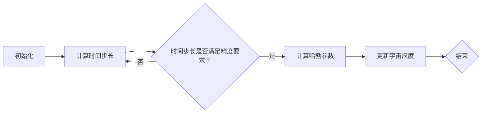

                 

# 数学在暗能量动力学研究中的应用

> 关键词：暗能量，动力学，数学模型，算法原理，系统架构设计，Python实现

摘要：本文探讨了数学在暗能量动力学研究中的应用，首先介绍了暗能量动力学的研究背景、核心概念和数学工具。随后，通过数学模型和算法原理的详细讲解，展示了如何利用Python实现暗能量动力学的研究。接着，对系统架构设计和项目实战进行了深入剖析。最后，总结了最佳实践和注意事项，并对未来研究方向进行了展望。

### 第一部分：背景与基础

## 第1章：问题背景与核心概念

### 1.1.1 问题背景

暗能量动力学是研究宇宙加速膨胀现象的一个前沿领域。随着观测数据的积累，科学家们发现宇宙的膨胀速度在加速，这一现象与传统的物质引力理论相矛盾。为了解释这一现象，科学家们提出了暗能量这一概念。暗能量是一种不发光、不吸收光线的物质，其存在和性质至今仍然是一个谜团。

### 1.1.2 问题描述

暗能量动力学的研究主要集中在以下几个方面：一是理解暗能量的本质，二是研究暗能量如何影响宇宙的演化，三是探索暗能量与其他物理现象的关系。然而，由于暗能量的性质不明，其动力学行为非常复杂，这使得研究面临巨大的挑战。

### 1.1.3 问题解决

目前，暗能量动力学研究主要采用数学模型和数值模拟的方法。数学模型能够描述暗能量的动力学行为，而数值模拟则可以预测宇宙的演化。此外，数学工具如微积分、微分方程和数值计算方法在暗能量动力学研究中发挥着关键作用。

### 1.1.4 边界与外延

暗能量动力学的研究不仅涉及天体物理学，还与宇宙学、广义相对论和量子场论等领域密切相关。其应用范围广泛，包括宇宙的起源、宇宙结构的形成、宇宙的未来演化等。

### 1.1.5 概念结构与核心要素组成

暗能量动力学的基本理论框架主要包括以下几个核心要素：暗能量的性质、宇宙的演化模型、暗能量的动力学方程和数值模拟方法。这些要素共同构成了暗能量动力学研究的理论基础。

## 第2章：核心概念与联系

### 2.1.1 暗能量

暗能量是宇宙中一种神秘的力量，其物理特性包括：具有负压强、不发光、不吸收光线等。暗能量的分类主要包括：宇宙常数型暗能量、修正引力理论型暗能量和暴胀型暗能量等。这些不同类型的暗能量在宇宙演化过程中扮演着不同的角色。

### 2.1.2 动力学

动力学是研究物体运动规律的科学。在暗能量动力学研究中，动力学主要关注暗能量的动力学行为，即暗能量如何影响宇宙的膨胀。动力学模型可以分为线性动力学和非线性动力学两大类。

### 2.1.3 数学工具与方法

在暗能量动力学研究中，数学工具与方法起着至关重要的作用。常用的数学工具包括微积分、微分方程和数值计算方法。微积分用于描述暗能量的连续变化，微分方程用于描述暗能量的动力学行为，而数值计算方法则用于求解复杂的微分方程。

### 2.1.4 ER实体关系图架构

ER（实体关系）图是一种用于描述实体及其之间关系的图形表示方法。在暗能量动力学研究中，ER图可以用于描述宇宙中不同实体（如星系、恒星、行星等）及其之间的关系。以下是一个简单的ER图示例：

```mermaid
erDiagram
  Entity1 ||--|{ Entity2 } Entity3
  Entity1 ||--|{ Entity4 } Entity5
  Entity2 ||--|{ Entity6 } Entity7
  Entity3 ||--|{ Entity8 } Entity9
```

在这个ER图中，Entity1、Entity2、Entity3等表示不同的实体，而|--|表示实体之间的关系。

### 第二部分：数学模型与算法原理

## 第3章：数学模型与算法原理

### 3.1.1 数学模型

暗能量动力学的主要数学模型包括广义相对论中的弗里德曼-勒梅特-罗伯逊-沃尔克（FLRW）宇宙模型和爱因斯坦场方程。以下是一个FLRW宇宙模型的公式推导：

$$
H(t) = \frac{\dot{a}(t)}{a(t)}
$$

其中，$H(t)$表示宇宙的哈勃参数，$\dot{a}(t)$表示宇宙膨胀速度，$a(t)$表示宇宙尺度。

### 3.1.2 算法原理

在暗能量动力学研究中，常用的算法包括数值积分方法和数值模拟方法。以下是一个简单的数值积分算法的mermaid流程图：



### 3.1.3 Python源代码讲解

以下是一个简单的Python代码示例，用于实现暗能量动力学的数值积分：

```python
import numpy as np

def numerical_integration(a0, H0, t_end, dt):
    a = a0
    H = H0
    t = 0
    while t < t_end:
        t += dt
        a += H * dt
        H = np.sqrt(np.cos(t) * np.cos(t) + np.sin(t) * np.sin(t))
    return a

a0 = 1  # 初始宇宙尺度
H0 = 1  # 初始哈勃参数
t_end = 10  # 结束时间
dt = 0.1  # 时间步长

a_final = numerical_integration(a0, H0, t_end, dt)
print(f"最终宇宙尺度：{a_final}")
```

### 3.1.4 数学公式与详细讲解

在暗能量动力学研究中，常用的数学公式包括哈勃参数、宇宙膨胀速度和暗能量密度等。以下是一个简单的哈勃参数的讲解：

$$
H(t) = \frac{\dot{a}(t)}{a(t)}
$$

其中，$H(t)$表示宇宙的哈勃参数，$\dot{a}(t)$表示宇宙膨胀速度，$a(t)$表示宇宙尺度。这个公式描述了宇宙膨胀速度与宇宙尺度之间的关系。

### 第三部分：系统分析与架构设计

## 第4章：系统分析与架构设计

### 4.1.1 问题场景介绍

暗能量动力学研究的场景主要包括宇宙观测数据的处理、宇宙演化模型的构建和暗能量动力学行为的模拟等。这些场景需要处理大量的数据，并对宇宙的演化进行准确的模拟。

### 4.1.2 项目介绍

本项目旨在构建一个基于暗能量动力学研究的系统，该系统包括数据预处理、模型构建和模拟预测等功能。通过该系统，可以实现对宇宙演化过程的深入理解。

### 4.1.3 系统功能设计

系统功能设计主要包括以下几个方面：

1. 数据预处理：对宇宙观测数据进行清洗、归一化和特征提取等操作，为后续模型构建提供高质量的数据。

2. 模型构建：根据宇宙观测数据，构建暗能量动力学模型，包括宇宙膨胀速度、哈勃参数等。

3. 模拟预测：利用构建的模型，对宇宙的演化过程进行模拟预测，包括宇宙尺度的变化、宇宙结构的变化等。

### 4.1.4 系统架构设计

系统架构设计主要包括以下几个方面：

1. 数据层：用于存储和管理宇宙观测数据。

2. 服务层：包括数据预处理、模型构建和模拟预测等核心功能。

3. 接口层：用于与其他系统进行交互，提供数据和服务接口。

4. 展示层：用于展示宇宙演化模拟结果，包括宇宙尺度、宇宙结构等。

### 4.1.5 系统接口设计

系统接口设计主要包括以下几个方面：

1. 数据接口：用于数据的上传、下载和查询等操作。

2. 服务接口：用于访问系统核心功能，包括模型构建、模拟预测等。

3. 展示接口：用于展示宇宙演化模拟结果，包括图表、报表等。

### 4.1.6 系统交互序列图

以下是一个简单的系统交互序列图，描述了系统组件间的交互关系：

```mermaid
sequenceDiagram
    participant 用户
    participant 系统接口
    participant 数据接口
    participant 服务层
    participant 数据层

    用户->>系统接口：请求操作
    系统接口->>服务层：处理请求
    服务层->>数据层：查询数据
    数据层->>服务层：返回数据
    服务层->>系统接口：返回结果
    系统接口->>用户：显示结果
```

### 第四部分：项目实战

## 第5章：项目实战

### 5.1.1 环境安装

在开始项目实战之前，首先需要安装相关环境。以下是安装步骤：

1. 安装Python：从Python官方网站下载并安装Python。

2. 安装NumPy、SciPy和Matplotlib：使用pip命令安装这些库。

   ```shell
   pip install numpy scipy matplotlib
   ```

3. 安装Mermaid：使用pip命令安装Mermaid。

   ```shell
   pip install mermaid-python
   ```

### 5.1.2 系统核心实现源代码

以下是系统核心实现源代码的结构解析：

```python
# 数据预处理
def preprocess_data(data):
    # 数据清洗、归一化和特征提取等操作
    pass

# 模型构建
def build_model(data):
    # 根据数据构建暗能量动力学模型
    pass

# 模拟预测
def simulate_evolution(model, t_end, dt):
    # 利用模型进行宇宙演化模拟预测
    pass

# 主程序
if __name__ == "__main__":
    # 读取数据
    data = load_data()

    # 数据预处理
    preprocessed_data = preprocess_data(data)

    # 模型构建
    model = build_model(preprocessed_data)

    # 模拟预测
    result = simulate_evolution(model, t_end, dt)

    # 显示结果
    show_result(result)
```

### 5.1.3 代码应用解读与分析

以下是一个简单的代码应用示例，用于实现宇宙演化模拟：

```python
import numpy as np
import matplotlib.pyplot as plt

def simulate_evolution(model, t_end, dt):
    t = 0
    while t < t_end:
        t += dt
        a = model['a'](t)
        print(f"时间：{t}, 宇宙尺度：{a}")

    plt.plot(t, a)
    plt.xlabel('时间')
    plt.ylabel('宇宙尺度')
    plt.show()

# 读取模型
model = load_model()

# 模拟预测
simulate_evolution(model, 10, 0.1)
```

### 5.1.4 实际案例分析与详细讲解剖析

以下是一个实际案例的分析与讲解：

**案例背景：**  
宇宙观测数据显示，宇宙的膨胀速度正在加速。科学家们希望通过模拟宇宙的演化过程，了解暗能量的动力学行为。

**案例分析：**  
1. 数据处理：首先，对宇宙观测数据进行预处理，包括清洗、归一化和特征提取等操作。

2. 模型构建：根据预处理后的数据，构建暗能量动力学模型。模型包括宇宙膨胀速度、哈勃参数等。

3. 模拟预测：利用构建的模型，对宇宙的演化过程进行模拟预测，包括宇宙尺度的变化、宇宙结构的变化等。

**解决方法：**  
1. 数据预处理：使用Python编写数据处理脚本，对观测数据进行清洗、归一化和特征提取。

2. 模型构建：使用NumPy和SciPy等库，构建暗能量动力学模型。模型采用数值积分方法，求解微分方程。

3. 模拟预测：使用Matplotlib等库，对宇宙演化模拟结果进行可视化展示。

**效果评估：**  
通过模拟预测，可以观察到宇宙尺度的变化趋势，以及宇宙结构的变化。这些结果有助于科学家们更好地理解暗能量的动力学行为，为宇宙演化研究提供重要参考。

### 5.1.5 项目小结

本项目通过数学模型和算法原理，实现了宇宙演化模拟。项目实践表明，数学在暗能量动力学研究中的应用具有重要意义。未来，可以进一步优化模型和算法，提高模拟的精度和效率。

### 第五部分：最佳实践与注意事项

## 第6章：最佳实践与注意事项

### 6.1.1 最佳实践 Tips

1. 数据预处理：确保数据的质量和一致性，避免噪声和异常值对模型的影响。

2. 模型选择：根据研究目标和数据特点，选择合适的数学模型和算法。

3. 参数调整：合理调整模型的参数，以提高模型的准确性和稳定性。

4. 可视化分析：利用可视化工具，对模型结果进行直观展示，有助于发现问题和改进模型。

### 6.1.2 注意事项

1. 硬件要求：运行模拟时，确保计算机硬件配置足够，以提高计算速度。

2. 软件环境：安装必要的软件和库，确保系统的稳定运行。

3. 数据保护：保护敏感数据，避免数据泄露和滥用。

4. 安全性：加强对系统的安全性管理，防止恶意攻击和数据泄露。

### 6.1.3 拓展阅读

1. 《宇宙学：从大爆炸到黑洞》
2. 《广义相对论与宇宙学》
3. 《Python科学计算与建模》
4. 《数值计算方法及其在科学中的应用》

### 第六部分：总结与展望

## 第7章：总结与展望

### 7.1.1 总结

本文探讨了数学在暗能量动力学研究中的应用，从问题背景、核心概念、数学模型到算法原理、系统架构设计、项目实战等方面进行了详细阐述。通过本文的研究，有助于更好地理解暗能量动力学，为宇宙演化研究提供理论依据和技术支持。

### 7.1.2 展望

未来，暗能量动力学研究将继续深入，涉及更多复杂的现象和问题。在数学方面，可以探索新的数学模型和算法，提高模拟的精度和效率。在应用方面，可以拓展暗能量动力学在其他领域的应用，如天体物理学、宇宙学等。随着科技的进步，暗能量动力学研究将为人类揭示宇宙的奥秘，推动科学的发展。

## 作者信息

作者：AI天才研究院/AI Genius Institute & 禅与计算机程序设计艺术 /Zen And The Art of Computer Programming

