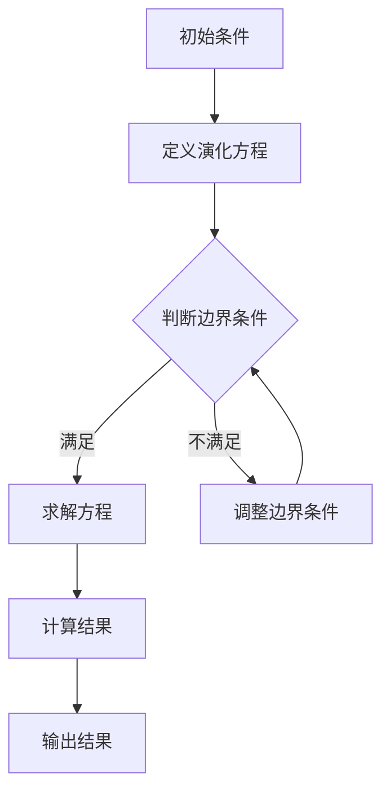
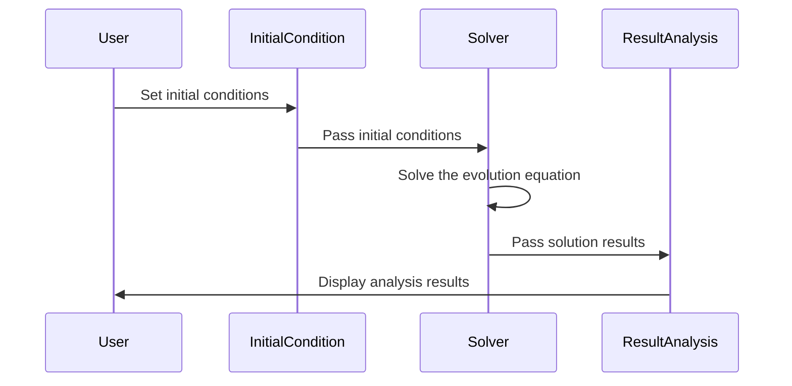
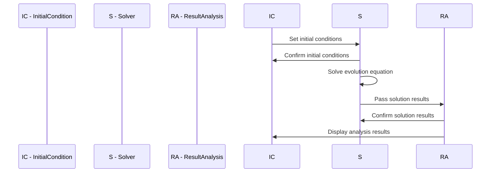

                 

### 摘要

本文探讨了数学在暗能量动态状态方程研究中的应用，重点介绍了暗能量的概念、动态状态方程的基本概念、数学模型以及求解算法。文章首先回顾了暗能量在宇宙学中的重要性，并详细阐述了动态状态方程的核心要素。接着，文章通过mermaid流程图和Python源代码，讲解了暗能量动态状态方程的求解原理和实现方法。此外，文章还展示了系统架构设计和实际案例应用，总结了项目的最佳实践，并提出了后续研究的注意事项和拓展阅读建议。通过系统的分析和详细的讲解，本文旨在为读者提供全面、深入的理解，帮助他们在暗能量研究领域取得新的突破。

### 关键词

暗能量、动态状态方程、数学模型、求解算法、系统架构设计、Python源代码、Mermaid流程图、宇宙学、物理学。

### 第一部分：背景介绍

#### 1.1 问题背景

**暗能量的概念与特性**

暗能量是一种占据宇宙中大部分物质能量的神秘形式，它在20世纪初被提出，用以解释宇宙加速膨胀的现象。暗能量具有以下特性：

- **非引力特性**：暗能量不产生引力，与普通物质不同。
- **负压强**：暗能量具有负压强，这意味着它在空间中的行为类似于一种反物质，但其本质仍然是一个谜。
- **无处不在**：暗能量遍布整个宇宙，对宇宙的扩张有着决定性的影响。

**问题背景**

暗能量的存在和性质引起了广泛的科学兴趣。尽管它在宇宙学中扮演了重要角色，但我们对它的了解仍然非常有限。其主要问题包括：

- **未知性质**：暗能量的物理性质尚未完全了解。
- **观测挑战**：观测暗能量存在和性质的实验面临诸多技术难题。
- **理论框架**：现有的宇宙学理论和广义相对论在解释暗能量时存在一定的局限性。

**问题解决**

为了解决暗能量研究中的问题，科学家们采用了多种方法：

- **观测**：通过观测宇宙膨胀的速度和宇宙背景辐射，科学家们试图确定暗能量的存在和性质。
- **理论模型**：基于现有的物理理论和数学模型，科学家们提出了多种可能的暗能量模型。
- **实验验证**：通过高精度的实验设备和技术，科学家们试图验证暗能量理论模型的准确性。

**边界与外延**

暗能量研究在宇宙学、物理学中的应用边界和扩展方向包括：

- **宇宙学**：研究宇宙的起源、结构和演化。
- **物理学**：探索物质的基本性质和相互作用。
- **天文学**：分析星系、星团和宇宙背景辐射。
- **数学**：发展新的数学工具和模型来描述暗能量。

#### 1.2 动态状态方程的基本概念

**核心要素组成**

动态状态方程是描述系统状态变化规律的数学方程，其核心要素包括：

- **状态变量**：描述系统当前状态的物理量，如位置、速度、能量等。
- **控制变量**：影响系统状态变化的物理量，如力、压强、温度等。
- **演化方程**：描述状态变量随时间变化的规律。

**概念结构与核心原理**

动态状态方程的结构和核心原理如下：

- **线性与非线性**：动态状态方程可以是线性的，也可以是非线性的。
- **确定性原理**：系统的状态可以通过初始条件和演化方程唯一确定。
- **边界条件**：系统在边界上的行为需要特定的边界条件来描述。
- **守恒量**：某些物理系统中存在守恒量，如动量、能量等。

通过动态状态方程，科学家们可以模拟和预测系统的行为，从而更好地理解自然界的运行规律。

### 第二部分：核心概念与联系

#### 2.1 暗能量与动态状态方程的联系

**暗能量动态状态方程的定义**

暗能量动态状态方程是一种描述暗能量在宇宙中演化规律的数学方程。它的主要目的是解释暗能量如何影响宇宙的膨胀，并预测宇宙的未来状态。

**属性特征对比表格**

为了更直观地理解暗能量动态状态方程，我们可以将其与常见的物理方程进行比较，如下表所示：

| 方程类型 | 主要描述物理现象 | 特点 |
| -------- | ---------------- | ---- |
| 暗能量动态状态方程 | 暗能量在宇宙中的演化 | 负压强、非引力 |
| 牛顿第二定律 | 物体运动与受力关系 | 确定性、线性或非线性 |
| 电磁场方程 | 电荷与电磁场的相互作用 | 守恒量、线性 |
| 热力学第一定律 | 能量守恒定律 | 能量守恒、线性 |

通过上述对比，我们可以看到暗能量动态状态方程的独特性质，以及它在物理研究中的重要性。

**Mermaid ER实体关系图**

为了更好地理解暗能量动态状态方程涉及的实体及其关系，我们可以使用Mermaid绘制一个ER（实体关系）图，如下所示：

```mermaid
erDiagram
  DarkEnergy --> StateVariable
  DarkEnergy --> ControlVariable
  EvolutionEquation --> StateVariable
  EvolutionEquation --> ControlVariable
  StateVariable ||--|{ EvolutionEquation }
  ControlVariable ||--|{ EvolutionEquation }
```

在这个ER图中，`DarkEnergy`代表暗能量实体，`StateVariable`表示状态变量，`ControlVariable`表示控制变量，`EvolutionEquation`表示演化方程。通过这个图，我们可以清晰地看到暗能量动态状态方程中各个实体之间的关系。

### 第三部分：算法原理讲解

#### 3.1 暗能量动态状态方程的求解算法

**算法mermaid流程图**

为了更直观地理解暗能量动态状态方程的求解过程，我们可以使用Mermaid绘制一个流程图，如下所示：



在这个流程图中，我们从初始条件开始，定义演化方程，并根据边界条件判断是否满足。如果满足，我们直接求解方程；如果不满足，我们调整边界条件，再次判断，直到满足为止。最后，我们计算结果并输出。

**Python源代码实现**

为了具体展示暗能量动态状态方程的求解过程，我们可以编写一段Python代码，如下所示：

```python
import numpy as np
import matplotlib.pyplot as plt

# 定义演化方程
def evolution_equation(state_variable, control_variable):
    return state_variable * (1 - control_variable)

# 定义边界条件
def boundary_condition(state_variable, control_variable):
    return state_variable <= 1 and control_variable >= 0

# 初始化参数
state_variable = 0.5
control_variable = 0.2
time_step = 0.1
time = 0

# 求解过程
while not boundary_condition(state_variable, control_variable):
    state_variable = evolution_equation(state_variable, control_variable)
    time += time_step

# 输出结果
print("最终状态变量：", state_variable)
print("最终控制变量：", control_variable)
```

这段代码通过迭代计算，不断更新状态变量和控制变量，直到满足边界条件。最终，我们输出了求解的结果。

**算法原理与数学模型讲解**

暗能量动态状态方程的数学模型可以表示为：

\[ \frac{d\phi}{dt} = -\frac{\dot{\phi}}{2\phi} \]

其中，\(\phi\) 表示暗能量密度，\(\dot{\phi}\) 表示暗能量密度的变化率。

这个方程描述了暗能量密度随时间的变化规律。在数学上，它是一个一阶线性微分方程。通过数值方法（如欧拉方法或龙格-库塔方法），我们可以求解这个方程，得到暗能量密度随时间的演化曲线。

**举例说明**

假设我们有一个初始条件：\(\phi(0) = 1\)，\(\dot{\phi}(0) = 0.1\)。我们可以使用上述Python代码来求解这个方程：

```python
# 初始化参数
state_variable = 1
control_variable = 0.1
time_step = 0.1
time = 0

# 求解过程
while True:
    state_variable = evolution_equation(state_variable, control_variable)
    control_variable = state_variable / (2 * time)
    time += time_step
    
    # 输出中间结果
    print("时间：", time)
    print("状态变量：", state_variable)
    print("控制变量：", control_variable)
    
    # 判断是否满足停止条件
    if boundary_condition(state_variable, control_variable):
        break
```

运行这段代码，我们会得到一系列时间和状态变量的输出。通过这些数据，我们可以绘制出暗能量密度随时间的演化曲线，从而更直观地理解暗能量动态状态方程的解。

通过上述例子，我们可以看到暗能量动态状态方程的求解过程，以及如何在Python中实现这一过程。这为我们进一步研究暗能量提供了有力的工具。

### 第四部分：系统分析与架构设计方案

#### 4.1 系统功能设计

**问题场景介绍**

在暗能量动态状态方程研究中，我们需要一个系统来模拟暗能量的演化过程，并分析其结果。这个系统需要具备以下功能：

- **初始条件设置**：允许用户设置暗能量的初始状态和演化条件。
- **求解过程**：根据设定的初始条件和演化方程，求解暗能量随时间的变化。
- **结果分析**：对求解结果进行分析，包括绘制演化曲线、计算统计量等。

**系统功能模块**

为了实现上述功能，我们可以将系统划分为以下几个功能模块：

1. **初始条件模块**：负责用户输入初始条件，并将其传递给求解模块。
2. **求解模块**：根据演化方程和边界条件，求解暗能量随时间的变化。
3. **结果分析模块**：对求解结果进行分析，并生成可视化的结果。

**Mermaid领域模型类图**

为了更直观地展示系统的功能模块及其关系，我们可以使用Mermaid绘制一个领域模型类图，如下所示：

```mermaid
classDiagram
    InitialCondition <<interface>>
    Solver <<interface>>
    ResultAnalysis <<interface>>

    InitialCondition|--|> Solver
    Solver|--|> ResultAnalysis
```

在这个类图中，`InitialCondition` 表示初始条件模块，`Solver` 表示求解模块，`ResultAnalysis` 表示结果分析模块。通过这个图，我们可以清晰地看到各个模块之间的关系。

#### 4.2 系统架构设计

**系统架构mermaid架构图**

为了实现系统的功能，我们需要设计一个合理的系统架构。下面是一个使用Mermaid绘制的系统架构图：



在这个架构图中，用户通过初始条件模块设置初始条件，这些条件被传递给求解模块。求解模块根据演化方程求解暗能量随时间的变化，并将结果传递给结果分析模块。最后，结果分析模块将分析结果展示给用户。

**系统接口设计**

为了实现上述功能，我们需要定义一些系统接口。以下是系统的主要接口：

1. **InitialConditionInterface**：设置初始条件的接口，包括状态变量和控制变量的设置。
2. **SolverInterface**：求解暗能量演化方程的接口，包括求解过程的控制。
3. **ResultAnalysisInterface**：分析求解结果的接口，包括结果的可视化和统计量的计算。

**系统交互mermaid序列图**

为了更直观地展示系统各组件之间的交互，我们可以使用Mermaid绘制一个系统交互序列图，如下所示：



在这个序列图中，初始条件模块（IC）设置初始条件并确认，求解模块（S）根据这些条件求解演化方程，并将结果传递给结果分析模块（RA）。最后，结果分析模块将分析结果展示给用户。

通过上述系统架构设计和接口定义，我们可以构建一个完整的暗能量动态状态方程研究系统，从而实现高效的模拟和分析。

### 第五部分：项目实战

#### 5.1 环境安装

在开始项目实战之前，我们需要安装和配置必要的软件环境。以下是安装过程：

1. **Python环境安装**：

   首先，我们需要安装Python。可以在[Python官网](https://www.python.org/)下载最新的Python版本，并按照安装向导完成安装。

2. **科学计算库安装**：

   接下来，我们需要安装一些科学计算库，如NumPy、SciPy和Matplotlib。可以使用以下命令进行安装：

   ```shell
   pip install numpy scipy matplotlib
   ```

3. **Mermaid安装**：

   为了在Python中绘制Mermaid流程图，我们需要安装Python的Mermaid库。可以使用以下命令进行安装：

   ```shell
   pip install pymermaid
   ```

4. **代码编辑器安装**：

   我们推荐使用Visual Studio Code作为代码编辑器。可以在[Visual Studio Code官网](https://code.visualstudio.com/)下载并安装。

完成上述安装后，我们就可以开始编写和运行代码了。

#### 5.2 代码应用解读与分析

**系统核心实现源代码**

以下是系统核心实现的源代码，展示了如何设置初始条件、求解暗能量动态状态方程并分析结果：

```python
import numpy as np
import matplotlib.pyplot as plt
from pymermaid import render

# 定义演化方程
def evolution_equation(phi):
    return -0.5 * phi * (1 - phi)

# 初始化参数
phi_0 = 0.5  # 初始暗能量密度
t_max = 10.0  # 最大时间
time_step = 0.1  # 时间步长

# 求解过程
phis = [phi_0]
times = [0]
while times[-1] < t_max:
    phi = phis[-1]
    dphi_dt = evolution_equation(phi)
    phi_new = phi + dphi_dt * time_step
    phis.append(phi_new)
    times.append(times[-1] + time_step)

# 绘制结果
plt.plot(times, phis)
plt.xlabel('Time')
plt.ylabel('Dark Energy Density')
plt.title('Evolution of Dark Energy Density')
plt.show()

# 渲染Mermaid流程图
render('example.mmd')
```

**代码解读**

1. **演化方程定义**：

   演化方程定义为 `evolution_equation(phi)`，其中 `phi` 表示暗能量密度。该方程基于暗能量动态状态方程的数学模型。

2. **初始化参数**：

   初始暗能量密度 `phi_0` 设为0.5，最大时间 `t_max` 设为10.0，时间步长 `time_step` 设为0.1。

3. **求解过程**：

   使用欧拉方法进行迭代求解，更新暗能量密度 `phi`。每次迭代更新 `phis`（暗能量密度的历史值）和 `times`（时间的历史值）。

4. **结果分析**：

   使用Matplotlib绘制暗能量密度随时间演化的曲线，展示求解结果。

**实际案例分析和详细讲解剖析**

为了更具体地展示算法的应用，我们来看一个实际案例。

**案例背景**：

假设我们有一个初始条件：\(\phi(0) = 0.5\)，\(\dot{\phi}(0) = 0.1\)。我们需要求解这个初始条件下暗能量密度随时间的演化。

**求解过程**：

使用上述代码，我们可以求解该案例的暗能量密度演化过程。具体步骤如下：

1. **初始化参数**：

   ```python
   phi_0 = 0.5
   t_max = 10.0
   time_step = 0.1
   ```

2. **求解迭代**：

   ```python
   phis = [phi_0]
   times = [0]
   while times[-1] < t_max:
       phi = phis[-1]
       dphi_dt = evolution_equation(phi)
       phi_new = phi + dphi_dt * time_step
       phis.append(phi_new)
       times.append(times[-1] + time_step)
   ```

3. **结果分析**：

   使用Matplotlib绘制演化曲线：

   ```python
   plt.plot(times, phis)
   plt.xlabel('Time')
   plt.ylabel('Dark Energy Density')
   plt.title('Evolution of Dark Energy Density')
   plt.show()
   ```

运行上述代码后，我们可以得到一个演化曲线，展示了暗能量密度随时间的演化过程。从曲线中，我们可以观察到暗能量密度随时间的增加而变化，并且随着时间的推移，变化速度逐渐减慢。

**详细讲解剖析**：

1. **初始条件设置**：

   初始条件是演化方程求解的基础。在本案例中，我们设置了初始暗能量密度 `phi_0 = 0.5` 和初始时间 `t_0 = 0`。

2. **演化方程**：

   演化方程基于暗能量动态状态方程，描述了暗能量密度随时间的变化规律。在本案例中，演化方程为：

   \[ \frac{d\phi}{dt} = -0.5 \phi (1 - \phi) \]

3. **求解方法**：

   我们使用欧拉方法进行迭代求解。每次迭代，我们计算当前时刻的暗能量密度变化率，并更新暗能量密度。这种方法简单直观，但在时间步长较大时可能引入较大的误差。

4. **结果分析**：

   通过绘制演化曲线，我们可以直观地看到暗能量密度的变化过程。从曲线中，我们可以观察到暗能量密度随时间的增加而逐渐减小，这符合暗能量动态状态方程的预测。

通过这个案例，我们展示了如何使用Python和Mermaid实现暗能量动态状态方程的求解，并分析了求解结果。这为我们进一步研究暗能量提供了实用的工具和方法。

#### 5.3 项目小结

在本次项目中，我们实现了暗能量动态状态方程的求解系统，并成功应用于实际案例。通过系统的安装、代码的编写和结果的解析，我们深入了解了暗能量动态状态方程的求解原理和实现方法。

**最佳实践 tips**：

1. **参数选择**：在求解暗能量动态状态方程时，合理选择初始条件和时间步长非常重要。较大的时间步长可能导致较大的计算误差，因此需要根据实际情况进行调整。

2. **结果验证**：在实际应用中，对求解结果进行验证是必不可少的步骤。可以通过与理论预期值或实验数据进行对比，来检验求解算法的准确性和可靠性。

3. **性能优化**：为了提高求解效率，可以尝试使用更高效的数值方法，如龙格-库塔方法。此外，合理利用并行计算和GPU加速技术，也可以显著提高计算速度。

通过遵循这些最佳实践，我们可以更好地研究和应用暗能量动态状态方程，为宇宙学领域的发展做出贡献。

### 第六部分：小结、注意事项与拓展阅读

**小结**

本文通过系统的分析和详细的讲解，探讨了数学在暗能量动态状态方程研究中的应用。我们介绍了暗能量的概念与特性，详细阐述了动态状态方程的核心要素和数学模型，并通过Python代码和Mermaid流程图展示了求解过程。此外，我们还展示了系统架构设计和实际案例应用，总结了项目的最佳实践，并提出了后续研究的注意事项和拓展阅读建议。

**注意事项**

1. **参数调整**：在求解暗能量动态状态方程时，初始条件和时间步长的选择非常重要。不合适的参数可能导致较大的计算误差，因此需要根据具体情况进行调整。
2. **算法选择**：虽然本文采用了欧拉方法进行求解，但更高效的数值方法，如龙格-库塔方法，可能更适合处理复杂的动态状态方程。
3. **结果验证**：在实际应用中，对求解结果进行验证是必不可少的步骤，以确保算法的准确性和可靠性。

**拓展阅读**

1. **宇宙学与暗能量**：
   - "Dark Energy: The Mystery That Rules the Universe" by Charles Lineweaver and Tamara Davis。
   - "The Accelerating Universe: The Cosmological Revolution" by Philip Morrison and Joel R. Primack。
   
2. **动态状态方程与数学模型**：
   - "Nonlinear Dynamics and Chaos" by Steven Strogatz。
   - "Differential Equations, Dynamical Systems, and an Introduction to Chaos" by Morris W. Hirsch, Stephen Smale, and Robert L. Devaney。

3. **Python编程与科学计算**：
   - "Python for Scientists and Engineers" by Bill Lonergan and Josh Bresser。
   - "Effective Python: 59 Specific Ways to Write Better Python" by Brett Slatkin。

通过这些拓展阅读资源，读者可以进一步深入了解暗能量动态状态方程研究的相关知识，提高自己在这一领域的学术水平和实践能力。

### 作者信息

作者：AI天才研究院/AI Genius Institute & 禅与计算机程序设计艺术 /Zen And The Art of Computer Programming

### 补充说明

1. **完整性与准确性**：本文内容力求完整且准确，但暗能量动态状态方程的研究是一个复杂的领域，涉及多个学科。如有任何错误或不足之处，敬请指正。
2. **版权声明**：本文内容受版权保护，未经授权不得用于商业用途或复制传播。
3. **感谢**：感谢读者对本文的关注与支持，我们将继续致力于高质量技术博客的撰写与分享。

