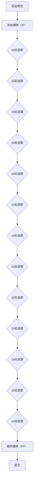
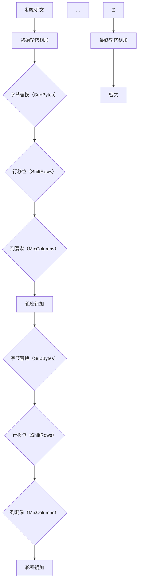
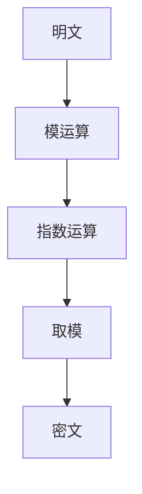
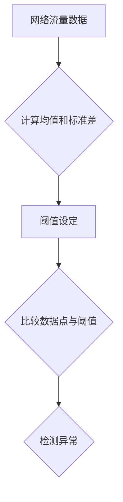
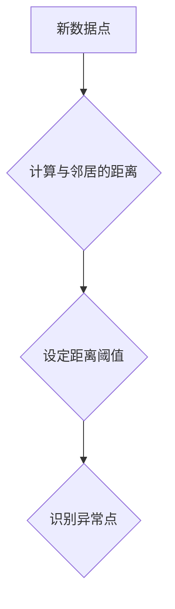
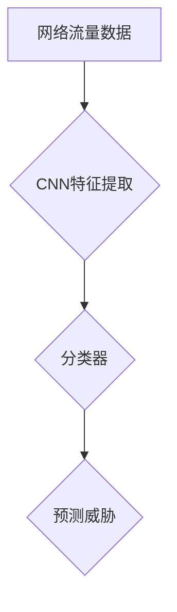

                 

### 引言

**关键词：**网络安全、加密技术、数学应用

在数字化时代，网络安全和加密技术已经成为保护信息安全的关键技术。随着互联网的普及和信息技术的发展，网络攻击手段日益复杂和多样化，网络安全问题日益突出。为了保障信息的机密性、完整性和可用性，加密技术被广泛应用，而数学则在其中扮演了至关重要的角色。

**摘要：**本文将探讨数学在网络安全与加密技术中的应用，通过逻辑清晰、结构紧凑的分析，揭示数学如何支撑网络安全和加密技术的核心原理。本文首先介绍网络安全与加密技术的基本概念和重要性，然后深入讲解数学基础知识和其在网络安全与加密技术中的核心应用，包括算法原理、模型构建和安全策略分析。通过实际案例，本文展示了数学在网络安全与加密技术中的具体应用，最后对未来的发展趋势进行了展望。

### 引言：网络安全与加密技术的重要性

在当今的信息时代，网络安全与加密技术已经成为保障信息安全的核心。随着网络技术的飞速发展，我们的日常生活和工作已经离不开互联网，数据传输、电子商务、在线支付等活动频繁进行，而这些活动的安全性直接关系到个人的隐私和财产。网络安全和加密技术的有效应用，不仅能够防止数据被非法访问和篡改，还能确保信息传输的完整性和真实性，因此它们在当今社会中具有不可替代的重要性。

网络安全主要是指通过一系列的技术和管理手段，防止网络系统中的数据、资源和服务受到未授权的访问、篡改、破坏和泄露。网络安全的三大目标分别是保密性、完整性和可用性。保密性确保信息在传输和存储过程中不会被未授权者获取；完整性保证信息在传输和存储过程中不被篡改；可用性则确保网络服务和资源在需要时能够正常使用，不受恶意攻击的影响。

加密技术则是网络安全的重要组成部分，其基本原理是通过将原始信息转换成密文，使得只有授权方能够理解和使用。加密技术可以分为对称密钥加密和非对称密钥加密两种类型。对称密钥加密使用相同的密钥进行加密和解密，典型的算法有DES和AES；非对称密钥加密使用一对密钥，公钥加密，私钥解密，典型的算法有RSA。

数学在网络安全与加密技术中的应用是至关重要的。它不仅为加密算法提供了理论基础，还帮助解决了密码学中的各种数学问题。例如，离散对数问题和大数分解问题是公开密钥加密的核心，这些数学问题具有高度复杂性，使得破解加密信息变得极其困难。同时，数学模型和算法的应用，如密码学中的对称加密和非对称加密算法，入侵检测系统中的机器学习算法等，进一步提升了网络安全的防护能力。

本文将详细探讨数学在网络安全与加密技术中的应用，从基本概念、核心算法到实际应用案例，逐步揭示数学如何支撑网络安全与加密技术的核心原理。希望通过本文的介绍，读者能够对数学在网络安全与加密技术中的重要性有更深入的理解，并为未来的网络安全研究和技术发展提供一些启示。

### 网络安全基础

**1.1 网络安全概述**

网络安全（Cybersecurity）是一个广泛的概念，它涉及计算机系统和网络资源的安全保护，以防止未授权的访问、数据泄露、损坏或篡改。网络安全的目标包括保密性、完整性、可用性、可靠性和可审查性。保密性确保只有授权用户可以访问敏感信息；完整性保证数据在传输和存储过程中不被篡改；可用性确保系统和数据在任何时候都能正常使用；可靠性保证系统的稳定运行；可审查性则使得在发生安全事件时能够追踪和调查。

**1.1.1 网络安全的定义**

网络安全被定义为“保护网络系统、数据和应用免受各种安全威胁和攻击的措施和实践”。它不仅关注技术层面的防护，还包括管理、政策和法规等方面。网络安全的定义可以进一步细化为以下几个方面：

- **硬件安全**：确保物理设备和网络基础设施不受损害或破坏。
- **软件安全**：保护操作系统、应用程序和数据库不受恶意软件的攻击。
- **数据安全**：确保数据在存储、传输和处理过程中的机密性、完整性和可用性。
- **网络安全协议**：使用加密和其他技术保护网络通信。

**1.1.2 网络安全的三大目标**

网络安全的三大目标通常被称为CIA，即：

- **保密性（Confidentiality）**：确保只有授权用户可以访问敏感信息。保密性主要通过加密技术和访问控制实现。
- **完整性（Integrity）**：确保数据和资源不会被未经授权的实体篡改或破坏。完整性保护通过数字签名和校验和实现。
- **可用性（Availability）**：确保系统和数据在需要时能够正常使用，不受拒绝服务攻击（DDoS）和其他攻击手段的影响。可用性保护通常涉及容错机制和负载均衡。

**1.1.3 网络安全的主要威胁**

网络安全面临多种威胁，以下列举了一些主要威胁类型：

- **恶意软件**：包括病毒、蠕虫、木马和勒索软件，它们可以破坏系统、窃取数据或锁定用户文件。
- **网络钓鱼**：通过伪造的网站或电子邮件骗取用户的敏感信息，如用户名、密码和信用卡号码。
- **拒绝服务攻击（DDoS）**：通过大量的网络请求使系统过载，导致服务不可用。
- **中间人攻击（MITM）**：攻击者拦截并篡改网络通信，窃取信息或插入恶意代码。
- **SQL注入**：通过在数据库查询中插入恶意代码，攻击者可以获取数据库中的敏感信息。
- **社会工程学**：通过欺骗手段获取用户的敏感信息，如电话诈骗、假冒身份等。

**1.2 网络安全的关键技术**

为了实现网络安全的CIA目标，需要使用多种关键技术，包括但不限于以下几种：

- **防火墙**：防火墙是网络安全的第一道防线，它通过过滤网络流量来阻止未经授权的访问。
- **入侵检测系统（IDS）**：IDS可以检测网络中的异常活动和潜在攻击，从而及时发出警报并采取相应措施。
- **虚拟私人网络（VPN）**：VPN通过加密网络通信，确保数据在公共网络上传输时的安全。
- **加密技术**：加密技术用于保护数据的机密性、完整性和可认证性，包括对称加密和非对称加密。
- **安全信息和事件管理（SIEM）系统**：SIEM系统用于收集、监控和分析安全事件日志，提供实时的威胁情报和响应支持。

通过对网络安全基础的了解，我们可以更好地理解数学在其中的应用。数学不仅提供了加密算法的理论基础，还在入侵检测、安全策略制定等方面发挥着重要作用。接下来，我们将进一步探讨数学在网络安全与加密技术中的应用，揭示其核心原理和实际应用。

### 网络安全的关键技术

在实现网络安全的过程中，使用一系列关键技术和工具是至关重要的。这些技术和工具不仅能够增强系统的防护能力，还能提高对潜在威胁的检测和响应效率。以下是几种常见的网络安全关键技术：

**1. 防火墙**

防火墙是一种网络安全设备，它通过检查进出网络的数据包，决定是否允许通过。防火墙的基本工作原理是基于预定义的安全规则来过滤网络流量。这些规则可以是基于源地址、目的地址、端口号、协议类型等多种条件。防火墙可以分为以下几类：

- **包过滤防火墙**：根据数据包的源地址、目的地址、端口号等信息进行过滤。
- **状态检测防火墙**：不仅检查单个数据包，还能跟踪整个会话的状态，从而提供更细粒度的控制。
- **应用层防火墙**：能够检查数据包的内容，应用特定的安全策略。

防火墙的优势在于它能够有效阻止未经授权的访问，并且通常配置简单，易于管理。然而，防火墙也存在一些局限，例如无法完全防止内网的恶意活动，也无法检测和阻止高级持续性威胁（APT）。

**2. 入侵检测系统（IDS）**

入侵检测系统（Intrusion Detection System，IDS）是一种监控网络或系统活动，检测潜在攻击或异常行为的工具。IDS可以分为以下两种主要类型：

- **网络入侵检测系统（NIDS）**：监控网络流量，检测网络中的异常和攻击行为。
- **主机入侵检测系统（HIDS）**：监控主机系统的日志文件和系统资源使用情况，检测可能的恶意行为。

IDS通常通过以下方法进行攻击检测：

- **基于签名的检测**：通过匹配已知的攻击模式或签名来检测攻击。
- **基于行为的检测**：通过分析系统的正常行为，检测异常行为或攻击迹象。

IDS的优势在于它能够实时检测和报告潜在的攻击行为，提高网络的安全性。然而，IDS也可能误报，影响系统的正常运行。

**3. 虚拟私人网络（VPN）**

虚拟私人网络（Virtual Private Network，VPN）通过加密技术在公共网络上建立安全的通信隧道，确保数据传输的安全性和隐私性。VPN的主要用途包括：

- **远程访问**：允许远程用户通过加密连接访问公司内部网络。
- **数据加密**：确保数据在传输过程中不被窃听或篡改。

VPN的优点在于它提供了强大的数据加密和保护，能够防止中间人攻击和数据泄露。然而，VPN的使用也可能会影响网络速度和性能，同时需要妥善管理密钥和配置。

**4. 加密技术**

加密技术是网络安全的核心技术之一，用于保护数据的机密性、完整性和可认证性。加密技术可以分为以下几类：

- **对称加密**：使用相同的密钥进行加密和解密，如DES和AES。
- **非对称加密**：使用一对密钥，公钥加密，私钥解密，如RSA。
- **哈希函数**：将输入数据转换成固定长度的输出字符串，如SHA系列。

加密技术的优势在于它能够确保数据在传输和存储过程中的安全性，防止未授权的访问和篡改。然而，加密技术也面临着破解和攻击的风险，需要不断更新和改进。

通过上述关键技术和工具的综合运用，我们可以建立一个多层次、多角度的网络安全体系，有效防护网络中的各种威胁和攻击。

### 数学基础

在深入探讨数学在网络安全与加密技术中的应用之前，我们首先需要了解一些基础的数学概念。这些数学基础包括线性代数、概率论和数学建模，它们为网络安全和加密技术提供了坚实的理论支持。

**1.3.1 线性代数基础**

线性代数是研究向量空间和线性变换的数学分支。在网络安全和加密技术中，线性代数被广泛应用于加密算法的构造和密码分析。以下是一些关键的线性代数概念：

- **向量空间**：一个向量空间是一组向量的集合，这些向量可以进行加法和标量乘法，并满足封闭性、结合律、分配律等性质。
- **矩阵**：矩阵是一个由数字组成的矩形阵列，用于表示线性变换和系统方程。
- **行列式**：行列式是矩阵的一种数值特征，用于求解线性方程组和确定矩阵的可逆性。
- **特征值和特征向量**：特征值和特征向量描述了线性变换在向量空间中的缩放和旋转性质。

在线性代数中，矩阵的乘法和逆矩阵是两个非常重要的操作。矩阵乘法用于表示线性变换，逆矩阵则用于解线性方程组。这些概念在加密算法的设计和实现中扮演了关键角色。

**1.3.2 概率论基础**

概率论是研究随机事件及其概率的数学分支。在网络安全和加密技术中，概率论用于分析和评估系统的安全性。以下是一些关键的概率论概念：

- **随机事件**：随机事件是在一定条件下可能发生也可能不发生的事件。
- **概率**：概率是描述随机事件发生可能性的数值，通常介于0和1之间。
- **条件概率**：条件概率是考虑一个事件在另一个事件已经发生的情况下发生的概率。
- **贝叶斯定理**：贝叶斯定理用于计算在已知某些条件下另一个事件发生的概率。

在网络安全中，概率论被用于分析攻击者行为和系统漏洞的概率。例如，通过计算入侵检测系统中异常行为的概率，可以识别潜在的网络攻击。概率论还用于加密算法的密码分析，评估算法的抵抗攻击能力。

**1.3.3 数学建模基础**

数学建模是将实际问题转化为数学问题的过程。在网络安全和加密技术中，数学建模用于设计新的算法和系统，并评估其性能。以下是一些关键的数学建模概念：

- **数学模型**：数学模型是用数学语言描述的系统的抽象表示，它通常包括变量、参数和方程。
- **方程组**：方程组是包含多个方程的数学模型，用于描述系统的动态行为。
- **优化模型**：优化模型用于寻找最优解，常用于资源分配和攻击防御策略的制定。

在数学建模中，常见的数学工具包括线性规划、非线性规划、差分方程和微分方程等。通过数学建模，可以构建网络安全和加密技术的模型，模拟和分析系统的行为，为决策提供科学依据。

总之，线性代数、概率论和数学建模是网络安全与加密技术中的基础数学工具。它们不仅为加密算法的设计和实现提供了理论支持，还在入侵检测、安全策略制定等方面发挥着重要作用。在接下来的章节中，我们将深入探讨这些数学概念在网络安全与加密技术中的具体应用。

### 加密技术原理

加密技术是网络安全的核心组成部分，它通过将明文转换为密文，确保信息在传输和存储过程中的机密性、完整性和可认证性。加密技术的基本原理涉及到密码学，即研究如何安全地隐藏信息的一门科学。以下是加密技术中的几个核心概念和常见算法。

**2.1 密码学基础**

密码学主要分为两大类：对称密钥加密和非对称密钥加密。

- **对称密钥加密**：对称密钥加密使用相同的密钥进行加密和解密。加密过程将明文与密钥进行结合，产生密文；解密过程则使用相同的密钥将密文还原成明文。对称密钥加密的优点是计算速度快，适合大量数据的加密。然而，对称密钥加密的一个主要挑战是密钥的分发和管理，因为需要确保密钥在传输过程中不被泄露。

- **非对称密钥加密**：非对称密钥加密使用一对密钥，即公钥和私钥。公钥用于加密，私钥用于解密。公钥可以公开，而私钥必须保密。非对称密钥加密的优点是解决了对称密钥加密中的密钥分发问题，但计算复杂度较高，适合用于少量数据的加密，如数字签名和密钥交换。

- **对称密钥与公开密钥的关系**：对称密钥加密和非对称密钥加密并不是完全独立的，它们可以结合使用。例如，在SSL/TLS协议中，通常使用非对称加密进行密钥交换，然后使用对称加密进行数据传输。

**2.2 常见加密算法**

在密码学中，有许多常见的加密算法，每种算法都有其独特的原理和应用场景。

- **数据加密标准（DES）**：DES是一种对称密钥加密算法，它使用56位的密钥对数据进行加密。尽管DES曾经是标准的加密算法，但由于其密钥长度较短，已经不再安全，目前主要被更先进的AES算法所取代。

- **先进加密标准（AES）**：AES是一种更为安全、高效的对称密钥加密算法，它支持128、192和256位的密钥长度。AES被广泛用于数据加密，是目前最常用的加密算法之一。

- **RSA算法**：RSA是一种非对称密钥加密算法，由Rivest、Shamir和Adleman三位密码学家于1977年提出。RSA算法基于大数分解问题，使用一对密钥，其中公钥用于加密，私钥用于解密。RSA算法在数字签名和密钥交换中应用广泛。

**2.3 数学模型与算法讲解**

加密算法的核心是数学模型，这些模型通过复杂的数学运算确保信息的安全性。以下是一些关键的数学模型和算法：

- **线性变换与加密**：对称加密算法通常基于线性变换，如AES使用的替换-置换网络（SPN）。线性变换通过一系列替换和置换操作将明文转换为密文。这些操作可以用矩阵表示，矩阵的逆用于解密。

- **概率分布与加密**：非对称加密算法如RSA基于概率分布和数学难题，如大数分解和离散对数问题。RSA加密算法使用大素数生成公钥和私钥，加密过程通过模运算实现，其安全性依赖于大数分解的复杂性。

- **数学建模与加密**：数学建模在加密算法的设计和实现中扮演重要角色。例如，密码学中的复杂性理论使用数学模型来分析算法的安全性，通过构建数学模型评估算法的抵抗攻击能力。

通过理解这些加密技术的基本原理和数学模型，我们可以更深入地掌握网络安全与加密技术中的核心概念。在接下来的章节中，我们将继续探讨数学在网络安全中的具体应用，包括入侵检测和加密算法的数学模型。

### 加密算法原理与流程图

加密算法是保障网络安全和数据隐私的核心技术，其基本原理是通过复杂的数学运算将明文转换为难以理解的密文。下面我们将详细介绍几种常见的加密算法，并使用流程图展示其加密和解密过程。

#### 2.2.1 数据加密标准（DES）

数据加密标准（Data Encryption Standard，DES）是最早的广泛使用的对称加密算法之一。它使用56位密钥对数据进行加密和解密，其加密过程主要包括三个步骤：初始置换（IP）、16轮迭算和最终置换（FP）。

**加密流程图：**

**加密与解密过程：**
1. 初始置换（IP）：将明文进行初始置换，生成初始轮密文。
2. 16轮迭算：每次迭代包括扩展置换（E）、置换选择（PC2）、异或（XOR）和S-盒替换。每轮迭代后，密文会经过一次循环左移。
3. 最终置换（FP）：将16轮迭算后的密文进行最终置换，生成密文。
4. 解密过程与加密过程相反，通过逆S-盒、逆置换和逆循环左移恢复明文。

#### 2.2.2 先进加密标准（AES）

先进加密标准（Advanced Encryption Standard，AES）是目前最常用的对称加密算法之一，它使用128位块大小和128、192或256位的密钥长度。AES算法采用固定数量的轮次（10、12或14轮），每轮包括字节替换（SubBytes）、行移位（ShiftRows）、列混淆（MixColumns）和轮密钥加（AddRoundKey）。

**加密流程图：**

**加密与解密过程：**
1. 初始轮密钥加：将明文与初始密钥进行异或操作。
2. 字节替换（SubBytes）：使用S-盒对每个字节进行替换。
3. 行移位（ShiftRows）：对每个字节行的位置进行循环左移。
4. 列混淆（MixColumns）：对每个字节列进行线性变换。
5. 轮密钥加（AddRoundKey）：将结果与当前轮密钥进行异或操作。
6. 最终轮密钥加：在最后一轮后，将结果与最终密钥进行异或操作，生成密文。
7. 解密过程与加密过程相反，通过逆S-盒、逆行移位、逆列混淆和逆轮密钥加恢复明文。

#### 2.2.3 RSA算法

RSA是一种非对称加密算法，它基于大数分解和模运算。RSA算法使用一对密钥：公钥和私钥。公钥用于加密，私钥用于解密。

**加密流程图：**

**加密与解密过程：**
1. 选择两个大素数p和q，计算n = p*q。
2. 计算欧拉函数φ(n) = (p-1)(q-1)。
3. 选择一个与φ(n)互质的整数e，计算公钥（n, e）。
4. 计算私钥d，满足d*e ≡ 1 (mod φ(n))。
5. 加密过程：将明文m转换为整数m'，计算密文c = m'^e (mod n)。
6. 解密过程：计算明文m = c^d (mod n)。

通过理解这些加密算法的基本原理和流程，我们可以更好地理解数学在加密技术中的重要性。这些算法不仅基于复杂的数学模型，还通过数学运算实现了信息的安全传输和存储。在接下来的章节中，我们将进一步探讨数学在网络安全中的其他应用。

### 数学在网络安全中的应用

在网络安全领域，数学不仅提供了加密技术的理论基础，还广泛应用于入侵检测、机器学习和其他安全技术。数学模型和算法在检测潜在威胁、预测攻击模式和优化安全策略方面发挥了关键作用。以下我们将详细探讨数学模型在网络安全中的应用。

#### 3.1 数学模型在入侵检测中的应用

入侵检测系统（Intrusion Detection System，IDS）是一种重要的网络安全工具，用于监控网络流量和系统活动，检测潜在的安全威胁和异常行为。数学模型在入侵检测中主要用于以下几个方面：

**1. 异常检测**

异常检测（Anomaly Detection）是IDS的核心功能之一，它通过分析网络流量和系统日志，识别与正常行为显著不同的异常行为。常用的数学模型包括：

- **统计模型**：基于统计学方法，如均值和标准差，检测偏离正常范围的流量模式。例如，基于阈值的统计模型可以通过计算数据点的分布，识别超出阈值的异常值。

**示例：**假设我们有一个网络流量数据集，正常流量平均值为100 Mbps，标准差为20 Mbps。如果检测到一个数据点的流量值为150 Mbps，远高于平均值，则可以认为这是一个异常流量。

- **机器学习模型**：通过训练机器学习模型，如K最近邻（K-Nearest Neighbors，KNN）和孤立森林（Isolation Forest），可以从历史数据中学习正常行为模式，并识别异常点。

**示例：**使用KNN模型，通过计算新数据点与训练集中最近邻居的距离，识别是否为异常点。

**2. 人工智能与入侵检测**

人工智能（Artificial Intelligence，AI）技术在入侵检测中的应用越来越广泛，包括深度学习、强化学习等。这些技术通过复杂的数学模型和算法，提高了入侵检测的准确性和效率。

- **深度学习模型**：如卷积神经网络（Convolutional Neural Networks，CNN）和循环神经网络（Recurrent Neural Networks，RNN），可以处理高维数据，并自动提取特征。

**示例：**使用CNN模型对网络流量数据进行特征提取和分类，检测潜在威胁。

- **强化学习模型**：通过学习最优策略，识别和响应潜在威胁。

**示例：**使用强化学习模型，如Q-Learning，根据网络流量和攻击行为，选择最佳响应策略。

通过上述数学模型和算法的应用，入侵检测系统可以更有效地识别和应对各种网络威胁，提高网络安全防护能力。数学模型不仅在入侵检测中发挥着重要作用，还在其他网络安全领域，如加密算法设计、安全协议分析和攻击防御策略制定中，提供了强有力的理论支持。

#### 3.2 数学模型在加密算法中的应用

加密算法是保障网络安全和数据隐私的关键技术，其安全性依赖于复杂的数学模型和算法。以下我们将探讨几种常见的加密算法及其背后的数学模型。

**1. 大数分解问题**

大数分解问题（Prime Factorization）是许多加密算法的基础，尤其是公开密钥加密（Public Key Cryptography，PKC）算法。在RSA算法中，公钥和私钥的生成依赖于大素数的乘积。例如，选择两个大素数p和q，计算n = p*q，然后计算欧拉函数φ(n) = (p-1)(q-1)。公钥为(n, e)，私钥为(d，其中d*e ≡ 1 (mod φ(n))。

**数学模型：**
$$
n = p \times q
$$
$$
\phi(n) = (p-1)(q-1)
$$
$$
d = e^{-1} \pmod{\phi(n)}
$$

**2. 离散对数问题**

离散对数问题（Discrete Logarithm Problem）是许多公开密钥加密算法的核心，如椭圆曲线加密（Elliptic Curve Cryptography，ECC）。在ECC中，密钥生成基于椭圆曲线上的离散对数问题，其安全性依赖于椭圆曲线上的点乘运算。

**数学模型：**
给定椭圆曲线E和基点G，找到整数k，使得kG = P，其中P为椭圆曲线上的另一个点。

**3. 数学模型在加密算法中的具体应用**

- **对称加密算法**：对称加密算法如AES和DES使用线性变换和置换操作，这些操作可以用线性代数模型表示。例如，AES的替换-置换网络（SPN）结构通过一系列线性变换和置换实现了数据加密。

- **非对称加密算法**：非对称加密算法如RSA和ECC基于复杂的数学难题，如大数分解和离散对数问题。RSA算法的安全性依赖于大数分解问题的难度，而ECC算法则依赖于椭圆曲线离散对数问题的难度。

- **哈希函数**：哈希函数如SHA系列通过复杂的数学运算将输入数据映射为固定长度的输出，确保数据的完整性和可认证性。哈希函数的安全性依赖于碰撞问题的难度。

通过这些数学模型的应用，加密算法实现了数据的高效加密和可靠的安全保障。数学模型不仅为加密算法提供了理论基础，还在密码分析、安全协议设计和攻击防御策略制定中发挥着重要作用。

### 网络安全与加密技术的实际应用

在网络安全与加密技术的实际应用中，我们可以看到这些技术如何在实际场景中发挥关键作用，保护数据传输、通信和系统的安全。以下将通过几个具体案例来展示加密技术在数据传输加密和数字签名中的应用。

#### 4.1 数据传输加密应用

数据传输加密是保障网络通信安全的重要手段。一个典型的应用实例是SSL/TLS协议，它用于保护Web浏览器的数据传输。以下是一个案例：

**案例：**假设一个用户通过HTTPS访问银行网站，进行网上银行业务。为了确保数据传输的安全，银行使用SSL/TLS协议对数据加密。

**具体实现步骤：**
1. **客户端发起握手请求**：用户发起HTTPS请求，服务器返回SSL/TLS证书。
2. **证书验证**：客户端验证服务器证书的有效性，确保通信的对方是可信的。
3. **密钥交换**：服务器和客户端通过非对称加密算法（如RSA）交换加密密钥。
4. **对称加密传输**：一旦密钥交换完成，后续的数据传输将使用对称加密算法（如AES）进行加密，确保数据在传输过程中的安全性。
5. **加密数据传输**：客户端和服务器之间的数据使用对称密钥进行加密和解密，只有拥有对称密钥的双方才能读取数据内容。

通过SSL/TLS协议，银行网站能够确保用户在进行敏感操作时，数据不会被中间人攻击窃取，从而保障用户账户的安全性。

#### 4.2 数字签名应用

数字签名是保障数据完整性和不可否认性的重要技术，常用于电子邮件、文档传输和电子商务等领域。以下是一个具体案例：

**案例：**假设一个用户通过电子邮件发送一份重要合同给对方，为了确保合同未被篡改且确信发送者身份，用户使用数字签名进行认证。

**具体实现步骤：**
1. **生成密钥对**：用户生成一对公钥和私钥，公钥用于签名验证，私钥用于签名生成。
2. **生成签名**：用户使用私钥对合同内容进行签名。签名过程包括：
   - 计算合同内容的哈希值。
   - 使用私钥对哈希值进行加密，生成数字签名。
3. **发送签名**：用户将合同内容和数字签名一起发送给对方。
4. **验证签名**：对方使用用户的公钥对数字签名进行验证。验证过程包括：
   - 计算合同内容的哈希值。
   - 使用公钥对数字签名进行解密，得到原始哈希值。
   - 对比计算得到的哈希值和接收到的哈希值，如果一致，则签名有效。
5. **确认签名有效性**：如果数字签名验证成功，对方可以确信合同未被篡改且确实由用户发送。

通过数字签名，用户能够确保合同的完整性和不可否认性，防止伪造和篡改。此外，数字签名还提供了非否认性，用户不能否认自己发送了该合同。

#### 案例分析

**黑客攻击案例：** 
2017年，WannaCry勒索软件全球爆发，影响超过150个国家的数十万台计算机。该勒索软件通过加密用户数据，要求支付赎金以解锁。该攻击利用了Windows操作系统中的漏洞，展示了加密技术在网络攻击中的威力。黑客通过加密锁住用户数据，使受害者无法访问重要文件，从而勒索赎金。

**数据泄露案例：** 
2017年，Equifax数据泄露事件暴露了1.43亿用户的个人信息，包括姓名、社会安全号码、地址等敏感数据。黑客通过网络钓鱼和利用系统漏洞，窃取了大量用户数据。此事件突显了数据加密的重要性，如果敏感数据在传输和存储过程中进行了加密，可能大大减少数据泄露的风险。

通过上述案例，我们可以看到加密技术在实际应用中的关键作用。数据传输加密和数字签名不仅保护了数据的机密性和完整性，还为网络通信提供了认证和不可否认性。随着网络攻击手段的不断演变，加密技术将继续发挥重要作用，为网络安全提供强有力的保障。

### 网络安全策略分析

在保障网络安全的过程中，制定和实施有效的安全策略是至关重要的一环。一个全面的安全策略不仅能够预防潜在威胁，还能在威胁发生时迅速响应，最小化损失。以下将详细分析网络安全策略的几个关键方面，包括安全协议、风险管理、安全审计以及加密技术的应用策略。

**1. 安全协议**

安全协议是网络安全的基础，用于确保数据在传输过程中的机密性、完整性和完整性。常见的安全协议包括SSL/TLS、IPSec和S/MIME等。

- **SSL/TLS协议**：SSL/TLS协议用于保护Web浏览器与服务器之间的通信。通过SSL/TLS协议，可以确保数据在传输过程中被加密，防止中间人攻击和数据窃取。在实施SSL/TLS协议时，需要定期更新证书、配置安全的加密算法和协议版本，并使用强加密密钥。
- **IPSec协议**：IPSec协议用于保护IP层的数据包，可以在网络层实现加密和认证。IPSec适用于企业内部网络、VPN以及远程访问场景。在部署IPSec时，需要合理配置加密算法、认证方法和密钥交换机制，确保数据传输的安全。
- **S/MIME协议**：S/MIME协议用于电子邮件的加密和数字签名，确保邮件的机密性和完整性。实施S/MIME协议时，需要为用户生成和分发数字证书，并确保邮件客户端正确处理签名和加密邮件。

**2. 风险管理**

风险管理是网络安全策略的重要组成部分，通过识别、评估和应对潜在威胁，确保信息系统的安全。以下是一些关键的风险管理策略：

- **威胁建模**：通过威胁建模，识别系统可能面临的威胁和攻击方式。威胁建模可以帮助确定哪些资产需要保护，并制定相应的防护措施。
- **风险评估**：对系统中的潜在风险进行评估，确定风险的可能性和影响。风险评估有助于确定哪些风险需要优先处理，并制定相应的风险缓解策略。
- **风险缓解策略**：通过实施安全控制措施，如防火墙、入侵检测系统和加密技术，降低潜在威胁的损害。风险缓解策略应定期更新，以适应新的威胁环境。

**3. 安全审计**

安全审计是评估网络安全措施有效性的一种重要手段，通过定期审计，可以发现系统中的安全漏洞和潜在风险。以下是一些常见的安全审计策略：

- **漏洞扫描**：使用漏洞扫描工具定期扫描系统，识别已知的安全漏洞。漏洞扫描有助于确定系统中的弱点，并采取相应的修复措施。
- **日志审计**：审计系统日志文件，监控网络活动和系统事件。日志审计可以帮助发现异常行为和潜在威胁，为安全事件响应提供依据。
- **合规性检查**：确保系统遵守相关的法律法规和行业标准。合规性检查可以帮助组织避免法律风险，提高整体安全水平。

**4. 加密技术的应用策略**

加密技术是保障网络安全的重要手段，其应用策略包括以下几个方面：

- **数据加密**：在数据存储和传输过程中，对敏感数据进行加密，确保数据在泄露或被窃取时无法被读取。常用的加密技术包括对称加密、非对称加密和哈希函数。
- **密钥管理**：确保密钥的安全存储和传输，防止密钥泄露。密钥管理策略应包括密钥生成、存储、分发和销毁等环节，并采用安全的加密和访问控制机制。
- **加密算法更新**：定期评估和更新加密算法，确保使用的算法能够抵御最新的攻击手段。加密算法的更新应遵循行业标准和安全最佳实践。

通过综合运用安全协议、风险管理、安全审计和加密技术，组织可以建立一个全面的网络安全策略，有效防范和应对各种网络威胁，保障信息系统的安全稳定运行。

### 总结与展望

在本文中，我们深入探讨了数学在网络安全与加密技术中的应用，揭示了其在保护信息安全和确保网络通信中的关键作用。从对称和非对称加密算法的数学模型，到入侵检测系统中的数学建模，再到网络安全策略中的加密应用，数学不仅提供了理论基础，还推动了实际技术的进步。

**未来发展趋势：**

1. **加密算法的优化与革新**：随着计算能力的提升和新型攻击手段的出现，加密算法需要不断优化和创新。例如，椭圆曲线密码学和量子安全密码学正成为研究热点，旨在应对未来可能的量子计算攻击。

2. **多层次的防护策略**：未来的网络安全将更加注重多层次、多角度的防护策略。结合人工智能和机器学习技术，构建自适应的网络安全系统，能够更好地应对复杂的网络威胁。

3. **零信任架构的普及**：零信任安全模型强调不信任任何内部或外部网络，所有访问请求都需要经过严格的验证和授权。这种模型将在未来得到更广泛的应用，进一步提升网络安全水平。

4. **隐私保护技术的发展**：随着数据隐私保护需求的增加，如欧盟的《通用数据保护条例》（GDPR），隐私保护技术将得到更多关注。加密技术和隐私保护算法将继续融合，提供更加安全的隐私保护手段。

通过不断探索和创新，数学在网络安全与加密技术中的应用将推动整个领域的发展，为未来构建一个更加安全、可靠的数字世界提供坚实的支撑。

### 小结与注意事项

通过本文的探讨，我们可以清晰地看到数学在网络安全与加密技术中的核心作用。从基本的加密算法，到入侵检测系统的数学建模，再到网络安全策略的制定，数学不仅是理论的基础，更是实际应用的关键。以下是本文的核心观点和注意事项：

1. **核心观点**：
   - 数学为加密算法提供了坚实的理论基础，如大数分解、离散对数和线性变换等。
   - 数学模型在入侵检测和安全协议分析中发挥了重要作用，提高了系统的安全性和响应效率。
   - 加密技术在保障数据传输、通信和系统安全中具有不可替代的作用。

2. **注意事项**：
   - 加密算法的选择和实施需要紧跟最新技术发展趋势，确保能够抵御新型攻击。
   - 安全策略的制定应结合实际应用场景，综合考虑威胁模型和风险管理。
   - 定期进行安全审计和风险评估，及时发现和修复系统中的安全漏洞。
   - 随着计算能力的提升，需要不断优化和更新加密算法，以应对未来的安全挑战。

通过深刻理解和应用数学，我们能够更好地构建和提升网络安全防护体系，为数字化时代的信息安全保驾护航。

### 拓展阅读

为了进一步了解数学在网络安全与加密技术中的应用，以下推荐几本经典书籍和论文：

1. **《密码学：原理与实践》**（Cryptography: Theory and Practice），作者：Douglas R. Stinson。本书详细介绍了密码学的基本概念、算法和技术，涵盖了对称加密、非对称加密、哈希函数等主题。

2. **《网络安全基础》**（Network Security Essentials: Applications and Standards），作者：William Stallings。这本书提供了全面的网络安全知识，包括加密技术、安全协议和网络安全策略。

3. **《量子计算与密码学》**（Quantum Computing and Cryptography），作者：Daniel J. Acosta。本书探讨了量子计算对密码学的影响，以及如何开发量子安全密码学来应对未来的挑战。

4. **论文《基于椭圆曲线的密码学算法》**（Elliptic Curve Cryptography Algorithms），作者：Tatiana Suslova。该论文深入探讨了椭圆曲线加密算法的原理和应用。

通过阅读这些书籍和论文，您可以更深入地了解数学在网络安全与加密技术中的具体应用，以及最新的研究进展和技术发展趋势。

