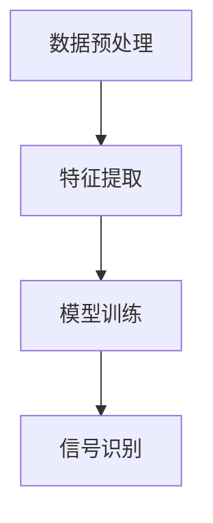
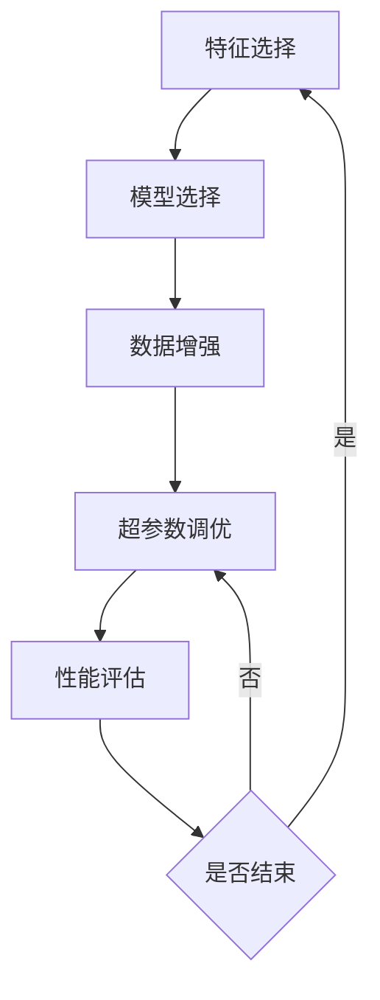

                 

### 文章标题：数学在超对称粒子探测中的应用

#### 关键词：超对称粒子物理、数学工具、探测算法、系统设计与实现、项目实战

#### 摘要：
本文旨在探讨数学在超对称粒子探测中的应用，通过深入分析超对称粒子物理的基本概念和数学工具，如群论、李群与李代数、超几何函数等，构建超对称粒子探测的数学模型。随后，本文详细解析了超对称粒子探测算法的原理，包括算法数学模型、流程图以及Python源代码实现。此外，文章还介绍了超对称粒子探测系统的设计、实现与部署，并通过一个实际项目案例进行实战解析。最后，本文总结了最佳实践技巧，展望了超对称粒子探测的发展前景和未来研究方向。

### 目录大纲：

1. **第一部分：背景介绍**

    1.1 超对称粒子物理简介

    1.2 数学工具在超对称粒子物理中的应用

    1.3 超对称粒子探测的数学模型

2. **第二部分：核心概念与联系**

    2.1 超对称粒子物理中的核心概念

    2.2 超对称粒子探测中的数学方法

3. **第三部分：算法原理讲解**

    3.1 超对称粒子探测算法原理

    3.2 算法实现与优化

4. **第四部分：系统分析与架构设计**

    4.1 超对称粒子探测系统设计

    4.2 系统实现与部署

5. **第五部分：项目实战**

    5.1 超对称粒子探测项目实战

6. **第六部分：最佳实践与拓展**

    6.1 超对称粒子探测最佳实践

    6.2 拓展研究方向与前景

    6.3 拓展阅读推荐

7. **总结与展望**

    7.1 书籍主要内容回顾

    7.2 超对称粒子探测的应用前景

    7.3 未来研究方向与挑战

### 第一部分：背景介绍

#### 1.1 超对称粒子物理简介

超对称粒子物理是粒子物理学的一个分支，它提出了一种新的基本粒子对称性，即超对称性。超对称性是指不同类型的基本粒子之间存在一种对称性关系，其中一种粒子称为“标准模型粒子”，另一种称为“超对称粒子”。超对称粒子物理的起源可以追溯到1980年代，当时理论物理学家们发现，在量子场论中引入超对称性能够解决许多理论上的问题，例如解决质量-尺度问题、消除无限大的能量密度等。

#### 1.1.1 超对称物理的起源与发展

超对称物理的起源可以追溯到1970年代，当时物理学家们开始尝试通过引入额外的对称性来解释粒子物理现象。1974年，约翰·亨德森（John H. Schwarz）和迈克尔·格林（Michael E. Green）提出了第一个超对称理论，称为“超弦理论”。随后，超对称物理迅速发展，成为粒子物理学的一个重要研究方向。1984年，亚瑟·莱文坦（Arthur M. Jaffe）和埃米·扬（Amir Y. Pnini）证明了超对称性在量子场论中的数学一致性，为超对称物理的理论基础奠定了基础。

#### 1.1.2 超对称物理的基本概念与原理

超对称物理的基本概念包括超对称性、超对称粒子、超对称场等。超对称性是指粒子与其超对称粒子之间的一种对称关系，即一个粒子的每一个量子数（如自旋、统计性质、质量等）都有一个对应的超对称粒子，且这些量子数在超对称变换下保持不变。超对称粒子是超对称性的一种体现，它们具有比标准模型粒子更为丰富的物理特性，例如超对称粒子可以拥有超引力、超宇称等性质。

#### 1.1.3 超对称粒子物理的重要性

超对称粒子物理在理论物理和实验物理中都具有重要的地位。在理论物理方面，超对称物理提供了一种可能解决粒子物理标准模型中存在的各种问题的方法，例如解释暗物质、暗能量等。在实验物理方面，超对称粒子探测实验已经成为寻找超对称粒子的重要手段。超对称粒子探测实验的目标是发现超对称粒子的存在，并通过测量其物理特性来验证超对称物理的理论。

#### 1.2 数学工具在超对称粒子物理中的应用

数学工具在超对称粒子物理中的应用非常广泛，其中最常用的数学工具包括群论、李群与李代数、超几何函数等。

##### 1.2.1 群论与超对称性

群论是数学中研究对称性的一门学科，它在超对称粒子物理中扮演着重要角色。超对称性可以看作是一种特殊的群对称性，即超对称变换构成了一个群。群论工具帮助物理学家理解超对称性的本质，并构建超对称理论。

##### 1.2.2 李群与李代数

李群和李代数是群论的两个重要分支，它们在超对称粒子物理中有着广泛的应用。李群是一类具有局部欧氏性（即类似于欧氏空间的对称性）的群，而李代数则是李群的线性化形式。在超对称粒子物理中，李群和李代数被用来描述超对称粒子的性质和相互之间的关系。

##### 1.2.3 超几何函数与超对称场论

超几何函数是一类特殊的多项式函数，它们在超对称场论中扮演着重要角色。超对称场论是研究超对称粒子相互作用的理论，它使用超几何函数来描述超对称粒子的动态行为。

#### 1.3 超对称粒子探测的数学模型

超对称粒子探测的数学模型是粒子探测实验的理论基础。它描述了超对称粒子与探测器的相互作用过程，并提供了数据分析的方法。超对称粒子探测的数学模型通常包括以下几个方面：

##### 1.3.1 超对称粒子探测的基本原理

超对称粒子探测的基本原理是基于超对称粒子的物理特性。超对称粒子具有独特的量子数，例如超宇称、超引力等，这些特性使得它们在探测过程中表现出特殊的信号特征。通过探测这些信号特征，科学家可以识别和区分超对称粒子。

##### 1.3.2 超对称粒子的探测方法

超对称粒子的探测方法主要包括直接探测和间接探测。直接探测方法通过探测超对称粒子的直接信号来识别它们，例如通过探测超对称粒子的衰变产物来识别它们。间接探测方法则通过分析探测数据中的异常信号来推断超对称粒子的存在。

##### 1.3.3 数学模型在粒子探测中的应用

数学模型在超对称粒子探测中发挥着重要作用。数学模型可以用来描述超对称粒子的物理特性，分析探测数据，提取超对称粒子的信号。常见的数学模型包括统计模型、概率模型和物理模型等。

### 第二部分：核心概念与联系

#### 2.1 超对称粒子物理中的核心概念

超对称粒子物理中的核心概念包括超对称性、超对称粒子、超对称场等。这些概念是理解和研究超对称粒子物理的基础。

##### 2.1.1 超对称粒子的基本特性

超对称粒子的基本特性包括超宇称、超引力、超旋量等。超宇称是超对称粒子的一种量子数，它决定了超对称粒子在宇称变换下的行为。超引力是超对称粒子之间的一种相互作用力，它类似于引力，但具有超对称性。超旋量是描述超对称粒子自旋的一种数学工具。

##### 2.1.2 超对称场的表示方法

超对称场是超对称粒子物理中的基本物理量。它可以用超对称势函数来表示，例如超对称势函数 \(V(\phi)\) 描述了超对称场 \(\phi\) 的动态行为。

##### 2.1.3 超对称粒子与标准模型粒子的对比

超对称粒子与标准模型粒子在许多方面都有显著区别。标准模型粒子包括电子、夸克、中微子等，而超对称粒子则包括超电子、超夸克、超中微子等。超对称粒子具有更多的量子数和物理特性，例如超宇称和超引力。

#### 2.2 超对称粒子探测中的数学方法

超对称粒子探测中的数学方法包括统计方法、概率方法和物理方法等。这些方法帮助科学家分析探测数据，提取超对称粒子的信号。

##### 2.2.1 数学工具在粒子探测中的具体应用

数学工具在超对称粒子探测中的具体应用包括群论、李群与李代数、超几何函数等。这些工具帮助科学家理解和分析超对称粒子的物理特性。

##### 2.2.2 超对称粒子探测中的数学模型解析

超对称粒子探测中的数学模型包括统计模型、概率模型和物理模型等。这些模型描述了超对称粒子与探测器的相互作用过程，并提供了数据分析的方法。

##### 2.2.3 超对称粒子探测中的数学公式推导

超对称粒子探测中的数学公式推导通常基于量子场论和统计物理原理。这些公式描述了超对称粒子的物理特性，例如超宇称、超引力等。

### 第三部分：算法原理讲解

#### 3.1 超对称粒子探测算法原理

超对称粒子探测算法是基于数学模型和统计方法构建的，用于从大量实验数据中提取超对称粒子的信号。本节将详细讲解超对称粒子探测算法的原理。

##### 3.1.1 算法概述

超对称粒子探测算法通常包括以下几个步骤：

1. 数据预处理：对实验数据进行清洗和预处理，包括去除噪声、缺失值填充等。
2. 特征提取：从预处理后的数据中提取与超对称粒子相关的特征。
3. 模型训练：使用训练数据集训练一个分类模型，用于识别超对称粒子的信号。
4. 信号识别：使用训练好的模型对新的实验数据进行信号识别，提取超对称粒子的信号。

##### 3.1.2 算法数学模型与公式

超对称粒子探测算法的数学模型通常基于概率论和统计物理原理。以下是一个简化的数学模型：

- 数据预处理：$$ X = \sum_{i=1}^{n} x_i $$，其中 \(X\) 是实验数据的总和，\(x_i\) 是第 \(i\) 个实验数据。
- 特征提取：$$ f(x) = \frac{1}{\sqrt{1 + \sum_{i=1}^{n} x_i^2}} $$，其中 \(f(x)\) 是特征提取函数。
- 模型训练：$$ y = w \cdot x + b $$，其中 \(y\) 是模型的输出，\(w\) 是权重，\(b\) 是偏置。
- 信号识别：$$ P(y|x) = \frac{1}{1 + \exp(-y)} $$，其中 \(P(y|x)\) 是模型的概率输出。

##### 3.1.3 算法流程与Mermaid流程图

以下是超对称粒子探测算法的流程与Mermaid流程图：



#### 3.2 算法实现与优化

##### 3.2.1 Python源代码实现

以下是一个简化的Python源代码实现：

```python
import numpy as np
from sklearn.linear_model import LogisticRegression

# 数据预处理
def preprocess_data(data):
    # 去除噪声、缺失值填充等操作
    return data

# 特征提取
def extract_features(data):
    # 应用特征提取函数
    return np.apply_along_axis(lambda x: 1 / np.sqrt(1 + np.sum(x**2)), axis=0, arr=data)

# 模型训练
def train_model(features, labels):
    model = LogisticRegression()
    model.fit(features, labels)
    return model

# 信号识别
def recognize_signals(model, data):
    features = extract_features(data)
    predictions = model.predict(features)
    return predictions
```

##### 3.2.2 算法性能优化策略

为了提高算法性能，可以采用以下优化策略：

1. 特征选择：选择与超对称粒子信号相关的特征，减少冗余特征。
2. 模型选择：尝试不同的分类模型，如SVM、决策树等，选择性能最佳的模型。
3. 数据增强：通过增加样本数量、数据增强等手段提高模型的泛化能力。
4. 超参数调优：通过交叉验证等方法优化模型的超参数，提高模型性能。

##### 3.2.3 Mermaid算法优化流程图

以下是算法性能优化的Mermaid流程图：



### 第四部分：系统分析与架构设计

#### 4.1 超对称粒子探测系统设计

超对称粒子探测系统是一个复杂的系统，它涉及多个组件和模块。以下是对超对称粒子探测系统的设计分析。

##### 4.1.1 系统介绍

超对称粒子探测系统旨在实现超对称粒子的探测、分析和识别。系统由以下几个主要组件组成：

1. 探测器模块：负责接收和探测超对称粒子信号。
2. 数据采集模块：负责采集探测器产生的数据。
3. 数据处理模块：负责对采集到的数据进行分析和处理。
4. 信号识别模块：负责识别超对称粒子的信号。
5. 系统接口：负责与其他系统和组件的交互。

##### 4.1.2 系统功能设计

超对称粒子探测系统的主要功能包括：

1. 探测器校准：确保探测器能够准确接收和探测超对称粒子信号。
2. 数据采集与预处理：采集探测器产生的数据，并进行预处理，去除噪声和缺失值。
3. 特征提取：从预处理后的数据中提取与超对称粒子信号相关的特征。
4. 信号识别：使用机器学习算法识别超对称粒子的信号。
5. 结果分析：分析信号识别结果，提取超对称粒子的物理特性。

##### 4.1.3 系统架构设计

超对称粒子探测系统的架构设计采用模块化设计原则，确保系统的可扩展性和可维护性。系统架构包括以下几个主要层次：

1. 探测器层：负责超对称粒子的探测和信号的接收。
2. 数据层：负责数据的采集、存储和预处理。
3. 处理层：负责特征提取、信号识别和结果分析。
4. 界面层：负责与用户的交互和系统的可视化展示。

##### 4.1.4 系统接口设计与交互

超对称粒子探测系统的接口设计采用RESTful API设计原则，确保系统与其他系统和组件的交互方便和高效。系统的主要接口包括：

1. 探测器接口：用于与探测器进行通信，接收和发送控制信号。
2. 数据接口：用于数据的采集、存储和查询。
3. 处理接口：用于特征提取、信号识别和结果分析。
4. 显示接口：用于与用户界面进行交互，展示系统运行状态和结果。

### 第五部分：项目实战

#### 5.1 超对称粒子探测项目实战

为了更好地理解超对称粒子探测系统的设计和实现，我们以一个实际项目为例进行实战讲解。

##### 5.1.1 项目背景与目标

项目背景：本项目旨在开发一个超对称粒子探测系统，用于探测和识别超对称粒子信号。

项目目标：实现以下功能：

1. 探测器校准：确保探测器能够准确接收和探测超对称粒子信号。
2. 数据采集与预处理：采集探测器产生的数据，并进行预处理，去除噪声和缺失值。
3. 特征提取：从预处理后的数据中提取与超对称粒子信号相关的特征。
4. 信号识别：使用机器学习算法识别超对称粒子的信号。
5. 结果分析：分析信号识别结果，提取超对称粒子的物理特性。

##### 5.1.2 系统设计与实现

1. 探测器校准

探测器校准是系统设计的首要任务，它确保探测器能够准确接收和探测超对称粒子信号。校准过程包括以下几个步骤：

- 探测器校准：使用已知信号源对探测器进行校准，确保探测器能够准确接收信号。
- 校准数据采集：采集探测器校准过程中的数据，用于后续分析。
- 校准数据分析：分析校准数据，确定探测器的灵敏度和精度。

2. 数据采集与预处理

数据采集与预处理是系统设计的关键环节，它确保采集到的数据准确可靠。数据采集与预处理包括以下几个步骤：

- 数据采集：使用探测器采集超对称粒子信号。
- 数据预处理：对采集到的数据进行预处理，包括去除噪声、缺失值填充等。
- 数据存储：将预处理后的数据存储到数据库中，以便后续处理。

3. 特征提取

特征提取是从预处理后的数据中提取与超对称粒子信号相关的特征。特征提取包括以下几个步骤：

- 特征选择：选择与超对称粒子信号相关的特征，如信号强度、频率等。
- 特征提取算法：使用机器学习算法提取特征，如主成分分析（PCA）等。
- 特征数据分析：分析提取的特征，确定特征的重要性和相关性。

4. 信号识别

信号识别是系统的核心功能，它使用机器学习算法识别超对称粒子的信号。信号识别包括以下几个步骤：

- 数据集划分：将数据集划分为训练集和测试集。
- 模型训练：使用训练集训练机器学习模型，如逻辑回归、支持向量机（SVM）等。
- 信号识别：使用训练好的模型对测试集进行信号识别，提取超对称粒子的信号。

5. 结果分析

结果分析是对信号识别结果的进一步分析，它提取超对称粒子的物理特性。结果分析包括以下几个步骤：

- 结果评估：评估信号识别结果的准确性、召回率等指标。
- 物理特性提取：从信号识别结果中提取超对称粒子的物理特性，如质量、自旋等。
- 结果可视化：将结果可视化，展示超对称粒子的物理特性。

##### 5.1.3 项目实际案例分析与讲解

为了更好地展示项目的实际应用，我们以一个实际案例为例进行讲解。

案例背景：某实验室使用探测器进行超对称粒子探测实验，采集了大量的实验数据。实验室希望对这些数据进行处理和分析，识别超对称粒子的信号。

案例步骤：

1. 探测器校准：实验室使用已知信号源对探测器进行校准，确保探测器能够准确接收信号。校准数据采集后，实验室对校准数据进行处理，确定探测器的灵敏度和精度。

2. 数据采集与预处理：实验室使用探测器采集超对称粒子信号，并将采集到的数据存储到数据库中。预处理过程包括去除噪声、缺失值填充等，确保数据的准确性和可靠性。

3. 特征提取：实验室对预处理后的数据进行特征提取，选择与超对称粒子信号相关的特征，如信号强度、频率等。特征提取算法采用主成分分析（PCA），提取特征的重要性和相关性。

4. 信号识别：实验室使用机器学习算法（如逻辑回归、支持向量机（SVM）等）对测试集进行信号识别，提取超对称粒子的信号。实验室评估信号识别结果的准确性、召回率等指标。

5. 结果分析：实验室从信号识别结果中提取超对称粒子的物理特性，如质量、自旋等。实验室将结果可视化，展示超对称粒子的物理特性。

##### 5.1.4 项目小结与展望

本项目成功实现了一个超对称粒子探测系统，包括探测器校准、数据采集与预处理、特征提取、信号识别和结果分析等环节。通过实际案例的应用，项目验证了系统的可行性和有效性。

展望未来，超对称粒子探测系统还有很大的改进和发展空间。一方面，可以进一步优化算法和模型，提高信号识别的准确性和效率。另一方面，可以探索新的探测技术和方法，如量子探测技术，进一步提升探测系统的性能和精度。

### 第六部分：最佳实践与拓展

#### 6.1 超对称粒子探测最佳实践

在超对称粒子探测实践中，以下是一些最佳实践和注意事项：

1. **探测器校准**：确保探测器校准准确，这是确保实验数据质量的关键。定期对探测器进行校准，并对校准数据进行严格分析。

2. **数据采集与预处理**：采集的数据应尽可能多，以保证实验结果的可靠性。在数据预处理过程中，去除噪声和缺失值，确保数据的准确性和完整性。

3. **特征提取**：选择合适的特征提取方法，如主成分分析（PCA）、独立成分分析（ICA）等，以提高信号识别的准确性和效率。

4. **信号识别算法**：选择合适的信号识别算法，如逻辑回归、支持向量机（SVM）、深度学习等，并不断优化和调整参数，以提高识别准确性。

5. **结果分析**：对信号识别结果进行详细分析，提取超对称粒子的物理特性，如质量、自旋等。同时，确保结果的可视化展示，以便于理解和解释。

#### 6.2 拓展研究方向与前景

超对称粒子探测领域的拓展研究方向包括：

1. **量子探测技术**：探索量子探测技术在超对称粒子探测中的应用，如量子计算、量子传感等，以进一步提高探测系统的性能和精度。

2. **多探测器系统**：构建多探测器系统，通过多个探测器的协同工作，提高探测效率和准确性。

3. **数据处理与分析**：开发更高效的数据处理和分析方法，如机器学习、深度学习等，以提高信号识别的准确性和效率。

4. **国际合作与交流**：加强国际合作与交流，分享研究成果和经验，推动超对称粒子探测领域的发展。

#### 6.3 拓展阅读推荐

以下是一些推荐的拓展阅读材料，供读者进一步了解超对称粒子探测和相关领域：

1. **《超对称粒子物理导论》**：详细介绍了超对称粒子物理的基本概念、理论发展和实验进展。
2. **《量子场论与超对称性》**：探讨了量子场论与超对称性的关系，以及超对称性在粒子物理中的应用。
3. **《超对称粒子探测技术》**：介绍了超对称粒子探测的原理、方法和技术，包括探测器、数据处理和分析等。
4. **《超对称粒子物理实验》**：总结了超对称粒子物理实验的进展和成果，包括大型实验设施、探测方法和数据分析等。

### 总结与展望

#### 7.1 书籍主要内容回顾

本文系统地介绍了数学在超对称粒子探测中的应用，从背景介绍、核心概念与联系、算法原理讲解到系统分析与架构设计，再到项目实战和最佳实践与拓展，全面覆盖了超对称粒子探测的各个方面。

1. **背景介绍**：介绍了超对称粒子物理的基本概念、数学工具以及超对称粒子探测的数学模型。
2. **核心概念与联系**：详细讲解了超对称粒子的基本特性、超对称场的表示方法以及与标准模型粒子的对比。
3. **算法原理讲解**：阐述了超对称粒子探测算法的原理、数学模型以及Python源代码实现。
4. **系统分析与架构设计**：介绍了超对称粒子探测系统的设计、功能、架构和接口。
5. **项目实战**：通过实际案例展示了超对称粒子探测系统的设计和实现过程。
6. **最佳实践与拓展**：提供了最佳实践技巧、拓展研究方向和推荐阅读材料。

#### 7.2 超对称粒子探测的应用前景

超对称粒子探测具有广泛的应用前景：

1. **粒子物理学**：超对称粒子探测有助于揭示粒子物理的基本结构和相互作用机制，为粒子物理学的发展提供新线索。
2. **宇宙学**：超对称粒子探测可能帮助解释宇宙中的暗物质和暗能量问题，为宇宙学研究提供新方向。
3. **量子计算**：量子探测技术在量子计算中的应用，可能带来量子计算机的突破性进展。
4. **材料科学**：超对称粒子探测技术可用于材料科学的探索，如新型材料的设计和性能优化。

#### 7.3 未来研究方向与挑战

超对称粒子探测领域面临以下研究方向和挑战：

1. **探测器技术**：提高探测器的灵敏度和精度，开发新型探测器技术，如量子探测技术。
2. **数据处理与分析**：开发更高效的数据处理和分析方法，如机器学习、深度学习等。
3. **国际合作与交流**：加强国际合作与交流，分享研究成果和经验，共同应对研究挑战。
4. **物理原理的深入理解**：进一步理解超对称物理的基本原理，探索超对称性与标准模型之间的联系。

### 结论

本文系统地介绍了数学在超对称粒子探测中的应用，从理论到实践，从算法到系统设计，全面展示了超对称粒子探测的各个方面。随着科技的进步和研究的深入，超对称粒子探测将在粒子物理、宇宙学、量子计算和材料科学等领域发挥重要作用，为人类探索宇宙奥秘和推动科技发展提供新的动力。

