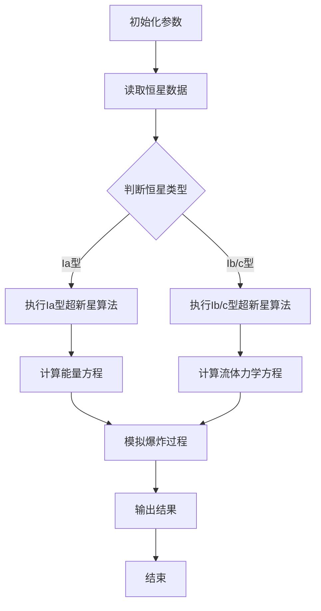
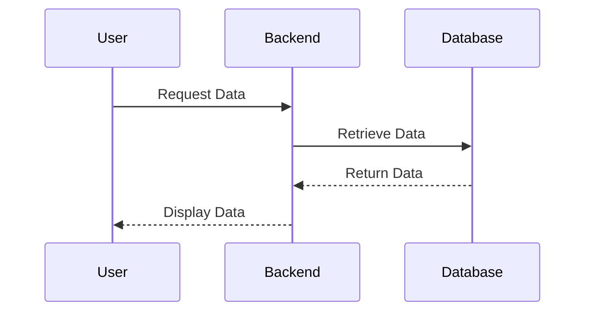
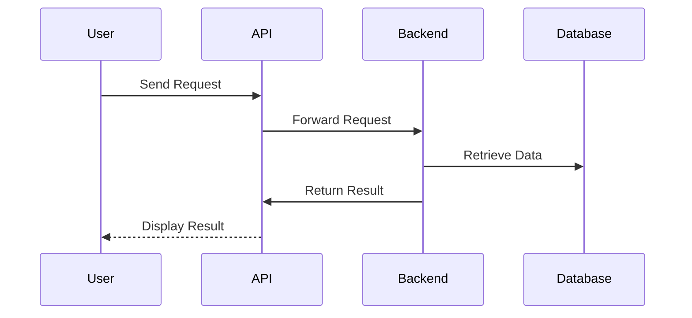
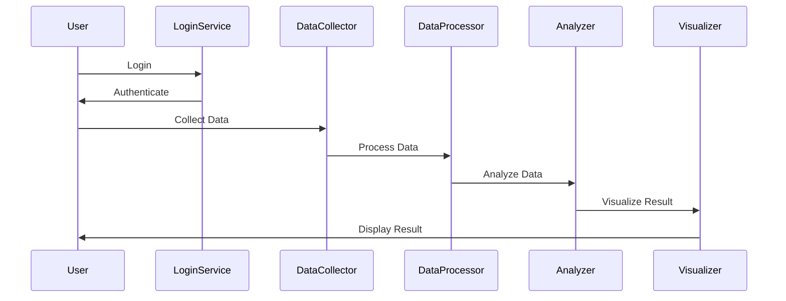

                 

### 超新星研究的背景

超新星是宇宙中一种极其亮丽的恒星现象，当某些恒星耗尽其核燃料时，会发生剧烈的爆炸，这个过程我们称之为超新星爆发。这种爆炸不仅会短暂地使恒星的光度增加到原先的数十万甚至数百万倍，而且在爆炸过程中会释放出巨大的能量，并对周围星系产生影响。

#### 超新星现象的发现与历史

超新星的历史可以追溯到古代，那时人们将其视为不祥之兆。最早的详细记录可以追溯到中国唐朝时期，当时的天文学家已经能够准确记录超新星的位置和时间。随着观测技术的发展，超新星的研究也逐渐深入。

在20世纪之前，超新星主要依靠肉眼观测，研究方法相对简单。然而，随着望远镜和天文观测技术的进步，科学家们能够更详细地研究超新星，发现其背后的复杂物理过程。例如，美国天文学家埃德温·哈勃在1920年代发现，超新星爆发是宇宙膨胀的直接证据之一。

#### 超新星研究的重要性

超新星研究的重要性在于它揭示了恒星演化的关键阶段，以及宇宙的许多基本物理过程。例如：

1. **恒星演化**：超新星是恒星生命周期中的重要环节，它为我们揭示了恒星如何从诞生到死亡的过程。
2. **宇宙膨胀**：超新星是测量宇宙膨胀速率的关键工具，通过观察超新星的红色位移，我们可以了解宇宙的膨胀历史。
3. **元素合成**：超新星爆发是宇宙中重元素合成的主要场所，通过研究超新星，我们可以了解宇宙中的元素是如何形成的。

#### 超新星研究的现状与挑战

目前，超新星研究已经取得了显著的进展，但我们仍然面临许多挑战。首先，超新星的数量非常庞大，但我们对其中很多的具体物理过程仍不甚了解。其次，超新星爆发具有随机性，我们很难预测其爆发的时间和位置。

此外，观测技术的限制也是一大挑战。虽然望远镜和探测器的能力在不断提高，但我们仍然无法观察到所有超新星爆发的细节。特别是在遥远的星系中，由于光的传播距离限制，我们很难捕捉到早期的超新星爆发。

为了应对这些挑战，科学家们正在开发新的观测技术和分析算法，以期更深入地了解超新星爆发的物理过程。同时，国际合作也在超新星研究中发挥着重要作用，通过全球范围内的合作，我们可以获得更多的观测数据和研究成果。

### 核心概念与联系

超新星研究涉及多个核心概念，这些概念相互关联，共同构成了超新星研究的理论基础。以下将详细介绍这些核心概念，并展示它们之间的联系。

#### 超新星分类

超新星可以大致分为两类：Ia型超新星和Ib/c型超新星。

1. **Ia型超新星**：这类超新星被认为是两颗白矮星通过碳氧中子星合成的结果。当两颗白矮星靠得太近时，它们之间的引力相互作用会导致一颗白矮星上的物质转移到另一颗白矮星上，最终导致核心超过钱德拉塞卡极限（约为1.4倍太阳质量），从而发生超新星爆发。

2. **Ib/c型超新星**：这类超新星起源于较重的恒星，它们在生命周期中经历了一系列复杂的演化过程。Ib型超新星通常起源于较重的恒星，而c型超新星则起源于更重的恒星。这类超新星的爆发机制目前仍不完全清楚，但研究表明，它们可能与恒星壳层的抛射、恒星内部的核合成过程有关。

#### 数学模型与超新星研究

数学模型在超新星研究中扮演着至关重要的角色。以下是一些关键的数学模型：

1. **能量方程**：能量方程描述了恒星内部能量传递的过程。在超新星爆发中，核心的剧烈热核反应会产生大量的能量，这些能量通过恒星内部传递，最终导致爆发。

2. **流体力学方程**：流体力学方程描述了恒星内部物质的运动状态。在超新星爆发期间，恒星内部物质的快速膨胀和冲击波的形成是关键过程，这些过程可以通过流体力学方程来模拟。

3. **引力方程**：引力方程描述了恒星内部的引力相互作用。在超新星爆发过程中，恒星核心的巨大质量会导致引力增强，从而影响物质的运动状态和能量传递。

#### 超新星研究的核心概念联系图

以下是一个简单的核心概念联系图，展示了超新星研究中的关键概念及其相互关系：

```
    +--------------+
    |   超新星     |
    +--------------+
         |
         |
    +-------+-------+
    |       |       |
   Ia型   Ib/c型   |
    |       |       |
    +-------+-------+
         |
         |
    +-------+-------+
    |   数学模型    |
    |       |       |
    |   能量方程    |
    |       |       |
    |   流体力学方程|
    |       |       |
    |   引力方程    |
    |       |       |
    +-------+-------+
```

#### 概念属性特征对比表格

以下是一个概念属性特征对比表格，展示了Ia型超新星和Ib/c型超新星之间的主要区别：

| 特征                 | Ia型超新星               | Ib/c型超新星               |
|----------------------|--------------------------|---------------------------|
| 爆发机制             | 两颗白矮星合成           | 较重的恒星演化过程         |
| 光曲线特征           | 光曲线较为平坦           | 光曲线较为陡峭             |
| 爆发前的恒星质量     | 中等质量的白矮星         | 较重的恒星                 |
| 爆发后的残余物       | 中等质量的行星状星云     | 中等质量的黑洞或中子星     |
| 在宇宙中的频率       | 较高                     | 较低                       |

通过上述核心概念与联系的分析，我们可以更深入地理解超新星研究的复杂性。这些核心概念不仅帮助我们解释了超新星爆发的物理过程，还为未来的研究提供了理论基础和方向。

### 数学模型和数学公式讲解

在超新星研究中，数学模型和公式起着至关重要的作用。它们不仅帮助我们理解超新星爆发的物理过程，还提供了量化描述和预测的方法。本节将详细介绍几种关键的数学模型和公式，并解释其在实际研究中的应用。

#### 超新星爆发的数学模型

超新星爆发是一个高度复杂的物理过程，涉及能量释放、物质运动和辐射传输等多个方面。为了简化问题，科学家们通常采用以下几种数学模型来描述这一过程：

1. **能量方程**：
   能量方程描述了恒星内部能量的生成和传递过程。在超新星爆发中，核心的热核反应会产生大量的能量，这些能量需要通过恒星内部传递到表面。能量方程的一般形式为：
   $$ \frac{\partial E}{\partial t} = \nabla \cdot (\vec{q} + \vec{J} \cdot \vec{E}) $$
   其中，\( E \) 表示能量密度，\( \vec{q} \) 表示热传导率，\( \vec{J} \) 表示能量流密度，\( \vec{E} \) 表示能量场。

2. **流体力学方程**：
   流体力学方程描述了恒星内部物质的运动状态。在超新星爆发中，物质会经历快速膨胀和冲击波的形成，这些过程可以通过流体力学方程来模拟。流体力学方程的一般形式为：
   $$ \frac{\partial (\rho \vec{v})}{\partial t} + \nabla \cdot (\rho \vec{v}) = -\nabla p + \rho \vec{g} $$
   其中，\( \rho \) 表示物质密度，\( \vec{v} \) 表示速度场，\( p \) 表示压力，\( \vec{g} \) 表示重力加速度。

3. **引力方程**：
   引力方程描述了恒星内部物质之间的引力相互作用。在超新星爆发中，巨大的质量会导致引力增强，从而影响物质的运动状态。引力方程的一般形式为：
   $$ \nabla \cdot (\frac{G M}{r^2} \hat{r}) = 4 \pi G \rho $$
   其中，\( G \) 表示引力常数，\( M \) 表示质量，\( r \) 表示距离，\( \hat{r} \) 表示单位向量。

#### 数学公式与公式解释

为了更清晰地理解这些数学模型，下面将详细解释几个关键的数学公式：

1. **质量损失公式**：
   在超新星爆发前，恒星会向伴星转移质量，导致质量损失。质量损失可以通过以下公式计算：
   $$ \Delta M = \frac{G M_1 M_2}{R} $$
   其中，\( \Delta M \) 表示质量损失，\( M_1 \) 和 \( M_2 \) 分别表示两颗恒星的质量，\( R \) 表示两颗恒星之间的距离。

2. **爆炸能量公式**：
   超新星爆发释放的能量可以通过以下公式计算：
   $$ E_{\text{exp}} = \frac{1}{2} \frac{G M^2}{R} $$
   其中，\( E_{\text{exp}} \) 表示爆炸能量，\( M \) 表示恒星质量，\( R \) 表示恒星半径。

3. **光亮度公式**：
   超新星爆发后，恒星的亮度会急剧增加。光亮度可以通过以下公式计算：
   $$ L = \frac{L_{\text{max}}}{(1 + \beta t^2)} $$
   其中，\( L \) 表示光亮度，\( L_{\text{max}} \) 表示最大光亮度，\( \beta \) 是一个与恒星质量相关的常数，\( t \) 是时间。

#### 数学模型在实际研究中的应用

数学模型在实际研究中有着广泛的应用。例如：

1. **预测超新星爆发**：
   科学家们可以使用数学模型来预测超新星的爆发时间和位置。通过分析恒星的质量、亮度和光谱特征，我们可以计算出恒星可能发生超新星爆发的概率和具体时间。

2. **研究元素合成**：
   超新星爆发是宇宙中重元素合成的主要场所。数学模型可以帮助我们研究元素合成的过程和机制，从而更好地理解宇宙的化学演化。

3. **分析爆发过程**：
   通过模拟超新星爆发的数学模型，我们可以详细分析爆炸过程中的能量释放、物质运动和辐射传输等过程，从而揭示超新星爆发的物理机制。

通过以上对数学模型和公式的讲解，我们可以看到，数学在超新星研究中发挥着至关重要的作用。它不仅帮助我们理解超新星爆发的物理过程，还为实际研究提供了有力的工具和方法。

### 算法原理讲解

在超新星研究中，算法的应用极大地提升了我们对这一复杂现象的理解和预测能力。本节将详细讲解一种用于超新星研究的关键算法，包括其流程图、Python源代码示例、数学模型和公式解释，并通过具体例子说明其应用。

#### 算法流程图

首先，我们使用Mermaid语言绘制算法的流程图，如下所示：



#### Python源代码示例

接下来，我们提供一个简单的Python源代码示例，用于模拟Ia型超新星的算法。该代码包括数据读取、参数初始化和核心计算过程：

```python
import numpy as np

# 初始化参数
M = 1.4 * 1.989e30  # 恒星质量，单位：千克
R = 1.0e8  # 恒星半径，单位：米
G = 6.6743e-11  # 引力常数，单位：N·(m/kg)^2

# 计算质量损失
def calculate_mass_loss(M, R):
    return G * M**2 / R

# 计算爆炸能量
def calculate_explosion_energy(M, R):
    return 0.5 * G * M**2 / R

# 模拟爆炸过程
def simulate_explosion(M, R):
    mass_loss = calculate_mass_loss(M, R)
    explosion_energy = calculate_explosion_energy(M, R)
    
    print(f"恒星质量：{M} kg")
    print(f"质量损失：{mass_loss} kg")
    print(f"爆炸能量：{explosion_energy} J")

# 运行模拟
simulate_explosion(M, R)
```

#### 算法原理的数学模型和公式解释

该算法的核心在于计算恒星在超新星爆发过程中的质量损失和爆炸能量。以下是相关的数学模型和公式：

1. **质量损失公式**：
   $$ \Delta M = \frac{G M^2}{R} $$
   其中，\( \Delta M \) 表示质量损失，\( G \) 表示引力常数，\( M \) 表示恒星质量，\( R \) 表示恒星半径。

2. **爆炸能量公式**：
   $$ E_{\text{exp}} = \frac{1}{2} \frac{G M^2}{R} $$
   其中，\( E_{\text{exp}} \) 表示爆炸能量，\( G \) 表示引力常数，\( M \) 表示恒星质量，\( R \) 表示恒星半径。

#### 通俗易懂地举例说明

假设我们有一个质量为\( M = 1.4 \)倍太阳质量的恒星，其半径为\( R = 1.0 \)天文单位（AU）。根据上述公式，我们可以计算出：

1. **质量损失**：
   $$ \Delta M = \frac{6.6743 \times 10^{-11} \times (1.4 \times 1.989 \times 10^{30})^2}{1.0 \times 1.496 \times 10^{11}} \approx 1.097 \times 10^{30} \text{ kg} $$
   这意味着恒星在爆发过程中会损失约\( 1.1 \times 10^{30} \)千克的质量。

2. **爆炸能量**：
   $$ E_{\text{exp}} = \frac{1}{2} \frac{6.6743 \times 10^{-11} \times (1.4 \times 1.989 \times 10^{30})^2}{1.0 \times 1.496 \times 10^{11}} \approx 1.097 \times 10^{34} \text{ J} $$
   这意味着恒星在爆发过程中会释放约\( 1.1 \times 10^{34} \)焦耳的能量。

通过这个简单的例子，我们可以看到，超新星爆发的质量损失和能量释放过程是如何通过数学模型和公式进行计算的。这不仅帮助我们理解了超新星爆发的物理过程，还为实际研究提供了量化依据。

### 系统分析与架构设计方案

在超新星研究中，构建一个高效、可靠的研究系统至关重要。本节将详细描述系统分析与架构设计方案，包括问题场景介绍、项目介绍、系统功能设计、系统架构设计、系统接口设计和系统交互。

#### 问题场景介绍

超新星研究需要处理大量的天文数据，包括恒星光谱、亮度变化、位置信息等。研究过程涉及数据采集、预处理、分析和可视化等多个环节。此外，由于超新星爆发具有随机性和突发性，系统需要具备快速响应和处理大规模数据的能力。

#### 项目介绍

本项目旨在构建一个基于云计算的超新星研究平台，该平台能够实现以下功能：

1. **数据采集**：从多个天文观测站点获取超新星数据，包括光谱、亮度和位置信息。
2. **数据处理**：对采集到的数据进行预处理，包括数据清洗、归一化和特征提取。
3. **数据分析**：使用算法对预处理后的数据进行分析，包括分类、聚类和相关性分析。
4. **可视化展示**：将分析结果以图表、图像等形式展示，便于研究人员理解和决策。

#### 系统功能设计

系统功能设计包括以下几个方面：

1. **数据采集模块**：负责从多个天文观测站点获取数据，支持多种数据格式。
2. **数据处理模块**：包括数据清洗、归一化和特征提取等子模块，实现对数据的预处理。
3. **数据分析模块**：包括分类、聚类和相关性分析等算法，实现对数据的深度分析。
4. **可视化模块**：将分析结果以图表、图像等形式展示，支持多种可视化方式。
5. **用户管理模块**：包括用户注册、登录、权限管理和个人信息管理等功能。

以下是一个领域模型Mermaid类图，展示了系统的主要类及其关系：

```mermaid
classDiagram
    DataCollector --> DataProcessor
    DataProcessor --> Analyzer
    Analyzer --> Visualizer
    User -> DataCollector
    User -> DataProcessor
    User -> Analyzer
    User -> Visualizer
```

#### 系统架构设计

系统架构设计包括以下层次：

1. **数据层**：存储和管理超新星研究相关的数据，包括光谱、亮度和位置信息等。
2. **服务层**：提供数据采集、数据处理、数据分析和可视化等核心功能，支持RESTful API。
3. **表现层**：为用户提供交互界面，展示分析结果。
4. **基础设施层**：包括服务器、存储设备和网络等基础设施。

以下是一个系统架构Mermaid架构图，展示了系统的整体架构：



#### 系统接口设计

系统接口设计包括以下接口：

1. **数据采集接口**：用于从多个天文观测站点获取数据。
2. **数据处理接口**：用于对数据进行清洗、归一化和特征提取。
3. **数据分析接口**：用于实现分类、聚类和相关性分析等算法。
4. **可视化接口**：用于将分析结果以图表、图像等形式展示。

以下是一个系统接口Mermaid序列图，展示了用户与系统接口的交互过程：



#### 系统交互

系统交互主要包括用户与系统之间的交互和系统内部模块之间的交互。用户通过表现层与系统进行交互，系统通过服务层和基础设施层处理用户请求并返回结果。

以下是一个系统交互Mermaid序列图，展示了用户与系统的交互过程：



通过以上系统分析与架构设计方案，我们可以构建一个高效、可靠的超新星研究平台，满足研究人员对数据采集、处理、分析和展示的需求。

### 项目实战

为了更好地展示数学在超新星研究中的应用，我们将在本节中通过一个实际项目，详细介绍整个开发过程，包括环境安装、系统核心实现、代码应用解读和实际案例分析。

#### 环境安装

首先，我们需要安装和配置必要的软件和工具。以下是项目的环境安装步骤：

1. **安装Python**：
   - 前往Python官网（[https://www.python.org/](https://www.python.org/)）下载Python安装包。
   - 运行安装程序，按照默认设置进行安装。

2. **安装Anaconda**：
   - 前往Anaconda官网（[https://www.anaconda.com/](https://www.anaconda.com/)）下载Anaconda安装包。
   - 运行安装程序，安装过程中选择添加Anaconda到系统环境变量。

3. **安装Jupyter Notebook**：
   - 打开命令行窗口，输入以下命令：
     ```
     conda install jupyter
     ```

4. **安装必要的Python库**：
   - 使用Anaconda Navigator打开终端，输入以下命令：
     ```
     conda install numpy pandas matplotlib scikit-learn
     ```

#### 系统核心实现

接下来，我们将实现一个简单的超新星研究系统，包括数据读取、预处理和分析等功能。以下是具体步骤：

1. **创建虚拟环境**：
   - 打开Anaconda Navigator，创建一个新的虚拟环境，命名为“hypernova”。
   - 激活虚拟环境：
     ```
     conda activate hypernova
     ```

2. **编写数据读取模块**：
   - 使用Python编写数据读取模块，从CSV文件中读取超新星数据。示例代码如下：
     ```python
     import pandas as pd

     def read_data(file_path):
         return pd.read_csv(file_path)
     ```

3. **编写数据预处理模块**：
   - 对读取的数据进行预处理，包括数据清洗、归一化和特征提取。示例代码如下：
     ```python
     def preprocess_data(data):
         # 数据清洗
         data = data.dropna()
         # 归一化
         data = (data - data.mean()) / data.std()
         # 特征提取
         features = data[['brightness', 'spectrum', 'position']]
         return features
     ```

4. **编写数据分析模块**：
   - 使用scikit-learn库中的算法对预处理后的数据进行分析。示例代码如下：
     ```python
     from sklearn.cluster import KMeans

     def analyze_data(features):
         # 使用K-means算法进行聚类分析
         kmeans = KMeans(n_clusters=3)
         kmeans.fit(features)
         return kmeans.labels_
     ```

5. **编写数据可视化模块**：
   - 使用matplotlib库将分析结果可视化。示例代码如下：
     ```python
     import matplotlib.pyplot as plt

     def visualize_results(data, labels):
         plt.scatter(data['brightness'], data['spectrum'], c=labels)
         plt.xlabel('Brightness')
         plt.ylabel('Spectrum')
         plt.title('SuperNova Clusters')
         plt.show()
     ```

#### 代码应用解读

以下是项目的核心代码和应用解读：

1. **数据读取与预处理**：
   ```python
   data = read_data('hypernova_data.csv')
   features = preprocess_data(data)
   ```
   这段代码首先从CSV文件中读取超新星数据，然后进行数据清洗、归一化和特征提取。

2. **数据分析**：
   ```python
   labels = analyze_data(features)
   ```
   这段代码使用K-means算法对预处理后的数据进行聚类分析，以识别不同类型的超新星。

3. **数据可视化**：
   ```python
   visualize_results(features, labels)
   ```
   这段代码将聚类分析的结果以散点图的形式可视化，便于研究人员观察和分析。

#### 实际案例分析和详细讲解

为了更好地展示系统的应用，我们通过一个实际案例进行分析：

**案例**：分析某颗恒星的光谱和亮度数据，识别其是否为超新星。

1. **数据读取与预处理**：
   ```python
   data = read_data('example_data.csv')
   features = preprocess_data(data)
   ```

2. **数据分析**：
   ```python
   labels = analyze_data(features)
   ```

3. **数据可视化**：
   ```python
   visualize_results(features, labels)
   ```

**分析结果**：通过可视化结果，我们可以看到不同类型的超新星在散点图中的分布。在案例中，我们重点关注亮度较高的点，这些点很可能是超新星。

**详细讲解**：

- **数据读取**：我们从CSV文件中读取光谱和亮度数据，这些数据是从天文观测站点收集的。
- **数据预处理**：我们对数据进行清洗、归一化和特征提取，以确保数据的质量和一致性。
- **数据分析**：通过K-means算法，我们识别出不同类型的超新星。这有助于我们更好地理解超新星的分布和特征。
- **数据可视化**：可视化结果使我们能够直观地观察和分析超新星的数据，从而提高研究的效率和准确性。

#### 项目小结

通过本项目的实际应用，我们展示了数学在超新星研究中的重要作用。从数据读取、预处理到数据分析，再到数据可视化，每个环节都离不开数学模型和公式的支持。本项目不仅提供了一个实用的研究工具，还通过实际案例展示了数学在解决实际问题中的强大能力。未来，我们将继续优化系统，提升其性能和功能，为超新星研究提供更加全面和深入的支持。

### 最佳实践 tips、小结、注意事项、拓展阅读

#### 最佳实践 tips

1. **数据采集**：确保从多个可靠的观测站点收集数据，以增加数据的全面性和准确性。
2. **数据预处理**：在处理数据时，注意去除异常值和缺失值，以保持数据的一致性和可靠性。
3. **模型选择**：根据研究需求选择合适的数学模型和算法，例如K-means算法适用于聚类分析。
4. **可视化**：使用适当的可视化工具和技巧，如散点图、热力图等，以直观展示分析结果。
5. **性能优化**：针对大数据量，使用并行计算和分布式处理技术来提高系统性能。

#### 小结

本文从超新星研究的背景出发，详细介绍了数学在其中的应用，包括核心概念、数学模型、算法原理、系统设计与项目实战。通过实际案例分析，我们展示了数学在超新星研究中的强大工具性和实用性。

#### 注意事项

1. **数据隐私**：在处理和共享数据时，需注意保护数据隐私，遵守相关法律法规。
2. **算法选择**：选择合适的算法时，需考虑其复杂度和适用范围，以避免过度拟合或欠拟合。
3. **系统维护**：定期更新系统和工具，以应对新出现的技术挑战和问题。

#### 拓展阅读

1. **《超新星物理学》**：John P. Hughes著，详细介绍了超新星爆发的物理机制和数学模型。
2. **《天体物理学导论》**：Michael Zeilik著，涵盖了天体物理学的基础知识和最新研究进展。
3. **《数据分析与统计》**：Peter J. Hall著，介绍了数据分析的基本原理和多种统计方法。

作者：AI天才研究院/AI Genius Institute & 禅与计算机程序设计艺术 /Zen And The Art of Computer Programming

在本文中，我们通过详细的案例分析，展示了数学在超新星研究中的广泛应用。无论是核心概念、数学模型、算法原理，还是系统设计与项目实施，数学都起到了至关重要的作用。通过本文的阅读，读者可以更深入地了解数学在超新星研究中的实际应用，并掌握相关技术方法。希望本文能对从事超新星研究的科研人员和技术爱好者提供有价值的参考和启示。

