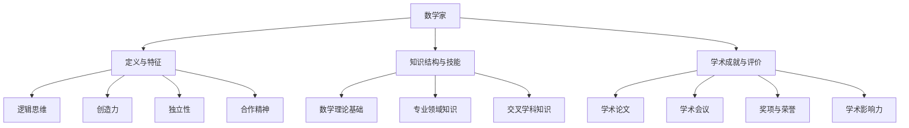

                 

## 数学家的学术交流与合作

### 关键词：数学学术交流、数学合作、数学家、学术会议、学术合作、跨学科合作

### 摘要：

本文旨在探讨数学家的学术交流与合作，分析其重要性及现状。我们将逐步介绍数学家的角色与贡献，探讨学术交流与合作的基本概念、方式及面临的挑战。通过成功案例分析，总结数学家的成长之路，最后展望数学学术交流的未来趋势与挑战。文章将结合具体实例，使用专业的技术语言和流程图，为读者提供全面而深入的理解。

## 目录大纲设计思路

在设计《数学家的学术交流与合作》这本书的目录大纲时，我们遵循了以下几个关键步骤：

1. **明确书的核心主题**：本书的核心主题是关于数学家的学术交流与合作，围绕这一主题展开，旨在全面介绍数学家在学术领域的角色、交流方式、合作技巧以及未来挑战。

2. **梳理书籍结构**：基于书名，我们初步确定了书籍的结构应包括背景介绍、核心概念与联系、交流与合作方式、案例分析、数学家的成长之路以及未来趋势与挑战等部分。

3. **设计详细的章节**：每个部分都需要进一步细分，以确保内容全面且层次清晰。本书设计了七个主要章节，每章都有明确的小节和主题。

4. **确保内容完整性**：根据要求，目录大纲中需要包含背景介绍、核心概念与联系、算法原理讲解、数学模型和公式详细讲解、系统分析与架构设计方案、项目实战、最佳实践 tips、小结、注意事项、拓展阅读等内容。

5. **简洁性与可读性**：在保证内容完整性的同时，我们力求确保目录大纲简洁明了，便于读者快速了解书的核心内容和结构。

下面我们将详细解释每个章节的设计思路和内容。

### 第一部分：背景介绍

#### 第1章：问题背景

- **数学家的角色与贡献**：介绍数学家在现代科学体系中的重要性，以及数学在科学研究中的应用和影响力。
- **学术交流与合作的重要性**：阐述学术交流的概念与意义，以及学术合作对数学发展的推动作用。
- **数学家的学术交流现状**：分析数学学术交流的常见形式、现状与面临的挑战。
- **本章小结**：总结本章内容，为后续章节奠定基础。

### 第二部分：核心概念与联系

#### 第2章：数学家的核心概念

- **数学家的定义与特征**：详细阐述数学家的基本素质、研究方法和思维方式。
- **数学家的知识结构与技能**：探讨数学家的知识储备、持续学习以及技能与能力的培养。
- **数学家的学术成就与评价**：介绍学术成就的评价标准以及学术界的评价体系。
- **核心概念联系图**：使用 Mermaid 绘制数学家的核心概念联系图，帮助读者理解概念之间的联系。
- **本章小结**：总结本章内容，为读者提供清晰的认知框架。

### 第三部分：交流与合作方式

#### 第3章：学术交流方式

- **学术会议与研讨会**：介绍学术会议与研讨会的作用、形式以及参与与组织。
- **学术期刊与出版**：阐述学术期刊的重要性、发表论文的流程以及出版方面的注意事项。
- **学术报告与讲座**：讨论学术报告与讲座的内容、技巧以及组织与参与。
- **学术交流网络平台**：介绍学术交流网络平台的作用、使用技巧以及常用平台。
- **本章小结**：总结本章内容，为读者提供丰富的学术交流渠道。

#### 第4章：学术合作方式

- **跨学科合作**：探讨跨学科合作的定义、优势以及面临的挑战与解决方案。
- **国际合作**：分析国际合作的重要性、形式与渠道。
- **团队建设与合作**：介绍团队合作的原则、工具与方法。
- **本章小结**：总结本章内容，为读者提供实用的合作策略。

### 第四部分：案例分析

#### 第5章：成功案例分析

- **数学家的成功故事**：通过成功数学家的故事，分析成功因素并总结经验与启示。
- **合作项目实例**：介绍合作项目的具体实例，展示项目成果与应用。
- **案例分析小结**：总结案例分析的结果，为读者提供实践指导。

### 第五部分：数学家的成长之路

#### 第6章：数学家的成长与学术发展

- **数学家的学术生涯规划**：探讨数学家学术生涯规划的重要性、内容与方法。
- **学术成长与自我提升**：介绍学术成长的方法、学习资源与学术素养的培养。
- **学术道路上的挑战与应对**：分析数学家在学术道路上面临的挑战以及应对策略。
- **本章小结**：总结本章内容，为读者提供成长指南。

### 第六部分：展望与挑战

#### 第7章：未来趋势与挑战

- **数学学术交流的未来趋势**：分析新技术对数学学术交流的影响以及交流方式的创新。
- **学术合作的新模式**：探讨跨界合作、跨学科融合等新趋势。
- **面临的挑战与应对策略**：分析资源限制、信息过载等挑战以及应对策略。
- **本章小结**：总结未来趋势与挑战，为数学家的学术发展提供参考。

### 总结

通过上述七个部分的详细目录大纲设计，本书旨在全面介绍数学家的学术交流与合作，帮助读者理解数学家在学术领域的角色、交流方式、合作技巧，以及如何应对未来挑战。目录大纲简洁明了，结构清晰，为读者提供了良好的阅读框架。本书不仅适合数学专业人士，也适合对数学学术交流有兴趣的读者。

## 数学家的学术交流与合作

### 核心关键词：数学学术交流、数学合作、数学家、学术会议、学术合作、跨学科合作

### 摘要：

在科学研究的广阔领域内，数学家作为引领者之一，其学术交流与合作对整个学科的发展至关重要。本文旨在深入探讨数学家的学术交流与合作，分析其重要性、现状以及面临的挑战。通过详细的案例分析，本文将揭示数学家的成长之路，并展望数学学术交流的未来趋势。文章将使用专业的技术语言和流程图，为读者提供一个全面而深入的视角。

## 一、问题背景

### 1.1 数学家的角色与贡献

数学家作为科学研究的核心力量，不仅在理论上做出了重要的贡献，还在实际应用中发挥了关键作用。数学家通过其深刻的思维和独特的视角，对自然现象和工程问题进行了精确的量化与建模。例如，数学家在密码学、统计学、物理学、经济学等领域的工作，为解决复杂问题提供了强有力的工具。

在现代社会，数学的应用范围越来越广泛，从金融计算到基因组学，从数据科学到人工智能，数学家的工作无处不在。他们的贡献不仅提升了科学研究的效率，还推动了技术进步和社会发展。

### 1.2 学术交流与合作的重要性

学术交流与合作是科学研究的生命线。通过学术交流，数学家可以分享研究成果、交流思想、获取新的知识和技术。合作研究则能够整合不同专家的智慧，解决单凭个人力量难以克服的问题。

学术交流的重要性体现在多个方面。首先，它是知识传播和扩散的重要途径，促进了科学共同体内部的沟通与合作。其次，它有助于激发创新思维，通过不同观点的碰撞和融合，催生新的理论和方法。此外，学术交流还能提高研究者的学术素养和影响力，推动整个学科的进步。

### 1.3 数学家的学术交流现状

数学家的学术交流形式多样，包括学术会议、研讨会、期刊发表、学术报告和讲座等。这些交流方式为数学家提供了一个展示研究成果、探讨前沿问题、建立合作关系的重要平台。

当前，数学学术交流面临一些挑战。例如，信息爆炸使得研究者难以高效地获取和处理大量学术信息。此外，学术评价体系的局限性也可能影响数学家的学术交流和合作。

### 1.4 本章小结

数学家在现代科学研究中的角色和贡献不可忽视。学术交流与合作是推动学科发展的关键，然而现状中仍存在诸多挑战。了解这些问题和背景，有助于我们更好地理解数学家的学术交流与合作的重要性。

## 二、核心概念与联系

### 2.1 数学家的定义与特征

数学家是专门从事数学研究的专业人士，他们具备深厚的数学知识和卓越的思维能力。数学家不仅需要掌握丰富的数学理论，还需要具备创新思维和解决问题的能力。

数学家的特征包括：

- **逻辑思维**：数学家擅长逻辑推理，能够从复杂问题中提取关键信息，构建数学模型。
- **创造力**：数学家具有强烈的创造力，能够在数学领域中提出新的理论和方法。
- **独立性**：数学家独立工作能力强，能够在没有外部干扰的情况下专注于研究。
- **合作精神**：尽管独立工作能力强大，但数学家也具备合作精神，能够与他人共同解决复杂问题。

### 2.2 数学家的知识结构与技能

数学家的知识结构通常包括以下几个方面：

- **数学理论基础**：包括代数、几何、拓扑、分析等基本数学理论。
- **专业领域知识**：根据研究领域不同，数学家可能还需要掌握特定的数学分支知识。
- **交叉学科知识**：随着跨学科研究的增多，数学家需要具备一定的交叉学科知识，以便更好地理解其他领域的问题。

数学家的技能包括：

- **数学建模能力**：能够将实际问题转化为数学模型，并利用数学方法求解。
- **数学证明能力**：能够用严格的数学语言证明数学命题。
- **编程能力**：现代数学家通常需要掌握编程技能，以便进行计算和数据处理。

### 2.3 数学家的学术成就与评价

数学家的学术成就主要通过以下几个指标进行评价：

- **学术论文**：发表在权威学术期刊上的论文数量和质量。
- **学术会议**：参与的重要学术会议和研讨会。
- **奖项与荣誉**：获得的学术奖项和荣誉，如菲尔兹奖、阿贝尔奖等。
- **学术影响力**：研究成果被引用的次数和影响力。

### 2.4 核心概念联系图

为了更好地理解数学家的核心概念，我们使用 Mermaid 绘制了一个核心概念联系图：

### 2.5 本章小结

数学家的定义与特征、知识结构与技能以及学术成就与评价构成了数学家的核心概念。通过本章的介绍，我们能够更好地理解数学家在学术领域中的角色和作用，为后续章节的分析提供了基础。

## 三、交流与合作方式

### 3.1 学术会议与研讨会

学术会议与研讨会是数学家进行学术交流的重要形式。这些活动不仅提供了一个展示研究成果的平台，也为数学家们提供了一个交流思想、探讨前沿问题、建立合作关系的机会。

#### 3.1.1 作用与形式

学术会议通常分为国际会议、国内会议、地区性会议等，它们的作用包括：

- **知识传播**：通过报告、论文展示等形式，将最新的研究成果传播给更广泛的科学共同体。
- **合作机会**：与会者可以结识同领域或其他领域的专家，探讨合作研究的可能性。
- **学术评价**：学术会议通常会有同行评审，为研究者提供了一个学术评价的平台。

研讨会则更为聚焦和深入，通常围绕某一具体主题或研究方向展开，形式包括专题报告、圆桌讨论、工作坊等。

#### 3.1.2 参与与组织

数学家参与学术会议与研讨会，可以通过以下几个步骤：

1. **关注会议通知**：关注国内外相关领域的学术会议和研讨会通知，了解会议的主题、时间和地点。
2. **提交论文**：如果会议接受论文投稿，研究者可以按照会议要求提交相关论文。
3. **参会交流**：参加会议，参与报告、讨论和其他活动，与其他研究者交流观点。
4. **建立联系**：在会议期间结识同行，建立合作关系。

组织学术会议与研讨会则需要以下步骤：

1. **确定主题**：根据研究领域和发展趋势，确定会议的主题。
2. **邀请专家**：邀请领域内的知名专家和研究者作为会议报告人。
3. **筹备会议**：包括会议通知、场地预订、议程安排等。
4. **会议组织**：确保会议顺利进行，包括现场组织和会后的资料整理。

#### 3.1.3 学术会议与研讨会的价值

学术会议与研讨会在数学家的学术生涯中具有重要价值。通过这些活动，数学家能够：

- **提升研究水平**：通过参与和听取报告，了解最新的研究动态和前沿成果。
- **建立合作关系**：与其他研究者建立联系，共同开展合作研究。
- **扩大学术影响力**：通过会议报告和论文发表，提升自己的学术影响力。

### 3.2 学术期刊与出版

学术期刊是数学家发表研究成果的重要平台。通过期刊发表，数学家能够将研究成果广泛传播，接受同行的评审和反馈，进一步提升研究的质量和影响力。

#### 3.2.1 期刊的重要性

学术期刊具有以下几个重要作用：

- **知识传播**：期刊作为知识传播的重要载体，为科学共同体提供了丰富的学术资源。
- **学术评价**：期刊的影响因子和引用次数是评价学术成果的重要指标，对研究者的学术声誉有重要影响。
- **创新激励**：期刊的发表机制激励研究者不断进行创新性研究，推动学科发展。

#### 3.2.2 发表论文的流程

发表论文通常包括以下几个步骤：

1. **选题与写作**：研究者根据研究领域和兴趣选择合适的题目，撰写论文草稿。
2. **投稿**：按照期刊的要求，将论文提交到目标期刊。
3. **同行评审**：期刊编辑将论文分配给相关领域的同行进行评审，评审结果可能包括修改后再投稿、拒稿等。
4. **修改与反馈**：根据评审意见对论文进行修改，并再次提交给期刊。
5. **接受与发表**：经过多次评审和修改，论文最终被接受并发表在期刊上。

#### 3.2.3 出版方面的注意事项

在出版方面，数学家需要注意以下几点：

- **遵守学术规范**：遵循期刊的格式要求、引用规范和学术道德。
- **选择合适的期刊**：根据论文的内容和质量，选择适合的期刊投稿。
- **积极应对评审意见**：认真对待评审意见，对论文进行有针对性的修改。
- **版权问题**：了解期刊的版权政策，确保论文的版权归属问题。

### 3.3 学术报告与讲座

学术报告与讲座是数学家进行学术交流的另一种重要形式。通过报告和讲座，数学家可以详细介绍自己的研究成果、研究方法和未来研究方向，吸引更多的关注和合作。

#### 3.3.1 内容与技巧

学术报告与讲座的内容通常包括：

- **研究背景**：介绍研究的问题背景和动机。
- **研究方法**：详细阐述研究采用的方法和技术。
- **研究结果**：展示研究的主要发现和结论。
- **未来展望**：讨论研究的未来方向和潜在应用。

在准备和进行报告与讲座时，数学家需要注意以下几点技巧：

- **结构清晰**：确保报告的结构紧凑、逻辑清晰。
- **语言简练**：使用简洁明了的语言，避免过于专业化的术语。
- **视觉辅助**：使用图表、幻灯片等视觉辅助工具，帮助听众更好地理解内容。
- **互动交流**：鼓励听众提问和参与讨论，增加报告的互动性。

#### 3.3.2 组织与参与

数学家参与学术报告与讲座，可以通过以下步骤：

1. **关注报告通知**：关注学术机构、研究组织或相关领域会议的通知，了解报告和讲座的时间、地点和主题。
2. **准备报告内容**：根据主题和听众，准备详细的报告内容。
3. **参加讲座**：按时参加讲座，认真听取报告并进行记录。
4. **互动交流**：在讲座结束后，积极参与讨论，与其他研究者交流观点。

组织学术报告与讲座，则需要以下步骤：

1. **确定主题**：根据研究兴趣和领域需求，确定报告或讲座的主题。
2. **邀请专家**：邀请领域内的知名专家或学者作为报告人或讲座人。
3. **准备场地**：预订合适的场地，准备必要的设备和物资。
4. **宣传推广**：通过邮件、社交媒体等渠道宣传讲座，吸引更多的听众。

#### 3.3.4 学术报告与讲座的价值

学术报告与讲座对数学家的学术发展具有重要价值。通过这些活动，数学家能够：

- **展示研究成果**：向同行展示自己的研究成果，提升学术影响力。
- **获取反馈**：通过听众的反馈，了解研究的优点和不足，进行改进。
- **建立联系**：与其他研究者建立联系，拓展合作渠道。
- **提升沟通能力**：通过报告和讲座，提高沟通和表达能力，增强学术自信。

### 3.4 学术交流网络平台

随着互联网技术的发展，学术交流网络平台成为数学家进行学术交流与合作的重要工具。这些平台提供了便捷的交流渠道，使得数学家能够跨越地域限制，随时随地进行学术交流。

#### 3.4.1 平台介绍

学术交流网络平台主要包括以下几种：

- **学术期刊在线平台**：如 JSTOR、SpringerLink 等，提供丰富的学术期刊资源。
- **学术会议在线平台**：如 MeetingAbstracts、ACM Digital Library 等，提供学术会议的论文和报告。
- **学术社区平台**：如 ResearchGate、Academia.edu 等，允许研究者发布论文、交流观点、建立合作关系。
- **学术论坛**：如 Stack Overflow、Math Overflow 等，为数学家提供一个讨论数学问题的平台。

#### 3.4.2 使用技巧

数学家在使用学术交流网络平台时，需要注意以下几点技巧：

- **内容发布**：确保发布的内容具有学术价值和真实可靠性，遵守学术规范。
- **关注同行**：关注领域内的知名专家和学者，了解他们的研究成果和观点。
- **积极参与**：积极参与平台上的讨论和互动，提出问题、回答问题，分享自己的研究成果。
- **建立联系**：通过平台建立合作关系，共同开展研究项目。

### 3.5 本章小结

学术交流与合作是数学家进行学术研究的重要手段。学术会议与研讨会、学术期刊与出版、学术报告与讲座以及学术交流网络平台等多种形式，为数学家提供了一个展示研究成果、交流思想、建立合作关系的重要平台。通过有效的学术交流与合作，数学家能够提升研究水平，推动学科发展，实现学术影响力的提升。

## 四、案例分析

### 4.1 成功案例分析

数学家作为科学界的杰出代表，他们的成功故事不仅展现了个人才华，也揭示了学术交流与合作在数学发展中的重要作用。以下将介绍几位著名数学家的成功故事，并分析其成功因素。

#### 4.1.1 赫尔曼·魏尔

赫尔曼·魏尔是一位在数学和物理学领域都有杰出贡献的数学家。他因在几何学、相对论和量子力学等领域的工作而闻名。魏尔的成功离不开他的跨学科合作精神。他与爱因斯坦合作，共同研究广义相对论，这一成果不仅改变了物理学的发展方向，也推动了数学的应用。

**成功因素：**
- **跨学科合作**：魏尔与物理学家爱因斯坦的合作，使他能够将数学理论应用于物理学，实现了跨学科的合作。
- **创新能力**：魏尔在数学领域不断提出新的理论，如黎曼几何，为物理学提供了重要的数学工具。

#### 4.1.2 菲利普·莱因斯

菲利普·莱因斯是一位在数论和组合数学领域有重要贡献的数学家。他因对素数分布的研究而著名。莱因斯的成功得益于他长期的独立研究和学术合作。

**成功因素：**
- **独立研究**：莱因斯通过长期的独立研究，解决了数论中的许多难题，如黎曼猜想的一部分。
- **学术合作**：他与其他数学家的合作，如与阿兰·图灵的合作，推动了组合数学的发展。

#### 4.1.3 詹姆斯·加菲尔德

詹姆斯·加菲尔德是一位在代数学和图论领域有杰出贡献的数学家。他因发明了加菲尔德猜想而闻名。加菲尔德的成功与其对代数结构的研究和对图论方法的运用密不可分。

**成功因素：**
- **对代数结构的深入研究**：加菲尔德对代数结构的深刻理解，使他能够提出新的代数猜想。
- **创新的方法**：他使用图论方法解决了许多代数问题，推动了代数和图论的结合。

### 4.2 合作项目实例

合作项目是数学家成功的重要途径之一。以下将介绍几个著名的数学合作项目，并分析其成果与应用。

#### 4.2.1 四色定理

四色定理是一个著名的数学问题，它提出任意一张地图只需要四种颜色就能区分所有相邻区域。这个定理的证明是通过数学家们长期的合作完成的。

**项目介绍：**
- **项目目标**：证明四色定理，即任意一张地图可以用四种颜色区分所有相邻区域。
- **项目成果**：通过合作，数学家们最终证明了四色定理，这一成果在计算机科学、地理学等领域有广泛应用。

**成果与应用：**
- **计算机科学**：四色定理的证明方法为计算机算法的研究提供了新的思路。
- **地理学**：四色定理在地图绘制和地理信息系统中有着重要应用。

#### 4.2.2 黎曼猜想

黎曼猜想是数学中一个重要的未解决问题，它涉及到素数的分布规律。许多数学家都致力于这一问题的研究。

**项目介绍：**
- **项目目标**：证明黎曼猜想，即黎曼ζ函数的非平凡零点全部位于临界线上。
- **项目成果**：尽管黎曼猜想尚未得到证明，但许多数学家通过合作研究，提出了一系列相关理论和方法，推动了数学的发展。

**成果与应用：**
- **数学理论**：黎曼猜想的研究推动了复分析、数论等领域的发展。
- **密码学**：黎曼猜想的研究成果在密码学中有着重要应用，如RSA加密算法。

### 4.3 案例分析小结

通过成功数学家的故事和合作项目实例，我们可以看到学术交流与合作在数学发展中的重要作用。跨学科合作、独立研究、创新思维以及合作精神都是数学家成功的关键因素。合作项目不仅推动了数学理论的进步，也为数学的应用提供了新的可能性。通过这些案例，我们可以更好地理解数学家的学术交流与合作，以及其对数学学科发展的重要影响。

## 五、数学家的成长与学术发展

### 5.1 数学家的学术生涯规划

对于数学家而言，学术生涯规划是至关重要的。一个成功的学术生涯不仅需要卓越的才能，还需要明确的规划和科学的策略。以下将介绍数学家学术生涯规划的重要性、内容与方法。

#### 5.1.1 规划的重要性

学术生涯规划有助于数学家明确自己的研究方向、设定研究目标、合理分配时间和资源。通过规划，数学家可以：

- **明确目标**：设定清晰的学术目标，有助于集中精力，避免研究方向的盲目性。
- **提高效率**：合理分配时间，确保在有限的时间内取得最大成效。
- **持续成长**：通过规划，数学家可以不断学习、提升自己的学术能力，保持学术活力。

#### 5.1.2 规划的内容

数学家的学术生涯规划应包括以下几个方面：

1. **研究方向**：根据个人兴趣、学科发展趋势和国家需求，确定合适的研究方向。
2. **学术目标**：设定短期和长期的学术目标，如发表论文、参与重要项目、获得学术奖项等。
3. **时间管理**：制定详细的时间表，合理安排科研、教学、学术交流等工作。
4. **资源配置**：合理配置研究资源，包括资金、设备、人才等。
5. **个人成长**：制定个人成长计划，包括学术能力提升、学术影响力扩大等。

#### 5.1.3 规划的方法

数学家学术生涯规划的方法包括以下几个步骤：

1. **自我评估**：评估自己的学术背景、兴趣、优势和不足，明确自己的学术定位。
2. **市场调研**：了解学术界的最新动态、学科发展趋势和热点问题。
3. **制定计划**：结合自我评估和市场调研，制定具体的学术生涯规划。
4. **执行与调整**：根据实际情况，执行规划并适时调整，确保规划的有效性。

### 5.2 学术成长与自我提升

学术成长是数学家职业生涯中的核心任务，自我提升则是实现学术成长的关键。以下将探讨学术成长的方法、学习资源与学术素养的培养。

#### 5.2.1 学术成长的方法

数学家学术成长的方法包括以下几个方面：

1. **深入研读经典文献**：经典文献是数学知识的基石，通过深入研读，数学家可以掌握核心概念和理论。
2. **参与学术交流**：通过参与学术会议、研讨会和学术讲座，数学家可以了解前沿动态、拓展学术视野。
3. **开展合作研究**：与同行合作，共同解决复杂问题，提高研究水平和创新能力。
4. **撰写学术论文**：通过撰写和发表学术论文，数学家可以展示研究成果、提升学术影响力。

#### 5.2.2 学习资源

数学家学术成长离不开丰富的学习资源。以下是一些重要的学习资源：

1. **图书馆**：图书馆是数学家获取学术资源的重要场所，包括书籍、期刊、会议论文等。
2. **在线课程与讲座**：许多高校和研究机构提供在线课程和讲座，数学家可以通过这些资源进行自我提升。
3. **学术社区**：如 ResearchGate、Academia.edu 等，提供学术交流的平台，数学家可以在这里分享研究成果、获取反馈。
4. **学术期刊**：订阅权威学术期刊，及时了解学术界的最新研究成果。

#### 5.2.3 学术素养的培养

学术素养是数学家必备的素质，包括以下几个方面：

1. **严谨性**：在研究过程中，数学家需要保持严谨的态度，确保研究成果的准确性和可靠性。
2. **创新性**：鼓励数学家进行创新性研究，勇于挑战传统观点，提出新的理论和方法。
3. **批判性思维**：培养数学家的批判性思维，对研究结果进行严格的逻辑分析和验证。
4. **沟通能力**：提高数学家的沟通能力，确保能够清晰地表达研究成果，并与同行有效交流。

### 5.3 学术道路上的挑战与应对策略

数学家在学术道路上会遇到各种挑战，包括研究瓶颈、学术竞争、评价压力等。以下将分析这些挑战，并探讨应对策略。

#### 5.3.1 研究瓶颈

研究瓶颈是数学家在研究中常遇到的挑战，如无法解决的问题、难以突破的难题等。应对策略包括：

1. **转换视角**：从不同的角度和视角重新审视问题，可能有助于找到新的解决方法。
2. **跨学科合作**：与其他学科的合作，可以带来新的思路和方法，有助于突破研究瓶颈。
3. **持续学习**：保持对最新研究动态的关注，不断学习新的知识和技能，为研究提供新的动力。

#### 5.3.2 学术竞争

学术竞争是数学家在学术道路上不可避免的挑战。应对策略包括：

1. **合作与竞争并重**：在保持竞争意识的同时，也要注重合作，通过合作实现共同进步。
2. **提升自身能力**：通过不断学习和自我提升，提高自己的研究水平和竞争力。
3. **理性看待竞争**：保持平和的心态，理性看待学术竞争，避免陷入负面情绪。

#### 5.3.3 评价压力

学术评价是数学家面临的重要压力来源。应对策略包括：

1. **科学看待评价**：理解学术评价的多维度性和复杂性，避免将评价结果过分个人化。
2. **调整心态**：保持积极的心态，将评价作为提升自己的动力，而非压力来源。
3. **持续努力**：通过不断努力和积累，提升自己的学术水平和成果质量，从而减轻评价压力。

### 5.4 本章小结

数学家的学术生涯规划、学术成长与自我提升以及应对学术道路上的挑战，是数学家成功的关键因素。通过明确的规划、持续的学习和有效的应对策略，数学家可以在学术道路上取得更大的成就。本章内容为数学家的学术发展提供了全面而深入的指导。

## 六、未来趋势与挑战

### 6.1 数学学术交流的未来趋势

随着科技的快速发展，数学学术交流也在不断变革和进步。以下是数学学术交流未来可能的发展趋势：

#### 6.1.1 新技术的影响

1. **人工智能与大数据**：人工智能和大数据技术在数学研究中发挥着越来越重要的作用。通过这些技术，数学家可以更高效地进行数据分析和模式识别，从而推动数学理论的发展。
2. **云计算与云计算平台**：云计算平台为数学家提供了一个强大的计算环境，使得大规模的数学计算和分析成为可能。这为数学研究带来了新的机遇和挑战。
3. **网络与社交媒体**：互联网和社交媒体的普及，使得数学学术交流更加便捷和广泛。数学家可以通过在线平台、社交媒体等渠道，实时分享研究成果、讨论学术问题。

#### 6.1.2 交流方式的创新

1. **虚拟现实与增强现实**：虚拟现实和增强现实技术为数学学术交流提供了新的形式。数学家可以通过虚拟会议、虚拟实验室等，进行更加生动和互动的学术交流。
2. **在线学术期刊与会议**：随着在线出版和在线会议的发展，数学学术交流逐渐向数字化、网络化转变。这不仅提高了学术交流的效率，也降低了交流的成本。
3. **开放获取与开源**：开放获取和开源运动在数学学术界越来越受欢迎。开放获取使得研究成果更加广泛地传播，开源则鼓励学术合作和知识共享，推动了数学的发展。

### 6.2 学术合作的新模式

学术合作是推动数学发展的重要力量。随着全球化和信息技术的发展，学术合作模式也在不断变化和创新。以下是学术合作可能出现的新模式：

#### 6.2.1 跨学科合作

1. **数学与其他学科的融合**：随着科学技术的进步，数学与其他学科的交叉融合日益增多。例如，数学与计算机科学、物理学、生物学、经济学等领域的合作，推动了数学应用的创新和发展。
2. **跨学科研究团队**：为了应对复杂的科学问题，数学家需要与其他学科的专家合作，形成跨学科研究团队。这种模式可以充分利用不同学科的优势，提高研究效率和创新性。

#### 6.2.2 国际合作

1. **国际学术交流**：随着全球学术交流的增多，数学家的国际合作也越来越频繁。通过国际学术会议、合作研究项目等形式，数学家可以跨越地域界限，进行深入的学术交流和合作。
2. **国际研究网络**：国际研究网络的建立，为数学家提供了一个跨国合作平台。通过这些网络，数学家可以共享资源、交流经验，共同推动数学的发展。

### 6.3 面临的挑战与应对策略

尽管数学学术交流与合作有着广阔的发展前景，但也面临着一系列挑战。以下是可能面临的挑战及应对策略：

#### 6.3.1 资源限制

1. **研究资金**：数学研究需要大量的资金支持，而资源限制可能导致研究项目的延误或中断。
2. **应对策略**：数学家可以通过申请科研经费、争取科研资助来缓解资金压力。此外，国际合作也可以通过共享资源，降低成本，提高研究效率。

#### 6.3.2 信息过载

1. **学术信息**：随着学术文献的快速增长，数学家面临着信息过载的问题。如何高效地获取和处理大量学术信息，成为数学家面临的一个重要挑战。
2. **应对策略**：数学家可以通过使用学术搜索引擎、文献管理工具等，提高信息获取和处理的效率。此外，建立学术网络和合作平台，可以促进信息的共享和传播。

#### 6.3.3 评价体系

1. **学术评价**：现有的学术评价体系可能存在一定的局限性，如过于注重论文数量和引用次数，而忽视研究的质量和影响力。
2. **应对策略**：数学家可以通过多元化评价方法，如同行评审、学术声誉等，来补充和完善现有评价体系。此外，倡导科学、合理的评价标准，也是解决评价体系问题的关键。

### 6.4 本章小结

数学学术交流与合作在未来的发展中将面临一系列机遇和挑战。通过新技术的影响、交流方式的创新以及国际合作，数学学术交流将变得更加便捷和广泛。然而，资源限制、信息过载和评价体系等挑战也需要数学家和学术界共同努力，寻找有效的应对策略。只有克服这些挑战，数学学术交流与合作才能更好地推动数学的发展。

### 总结

数学家的学术交流与合作是推动数学发展的重要动力。通过学术会议、期刊发表、报告讲座以及网络平台等多种形式，数学家能够分享研究成果、交流思想、建立合作关系。本文详细分析了数学家的角色与贡献、核心概念与联系、交流与合作方式、成功案例分析、成长之路以及未来趋势与挑战。希望本文能为数学家提供有益的参考，促进数学学术交流与合作的发展。

## 作者信息

**作者：AI天才研究院/AI Genius Institute & 禅与计算机程序设计艺术 /Zen And The Art of Computer Programming**

AI天才研究院致力于推动人工智能和计算机科学的研究与发展，通过深度学习和自然语言处理技术，为各个领域提供智能解决方案。本书作者结合了多年在数学和计算机科学领域的实践经验，旨在为读者提供一个全面而深入的数学学术交流与合作指南。同时，作者还著有《禅与计算机程序设计艺术》一书，探讨了计算机编程中的哲学和心理学，深受读者喜爱。希望通过本文的分享，能够激发更多读者对数学学术交流与合作的兴趣，共同推动数学学科的发展。

