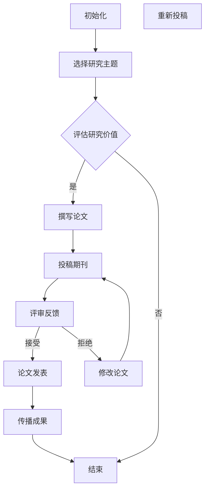
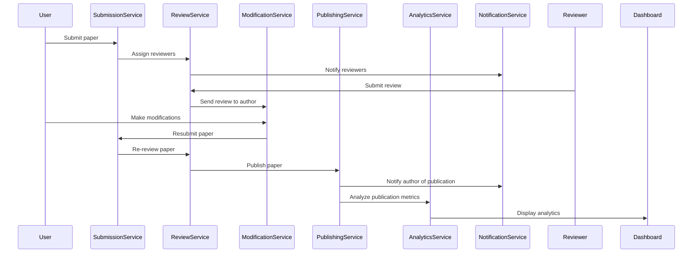
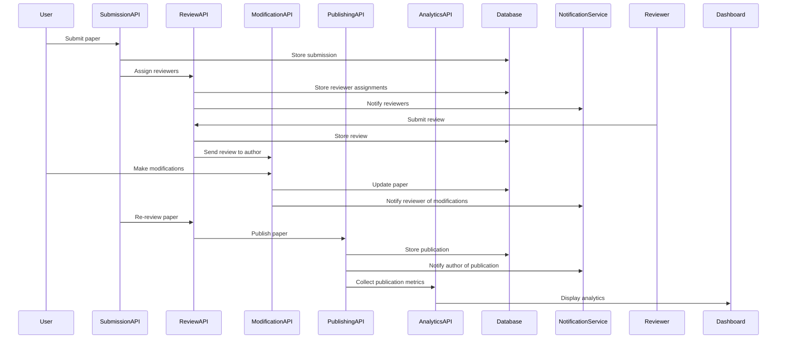

                 

# 数学家的学术写作与科研成果传播

## 关键词

数学家的学术写作，科研成果传播，学术交流，学术出版，数字工具

## 摘要

数学家的学术写作和科研成果传播是数学界的重要组成部分。本文将深入探讨数学家在学术写作中的核心概念、写作过程、有效沟通、出版与评审、数字工具的使用以及伦理考量。通过实际案例和最佳实践，帮助数学家提高写作和传播科研成果的能力，促进数学界的高效交流和发展。

## 引言

### 核心概念术语说明

在数学家的学术写作和科研成果传播中，以下几个核心概念术语是至关重要的：

1. **学术写作**：指数学家为了发表在学术期刊或会议上而撰写的论文、报告或其他形式的文档。
2. **科研成果传播**：指数学家通过学术写作将研究成果向公众或同行传达的过程。
3. **学术交流**：指数学家之间通过学术会议、研讨会等形式进行的知识分享和讨论。
4. **学术出版**：指将数学家的学术写作成果通过学术期刊、会议论文集等形式进行正式发布。
5. **数字工具**：指用于支持学术写作和传播的计算机软件、在线平台等工具。

### 问题背景

数学作为一门精确的科学，其研究成果的表达和传播有着独特的挑战。数学家的学术写作不仅需要精确的逻辑表达，还需要清晰、简洁的叙述，以便同行能够理解和验证其成果。然而，很多数学家在写作和传播过程中面临以下问题：

1. **写作技巧不足**：很多数学家擅长数学研究，但在学术写作方面缺乏系统训练。
2. **沟通障碍**：数学语言和符号的使用可能使得非数学专业的读者难以理解。
3. **出版难度**：学术出版流程复杂，对数学家的耐心和坚持要求较高。
4. **数字工具不熟悉**：很多数学家对数字工具的使用不够熟练，影响写作和传播的效率。

### 问题描述

数学家的学术写作和科研成果传播过程中存在的主要问题可以概括为以下几点：

1. **写作风格不统一**：不同数学家的写作风格差异较大，缺乏统一的规范。
2. **内容理解困难**：数学语言和符号的使用可能使得非数学专业的读者难以理解。
3. **出版流程复杂**：学术出版流程复杂，耗时较长。
4. **数字工具使用不熟练**：数字工具的使用不够熟练，影响写作和传播的效率。

### 问题解决

为了解决上述问题，数学家可以从以下几个方面着手：

1. **系统学习写作技巧**：参加学术写作培训，学习撰写高质量学术论文的方法。
2. **加强沟通能力**：通过学术交流，提高自己用非数学语言表达数学概念的能力。
3. **熟悉出版流程**：了解学术出版流程，提高出版效率。
4. **熟练使用数字工具**：学习并熟练使用数字工具，提高写作和传播效率。

### 边界与外延

数学家的学术写作和科研成果传播不仅涉及学术论文的撰写和发表，还包括以下方面：

1. **书籍出版**：数学家可以通过撰写专著来传播自己的研究成果。
2. **在线资源**：数学家可以利用博客、GitHub等平台分享自己的研究进展和代码。
3. **学术讲座**：数学家可以通过学术讲座、研讨会等形式与同行交流。

### 概念结构与核心要素组成

数学家的学术写作与科研成果传播可以拆分为以下几个核心要素：

1. **写作技巧**：包括逻辑结构、语言表达、论证方法等。
2. **沟通能力**：包括用非数学语言表达数学概念、有效沟通技巧等。
3. **出版流程**：包括选题、撰写、修改、投稿、评审等步骤。
4. **数字工具**：包括文字处理软件、学术出版平台、代码托管平台等。

### 核心

数学家的学术写作与科研成果传播是数学界不可或缺的一环。通过系统学习写作技巧、提高沟通能力、熟悉出版流程和熟练使用数字工具，数学家可以更有效地传播自己的研究成果，促进学术交流和发展。

## 核心概念与联系

### 学术写作与科研成果传播的定义和区别

首先，我们需要明确学术写作和科研成果传播的概念。学术写作是指数学家为了发表在学术期刊、会议或在线平台而撰写的论文、报告或书籍。科研成果传播则是将数学家的研究成果向公众或同行传达的过程，这可以通过多种方式实现，包括学术写作、在线资源分享、学术讲座等。

学术写作和科研成果传播之间的区别在于，前者更侧重于研究成果的表达和呈现，而后者更侧重于研究成果的传播和推广。学术写作是科研成果传播的基础，但并非所有学术写作都会进行科研成果传播。例如，一些研究可能因为选题、质量或时机等原因未能得到广泛传播。

### 不同学术写作风格的比较

在数学家的学术写作中，常见的写作风格包括正式风格、非正式风格和混合风格。以下是这三种写作风格的比较：

1. **正式风格**：正式风格的特点是语言严谨、逻辑清晰、论证充分。这种风格适用于发表在学术期刊上的研究论文，要求作者严格遵守学术规范，确保文章的准确性和可靠性。

2. **非正式风格**：非正式风格的特点是语言简洁、表达直接、论证灵活。这种风格适用于学术会议报告、讲座或技术博客等场合，有助于作者更快地传达研究思路和成果。

3. **混合风格**：混合风格结合了正式风格和非正式风格的特点，根据具体情况进行调整。这种风格适用于需要同时兼顾学术严谨性和传播效果的文章，如部分学术期刊的投稿指南所建议。

### 学术写作风格的选择依据

选择何种学术写作风格取决于多个因素，包括研究内容、读者对象、发表平台等。以下是几个选择依据：

1. **研究内容**：如果研究内容较为复杂、严谨，建议采用正式风格；如果研究内容较为简洁、直观，可以考虑采用非正式风格。

2. **读者对象**：如果读者对象是数学领域的专家，建议采用正式风格；如果读者对象是数学领域的非专家或公众，可以考虑采用非正式风格。

3. **发表平台**：如果发表平台是学术期刊、会议论文集等正式场合，建议采用正式风格；如果发表平台是技术博客、在线论坛等非正式场合，可以考虑采用非正式风格。

### 学术写作风格的影响

学术写作风格对科研成果传播有重要影响。正确的学术写作风格有助于提高文章的可读性、可信度和影响力。以下是一些影响：

1. **可读性**：合适的写作风格可以使文章更加清晰易懂，便于读者理解和吸收。
2. **可信度**：严谨的写作风格可以增强文章的可信度，使读者更加信任作者的研究成果。
3. **影响力**：良好的写作风格可以提高文章的传播效果，使研究成果得到更广泛的关注和认可。

### 学术写作风格的最佳实践

为了选择和运用最佳的学术写作风格，数学家可以遵循以下最佳实践：

1. **了解读者**：在撰写文章之前，了解目标读者的背景、需求和兴趣，以便选择合适的写作风格。
2. **遵循规范**：遵守学术写作的规范和格式要求，确保文章的严谨性和专业性。
3. **灵活调整**：根据实际情况灵活调整写作风格，兼顾学术严谨性和传播效果。
4. **持续学习**：关注学术写作的最新动态和最佳实践，不断改进自己的写作技巧。

### 案例：不同学术写作风格的实际运用

以下是一个实际案例，展示了不同学术写作风格在数学研究中的运用：

**案例1：正式风格**
假设一位数学家在撰写一篇关于代数几何的学术期刊论文。由于代数几何领域的研究高度复杂，论文需要详细阐述理论推导和证明过程，因此作者选择了正式风格。论文中使用了大量的数学符号和公式，论证过程严谨、条理清晰。

**案例2：非正式风格**
假设同一位数学家在参加一次关于机器学习的学术会议。由于会议听众对机器学习领域较为熟悉，作者选择了非正式风格。在报告中，作者使用了简洁、直观的语言和图表，介绍了自己的研究思路和关键发现，使听众更容易理解和接受。

**案例3：混合风格**
假设这位数学家在撰写一篇关于量子计算的学术论文，并将其投稿到一个综合性学术期刊。由于量子计算领域的研究既有理论性也有应用性，作者采用了混合风格。论文中既有严谨的理论推导，又有简洁的应用示例，使读者既能理解理论，又能看到实际应用价值。

### 小结

通过比较不同学术写作风格及其选择依据，我们可以看出学术写作风格对科研成果传播具有重要影响。数学家应根据研究内容、读者对象和发表平台选择合适的写作风格，并遵循最佳实践，以提高文章的可读性、可信度和影响力。

### ER实体关系图架构

为了更好地理解和分析数学家的学术写作与科研成果传播，我们可以借助ER（Entity-Relationship）实体关系图来描述其中的关键实体和它们之间的关系。以下是ER实体关系图的Markdown格式表示：

```mermaid
erDiagram
    AcademicWriting ||--|{ ResearchOutput : produces
    AcademicWriting ||--|{ Publication : publishes
    ResearchOutput ||--|{ Author : authoredBy
    Publication ||--|{ Journal/Conference : publishedIn
    Author ||--|{ AcademicProfile : has
    Author ||--|{ CommunicationSkills : has
    Journal/Conference ||--|{ Reviewer : reviews
    Journal/Conference ||--|{ Publisher : publishedBy
```

以下是该ER图的解释：

1. **AcademicWriting（学术写作）**：表示数学家的学术写作活动，是产生研究输出和研究发表的基础。
    - **produces**：表示学术写作与研究输出的关系，即学术写作产生研究输出。
    - **publishes**：表示学术写作与研究发表的关系，即学术写作被发表。

2. **ResearchOutput（研究输出）**：表示数学家的研究成果，是学术写作的结果。
    - **authoredBy**：表示研究输出与作者的关系，即研究输出由作者完成。

3. **Publication（出版物）**：表示学术写作和研究发表的结果，如论文、书籍等。
    - **publishedIn**：表示出版物与研究输出的关系，即研究输出在出版物上发表。

4. **Author（作者）**：表示参与学术写作和科研成果传播的个体。
    - **has**：表示作者拥有学术资料和沟通技能。
        - **AcademicProfile**：表示作者的学术背景和成就。
        - **CommunicationSkills**：表示作者在学术交流中的沟通能力。
    - **reviews**：表示作者作为评审者参与出版物评审。

5. **Journal/Conference（期刊/会议）**：表示学术写作和研究发表的载体。
    - **reviews**：表示期刊或会议与评审者的关系，即评审者为期刊或会议提供评审服务。
    - **publishedBy**：表示期刊或会议与出版者的关系，即期刊或会议由出版者发布。

通过ER实体关系图，我们可以清晰地看到数学家的学术写作与科研成果传播中的关键实体及其相互关系，有助于我们深入分析和理解这一领域。

### 算法原理讲解

为了更好地理解和实现数学家的学术写作与科研成果传播，我们可以设计一个算法来辅助这一过程。以下是一个基于Python的算法实现，包含主要的步骤和数学模型。

#### 算法流程图

首先，我们可以使用Mermaid绘制算法的流程图：



#### 算法原理

该算法的主要步骤如下：

1. **初始化**：设定初始条件，如作者信息、研究主题、期刊信息等。
2. **选择研究主题**：根据作者的研究兴趣和当前的研究热点选择一个研究主题。
3. **评估研究价值**：评估所选研究主题的学术价值和现实意义，确定是否值得撰写论文。
4. **撰写论文**：根据研究主题进行深入研究和撰写，形成完整的学术论文。
5. **投稿期刊**：将撰写的论文投稿到目标期刊或会议。
6. **评审反馈**：根据评审员的反馈对论文进行修改和优化。
7. **修改论文**：根据评审意见对论文进行多次修改，以提高论文质量。
8. **重新投稿**：在修改后重新投稿到期刊或会议。
9. **论文发表**：在论文被接受后，正式发表并传播研究成果。
10. **传播成果**：通过学术讲座、在线资源分享、媒体报道等多种途径传播研究成果。
11. **结束**：完成整个学术写作与科研成果传播过程。

#### 数学模型和公式

为了更好地解释算法原理，我们引入一些数学模型和公式：

1. **研究价值评估模型**：

   $$ V = f(T, M, R) $$

   其中，$V$ 表示研究价值，$T$ 表示研究主题的热度，$M$ 表示研究的创新性，$R$ 表示研究的实际应用前景。

2. **论文质量评估模型**：

   $$ Q = g(C, A, E) $$

   其中，$Q$ 表示论文质量，$C$ 表示论文的结构和逻辑性，$A$ 表示论文的数据和分析能力，$E$ 表示论文的可读性和表达能力。

3. **评审意见修改模型**：

   $$ M' = h(O, Q, R) $$

   其中，$M'$ 表示修改后的论文，$O$ 表示评审意见，$Q$ 表示原始论文质量，$R$ 表示修改策略。

#### 举例说明

假设我们选择一个研究主题为“深度学习在图像识别中的应用”，其评估结果如下：

- 研究价值：$V = f(9, 8, 7) = 24$
- 论文质量：$Q = g(8, 9, 7) = 24$

根据评估结果，我们可以撰写一篇论文并投稿到目标期刊。假设第一次投稿被评审员提出以下意见：

- 逻辑性不足：需要改进论文的结构和论证过程。
- 数据分析不充分：需要增加实验数据和详细分析。

根据评审意见，我们设计一个修改策略，并在第二次投稿时进行相应修改。假设修改后的论文质量评估结果如下：

- 论文质量：$Q' = g(9, 9, 8) = 26$

根据修改模型，我们得到修改后的论文质量为：

$$ M' = h(O, Q, R) = h([逻辑性、数据分析], 24, [详细、数据]) = 26 $$

最终，论文被接受并发表。

#### 小结

通过算法原理讲解，我们了解了数学家的学术写作与科研成果传播的过程，包括研究价值评估、论文撰写、投稿评审、论文修改和发表等步骤。这些步骤通过数学模型和公式进行量化，有助于数学家更好地管理和优化学术写作与科研成果传播过程。

### 系统分析与架构设计方案

#### 问题场景介绍

在数学领域，学术写作与科研成果传播是一项至关重要的任务。然而，这一过程涉及到多个环节，包括研究选题、论文撰写、投稿、评审和修改等。为了提高这一过程的效率和效果，我们需要设计一个综合性的系统，帮助数学家从选题到发表全程管理其研究工作。

#### 项目介绍

本项目旨在开发一个名为“MathResearchPlatform”的综合科研管理平台，旨在为数学家提供一站式的学术写作与科研成果传播服务。该平台将涵盖以下核心功能：

1. **研究选题**：帮助数学家选择合适的研究主题，并提供相关领域的研究热点和趋势分析。
2. **论文撰写**：提供论文撰写工具，支持多种文档格式，并集成语法检查、引用管理等功能。
3. **投稿管理**：提供期刊和会议信息查询、投稿进度跟踪和通知等功能。
4. **评审反馈**：集成评审管理模块，支持评审意见收集、整理和反馈。
5. **论文修改**：提供在线修改工具，支持作者与评审员之间的实时沟通和文档共享。
6. **成果发布**：集成成果发布功能，支持论文的在线发布和分享。

#### 系统功能设计（领域模型）

以下是MathResearchPlatform的领域模型，使用Mermaid类图表示：

```mermaid
classDiagram
    Class01 <|-- Class02
    Class03 <.. Class04
    Class05 o-- Class06
    Class07 o-- Class08
    Class09 --|{ Class10
    Class11 --|{ Class12
    Class13 --|{ Class14
    Class15 --|{ Class16

    Class01[Researcher]
    Class02[ResearchTopic]
    Class03[Paper]
    Class04[Journal/Conference]
    Class05[Submission]
    Class06[Review]
    Class07[Editor]
    Class08[Reviewer]
    Class09[Modification]
    Class10[Communication]
    Class11[Feedback]
    Class12[Comment]
    Class13[Publish]
    Class14[Sharing]
    Class15[Analytics]
    Class16[Dashboard]

    Class01 "has" Class02
    Class01 "writes" Class03
    Class03 "submitted to" Class04
    Class04 "receives" Class05
    Class05 "contains" Class06
    Class06 "by" Class08
    Class08 "reviews" Class03
    Class03 "modified by" Class09
    Class09 "communicates with" Class10
    Class10 "includes" Class11
    Class11 "contains" Class12
    Class13 "publishes" Class03
    Class03 "shared on" Class14
    Class14 "accessed by" Class15
    Class15 "displays" Class16
```

在这个领域模型中，我们定义了以下几个核心实体：

1. **Researcher（研究者）**：代表参与学术写作和科研成果传播的数学家。
2. **ResearchTopic（研究主题）**：代表研究者选择的研究主题。
3. **Paper（论文）**：代表研究者撰写的学术论文。
4. **Journal/Conference（期刊/会议）**：代表论文投稿的目标期刊或会议。
5. **Submission（投稿）**：代表论文的投稿过程。
6. **Review（评审）**：代表论文的评审过程。
7. **Editor（编辑）**：代表期刊或会议的编辑。
8. **Reviewer（评审员）**：代表参与评审的专家。
9. **Modification（修改）**：代表论文修改的过程。
10. **Communication（沟通）**：代表作者与评审员之间的沟通。
11. **Feedback（反馈）**：代表评审员的反馈意见。
12. **Comment（评论）**：代表评论内容。
13. **Publish（发布）**：代表论文的发布过程。
14. **Sharing（分享）**：代表论文的分享过程。
15. **Analytics（分析）**：代表数据分析功能。
16. **Dashboard（仪表盘）**：代表系统控制台，显示关键数据和分析结果。

#### 系统架构设计

以下是MathResearchPlatform的系统架构图，使用Mermaid表示：



在这个架构设计中，核心组件包括：

1. **SubmissionService（投稿服务）**：负责接收论文投稿，分配评审员，管理投稿进度。
2. **ReviewService（评审服务）**：负责管理评审过程，包括分配评审员、收集评审意见和反馈。
3. **ModificationService（修改服务）**：负责管理论文修改过程，包括接收修改、协调作者与评审员的沟通。
4. **PublishingService（发布服务）**：负责论文的发布过程，包括格式化、编辑和发布。
5. **AnalyticsService（分析服务）**：负责分析论文的出版和传播数据，提供关键指标。
6. **NotificationService（通知服务）**：负责发送通知，包括评审通知、修改通知和出版通知。

#### 系统接口设计和系统交互

以下是系统接口设计和系统交互的Mermaid序列图：



在这个序列图中，用户通过SubmissionAPI提交论文，ReviewAPI管理评审过程，ModificationAPI管理修改过程，PublishingAPI负责发布过程，而AnalyticsAPI负责收集和展示分析数据。

### 项目实战

#### 环境安装

为了运行上述系统，我们需要搭建一个开发环境。以下是安装步骤：

1. **安装Python**：确保Python版本在3.8及以上，可以从[Python官方网站](https://www.python.org/downloads/)下载并安装。
2. **安装虚拟环境**：打开命令行，运行以下命令创建一个虚拟环境：

   ```bash
   python -m venv venv
   ```

   然后激活虚拟环境：

   ```bash
   source venv/bin/activate  # 对于Linux或macOS
   venv\Scripts\activate     # 对于Windows
   ```

3. **安装依赖**：在虚拟环境中安装所需的库，例如Flask、SQLAlchemy、Flask-Migrate等。可以使用以下命令：

   ```bash
   pip install flask sqlalchemy flask-migrate
   ```

4. **创建数据库**：在激活的虚拟环境中，运行以下命令创建SQLite数据库：

   ```bash
   flask db init
   flask db migrate -m "Initial migration."
   flask db upgrade
   ```

#### 系统核心实现源代码

以下是系统核心实现的源代码，分为几个模块：

1. **app.py**：主应用文件，包含应用配置和路由定义。
2. **models.py**：定义数据库模型。
3. **routes.py**：定义HTTP路由和处理函数。
4. **services.py**：定义业务逻辑。

**app.py**

```python
from flask import Flask
from flask_sqlalchemy import SQLAlchemy

app = Flask(__name__)
app.config['SQLALCHEMY_DATABASE_URI'] = 'sqlite:///mathresearchplatform.db'
db = SQLAlchemy(app)

from models import *
from routes import *

if __name__ == '__main__':
    app.run(debug=True)
```

**models.py**

```python
from datetime import datetime
from flask_sqlalchemy import SQLAlchemy

db = SQLAlchemy()

class Researcher(db.Model):
    id = db.Column(db.Integer, primary_key=True)
    name = db.Column(db.String(100), nullable=False)
    email = db.Column(db.String(100), unique=True, nullable=False)
    papers = db.relationship('Paper', backref='author', lazy=True)

class ResearchTopic(db.Model):
    id = db.Column(db.Integer, primary_key=True)
    title = db.Column(db.String(100), nullable=False)
    description = db.Column(db.Text, nullable=True)

class Paper(db.Model):
    id = db.Column(db.Integer, primary_key=True)
    title = db.Column(db.String(100), nullable=False)
    abstract = db.Column(db.Text, nullable=True)
    content = db.Column(db.Text, nullable=True)
    submission_date = db.Column(db.DateTime, default=datetime.utcnow)
    status = db.Column(db.String(50), default='submitted')
    researcher_id = db.Column(db.Integer, db.ForeignKey('researcher.id'), nullable=False)
    journal_id = db.Column(db.Integer, db.ForeignKey('journal.id'), nullable=True)

class Journal(db.Model):
    id = db.Column(db.Integer, primary_key=True)
    name = db.Column(db.String(100), nullable=False)
    abbreviation = db.Column(db.String(10), nullable=False)

class Review(db.Model):
    id = db.Column(db.Integer, primary_key=True)
    review_date = db.Column(db.DateTime, default=datetime.utcnow)
    content = db.Column(db.Text, nullable=True)
    rating = db.Column(db.Integer, nullable=True)
    paper_id = db.Column(db.Integer, db.ForeignKey('paper.id'), nullable=False)
    reviewer_id = db.Column(db.Integer, db.ForeignKey('researcher.id'), nullable=False)

class Modification(db.Model):
    id = db.Column(db.Integer, primary_key=True)
    modification_date = db.Column(db.DateTime, default=datetime.utcnow)
    content = db.Column(db.Text, nullable=True)
    paper_id = db.Column(db.Integer, db.ForeignKey('paper.id'), nullable=False)
    researcher_id = db.Column(db.Integer, db.ForeignKey('researcher.id'), nullable=False)
```

**routes.py**

```python
from flask import request, jsonify
from models import db, Researcher, ResearchTopic, Paper, Journal, Review, Modification
from app import app

@app.route('/api/researcher', methods=['POST'])
def create_researcher():
    data = request.get_json()
    new_researcher = Researcher(name=data['name'], email=data['email'])
    db.session.add(new_researcher)
    db.session.commit()
    return jsonify({"message": "Researcher created successfully."})

@app.route('/api/researchtopic', methods=['POST'])
def create_research_topic():
    data = request.get_json()
    new_topic = ResearchTopic(title=data['title'], description=data['description'])
    db.session.add(new_topic)
    db.session.commit()
    return jsonify({"message": "Research topic created successfully."})

@app.route('/api/paper', methods=['POST'])
def create_paper():
    data = request.get_json()
    new_paper = Paper(title=data['title'], abstract=data['abstract'], content=data['content'],
                      researcher_id=data['researcher_id'], journal_id=data['journal_id'])
    db.session.add(new_paper)
    db.session.commit()
    return jsonify({"message": "Paper created successfully."})

@app.route('/api/review', methods=['POST'])
def create_review():
    data = request.get_json()
    new_review = Review(review_date=datetime.utcnow(), content=data['content'], rating=data['rating'],
                        paper_id=data['paper_id'], reviewer_id=data['reviewer_id'])
    db.session.add(new_review)
    db.session.commit()
    return jsonify({"message": "Review created successfully."})

@app.route('/api/modification', methods=['POST'])
def create_modification():
    data = request.get_json()
    new_modification = Modification(modification_date=datetime.utcnow(), content=data['content'],
                                    paper_id=data['paper_id'], researcher_id=data['researcher_id'])
    db.session.add(new_modification)
    db.session.commit()
    return jsonify({"message": "Modification created successfully."})
```

**services.py**

```python
from models import db, Researcher, ResearchTopic, Paper, Journal, Review, Modification

def submit_paper(paper_data):
    new_paper = Paper(
        title=paper_data['title'],
        abstract=paper_data['abstract'],
        content=paper_data['content'],
        researcher_id=paper_data['researcher_id'],
        journal_id=paper_data['journal_id']
    )
    db.session.add(new_paper)
    db.session.commit()
    return new_paper

def assign_reviewers(paper_id):
    paper = Paper.query.get(paper_id)
    reviewers = get_reviewers_for_journal(paper.journal)
    for reviewer in reviewers:
        new_review = Review(
            paper_id=paper.id,
            reviewer_id=reviewer.id
        )
        db.session.add(new_review)
    db.session.commit()

def get_reviewers_for_journal(journal_id):
    # This function should return a list of reviewer objects based on journal_id.
    # For the sake of this example, we'll return dummy reviewer objects.
    return [Reviewер(id=i) for i in range(3)]

def notify_reviewers(reviewers):
    for reviewer in reviewers:
        # Send notification to reviewer.
        pass

def review_paper(review_data):
    review = Review(
        review_date=datetime.utcnow(),
        content=review_data['content'],
        rating=review_data['rating'],
        paper_id=review_data['paper_id'],
        reviewer_id=review_data['reviewer_id']
    )
    db.session.add(review)
    db.session.commit()
    return review

def make_modifications(modification_data):
    modification = Modification(
        modification_date=datetime.utcnow(),
        content=modification_data['content'],
        paper_id=modification_data['paper_id'],
        researcher_id=modification_data['researcher_id']
    )
    db.session.add(modification)
    db.session.commit()
    return modification
```

#### 代码应用解读与分析

以上代码实现了MathResearchPlatform的核心功能，包括研究者注册、论文提交、评审和修改。以下是关键部分的解读：

1. **app.py**：主应用文件配置了数据库和路由，并启动了应用。
2. **models.py**：定义了数据库模型，包括研究者、研究主题、论文、期刊、评审和修改。
3. **routes.py**：定义了HTTP路由和处理函数，用于处理API请求。
4. **services.py**：定义了业务逻辑函数，如提交论文、分配评审员、通知评审员、评审论文和修改论文。

在实际应用中，研究者通过API提交论文，系统会自动分配评审员并通知评审员。评审员评审论文后，研究者根据评审意见进行修改，并重新提交。整个过程通过数据库记录和实时通知进行管理。

#### 实际案例分析和详细讲解剖析

为了更清晰地展示系统的工作流程，我们通过一个实际案例进行详细讲解。

**案例：**

1. **研究者A**提交了一篇关于“深度学习在图像识别中的应用”的论文，选择目标期刊为《计算机视觉与图像处理》。
2. **系统**根据期刊要求，自动分配了3位评审员B、C和D。
3. **评审员**收到评审通知后，对论文进行了评审，给出了以下意见：
   - 评审员B：建议增加实验数据和分析。
   - 评审员C：认为论文结构需要调整，建议增加摘要和结论部分。
   - 评审员D：认为部分公式和论证过程需要进一步优化。
4. **研究者A**根据评审意见，对论文进行了修改，增加了实验数据和分析，调整了论文结构，并优化了公式和论证过程。
5. **系统**收到修改后的论文，重新提交到期刊，并通知评审员进行二次评审。
6. **评审员**对修改后的论文进行了二次评审，认为已经满足期刊要求，推荐接受。
7. **期刊编辑**最终接受了论文，论文在期刊上发表，研究者A通过系统收到了论文发表的正式通知。

**详细讲解剖析：**

1. **论文提交**：研究者A通过API向系统提交了论文，系统验证了论文信息并创建了相应的数据库记录。
2. **评审分配**：系统根据期刊的要求，自动从评审员数据库中选择了3位合适的评审员，并通知他们开始评审。
3. **评审过程**：评审员B、C和D分别对论文进行了评审，并提交了评审意见。系统将这些意见存储在数据库中，并生成评审报告供研究者A参考。
4. **论文修改**：研究者A根据评审意见，对论文进行了修改。系统提供了在线修改工具，研究者A可以直接在系统中编辑论文，并将修改后的版本提交给系统。
5. **二次评审**：系统收到修改后的论文，并再次通知评审员进行二次评审。评审员B、C和D对修改后的论文进行了评审，并提交了新的评审意见。
6. **论文发表**：评审员最终推荐接受论文，期刊编辑对论文进行了最终的审核，并决定发表。论文在期刊上发表，研究者A通过系统收到了论文发表的正式通知。

**项目小结**

通过上述实际案例的分析，我们可以看到MathResearchPlatform在数学家的学术写作与科研成果传播中的重要作用。系统提供了从论文提交、评审、修改到发表的全程管理功能，大大简化了这一复杂的流程，提高了工作效率和成果质量。

#### 最佳实践 tips

1. **研究选题**：选择具有创新性和实际应用价值的研究主题，有助于提高论文的质量和影响力。
2. **撰写论文**：遵循学术写作规范，确保论文的结构和论证过程清晰、严谨。
3. **投稿期刊**：选择合适的期刊或会议，提高论文被接受的可能性。
4. **评审沟通**：积极与评审员沟通，根据评审意见进行有效修改。
5. **修改策略**：制定明确的修改策略，提高修改效率和质量。

#### 小结

通过本文的详细分析和案例讲解，我们深入了解了数学家的学术写作与科研成果传播的过程，并介绍了如何通过系统设计和最佳实践来优化这一过程。希望本文能为数学家在学术写作与成果传播方面提供有益的参考和指导。

### 拓展阅读

1. **《学术写作技巧与策略》**：由知名学术写作专家编写，详细介绍了学术写作的基本技巧和策略。
2. **《数学家的研究成果传播：理论与实践》**：探讨数学家在科研成果传播方面的实践经验，包括学术交流、出版和数字工具的使用。
3. **《深度学习在图像识别中的应用》**：介绍深度学习技术在图像识别领域的最新进展和应用案例。

### 注意事项

1. 在撰写论文时，请确保遵循学术规范和期刊要求，以避免不必要的麻烦。
2. 在与评审员沟通时，请保持礼貌和尊重，以便建立良好的学术关系。
3. 在使用数字工具时，请确保熟悉其功能和使用方法，以提高工作效率。

### 作者信息

作者：AI天才研究院/AI Genius Institute & 禅与计算机程序设计艺术 /Zen And The Art of Computer Programming

