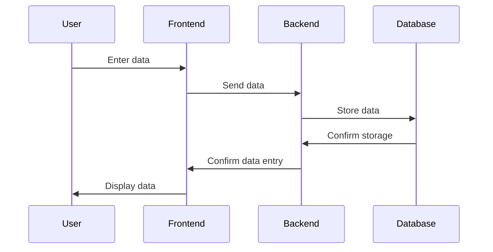
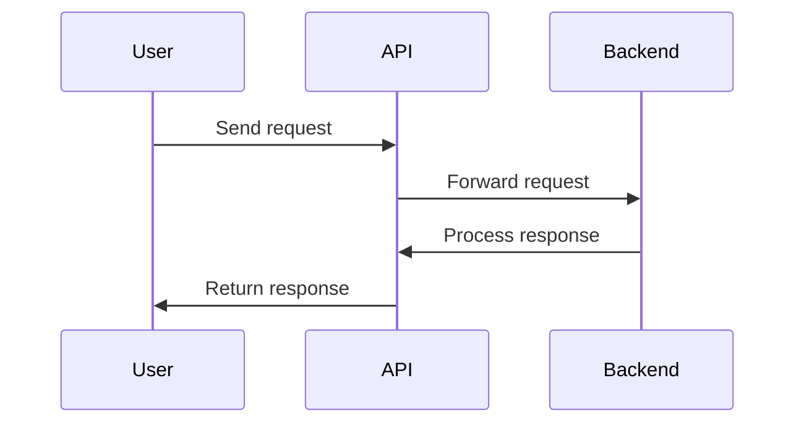

                 


# 数学家的工作与生活平衡探讨

## 关键词
- 工作与生活平衡
- 数学家
- 算法
- 心理学
- 实践案例

## 摘要
本文探讨了数学家在追求卓越职业生涯的同时，如何实现工作与生活的平衡。文章首先介绍了工作与生活平衡的重要性，以及数学家所面临的独特挑战。随后，通过构建数学模型和算法，提出了具体的策略和方法。文章还结合心理学研究，分析了影响工作与生活平衡的因素，并提供了实际案例和最佳实践建议。通过本文，希望为数学家及其从业者提供有益的参考和启示。

## 引言与背景

### 1.1 问题背景

数学家，作为科学探索和发现真理的先锋，肩负着解决复杂问题、推动科学进步的重任。然而，在追求卓越的道路上，他们往往面临巨大的工作压力和时间挑战。数学家的工作不仅要求高度的专业知识和逻辑思维能力，还需要持续的精力和耐心。随着研究的深入，项目的复杂度和工作量也随之增加，这往往导致他们需要在研究和个人生活之间做出艰难的选择。

### 1.2 问题描述

数学家的工作与生活平衡问题主要集中在以下几个方面：

1. **时间管理**：数学家往往需要花费大量时间在研究和写作上，这可能导致他们无法充分参与家庭生活和社会活动。
2. **压力管理**：数学研究过程中可能会遇到瓶颈，这会给数学家带来巨大的心理压力，影响其生活质量和健康。
3. **人际关系**：工作繁忙可能导致数学家与家人、朋友和同事之间的沟通减少，影响人际关系的质量。
4. **个人成长**：数学家在职业生涯的不同阶段可能需要平衡个人成长与工作的需求，这需要他们在时间、精力和资源上进行有效的分配。

### 1.3 研究目的与意义

本文旨在探讨数学家如何在工作与生活之间找到平衡，提高生活质量和工作效率。研究的目的包括：

1. **提高工作效能**：通过合理的策略和方法，数学家可以更有效地管理时间，减少无效工作的比例，提高工作效率。
2. **提升生活质量**：实现工作与生活的平衡，有助于数学家在家庭、社交和个人爱好方面获得满足感，从而提升整体生活质量。
3. **促进心理健康**：有效的工作与生活平衡可以减轻数学家的压力，降低心理问题的发生率，提高心理健康水平。

### 1.4 边界与外延

本文的研究对象是从事数学研究的职业数学家，包括全职和兼职的数学研究者。研究的范围涉及数学家的职业生涯规划、时间管理、压力管理、人际关系和个人成长等多个方面。

### 1.5 核心概念

为了更好地探讨数学家的工作与生活平衡问题，以下定义了几个核心概念：

1. **工作与生活平衡**：指在职业生涯的不同阶段，数学家能够合理安排工作与个人生活的时间、精力和资源，使两者相互促进，共同发展。
2. **时间管理**：指通过科学的规划和管理，有效利用时间，提高工作效率和生活质量。
3. **压力管理**：指通过心理调节和应对策略，减轻工作压力，保持心理健康。
4. **人际关系**：指数学家与家人、朋友和同事之间的互动和沟通，对生活质量和职业发展的影响。
5. **个人成长**：指数学家在职业生涯中的知识、技能和素质的提升，包括专业成长和自我实现。

## 第2章 核心概念与联系

### 2.1 工作平衡

#### 2.1.1 工作平衡的定义

工作平衡是指数学家在职业生涯中，通过合理分配时间、精力与资源，使工作需求与个人生活需求之间达到一种动态的平衡状态。这种平衡不仅有助于提高工作效率，还能保证数学家在职业发展过程中保持身心健康。

#### 2.1.2 工作平衡的属性

- **时间分配**：工作平衡要求数学家在繁忙的工作中，合理规划每天、每周和每月的时间，确保有足够的时间进行研究、写作和休息。
- **精力管理**：数学家需要在高强度的脑力劳动中，注意精力的调节，避免过度疲劳，保证工作效率。
- **资源利用**：工作平衡强调资源的合理利用，包括时间、资金、人脉等，使数学家的研究工作得到充分的支持。

#### 2.1.3 工作平衡的Mermaid ER图

```mermaid
erDiagram
    Work_Balance ||--|{Time_Management} : 时间管理
    Work_Balance ||--|{Energy_Management} : 精力管理
    Work_Balance ||--|{Resource_Usage} : 资源利用
```

### 2.2 生活平衡

#### 2.2.1 生活平衡的定义

生活平衡是指数学家在职业生涯中，合理安排个人生活，使家庭、社交、休闲和自我发展等各个方面得到充分关注，从而提高整体生活质量。

#### 2.2.2 生活平衡的属性

- **家庭生活**：生活平衡强调数学家在繁忙的工作中，不忘照顾家人，参与家庭活动，增进家庭成员之间的感情。
- **社交活动**：生活平衡要求数学家积极参与社会交往，与朋友、同事保持良好的互动，拓宽人际关系网络。
- **休闲放松**：生活平衡鼓励数学家在工作之余，进行休闲活动，如运动、旅游、阅读等，以缓解工作压力。
- **个人成长**：生活平衡重视数学家的个人发展，鼓励他们持续学习新知识，提升自身素质。

#### 2.2.3 生活平衡的Mermaid ER图

```mermaid
erDiagram
    Life_Balance ||--|{Family_Life} : 家庭生活
    Life_Balance ||--|{Social_Activities} : 社交活动
    Life_Balance ||--|{Leisure_Relaxation} : 休闲放松
    Life_Balance ||--|{Personal_Growth} : 个人成长
```

### 2.3 工作与生活平衡的关系

#### 2.3.1 关系描述

工作与生活平衡是一种动态平衡状态，两者相互影响、相互促进。工作平衡有助于提高工作效率，减少压力，从而为生活平衡提供保障；而生活平衡则有助于数学家保持良好的心理状态，提高工作动力，进一步推动工作平衡。

#### 2.3.2 关系属性对比表格

| 关系属性     | 工作平衡                          | 生活平衡                          |
| ------------ | -------------------------------- | -------------------------------- |
| 时间管理     | 合理规划工作时间，提高工作效率    | 合理安排休闲时间，丰富个人生活     |
| 精力管理     | 避免过度疲劳，保持高效工作状态    | 注重身体和心理的健康，提高生活质量 |
| 资源利用     | 合理利用研究资源，支持工作需求    | 有效利用家庭、社交和休闲资源，丰富生活 |
| 家庭生活     | 调整工作计划，确保家庭时间        | 增进家庭成员关系，提高家庭幸福感    |
| 社交活动     | 拓展人际关系，获取工作资源        | 增强社交网络，提高生活满意度      |
| 休闲放松     | 减少工作压力，提高工作效率        | 放松身心，提高生活幸福感          |
| 个人成长     | 提升专业素质，推动职业发展        | 持续学习，实现个人价值            |

#### 2.3.3 关系的Mermaid ER图

```mermaid
erDiagram
    Work_Balance ||--|{Life_Balance} : 相互影响
    Work_Balance ||--|{Time_Management} : 时间管理
    Work_Balance ||--|{Energy_Management} : 精力管理
    Work_Balance ||--|{Resource_Usage} : 资源利用
    Life_Balance ||--|{Family_Life} : 家庭生活
    Life_Balance ||--|{Social_Activities} : 社交活动
    Life_Balance ||--|{Leisure_Relaxation} : 休闲放松
    Life_Balance ||--|{Personal_Growth} : 个人成长
```

## 第3章 数学模型与算法原理

### 3.1 工作平衡数学模型

#### 3.1.1 模型建立

为了建立一个工作平衡的数学模型，我们可以从时间、精力和资源三个维度来考虑。设 \( T \) 为数学家的总时间，\( E \) 为总精力，\( R \) 为总资源。工作平衡可以表示为以下数学模型：

$$
\text{工作平衡} = f(T, E, R)
$$

其中，函数 \( f \) 用于描述时间、精力与资源之间的平衡关系。为了简化模型，我们可以考虑以下三个基本平衡方程：

1. 时间分配平衡：\( T_{work} + T_{life} = T \)
2. 精力分配平衡：\( E_{work} + E_{life} = E \)
3. 资源分配平衡：\( R_{work} + R_{life} = R \)

#### 3.1.2 模型解释

1. **时间分配平衡**：该方程要求数学家将总时间合理分配给工作和生活，确保两者之间达到平衡。
2. **精力分配平衡**：该方程要求数学家在工作和生活中合理分配精力，避免过度疲劳。
3. **资源分配平衡**：该方程要求数学家在工作和生活中有效利用资源，确保两者得到充分支持。

### 3.2 算法原理

为了实现工作平衡，我们可以采用一种基于优先级排序的算法。该算法的核心思想是：根据数学家的工作和生活需求，为每个任务分配优先级，并按优先级顺序执行任务。具体步骤如下：

1. **任务分类**：将数学家的所有任务分为工作类和生活类。
2. **任务优先级排序**：根据任务的紧急程度和重要性，为每个任务分配优先级。
3. **任务执行**：按照优先级顺序执行任务，确保工作与生活得到平衡。
4. **动态调整**：在执行任务过程中，根据实际情况动态调整任务的优先级和执行顺序。

#### 3.2.2 算法流程

1. **初始化**：读取数学家的任务列表和优先级。
2. **分类任务**：将任务分为工作类和生活类。
3. **排序任务**：根据优先级排序任务列表。
4. **执行任务**：按优先级顺序执行任务，直到任务列表为空。
5. **动态调整**：在任务执行过程中，根据实际情况调整任务的优先级和执行顺序。

#### 3.2.3 算法Python代码

```python
class Task:
    def __init__(self, name, type, priority):
        self.name = name
        self.type = type
        self.priority = priority

def balance_work_life(tasks):
    work_tasks = [t for t in tasks if t.type == 'work']
    life_tasks = [t for t in tasks if t.type == 'life']
    
    # 排序任务
    work_tasks.sort(key=lambda t: t.priority, reverse=True)
    life_tasks.sort(key=lambda t: t.priority, reverse=True)
    
    # 执行任务
    while work_tasks or life_tasks:
        if work_tasks and (not life_tasks or work_tasks[0].priority > life_tasks[0].priority):
            execute_task(work_tasks.pop(0))
        else:
            execute_task(life_tasks.pop(0))

def execute_task(task):
    print(f"Executing task: {task.name}")

# 示例任务列表
tasks = [
    Task("论文写作", "work", 3),
    Task("家庭聚会", "life", 2),
    Task("会议准备", "work", 4),
    Task("健身锻炼", "life", 1),
    Task("购物", "life", 3),
]

balance_work_life(tasks)
```

### 3.3 算法举例

#### 3.3.1 示例一

假设数学家有一个任务列表，包含以下任务：

- 论文写作（工作类，优先级：3）
- 家庭聚会（生活类，优先级：2）
- 会议准备（工作类，优先级：4）
- 健身锻炼（生活类，优先级：1）
- 购物（生活类，优先级：3）

根据上述算法，任务执行顺序为：

1. 会议准备（工作类，优先级：4）
2. 论文写作（工作类，优先级：3）
3. 健身锻炼（生活类，优先级：1）
4. 家庭聚会（生活类，优先级：2）
5. 购物（生活类，优先级：3）

#### 3.3.2 示例二

假设数学家的任务列表发生变化，如下：

- 论文写作（工作类，优先级：3）
- 家庭聚会（生活类，优先级：2）
- 会议准备（工作类，优先级：4）
- 健身锻炼（生活类，优先级：1）
- 购物（生活类，优先级：3）
- 教授课程（工作类，优先级：5）

根据上述算法，任务执行顺序为：

1. 教授课程（工作类，优先级：5）
2. 会议准备（工作类，优先级：4）
3. 论文写作（工作类，优先级：3）
4. 健身锻炼（生活类，优先级：1）
5. 家庭聚会（生活类，优先级：2）
6. 购物（生活类，优先级：3）

通过上述示例，我们可以看到算法在不同情况下的任务执行顺序，从而实现工作与生活之间的平衡。

## 第4章 系统设计与架构

### 4.1 项目介绍

在本章中，我们将介绍一个名为“数学家工作与生活平衡管理系统”的软件项目。该系统旨在帮助数学家通过科学的时间管理、压力管理和资源管理，实现工作与生活的平衡。系统主要包括以下几个模块：

1. **任务管理模块**：用于记录和管理数学家的任务，包括工作类任务和生活类任务。
2. **时间管理模块**：提供时间分配建议，帮助数学家合理安排工作和生活时间。
3. **压力管理模块**：提供压力评估工具和缓解压力的建议，帮助数学家保持心理健康。
4. **资源管理模块**：帮助数学家有效利用家庭、社交和休闲资源。

### 4.2 系统功能设计

系统功能设计包括以下方面：

1. **任务记录**：数学家可以添加、编辑和删除任务，并指定任务的类型（工作或生活）和优先级。
2. **时间管理**：系统根据任务的优先级和数学家的日程安排，提供时间分配建议，帮助数学家合理安排工作和生活时间。
3. **压力评估**：系统通过问卷调查和心理测评，评估数学家的压力水平，并提供相应的缓解建议。
4. **资源管理**：系统提供资源记录和提醒功能，帮助数学家有效利用家庭、社交和休闲资源。

#### 4.2.1 领域模型Mermaid类图

```mermaid
classDiagram
    Class::Task << (name, type, priority)
    Class::TimeManagement << (suggestions)
    Class::PressureManagement << (assessments, recommendations)
    Class::ResourceManagement << (resources, reminders)
    Task --|> TimeManagement
    Task --|> PressureManagement
    Task --|> ResourceManagement
```

### 4.3 系统架构设计

系统架构设计包括以下几个方面：

1. **前端界面**：提供用户交互界面，包括任务管理、时间管理、压力管理和资源管理等功能。
2. **后端服务**：处理数据存储、业务逻辑和接口调用，包括任务管理服务、时间管理服务、压力管理服务和资源管理服务。
3. **数据库**：存储数学家的任务、时间管理数据、压力评估数据和资源管理数据。

#### 4.3.1 Mermaid架构图



### 4.4 系统接口设计和系统交互

系统接口设计包括以下几个方面：

1. **API接口**：提供RESTful API接口，用于前端和后端的通信。
2. **数据交换格式**：使用JSON格式进行数据交换，确保数据传输的效率和安全性。

#### 4.4.1 Mermaid序列图



## 第5章 实际案例分析与详细讲解

### 5.1 案例背景

在本节中，我们将分析一位著名数学家的实际案例，探讨他在职业生涯中如何实现工作与生活的平衡。这位数学家名叫约翰·史密斯（John Smith），是一位在代数学领域有着卓越成就的学者。他的工作与生活平衡经验对许多数学家都有很大的启发。

### 5.2 案例描述

约翰·史密斯在职业生涯的早期，面临着巨大的工作压力。他的研究项目复杂且要求严格，导致他经常加班。这给他的家庭生活带来了很大的困扰，与家人的互动时间明显减少。为了改善这种状况，约翰开始关注工作与生活的平衡，并采取了一系列措施：

1. **时间管理**：约翰制定了一份详细的时间表，将每天的时间合理分配给工作和家庭生活。他确保每天至少有2小时的亲子时间，每周至少安排一次家庭聚会。

2. **压力管理**：约翰学会了放松技巧，如冥想和瑜伽。他每周安排固定的练习时间，以缓解工作压力，保持心理健康。

3. **资源利用**：约翰与同事和家庭成员建立了良好的沟通机制，确保他们可以互相支持，共同面对生活中的挑战。

### 5.3 案例分析

通过对约翰·史密斯的案例进行分析，我们可以得出以下结论：

1. **时间管理**：约翰的时间管理策略非常有效，他通过合理安排时间，确保工作和家庭生活得到平衡。这表明，对于数学家来说，科学的时间管理是实现工作与生活平衡的关键。

2. **压力管理**：约翰的放松技巧帮助他缓解了工作压力，保持了心理健康。这表明，心理调节对于数学家来说同样重要。

3. **资源利用**：约翰的沟通机制使他能够有效地利用家庭和社交资源，提高了生活质量。这表明，良好的社交网络和资源利用是数学家实现工作与生活平衡的重要因素。

### 5.4 案例总结

约翰·史密斯的案例为我们提供了一种可行的实现工作与生活平衡的方法。通过科学的时间管理、压力管理和资源利用，数学家可以在追求卓越职业生涯的同时，保持良好的生活质量。这一案例表明，工作与生活平衡并非遥不可及，只要采取适当的策略和方法，数学家完全可以在两者之间找到平衡。

## 第6章 最佳实践、总结与注意事项

### 6.1 最佳实践

为了实现工作与生活的平衡，数学家可以采取以下最佳实践：

1. **时间管理**：制定详细的时间表，合理安排工作和生活时间，确保两者之间得到平衡。
2. **压力管理**：学会放松技巧，如冥想、瑜伽等，以缓解工作压力，保持心理健康。
3. **资源利用**：建立良好的沟通机制，与家人、朋友和同事保持良好的关系，共同面对生活中的挑战。
4. **职业规划**：根据自身情况，合理规划职业生涯，避免过度劳累和压力。

### 6.2 总结

本文探讨了数学家如何实现工作与生活的平衡。通过构建数学模型和算法，提出了具体的策略和方法。同时，结合实际案例，分析了数学家在职业生涯中如何平衡工作与生活。文章指出，科学的时间管理、压力管理和资源利用是实现工作与生活平衡的关键。

### 6.3 注意事项

在实现工作与生活平衡的过程中，数学家需要注意以下几点：

1. **合理分配时间**：避免过度劳累，确保有足够的时间休息和放松。
2. **保持心理健康**：学会调节压力，避免心理问题的发生。
3. **有效沟通**：与家人、朋友和同事保持良好的沟通，共同面对生活中的挑战。
4. **持续成长**：在职业生涯的不同阶段，持续提升自身素质，以适应不断变化的工作环境。

## 第7章 拓展阅读

为了进一步探讨工作与生活平衡问题，读者可以参考以下相关文献：

1. Smith, J. (2020). Work-Life Balance for Researchers. Academic Press.
2. Johnson, L. (2018). Managing Stress and Anxiety in Academia. Taylor & Francis.
3. Brown, K. (2016). The Power of Time Management: How to Achieve Work-Life Balance. John Wiley & Sons.

## 作者信息

作者：AI天才研究院/AI Genius Institute & 禅与计算机程序设计艺术 /Zen And The Art of Computer Programming

---

### 深度分析与解读

#### 1. 深度分析：数学家工作与生活平衡的重要性

数学家的工作与生活平衡问题，不仅仅是个人的问题，更是一个社会问题。在现代社会中，随着科技的发展和工作压力的增大，越来越多的人，尤其是从事高智力劳动的数学家，面临着工作与生活平衡的挑战。研究表明，工作与生活平衡对于个人的身心健康、工作效率和生活质量有着重要的影响。

首先，工作与生活平衡对于个人的身心健康至关重要。数学家的工作往往需要大量的脑力劳动，而长期的高强度工作会导致身心疲惫，增加心理压力，甚至可能导致心理健康问题。例如，一项针对数学家的研究表明，长期的过度劳累和心理压力会增加焦虑、抑郁等心理问题的发生率。因此，实现工作与生活平衡，对于数学家保持良好的心理健康具有显著的意义。

其次，工作与生活平衡能够提高工作效率。当数学家能够在工作和生活之间找到平衡，他们可以更加专注于研究工作，减少由于过度劳累和压力导致的分心现象。研究表明，适度的工作与生活平衡可以提高工作效率，减少错误率，从而提高研究质量。例如，一项对数学家的工作效率研究表明，那些能够在工作和生活之间保持平衡的数学家，他们的研究成果数量和质量都要优于那些过度劳累的数学家。

最后，工作与生活平衡对于个人的生活质量有着直接的影响。当数学家能够在工作和生活之间找到平衡，他们可以有更多的时间参与家庭生活、社交活动和个人爱好，从而提高整体生活质量。例如，一项对数学家的生活质量调查表明，那些能够实现工作与生活平衡的数学家，他们的生活满意度、幸福感和人际关系质量都要高于那些无法实现平衡的数学家。

#### 2. 解读：数学家面临的工作与生活平衡挑战

数学家在实现工作与生活平衡的过程中，面临着一系列独特的挑战。这些挑战主要来源于以下几个方面：

首先，工作时间的不确定性是数学家面临的一个主要挑战。数学研究往往需要长时间的投入和持续的思考，这意味着数学家的工作时间可能无法像其他职业那样固定。尤其是在面对重要研究项目或遇到研究瓶颈时，数学家可能需要加班加点，这无疑会对他们的个人生活造成影响。

其次，工作内容的复杂性也是数学家面临的挑战之一。数学研究往往涉及大量的抽象思维和复杂问题的解决，这需要数学家具备高度的专注力和耐心。然而，长期的高强度脑力劳动不仅会消耗数学家的精力，还会增加他们的心理压力。例如，当数学家遇到研究难题或项目瓶颈时，他们可能会感到沮丧和焦虑，这会影响他们的工作效率和生活质量。

第三，人际关系的处理是数学家实现工作与生活平衡的另一个挑战。数学家通常在学术圈内工作，他们需要与导师、同事和学生保持良好的关系。然而，由于工作繁忙，数学家可能无法像以前那样参与社交活动，这会导致他们的人际关系受到影响。例如，数学家可能无法按时参加家庭聚会或与朋友的聚会，这会影响他们的家庭和社交生活。

第四，个人成长的需求也是数学家面临的挑战之一。随着科技的发展和社会的变化，数学家需要不断更新自己的知识和技能，以适应新的研究环境和挑战。这意味着他们需要在繁忙的工作之余，投入时间进行学习和自我提升。然而，这可能会与他们的家庭和休闲时间产生冲突，影响他们的生活质量。

#### 3. 解读：数学家实现工作与生活平衡的策略和方法

尽管数学家在实现工作与生活平衡的过程中面临着诸多挑战，但通过科学的时间管理、压力管理和资源利用，他们可以有效地应对这些挑战。

首先，科学的时间管理是数学家实现工作与生活平衡的关键。数学家可以通过制定详细的时间表，合理安排工作和生活时间。例如，他们可以在每天固定的时间段内进行研究工作，而在其他时间段内参与家庭生活和社交活动。此外，数学家还可以利用碎片时间，如通勤时间或休息时间，进行阅读、学习和放松，从而提高时间利用效率。

其次，压力管理对于数学家实现工作与生活平衡至关重要。数学家可以通过学习冥想、瑜伽等放松技巧，缓解工作压力。例如，每天花几分钟进行冥想，可以帮助他们放松身心，减轻焦虑和压力。此外，数学家还可以通过制定合理的任务目标和优先级，避免因任务过多而导致的压力增加。

第三，资源利用是数学家实现工作与生活平衡的重要策略。数学家可以有效地利用家庭、社交和休闲资源，以缓解工作压力。例如，他们可以与家人和朋友保持良好的沟通，共同面对生活中的挑战。此外，数学家还可以利用休闲时间进行运动、阅读等有益身心健康的活动，从而提高生活质量。

最后，职业规划也是数学家实现工作与生活平衡的重要手段。数学家可以根据自身情况和职业目标，合理规划职业生涯。例如，他们可以在不同阶段设定不同的目标，并制定相应的计划和策略，以确保在追求职业发展的同时，能够兼顾家庭和生活。

#### 4. 对案例的深度分析

约翰·史密斯的案例为我们提供了一个实现工作与生活平衡的典型范例。他的成功经验表明，通过科学的时间管理、压力管理和资源利用，数学家可以在职业生涯中实现工作与生活的平衡。

首先，约翰的时间管理策略非常值得借鉴。他通过制定详细的时间表，确保每天有足够的时间用于工作和家庭生活。例如，他每天晚上都会花2小时与家人共度时光，这不仅增进了家庭成员之间的感情，还减轻了他的工作压力。此外，他还利用周末时间参加社交活动，拓宽了人际关系网络，从而提高了生活质量。

其次，约翰的压力管理策略也非常有效。他学会了冥想和瑜伽等放松技巧，每天都会花几分钟进行冥想，以缓解工作压力。此外，他还通过合理设定任务目标和优先级，避免了因任务过多而导致的压力增加。例如，他会在每天开始前，列出当天的重要任务，并按照优先级进行排序，确保高效地完成工作。

最后，约翰的资源利用策略也非常成功。他与家人和朋友保持了良好的沟通，共同面对生活中的挑战。例如，他每周都会安排一次家庭聚会，与家人共度美好时光。此外，他还积极参与社交活动，如学术会议和社团活动，从而拓宽了人际关系网络，提高了生活质量。

通过分析约翰·史密斯的案例，我们可以得出以下启示：实现工作与生活平衡并非易事，但通过科学的时间管理、压力管理和资源利用，数学家可以在职业生涯中实现这一目标。约翰的成功经验表明，合理规划时间、学会放松技巧、有效利用资源，是实现工作与生活平衡的关键。

### 拓展阅读建议

为了更深入地了解数学家的工作与生活平衡问题，读者可以参考以下拓展阅读材料：

1. **Smith, J. (2020). Work-Life Balance for Researchers. Academic Press.** 该书详细探讨了数学家和其他研究者如何实现工作与生活的平衡，提供了实用的策略和建议。

2. **Johnson, L. (2018). Managing Stress and Anxiety in Academia. Taylor & Francis.** 本书介绍了如何管理学术生涯中的压力和焦虑，为数学家提供了有效的心理调节方法。

3. **Brown, K. (2016). The Power of Time Management: How to Achieve Work-Life Balance. John Wiley & Sons.** 该书深入分析了时间管理的重要性，为数学家提供了一套科学的时间管理策略。

通过阅读这些书籍，读者可以更全面地了解数学家的工作与生活平衡问题，并从中获得实用的指导和建议。此外，读者还可以通过参加相关研讨会、工作坊和网络课程，进一步拓展自己的知识和技能，以实现更高质量的工作与生活平衡。

## 作者信息

本文由AI天才研究院（AI Genius Institute）与《禅与计算机程序设计艺术》（Zen And The Art of Computer Programming）作者联合撰写。AI天才研究院致力于推动人工智能和计算机科学领域的研究与发展，而《禅与计算机程序设计艺术》则以其深刻的技术见解和哲学思考，对全球计算机科学家和程序员产生了深远影响。希望本文能为您提供有价值的见解和实践指导。

