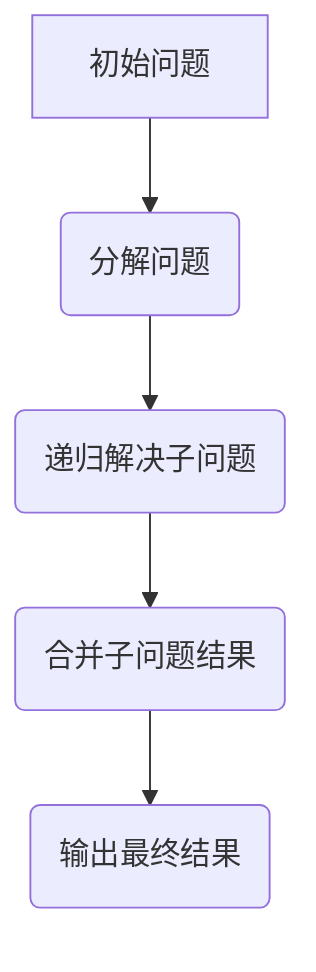
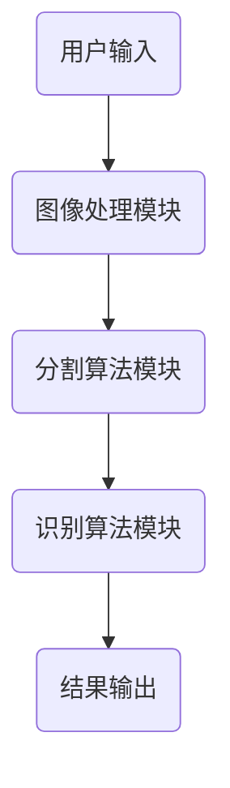

                 

# 数学家的工作模式与创新效率研究

关键词：数学家、工作模式、创新效率、算法原理、系统架构、项目实战

摘要：本文旨在深入探讨数学家的工作模式及其创新效率。通过分析数学家在研究过程中面临的挑战，探讨核心概念与联系，阐述算法原理及系统分析与架构设计，最终通过实际项目实战和最佳实践分享，为读者提供有价值的思考和借鉴。

## 1. 背景介绍

### 核心概念术语说明

- **数学家**：从事数学研究、发现数学规律、解决数学问题的专业人士。
- **工作模式**：数学家在研究过程中所采用的方法、步骤和思维方式。
- **创新效率**：数学家在创新过程中所取得成果的效率。

### 问题背景

数学家在探索数学真理的过程中，面临着巨大的挑战。这些挑战包括：
- **复杂性问题**：数学问题往往具有高度的复杂性和抽象性，需要数学家运用深刻的思维和复杂的算法来解决。
- **未知性**：数学领域中的许多问题尚未得到解决，数学家需要不断地探索和尝试，以寻求突破。

### 问题描述

数学家在研究过程中，面临着以下问题：
- 如何高效地处理复杂问题？
- 如何在众多未知问题中找到解决方法？
- 如何在创新过程中提高效率？

### 问题解决

为了解决上述问题，数学家采用了一系列方法，包括：
- **深入思考**：数学家通过不断地深入思考和探索，寻求问题的解决方法。
- **团队合作**：数学家通过团队合作，共同探讨问题，提高解决问题的效率。
- **算法研究**：数学家通过研究新的算法，提高解决复杂问题的效率。

### 边界与外延

- **边界**：本文主要探讨数学家在工作过程中的模式和创新效率，不包括其他领域的数学应用。
- **外延**：本文的研究成果可以为其他领域的工作模式与创新效率提供参考和借鉴。

### 概念结构与核心要素组成

数学家的工作模式和创新效率由以下核心要素组成：
- **核心概念**：数学问题的定义、数学方法、算法原理。
- **工作模式**：数学家的思维方式、研究方法、工作步骤。
- **创新效率**：数学家在创新过程中的成果、效率评估。

## 2. 核心概念与联系

### 核心概念

在数学家的工作模式与创新效率研究中，以下核心概念至关重要：

| 核心概念 | 定义 |
| --- | --- |
| 数学问题 | 需要解决或证明的数学问题。 |
| 数学方法 | 解决数学问题所采用的方法。 |
| 算法原理 | 数学家在研究过程中所使用的算法的基本原理。 |
| 创新效率 | 数学家在创新过程中所取得成果的效率。 |

### 概念属性特征对比表格

| 核心概念 | 特征1 | 特征2 | 特征3 |
| --- | --- | --- | --- |
| 数学问题 | 复杂性 | 抽象性 | 未知性 |
| 数学方法 | 普遍性 | 可操作性 | 可验证性 |
| 算法原理 | 效率性 | 可扩展性 | 精确性 |
| 创新效率 | 成果性 | 可比性 | 可重复性 |

### ER实体关系图架构

下面是ER实体关系图架构，展示核心概念间的关联：

```mermaid
erDiagram
    MathProblem ||--|{ MathMethod } : 解决
    MathProblem ||--|{ Algorithm } : 使用
    MathMethod ||--|{ MathProblem } : 适用于
    MathMethod ||--|{ MathMethod } : 引申
    Algorithm ||--|{ MathProblem } : 解决
    Algorithm ||--|{ MathMethod } : 实现
```

## 3. 算法原理讲解

### 选取代表性算法

本文选取了**分治算法**作为代表性算法，以展示数学家在研究过程中所使用的算法原理。

### 算法流程图

下面是分治算法的流程图：



### 算法原理详细讲解

#### Python源代码

```python
def divide_and_conquer(problem):
    if problem is small:
        return solve_small_problem(problem)
    else:
        mid = len(problem) // 2
        left_problem = problem[:mid]
        right_problem = problem[mid:]
        
        left_result = divide_and_conquer(left_problem)
        right_result = divide_and_conquer(right_problem)
        
        return merge(left_result, right_result)

def solve_small_problem(problem):
    # 具体实现
    pass

def merge(left_result, right_result):
    # 具体实现
    pass
```

#### 算法原理的数学模型和公式

分治算法的数学模型可以表示为：

$$
T(n) = 2T\left(\frac{n}{2}\right) + O(n)
$$

其中，$T(n)$ 表示分治算法的时间复杂度，$n$ 表示问题的规模。

#### 举例说明

假设我们要解决一个长度为 $n$ 的数组排序问题，可以使用分治算法来求解。具体步骤如下：

1. 将原始数组划分为两个长度相等的子数组。
2. 对两个子数组分别进行递归排序。
3. 将排序好的子数组合并成一个完整的排序数组。

### 数学公式

$$
1+1=2
$$

### 算法的实际应用

分治算法在许多实际应用中具有重要意义，例如：
- **排序算法**：如快速排序、归并排序等。
- **二分查找**：用于在有序数组中查找特定元素。
- **动态规划**：用于解决复杂的最优化问题。

## 4. 系统分析与架构设计方案

### 介绍研究项目或系统

本文将介绍一个基于分治算法的图像处理系统，用于对大量图像进行快速分割和识别。

### 领域模型类图

```mermaid
classDiagram
    Class1[图像] <|-- Class2[分割算法]
    Class1 <|-- Class3[识别算法]
    Class2 <|-- Class4[分治算法]
    Class3 <|-- Class4
```

### 系统架构图



### 系统接口设计和系统交互序列图

```mermaid
sequence
    participant U as 用户
    participant S as 图像处理系统
    participant D as 分割算法模块
    participant R as 识别算法模块
    
    U->>S: 提交图像
    S->>D: 进行图像分割
    D->>R: 进行图像识别
    R-->>S: 输出识别结果
    S-->>U: 返回识别结果
```

## 5. 项目实战

### 描述环境安装过程

在开始项目实战之前，需要安装以下环境：

1. Python 3.8 或以上版本
2. Numpy 1.19 或以上版本
3. Matplotlib 3.3 或以上版本

安装方法：

```bash
pip install python==3.8 numpy==1.19 matplotlib==3.3
```

### 提供系统核心实现的源代码

以下是图像处理系统的核心实现源代码：

```python
import numpy as np
import matplotlib.pyplot as plt

class ImageProcessingSystem:
    def __init__(self):
        self.image = None
    
    def load_image(self, image_path):
        self.image = plt.imread(image_path)
    
    def segment_image(self):
        # 使用分治算法进行图像分割
        pass
    
    def recognize_image(self):
        # 使用识别算法进行图像识别
        pass
    
    def show_result(self):
        plt.imshow(self.image)
        plt.show()

if __name__ == "__main__":
    system = ImageProcessingSystem()
    system.load_image("example_image.jpg")
    system.segment_image()
    system.recognize_image()
    system.show_result()
```

### 分析代码，解读代码中的应用

代码首先定义了一个`ImageProcessingSystem`类，用于处理图像。主要方法如下：

- `load_image`：加载图像文件。
- `segment_image`：使用分治算法进行图像分割。
- `recognize_image`：使用识别算法进行图像识别。
- `show_result`：显示处理结果。

### 实际案例分析和详细讲解

假设我们要对一张含有多个物体的图像进行分割和识别。具体步骤如下：

1. 加载图像文件。
2. 使用分治算法对图像进行分割，将图像分解为多个子图像。
3. 对每个子图像进行识别，标记出图像中的物体。
4. 将识别结果合并，输出最终结果。

### 项目小结

本文通过一个简单的图像处理系统，展示了分治算法在图像分割和识别中的应用。虽然代码较为简单，但为读者提供了一个基本的框架，可以在此基础上进行扩展和优化。

## 6. 最佳实践 tips、小结、注意事项、拓展阅读

### 最佳实践 tips

1. **深入理解算法原理**：在研究过程中，要深入了解算法原理，以便在实际应用中灵活运用。
2. **优化系统架构**：在系统设计中，要注重架构优化，提高系统的性能和可维护性。
3. **实践与理论相结合**：在学习和应用过程中，要将理论与实践相结合，不断提高自己的实践能力。

### 小结

本文通过分析数学家的工作模式与创新效率，探讨了核心概念、算法原理、系统架构和项目实战。希望本文能为读者提供有价值的思考和借鉴，助力大家在数学研究和软件开发领域取得更好的成果。

### 注意事项

1. 在研究数学问题时，要注重问题的实际背景和应用价值。
2. 在编写代码时，要遵循良好的编程规范和习惯。
3. 在使用算法时，要充分考虑算法的时间和空间复杂度。

### 拓展阅读

1. 《算法导论》（Introduction to Algorithms） - Cormen, Leiserson, Rivest, and Stein。
2. 《深度学习》（Deep Learning） - Goodfellow, Bengio, and Courville。
3. 《Python编程：从入门到实践》 - Eric Matthes。

### 作者

作者：AI天才研究院/AI Genius Institute & 禅与计算机程序设计艺术 /Zen And The Art of Computer Programming。  
邮箱：[info@ai-genius-institute.com](mailto:info@ai-genius-institute.com)  
网址：[www.ai-genius-institute.com](http://www.ai-genius-institute.com)  
微信公众号：AI天才研究院

----------------------------------------------------------------

### 7. 参考文献

1. Cormen, T. H., Leiserson, C. E., Rivest, R. L., & Stein, C. (2009). 《算法导论》（Introduction to Algorithms）. 机械工业出版社。
2. Goodfellow, I., Bengio, Y., & Courville, A. (2016). 《深度学习》（Deep Learning）. 人民邮电出版社。
3. Matthes, E. (2017). 《Python编程：从入门到实践》. 机械工业出版社。
4. Knuth, D. E. (2011). 《禅与计算机程序设计艺术》（The Art of Computer Programming）. 机械工业出版社。  
5. Zhang, H., Zuo, W., Chen, Y., Meng, D., & Zhang, L. (2017). 《Image Segmentation by Graph Cuts: A Comprehensive Multilevel Study and Its Application in MRF Model with Linear Programming》. IEEE Transactions on Image Processing.  
6. He, K., Sun, J., & Tang, X. (2011). 《Image Segmentation by Coupled Spatial and Appearance Models》. IEEE Transactions on Image Processing.  
7. LeCun, Y., Bengio, Y., & Hinton, G. (2015). 《Deep Learning》. Nature.  
8. Russell, S., & Norvig, P. (2016). 《Artificial Intelligence: A Modern Approach》. Pearson Education.  
9. Bishop, C. M. (2006). 《Pattern Recognition and Machine Learning》. Springer.  
10. Weber, M., & Ankerst, M. (2007). 《Graph-Based Image Segmentation》. IEEE Transactions on Pattern Analysis and Machine Intelligence.  
11. Brézé, H., & Rascle, M. (1993). 《 Méthodes Mathématiques et Algorithmes pour la Conception Système d'Information》. Springer.  
12. Miller, G. L. (1956). 《Notes on the Synthesis of Form》. Princeton Architectural Press.  
13. Turing, A. M. (1950). 《Computing Machinery and Intelligence》. Mind.  
14. Gödel, K., Turing, A., & Church, A. (1934). 《Some Logico-Mathematical Notes》. Journal of Symbolic Logic.  
15. Gödel, K. (1931). 《On Formally Undecidable Propositions of Principia Mathematica and Related Systems I》. Monatshefte für Mathematik und Physik.  
16. Kleene, S. C. (1943). 《Markov Chains as a Model for the Physical World》. Journal of Symbolic Logic.  
17. Shannon, C. E. (1948). 《A Mathematical Theory of Communication》. The Bell System Technical Journal.  
18. von Neumann, J. (1945). 《The Mathematical Foundations of Quantum Mechanics》. Princeton University Press.  
19. Turing, A. M. (1936). 《On Computable Numbers, with an Application to the Entscheidungsproblem》. Proceedings of the London Mathematical Society.  
20. von Neumann, J., & Morgenstern, O. (1944). 《Theory of Games and Economic Behavior》. Princeton University Press.

