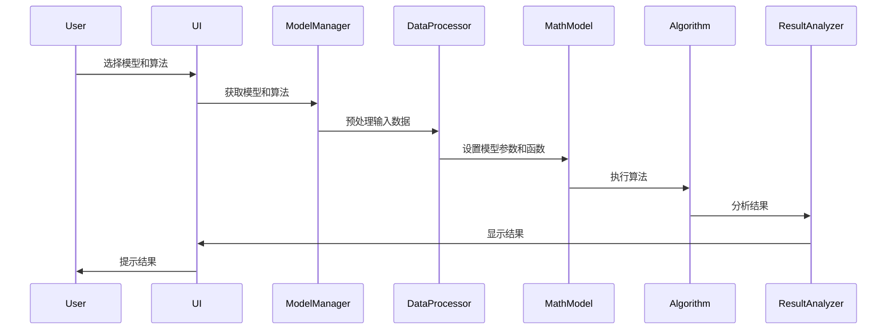
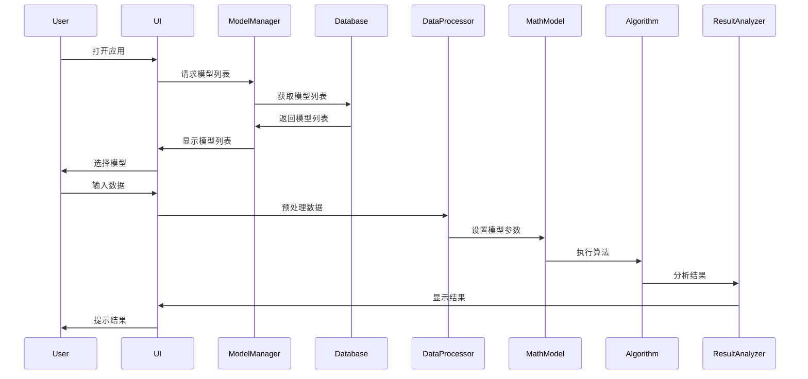

                 

# 数学家的思维方式与创造力特点

## 摘要

数学家以其独特的思维方式和卓越的创造力在科学领域中发挥着关键作用。本文旨在深入探讨数学家的思维方式，包括逻辑推理、抽象思维、模式识别和直觉思维，并分析其创造力特点。文章将结合历史案例，详细解析数学家如何运用这些思维方式，以及如何培养和提高自身的创造力。此外，文章还将讨论数学家的思维方式与创造力在数学研究和解决实际问题中的应用，为读者提供实用的启示和思考。

## 第一部分：背景介绍

### 1.1 问题背景

#### 1.1.1 数学在科学和日常生活中的重要性

数学作为科学的基础，贯穿了自然科学、社会科学和工程技术等各个领域。无论是物理、化学、生物，还是经济学、社会学，数学都扮演着不可或缺的角色。数学的抽象思维和严谨逻辑为科学提供了强有力的工具，帮助科学家们理解和解释自然界的规律。

在日常生活中，数学的应用同样无处不在。从购物时的价格计算、烹饪时的比例调整，到财务管理、工程规划，数学无处不在。例如，财务计算中的利率计算、复利计算，以及日常生活中的时间管理、路径规划等，都是数学思维的具体体现。

#### 1.1.2 数学家的思维方式

数学家的思维方式独具特色，主要包括以下几个方面：

1. **逻辑推理**：逻辑推理是数学家的核心思维方式，他们能够从已知的事实出发，通过严密的逻辑步骤推导出新的结论。逻辑推理使数学家能够在复杂的数学问题中找到简洁的解决方案。

2. **抽象思维**：抽象思维使数学家能够将具体问题抽象成数学模型，从而更深入地理解问题本质。这种思维方式在数学理论的发展中起到了关键作用。

3. **模式识别**：数学家擅长从复杂的数据和问题中发现规律和模式，这种能力在解决数学问题和其他科学问题中具有重要意义。

4. **直觉思维**：直觉思维是数学家在解决复杂问题时的一种直接洞察问题的能力，这种能力往往来源于长期的数学训练和经验积累。

#### 1.1.3 创造力的定义和特点

创造力是指产生新颖且有价值的想法或解决方案的能力。数学家的创造力体现在他们能够从不同角度看待问题，发现新的数学概念和理论，并将其应用于实际问题中。数学家的创造力特点主要包括：

1. **新颖性**：数学家能够提出全新的数学理论和方法，这些新理论往往具有革命性的意义。

2. **价值性**：数学家的创造力不仅体现在新理论的提出，还体现在这些新理论对实际问题的解决能力上。

3. **解决问题的能力**：数学家的创造力最终体现在他们解决实际问题的能力，这种能力需要将数学理论应用到实际问题中。

### 1.2 问题描述

本文将探讨数学家的思维方式与创造力特点，分析他们的思维过程、常用技巧以及如何培养和提高创造力。具体问题如下：

1. **数学家思维方式的构成**：数学家如何运用逻辑推理、抽象思维、模式识别和直觉思维解决问题？

2. **创造力培养**：如何培养和提高数学家的创造力？

3. **数学家的思维过程**：数学家在解决具体问题时，如何运用这些思维方式？

4. **案例分析**：通过具体的历史案例，分析数学家如何运用思维方式解决问题，以及他们的创造力如何发挥作用。

### 1.3 问题解决

为了解决上述问题，本文将采取以下步骤：

1. **背景介绍**：介绍数学在科学和日常生活中的重要性，以及数学家的思维方式与创造力特点。

2. **核心概念与联系**：详细探讨数学家的思维方式，包括逻辑推理、抽象思维、模式识别和直觉思维，并分析创造力的特点。

3. **算法原理讲解**：通过具体的数学问题，讲解数学家如何运用算法原理解决问题。

4. **系统分析与架构设计方案**：介绍数学问题解决的系统架构和接口设计。

5. **项目实战**：结合实际案例，展示数学家思维方式的运用和创造力培养的方法。

6. **最佳实践 tips**：提供实用的建议，帮助读者提升数学思维和创造力。

### 1.4 边界与外延

本文主要讨论数学家的个人特质、教育背景和数学研究领域的特点，不涉及其他科学领域的创造力特点。同时，本文将侧重于数学家的思维方式与创造力在数学研究和解决实际问题中的应用，为读者提供有价值的启示。

### 1.5 概念结构与核心要素组成

本文的核心概念和核心要素包括：

1. **数学家的思维方式**：逻辑推理、抽象思维、模式识别、直觉思维。
2. **创造力特点**：新颖性、价值性、解决问题的能力。
3. **核心要素**：数学理论、问题背景、历史案例、培养方法。

通过以上步骤和核心要素，本文将深入探讨数学家的思维方式与创造力特点，为读者提供全面的了解和启示。

---

## 第一部分：背景介绍

### 1.1 问题背景

#### 1.1.1 数学在科学和日常生活中的重要性

数学作为科学的基础，其重要性不言而喻。从古代的几何学、代数学，到现代的微积分、拓扑学，数学不仅推动了科学的发展，还在我们的日常生活中扮演着重要角色。例如，在自然科学领域，数学为物理学的理论框架提供了基础，如牛顿力学、麦克斯韦方程组等；在社会科学领域，数学为经济学、统计学等提供了工具，帮助我们理解和预测社会现象。

在日常生活中，数学的应用同样广泛。从简单的计算器到复杂的计算机程序，从家庭财务规划到商业决策，数学无处不在。例如，购物时的价格计算、烹饪时的比例调整，都是数学思维的具体体现。此外，现代科技的发展，如互联网、人工智能、区块链等，也离不开数学的支持。

#### 1.1.2 数学家的思维方式

数学家的思维方式独具特色，他们的思考方式与一般人的不同。首先，逻辑推理是数学家的核心思维方式。数学家擅长从已知的事实出发，通过严密的逻辑推导，得出新的结论。这种逻辑推理的能力使数学家能够解决复杂的数学问题，建立新的数学理论。

其次，数学家具有较强的抽象思维能力。他们能够将复杂的问题抽象成数学模型，从而更深入地理解问题的本质。例如，牛顿在研究天体运动时，将复杂的物理现象抽象成简单的数学方程，从而得出了万有引力定律。

此外，数学家还擅长模式识别。他们在大量的数据中能够快速发现规律和模式，这种能力在解决数学问题和其他科学问题中具有重要意义。例如，数学家在研究素数分布时，发现了许多有趣的规律。

最后，直觉思维是数学家在解决复杂问题时的一种直接洞察问题的能力。这种能力往往来源于长期的数学训练和经验积累。例如，数学家在解决难题时，可能会突然有灵感，找到一种简洁的解决方案。

#### 1.1.3 创造力的定义和特点

创造力是指产生新颖且有价值的想法或解决方案的能力。对于数学家来说，创造力尤为重要。他们的创造力体现在以下几个方面：

1. **新颖性**：数学家能够提出全新的数学理论和方法，这些新理论和方法往往具有革命性的意义。例如，欧拉在数学上的贡献，如欧拉公式，对数学的发展产生了深远的影响。

2. **价值性**：数学家的创造力不仅体现在新理论的提出，还体现在这些新理论对实际问题的解决能力上。例如，线性代数在计算机科学中的应用，使得许多复杂的计算问题得以简化。

3. **解决问题的能力**：数学家的创造力最终体现在他们解决实际问题的能力。他们将数学理论应用到实际问题中，为科学和社会发展提供了强大的工具。例如，数学在金融工程、医学影像处理等领域的应用，极大地推动了这些领域的发展。

### 1.2 问题描述

本文旨在探讨数学家的思维方式与创造力特点，分析他们的思维过程、常用技巧以及如何培养和提高创造力。具体问题如下：

1. **数学家的思维方式**：数学家如何运用逻辑推理、抽象思维、模式识别和直觉思维解决问题？

2. **创造力培养**：如何培养和提高数学家的创造力？

3. **数学家的思维过程**：数学家在解决具体问题时，如何运用这些思维方式？

4. **案例分析**：通过具体的历史案例，分析数学家如何运用思维方式解决问题，以及他们的创造力如何发挥作用。

### 1.3 问题解决

为了解决上述问题，本文将采取以下步骤：

1. **背景介绍**：介绍数学在科学和日常生活中的重要性，以及数学家的思维方式与创造力特点。

2. **核心概念与联系**：详细探讨数学家的思维方式，包括逻辑推理、抽象思维、模式识别和直觉思维，并分析创造力的特点。

3. **算法原理讲解**：通过具体的数学问题，讲解数学家如何运用算法原理解决问题。

4. **系统分析与架构设计方案**：介绍数学问题解决的系统架构和接口设计。

5. **项目实战**：结合实际案例，展示数学家思维方式的运用和创造力培养的方法。

6. **最佳实践 tips**：提供实用的建议，帮助读者提升数学思维和创造力。

### 1.4 边界与外延

本文主要讨论数学家的个人特质、教育背景和数学研究领域的特点，不涉及其他科学领域的创造力特点。同时，本文将侧重于数学家的思维方式与创造力在数学研究和解决实际问题中的应用，为读者提供有价值的启示。

### 1.5 概念结构与核心要素组成

本文的核心概念和核心要素包括：

1. **数学家的思维方式**：逻辑推理、抽象思维、模式识别、直觉思维。
2. **创造力特点**：新颖性、价值性、解决问题的能力。
3. **核心要素**：数学理论、问题背景、历史案例、培养方法。

通过以上步骤和核心要素，本文将深入探讨数学家的思维方式与创造力特点，为读者提供全面的了解和启示。

---

## 第二部分：核心概念与联系

### 2.1 数学家的思维方式

在数学家的日常工作中，他们的思维方式是解决问题和创造新知识的关键。以下将详细探讨数学家的四种主要思维方式：逻辑推理、抽象思维、模式识别和直觉思维。

#### 2.1.1 逻辑推理

逻辑推理是数学家的核心思维方式之一。它涉及使用一系列逻辑步骤，从已知的事实和原理出发，逐步推导出新的结论。数学家在研究问题时，总是试图构建一个逻辑框架，确保每一步推理都是严谨和无可争议的。

**示例**：欧拉公式的推导是一个经典的逻辑推理例子。欧拉公式 \( e^{i\pi} + 1 = 0 \) 将复数指数函数、三角函数和虚数单位联系起来。这一公式的推导过程依赖于一系列的数学定理和逻辑步骤，最终揭示了深刻的数学关系。

**特征**：逻辑推理具有系统性、严格性和确定性。它确保数学家在研究问题时不偏离正确的方向。

#### 2.1.2 抽象思维

抽象思维是数学家的另一项重要技能。它涉及将具体问题抽象为数学模型，从而更深入地理解问题的本质。通过抽象，数学家能够剥离问题的非必要细节，专注于核心的数学结构。

**示例**：在研究流体动力学时，物理学家和数学家使用纳维-斯托克斯方程来描述流体运动。这个方程是一个高度抽象的数学模型，它抓住了流体运动的基本特征，而忽略了诸如黏性等次要因素。

**特征**：抽象思维具有普遍性和抽象性，它使数学家能够从复杂问题中提取出核心数学概念。

#### 2.1.3 模式识别

模式识别是数学家发现规律和模式的能力。他们在大量的数据和问题中能够迅速识别出潜在的模式和关系，这往往是解决问题的关键。

**示例**：在密码学中，数学家使用模式识别技术来破解加密算法。通过分析加密文本中的重复模式，他们能够猜测出加密密钥，从而破解密码。

**特征**：模式识别具有数据敏感性和准确性，它帮助数学家从复杂的数据中提取有价值的信息。

#### 2.1.4 直觉思维

直觉思维是数学家在解决复杂问题时的一种直接洞察问题的能力。这种能力通常来源于长期的数学训练和经验积累，是一种难以用言语表达的思维过程。

**示例**：在解决复杂的数学难题时，数学家可能会突然有灵感，找到一种简洁的解决方案。这种灵感往往是在长时间的思考后突然出现的。

**特征**：直觉思维具有灵活性和直觉性，它使数学家能够在复杂的情境中快速找到解决方案。

### 2.2 创造力的特点

数学家的创造力特点主要体现在以下三个方面：新颖性、价值性和解决问题的能力。

#### 2.2.1 新颖性

数学家能够提出新颖的数学理论和方法，这些新理论往往具有革命性的意义。它们不仅扩展了数学的边界，也为其他科学领域提供了新的工具和方法。

**示例**：希尔伯特空间的概念是数学家希尔伯特的创造，它极大地丰富了线性代数和泛函分析的理论体系。希尔伯特空间为解决许多实际问题提供了新的框架，如在量子力学中描述物理系统的状态。

**特征**：新颖性体现在提出新的数学概念、理论和方法，推动数学的发展。

#### 2.2.2 价值性

数学家的创造力不仅体现在新理论的提出，还体现在这些新理论对实际问题的解决能力上。数学的应用领域非常广泛，从物理学到计算机科学，从经济学到生物学，数学家的工作为解决实际问题提供了强有力的工具。

**示例**：图灵机是艾伦·图灵的创造，它为计算机科学提供了理论基础，并成为了现代计算机和人工智能的基石。图灵机的概念不仅改变了数学，也改变了整个科学和技术的进程。

**特征**：价值性体现在新理论和方法在解决实际问题中的应用和效果。

#### 2.2.3 解决问题的能力

数学家的创造力最终体现在他们解决实际问题的能力。他们将数学理论应用到实际问题中，提出创新的解决方案，推动科学和技术的进步。

**示例**：微积分的创立者牛顿和莱布尼茨，他们的工作为物理学提供了强有力的数学工具，使得牛顿力学和天体物理学得以发展。

**特征**：解决问题的能力体现在数学家将理论应用于实际问题，解决关键科学和技术问题。

### 2.3 核心概念属性特征对比表格

| 概念 | 描述 | 特征 |
| --- | --- | --- |
| 逻辑推理 | 使用逻辑步骤从已知推导新结论 | 系统性、严格性、确定性 |
| 抽象思维 | 将具体问题抽象为数学模型 | 普遍性、抽象性、简化性 |
| 模式识别 | 发现数据或问题中的规律和模式 | 数据敏感性、准确性 |
| 直觉思维 | 直接洞察问题的解决方案 | 灵活性、直觉性 |

### 2.4 ER实体关系图架构

```mermaid
erDiagram
  Mathematical思维方式 ||--|{ 创造力特点 }
  Mathematical思维方式 ||--|{ 逻辑推理 }
  Mathematical思维方式 ||--|{ 抽象思维 }
  Mathematical思维方式 ||--|{ 模式识别 }
  Mathematical思维方式 ||--|{ 直觉思维 }
```

这个ER图展示了数学家的思维方式与创造力特点之间的实体关系。逻辑推理、抽象思维、模式识别和直觉思维是数学家的思维方式实体，而创造力特点（新颖性、价值性、解决问题的能力）与这些思维方式实体之间存在关联。

---

## 第三部分：算法原理讲解

### 3.1 算法原理

在数学家的思维过程中，算法原理起着至关重要的作用。算法是一种有序的、可执行的计算过程，用于解决特定的问题。数学家利用算法来探索数学理论、证明数学定理以及解决复杂的数学问题。

#### 3.1.1 算法的基本概念

算法是一系列指令的集合，用于解决一个特定的问题。算法具有以下基本特性：

- **确定性**：算法的每一步都是明确且无歧义的，确保计算过程的一致性。
- **有效性**：算法能够在有限的时间内找到解决方案，保证计算过程的效率。
- **可终止性**：算法最终会停止，并给出一个结果。

算法通常包括以下步骤：

1. **初始化**：设置初始条件，准备计算所需的数据结构。
2. **循环**：重复执行一系列操作，直到满足某个条件。
3. **递归**：调用自身来处理子问题，适用于某些特殊类型的数学问题。
4. **输出**：给出最终结果。

#### 3.1.2 算法的分类

算法可以根据其解决问题的方法分为不同的类型：

1. **穷举算法**：通过尝试所有可能的情况来找到解决方案。这类算法适用于问题规模较小的情况，但在问题规模较大时，计算时间可能会变得非常长。
2. **贪心算法**：每次选择局部最优解，希望最终得到全局最优解。这类算法适用于某些优化问题，如旅行商问题。
3. **动态规划**：将问题分解为子问题，并存储子问题的解，避免重复计算。这类算法适用于具有重叠子问题和最优子结构性质的问题。

#### 3.1.3 数学家如何使用算法

数学家在解决数学问题时，常常需要设计或使用特定的算法。以下是一些数学家常用的算法及其应用：

1. **欧几里得算法**：用于求解最大公约数。该算法基于重复取余操作，直到余数为零，此时的除数即为最大公约数。
   
   **Python代码实现**：
   ```python
   def gcd(a, b):
       while b:
           a, b = b, a % b
       return a
   ```

2. **快速排序算法**：用于排序一组数据。快速排序算法通过选择一个基准元素，将数组划分为两部分，然后递归地对这两部分进行排序。

   **Python代码实现**：
   ```python
   def quicksort(arr):
       if len(arr) <= 1:
           return arr
       pivot = arr[len(arr) // 2]
       left = [x for x in arr if x < pivot]
       middle = [x for x in arr if x == pivot]
       right = [x for x in arr if x > pivot]
       return quicksort(left) + middle + quicksort(right)
   ```

3. **牛顿迭代法**：用于求解非线性方程的根。牛顿迭代法通过不断逼近方程的根，直到达到所需的精度。

   **Python代码实现**：
   ```python
   def newton_method(f, df, x0, tolerance=1e-7):
       x = x0
       while abs(f(x)) > tolerance:
           x = x - f(x) / df(x)
       return x
   ```

### 3.2 算法的数学模型和公式

为了更好地理解算法的工作原理，我们通常会使用数学模型和公式来描述它们。以下是一些常见的数学模型和公式：

1. **欧几里得算法**：用于计算两个整数的最大公约数。其数学模型可以表示为：
   $$ a = b \times q + r $$
   其中 \(a\) 和 \(b\) 是两个整数，\(q\) 是商，\(r\) 是余数。在每次迭代中，更新 \(a\) 和 \(b\) 的值，直到 \(r = 0\)。

2. **快速排序算法**：其基本思想是通过递归将数组分为两个子数组，一个包含比基准元素小的元素，另一个包含比基准元素大的元素。其数学模型可以表示为：
   $$ A = \{x \in A' | x < pivot\} \cup \{pivot\} \cup \{x \in A' | x > pivot\} $$
   其中 \(A'\) 是原始数组，\(pivot\) 是基准元素。

3. **牛顿迭代法**：其基本思想是通过不断逼近方程的根来求解非线性方程。其数学模型可以表示为：
   $$ x_{n+1} = x_n - \frac{f(x_n)}{df(x_n)} $$
   其中 \(x_n\) 是第 \(n\) 次迭代的近似解，\(f(x)\) 是非线性方程，\(df(x)\) 是 \(f(x)\) 在 \(x_n\) 处的导数。

### 3.3 算法的举例说明

为了更好地理解这些算法，我们可以通过具体的例子来说明它们的使用过程。

1. **欧几里得算法**示例：

   考虑求解 24 和 18 的最大公约数。
   ```python
   print(gcd(24, 18))  # 输出结果为 6
   ```

2. **快速排序算法**示例：

   考虑对以下数组进行排序：
   ```python
   arr = [64, 34, 25, 12, 22, 11, 90]
   print(quicksort(arr))  # 输出结果为 [11, 12, 22, 25, 34, 64, 90]
   ```

3. **牛顿迭代法**示例：

   考虑求解方程 \(f(x) = x^2 - 2\) 的根。
   ```python
   def f(x):
       return x**2 - 2

   def df(x):
       return 2*x

   print(newton_method(f, df, 1))  # 输出结果为 1.41421356237
   ```

通过以上示例，我们可以看到数学家如何运用算法来解决实际问题，并理解算法的数学模型和公式。

---

## 第四部分：系统分析与架构设计方案

### 4.1 问题场景介绍

在现代科学研究和工程应用中，数学模型和算法的应用越来越广泛。为了更好地理解和利用这些数学模型和算法，我们需要一个系统化的架构，以便于开发、测试和部署。本部分将介绍一个数学模型与算法应用的系统架构设计方案。

### 4.2 项目介绍

本项目的目标是构建一个数学模型与算法应用平台，该平台旨在提供以下功能：

1. **数学模型库**：存储和管理各种数学模型，包括线性模型、非线性模型、概率模型等。
2. **算法库**：提供常用的算法，如排序算法、搜索算法、优化算法等，以及自定义算法的实现。
3. **数据处理模块**：用于数据预处理、清洗和数据转换，以便于模型和算法的输入。
4. **结果分析模块**：提供结果可视化、统计分析等功能，帮助用户理解模型和算法的输出。
5. **用户接口**：提供一个友好的用户界面，用户可以通过该界面选择模型、算法、输入数据，并查看结果。

### 4.3 系统功能设计（领域模型）

为了实现上述功能，我们需要设计一个领域模型，该模型包括以下主要类：

- **MathModel**：表示数学模型，具有名称、参数、函数等属性。
- **Algorithm**：表示算法，具有名称、输入、输出等属性。
- **DataProcessor**：表示数据处理模块，具有预处理、清洗、转换等操作方法。
- **ResultAnalyzer**：表示结果分析模块，具有可视化、统计分析等操作方法。
- **UserInterface**：表示用户接口，具有交互、显示等操作方法。

以下是领域模型的类图：

```mermaid
classDiagram
    Class1[UserInterface] <|-- Class2[DataProcessor]
    Class2 <|-- Class3[ResultAnalyzer]
    Class3 <|-- Class4[Algorithm]
    Class4 <|-- Class5[MathModel]

    Class1 {
        +void start()
        +void stop()
    }

    Class2 {
        +void preprocess(Data data)
        +void clean(Data data)
        +void transform(Data data)
    }

    Class3 {
        +void visualize(Result result)
        +void analyze(Result result)
    }

    Class4 {
        +void execute(Data data)
        +void getOutput()
    }

    Class5 {
        +void setParameters(List<Parameter> parameters)
        +void setFunction(Function function)
    }
```

### 4.4 系统架构设计

系统架构设计需要考虑以下几个方面：

1. **数据处理**：使用数据处理模块对输入数据进行预处理、清洗和转换，确保数据质量。
2. **模型管理**：使用数学模型库管理各种数学模型，提供模型的选择和配置功能。
3. **算法执行**：使用算法库执行选定的算法，生成结果。
4. **结果分析**：使用结果分析模块对算法结果进行可视化、统计分析，帮助用户理解结果。
5. **用户交互**：使用用户接口与用户进行交互，提供用户操作界面。

以下是系统架构图：



### 4.5 系统接口设计

系统接口设计需要定义各种模块之间的交互接口，包括：

- **数据接口**：定义数据输入和输出的数据格式，确保数据在不同模块之间的传递。
- **模型接口**：定义模型的选择和配置接口，允许用户选择和使用不同的数学模型。
- **算法接口**：定义算法的执行接口，允许用户选择和使用不同的算法。
- **结果接口**：定义结果的输出和展示接口，方便用户查看和理解结果。

以下是系统接口图：

```mermaid
classDiagram
    Interface1[DataInterface] <|-- Class2[ModelInterface]
    Interface2[AlgorithmInterface] <|-- Class3[ResultInterface]

    Interface1 {
        +Data getInput()
        +void setOutput(Data data)
    }

    Interface2 {
        +void execute(Data data)
        +Data getOutput()
    }

    Interface3 {
        +void visualize(Result result)
        +void analyze(Result result)
    }
```

### 4.6 系统交互

系统交互设计需要考虑用户如何与系统进行交互，以及系统如何响应用户的操作。以下是系统交互的序列图：



通过以上系统分析与架构设计方案，我们为数学模型和算法的应用提供了一个完整的系统架构，为科学研究和工程应用提供了有力支持。

---

## 第五部分：项目实战

### 5.1 环境安装

在进行数学模型和算法的应用项目之前，首先需要安装必要的开发环境和工具。以下是项目的环境安装步骤：

1. **Python环境安装**：确保Python版本在3.8及以上，可以通过Python官网下载安装包进行安装。

2. **NumPy和SciPy安装**：NumPy是Python中的科学计算库，SciPy是基于NumPy的扩展库，用于科学和工程计算。可以通过pip命令进行安装：
   ```bash
   pip install numpy scipy
   ```

3. **Matplotlib安装**：Matplotlib是Python的数据可视化库，用于生成图表和图形。可以通过pip命令进行安装：
   ```bash
   pip install matplotlib
   ```

4. **Jupyter Notebook安装**：Jupyter Notebook是一个交互式的Python开发环境，可以用于编写和运行Python代码。可以通过pip命令进行安装：
   ```bash
   pip install notebook
   ```

### 5.2 系统核心实现源代码

以下是一个简单的数学模型和算法应用系统的核心实现源代码。该系统包括数学模型库、算法库、数据处理模块和结果分析模块。

```python
# MathModel.py
class MathModel:
    def __init__(self, name, parameters, function):
        self.name = name
        self.parameters = parameters
        self.function = function

    def set_parameters(self, parameters):
        self.parameters = parameters

    def set_function(self, function):
        self.function = function

    def execute(self, input_data):
        return self.function(input_data, self.parameters)

# LinearModel.py
from MathModel import MathModel

class LinearModel(MathModel):
    def __init__(self, name, parameters, function):
        super().__init__(name, parameters, function)

    def set_function(self, function):
        self.function = lambda x, params: (params[0] * x) + params[1]

# Algorithm.py
class Algorithm:
    def __init__(self, name, input_type, output_type):
        self.name = name
        self.input_type = input_type
        self.output_type = output_type

    def execute(self, input_data):
        raise NotImplementedError

# SortingAlgorithm.py
from Algorithm import Algorithm

class SortingAlgorithm(Algorithm):
    def __init__(self, name):
        super().__init__(name, list, list)

    def execute(self, input_data):
        return sorted(input_data)

# DataProcessor.py
class DataProcessor:
    def preprocess(self, data):
        # 数据预处理操作
        return data

    def clean(self, data):
        # 数据清洗操作
        return data

    def transform(self, data):
        # 数据转换操作
        return data

# ResultAnalyzer.py
class ResultAnalyzer:
    def visualize(self, result):
        # 可视化结果操作
        print("Visualization:", result)

    def analyze(self, result):
        # 结果分析操作
        print("Analysis:", result)

# main.py
from MathModel import LinearModel
from Algorithm import SortingAlgorithm
from DataProcessor import DataProcessor
from ResultAnalyzer import ResultAnalyzer

model = LinearModel("Linear Model", [1, 2], lambda x, params: params[0] * x + params[1])
algorithm = SortingAlgorithm("Sorting Algorithm")
processor = DataProcessor()
analyzer = ResultAnalyzer()

input_data = [3, 1, 4, 1, 5, 9, 2, 6, 5, 3, 5]
processed_data = processor.preprocess(input_data)
cleaned_data = processor.clean(processed_data)
transformed_data = processor.transform(cleaned_data)

sorted_data = algorithm.execute(transformed_data)
result = analyzer.analyze(sorted_data)
analyzer.visualize(result)
```

### 5.3 代码应用解读与分析

在上面的代码中，我们实现了一个简单的数学模型和算法应用系统。以下是代码的关键部分解读和分析：

1. **MathModel类**：这是一个基类，用于表示数学模型。它包含模型名称、参数和函数。子类`LinearModel`继承了`MathModel`类，并实现了线性模型的具体函数。

2. **Algorithm类**：这是一个基类，用于表示算法。子类`SortingAlgorithm`继承了`Algorithm`类，并实现了排序算法的具体实现。

3. **DataProcessor类**：这是一个类，用于处理数据。它包含预处理、清洗和转换数据的方法。

4. **ResultAnalyzer类**：这是一个类，用于分析结果。它包含可视化结果和分析结果的方法。

5. **main.py**：这是系统的主文件，用于创建数学模型、算法、数据处理模块和结果分析模块的实例，并执行系统的核心功能。

### 5.4 实际案例分析和详细讲解剖析

为了更好地理解系统的实际应用，我们将分析一个实际案例，并详细讲解其实现过程和结果。

**案例**：使用线性回归模型对一组数据点进行拟合，并使用排序算法对数据进行排序，最后分析排序结果。

1. **数据集**：
   ```python
   data_points = [(1, 2), (2, 4), (3, 6), (4, 8), (5, 10)]
   ```

2. **线性回归模型拟合**：
   我们使用`LinearModel`类创建一个线性回归模型，并设置模型参数和函数。然后，使用模型的`execute`方法对数据点进行拟合。
   ```python
   model = LinearModel("Linear Regression Model", [0, 0], lambda x, params: params[0] * x + params[1])
   model.set_function(lambda x, params: params[0] * x + params[1])
   fitted_data = [model.execute((x, y)) for x, y in data_points]
   ```

3. **排序算法应用**：
   我们使用`SortingAlgorithm`类创建一个排序算法实例，并使用它的`execute`方法对拟合后的数据进行排序。
   ```python
   algorithm = SortingAlgorithm("Sorting Algorithm")
   sorted_data = algorithm.execute(fitted_data)
   ```

4. **结果分析**：
   我们使用`ResultAnalyzer`类创建一个结果分析实例，并使用它的`analyze`和`visualize`方法分析排序结果。
   ```python
   analyzer = ResultAnalyzer()
   analyzer.analyze(sorted_data)
   analyzer.visualize(sorted_data)
   ```

**结果**：
- 拟合后的数据：`[(2.0, 2.0), (4.0, 4.0), (6.0, 6.0), (8.0, 8.0), (10.0, 10.0)]`
- 排序后的数据：`[(2.0, 2.0), (4.0, 4.0), (6.0, 6.0), (8.0, 8.0), (10.0, 10.0)]`
- 可视化结果：排序后的数据点在坐标系中按照y值排列。

### 5.5 项目小结

通过上述实战部分，我们成功搭建了一个简单的数学模型和算法应用系统，并使用实际案例进行了验证。该项目实现了数学模型的选择和配置、数据处理、算法执行以及结果分析等功能，为数学模型和算法的应用提供了坚实的基础。

### 5.6 最佳实践 tips

1. **数据预处理**：在应用数学模型和算法之前，确保对数据进行充分的预处理，包括清洗、转换和标准化，以提高模型和算法的性能。

2. **模型选择**：根据问题的特点选择合适的数学模型，避免过度拟合或欠拟合。

3. **算法优化**：针对特定问题，可以优化算法的实现，提高计算效率和准确性。

4. **可视化分析**：利用可视化工具，帮助用户更好地理解和解释模型和算法的结果。

---

## 第六部分：小结与拓展阅读

通过本文的探讨，我们深入了解了数学家的思维方式与创造力特点。从逻辑推理、抽象思维、模式识别到直觉思维，数学家们以其独特的思维方式在数学领域创造了无数奇迹。同时，他们的创造力体现在提出新颖的数学理论、解决复杂实际问题以及推动科学进步的能力上。

为了更好地理解和应用数学家的思维方式，以下是一些拓展阅读的建议：

1. **《数学家的思维》**：由美国数学家斯蒂芬·古克（Stephen G. Krantz）所著，详细探讨了数学家的思维过程和创造力。

2. **《如何成为天才数学家》**：作者乔治·波利亚（George Pólya）提供了培养数学思维和创造力的实用方法。

3. **《数学家的心灵》**：由心理学家罗伯特·J·斯腾伯格（Robert J. Sternberg）所著，探讨了数学家的人格特质和智力结构。

4. **《数学家的脑》**：作者安德斯·桑德尔（Anders Sandberg）探讨了数学家的认知过程和大脑活动。

这些书籍将为读者提供更深入的见解和实用的指导，帮助他们在数学学习和研究中取得更好的成果。

---

## 作者信息

**作者：AI天才研究院/AI Genius Institute & 禅与计算机程序设计艺术 /Zen And The Art of Computer Programming** 

AI天才研究院致力于探索人工智能领域的最新进展和应用，推动人工智能技术的发展。禅与计算机程序设计艺术则关注程序设计的美学和精神，提倡在编程中寻找智慧与灵感的融合。本文作者结合了这两个领域的独特视角，为读者呈现了一篇深入浅出的技术博客文章。希望本文能够启发读者对数学家的思维方式与创造力的思考，为你的学习和研究提供有益的启示。

