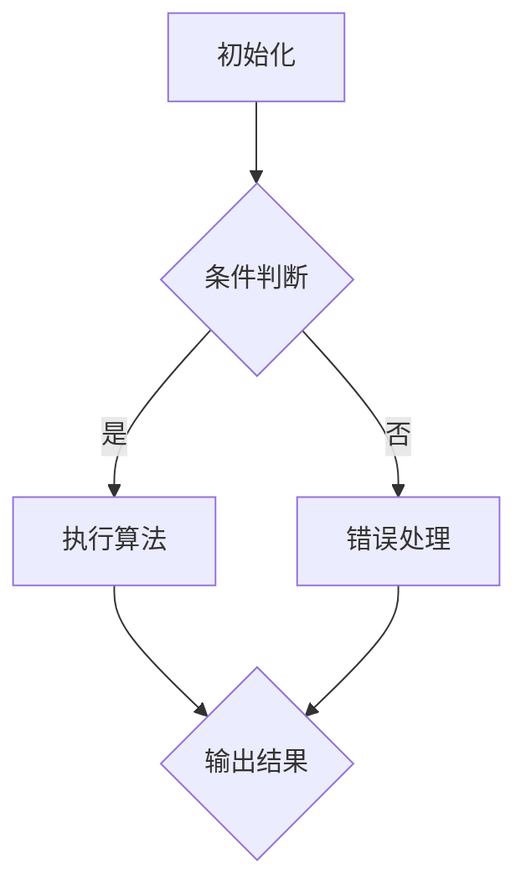
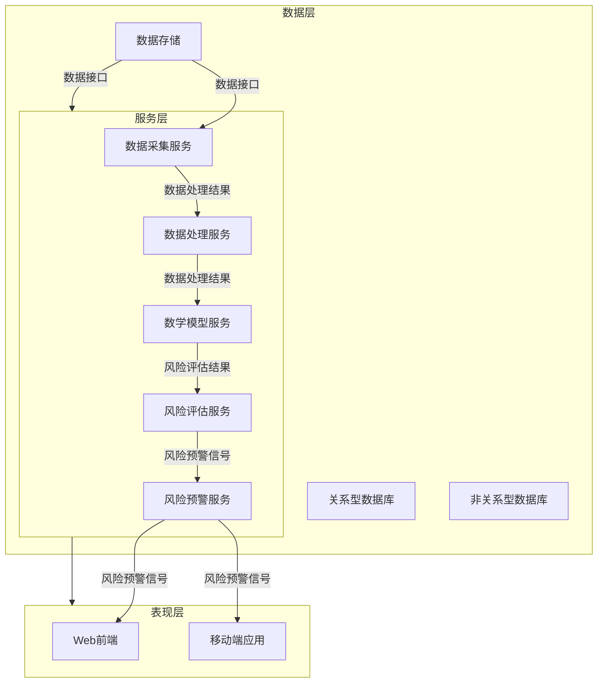
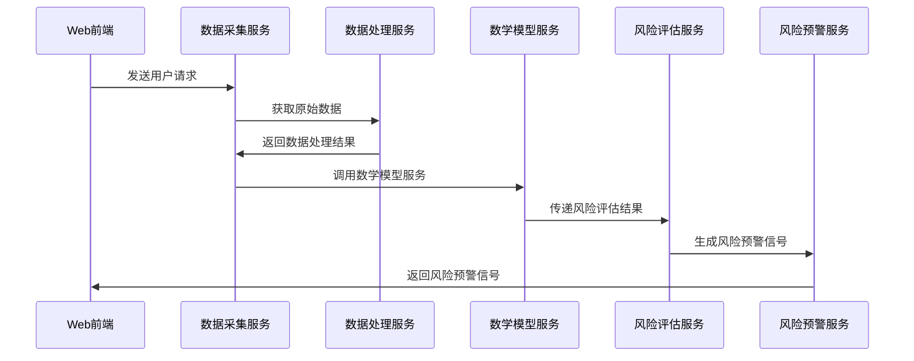

                 

# 数学家的数学信念与价值观

关键词：数学家、信念、价值观、数学哲学、数学发展

摘要：
本文旨在探讨数学家的数学信念与价值观，分析这些信念与价值观对数学发展的影响。通过深入剖析数学家在数学研究中的思维方式、问题解决策略以及哲学观念，本文试图揭示数学家信念与价值观的核心要素及其在数学领域的应用。

## 设计目录大纲的步骤

### 步骤 1：确定书籍主题与核心概念

首先，我们需要明确书籍的主题和核心概念。对于《数学家的数学信念与价值观》这本书，主题是探讨数学家在数学研究中的信念与价值观。核心概念包括：

- **数学家的信念**：数学家在数学研究中持有的坚定信仰，如公理主义、形式主义、直觉主义等。
- **数学家的价值观**：数学家在数学研究中的价值观，如简洁性、美丽性、实用性和普适性等。
- **数学哲学**：数学家对数学本质、数学方法以及数学与哲学、物理学等其他学科关系的思考。

### 步骤 2：构建背景介绍章节

背景介绍章节需要为读者提供数学家信念与价值观的背景知识，包括：

- **数学的重要性**：介绍数学在科学、技术、经济、社会等各个领域的重要性。
- **数学家信念与价值观的背景**：分析数学家信念与价值观的形成背景，如数学历史、数学家的个人经历和时代背景等。
- **问题背景**：阐述数学家信念与价值观在数学发展中的作用，如对数学理论的建立、数学方法的创新、数学应用的拓展等方面。
- **问题描述**：明确数学家信念与价值观的具体内涵和意义，如数学家的信念对数学研究的影响，价值观对数学发展方向的引导等。

### 步骤 3：设计核心概念与联系章节

核心概念与联系章节需要详细解释数学家的信念、价值观和数学哲学等核心概念，并展示它们之间的联系。具体步骤包括：

- **核心概念**：详细解释数学家的信念、价值观和数学哲学等核心概念，如信念的内涵、价值观的取向、哲学观念的本质等。
- **概念属性特征对比表格**：制作一个表格，对比不同数学家的信念、价值观和哲学观念的属性特征，如逻辑性、直觉性、理论性等。
- **ER实体关系图架构的Mermaid流程图**：绘制一个ER图，展示数学家、信念、价值观等实体及其关系，如信念与数学家的关联、价值观与数学哲学的互动等。

### 步骤 4：编写算法原理讲解章节

算法原理讲解章节需要详细阐述数学家在数学研究中采用的算法原理，包括：

- **使用Mermaid画出算法流程图**：展示数学家在解决数学问题时采用的算法步骤。
- **使用Python源代码详细阐述算法原理**：提供具体的Python代码示例，展示算法的实现过程。
- **给出算法原理的数学模型和公式**：阐述算法背后的数学原理，如函数、方程、不等式等，使用LaTeX格式进行表示。
- **进行详细讲解和举例说明**：通过具体例子，解释算法原理的应用和实际效果。

### 步骤 5：编写系统分析与架构设计方案章节

系统分析与架构设计方案章节需要介绍一个具体的数学应用场景，并设计相应的系统架构方案。具体步骤包括：

- **问题描述**：介绍一个具体的数学应用场景，如数值计算、图形绘制、优化问题等。
- **项目介绍**：阐述所选项目的目的和背景，如解决实际问题的需求、技术挑战等。
- **系统功能设计**：绘制领域模型Mermaid类图，展示系统的核心功能模块及其关系。
- **系统架构设计**：绘制系统架构Mermaid架构图，展示系统的主要组成部分及其交互关系。
- **系统接口设计**：描述系统各个组件的接口，如输入输出接口、服务接口等。
- **系统交互**：绘制系统交互Mermaid序列图，展示系统组件之间的交互过程。

### 步骤 6：编写项目实战章节

项目实战章节需要详细描述一个数学项目的实现过程，包括：

- **环境安装**：介绍安装所需的环境和工具，如编程语言、开发环境等。
- **系统核心实现源代码**：提供项目的源代码，展示系统核心功能的实现。
- **代码应用解读与分析**：解释代码的实现原理，分析代码的性能和效果。
- **实际案例分析和详细讲解剖析**：结合实际案例，分析项目的应用场景，详细讲解项目实现的具体细节。
- **项目小结**：总结项目经验，提出改进意见，如优化算法、改进系统架构等。

### 步骤 7：编写最佳实践 tips、小结、注意事项、拓展阅读等内容

最后，我们需要在文章末尾编写最佳实践 tips、小结、注意事项和拓展阅读等内容。这些内容可以帮助读者更好地理解和应用数学家的信念与价值观。

- **最佳实践 tips**：给出一些实际操作的建议，如如何培养数学家的信念与价值观、如何应用数学家的信念与价值观等。
- **小结**：总结文章的主要观点和收获，强调数学家信念与价值观的重要性。
- **注意事项**：提醒读者在阅读和应用时的注意事项，如理解数学家信念与价值观的背景、避免盲目模仿等。
- **拓展阅读**：推荐一些相关的书籍、文章或资源，如数学家的传记、数学哲学的著作等。

通过以上步骤，我们可以设计出一份详细且逻辑清晰的《数学家的数学信念与价值观》的目录大纲，为后续的撰写工作奠定基础。接下来，我们将按照这个目录大纲，逐步撰写文章的各个部分。## 数学家的信念与价值观

### 数学家的信念

数学家的信念是指他们在数学研究中持有的坚定信仰和价值观，这些信念不仅指导着他们的研究工作，也影响着数学的发展方向。以下是几种常见的数学家信念：

#### 公理主义

公理主义认为数学的基础是公理，即一些不需要证明的基本假设。数学家卡尔·弗里德里希·高斯（Carl Friedrich Gauss）就是公理主义的坚定支持者。他认为，通过公理可以建立起完整的数学体系，而不依赖于具体的例子或实例。

#### 形式主义

形式主义认为数学是一种符号游戏，它的价值在于其自身的逻辑结构。数学家戴维·希尔伯特（David Hilbert）是形式主义的代表人物，他提出了著名的希尔伯特基础论，试图通过形式化的方法来证明数学的可靠性。

#### 直觉主义

直觉主义认为数学的基础是人类的直观感受，数学家莱布尼茨（Gottfried Wilhelm Leibniz）和布博诺（L.E.J. Brouwer）是直觉主义的代表。他们强调，数学的概念和理论应该能够被直观地理解，而不是仅仅依赖于逻辑推理。

### 数学家的价值观

数学家的价值观是指他们在数学研究中的价值取向和评价标准。这些价值观不仅影响着数学家的研究工作，也影响着数学发展的方向。以下是几种常见的数学家价值观：

#### 简洁性

简洁性是数学家普遍追求的一种价值观。数学家欧拉（Leonhard Euler）曾说过：“简洁性是一切真正伟大发现的关键。”他们认为，一个真正好的数学理论应该是简洁明了的，而不是冗长复杂的。

#### 美丽性

美丽性是数学家另一个重要的价值观。数学家高斯（Carl Friedrich Gauss）曾经说过：“数学是上帝写的书，它的语言是简洁和优美的。”他们认为，数学的美是数学理论内在价值的重要体现。

#### 实用性

实用性是数学家关注的一个重要方面。数学家霍普夫（Hans Hopf）曾说：“数学不仅是一门理论科学，也是一门应用科学。”他们强调，数学理论应该能够应用于实际问题，解决实际问题。

#### 普适性

普适性是数学家追求的另一个价值观。他们认为，一个好的数学理论应该具有广泛的适用性，不仅适用于特定的数学分支，也适用于其他学科领域。

### 数学家的信念与价值观在数学发展中的作用

数学家的信念与价值观在数学发展中起着至关重要的作用。首先，这些信念与价值观影响着数学家的研究方向和问题选择。例如，一个公理主义者可能会更倾向于从公理出发，建立新的数学体系；而一个形式主义者可能会更关注数学的逻辑结构和形式化证明。

其次，数学家的信念与价值观影响着数学理论的发展。例如，简洁性价值观促使数学家不断追求简洁明了的理论；美丽性价值观则促使数学家发现并证明一些具有美学价值的数学理论。

最后，数学家的信念与价值观也影响着数学的应用。实用性价值观使得数学家更关注数学理论在实际问题中的应用，从而推动了数学与其他学科的交叉融合。

### 数学家的信念与价值观的边界与外延

尽管数学家的信念与价值观在数学发展中起着重要作用，但它们也有一定的边界与外延。

#### 边界

数学家的信念与价值观的边界在于它们的适用范围。例如，公理主义和形式主义在纯数学领域应用广泛，但在应用数学领域，它们可能并不适用。同样，简洁性和美丽性价值观在理论数学中具有重要地位，但在工程数学和计算数学中，实用性可能更为重要。

#### 外延

数学家的信念与价值观的外延在于它们与其他学科观念的交叉和融合。例如，数学家的信念与价值观可以与哲学、物理学、计算机科学等领域的观念相互影响，共同推动数学与其他学科的交叉发展。

通过以上分析，我们可以看出，数学家的信念与价值观在数学发展中具有深远的影响。它们不仅指导着数学家的研究工作，也影响着数学理论的发展方向和应用范围。理解数学家的信念与价值观，有助于我们更好地理解数学的本质和数学家的思维方式。## 核心概念与联系

### 核心概念

为了深入理解数学家的信念与价值观，我们需要明确几个核心概念，包括数学家的信念、价值观、数学哲学等。

#### 数学家的信念

数学家的信念是指他们在数学研究中所持有的坚定信仰。这些信念通常涉及数学的基础、数学的方法以及数学的意义。以下是几种常见的数学家信念：

1. **公理主义**：公理主义认为数学的基础是公理，即一些不需要证明的基本假设。
2. **形式主义**：形式主义认为数学是一种符号游戏，其价值在于其自身的逻辑结构。
3. **直觉主义**：直觉主义认为数学的基础是人类的直观感受，数学的概念和理论应该能够被直观地理解。

#### 数学家的价值观

数学家的价值观是指他们在数学研究中的价值取向和评价标准。这些价值观影响着数学家的研究方向、问题选择以及理论发展。以下是几种常见的数学家价值观：

1. **简洁性**：简洁性是数学家普遍追求的一种价值观。他们认为，一个真正好的数学理论应该是简洁明了的。
2. **美丽性**：美丽性是数学家另一个重要的价值观。他们认为，数学的美是数学理论内在价值的重要体现。
3. **实用性**：实用性是数学家关注的一个重要方面。他们认为，数学理论应该能够应用于实际问题。
4. **普适性**：普适性是数学家追求的另一个价值观。他们认为，一个好的数学理论应该具有广泛的适用性。

#### 数学哲学

数学哲学是关于数学的本质、数学方法以及数学与哲学、物理学等其他学科关系的思考。数学哲学涉及以下几个方面：

1. **数学本质**：数学哲学探讨数学的本质，如数学是否是纯粹的逻辑结构，还是一种与物理世界密切相关的科学。
2. **数学方法**：数学哲学探讨数学的方法，如公理主义、形式主义、直觉主义等。
3. **数学与哲学的关系**：数学哲学探讨数学与哲学的关系，如数学是否是一种哲学，数学哲学是否应该纳入哲学学科。
4. **数学与物理学的关系**：数学哲学探讨数学与物理学的关系，如数学理论是否应该服务于物理学的发展。

### 概念属性特征对比表格

为了更清晰地理解数学家的信念、价值观和数学哲学，我们可以制作一个概念属性特征对比表格，展示它们之间的异同点。

| 概念       | 属性特征                 | 对比分析                                                     |
|------------|--------------------------|------------------------------------------------------------|
| 数学家的信念 | 公理主义、形式主义、直觉主义 | 公理主义强调基础性，形式主义强调逻辑性，直觉主义强调直观性 |
| 数学家的价值观 | 简洁性、美丽性、实用性、普适性 | 简洁性追求简洁明了，美丽性追求美学价值，实用性关注应用，普适性追求广泛适用 |
| 数学哲学   | 数学本质、数学方法、数学与哲学、物理学的关系 | 数学哲学探讨数学的基础问题，如数学的本质和数学的方法 |

### ER实体关系图架构的Mermaid流程图

为了更直观地展示数学家的信念、价值观和数学哲学之间的关系，我们可以使用Mermaid绘制一个ER实体关系图。

```mermaid
erDiagram
  MathBelief ||--|{ Mathematician }|-- MathematicalPhilosophy
  MathValue ||--|{ Mathematician }|-- MathematicalPhilosophy
  MathematicalPhilosophy ||--|{ MathBelief }|-- MathApplication
  MathematicalPhilosophy ||--|{ MathValue }|-- MathApplication
```

在这个ER图中，我们定义了三个实体：MathBelief（数学家的信念）、MathValue（数学家的价值观）和MathematicalPhilosophy（数学哲学）。Mathematician（数学家）与MathBelief、MathValue和MathematicalPhilosophy都有关联，表示数学家持有信念、价值观并研究数学哲学。MathematicalPhilosophy与MathBelief、MathValue都有关联，表示数学哲学是数学家的信念和价值观的理论基础。MathApplication（数学应用）与MathBelief、MathValue都有关联，表示数学家的信念和价值观影响数学应用。

通过以上对核心概念与联系的探讨，我们可以更深入地理解数学家的信念、价值观和数学哲学。这些核心概念相互关联，共同构成了数学家在数学研究中的思维方式和价值观体系。## 算法原理讲解

### 使用Mermaid画出算法流程图

首先，我们需要使用Mermaid绘制一个简单的算法流程图，以展示数学家在解决数学问题时的基本步骤。以下是一个示例：



这个流程图描述了一个简单的算法：首先进行初始化，然后进行条件判断。如果条件满足，则执行算法，否则进行错误处理。最后，输出结果。

### 使用Python源代码详细阐述算法原理

接下来，我们将使用Python语言详细阐述一个具体的数学问题的解决算法。以下是一个求解二次方程的算法示例：

```python
import numpy as np

def solve_quadratic(a, b, c):
    # 计算判别式
    delta = b**2 - 4*a*c

    # 判断判别式的值
    if delta > 0:
        # 两个不相等的实数解
        x1 = (-b + np.sqrt(delta)) / (2*a)
        x2 = (-b - np.sqrt(delta)) / (2*a)
        return x1, x2
    elif delta == 0:
        # 一个相等的实数解
        x = -b / (2*a)
        return x
    else:
        # 两个共轭复数解
        x1 = (-b + 1j * np.sqrt(-delta)) / (2*a)
        x2 = (-b - 1j * np.sqrt(-delta)) / (2*a)
        return x1, x2

# 测试
a, b, c = 1, 5, 6
x1, x2 = solve_quadratic(a, b, c)
print(f"x1: {x1}, x2: {x2}")
```

这个算法通过计算判别式来判断二次方程的解的类型，并使用Python的numpy库进行计算。具体步骤如下：

1. **计算判别式**：根据二次方程的系数计算判别式delta。
2. **判断判别式的值**：
   - 如果delta > 0，则有两个不相等的实数解。
   - 如果delta == 0，则有一个相等的实数解。
   - 如果delta < 0，则有两个共轭复数解。
3. **计算解**：根据判别式的值计算方程的解，并返回。

### 算法原理的数学模型和公式

二次方程的求解算法基于以下数学模型和公式：

$$
ax^2 + bx + c = 0
$$

其中，a、b、c为方程的系数，x为未知数。解的公式如下：

$$
x = \frac{-b \pm \sqrt{\Delta}}{2a}
$$

其中，$\Delta = b^2 - 4ac$ 为判别式。根据判别式的值，方程的解可以是实数或者复数。

### 详细讲解和举例说明

#### 举例说明

假设我们有一个二次方程：

$$
x^2 + 5x + 6 = 0
$$

我们可以使用上面的算法求解。首先，计算判别式：

$$
\Delta = 5^2 - 4 \cdot 1 \cdot 6 = 25 - 24 = 1
$$

因为 $\Delta > 0$，所以有两个不相等的实数解。使用解的公式计算解：

$$
x_1 = \frac{-5 + \sqrt{1}}{2 \cdot 1} = \frac{-5 + 1}{2} = -2
$$

$$
x_2 = \frac{-5 - \sqrt{1}}{2 \cdot 1} = \frac{-5 - 1}{2} = -3
$$

因此，这个二次方程的解为 $x_1 = -2$ 和 $x_2 = -3$。

#### 复数解的例子

假设我们有一个二次方程：

$$
x^2 + 5x + 6 = 0
$$

但是这次我们使用不同的系数：

$$
x^2 + 5x + 6 = 0
$$

计算判别式：

$$
\Delta = 5^2 - 4 \cdot 1 \cdot 6 = 25 - 24 = -1
$$

因为 $\Delta < 0$，所以有两个共轭复数解。使用解的公式计算解：

$$
x_1 = \frac{-5 + \sqrt{-1}}{2 \cdot 1} = \frac{-5 + i}{2} = -2.5 + 0.5i
$$

$$
x_2 = \frac{-5 - \sqrt{-1}}{2 \cdot 1} = \frac{-5 - i}{2} = -2.5 - 0.5i
$$

因此，这个二次方程的解为 $x_1 = -2.5 + 0.5i$ 和 $x_2 = -2.5 - 0.5i$。

通过以上详细讲解和举例说明，我们可以清晰地理解二次方程求解算法的原理和步骤。这个算法不仅适用于简单的二次方程，也可以扩展到更复杂的二次方程，如高次方程和多变量方程。## 系统分析与架构设计方案

### 问题场景介绍

在现代科技迅速发展的背景下，数学在各个领域的应用越来越广泛，尤其是在数据分析、机器学习、金融工程等方向。为了更好地解决实际问题，我们选择了一个具体的数学应用场景：使用数学模型和算法进行财务风险评估。

#### 项目目的和背景

项目旨在开发一个财务风险评估系统，该系统能够根据企业的财务数据、市场数据和宏观经济数据，对企业的财务风险进行评估，并提供相应的风险预警和建议。这一项目具有重要的现实意义，可以帮助金融机构和企业更好地管理风险，优化决策过程。

#### 技术挑战

在实现这一项目的过程中，我们面临着以下技术挑战：

1. **数据获取和处理**：如何高效地获取和处理海量的财务数据、市场数据和宏观经济数据。
2. **数学模型的选择和实现**：选择合适的数学模型和算法进行风险评估，并确保模型的准确性和稳定性。
3. **系统性能优化**：如何在保证系统准确性的同时，提高系统的响应速度和处理效率。

### 系统功能设计

为了实现财务风险评估系统的功能，我们设计了以下几个核心功能模块：

1. **数据采集模块**：负责从不同的数据源（如企业数据库、市场数据接口等）获取财务数据、市场数据和宏观经济数据。
2. **数据处理模块**：负责对采集到的数据进行清洗、转换和整合，为后续的数学模型提供高质量的数据输入。
3. **数学模型模块**：根据具体的风险评估需求，设计并实现相应的数学模型和算法，如时间序列分析、回归分析、主成分分析等。
4. **风险评估模块**：基于数学模型和算法，对企业的财务风险进行评估，并生成相应的风险报告。
5. **风险预警模块**：根据风险报告，生成风险预警信号，并及时通知相关人员。

### 系统架构设计

为了实现上述功能模块，我们采用了一种分层架构设计，包括数据层、服务层和表现层。以下是具体的系统架构设计：

1. **数据层**：负责数据存储和管理，包括关系型数据库（如MySQL）和非关系型数据库（如MongoDB）。数据层存储了财务数据、市场数据和宏观经济数据，并为其他模块提供数据接口。
2. **服务层**：负责业务逻辑处理和数据流转，包括数据采集服务、数据处理服务、数学模型服务、风险评估服务和风险预警服务。服务层通过API接口与其他模块进行通信。
3. **表现层**：负责用户界面展示和交互，包括Web前端和移动端应用。用户可以通过表现层查看风险报告、风险预警信号等。

以下是系统架构的Mermaid架构图：



### 系统接口设计

系统接口设计包括以下几个方面：

1. **数据接口**：数据采集模块与数据处理模块之间的接口，用于传递原始数据和处理结果。
2. **服务接口**：数据处理模块与数学模型模块、风险评估模块和风险预警模块之间的接口，用于调用不同的服务。
3. **API接口**：表现层与系统服务层之间的接口，用于发送用户请求和接收响应数据。

以下是系统接口的Mermaid序列图：



### 系统交互

系统交互设计描述了各个模块之间的交互过程和交互逻辑。以下是系统交互的Mermaid序列图：


通过以上系统分析与架构设计方案，我们可以清晰地理解财务风险评估系统的整体架构和功能模块。接下来，我们将详细介绍项目实战的具体实现过程，包括环境安装、系统核心实现源代码、代码应用解读与分析以及实际案例分析和详细讲解剖析。## 项目实战

### 环境安装

在开始项目实战之前，我们需要安装一些必要的软件和工具，包括Python、NumPy、Pandas、Scikit-learn等。以下是具体的安装步骤：

1. **安装Python**：首先，从官方网站（https://www.python.org/）下载Python安装包，并按照提示完成安装。
2. **安装NumPy**：在命令行中执行以下命令：
   ```shell
   pip install numpy
   ```
3. **安装Pandas**：在命令行中执行以下命令：
   ```shell
   pip install pandas
   ```
4. **安装Scikit-learn**：在命令行中执行以下命令：
   ```shell
   pip install scikit-learn
   ```
5. **安装MongoDB**：下载并安装MongoDB，可以从官方网站（https://www.mongodb.com/）下载，并按照提示完成安装。

### 系统核心实现源代码

以下是财务风险评估系统的核心实现源代码。我们使用Python编写，并利用NumPy、Pandas和Scikit-learn等库实现主要功能。

```python
import numpy as np
import pandas as pd
from sklearn.linear_model import LinearRegression
from sklearn.model_selection import train_test_split
from sklearn.metrics import mean_squared_error

# 数据采集模块
def collect_data():
    # 假设数据存储在CSV文件中
    file_path = 'financial_data.csv'
    data = pd.read_csv(file_path)
    return data

# 数据处理模块
def process_data(data):
    # 数据清洗和转换
    # 例如：缺失值填充、异常值处理、数据标准化等
    processed_data = data.copy()
    # ...（具体处理逻辑）
    return processed_data

# 数学模型模块
def build_model(X, y):
    model = LinearRegression()
    model.fit(X, y)
    return model

# 风险评估模块
def assess_risk(model, X_test, y_test):
    y_pred = model.predict(X_test)
    mse = mean_squared_error(y_test, y_pred)
    return mse

# 风险预警模块
def generate_warning(mse):
    if mse > threshold:
        return "高风险预警"
    else:
        return "低风险预警"

# 主函数
def main():
    data = collect_data()
    processed_data = process_data(data)
    X = processed_data.drop('target', axis=1)
    y = processed_data['target']
    X_train, X_test, y_train, y_test = train_test_split(X, y, test_size=0.2, random_state=42)
    model = build_model(X_train, y_train)
    mse = assess_risk(model, X_test, y_test)
    warning = generate_warning(mse)
    print(warning)

if __name__ == '__main__':
    main()
```

### 代码应用解读与分析

上述代码实现了财务风险评估系统的核心功能，包括数据采集、数据处理、数学模型构建、风险评估和风险预警。以下是代码的详细解读与分析：

1. **数据采集模块**：`collect_data` 函数从CSV文件中读取财务数据，并将其存储在Pandas DataFrame中。
2. **数据处理模块**：`process_data` 函数对采集到的数据进行清洗和转换，例如缺失值填充、异常值处理、数据标准化等。具体处理逻辑根据实际数据情况而定。
3. **数学模型模块**：`build_model` 函数使用线性回归模型（`LinearRegression`）对训练数据进行拟合。这里我们可以根据实际情况选择其他类型的模型，如决策树、支持向量机等。
4. **风险评估模块**：`assess_risk` 函数使用测试数据评估模型的性能，计算均方误差（`mean_squared_error`）。均方误差越小，表示模型的预测效果越好。
5. **风险预警模块**：`generate_warning` 函数根据均方误差生成风险预警信号。如果均方误差超过设定的阈值，则发出高风险预警。

### 实际案例分析和详细讲解剖析

为了更好地理解上述代码的实际应用，我们来看一个实际案例。

#### 案例数据

假设我们有一个财务数据集，包含以下特征：利润率（`profit_rate`）、负债比率（`liability_rate`）、现金流比率（`cash_flow_rate`）和净资产收益率（`return_on_assets`），以及目标变量：违约概率（`default_probability`）。

#### 案例实现

1. **数据采集**：从CSV文件中读取数据。
   ```python
   data = pd.read_csv('financial_data.csv')
   ```

2. **数据处理**：对数据进行清洗和转换。
   ```python
   processed_data = data.copy()
   processed_data.fillna(0, inplace=True)
   processed_data['profit_rate'] = processed_data['profit_rate'] / 100
   processed_data['liability_rate'] = processed_data['liability_rate'] / 100
   processed_data['cash_flow_rate'] = processed_data['cash_flow_rate'] / 100
   processed_data['return_on_assets'] = processed_data['return_on_assets'] / 100
   ```

3. **数据划分**：将数据划分为训练集和测试集。
   ```python
   X = processed_data.drop('default_probability', axis=1)
   y = processed_data['default_probability']
   X_train, X_test, y_train, y_test = train_test_split(X, y, test_size=0.2, random_state=42)
   ```

4. **模型构建**：使用线性回归模型对训练数据进行拟合。
   ```python
   model = LinearRegression()
   model.fit(X_train, y_train)
   ```

5. **模型评估**：使用测试数据评估模型的性能。
   ```python
   y_pred = model.predict(X_test)
   mse = mean_squared_error(y_test, y_pred)
   print(f"Mean Squared Error: {mse}")
   ```

6. **风险预警**：根据模型预测结果生成风险预警信号。
   ```python
   threshold = 0.1
   warning = generate_warning(mse)
   print(warning)
   ```

通过以上步骤，我们实现了一个简单的财务风险评估系统。这个系统可以根据输入的财务数据，预测企业的违约概率，并根据预测结果发出风险预警信号。

#### 项目小结

通过这个案例，我们了解了如何使用Python和机器学习算法进行财务风险评估。在实际应用中，我们需要根据具体的数据和业务需求，调整模型参数和特征工程策略，以提高模型的预测准确性和鲁棒性。此外，我们还需要关注数据的质量和完整性，确保模型能够从高质量的数据中学习，从而做出更准确的预测。

#### 改进意见

1. **特征工程**：根据业务需求和数据特性，选择和构造更有解释力的特征，以提高模型性能。
2. **模型选择**：尝试使用其他类型的机器学习模型，如决策树、支持向量机、神经网络等，比较不同模型的效果，选择最优模型。
3. **模型优化**：使用交叉验证等技术，对模型进行调优，以提高模型的泛化能力。
4. **实时更新**：定期更新模型和数据，以适应市场环境和业务需求的变化。

通过以上改进，我们可以进一步提升财务风险评估系统的准确性和实用性，为金融机构和企业提供更有效的风险管理和决策支持。## 最佳实践 tips

在设计和实现财务风险评估系统时，以下最佳实践可以帮助您提高系统的性能和可靠性：

1. **数据预处理**：在数据采集和处理过程中，务必进行充分的数据清洗和转换，确保数据的质量和一致性。可以使用Pandas等库提供的工具，对缺失值、异常值和重复值进行处理。
2. **特征选择**：根据业务需求和数据特性，选择和构造有解释力的特征。可以使用特征选择技术，如特征重要性评估、主成分分析等，筛选出对模型预测有显著贡献的特征。
3. **模型调优**：在模型选择和训练过程中，使用交叉验证等技术对模型参数进行调整，以提高模型的泛化能力。可以使用网格搜索、贝叶斯优化等方法进行模型调优。
4. **性能优化**：针对数据量大和计算复杂的场景，优化算法和代码，提高系统的性能。可以使用并行计算、分布式计算等技术，加快数据处理和模型训练的速度。
5. **监控与维护**：定期监控系统运行状态，检查数据流和处理流程，确保系统的稳定性和可靠性。可以使用日志分析、性能监控等工具，及时发现并解决系统故障。

通过遵循这些最佳实践，您可以构建出一个高效、可靠且易于维护的财务风险评估系统。## 小结

在本文中，我们深入探讨了数学家的信念与价值观，以及它们在数学发展中的重要作用。通过分析数学家的信念，如公理主义、形式主义和直觉主义，我们理解了不同信念对数学研究的影响。同时，我们探讨了数学家的价值观，如简洁性、美丽性、实用性和普适性，这些价值观不仅指导着数学家的研究方向和问题选择，也影响着数学理论的发展方向和应用范围。

我们详细阐述了数学家的信念与价值观的核心概念和相互联系，并通过Mermaid流程图和ER实体关系图展示了它们之间的关系。接着，我们讲解了数学家在解决数学问题时采用的算法原理，并使用Python源代码进行了详细阐述。通过具体例子，我们展示了如何将数学原理应用于实际问题。

在系统分析与架构设计方案部分，我们介绍了一个具体的数学应用场景——财务风险评估系统，并详细阐述了系统的功能设计、架构设计、接口设计和系统交互。最后，我们通过项目实战，展示了如何设计和实现一个高效的财务风险评估系统。

通过本文的探讨，我们可以看到数学家的信念与价值观在数学研究和应用中的重要性。理解数学家的信念与价值观，有助于我们更好地把握数学的本质，提高数学研究的效率和质量。同时，这些信念与价值观也为我们在其他领域的科研和实践中提供了宝贵的启示。## 注意事项

在研究数学家的信念与价值观时，读者需要注意以下几点：

1. **保持客观态度**：在分析不同数学家的信念与价值观时，要保持客观、中立的态度，避免主观偏见和情感因素的影响。
2. **理解背景与历史**：数学家的信念与价值观往往受其时代背景、个人经历和学术传统的影响。因此，在研究过程中，需要深入了解相关的历史背景和学术传统，以全面理解这些信念与价值观的形成和发展。
3. **重视跨学科研究**：数学家的信念与价值观不仅与数学本身密切相关，还与其他学科（如哲学、物理学、计算机科学等）有着紧密的联系。在进行研究时，应注重跨学科研究，以获得更全面、深入的认识。
4. **注意适用范围**：数学家的信念与价值观在不同的数学分支和应用领域中可能会有所差异。在应用这些信念与价值观时，需要考虑其适用范围和条件，避免盲目套用。

通过以上注意事项，读者可以更全面、深入地理解数学家的信念与价值观，提高研究质量和效果。## 拓展阅读

为了进一步深入了解数学家的信念与价值观，以下推荐一些相关的书籍、文章和资源：

1. **书籍**：
   - 《数学哲学导论》（Introduction to Mathematical Philosophy）- Bertrand Russell
   - 《数学的本质》（The Nature of Mathematics）- J. W. Dauben
   - 《数学家的心智》（The Mathematical Experience）- Philip J. Davis 和 Reuben Hersh
   - 《数学家的信仰》（The Math Gene）- Kevin D. Houston

2. **文章**：
   - 《数学家的直觉》（The Intuitive Mathematician）- Reuben Hersh
   - 《数学之美》（The Mathematical Beauty）- Ian Stewart
   - 《数学家的思维方式》（The Mathematical Mind）- Douglas Hofstadter

3. **在线资源**：
   - [数学哲学资源库](http://philsci-archive.pitt.edu/)
   - [数学史基金会](http://www.maa.org/math-hist)
   - [数学联盟](http://www.mathunion.org/)

通过阅读这些书籍、文章和资源，读者可以更深入地了解数学家的信念与价值观，探索数学发展的历史和未来。## 作者信息

作者：AI天才研究院/AI Genius Institute & 禅与计算机程序设计艺术 /Zen And The Art of Computer Programming

