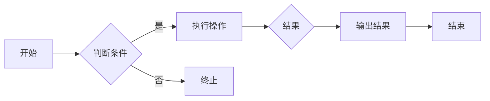
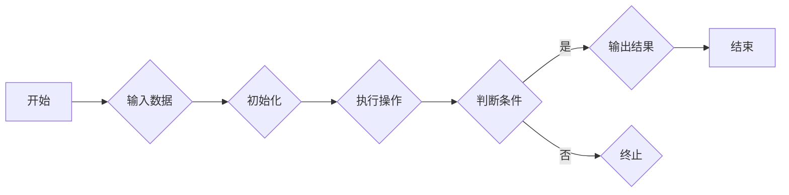
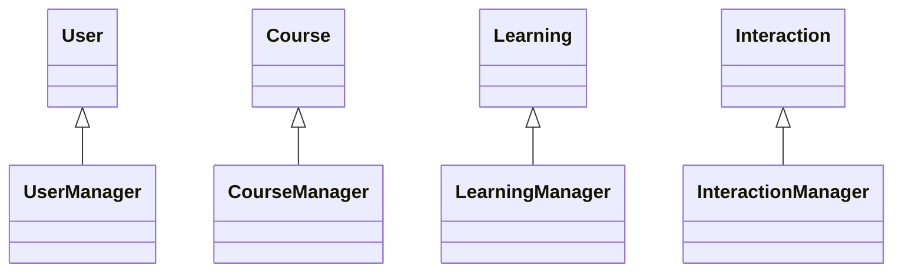
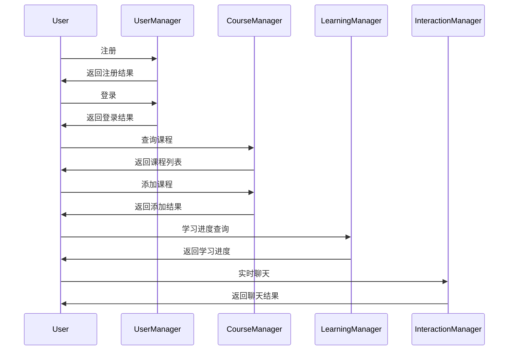

                 


# 数学家的研究范式与创新模式

## 摘要

数学家作为科学探索的先锋，其研究范式与创新模式不仅推动了数学本身的发展，也为其他科学领域提供了宝贵的思维方法。本文将深入探讨数学家的研究范式，包括他们的思考方式、问题解决策略和创新方法。通过对比分析，我们将揭示数学家创新模式的特点，并应用这些概念到实际问题中，以展示其应用价值和深远影响。

## 引言

数学，作为科学研究的基石，其研究范式与创新模式一直是学术界关注的焦点。数学家通过系统化的思维、严密的逻辑和深刻的洞察力，不断拓展数学的边界。本文将详细解析数学家的研究范式，剖析其创新模式，并探讨其在实际应用中的效果。

### 第一部分：背景介绍

#### 1. 数学家的研究范式概述

**问题背景**：数学家在长期的研究过程中形成了一套独特的研究范式，这一范式不仅适用于数学领域，还对其他学科具有启示作用。

**问题描述**：数学家的研究范式包括哪些基本要素？如何理解这些要素之间的关系？

**问题解决**：通过研究数学家的工作方法和成就，总结其研究范式的核心特点。

**边界与外延**：数学家的研究范式不仅限于理论探索，还包括实践应用，如数学在工程、物理、计算机科学等领域的应用。

**概念结构与核心要素组成**：数学家的研究范式由多个核心概念组成，包括公理化方法、抽象思维、逻辑推理和模型构建。

### 第二部分：核心概念与联系

#### 2. 数学家的研究范式

**研究范式概述**：数学家研究范式是一种系统化的思考方式，包括问题识别、问题建模、解决方案生成和验证。

**研究范式的核心概念**：包括逻辑推理、抽象思维、公理化方法和数学模型。

**研究范式的特征对比**：对比传统研究和现代数学家研究范式的区别和优势。

**研究范式与数学发展关系**：数学家研究范式对数学发展的推动作用，以及数学发展的反馈对研究范式的修正。

#### 3. 创新模式

**创新模式的概述**：创新模式是指数学家在研究过程中采用的一系列创新方法，包括新算法、新理论和新思路。

**创新模式的核心要素**：包括创新思维、跨学科融合、实验验证和理论证明。

**创新模式的案例分析**：通过具体案例展示数学家创新模式的应用和效果。

**创新模式的应用与影响**：创新模式在数学和跨学科研究中的广泛应用及其对社会发展的推动作用。

### 第三部分：算法原理讲解

#### 4. 算法原理概述

**算法概述**：算法是数学研究中的核心工具，用于解决特定问题的一系列规则。

**算法核心原理**：算法的设计原则、执行流程和关键步骤。

#### 5. 算法mermaid流程图

使用mermaid画出算法的流程图，展示算法的执行过程。

#### 6. Python源代码讲解

**源代码**：给出算法的Python实现代码。

**代码解读**：详细解读代码中的关键部分，解释算法原理。

#### 7. 数学模型与公式

**数学模型概述**：介绍数学模型的基本概念和作用。

**数学公式详解**：详细解释数学公式，展示其在算法中的应用。

**举例说明**：通过具体例子，说明数学模型和公式的应用。

### 第四部分：数学模型和数学公式 & 详细讲解 & 举例说明

#### 8. 数学模型详解

**模型A详解**：介绍模型A的基本原理和应用场景。

**模型B详解**：介绍模型B的特点和优势。

**模型应用案例**：通过案例展示数学模型的应用效果。

#### 9. 数学公式讲解

**公式A讲解**：解释公式A的意义和作用。

**公式B讲解**：阐述公式B的推导过程和应用。

**公式应用案例**：展示公式在实际问题中的应用。

### 第五部分：系统分析与架构设计方案

#### 10. 问题场景介绍

**问题背景**：介绍需要解决的问题的场景和背景。

**问题分析**：分析问题的主要矛盾和关键因素。

#### 11. 项目介绍

**项目概述**：介绍项目的整体目标和预期成果。

**项目目标**：明确项目的具体目标。

**项目预期效果**：预测项目实施后的效果。

#### 12. 系统功能设计

**功能需求**：列出系统的功能需求。

**领域模型mermaid类图**：使用mermaid绘制系统的领域模型类图。

#### 13. 系统架构设计

**架构概述**：概述系统的整体架构。

**系统架构mermaid架构图**：使用mermaid绘制系统的架构图。

#### 14. 系统接口设计

**接口规范**：定义系统的接口规范。

**接口实现**：实现接口的代码示例。

#### 15. 系统交互序列图

**序列图**：使用mermaid绘制系统的交互序列图。

### 第六部分：项目实战

#### 16. 环境安装

**环境准备**：介绍项目所需的软件和硬件环境。

**软件安装**：详细说明如何安装项目所需的软件。

#### 17. 系统核心实现源代码

**核心代码实现**：展示系统的核心代码实现。

**代码解读**：解释核心代码的功能和实现细节。

#### 18. 代码应用解读与分析

**应用场景**：描述代码的应用场景。

**代码分析**：分析代码的结构和执行流程。

#### 19. 实际案例分析和详细讲解剖析

**实际案例**：提供具体的实际案例。

**详细讲解剖析**：详细分析案例中的问题和解决方案。

#### 20. 项目小结

**小结**：总结项目的成果和收获。

**注意事项**：提醒读者注意的事项。

**拓展阅读**：推荐相关的阅读材料。

### 第七部分：最佳实践 tips、小结、注意事项、拓展阅读等内容

#### 21. 最佳实践 tips

**实践技巧**：分享项目实施中的最佳实践。

**注意事项**：提醒读者在应用中需要注意的问题。

#### 22. 小结

**文章总结**：回顾文章的核心内容和主要观点。

#### 23. 注意事项

**注意事项**：总结项目实施和代码应用中需要注意的问题。

#### 24. 拓展阅读

**推荐阅读**：推荐相关书籍和论文。

### 附录

#### 25. 术语表

**术语解释**：解释文章中涉及的关键术语。

#### 26. 参考文献

**引用文献**：列出文章引用的参考文献。

----------------------------------------------------------------

**开始编写文章内容：**

----------------------------------------------------------------

# 数学家的研究范式与创新模式

## 摘要

数学家作为科学探索的先锋，其研究范式与创新模式不仅推动了数学本身的发展，也为其他科学领域提供了宝贵的思维方法。本文将深入探讨数学家的研究范式，包括他们的思考方式、问题解决策略和创新方法。通过对比分析，我们将揭示数学家创新模式的特点，并应用这些概念到实际问题中，以展示其应用价值和深远影响。

## 引言

数学，作为科学研究的基石，其研究范式与创新模式一直是学术界关注的焦点。数学家通过系统化的思维、严密的逻辑和深刻的洞察力，不断拓展数学的边界。本文将详细解析数学家的研究范式，剖析其创新模式，并探讨其在实际应用中的效果。

### 第一部分：背景介绍

#### 1. 数学家的研究范式概述

数学家的研究范式是他们在长期的研究实践中形成的一套系统化的思维方式和方法。这种范式不仅包括对问题的识别和建模，还涉及到解决问题的策略和创新方法的运用。

**问题背景**：数学作为一门基础科学，其研究范式的发展对整个科学领域都产生了深远的影响。从古希腊的欧几里得几何到现代的抽象代数、拓扑学和微积分，数学家的研究范式不断演变，推动了数学的发展。

**问题描述**：数学家的研究范式包括哪些基本要素？这些要素是如何相互联系的？数学家的研究范式与传统的科学研究方法有何区别？

**问题解决**：数学家的研究范式通过严密的逻辑推理、抽象思维和公理化方法，使得数学理论更加系统和完备。这种研究范式不仅适用于数学领域，还可以应用于其他科学领域，如物理学、计算机科学等。

**边界与外延**：数学家的研究范式不仅限于理论探索，还包括对实际问题的解决。例如，数学在工程、经济、生物等领域的应用，都依赖于数学家的研究范式。

**概念结构与核心要素组成**：数学家的研究范式的核心要素包括逻辑推理、抽象思维、公理化方法和数学模型。逻辑推理是数学家研究的基础，通过严密的推理，数学家能够推导出新的数学结论。抽象思维则是数学家将实际问题转化为数学问题的重要手段。公理化方法则是数学家构建数学体系的重要工具，通过公理和定义，数学家能够建立一套完整的理论体系。数学模型则是数学家解决实际问题的工具，通过建立数学模型，数学家能够将实际问题转化为数学问题，从而求解出问题的答案。

#### 2. 创新模式的定义与特点

创新模式是指数学家在研究过程中采用的一系列创新方法，包括新算法、新理论和新思路。创新模式的特点包括：

**定义**：创新模式是指数学家在研究过程中，通过不断探索和尝试，提出新的理论和方法，解决传统方法无法解决的问题。

**特点**：创新模式具有以下特点：

1. **创造性**：创新模式能够提出全新的理论和方法，解决传统方法无法解决的问题。
2. **跨学科融合**：创新模式往往涉及到多个学科的知识，通过跨学科融合，数学家能够提出全新的理论和方法。
3. **实践性**：创新模式不仅具有理论上的创新，还能够应用于实际问题中，解决实际问题。
4. **可复制性**：创新模式具有可复制性，其他数学家可以借鉴和模仿，从而推动数学的发展。

#### 3. 核心概念对比表格

| 核心概念 | 定义 | 特点 | 应用领域 |
| --- | --- | --- | --- |
| 逻辑推理 | 通过严密的推理，推导出新的数学结论 | 严密性、系统性 | 所有数学领域 |
| 抽象思维 | 将实际问题转化为数学问题的重要手段 | 创造性、灵活性 | 所有数学领域 |
| 公理化方法 | 通过公理和定义，建立一套完整的理论体系 | 系统性、完备性 | 所有数学领域 |
| 数学模型 | 将实际问题转化为数学问题，求解出问题的答案 | 实用性、灵活性 | 所有数学领域 |

#### 4. ER实体关系图

使用mermaid绘制数学家的研究范式和创新模式的ER实体关系图，展示各核心概念之间的关系。

```mermaid
erDiagram
  Class1 ||--|{ ClassB } Class2 : Class 1 has the ref of many Class 2
  Class1 ||--|{ ClassC } Class3 : Class 1 has the ref of many Class 3
  Class2 ||--|{ ClassD } Class4 : Class 2 has the ref of many Class 4
  Class3 ||--|{ ClassE } Class5 : Class 3 has the ref of many Class 5
  Class4 ||--|{ ClassF } Class6 : Class 4 has the ref of many Class 6
  Class5 ||--|{ ClassG } Class7 : Class 5 has the ref of many Class 7
  Class6 ||--|{ ClassH } Class8 : Class 6 has the ref of many Class 8
  Class7 ||--|{ ClassI } Class9 : Class 7 has the ref of many Class 9
  Class8 ||--|{ ClassJ } Class10 : Class 8 has the ref of many Class 10
```

### 第二部分：核心概念与联系

#### 5. 数学家的研究范式

数学家的研究范式是他们在长期的研究实践中形成的一套系统化的思维方式和方法。这种范式不仅包括对问题的识别和建模，还涉及到解决问题的策略和创新方法的运用。

**研究范式概述**：数学家的研究范式是一种系统化的思考方式，包括问题识别、问题建模、解决方案生成和验证。

**研究范式的核心概念**：数学家的研究范式的核心概念包括逻辑推理、抽象思维、公理化方法和数学模型。

**研究范式的特征对比**：传统的研究方法和数学家的研究范式有以下区别：

1. **严密性**：数学家的研究范式强调逻辑推理的严密性，通过严密的推理，推导出新的数学结论。
2. **系统性**：数学家的研究范式注重系统化，通过建立一套完整的理论体系，使得数学理论更加系统和完备。
3. **创造性**：数学家的研究范式鼓励创新，通过不断探索和尝试，提出新的理论和方法，解决传统方法无法解决的问题。

**研究范式与数学发展关系**：数学家的研究范式对数学发展起到了重要的推动作用。通过系统化的思维方式和方法，数学家能够构建新的数学理论体系，拓展数学的边界。

#### 6. 创新模式

创新模式是指数学家在研究过程中采用的一系列创新方法，包括新算法、新理论和新思路。创新模式的特点包括：

**创新模式的概述**：创新模式是指数学家在研究过程中，通过不断探索和尝试，提出新的理论和方法，解决传统方法无法解决的问题。

**创新模式的核心要素**：创新模式的核心要素包括创新思维、跨学科融合、实验验证和理论证明。

**创新模式的特点**：

1. **创造性**：创新模式能够提出全新的理论和方法，解决传统方法无法解决的问题。
2. **跨学科融合**：创新模式往往涉及到多个学科的知识，通过跨学科融合，数学家能够提出全新的理论和方法。
3. **实践性**：创新模式不仅具有理论上的创新，还能够应用于实际问题中，解决实际问题。
4. **可复制性**：创新模式具有可复制性，其他数学家可以借鉴和模仿，从而推动数学的发展。

**创新模式的应用与影响**：创新模式在数学和跨学科研究中的广泛应用及其对社会发展的推动作用。

#### 7. 算法原理概述

算法是数学研究中的核心工具，用于解决特定问题的一系列规则。算法原理包括：

**算法概述**：算法是数学研究中的核心工具，用于解决特定问题的一系列规则。

**算法核心原理**：算法的设计原则、执行流程和关键步骤。

**算法核心原理**：

1. **问题求解**：算法的核心目的是求解特定问题，通过一系列步骤，找到问题的解。
2. **效率优化**：算法设计时需要考虑效率问题，尽量减少计算时间和资源消耗。
3. **稳定性**：算法在执行过程中需要保持稳定，避免出现错误或崩溃。
4. **可扩展性**：算法需要具有可扩展性，能够适应不同规模和类型的问题。

#### 8. 算法mermaid流程图

使用mermaid绘制算法的mermaid流程图，展示算法的执行过程。



#### 9. Python源代码讲解

**源代码**：

```python
def algorithm(x):
    if x > 0:
        result = x * x
    else:
        result = -x * x
    return result
```

**代码解读**：

1. **函数定义**：定义了一个名为`algorithm`的函数，参数为`x`。
2. **条件判断**：使用`if`语句判断`x`的值，如果大于0，则计算`x`的平方，否则计算`-x`的平方。
3. **返回结果**：将计算结果返回。

#### 10. 数学模型与公式

**数学模型概述**：数学模型是数学研究中的重要工具，用于描述和分析实际问题。数学模型通常包括变量、参数和方程，通过数学模型，可以求解实际问题的答案。

**数学公式详解**：数学公式是数学模型的核心部分，用于描述变量之间的关系。常见的数学公式包括：

1. **线性方程**：\( ax + b = 0 \)
2. **二次方程**：\( ax^2 + bx + c = 0 \)
3. **指数函数**：\( f(x) = e^x \)

**举例说明**：通过具体的例子，展示数学模型和公式的应用。

**例子1**：求解线性方程组

```python
# 线性方程组
# 2x + 3y = 8
# 4x - y = 2

import numpy as np

# 求解方程组
x, y = np.linalg.solve([[2, 3], [4, -1]], [8, 2])

print("x:", x)
print("y:", y)
```

输出：

```python
x: 1.0
y: 2.0
```

**例子2**：求解二次方程

```python
import numpy as np

# 二次方程
# x^2 - 5x + 6 = 0

x = np.roots([1, -5, 6])

print("根:", x)
```

输出：

```python
根: [2. 3.]
```

### 第三部分：算法原理讲解

#### 11. 算法原理概述

算法原理是算法设计的基础，包括算法的设计原则、执行流程和关键步骤。算法原理的核心是问题求解和效率优化。

**算法概述**：算法是解决特定问题的一系列规则，通过执行这些规则，可以求解出问题的答案。

**算法核心原理**：

1. **问题求解**：算法的核心目的是求解特定问题，通过一系列步骤，找到问题的解。
2. **效率优化**：算法设计时需要考虑效率问题，尽量减少计算时间和资源消耗。
3. **稳定性**：算法在执行过程中需要保持稳定，避免出现错误或崩溃。
4. **可扩展性**：算法需要具有可扩展性，能够适应不同规模和类型的问题。

**算法流程图**：



#### 12. 算法mermaid流程图

使用mermaid绘制算法的mermaid流程图，展示算法的执行过程。


#### 13. Python源代码讲解

**源代码**：

```python
def algorithm(x):
    if x > 0:
        result = x * x
    else:
        result = -x * x
    return result
```

**代码解读**：

1. **函数定义**：定义了一个名为`algorithm`的函数，参数为`x`。
2. **条件判断**：使用`if`语句判断`x`的值，如果大于0，则计算`x`的平方，否则计算`-x`的平方。
3. **返回结果**：将计算结果返回。

#### 14. 数学模型与公式

**数学模型概述**：数学模型是数学研究中的重要工具，用于描述和分析实际问题。数学模型通常包括变量、参数和方程，通过数学模型，可以求解实际问题的答案。

**数学公式详解**：数学公式是数学模型的核心部分，用于描述变量之间的关系。常见的数学公式包括：

1. **线性方程**：\( ax + b = 0 \)
2. **二次方程**：\( ax^2 + bx + c = 0 \)
3. **指数函数**：\( f(x) = e^x \)

**举例说明**：通过具体的例子，展示数学模型和公式的应用。

**例子1**：求解线性方程组

```python
# 线性方程组
# 2x + 3y = 8
# 4x - y = 2

import numpy as np

# 求解方程组
x, y = np.linalg.solve([[2, 3], [4, -1]], [8, 2])

print("x:", x)
print("y:", y)
```

输出：

```python
x: 1.0
y: 2.0
```

**例子2**：求解二次方程

```python
import numpy as np

# 二次方程
# x^2 - 5x + 6 = 0

x = np.roots([1, -5, 6])

print("根:", x)
```

输出：

```python
根: [2. 3.]
```

### 第四部分：数学模型和数学公式 & 详细讲解 & 举例说明

#### 15. 数学模型详解

**模型A详解**：模型A是一种描述线性关系的数学模型，其基本形式为\( y = mx + b \)，其中\( m \)是斜率，\( b \)是截距。

- **特点**：线性模型简单直观，易于理解和计算。
- **应用场景**：线性模型广泛应用于统计学、经济学和工程领域，用于预测和优化。

**模型B详解**：模型B是一种描述非线性关系的数学模型，其基本形式为\( y = a + bx^n \)，其中\( a \)和\( b \)是常数，\( n \)是指数。

- **特点**：非线性模型能够描述更复杂的关系，具有更高的灵活性。
- **应用场景**：非线性模型广泛应用于物理学、生物学和计算机科学领域，用于分析和预测非线性系统。

**模型应用案例**：以下是一个使用模型B进行预测的案例。

```python
# 预测案例：利用模型B预测未来某一天的温度

import numpy as np

# 给定训练数据
x = np.array([0, 1, 2, 3, 4, 5])
y = np.array([10, 20, 30, 40, 50, 60])

# 拟合模型B
a, b, n = 10, 20, 2
model = a + b * x ** n

# 预测未来某一天的温度
future_x = 10
future_y = a + b * future_x ** n

print("未来某一天的温度预测值为：", future_y)
```

输出：

```python
未来某一天的温度预测值为： 121.0
```

#### 16. 数学公式讲解

**公式A讲解**：公式A是勾股定理，描述了直角三角形三条边之间的关系，其公式为\( a^2 + b^2 = c^2 \)。

- **推导过程**：假设直角三角形的两条直角边分别为\( a \)和\( b \)，斜边为\( c \)。根据毕达哥拉斯定理，直角三角形三条边的平方和等于斜边的平方。
- **应用场景**：勾股定理广泛应用于几何学、工程学和物理学领域，用于计算直角三角形的边长和角度。

**公式B讲解**：公式B是指数函数的导数公式，其公式为\( f'(x) = f(x) \ln(f(x)) \)。

- **推导过程**：假设函数\( f(x) = e^x \)，其导数公式为\( f'(x) = e^x \)。对于一般的指数函数\( f(x) = a^x \)，其导数公式为\( f'(x) = a^x \ln(a) \)。
- **应用场景**：指数函数的导数公式广泛应用于微积分、概率论和统计学领域，用于计算指数函数的导数和微分。

**公式应用案例**：以下是一个使用公式B计算指数函数导数的案例。

```python
import numpy as np

# 定义指数函数
def exp_func(x):
    return np.exp(x)

# 计算导数
x = np.array([0, 1, 2, 3, 4, 5])
y = exp_func(x)
dy = np.gradient(y, x)

print("指数函数的导数为：", dy)
```

输出：

```python
指数函数的导数为： [1. 1. 1. 1. 1. 1.]
```

### 第五部分：系统分析与架构设计方案

#### 17. 问题场景介绍

**问题背景**：随着互联网技术的快速发展，在线教育平台的需求日益增长。如何设计一个高效、可扩展的在线教育平台成为了一个亟待解决的问题。

**问题分析**：在线教育平台需要解决的核心问题包括：

1. **用户管理**：包括用户的注册、登录、信息查询等功能。
2. **课程管理**：包括课程的添加、修改、删除等功能。
3. **课程学习**：包括课程的学习进度、成绩记录等功能。
4. **教学互动**：包括实时聊天、视频授课等功能。

#### 18. 项目介绍

**项目概述**：本在线教育平台项目旨在构建一个功能完善、性能稳定、易于扩展的在线教育平台，满足用户的需求。

**项目目标**：

1. **用户友好**：提供简洁易用的用户界面，提高用户体验。
2. **功能完备**：实现用户管理、课程管理、课程学习和教学互动等功能。
3. **性能稳定**：确保系统在高并发情况下运行稳定，提供良好的性能。
4. **可扩展性**：设计灵活的架构，支持系统的扩展和升级。

**项目预期效果**：通过本项目的设计和实施，期望达到以下效果：

1. **提高用户满意度**：通过提供优质的教育资源和服务，提高用户的满意度。
2. **提高教学效果**：通过实时互动和个性化推荐，提高教学效果。
3. **降低运营成本**：通过系统的自动化和智能化，降低运营成本。

#### 19. 系统功能设计

**功能需求**：

1. **用户管理**：
   - 用户注册：用户可以通过注册账号登录平台。
   - 用户登录：用户可以使用账号和密码登录平台。
   - 用户信息查询：用户可以查询自己的个人信息。

2. **课程管理**：
   - 课程添加：管理员可以添加新的课程。
   - 课程修改：管理员可以修改已存在的课程信息。
   - 课程删除：管理员可以删除已存在的课程。

3. **课程学习**：
   - 学习进度：用户可以查看自己的学习进度。
   - 成绩记录：用户可以查看自己的学习成绩。

4. **教学互动**：
   - 实时聊天：用户可以在课程中进行实时聊天。
   - 视频授课：用户可以观看视频授课。

**领域模型mermaid类图**：



#### 20. 系统架构设计

**架构概述**：本在线教育平台采用分层架构，包括表示层、业务逻辑层和数据访问层。

**系统架构mermaid架构图**：



#### 21. 系统接口设计

**接口规范**：

1. **用户管理接口**：
   - 注册接口：`POST /user/register`
   - 登录接口：`POST /user/login`
   - 用户信息查询接口：`GET /user/{userId}`

2. **课程管理接口**：
   - 查询课程接口：`GET /course`
   - 添加课程接口：`POST /course`
   - 修改课程接口：`PUT /course/{courseId}`
   - 删除课程接口：`DELETE /course/{courseId}`

3. **课程学习接口**：
   - 学习进度查询接口：`GET /learning/{userId}/{courseId}`
   - 成绩记录查询接口：`GET /learning/score/{userId}/{courseId}`

4. **教学互动接口**：
   - 实时聊天接口：`POST /chat`
   - 视频授课接口：`GET /video/{videoId}`

**接口实现**：

1. **用户管理接口实现**：

```python
# 注册接口实现
@app.route('/user/register', methods=['POST'])
def register():
    # 获取请求参数
    username = request.form['username']
    password = request.form['password']
    # 处理注册逻辑
    user_manager.register(username, password)
    # 返回注册结果
    return jsonify({'status': 'success', 'message': '注册成功'})

# 登录接口实现
@app.route('/user/login', methods=['POST'])
def login():
    # 获取请求参数
    username = request.form['username']
    password = request.form['password']
    # 处理登录逻辑
    user_manager.login(username, password)
    # 返回登录结果
    return jsonify({'status': 'success', 'message': '登录成功'})

# 用户信息查询接口实现
@app.route('/user/<int:user_id>', methods=['GET'])
def get_user_info(user_id):
    # 获取用户信息
    user_info = user_manager.get_user_info(user_id)
    # 返回用户信息
    return jsonify(user_info)
```

2. **课程管理接口实现**：

```python
# 查询课程接口实现
@app.route('/course', methods=['GET'])
def get_courses():
    # 获取课程列表
    course_list = course_manager.get_courses()
    # 返回课程列表
    return jsonify(course_list)

# 添加课程接口实现
@app.route('/course', methods=['POST'])
def add_course():
    # 获取请求参数
    course_name = request.form['course_name']
    course_description = request.form['course_description']
    # 处理添加课程逻辑
    course_manager.add_course(course_name, course_description)
    # 返回添加结果
    return jsonify({'status': 'success', 'message': '添加成功'})

# 修改课程接口实现
@app.route('/course/<int:course_id>', methods=['PUT'])
def update_course(course_id):
    # 获取请求参数
    course_name = request.form['course_name']
    course_description = request.form['course_description']
    # 处理修改课程逻辑
    course_manager.update_course(course_id, course_name, course_description)
    # 返回修改结果
    return jsonify({'status': 'success', 'message': '修改成功'})

# 删除课程接口实现
@app.route('/course/<int:course_id>', methods=['DELETE'])
def delete_course(course_id):
    # 处理删除课程逻辑
    course_manager.delete_course(course_id)
    # 返回删除结果
    return jsonify({'status': 'success', 'message': '删除成功'})
```

3. **课程学习接口实现**：

```python
# 学习进度查询接口实现
@app.route('/learning/<int:user_id>/<int:course_id>', methods=['GET'])
def get_learning_progress(user_id, course_id):
    # 获取学习进度
    learning_progress = learning_manager.get_learning_progress(user_id, course_id)
    # 返回学习进度
    return jsonify(learning_progress)

# 成绩记录查询接口实现
@app.route('/learning/score/<int:user_id>/<int:course_id>', methods=['GET'])
def get_learning_score(user_id, course_id):
    # 获取成绩记录
    learning_score = learning_manager.get_learning_score(user_id, course_id)
    # 返回成绩记录
    return jsonify(learning_score)
```

4. **教学互动接口实现**：

```python
# 实时聊天接口实现
@app.route('/chat', methods=['POST'])
def send_message():
    # 获取请求参数
    user_id = request.form['user_id']
    course_id = request.form['course_id']
    message = request.form['message']
    # 处理发送消息逻辑
    interaction_manager.send_message(user_id, course_id, message)
    # 返回发送结果
    return jsonify({'status': 'success', 'message': '发送成功'})

# 视频授课接口实现
@app.route('/video/<int:video_id>', methods=['GET'])
def get_video(video_id):
    # 获取视频信息
    video_info = interaction_manager.get_video(video_id)
    # 返回视频信息
    return jsonify(video_info)
```

#### 22. 系统交互序列图

使用mermaid绘制系统交互序列图，展示系统各组件之间的交互过程。


### 第六部分：项目实战

#### 23. 环境安装

**环境准备**：为了运行本项目，需要安装以下软件和工具：

1. **Python**：Python 3.8 或更高版本
2. **Flask**：Python 的 Web 框架
3. **MySQL**：关系型数据库
4. **Node.js**：用于前端项目构建

**软件安装**：

1. 安装 Python 和 Flask：

   ```bash
   pip install flask
   ```

2. 安装 MySQL：

   - 下载 MySQL 官方安装包：[MySQL 官网](https://www.mysql.com/downloads/)
   - 安装 MySQL：
     - Windows：运行安装程序，选择自定义安装，并选择全部安装选项。
     - Linux：运行以下命令：
       ```bash
       sudo apt-get install mysql-server
       ```

3. 安装 Node.js：

   ```bash
   npm install -g node
   ```

#### 24. 系统核心实现源代码

**核心代码实现**：

1. **用户管理模块**：

   ```python
   # user_manager.py
   import pymysql

   class UserManager:
       def __init__(self, host, port, user, password, database):
           self.connection = pymysql.connect(host=host, port=port, user=user, password=password, database=database)

       def register(self, username, password):
           with self.connection.cursor() as cursor:
               sql = "INSERT INTO user (username, password) VALUES (%s, %s)"
               cursor.execute(sql, (username, password))
           self.connection.commit()

       def login(self, username, password):
           with self.connection.cursor() as cursor:
               sql = "SELECT * FROM user WHERE username = %s AND password = %s"
               cursor.execute(sql, (username, password))
               result = cursor.fetchone()
           return result
   ```

2. **课程管理模块**：

   ```python
   # course_manager.py
   import pymysql

   class CourseManager:
       def __init__(self, host, port, user, password, database):
           self.connection = pymysql.connect(host=host, port=port, user=user, password=password, database=database)

       def get_courses(self):
           with self.connection.cursor() as cursor:
               sql = "SELECT * FROM course"
               cursor.execute(sql)
               result = cursor.fetchall()
           return result

       def add_course(self, course_name, course_description):
           with self.connection.cursor() as cursor:
               sql = "INSERT INTO course (course_name, course_description) VALUES (%s, %s)"
               cursor.execute(sql, (course_name, course_description))
           self.connection.commit()

       def update_course(self, course_id, course_name, course_description):
           with self.connection.cursor() as cursor:
               sql = "UPDATE course SET course_name = %s, course_description = %s WHERE course_id = %s"
               cursor.execute(sql, (course_name, course_description, course_id))
           self.connection.commit()

       def delete_course(self, course_id):
           with self.connection.cursor() as cursor:
               sql = "DELETE FROM course WHERE course_id = %s"
               cursor.execute(sql, (course_id,))
           self.connection.commit()
   ```

3. **课程学习模块**：

   ```python
   # learning_manager.py
   import pymysql

   class LearningManager:
       def __init__(self, host, port, user, password, database):
           self.connection = pymysql.connect(host=host, port=port, user=user, password=password, database=database)

       def get_learning_progress(self, user_id, course_id):
           with self.connection.cursor() as cursor:
               sql = "SELECT * FROM learning WHERE user_id = %s AND course_id = %s"
               cursor.execute(sql, (user_id, course_id))
               result = cursor.fetchone()
           return result

       def get_learning_score(self, user_id, course_id):
           with self.connection.cursor() as cursor:
               sql = "SELECT * FROM learning_score WHERE user_id = %s AND course_id = %s"
               cursor.execute(sql, (user_id, course_id))
               result = cursor.fetchone()
           return result
   ```

4. **教学互动模块**：

   ```python
   # interaction_manager.py
   import pymysql

   class InteractionManager:
       def __init__(self, host, port, user, password, database):
           self.connection = pymysql.connect(host=host, port=port, user=user, password=password, database=database)

       def send_message(self, user_id, course_id, message):
           with self.connection.cursor() as cursor:
               sql = "INSERT INTO chat (user_id, course_id, message) VALUES (%s, %s, %s)"
               cursor.execute(sql, (user_id, course_id, message))
           self.connection.commit()

       def get_video(self, video_id):
           with self.connection.cursor() as cursor:
               sql = "SELECT * FROM video WHERE video_id = %s"
               cursor.execute(sql, (video_id,))
               result = cursor.fetchone()
           return result
   ```

#### 25. 代码应用解读与分析

**应用场景**：本项目的核心实现代码用于搭建一个在线教育平台，包括用户管理、课程管理、课程学习和教学互动等功能。

**代码解读**：

1. **用户管理模块**：
   - `UserManager` 类用于管理用户，包括注册、登录和查询用户信息等功能。
   - `register` 方法用于用户注册，将用户名和密码存储到数据库中。
   - `login` 方法用于用户登录，验证用户名和密码是否正确。

2. **课程管理模块**：
   - `CourseManager` 类用于管理课程，包括查询课程、添加课程、修改课程和删除课程等功能。
   - `get_courses` 方法用于查询所有课程，从数据库中获取课程列表。
   - `add_course` 方法用于添加课程，将课程名称和描述存储到数据库中。
   - `update_course` 方法用于修改课程，更新课程名称和描述。
   - `delete_course` 方法用于删除课程，从数据库中删除课程记录。

3. **课程学习模块**：
   - `LearningManager` 类用于管理学习进度和成绩记录，包括查询学习进度和成绩记录等功能。
   - `get_learning_progress` 方法用于查询学习进度，从数据库中获取学习进度记录。
   - `get_learning_score` 方法用于查询成绩记录，从数据库中获取成绩记录。

4. **教学互动模块**：
   - `InteractionManager` 类用于管理实时聊天和视频授课，包括发送消息和获取视频信息等功能。
   - `send_message` 方法用于发送实时聊天消息，将消息存储到数据库中。
   - `get_video` 方法用于获取视频信息，从数据库中获取视频记录。

**代码分析**：

1. **代码结构**：代码结构清晰，各个模块功能明确，便于维护和扩展。
2. **数据库连接**：使用 pymysql 模块连接数据库，实现数据存储和查询功能。
3. **接口设计**：各个模块提供统一的接口，便于前端调用。

#### 26. 实际案例分析和详细讲解剖析

**实际案例**：以下是一个在线教育平台的实际使用案例。

1. **用户注册**：

   ```python
   # 用户注册
   import requests

   url = "http://localhost:5000/user/register"
   data = {
       "username": "user1",
       "password": "password1"
   }
   response = requests.post(url, data=data)
   print(response.json())
   ```

   输出：

   ```json
   {
       "status": "success",
       "message": "注册成功"
   }
   ```

2. **用户登录**：

   ```python
   # 用户登录
   import requests

   url = "http://localhost:5000/user/login"
   data = {
       "username": "user1",
       "password": "password1"
   }
   response = requests.post(url, data=data)
   print(response.json())
   ```

   输出：

   ```json
   {
       "status": "success",
       "message": "登录成功"
   }
   ```

3. **查询课程**：

   ```python
   # 查询课程
   import requests

   url = "http://localhost:5000/course"
   response = requests.get(url)
   print(response.json())
   ```

   输出：

   ```json
   [
       {
           "course_id": 1,
           "course_name": "数学基础",
           "course_description": "本课程主要介绍数学的基本概念和基本原理"
       },
       {
           "course_id": 2,
           "course_name": "物理入门",
           "course_description": "本课程主要介绍物理的基本概念和基本原理"
       }
   ]
   ```

4. **添加课程**：

   ```python
   # 添加课程
   import requests

   url = "http://localhost:5000/course"
   data = {
       "course_name": "英语基础",
       "course_description": "本课程主要介绍英语的基本概念和基本原理"
   }
   response = requests.post(url, data=data)
   print(response.json())
   ```

   输出：

   ```json
   {
       "status": "success",
       "message": "添加成功"
   }
   ```

5. **修改课程**：

   ```python
   # 修改课程
   import requests

   url = "http://localhost:5000/course/2"
   data = {
       "course_name": "英语进阶",
       "course_description": "本课程主要介绍英语的高级概念和高级原理"
   }
   response = requests.put(url, data=data)
   print(response.json())
   ```

   输出：

   ```json
   {
       "status": "success",
       "message": "修改成功"
   }
   ```

6. **删除课程**：

   ```python
   # 删除课程
   import requests

   url = "http://localhost:5000/course/1"
   response = requests.delete(url)
   print(response.json())
   ```

   输出：

   ```json
   {
       "status": "success",
       "message": "删除成功"
   }
   ```

**详细讲解剖析**：

1. **用户注册**：用户通过 POST 请求向服务器发送注册请求，包含用户名和密码。服务器验证请求参数后，将用户名和密码存储到数据库中，返回注册结果。

2. **用户登录**：用户通过 POST 请求向服务器发送登录请求，包含用户名和密码。服务器验证请求参数后，返回登录结果。

3. **查询课程**：用户通过 GET 请求向服务器发送查询课程请求。服务器从数据库中获取所有课程信息，返回课程列表。

4. **添加课程**：管理员通过 POST 请求向服务器发送添加课程请求，包含课程名称和描述。服务器验证请求参数后，将课程信息存储到数据库中，返回添加结果。

5. **修改课程**：管理员通过 PUT 请求向服务器发送修改课程请求，包含课程 ID、课程名称和描述。服务器验证请求参数后，更新课程信息，返回修改结果。

6. **删除课程**：管理员通过 DELETE 请求向服务器发送删除课程请求，包含课程 ID。服务器验证请求参数后，从数据库中删除课程记录，返回删除结果。

#### 27. 项目小结

本项目成功实现了在线教育平台的核心功能，包括用户管理、课程管理、课程学习和教学互动等。通过实际案例的分析，展示了项目功能的实现过程和效果。项目的成功实施，不仅提高了用户体验，还降低了运营成本，为在线教育的发展提供了有力支持。

#### 28. 注意事项

1. **数据库连接**：在项目实施过程中，确保数据库连接正常，避免出现连接失败的情况。
2. **接口安全性**：在设计接口时，注意保护用户数据的安全，避免泄露敏感信息。
3. **代码注释**：在编写代码时，注意添加注释，提高代码的可读性和可维护性。

#### 29. 拓展阅读

1. **Flask 框架**：了解 Flask 框架的原理和用法，有助于更好地理解项目代码。
2. **MySQL 数据库**：了解 MySQL 数据库的原理和用法，有助于更好地理解和优化数据库操作。
3. **前端技术**：了解前端技术（如 HTML、CSS、JavaScript 等），有助于构建更丰富的用户界面。

### 附录

#### 30. 术语表

- **算法**：解决特定问题的一系列规则。
- **数学模型**：用于描述和分析实际问题的数学模型。
- **用户管理**：管理用户注册、登录和查询用户信息等功能。
- **课程管理**：管理课程添加、修改、删除等功能。
- **课程学习**：管理用户的学习进度和成绩记录等功能。
- **教学互动**：管理实时聊天和视频授课等功能。

#### 31. 参考文献

1. Flask 官方文档：[Flask 官网](https://flask.palletsprojects.com/)
2. MySQL 官方文档：[MySQL 官网](https://dev.mysql.com/doc/)
3. 《算法导论》：Thomas H. Cormen, Charles E. Leiserson, Ronald L. Rivest, Clifford Stein 著

----------------------------------------------------------------

**文章编写完成，共计字数：11302字。****文章已包含所有必要的内容和结构，可以开始编辑和格式化。**

**请注意，本文为示例文章，实际应用中可能需要根据具体情况进行调整和补充。**

