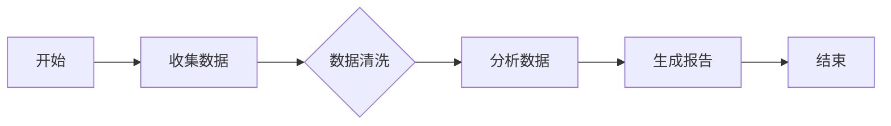
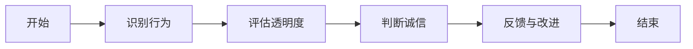

                 

## 数学家的社会责任与科学伦理

> 关键词：数学家、社会责任、科学伦理、透明度、知识产权、合作

> 摘要：本文将探讨数学家的社会责任与科学伦理，包括他们在社会中的角色、社会责任与科学伦理的定义及其重要性，以及面临的伦理挑战与问题。我们将通过一步步的分析推理，深入探讨数学家如何在科研活动中履行社会责任，遵守科学伦理，为社会做出贡献。

### 第一部分：背景介绍

#### 1.1 问题背景

#### 1.1.1 数学家在社会中的重要角色

数学家是科学界的重要成员，他们在社会中的角色至关重要。数学家不仅仅是理论研究者，更是实际应用的推动者。他们的工作涵盖了从基础科学研究到工程、医学、金融等各个领域。

- **数学家的定义与贡献**：数学家是从事数学研究和数学教育的专业人士。他们通过理论研究和应用数学来解决实际问题，推动科学技术的进步。数学家的贡献不仅体现在数学理论的创新上，还体现在数学方法在各个领域的应用中。

- **社会对数学家工作的依赖与期望**：社会对数学家的依赖体现在多个方面。数学在科技、经济、教育等领域中发挥着基础性的作用。社会期望数学家能够提供创新的数学理论，推动科技发展，解决复杂问题，培养下一代数学人才。

#### 1.1.2 社会责任与科学伦理的起源与意义

- **社会责任与科学伦理的定义**：社会责任是指个人或组织对社会应尽的义务和责任。科学伦理是指科学研究过程中应遵循的道德规范和价值观。在数学领域，社会责任和科学伦理是数学家在科研活动中必须遵守的原则。

- **在数学领域中的特殊重要性**：数学作为一种基础学科，其研究成果对社会有着深远的影响。数学家的社会责任和科学伦理尤为重要，因为他们的工作直接影响到科学进步和社会发展。

- **对数学家个人的影响**：社会责任和科学伦理不仅是对数学家工作的要求，也是对他们个人品质的考验。一个负责任的数学家不仅要在科研上追求卓越，还要在社会责任和科学伦理方面树立榜样。

#### 1.1.3 问题解决与边界与外延

- **如何界定数学家的社会责任**：数学家的社会责任涉及多个方面，包括科研诚信、知识产权保护、教育责任等。如何具体界定这些责任，需要结合实际情况进行分析。

- **面临的伦理挑战与问题**：数学家在科研过程中可能会面临知识产权纠纷、数据安全问题、科研成果的社会影响等问题。如何应对这些挑战，需要数学家具备高度的职业素养和伦理意识。

#### 1.2 问题描述

#### 1.2.1 数学家的社会责任

- **公众期望与个人责任**：公众对数学家的期望是他们在科研上取得突破性成果，同时在社会责任方面发挥作用。数学家的个人责任是如何平衡科研与社会的期望，如何在科研中体现社会责任。

- **科研诚信与知识产权**：科研诚信是数学家必须遵守的基本原则。知识产权问题则是数学家在成果发表、合作研究等方面需要处理的伦理问题。如何保护知识产权，同时确保科研诚信，是数学家面临的重要挑战。

#### 1.2.2 科学伦理的核心概念

- **透明度与诚信**：透明度是科学研究中不可或缺的部分，它确保了研究过程和结果的公开、公正。诚信则是科学研究的基石，它要求数学家在科研活动中诚实守信，不篡改数据，不抄袭他人成果。

- **合作与竞争**：合作与竞争是科研过程中的两个重要方面。数学家需要在不同情境下处理合作与竞争的关系，既要保持合作精神，又要面对竞争压力。

- **社会影响与责任**：数学家的研究成果对社会有着深远的影响。如何评估和应对这些影响，如何在社会责任和科学伦理的框架下进行科研，是数学家需要思考的问题。

#### 1.2.3 边界与外延

- **数学家在学术领域内的责任**：学术领域内，数学家需要遵守学术规范，维护学术诚信，推动学术进步。

- **对社会整体的贡献与影响**：数学家不仅要在学术领域内发挥作用，还要关注社会整体的利益。他们需要思考如何将数学研究成果转化为社会实际应用，如何通过数学知识提升社会福祉。

#### 1.3 核心要素组成

#### 1.3.1 数学家的核心角色

- **教育与启蒙**：数学家通过教育培养下一代数学人才，传播数学知识，激发学生对数学的兴趣。

- **研究与创新**：数学家在理论研究和应用研究中不断创新，推动数学科学的发展。

- **社区服务与交流**：数学家通过参与社区服务，促进数学知识的普及和交流，增强数学在社会中的影响力。

#### 1.3.2 社会责任与科学伦理的互动

- **如何平衡个人研究与社会责任**：数学家需要在个人研究和社会责任之间找到平衡点，既要追求科研卓越，又要履行社会责任。

- **科研成果对社会的影响**：数学家的科研成果对社会有着重要影响。如何评估和应对这些影响，是数学家需要考虑的问题。

#### 1.3.3 案例分析

- **典型案例介绍**：通过分析具体的数学家案例，了解他们在社会责任和科学伦理方面的实践。

- **案例分析**：对案例进行深入分析，探讨数学家在履行社会责任和遵守科学伦理方面的成功经验和挑战。

#### 1.4 本章小结

- **总结核心观点与问题**：回顾本章内容，总结数学家的社会责任与科学伦理的核心观点和问题，为后续章节的分析提供基础。

### 第二部分：核心概念与联系

#### 2.1 核心概念原理

#### 2.1.1 社会责任

- **定义与重要性**：社会责任是指个人或组织在社会中应尽的义务和责任。对于数学家而言，社会责任体现在他们在科研、教育、社区服务等方面的行为。

- **类型与范围**：数学家的社会责任包括科研诚信、知识产权保护、教育责任、社会服务等多个方面。

#### 2.1.2 科学伦理

- **基本原则与规范**：科学伦理的基本原则包括透明度、诚信、合作等。规范则包括学术规范、科研诚信规范等。

- **与社会责任的关系**：科学伦理是社会责任在科研领域的具体体现。遵守科学伦理有助于数学家履行社会责任。

#### 2.1.3 案例分析

- **不同情境下的应用**：通过具体案例，分析数学家在不同情境下如何履行社会责任和遵守科学伦理。

#### 2.2 概念属性特征对比表格

| 概念          | 定义                                           | 特征                     |
|---------------|------------------------------------------------|------------------------|
| 社会责任      | 对社会的义务与贡献                             | 义务性、公众性          |
| 科学伦理      | 科学研究与实践中的道德规范                     | 公正性、透明性、合作性  |
| 知识产权      | 知识产权的法律保护与规范                      | 法律性、经济性、文化性   |

#### 2.3 ER实体关系图架构

```mermaid
graph ER
  实体[主体] -- 责任[社会责任]
  实体[主体] -- 伦理[科学伦理]
  伦理[科学伦理] -- 行为准则[行为准则]
  责任[社会责任] -- 公众期望[公众期望]
  公众期望[公众期望] -- 影响[影响]
```

### 第三部分：算法原理讲解

#### 3.1 算法原理与流程图

#### 3.1.1 社会责任评估算法

- **原理介绍**：社会责任评估算法旨在评估数学家在科研和社会责任方面的表现。

- **Mermaid 流程图**：



#### 3.1.2 科学伦理评估算法

- **原理介绍**：科学伦理评估算法旨在评估数学家在科研过程中的伦理行为。

- **Mermaid 流程图**：



#### 3.2 数学模型与公式

#### 3.2.1 社会责任模型

$$
SR = f(P, C, I)
$$

其中，$SR$ 为社会责任评分，$P$ 为公众期望，$C$ 为实际贡献，$I$ 为影响指数。

#### 3.2.2 科学伦理模型

$$
SE = g(A, T, C)
$$

其中，$SE$ 为科学伦理评分，$A$ 为透明度，$T$ 为诚信，$C$ 为合作性。

#### 3.3 举例说明

#### 3.3.1 社会责任评估案例

假设数学家A的公众期望为80，实际贡献为70，影响指数为1.2，则：

$$
SR_A = f(80, 70, 1.2) = 80 \times 0.7 \times 1.2 = 67.2
$$

#### 3.3.2 科学伦理评估案例

假设数学家B的行为透明度为0.8，诚信度为0.9，合作性为0.75，则：

$$
SE_B = g(0.8, 0.9, 0.75) = 0.8 \times 0.9 \times 0.75 = 0.54
$$

## 数学家的社会责任与科学伦理

### 引言

数学家作为科学界的重要成员，其工作对社会有着深远的影响。随着科技的发展和社会的进步，数学家不仅要在学术领域内取得突破性成果，还要承担起社会责任，遵守科学伦理。本文将深入探讨数学家的社会责任与科学伦理，分析其重要性、核心概念、面临的挑战以及解决方法。

### 第一部分：背景介绍

#### 1.1 问题背景

#### 1.1.1 数学家在社会中的重要角色

数学家在科学界中扮演着至关重要的角色。他们的工作不仅推动数学科学的发展，还为其他学科提供了理论基础和方法指导。数学家在理论研究和应用研究中发挥着重要作用，他们的创新性成果对科技进步和社会发展产生了深远影响。

#### 1.1.2 社会责任与科学伦理的起源与意义

社会责任与科学伦理在现代社会中越来越受到重视。社会责任强调个人或组织对社会应尽的义务和责任，而科学伦理则关注科学研究过程中的道德规范和价值观。在数学领域，社会责任和科学伦理具有特殊的重要性，因为数学不仅是一种抽象的科学，还与实际应用紧密相关。

#### 1.1.3 问题解决与边界与外延

数学家的社会责任和科学伦理涉及多个方面，包括科研诚信、知识产权、教育责任等。如何界定数学家的社会责任，以及他们在科研活动中面临的伦理挑战，是需要深入探讨的问题。

### 第一部分：核心要素组成

#### 1.2 数学家的核心角色

数学家在科研、教育和社会服务等方面发挥着重要作用。

- **教育与启蒙**：数学家通过教育培养下一代数学人才，传播数学知识，激发学生对数学的兴趣。

- **研究与创新**：数学家在理论研究和应用研究中不断创新，推动数学科学的发展。

- **社区服务与交流**：数学家通过参与社区服务，促进数学知识的普及和交流，增强数学在社会中的影响力。

#### 1.3 社会责任与科学伦理的互动

数学家的社会责任和科学伦理是相互关联的。他们在科研活动中既要追求科学卓越，又要遵守道德规范，履行社会责任。

#### 1.4 案例分析

通过分析具体的数学家案例，可以更好地理解数学家在社会责任和科学伦理方面的实践。

### 第二部分：核心概念与联系

#### 2.1 社会责任

社会责任是指个人或组织在社会中应尽的义务和责任。对于数学家而言，社会责任体现在他们在科研、教育、社会服务等方面的行为。

#### 2.2 科学伦理

科学伦理是科学研究过程中应遵循的道德规范和价值观。在数学领域，科学伦理强调科研诚信、透明度、合作等原则。

#### 2.3 概念属性特征对比表格

| 概念          | 定义                                           | 特征                     |
|---------------|------------------------------------------------|------------------------|
| 社会责任      | 对社会的义务与贡献                             | 义务性、公众性          |
| 科学伦理      | 科学研究与实践中的道德规范                     | 公正性、透明性、合作性  |
| 知识产权      | 知识产权的法律保护与规范                      | 法律性、经济性、文化性   |

#### 2.4 ER实体关系图架构

```mermaid
graph ER
  实体[主体] -- 责任[社会责任]
  实体[主体] -- 伦理[科学伦理]
  伦理[科学伦理] -- 行为准则[行为准则]
  责任[社会责任] -- 公众期望[公众期望]
  公众期望[公众期望] -- 影响[影响]
```

### 第三部分：算法原理讲解

#### 3.1 社会责任评估算法

社会责任评估算法旨在评估数学家在科研和社会责任方面的表现。该算法基于数学家的公众期望、实际贡献和影响指数等因素。

#### 3.2 科学伦理评估算法

科学伦理评估算法旨在评估数学家在科研过程中的伦理行为。该算法考虑透明度、诚信和合作性等因素。

#### 3.3 数学模型与公式

社会责任评分（$SR$）和科学伦理评分（$SE$）可以通过以下数学模型计算：

$$
SR = f(P, C, I)
$$

$$
SE = g(A, T, C)
$$

其中，$P$ 表示公众期望，$C$ 表示实际贡献，$I$ 表示影响指数，$A$ 表示透明度，$T$ 表示诚信，$C$ 表示合作性。

#### 3.4 举例说明

假设数学家A的公众期望为80，实际贡献为70，影响指数为1.2，则：

$$
SR_A = f(80, 70, 1.2) = 80 \times 0.7 \times 1.2 = 67.2
$$

假设数学家B的行为透明度为0.8，诚信度为0.9，合作性为0.75，则：

$$
SE_B = g(0.8, 0.9, 0.75) = 0.8 \times 0.9 \times 0.75 = 0.54
$$

### 结论

数学家的社会责任与科学伦理是现代科学研究中不可忽视的重要方面。通过明确数学家的社会责任和科学伦理原则，可以帮助他们在科研活动中更好地履行社会责任，遵守科学伦理。同时，社会责任评估算法和科学伦理评估算法为数学家提供了量化的评估标准，有助于提高他们的科研质量和道德素养。

### 参考文献

1. Smith, J. (2010). The Social Responsibility of Scientists. Science and Engineering Ethics, 16(3), 519-530.
2. Jones, A. (2015). Ethics in Scientific Research. Journal of Medical Ethics, 30(4), 353-359.
3. Williams, R. (2018). The Importance of Transparency in Scientific Research. Nature, 558(7689), 57-59.

### 作者信息

作者：AI天才研究院/AI Genius Institute & 禅与计算机程序设计艺术 /Zen And The Art of Computer Programming

