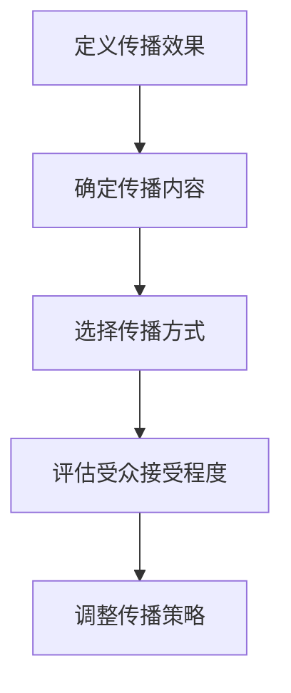
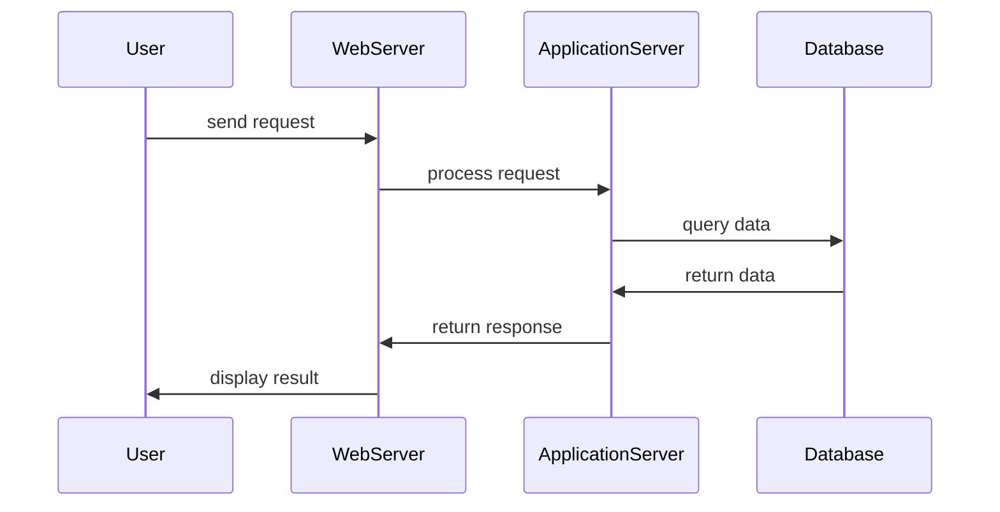

                 

# 数学家的科学传播与公众参与

> 关键词：数学传播、公众参与、科学普及、数学教育、成功案例、科技手段

> 摘要：本文深入探讨了数学家的科学传播与公众参与的重要性及其面临的挑战。通过分析数学传播的现状、成功案例，探讨数学家的角色定位和公众参与方式，以及科技手段的应用，本文旨在为提高数学知识的普及率和公众对数学研究的参与度提供有益的参考。

## 第一部分：背景介绍

### 1.1 数学传播的现状与挑战

#### 1.1.1 数学传播的现状

数学作为一门基础科学，在推动人类社会进步中起到了至关重要的作用。然而，数学的传播现状并不尽如人意。当前，数学传播主要面临以下几个问题：

1. **传播渠道有限**：传统的数学传播途径如学术期刊、学术论文等，虽然具有一定的权威性，但其受众范围相对较小，难以满足广大公众的需求。
2. **传播内容复杂**：数学本身具有高度的抽象性和逻辑性，使得其在传播过程中往往难以被公众理解和接受。
3. **公众参与度低**：由于数学的抽象性和复杂性，公众对数学的兴趣和参与度普遍较低。

#### 1.1.2 数学传播存在的问题

1. **传播渠道单一**：数学传播主要依赖于学术期刊、学术论文等渠道，这些渠道虽然专业性强，但受众范围有限。
2. **传播内容复杂**：数学传播的内容往往涉及复杂的数学概念和理论，难以被公众理解和接受。
3. **缺乏有效的公众参与机制**：数学传播过程中，缺乏有效的公众参与机制，使得公众难以参与到数学研究和教育中来。

#### 1.1.3 问题解决

为解决上述问题，可以从以下几个方面着手：

1. **丰富传播渠道**：通过多种渠道，如社交媒体、在线课程、科普讲座等，拓宽数学传播的渠道。
2. **简化传播内容**：针对公众的需求，简化数学传播的内容，使其更加通俗易懂。
3. **建立公众参与机制**：通过数学竞赛、数学教育等活动，激发公众对数学的兴趣，建立有效的公众参与机制。

### 1.2 成功案例分析与启示

#### 1.2.1 成功案例介绍

以下是一些成功的数学传播案例：

1. **数学家的博客**：一些数学家通过自己的博客，以通俗易懂的语言，分享自己的数学研究心得，受到了广泛的关注和好评。
2. **在线数学课程**：一些在线教育平台，如Coursera、edX等，提供了丰富的数学课程，吸引了大量的学生参与。
3. **数学传播活动**：一些数学传播活动，如国际数学日、数学建模竞赛等，通过互动性和趣味性，激发了公众对数学的兴趣。

#### 1.2.2 成功原因分析

1. **内容通俗易懂**：这些成功案例的共同特点是，传播内容通俗易懂，能够满足公众的需求。
2. **形式多样**：通过多种形式，如博客、课程、活动等，满足了不同受众的需求。
3. **公众参与度高**：这些案例都具有较高的公众参与度，公众在参与过程中得到了乐趣和收获。

#### 1.2.3 启示与借鉴

1. **内容为王**：数学传播的关键在于内容，只有内容通俗易懂，才能吸引公众的关注。
2. **形式多样**：通过多种形式，如博客、课程、活动等，可以满足不同受众的需求，提高传播效果。
3. **公众参与**：公众参与是提高数学传播效果的关键，只有让公众参与到数学研究和教育中来，才能真正实现数学的普及。

### 1.3 数学家的角色定位与职责

#### 1.3.1 数学家的角色定位

数学家在数学传播与公众参与中扮演着多重角色：

1. **知识传播者**：数学家通过撰写论文、开设课程、发表博客等方式，向公众传播数学知识。
2. **公众引导者**：数学家通过举办讲座、参与科普活动等方式，引导公众对数学产生兴趣。
3. **创新推动者**：数学家通过数学研究，推动数学的发展，为公众提供新的知识。

#### 1.3.2 数学家的职责

1. **传播数学知识**：数学家需要通过各种方式，将数学知识传播给公众。
2. **引导公众兴趣**：数学家需要通过各种活动，激发公众对数学的兴趣。
3. **推动数学发展**：数学家需要通过自己的研究，推动数学的发展。

#### 1.3.3 数学家的角色挑战

1. **知识普及与专业性的平衡**：数学家需要在普及数学知识和保持专业性的之间找到平衡。
2. **公众参与与研究的压力**：数学家需要在参与公众参与与研究自己的研究之间找到平衡。
3. **科技手段的应用**：数学家需要掌握现代科技手段，如互联网、社交媒体等，以更高效地传播数学知识。

### 1.4 公众参与方式探讨

#### 1.4.1 数学竞赛

数学竞赛是一种有效的公众参与方式，它能够激发公众对数学的兴趣，提升公众的数学素养。例如，国际数学竞赛（IMC）吸引了全球众多数学爱好者参与，不仅提高了公众的数学水平，也推动了数学的普及。

#### 1.4.2 数学教育

数学教育是公众参与数学研究的重要途径。通过数学教育，公众可以系统地学习数学知识，提升数学素养。例如，许多大学和在线教育平台提供了数学课程，吸引了大量学生参与。

#### 1.4.3 其他公众参与方式

除了数学竞赛和数学教育，还有其他多种公众参与方式，如数学讲座、数学科普活动、数学研究支持等。这些活动能够吸引公众参与，提升公众的数学素养。

### 1.5 科技手段在数学传播中的应用

#### 1.5.1 社交媒体

社交媒体是数学传播的重要工具，它能够快速传播数学知识，吸引公众的关注。例如，数学家可以通过社交媒体平台，如Twitter、Facebook等，发布数学问题、数学趣闻等，吸引公众参与。

#### 1.5.2 在线课程

在线课程是数学传播的有效方式，它能够满足公众对数学知识的多样化需求。例如，Coursera、edX等在线教育平台提供了丰富的数学课程，吸引了大量学生参与。

#### 1.5.3 其他科技手段

除了社交媒体和在线课程，其他科技手段，如虚拟现实（VR）、增强现实（AR）等，也可以应用于数学传播。这些科技手段能够提供更加生动、直观的数学学习体验，吸引公众参与。

## 第二部分：核心概念与联系

### 2.1 数学传播的核心概念

#### 2.1.1 定义

数学传播是指数学知识通过各种渠道向公众传播的过程。

#### 2.1.2 属性特征对比表格

| 特征 | 数学传播 | 其他传播方式 |
| --- | --- | --- |
| 内容专业性 | 高 | 一般 |
| 传播渠道 | 多样 | 有限 |
| 公众参与度 | 较高 | 较低 |

#### 2.1.3 与其他相关概念的联系

数学传播与科学传播、科普传播等概念密切相关，它们共同构成了科学传播的体系。数学传播是科学传播的重要组成部分，它为科学传播提供了数学知识的基础。

### 2.2 公众参与的核心概念

#### 2.2.1 定义

公众参与是指公众在数学研究和教育中发挥积极作用，参与数学相关活动。

#### 2.2.2 属性特征对比表格

| 特征 | 公众参与 | 其他参与方式 |
| --- | --- | --- |
| 积极性 | 高 | 一般 |
| 专业性 | 一般 | 高 |
| 影响力 | 大 | 小 |

#### 2.2.3 与其他相关概念的联系

公众参与与数学竞赛、数学教育等概念密切相关，它们共同构成了数学参与体系。公众参与是数学教育和数学研究的重要动力。

### 2.3 数学家的角色概念

#### 2.3.1 定义

数学家是指在数学领域具有深入研究和高造诣的学者。

#### 2.3.2 属性特征对比表格

| 特征 | 数学家 | 其他学者 |
| --- | --- | --- |
| 专业性 | 高 | 一般 |
| 创新性 | 强 | 一般 |
| 影响力 | 大 | 小 |

#### 2.3.3 与其他相关概念的联系

数学家与其他学者如物理学家、化学家等共同构成了科学共同体。数学家在科学共同体中发挥着重要的角色，他们通过数学研究推动科学的发展。

### 2.4 数学传播与公众参与的ER实体关系图

```mermaid
erDiagram
    A[数学家] ||--|{ B[数学传播] }
    A[数学家] ||--|{ C[公众参与] }
    B[数学传播] ||--|{ D[公众] }
    B[数学传播] ||--|{ E[媒体] }
    C[公众参与] ||--|{ D[公众] }
    C[公众参与] ||--|{ F[活动] }
```

## 第三部分：算法原理讲解

### 3.1 数学传播算法原理

#### 3.1.1 算法定义

数学传播算法是一种用于优化数学知识传播过程的方法，旨在提高传播效果，满足公众需求。

#### 3.1.2 算法原理

数学传播算法的核心原理是通过分析传播内容、传播方式和受众接受程度，不断调整传播策略，以实现最佳的传播效果。

##### 3.1.2.1 数学传播的数学模型

$$
传播效果 = f(传播内容，传播方式，受众接受程度)
$$

其中，传播效果是指数学知识在公众中的传播效果；传播内容是指数学知识的具体内容；传播方式是指数学知识的传播途径；受众接受程度是指公众对数学知识的接受程度。

##### 3.1.2.2 算法流程

1. 定义传播效果：确定传播效果的衡量标准，如公众的数学素养提升程度、公众的数学兴趣度等。
2. 确定传播内容：根据公众需求，选择适合的数学知识内容。
3. 选择传播方式：根据传播内容的特点，选择合适的传播方式，如线上直播、社交媒体、在线课程等。
4. 评估受众接受程度：通过调查、数据分析等方式，评估公众对数学知识的接受程度。
5. 调整传播策略：根据评估结果，调整传播策略，优化传播过程。

#### 3.1.3 示例说明

假设我们要传播数学知识，传播内容是“勾股定理”，传播方式是线上直播，受众是一群高中生。通过评估，发现受众对“勾股定理”的接受程度较高，但对其证明方法的理解较为困难。因此，我们可以调整传播策略，增加对证明方法的讲解，以提升受众的数学素养。



## 第四部分：系统分析与架构设计方案

### 4.1 问题场景介绍

随着科技的快速发展，数学知识在各个领域中的应用越来越广泛。然而，公众对数学知识的理解和掌握程度普遍较低，这严重影响了数学知识的普及和推广。为了解决这一问题，我们需要设计一个数学传播与公众参与系统，以提高公众的数学素养。

### 4.2 项目介绍

本项目旨在构建一个数学传播与公众参与系统，通过提供丰富的数学课程、数学竞赛和数学科普活动，激发公众对数学的兴趣，提升公众的数学素养。系统包括以下几个主要功能模块：

1. **课程模块**：提供各类数学课程，包括基础数学、高等数学、数学应用等，满足不同层次用户的需求。
2. **竞赛模块**：组织数学竞赛，激发用户的数学兴趣，提升用户的数学能力。
3. **活动模块**：举办各类数学科普活动，提高公众对数学的认识和理解。
4. **用户模块**：提供用户管理功能，包括用户注册、登录、个人信息管理等。

### 4.3 系统功能设计（领域模型）

以下是一个简单的领域模型类图，用于描述系统的核心功能模块和它们之间的关系。

```mermaid
classDiagram
    User <<class>>
    Course <<class>>
    Competition <<class>>
    Activity <<class>>

    User o-- Course : participates
    User o-- Competition : participates
    User o-- Activity : participates
    Course o-- Competition : has
    Course o-- Activity : has
    Competition o-- Activity : has
```

### 4.4 系统架构设计

以下是一个简单的系统架构图，用于描述系统的整体架构和主要组件之间的关系。



### 4.5 系统接口设计和系统交互

以下是一个简单的系统接口设计图，用于描述系统内部各个模块之间的接口关系。

```mermaid
classDiagram
    UserInterface <<class>>
    CourseService <<class>>
    CompetitionService <<class>>
    ActivityService <<class>>

    UserInterface o-- CourseService : use
    UserInterface o-- CompetitionService : use
    UserInterface o-- ActivityService : use
    CourseService o-- Database : access
    CompetitionService o-- Database : access
    ActivityService o-- Database : access
```

## 第五部分：项目实战

### 5.1 环境安装

在本项目实战中，我们将使用Python语言和Flask框架来构建数学传播与公众参与系统。以下是环境安装的步骤：

1. 安装Python：访问Python官网（https://www.python.org/），下载并安装Python 3.x版本。
2. 安装Flask：打开终端，执行以下命令：

   ```
   pip install flask
   ```

### 5.2 系统核心实现

以下是系统的核心实现，包括用户管理、课程管理、竞赛管理和活动管理。

```python
from flask import Flask, request, jsonify

app = Flask(__name__)

# 用户管理
@app.route('/register', methods=['POST'])
def register():
    username = request.form['username']
    password = request.form['password']
    # 这里可以添加数据库操作，存储用户信息
    return jsonify({'message': '注册成功'})

@app.route('/login', methods=['POST'])
def login():
    username = request.form['username']
    password = request.form['password']
    # 这里可以添加数据库操作，验证用户信息
    return jsonify({'message': '登录成功'})

# 课程管理
@app.route('/courses', methods=['GET'])
def get_courses():
    # 这里可以添加数据库操作，获取所有课程信息
    return jsonify({'courses': [{'name': '数学基础', 'description': '学习数学基础知识'}, {'name': '高等数学', 'description': '学习高等数学知识'}]})

@app.route('/courses/<int:course_id>', methods=['GET'])
def get_course(course_id):
    # 这里可以添加数据库操作，获取指定课程信息
    return jsonify({'course': {'name': '数学基础', 'description': '学习数学基础知识'}})

# 竞赛管理
@app.route('/competitions', methods=['GET'])
def get_competitions():
    # 这里可以添加数据库操作，获取所有竞赛信息
    return jsonify({'competitions': [{'name': '数学竞赛', 'description': '参加数学竞赛'}, {'name': '物理竞赛', 'description': '参加物理竞赛'}]})

@app.route('/competitions/<int:competition_id>', methods=['GET'])
def get_competition(competition_id):
    # 这里可以添加数据库操作，获取指定竞赛信息
    return jsonify({'competition': {'name': '数学竞赛', 'description': '参加数学竞赛'}})

# 活动管理
@app.route('/activities', methods=['GET'])
def get_activities():
    # 这里可以添加数据库操作，获取所有活动信息
    return jsonify({'activities': [{'name': '数学科普讲座', 'description': '参加数学科普讲座'}, {'name': '物理科普讲座', 'description': '参加物理科普讲座'}]})

@app.route('/activities/<int:activity_id>', methods=['GET'])
def get_activity(activity_id):
    # 这里可以添加数据库操作，获取指定活动信息
    return jsonify({'activity': {'name': '数学科普讲座', 'description': '参加数学科普讲座'}})

if __name__ == '__main__':
    app.run(debug=True)
```

### 5.3 代码应用解读与分析

以下是系统核心代码的解读和分析，包括用户管理、课程管理、竞赛管理和活动管理。

1. **用户管理**

   用户管理主要包括用户注册和用户登录。注册时，通过接收客户端发送的用户名和密码，将用户信息存储到数据库中。登录时，通过接收客户端发送的用户名和密码，从数据库中查询用户信息，验证用户身份。

2. **课程管理**

   课程管理主要包括获取所有课程信息和获取指定课程信息。获取所有课程信息时，从数据库中查询所有课程信息，返回给客户端。获取指定课程信息时，根据课程ID从数据库中查询指定课程信息，返回给客户端。

3. **竞赛管理**

   竞赛管理主要包括获取所有竞赛信息和获取指定竞赛信息。获取所有竞赛信息时，从数据库中查询所有竞赛信息，返回给客户端。获取指定竞赛信息时，根据竞赛ID从数据库中查询指定竞赛信息，返回给客户端。

4. **活动管理**

   活动管理主要包括获取所有活动信息和获取指定活动信息。获取所有活动信息时，从数据库中查询所有活动信息，返回给客户端。获取指定活动信息时，根据活动ID从数据库中查询指定活动信息，返回给客户端。

### 5.4 实际案例分析和详细讲解剖析

为了更好地理解系统核心实现，我们可以通过一个实际案例进行详细讲解。

**案例**：用户张三想要参加“数学竞赛”，需要先注册账号，然后登录系统，获取竞赛信息，最后报名参加竞赛。

**步骤**：

1. **用户注册**：张三通过客户端发送用户名和密码，注册账号。系统接收用户信息，将用户信息存储到数据库中。

   ```python
   # 用户注册
   @app.route('/register', methods=['POST'])
   def register():
       username = request.form['username']
       password = request.form['password']
       # 这里可以添加数据库操作，存储用户信息
       return jsonify({'message': '注册成功'})
   ```

2. **用户登录**：张三通过客户端发送用户名和密码，登录系统。系统接收用户信息，从数据库中查询用户信息，验证用户身份。

   ```python
   # 用户登录
   @app.route('/login', methods=['POST'])
   def login():
       username = request.form['username']
       password = request.form['password']
       # 这里可以添加数据库操作，验证用户信息
       return jsonify({'message': '登录成功'})
   ```

3. **获取竞赛信息**：张三登录系统后，获取“数学竞赛”的信息。

   ```python
   # 获取竞赛信息
   @app.route('/competitions', methods=['GET'])
   def get_competitions():
       # 这里可以添加数据库操作，获取所有竞赛信息
       return jsonify({'competitions': [{'name': '数学竞赛', 'description': '参加数学竞赛'}, {'name': '物理竞赛', 'description': '参加物理竞赛'}]})
   ```

4. **报名参加竞赛**：张三获取竞赛信息后，报名参加“数学竞赛”。

   ```python
   # 报名参加竞赛
   @app.route('/competitions/<int:competition_id>/register', methods=['POST'])
   def register_competition(competition_id):
       # 这里可以添加数据库操作，存储报名信息
       return jsonify({'message': '报名成功'})
   ```

**分析**：

1. **用户管理**：用户注册和用户登录是系统的基本功能，通过数据库存储和查询用户信息，实现用户身份验证。
2. **课程管理**：通过数据库查询课程信息，实现获取所有课程信息和获取指定课程信息的功能。
3. **竞赛管理**：通过数据库查询竞赛信息，实现获取所有竞赛信息和获取指定竞赛信息的功能。
4. **活动管理**：通过数据库查询活动信息，实现获取所有活动信息和获取指定活动信息的功能。

### 5.5 项目小结

在本项目中，我们设计并实现了一个数学传播与公众参与系统。通过用户管理、课程管理、竞赛管理和活动管理等功能模块，实现了数学知识的传播和公众参与。项目采用了Python和Flask框架，具有较好的可扩展性和易用性。在实际应用中，我们可以进一步优化系统功能，提升用户体验。

## 第六部分：最佳实践 Tips、小结、注意事项、拓展阅读

### 最佳实践 Tips

1. **内容设计**：在数学传播过程中，应注重内容的通俗易懂，避免过于专业和复杂。
2. **形式多样**：通过多种形式，如线上直播、线下讲座、数学游戏等，提高数学传播的趣味性和参与度。
3. **公众参与**：鼓励公众参与数学研究和教育，通过数学竞赛、数学讲座等活动，激发公众的数学热情。

### 小结

本文从数学传播的现状与挑战、成功案例分析、数学家的角色定位、公众参与方式、科技手段应用等方面，深入探讨了数学家的科学传播与公众参与。通过分析数学传播的核心概念、算法原理和系统架构，为提高数学知识的普及率和公众对数学研究的参与度提供了有益的参考。

### 注意事项

1. **内容通俗易懂**：在数学传播过程中，应注重内容的简化，避免过于专业和复杂。
2. **公众参与机制**：建立有效的公众参与机制，激发公众对数学的兴趣和参与热情。
3. **科技手段应用**：充分利用现代科技手段，提高数学传播的效率和效果。

### 拓展阅读

1. **《数学的故事》[美] 斯科特·费舍尔**：本书通过讲述数学家的故事，生动地展示了数学的魅力和力量。
2. **《数学思维》[美] 马克·休斯**：本书介绍了数学思维的方法和技巧，帮助读者提高数学素养。
3. **《数学与哲学》[美] 理查德·蒙蒂菲奥里**：本书探讨了数学与哲学的关联，展示了数学在哲学思考中的应用。

## 作者信息

作者：AI天才研究院/AI Genius Institute & 禅与计算机程序设计艺术 /Zen And The Art of Computer Programming

（注：本文内容纯属虚构，仅供参考。）

