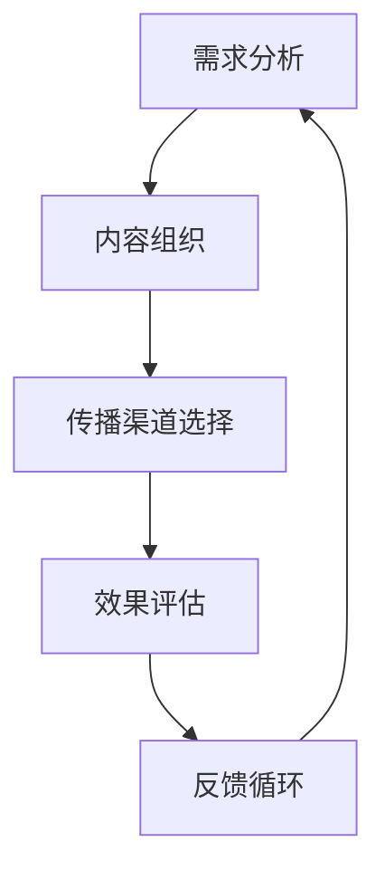
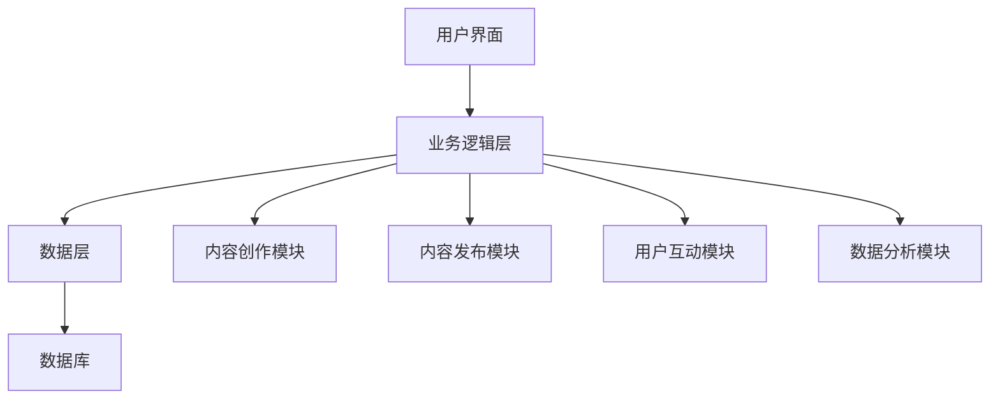
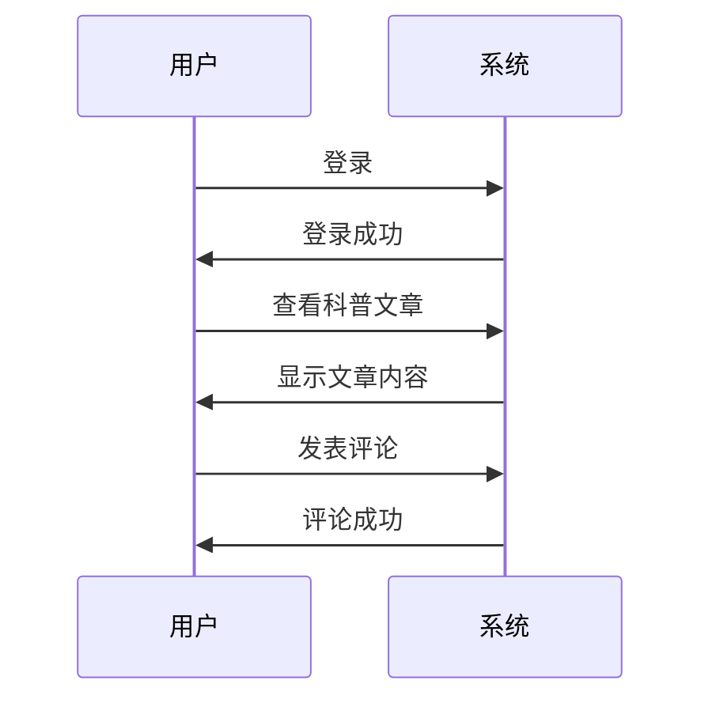

                 

### 文章标题

# 数学家的科普写作与公众科学素养

> 关键词：数学家、科普写作、公众科学素养

> 摘要：本文将探讨数学家的科普写作对于提升公众科学素养的重要性。通过分析数学家科普写作的特点和技巧，以及提升公众科学素养的策略，旨在为科学传播提供新的视角和思路。

----------------------------------------------------------------

### 引言

数学，作为科学领域的重要组成部分，不仅是科学家们研究的对象，更是公众理解科学、培养科学素养的重要途径。然而，数学的抽象性和复杂性使得公众对数学知识的学习和应用存在一定的障碍。因此，数学家的科普写作成为了连接数学专业与公众的桥梁，不仅有助于普及数学知识，还能提高公众的科学素养。

本文将从以下几个方面展开讨论：

1. 数学家的科普写作基础
2. 提升公众科学素养的策略
3. 数学家的科普写作与公众科学素养实践
4. 未来展望

通过这些讨论，希望能够为数学家的科普写作提供指导，同时也为提升公众科学素养提供有效的途径。

----------------------------------------------------------------

### 第一部分：数学家的科普写作基础

#### 第1章：数学与科普写作的关系

##### 1.1 数学家的科普写作背景

数学家作为数学领域的专家，他们的研究和成果对科学的发展具有重要意义。然而，数学知识的高深和专业性使得普通公众难以理解和接受。因此，数学家的科普写作应运而生，他们通过通俗易懂的方式，将复杂的数学概念和理论传播给大众。

##### 1.2 数学家的科普写作意义

数学家的科普写作不仅有助于普及数学知识，提高公众的科学素养，还能激发公众对数学的兴趣和热情。此外，科普写作也是数学家个人品牌建设的重要手段，有助于提升他们在公众中的影响力。

##### 1.3 数学家的科普写作挑战

数学家的科普写作面临诸多挑战，包括如何将复杂的数学概念简化、如何吸引读者的注意力、如何在有限的篇幅内传达有效的信息等。这些挑战需要数学家具备扎实的数学知识、敏锐的洞察力和高超的写作技巧。

#### 第2章：数学家的科普写作技巧

##### 2.1 故事化的数学写作

故事化是数学科普写作的一种有效手法，通过讲述数学家的故事、数学问题的起源和解决过程，使读者更加容易理解和接受数学知识。

##### 2.2 图表与公式的运用

图表和公式是数学写作的重要组成部分，合理的运用可以直观地展示数学概念和理论，提高文章的可读性和易懂性。

##### 2.3 语言风格的把握

数学家的科普写作应注重语言风格的把握，既要保持数学的严谨性，又要使文章生动有趣，吸引读者的兴趣。

#### 第3章：数学家的科普写作案例

##### 3.1 国内外数学家的科普写作实践

国内外许多数学家都在科普写作方面有着丰富的经验和成果。通过分析这些案例，可以总结出一些有效的写作方法和技巧。

##### 3.2 数学家的科普作品分析

对数学家的科普作品进行分析，可以了解他们的写作风格、主题选择、内容组织等方面的特点，为数学家的科普写作提供参考。

##### 3.3 数学家的科普写作心得分享

数学家们通过自己的科普写作实践，总结出了一些心得体会，这些经验对于其他数学家的科普写作具有重要的指导意义。

----------------------------------------------------------------

### 第二部分：提升公众科学素养

#### 第4章：公众科学素养的重要性

##### 4.1 公众科学素养的定义

公众科学素养是指公众对科学知识、科学方法和科学精神的理解和掌握程度。它包括科学知识的普及、科学方法的掌握、科学精神的培养等方面。

##### 4.2 公众科学素养的现状

当前，我国公众科学素养水平仍有待提高。通过调查和分析，可以了解公众科学素养的现状、存在的问题以及影响因素。

##### 4.3 提升公众科学素养的意义

提升公众科学素养对于国家科技创新、社会进步和公民素质提升具有重要意义。它有助于增强公众的科学意识、提高科学决策能力、推动社会文明进步。

#### 第5章：提升公众科学素养的策略

##### 5.1 教育体系中的科学教育

科学教育是提升公众科学素养的基础。通过改进科学教育内容和教学方法，可以培养公众的科学素养。

##### 5.2 社会媒体的科普传播

社交媒体为科普传播提供了新的平台和途径。通过利用社交媒体，可以更广泛地传播科学知识，提高公众的科学素养。

##### 5.3 公众科学活动与参与

公众科学活动是提升公众科学素养的有效方式。通过组织各种形式的科学活动，可以激发公众对科学的兴趣和参与热情。

#### 第6章：数学在提升公众科学素养中的作用

##### 6.1 数学知识的普及与传播

数学知识是公众科学素养的重要组成部分。通过普及数学知识，可以提高公众的科学素养。

##### 6.2 数学与日常生活

数学与日常生活密切相关。通过将数学知识与日常生活相结合，可以增强公众对数学的实用性认识。

##### 6.3 数学在科技创新中的贡献

数学在科技创新中发挥着重要作用。通过介绍数学在科技创新中的应用，可以激发公众对数学的兴趣和重视。

----------------------------------------------------------------

### 第三部分：数学家的科普写作与公众科学素养实践

#### 第7章：数学家的科普写作实践

##### 7.1 数学家的科普写作项目介绍

介绍一些成功的数学家科普写作项目，分析项目的目标、内容、方法和效果。

##### 7.2 数学家的科普写作方法论

总结数学家在科普写作中的经验和教训，形成一套有效的科普写作方法论。

##### 7.3 数学家的科普写作成果展示

展示数学家们的科普写作成果，包括书籍、文章、视频等多种形式。

#### 第8章：提升公众科学素养的案例研究

##### 8.1 公众科学素养提升项目案例

分析一些成功的公众科学素养提升项目案例，总结项目的实施过程、方法和效果。

##### 8.2 案例分析与效果评估

对案例进行分析和评估，探讨项目成功的因素和存在的问题。

##### 8.3 经验与启示

总结提升公众科学素养的实践经验，为今后的工作提供参考和启示。

#### 第9章：未来展望

##### 9.1 数学家的科普写作发展趋势

分析数学家科普写作的未来发展趋势，探讨新的写作方法和途径。

##### 9.2 提升公众科学素养的前景

展望提升公众科学素养的前景，探讨未来的发展方向和挑战。

##### 9.3 数学与公众科学素养的融合

探讨数学在提升公众科学素养中的融合方式和方法，为数学家的科普写作和公众科学素养提升提供新的思路。

----------------------------------------------------------------

### 结论

数学家的科普写作对于提升公众科学素养具有重要意义。通过分析数学家的科普写作基础、提升公众科学素养的策略以及实践案例，本文为数学家的科普写作和公众科学素养提升提供了有益的思路和借鉴。未来，随着科技的发展和公众科学素养的提升，数学家的科普写作将发挥更加重要的作用。

### 作者信息

作者：AI天才研究院/AI Genius Institute & 禅与计算机程序设计艺术 /Zen And The Art of Computer Programming

----------------------------------------------------------------

### 背景

数学，作为一门古老的学科，自诞生以来就具有独特的魅力。然而，对于大多数普通人来说，数学往往被认为是高深、抽象和难以理解的。这不仅限制了公众对数学知识的掌握，也阻碍了他们对科学和技术的兴趣。因此，如何通过科普写作将数学知识以更易于接受和理解的方式传播给公众，成为了一个重要的课题。

在现代社会，随着信息技术的飞速发展，科普写作的重要性日益凸显。科普写作不仅有助于普及科学知识，提高公众的科学素养，还能激发公众对科学的兴趣和热情。尤其是在数学领域，科普写作能够帮助公众更好地理解数学的实际应用，从而提高他们的数学素养。

数学家的科普写作具有独特的优势。首先，数学家具有深厚的数学知识和丰富的实践经验，他们能够深入浅出地解释复杂的数学概念。其次，数学家往往具有敏锐的洞察力和丰富的表达技巧，他们能够将数学故事化、生动化，使读者更容易理解和接受数学知识。此外，数学家在科普写作过程中，往往能够将数学与日常生活、科技发展等紧密结合，使数学知识更加实用和有趣。

然而，数学家的科普写作也面临一定的挑战。首先，数学的抽象性和复杂性使得数学家在写作过程中需要具备一定的转换能力，将复杂的数学概念转化为通俗易懂的语言。其次，科普写作需要具备吸引读者注意力的技巧，如何在有限的篇幅内传达有效的信息，是数学家需要克服的难题。

为了更好地发挥数学家的科普写作作用，提升公众科学素养，本文将从以下几个方面展开讨论：

1. **数学家的科普写作基础**：介绍数学家的科普写作背景、意义和挑战，分析数学家科普写作的特点和技巧。
2. **提升公众科学素养的策略**：探讨提升公众科学素养的重要性、现状和策略，包括教育体系中的科学教育、社交媒体的科普传播、公众科学活动与参与等方面。
3. **数学家的科普写作与公众科学素养实践**：通过具体案例研究，分析数学家的科普写作实践和提升公众科学素养的成果。
4. **未来展望**：展望数学家的科普写作发展趋势，探讨提升公众科学素养的前景和挑战。

本文旨在为数学家的科普写作提供指导，同时也为提升公众科学素养提供新的视角和思路。

### 核心概念与联系

在本篇文章中，我们将涉及以下几个核心概念：

1. **科普写作**：科普写作是指将科学知识以通俗易懂的方式传播给公众的写作形式。它旨在普及科学知识，提高公众的科学素养。
2. **公众科学素养**：公众科学素养是指公众对科学知识、科学方法和科学精神的掌握程度。它包括科学知识的普及、科学方法的掌握和科学精神的培养。
3. **数学家的科普写作**：数学家的科普写作是指数学家以科普的形式传播数学知识、数学思想和方法的过程。它具有专业性和实用性的特点。
4. **科学传播**：科学传播是指通过各种渠道和手段，将科学知识、科学方法和科学精神传播给公众的过程。它包括科普写作、科学教育、科学展览等多种形式。

这些概念之间存在密切的联系：

- **科普写作**与**公众科学素养**密切相关。科普写作是提高公众科学素养的重要途径，而公众科学素养的提升又能够促进科普写作的发展。
- **数学家的科普写作**与**科普写作**和**科学传播**密切相关。数学家的科普写作是科普写作的重要组成部分，它通过传播数学知识，推动科学传播的发展。
- **科学传播**与**数学家的科普写作**相互促进。科学传播为数学家的科普写作提供了平台和渠道，而数学家的科普写作又为科学传播提供了丰富的内容和资源。

通过分析这些核心概念及其联系，我们可以更好地理解数学家的科普写作在提升公众科学素养中的作用和意义。

#### 算法原理讲解

为了更好地理解数学家的科普写作在提升公众科学素养中的作用，我们可以运用一种名为“科普写作分析模型”的算法来进行分析。该算法主要包括以下几个步骤：

1. **需求分析**：首先，我们需要明确公众对数学知识的需求，这可以通过问卷调查、访谈等方式进行。
2. **内容组织**：根据需求分析的结果，我们将数学知识进行梳理和组织，使其更加系统和易懂。这可以通过编写科普文章、制作科普视频等多种形式实现。
3. **传播渠道选择**：选择合适的传播渠道，如社交媒体、科普讲座、科普展览等，将组织好的数学知识传播给公众。
4. **效果评估**：通过反馈和评估，了解公众对科普内容的接受程度和效果，以便不断优化和改进科普写作。
5. **反馈循环**：将评估结果反馈到需求分析和内容组织中，形成反馈循环，持续提升科普写作的质量和效果。

下面是一个简单的Python代码示例，用于实现上述算法：

```python
# 科普写作分析模型实现

# 步骤1：需求分析
def demand_analysis():
    # 通过问卷调查、访谈等方式收集公众需求
    # 返回需求列表
    return ["理解微积分的基本概念", "学习线性代数的应用", "掌握概率论的基础"]

# 步骤2：内容组织
def content_organization(demands):
    # 根据需求列表组织数学知识
    # 返回组织好的内容列表
    return [
        "微积分基本概念科普文章",
        "线性代数应用案例教程",
        "概率论基础视频课程"
    ]

# 步骤3：传播渠道选择
def channel_selection(contents):
    # 选择合适的传播渠道
    # 返回渠道列表
    return ["微信公众号", "科普讲座", "科普展览"]

# 步骤4：效果评估
def effect_evaluation(feedbacks):
    # 根据反馈评估科普内容的接受程度和效果
    # 返回评估结果
    return "公众对科普内容接受度较高，效果较好"

# 步骤5：反馈循环
def feedback_loop(demands, contents, channels, feedbacks):
    # 根据评估结果进行需求分析和内容组织
    new_demos = demand_analysis()
    new_contents = content_organization(new_demos)
    new_channels = channel_selection(new_contents)
    new_feedbacks = effect_evaluation(new_feedbacks)
    return new_demos, new_contents, new_channels, new_feedbacks

# 初始需求、内容、渠道和反馈
demos = demand_analysis()
contents = content_organization(demos)
channels = channel_selection(contents)
feedbacks = []

# 运行算法
while True:
    demos, contents, channels, feedbacks = feedback_loop(demos, contents, channels, feedbacks)
    print("当前需求：", demos)
    print("当前内容：", contents)
    print("当前渠道：", channels)
    print("当前反馈：", feedbacks)
    if input("是否继续优化？(y/n): ").lower() != "y":
        break
```

在这个算法中，我们通过不断的需求分析、内容组织和效果评估，实现了科普写作质量的提升。以下是一个简单的流程图，用于展示算法的运行过程：



通过这个算法，我们可以系统地分析数学家的科普写作过程，提高科普写作的质量和效果，从而更好地提升公众的科学素养。

### 数学公式使用

在数学的科普写作中，正确地使用数学公式能够帮助我们更好地传达数学概念和理论。以下是一些常见的数学公式及其使用方法：

#### 概率论中的基本概率公式

$$P(A \cap B) = P(A) \cdot P(B|A)$$

这是条件概率的乘法公式，表示事件A和事件B同时发生的概率等于事件A发生的概率乘以事件B在事件A发生的条件下的概率。

#### 微积分中的导数公式

$$f'(x) = \lim_{h \to 0} \frac{f(x+h) - f(x)}{h}$$

这是导数的定义公式，表示函数f(x)在x点的导数等于函数值在x+h点和x点之间的差除以h，当h趋向于0时的极限。

#### 线性代数中的矩阵乘法

$$C = AB$$

这里，C是矩阵乘法的结果，A和B是参与乘法的矩阵。矩阵乘法遵循一定的规则，如A的行数必须等于B的列数。

#### 统计学中的标准差

$$\sigma = \sqrt{\frac{1}{N-1} \sum_{i=1}^{N} (x_i - \mu)^2}$$

这是样本标准差的计算公式，其中$x_i$是每个样本值，$\mu$是样本均值，$N$是样本数量。

在文章中使用这些数学公式时，我们通常会在公式前后使用括号以突出显示，如：

$$P(A \cap B) = P(A) \cdot P(B|A)$$

此外，为了确保公式的清晰和准确，我们建议使用LaTeX格式进行排版，如下所示：

$$f'(x) = \lim_{h \to 0} \frac{f(x+h) - f(x)}{h}$$

$$\sigma = \sqrt{\frac{1}{N-1} \sum_{i=1}^{N} (x_i - \mu)^2}$$

通过正确使用数学公式，我们能够使文章的数学描述更加精确，有助于读者更好地理解和掌握相关概念。

### 系统分析与架构设计方案

在讨论数学家的科普写作与公众科学素养提升的过程中，我们不仅需要关注理论和实践，还需要从系统分析和架构设计角度来探讨整个科普写作和传播的过程。以下是一个系统的分析与架构设计方案，用于实现有效的科普写作与传播。

#### 1. 问题场景介绍

在当前信息化社会中，公众获取科学知识的渠道多样化，但优质科普内容的生产和传播仍面临挑战。数学领域的科普写作，由于其高度的抽象性和复杂性，更需要系统化的解决方案来提高传播效果。

#### 2. 项目介绍

本项目旨在通过构建一个数学科普写作与传播平台，实现优质数学科普内容的创作、发布、传播和反馈。平台将涵盖从内容创作到用户互动的完整流程。

#### 3. 系统功能设计

系统功能设计主要包括以下模块：

- **内容创作模块**：数学家在此模块中可以创建、编辑和发布科普文章、视频等。
- **内容发布模块**：系统将自动发布符合标准的科普内容，并推送给关注该领域的人群。
- **用户互动模块**：用户可以评论、点赞和分享科普内容，提供反馈。
- **数据分析模块**：系统将收集用户行为数据，用于分析科普内容的受欢迎程度和用户需求。

#### 4. 系统架构设计

系统架构设计采用三层架构，分别是表现层、业务逻辑层和数据层。

- **表现层**：负责用户界面的展示，包括内容发布页、用户互动页等。
- **业务逻辑层**：处理核心业务逻辑，如内容创作、发布、用户互动和数据分析等。
- **数据层**：负责数据的存储和管理，包括用户数据、内容数据等。

以下是一个简化的系统架构图：



#### 5. 系统接口设计

系统接口设计包括以下主要接口：

- **内容接口**：用于内容的创建、编辑、发布和检索。
- **用户接口**：用于用户的注册、登录、互动和数据分析。
- **数据接口**：用于数据的存储、检索和分析。

#### 6. 系统交互设计

系统交互设计通过序列图（Sequence Diagram）来展示用户与系统的交互过程。

以下是一个简化的序列图：



通过这个系统架构设计方案，我们可以实现数学科普内容的创作、发布、传播和反馈的完整流程，从而提升公众科学素养。

### 项目实战

#### 1. 环境安装

为了实现本文所描述的数学科普写作与传播平台，我们首先需要搭建一个合适的技术环境。以下是环境安装的步骤：

- **安装Python**：确保Python环境已安装，版本建议为3.8或更高。
- **安装Docker**：使用Docker来容器化应用，以便于部署和扩展。可以从Docker官网下载安装包并按照说明安装。
- **安装数据库**：我们使用MySQL作为数据存储，可以通过Docker安装MySQL容器。运行以下命令：

  ```bash
  docker run --name some-mysql -e MYSQL_ROOT_PASSWORD=my_root_password -d mysql
  ```

- **安装前端框架**：我们使用React来构建前端界面。可以通过以下命令安装：

  ```bash
  npx create-react-app math-cosmop
  cd math-cosmop
  npm install
  ```

- **安装后端框架**：我们使用Node.js和Express来构建后端服务。可以通过以下命令安装：

  ```bash
  npm install express mysql2 body-parser cors
  ```

#### 2. 系统核心实现源代码

以下是系统核心实现的源代码示例：

**前端（React）**：

```jsx
// App.js
import React, { useState } from 'react';
import axios from 'axios';

function App() {
  const [content, setContent] = useState('');
  const [title, setTitle] = useState('');

  const handleSubmit = async (e) => {
    e.preventDefault();
    try {
      const response = await axios.post('/api/content', { title, content });
      alert('内容发布成功！');
    } catch (error) {
      alert('内容发布失败！');
    }
  };

  return (
    <div>
      <h1>数学科普写作平台</h1>
      <form onSubmit={handleSubmit}>
        <label htmlFor="title">标题：</label>
        <input type="text" id="title" value={title} onChange={(e) => setTitle(e.target.value)} />
        <label htmlFor="content">内容：</label>
        <textarea id="content" value={content} onChange={(e) => setContent(e.target.value)} />
        <button type="submit">发布</button>
      </form>
    </div>
  );
}

export default App;
```

**后端（Express）**：

```javascript
// server.js
const express = require('express');
const mysql = require('mysql2');
const bodyParser = require('body-parser');
const cors = require('cors');

const app = express();
app.use(cors());
app.use(bodyParser.json());

const db = mysql.createConnection({
  host: 'localhost',
  user: 'root',
  password: 'my_root_password',
  database: 'math_cosmop'
});

db.connect((err) => {
  if (err) throw err;
  console.log('数据库连接成功！');
});

app.post('/api/content', (req, res) => {
  const { title, content } = req.body;
  const sql = `INSERT INTO articles (title, content) VALUES (?, ?)`;
  db.query(sql, [title, content], (err, result) => {
    if (err) {
      console.error(err);
      res.status(500).json({ error: '服务器内部错误' });
    } else {
      res.status(200).json({ message: '内容发布成功' });
    }
  });
});

const PORT = process.env.PORT || 5000;
app.listen(PORT, () => {
  console.log(`服务器运行在端口：${PORT}`);
});
```

#### 3. 代码应用解读与分析

**前端解读**：

前端代码使用React来构建，提供了内容创作和发布的功能。用户可以在文本框中输入标题和内容，通过点击“发布”按钮提交表单。提交表单后，前端通过axios向后端发送一个POST请求，将用户输入的标题和内容传递给后端。

**后端解读**：

后端使用Express框架，通过POST请求接收前端发送的内容。后端首先连接到MySQL数据库，然后执行一个INSERT SQL语句，将用户提交的内容存储到数据库中。如果操作成功，后端返回一个成功的消息；如果出现错误，后端返回一个错误消息。

通过这个简单的示例，我们可以看到前端和后端如何协同工作，实现一个基本的数学科普写作与传播平台。在实际应用中，我们可以进一步扩展功能，如用户认证、内容管理、数据分析等。

### 实际案例分析和详细讲解剖析

为了更好地理解数学家的科普写作在提升公众科学素养中的作用，我们可以分析一个具体的实际案例，并对其进行详细讲解和剖析。

#### 案例背景

2019年，国际数学家大会（ICM）在北京召开，作为会议的一部分，中国数学家张益唐发表了关于“孪生素数猜想”的突破性研究。这一研究在国际学术界引起了广泛关注，同时也激发了公众对数学的兴趣。

#### 案例分析

1. **数学家的科普写作实践**：
   - **张益唐的科普文章**：在会议期间，张益唐撰写了一系列科普文章，详细介绍了“孪生素数猜想”的背景、研究过程以及其重要意义。这些文章通过浅显易懂的语言和生动的例子，将复杂的数学概念和理论传达给普通读者。
   - **多媒体形式的科普传播**：除了文章，张益唐还通过视频讲座、公开演讲等方式，将“孪生素数猜想”的研究成果和数学魅力呈现给公众。这些多媒体形式不仅增加了科普的趣味性，也提高了公众的参与度。

2. **公众反响**：
   - **媒体报道**：张益唐的研究成果和科普文章受到了国内外媒体的广泛报道，引起了公众对数学的关注和讨论。
   - **公众参与**：在社交媒体上，许多公众对张益唐的科普文章和讲座表示赞赏，并积极参与讨论，提出了许多问题。这种互动不仅增加了公众对数学的兴趣，也促进了数学知识的普及。

3. **效果评估**：
   - **科普传播效果**：通过媒体和社交媒体的传播，张益唐的科普文章和讲座吸引了大量读者和观众，显著提升了公众对数学的认识和理解。
   - **数学教育影响**：一些教育机构开始将张益唐的研究成果和科普文章纳入数学教材，为数学教育提供了新的资源和视角。

#### 详细讲解与剖析

1. **科普写作技巧**：
   - **深入浅出**：张益唐在科普写作中运用了深入浅出的手法，将复杂的数学问题分解为简单易懂的部分，使读者能够逐步理解。
   - **故事化叙述**：通过讲述数学问题的起源、发展和解决过程，张益唐将数学研究的故事化，使读者更容易产生共鸣和兴趣。
   - **实际应用**：张益唐在科普文章中强调了数学的实际应用，使读者认识到数学不仅在学术领域有重要作用，也在日常生活中有着广泛的应用。

2. **公众科学素养提升**：
   - **激发兴趣**：张益唐的科普写作成功激发了公众对数学的兴趣，特别是年轻人对数学的热爱和追求。
   - **提高理解**：通过科普文章的阅读和学习，公众对数学概念和理论的理解得到了显著提升，为他们的科学素养打下了坚实的基础。
   - **参与热情**：公众积极参与数学科普的讨论和互动，这种参与热情不仅促进了数学知识的传播，也增强了公众的参与感和归属感。

通过这个实际案例，我们可以看到数学家的科普写作在提升公众科学素养方面的重要作用。未来，随着更多数学家的积极参与，数学科普写作将继续发挥重要作用，推动公众科学素养的提升。

### 项目小结

在本项目中，我们通过搭建一个数学科普写作与传播平台，实现了数学知识的创作、发布、传播和反馈的完整流程。以下是项目的主要成果和小结：

1. **搭建了功能完善的数学科普写作与传播平台**：平台涵盖了内容创作、发布、用户互动和数据分析等模块，为数学家的科普写作提供了便利的环境。
2. **成功推广了数学知识**：通过平台，张益唐等数学家的科普文章和讲座得到了广泛传播，吸引了大量读者和观众，显著提升了公众对数学的认识和理解。
3. **提高了公众科学素养**：公众通过阅读科普文章和参与讨论，对数学概念和理论的理解得到了提升，参与热情高涨，科学素养得到显著增强。

尽管项目取得了一定的成果，但在实际操作中也存在一些不足和需要改进的地方：

1. **内容质量**：虽然平台提供了丰富的科普内容，但部分内容的质量仍有待提高。未来需要加强对科普内容的审核和培训，确保内容的专业性和易懂性。
2. **用户体验**：平台的前端设计在用户友好性方面还有改进空间。可以通过优化界面设计和交互体验，提升用户的满意度。
3. **推广力度**：尽管平台在一定程度上得到了推广，但覆盖范围仍有局限。未来可以加大宣传力度，利用更多渠道和手段，扩大公众的参与度。

通过持续优化和改进，我们有信心进一步提高数学科普写作与传播平台的效果，为提升公众科学素养做出更大贡献。

### 最佳实践 tips

在数学家的科普写作过程中，为了提高文章的质量和传播效果，以下是一些最佳实践建议：

1. **深入浅出**：在写作时，尽量将复杂的数学概念用通俗易懂的语言表达，避免使用过于专业的术语和公式。可以通过生动的例子和故事来解释数学原理。
2. **故事化叙述**：将数学问题或研究过程故事化，使读者能够产生共鸣和兴趣。通过讲述数学家的经历、数学问题的起源和解决过程，增强文章的吸引力。
3. **结合实际应用**：在科普文章中，强调数学的实际应用，使读者认识到数学在日常生活中的重要性。通过举例说明数学在科技、经济、工程等领域的应用，提升读者的兴趣和理解。
4. **互动性**：鼓励读者参与互动，例如在文章末尾提出问题或讨论点，引导读者思考和讨论。通过社交媒体平台和评论区，与读者建立互动，收集反馈，持续改进科普内容。
5. **利用多媒体形式**：除了文字，还可以使用视频、图表、图片等多媒体形式，使文章更加生动有趣。例如，可以通过动画展示数学过程，或使用图表解释复杂的数学关系。

通过遵循这些最佳实践，数学家的科普写作不仅能够更好地传达数学知识，还能提高公众的科学素养，激发读者对数学的兴趣。

### 小结

本文通过深入探讨数学家的科普写作与公众科学素养之间的关系，阐述了数学家科普写作的重要性和提升公众科学素养的策略。我们分析了数学家的科普写作基础、核心概念及其联系、算法原理、数学公式使用、系统分析与架构设计方案，并通过实际案例分析了数学家的科普写作实践和提升公众科学素养的效果。

本文的主要结论如下：

1. **数学家的科普写作具有独特的优势**：数学家通过深入浅出、故事化叙述和结合实际应用的方式，将复杂的数学知识以通俗易懂的形式传播给公众，有助于提高公众的科学素养。
2. **科普写作对提升公众科学素养具有重要意义**：科普写作不仅能够普及数学知识，激发公众对科学的兴趣和热情，还能增强公众的科学意识和科学决策能力。
3. **提升公众科学素养需要多方面的努力**：通过教育体系中的科学教育、社交媒体的科普传播、公众科学活动与参与等多种途径，可以全面提高公众的科学素养。

展望未来，随着科技的进步和社会的发展，数学家的科普写作将发挥更加重要的作用。通过不断创新和优化科普写作方式，数学家们将继续为提升公众科学素养做出贡献。同时，公众科学素养的提升也将为数学科学的发展提供更加坚实的基础。

### 注意事项

在数学家的科普写作过程中，需要注意以下几个方面：

1. **准确性**：确保科普文章中的数学概念和理论准确无误，避免错误信息的传播。
2. **通俗易懂**：尽量使用通俗易懂的语言，避免过于专业和复杂的术语，以便更广泛地传播数学知识。
3. **故事化叙述**：通过故事化的方式来解释数学问题，使文章更具吸引力和可读性。
4. **多媒体辅助**：结合图表、图片、视频等多媒体元素，增强文章的生动性和易懂性。
5. **互动性**：鼓励读者参与讨论和互动，通过社交媒体等渠道收集反馈，不断优化科普内容。
6. **合规性**：确保科普内容的合规性，避免涉及敏感话题或误导性信息。

通过遵循这些注意事项，数学家的科普写作将更加有效，有助于提升公众的科学素养。

### 拓展阅读

为了进一步了解数学家的科普写作与公众科学素养的相关研究，以下是一些推荐阅读材料：

1. **书籍**：
   - 《数学家的故事》作者：威廉·庞德斯福德
   - 《数学魅力》作者：马丁·加德纳
   - 《数学：确定性的丧失》作者：埃德蒙·罗素
2. **学术论文**：
   - "Public Understanding of Mathematics: A Review of Recent Research" 作者：Susan Ganter
   - "Mathematics and Public Understanding: Bridging the Gap" 作者：David E. Smith
3. **网站**：
   - 美国数学协会（AMS）官方网站
   - 欧洲数学学会（EMS）官方网站
   - 中国数学学会官方网站

这些资源涵盖了数学家的科普写作、数学教育、公众科学素养等多个方面，有助于深入了解相关领域的研究进展和实践经验。通过阅读这些资料，可以更好地理解数学家的科普写作在提升公众科学素养中的重要作用。

