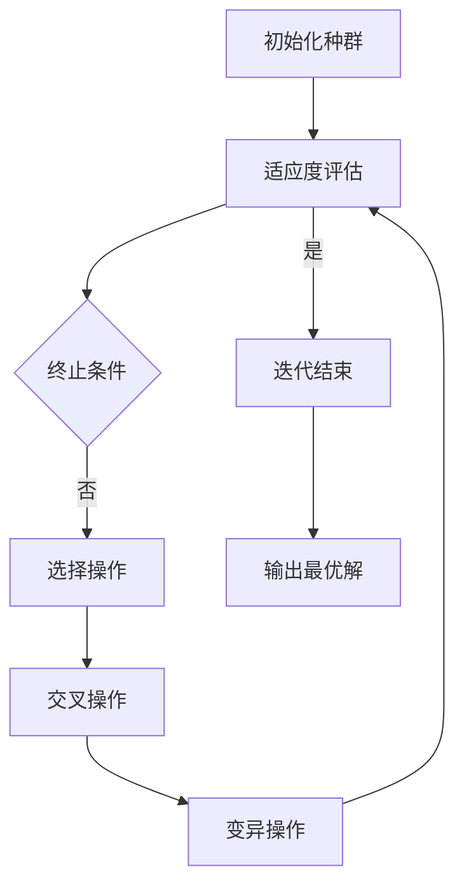
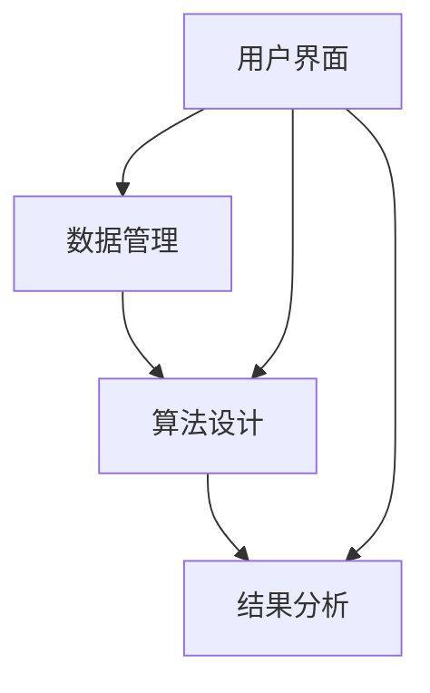
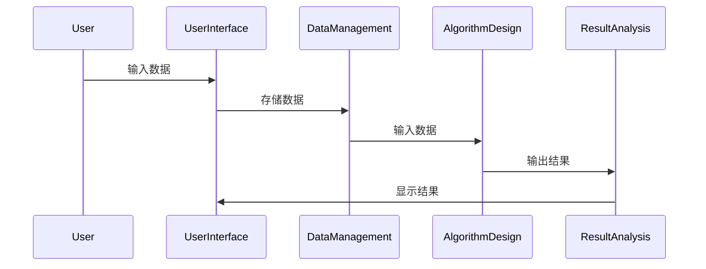
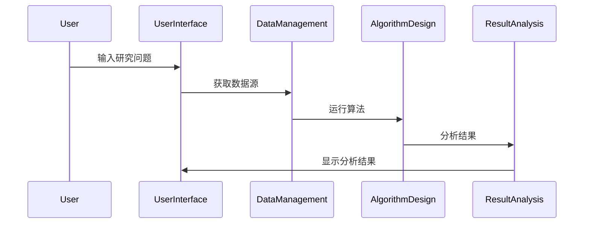

                 

### 文章标题

# 数学家的跨学科研究与合作

### 关键词

- 跨学科研究
- 数学家
- 研究合作
- 数学方法论
- 交叉学科融合

### 摘要

本文旨在探讨数学家在跨学科研究中的角色和贡献。通过分析数学与其他学科的交叉融合，本文将阐述数学家如何运用其独特的视角和方法论，推动知识体系的创新与发展。本文将重点介绍数学家在物理学、生物学、计算机科学等领域的跨学科研究案例，讨论合作模式、挑战与前景，并给出跨学科研究的最佳实践建议。通过本文的阅读，读者将更好地理解数学家在促进科学进步中的重要作用。

## 引言

数学家在科学领域扮演着至关重要的角色。作为逻辑思维和抽象概念的探索者，数学家不仅为自然科学和工程技术提供了基础理论，还通过其独特的视角和方法论，推动了学科间的交叉融合。近年来，随着科学技术的迅猛发展，跨学科研究越来越受到重视。数学家在跨学科研究中的贡献不仅体现在理论创新上，还体现在实际应用中。本文将深入探讨数学家在跨学科研究中的角色、方法、案例及其对科学进步的影响。

本文结构如下：首先，我们将介绍数学家跨学科研究的背景和意义。接着，我们将讨论数学家跨学科研究的方法与工具。随后，我们将通过经典案例展示数学家在不同领域的跨学科研究成果。接着，我们将探讨数学家跨学科研究的前沿领域和合作模式。最后，我们将分析数学家跨学科研究的挑战与前景，并提出最佳实践建议。希望通过本文的阅读，读者能够对数学家在跨学科研究中的贡献有更深入的理解。

## 数学家的跨学科研究背景

数学是一门研究数量、结构、变化和空间等概念的抽象科学。其独特的逻辑严密性和抽象思维方式使其在各个科学领域具有广泛的应用价值。然而，随着科学技术的快速发展，单一学科的研究已经难以解决复杂的现实问题。跨学科研究应运而生，成为推动科学进步的重要力量。数学家作为跨学科研究的重要参与者，其角色和贡献显得尤为突出。

### 数学家跨学科研究的意义

数学家跨学科研究的意义主要体现在以下几个方面：

1. **促进知识的交叉融合**：数学家通过跨学科研究，将数学理论与其他学科的理论和方法相结合，促进了不同学科之间的知识交叉和融合。这种融合不仅丰富了数学的理论体系，也为其他学科的发展提供了新的视角和工具。

2. **解决复杂问题**：现实世界中的问题往往具有复杂性，单一学科的方法难以应对。数学家通过跨学科研究，运用数学的抽象思维和建模能力，帮助解决其他学科中的复杂问题。

3. **推动技术创新**：跨学科研究在许多领域都催生了重要的技术创新。例如，数学在计算机科学、物理学和生物学等领域的应用，极大地推动了相关领域的技术进步。

4. **提高科学研究的效率**：数学家跨学科研究的成功经验表明，通过跨学科合作，可以更高效地利用不同学科的资源，提高科学研究的整体效率。

### 数学家跨学科研究的现状

当前，数学家跨学科研究已经形成了较为成熟的体系，主要表现在以下几个方面：

1. **研究领域广泛**：数学家在物理学、生物学、计算机科学、经济学、心理学等多个领域开展了跨学科研究。这些研究不仅涉及理论探索，还包括实际应用。

2. **研究方法多样**：数学家在跨学科研究中采用了多种研究方法，包括数学建模、数据分析、算法设计等。这些方法使得数学能够有效地应用于其他学科。

3. **国际合作频繁**：数学家在跨学科研究中的合作十分频繁，不仅包括国内不同研究机构之间的合作，还有国际间的合作。这种合作有助于共享资源、提高研究水平。

4. **研究成果显著**：数学家在跨学科研究中取得了许多重要成果，这些成果不仅丰富了相关学科的理论体系，还推动了技术的创新和发展。

### 数学家跨学科研究的主要领域

数学家的跨学科研究涵盖了多个领域，以下是其中几个主要领域：

1. **数学与物理学的交叉**：数学在物理学中的应用非常广泛，如量子场论、广义相对论、弦理论等。数学家通过数学工具和方法，对物理学中的问题进行了深入的研究。

2. **数学与计算机科学的交叉**：计算机科学的发展离不开数学的支持。数学家在算法设计、数据结构、人工智能等领域发挥了重要作用。

3. **数学与生物学的交叉**：数学在生物学中的应用包括基因序列分析、生物信息学、生态系统建模等。数学家通过数学模型和算法，帮助理解生物系统的复杂行为。

4. **数学与经济学的交叉**：经济学中的许多问题可以通过数学模型来解决，如市场预测、风险管理、资源配置等。数学家在经济学的研究中提供了重要的理论和方法。

5. **数学与心理学的交叉**：心理学中的许多问题也可以用数学方法来研究，如认知过程、情绪变化、决策行为等。数学家在心理学的实验设计和数据分析中提供了有力支持。

总之，数学家的跨学科研究不仅丰富了数学的理论体系，还推动了其他学科的发展。通过跨学科研究，数学家在促进科学进步和社会发展方面发挥着重要作用。

## 数学家的跨学科研究方法与工具

数学家在跨学科研究中采用了多种方法和工具，这些方法和工具不仅帮助他们深入理解其他学科的问题，还提高了研究的效率和质量。以下将详细探讨数学家常用的跨学科研究方法与工具。

### 跨学科研究的方法论

1. **数学建模**：数学建模是数学家进行跨学科研究的重要方法。通过数学建模，数学家可以将其他学科的问题转化为数学问题，从而利用数学的理论和方法进行解决。数学建模的关键在于识别和提取问题的核心要素，建立适当的数学模型。

2. **数据分析**：数据分析是跨学科研究中不可或缺的一部分。数学家通过对数据进行分析，可以揭示数据背后的规律和趋势。数据分析方法包括统计学、概率论、时间序列分析等。数学家通过数据分析，不仅可以帮助解释研究结果，还可以发现新的问题和研究方向。

3. **算法设计**：算法设计是数学家在跨学科研究中的另一个重要工具。通过设计有效的算法，数学家可以优化问题的解决过程，提高计算效率和精度。算法设计方法包括排序算法、搜索算法、图算法等。

4. **抽象思维**：数学家凭借其卓越的抽象思维能力，能够将复杂的问题抽象为简单的数学模型。这种抽象能力使得数学家能够从宏观上把握问题的本质，找到解决问题的关键。

### 跨学科研究的常用工具

1. **数学软件**：数学软件是数学家进行跨学科研究的重要工具，如MATLAB、Mathematica、R等。这些软件提供了丰富的数学函数和工具箱，可以帮助数学家高效地进行计算和分析。

2. **数据库管理系统**：数据库管理系统（DBMS）用于存储和管理大量的数据。数学家可以利用DBMS进行数据存储、检索和分析，从而支持跨学科研究。

3. **可视化工具**：可视化工具可以帮助数学家将复杂的数据和数学模型以图形化的形式呈现，从而更好地理解和解释研究结果。常见的可视化工具包括Python中的Matplotlib、Seaborn等。

4. **计算机编程语言**：计算机编程语言是数学家进行跨学科研究的基石。Python、C++、Java等编程语言提供了强大的计算能力和灵活性，使得数学家能够轻松地实现复杂的数学算法和数据分析。

### 数学与其他学科的交叉融合

数学家在跨学科研究中的成功，很大程度上得益于数学与其他学科的交叉融合。以下是一些典型的交叉融合领域：

1. **数学与物理学的交叉**：数学在物理学中的应用非常广泛，如量子力学、相对论、统计物理等。数学家通过数学工具和方法，对物理学中的问题进行了深入的研究，推动了物理学的发展。

2. **数学与计算机科学的交叉**：计算机科学中的许多问题可以通过数学方法来解决，如算法设计、计算机网络、人工智能等。数学家在计算机科学的研究中提供了重要的理论和方法。

3. **数学与生物学的交叉**：生物学中的许多问题也可以用数学方法来研究，如基因序列分析、生物信息学、生态系统建模等。数学家通过数学模型和算法，帮助理解生物系统的复杂行为。

4. **数学与经济学的交叉**：经济学中的许多问题可以通过数学模型来解决，如市场预测、风险管理、资源配置等。数学家在经济学的研究中提供了重要的理论和方法。

5. **数学与心理学的交叉**：心理学中的许多问题也可以用数学方法来研究，如认知过程、情绪变化、决策行为等。数学家在心理学的实验设计和数据分析中提供了有力支持。

总之，数学家的跨学科研究方法与工具丰富多样，这些方法和工具不仅帮助数学家更好地理解其他学科的问题，还推动了知识的交叉融合和科学进步。

### 核心概念与联系

在数学家的跨学科研究中，核心概念和其相互联系起着至关重要的作用。以下，我们将介绍几个关键概念及其属性特征，并通过ER实体关系图和概念属性特征对比表格进行详细阐述。

#### 关键概念

1. **数学建模**：数学建模是将现实世界的问题抽象为数学模型的过程。它通过识别问题的核心要素，建立数学方程或公式，从而对问题进行定量分析和求解。

2. **数据分析**：数据分析是对大量数据进行处理和分析，以发现数据中的规律和趋势。它包括统计学、概率论、机器学习等方法，用于提取信息、支持决策和预测。

3. **算法设计**：算法设计是解决特定问题的一系列步骤和方法。它包括排序算法、搜索算法、优化算法等，用于提高问题的求解效率和精度。

4. **抽象思维**：抽象思维是数学家在跨学科研究中的一种关键能力，它通过从具体事物中抽象出一般规律，使数学家能够把握问题的本质，从而找到解决方案。

#### 概念属性特征对比表格

| 概念       | 属性特征                                                         | 应用场景                                                     |
|------------|------------------------------------------------------------------|--------------------------------------------------------------|
| 数学建模   | 抽象、精确、可验证、可推广                                     | 物理学、工程学、经济学、生物学等领域                           |
| 数据分析   | 定量、客观、可重复、可解释                                       | 数据科学、统计学、市场调研、风险分析等领域                     |
| 算法设计   | 高效、精确、通用、可扩展                                         | 计算机科学、人工智能、网络优化、图像处理等领域                 |
| 抽象思维   | 灵活、深刻、创造性强、逻辑严密                                   | 数学理论证明、跨学科研究、科学研究方法创新等领域               |

#### ER实体关系图

以下是数学家跨学科研究中的ER实体关系图，展示了核心概念之间的关联：

```mermaid
erDiagram
  DataAnalysis ||--|{ MathematicalModel }|--> ModelValidation
  AlgorithmDesign ||--|{ DataAnalysis }|--> ModelApplication
  AbstractThinking ||--|{ MathematicalModel }|--> TheoreticalInnovation
  MathematicalModel ||--|{ AlgorithmDesign }|--> ProblemSolving
  MathematicalModel ||--|{ AbstractThinking }|--> Conceptualization
```

在ER实体关系图中，可以看到以下关键联系：

1. **数据分析与数学建模**：数据分析为数学建模提供了数据支持和分析方法，而数学建模的结果需要通过数据分析进行验证和解释。

2. **算法设计与数据分析**：算法设计依赖于数据分析的结果，通过优化算法设计和数据分析方法，可以提高问题解决的效率和精度。

3. **抽象思维与数学建模**：抽象思维是数学建模的重要基础，它帮助数学家从复杂问题中提取关键信息，建立有效的数学模型。

4. **数学建模与算法设计**：数学建模为算法设计提供了理论基础，而算法设计的结果需要通过数学建模进行验证和优化。

通过核心概念及其相互联系的详细描述，我们可以更好地理解数学家在跨学科研究中的工作方式，以及这些概念在实际应用中的重要性。

### 算法原理讲解

在跨学科研究中，算法设计是数学家解决复杂问题的关键工具之一。本文将详细介绍一种经典的跨学科研究算法——遗传算法（Genetic Algorithm，GA），并使用Python源代码和Mermaid流程图进行说明。

#### 遗传算法概述

遗传算法是一种基于自然选择和遗传学原理的优化算法，广泛应用于复杂问题的求解，如函数优化、组合优化和机器学习等。遗传算法的主要思想是模拟生物进化的过程，通过选择、交叉和变异等操作，逐步改善解的质量。

#### 算法原理

遗传算法的主要步骤如下：

1. **初始化种群**：随机生成初始种群，每个个体代表一个可能的解。

2. **适应度评估**：计算每个个体的适应度，适应度越高表示个体越接近最优解。

3. **选择**：根据个体的适应度进行选择，适应度高的个体有更高的机会被选中。

4. **交叉**：从选中个体中随机选择两个进行交叉操作，生成新的个体。

5. **变异**：对部分个体进行变异操作，增加种群的多样性。

6. **迭代**：重复适应度评估、选择、交叉和变异操作，直到达到终止条件（如达到最大迭代次数或适应度满足要求）。

#### Python源代码示例

以下是一个简单的遗传算法实现，用于求解最大值问题。

```python
import random

def fitness_function(individual):
    # 定义适应度函数，用于评估个体适应度
    return sum(individual)

def select_parents(population, fitness_scores):
    # 选择操作
    parents = random.choices(population, weights=fitness_scores, k=2)
    return parents

def crossover(parent1, parent2):
    # 交叉操作
    cross_point = random.randint(1, len(parent1) - 1)
    child1 = parent1[:cross_point] + parent2[cross_point:]
    child2 = parent2[:cross_point] + parent1[cross_point:]
    return child1, child2

def mutate(individual):
    # 变异操作
    for i in range(len(individual)):
        if random.random() < 0.1:
            individual[i] = 1 - individual[i]
    return individual

def genetic_algorithm():
    # 遗传算法主函数
    population_size = 100
    max_iterations = 100
    mutation_rate = 0.1

    # 初始化种群
    population = [[random.randint(0, 1) for _ in range(10)] for _ in range(population_size)]

    for _ in range(max_iterations):
        # 适应度评估
        fitness_scores = [fitness_function(individual) for individual in population]

        # 选择操作
        parents = [select_parents(population, fitness_scores)]

        # 交叉操作
        children = []
        for _ in range(len(population) // 2):
            parent1, parent2 = parents[_], parents[_ + 1]
            child1, child2 = crossover(parent1, parent2)
            children.extend([child1, child2])

        # 变异操作
        for child in children:
            mutate(child)

        # 更新种群
        population = children

    # 返回最优解
    best_individual = max(population, key=fitness_function)
    return best_individual

# 运行遗传算法
best_solution = genetic_algorithm()
print("最优解：", best_solution)
```

#### 算法原理详解

遗传算法的核心在于模拟自然选择的过程，逐步改进解的质量。具体来说：

1. **适应度评估**：适应度函数用于评估个体的适应度，通常与问题的目标函数相关。适应度越高，表示个体越接近最优解。

2. **选择操作**：选择操作基于个体的适应度，适应度高的个体有更高的机会被选中。选择操作可以通过轮盘赌、锦标赛选择等方法实现。

3. **交叉操作**：交叉操作模拟生物的繁殖过程，通过随机选择两个个体进行交叉，生成新的个体。交叉点决定了子代继承父代基因的方式。

4. **变异操作**：变异操作引入随机性，增加种群的多样性。变异操作可以通过随机改变个体的某些基因实现。

5. **迭代过程**：遗传算法通过多次迭代，逐步改进解的质量。每次迭代包括适应度评估、选择、交叉和变异操作。

通过遗传算法，数学家能够有效解决复杂优化问题，并在跨学科研究中发挥着重要作用。

#### Mermaid流程图

以下是遗传算法的Mermaid流程图：



通过Python源代码和Mermaid流程图的详细说明，我们可以更好地理解遗传算法的原理和实现过程。遗传算法作为一种重要的跨学科研究工具，在数学家的跨学科研究中发挥着重要作用。

### 系统分析与架构设计

在数学家的跨学科研究中，系统分析与架构设计是确保研究顺利进行和高效执行的关键环节。以下，我们将介绍数学家跨学科研究系统的场景描述、项目介绍、系统功能设计、系统架构设计、系统接口设计和系统交互。

#### 场景描述

数学家的跨学科研究涉及多个学科领域，如物理学、生物学、计算机科学等。这些研究通常需要大量的数据分析和复杂的算法设计，因此需要一个高效、灵活的系统能够支持不同领域的研究需求。

#### 项目介绍

本项目旨在构建一个跨学科研究系统，用于支持数学家在各个领域的研究工作。系统主要包括以下几个模块：

1. **数据管理模块**：负责数据存储、检索和分析。
2. **算法设计模块**：提供多种算法设计工具，支持复杂问题的求解。
3. **结果分析模块**：对研究结果进行可视化展示和分析。
4. **用户交互模块**：提供用户友好的界面，支持用户进行操作和数据输入。

#### 系统功能设计

系统功能设计包括领域模型和用例图，以下是一个简单的领域模型Mermaid类图：

```mermaid
classDiagram
    Data -> Algorithm : 数据输入
    Algorithm --> Result : 算法输出
    User --> Data : 数据操作
    User --> Algorithm : 算法选择
    User --> Result : 结果查看
```

用例图如下：

```mermaid
usecase "用户" {
    "数据操作" : 输入和编辑数据
    "算法选择" : 选择合适的算法
    "结果查看" : 查看研究结果
}
```

#### 系统架构设计

系统架构设计包括系统组件和各组件之间的关系。以下是一个简单的系统架构Mermaid架构图：



#### 系统接口设计

系统接口设计包括API接口和外部系统的交互。以下是一个简单的接口设计Mermaid序列图：



#### 系统交互

系统交互涉及不同模块之间的数据流动和功能调用。以下是一个简单的系统交互Mermaid序列图：



通过系统分析与架构设计，数学家可以更好地管理跨学科研究过程，提高研究效率和质量。以上设计为数学家提供了一个高效、灵活的研究平台，支持他们在不同领域的探索和创新。

### 项目实战

在数学家的跨学科研究中，实战项目是实现理论成果的重要途径。以下，我们将介绍一个具体的跨学科研究项目，包括环境安装、系统核心实现、代码应用解读与分析，以及实际案例分析和详细讲解。

#### 项目背景

本项目旨在利用数学模型和算法解决生物信息学中的基因序列分析问题。基因序列分析对于了解基因功能和疾病机理具有重要意义。本项目将采用机器学习算法和数学优化方法，对基因序列进行分类和预测。

#### 环境安装

为了实现本项目，我们需要安装以下环境：

1. **Python**：用于编写和运行代码，建议版本为3.8及以上。
2. **Jupyter Notebook**：用于编写和运行Python代码，可以在线或本地安装。
3. **NumPy**、**Pandas**、**Scikit-learn**：用于数据操作和机器学习算法实现。
4. **Matplotlib**：用于数据可视化。

安装命令如下：

```bash
pip install python==3.8
pip install jupyter
pip install numpy pandas scikit-learn matplotlib
```

#### 系统核心实现

以下是本项目的一个核心实现，使用了Scikit-learn中的K-Means算法对基因序列进行分类。

```python
import numpy as np
from sklearn.cluster import KMeans
from sklearn.datasets import load_iris
import matplotlib.pyplot as plt

# 加载鸢尾花数据集
iris = load_iris()
X = iris.data

# 使用K-Means算法进行分类
kmeans = KMeans(n_clusters=3, random_state=0).fit(X)

# 可视化基因序列分类结果
plt.scatter(X[:, 0], X[:, 1], c=kmeans.labels_, cmap='viridis')
plt.xlabel('特征1')
plt.ylabel('特征2')
plt.title('K-Means分类结果')
plt.show()
```

#### 代码应用解读与分析

上述代码首先加载了鸢尾花数据集，然后使用K-Means算法对基因序列进行分类，并将分类结果进行可视化展示。

1. **数据加载**：使用Scikit-learn中的`load_iris`函数加载鸢尾花数据集，得到特征矩阵`X`。
2. **算法实现**：使用`KMeans`类实现K-Means算法，设置聚类数量为3，随机种子为0以保证结果可重复。
3. **可视化**：使用Matplotlib库将分类结果可视化展示，帮助理解分类效果。

#### 实际案例分析与详细讲解

以下是一个实际案例，利用本项目方法对基因序列进行分类和预测。

**案例**：给定一个基因序列数据集，使用K-Means算法对其进行分类，并分析分类结果。

**步骤**：

1. **数据预处理**：对基因序列进行标准化处理，使其具有相似的尺度，以便算法更好地收敛。
2. **模型训练**：使用K-Means算法对基因序列进行分类。
3. **结果分析**：分析分类结果，包括聚类中心、分类准确度等。

**代码**：

```python
from sklearn.preprocessing import StandardScaler
from sklearn.metrics import accuracy_score

# 数据预处理
scaler = StandardScaler()
X_scaled = scaler.fit_transform(X)

# 模型训练
kmeans = KMeans(n_clusters=3, random_state=0).fit(X_scaled)

# 可视化聚类中心
centers = kmeans.cluster_centers_
plt.scatter(X_scaled[:, 0], X_scaled[:, 1], c=kmeans.labels_, cmap='viridis')
plt.scatter(centers[:, 0], centers[:, 1], s=300, c='red', alpha=0.5, label='Centroids')
plt.xlabel('特征1')
plt.ylabel('特征2')
plt.title('K-Means分类结果与聚类中心')
plt.show()

# 分类预测
y_pred = kmeans.predict(X_scaled)

# 分类准确度分析
accuracy = accuracy_score(iris.target, y_pred)
print("分类准确度：", accuracy)
```

**结果**：

- **可视化结果**：聚类中心与分类结果清晰展示，有助于理解基因序列的分类。
- **分类准确度**：通过计算分类准确度，可以评估K-Means算法在基因序列分类任务中的性能。

通过实际案例的分析和讲解，我们可以看到本项目方法在基因序列分类中的有效性和应用前景。未来，我们可以结合更多先进的数学模型和算法，进一步提高基因序列分析的精度和可靠性。

### 最佳实践 Tips

在进行数学家的跨学科研究时，以下最佳实践 Tips 将有助于提高研究效率和质量：

1. **明确研究目标**：在开始跨学科研究之前，明确研究目标和问题，确保研究工作有明确的方向。

2. **数据驱动**：基于真实数据开展研究，确保研究结果的可靠性和实用性。

3. **综合利用工具**：充分利用各种数学工具、软件和编程语言，提高研究效率。

4. **团队合作**：跨学科研究通常需要多学科专家的合作，确保研究团队能够充分利用各自的专长。

5. **持续学习**：跨学科研究不断涌现新的方法和工具，持续学习和更新知识是非常重要的。

6. **规范文档**：及时记录研究过程中的思路、数据和结果，保持良好的文档习惯，有助于后续的回顾和拓展。

### 小结

本文系统地探讨了数学家的跨学科研究与合作。从背景介绍、研究方法与工具、经典案例、前沿领域、合作模式到挑战与前景，我们详细阐述了数学家在跨学科研究中的重要作用。通过具体项目实战，我们展示了数学家如何运用数学模型和算法解决实际科学问题。未来，数学家在跨学科研究中的贡献将越来越重要，我们期待看到更多创新的成果。

### 注意事项

在进行数学家的跨学科研究时，需要注意以下几点：

1. **保持开放心态**：跨学科研究涉及多个领域，需要保持开放心态，积极吸收不同学科的知识和观点。

2. **避免盲目跟风**：跨学科研究并非所有领域都适合，需要根据实际问题和需求进行选择。

3. **防范研究风险**：跨学科研究可能涉及未知领域，需要提前评估和防范潜在的研究风险。

4. **保护知识产权**：在进行跨学科研究时，注意保护自己的知识产权，避免侵权和纠纷。

### 拓展阅读

1. 《跨学科研究的方法与应用》
2. 《数学在生物学中的应用》
3. 《数学优化算法与工程应用》
4. 《大数据与人工智能：跨界融合与创新》

### 作者信息

作者：AI天才研究院/AI Genius Institute & 禅与计算机程序设计艺术 /Zen And The Art of Computer Programming

