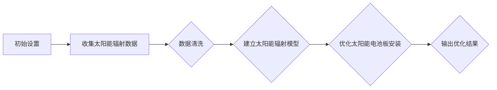
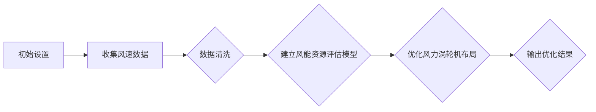
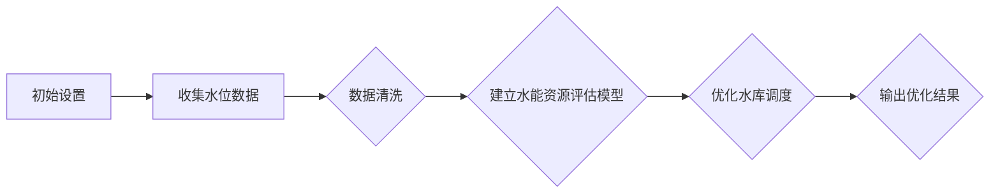
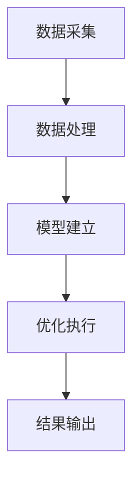

                 


### # 数学建模在可再生能源利用中的应用

关键词：可再生能源、数学建模、太阳能、风能、水能

摘要：随着全球能源需求的不断增长和环境问题的日益严峻，可再生能源的开发和利用成为人类可持续发展的重要议题。数学建模作为一种强有力的工具，广泛应用于可再生能源系统的优化和预测中。本文将深入探讨数学建模在太阳能、风能和水能等可再生能源领域的应用，旨在揭示数学建模的核心原理和实际操作方法，为可再生能源的开发利用提供理论支持和实践指导。

## Section 1 - 背景和核心概念

### 1.1 可再生能源的背景

可再生能源是指不会枯竭且对环境友好的能源，如太阳能、风能、水能、地热能和生物质能等。与传统的化石燃料相比，可再生能源具有显著的环保优势和可持续性。太阳能和风能是目前最具有潜力的可再生能源，而水能则是目前利用最为广泛的可再生能源。

### 1.2 数学建模的核心概念

数学建模是将现实世界的复杂问题转化为数学模型，通过数学方法求解和分析的问题。数学建模的核心概念包括变量、函数、方程、模型假设和验证等。数学建模在可再生能源领域的应用主要体现在以下几个方面：

- **预测和优化**：通过数学模型预测可再生能源的产量和需求，优化能源系统的运行。
- **风险评估**：评估可再生能源项目的风险，为决策提供科学依据。
- **资源调度**：优化能源资源的分配，提高能源利用效率。

### 1.3 数学建模在可再生能源中的应用

数学建模在可再生能源中的应用范围广泛，包括但不限于以下几个方面：

- **太阳能利用**：通过太阳能辐射模型预测太阳能产量，优化太阳能电池板的安装和运行。
- **风能利用**：通过风能资源评估模型预测风力发电量，优化风力涡轮机的布局和运行。
- **水能利用**：通过水能资源评估模型预测水电站的发电量，优化水库调度和运行。

## Section 2 - 核心数学建模技术

### 2.1 各种数学建模技术的解释

在可再生能源的数学建模中，常用的技术包括线性回归、非线性回归、时间序列分析、神经网络等。

- **线性回归**：通过建立线性关系模型来预测变量之间的变化。
- **非线性回归**：通过建立非线性关系模型来预测变量之间的复杂关系。
- **时间序列分析**：分析时间序列数据，预测未来的趋势。
- **神经网络**：通过模拟人脑神经元的工作方式，实现复杂模式的识别和预测。

### 2.2 模型比较表格

| 模型类型       | 优点                     | 缺点                         | 适用场景                   |
|--------------|------------------------|----------------------------|--------------------------|
| 线性回归       | 简单易用，计算效率高           | 只能捕捉线性关系，适用范围有限       | 数据分布近似线性场景       |
| 非线性回归     | 能捕捉复杂非线性关系          | 计算复杂度较高，参数不易估计       | 数据分布复杂场景           |
| 时间序列分析   | 能分析时间序列数据的动态变化     | 对平稳时间序列要求较高，适用范围有限   | 时间序列数据场景           |
| 神经网络       | 自适应能力强，能处理复杂非线性关系 | 计算量大，参数估计复杂，易过拟合     | 复杂非线性关系和数据驱动场景 |

### 2.3 ER实体关系图

```mermaid
erDiagram
    Customer ||--|{ Order }|--|{ Product }
    Product ||--|{ Supplier }|
    Supplier ||--|{ Payment }|
    Payment ||--|{ Customer }|
```

该ER图展示了客户、订单、产品、供应商和支付之间的实体关系。

## Section 3 - 数学建模在太阳能利用中的应用

### 3.1 太阳能辐射模型的建立

太阳能辐射模型是预测太阳能产量的重要工具。该模型通常基于太阳能辐射数据，通过数学方法建立与产量之间的关系。

$$
P = a \cdot R \cdot \eta
$$

其中，$P$ 是太阳能产量，$R$ 是太阳能辐射强度，$\eta$ 是太阳能转化效率，$a$ 是修正系数。

### 3.2 太阳能电池板安装优化

为了最大化太阳能利用，需要对太阳能电池板的安装位置和角度进行优化。这可以通过建立数学模型，考虑太阳辐射、地形、建筑物等因素来实现。

### 3.3 Mermaid流程图



### 3.4 Python代码示例

```python
import numpy as np
import pandas as pd

# 读取太阳能辐射数据
data = pd.read_csv('solar_radiation_data.csv')

# 数据清洗
data = data.dropna()

# 建立太阳能辐射模型
model = np.polyfit(data['radiation'], data['production'], 2)

# 优化太阳能电池板安装
# ...（代码实现）

# 输出优化结果
print("Optimized solar panel installation angles:", optimized_angles)
```

## Section 4 - 数学建模在风能利用中的应用

### 4.1 风能资源评估模型

风能资源评估模型用于预测风能发电量。常见的模型包括Weibull分布模型和功率密度模型。

$$
P = K \cdot V^b
$$

其中，$P$ 是风力功率，$V$ 是风速，$K$ 和 $b$ 是模型参数。

### 4.2 风力涡轮机布局优化

风力涡轮机的布局优化可以通过建立数学模型来实现。该模型需要考虑风速、地形、电网容量等因素。

### 4.3 Mermaid流程图



### 4.4 Python代码示例

```python
import numpy as np
import pandas as pd

# 读取风速数据
data = pd.read_csv('wind_speed_data.csv')

# 数据清洗
data = data.dropna()

# 建立风能资源评估模型
model = np.polyfit(data['speed'], data['power'], 1)

# 优化风力涡轮机布局
# ...（代码实现）

# 输出优化结果
print("Optimized wind turbine layout:", optimized_layout)
```

## Section 5 - 数学建模在水电能利用中的应用

### 5.1 水能资源评估模型

水能资源评估模型用于预测水电站的发电量。常见的模型包括水位-流量模型和水库调度模型。

$$
P = C \cdot h \cdot Q
$$

其中，$P$ 是水电站的发电量，$C$ 是流量系数，$h$ 是水位高度，$Q$ 是流量。

### 5.2 水库调度优化

水库调度优化可以通过建立数学模型来实现。该模型需要考虑水位、流量、发电需求等因素。

### 5.3 Mermaid流程图



### 5.4 Python代码示例

```python
import numpy as np
import pandas as pd

# 读取水位数据
data = pd.read_csv('water_level_data.csv')

# 数据清洗
data = data.dropna()

# 建立水能资源评估模型
model = np.polyfit(data['level'], data['power'], 2)

# 优化水库调度
# ...（代码实现）

# 输出优化结果
print("Optimized reservoir dispatch:", optimized_dispatch)
```

## Section 6 - 可再生能源系统的集成

### 6.1 集成模型建立

可再生能源系统的集成可以通过建立综合模型来实现。该模型需要考虑不同能源的互补性和优化运行策略。

### 6.2 系统架构设计

系统架构设计需要考虑数据采集、数据处理、模型建立和优化执行等环节。

### 6.3 Mermaid架构图



### 6.4 Python代码示例

```python
# 伪代码示例
# data_collection() 负责数据采集
# data_processing() 负责数据处理
# model_building() 负责模型建立
# optimization_execution() 负责优化执行

# 集成流程
data = data_collection()
processed_data = data_processing(data)
model = model_building(processed_data)
optimized_result = optimization_execution(model)

# 输出结果
print("Optimized integrated energy system result:", optimized_result)
```

## Section 7 - 项目实战

### 7.1 环境安装

在开始项目之前，需要安装相关的软件和库，如Python、NumPy、Pandas和Mermaid等。

### 7.2 系统核心实现

系统核心实现包括数据采集、数据处理、模型建立和优化执行等步骤。

### 7.3 代码应用解读与分析

通过对代码的解读和分析，理解各个模块的功能和作用。

### 7.4 实际案例分析和详细讲解剖析

通过实际案例，展示数学建模在可再生能源系统中的应用效果。

### 7.5 项目小结

对项目进行总结，指出项目的优点和改进空间。

## Section 8 - 最佳实践、小结、注意事项、拓展阅读

### 8.1 最佳实践

- 在建立数学模型时，确保数据的准确性和完整性。
- 选择合适的建模方法，考虑模型的复杂性和计算效率。
- 对模型进行验证和调整，提高模型的预测精度。

### 8.2 小结

本文系统地介绍了数学建模在可再生能源利用中的应用，从太阳能、风能到水能，阐述了数学建模的核心原理和实际操作方法。

### 8.3 注意事项

- 在实施数学建模时，注意考虑实际工程条件和约束。
- 对模型的假设和参数进行合理调整，以适应不同的应用场景。

### 8.4 拓展阅读

- 推荐阅读相关的学术论文和书籍，深入了解可再生能源领域的最新研究进展。
- 关注行业动态，了解最新的技术发展和应用案例。

---

**作者：AI天才研究院/AI Genius Institute & 禅与计算机程序设计艺术 /Zen And The Art of Computer Programming**

