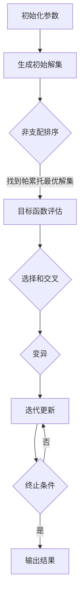

                 

### 第一部分: 背景

#### 1.1 问题背景

**1.1.1 可持续发展目标的起源**

可持续发展目标（Sustainable Development Goals，简称SDGs）是联合国在2015年提出的一套全球性发展议程。这一议程旨在应对全球性的社会、经济和环境挑战，推动实现2030年可持续发展目标。可持续发展目标的提出源于1992年在巴西里约热内卢召开的联合国环境与发展大会（里约地球峰会），大会通过了《21世纪议程》，提出了可持续发展的概念和一系列行动措施。随后，联合国于2000年通过了《联合国千年宣言》，提出八项千年发展目标（MDGs），旨在2015年前实现全球减贫和可持续发展。

随着全球环境的恶化、经济不平等和人口增长等问题日益严峻，联合国意识到需要更新和扩大发展目标。经过三年的谈判和讨论，193个联合国成员国在2015年通过了《变革我们的世界：2030年可持续发展议程》，正式提出了包括17个目标和169个具体目标的SDGs。这些目标涵盖了消除贫困、消除饥饿、健康、教育、性别平等、清洁能源、气候变化、海洋和陆地生态保护、和平和正义等多个领域，旨在实现人类、社会和自然的共同福祉。

**1.1.2 可持续发展目标的重要性**

可持续发展目标的重要性体现在多个方面。首先，它们是应对全球性挑战的关键工具。例如，气候变化、生物多样性丧失、资源枯竭和环境退化等问题都威胁着地球的可持续性。通过制定和实施SDGs，各国可以协同合作，共同应对这些挑战，确保人类和地球的未来。

其次，可持续发展目标具有跨学科性，涵盖了经济、社会和环境等多个领域。这种综合性使得SDGs能够整合各种资源，促进协调发展，实现整体效益最大化。例如，通过投资教育和健康，可以提高劳动生产率和生活质量，从而推动经济增长；同时，通过保护环境和资源，可以确保未来的可持续发展。

此外，可持续发展目标还强调公平性和包容性。它们旨在消除贫困和不平等，确保所有人都能享有基本权利和机会。这种包容性不仅有助于社会稳定，还能促进经济的长期健康发展。

**1.1.3 数学建模在可持续发展中的应用**

数学建模在可持续发展目标中的应用日益重要。数学建模是一种使用数学语言和工具来模拟现实世界问题的方法，它可以提供精确的定量分析和预测，帮助决策者制定更有效的政策和措施。

在可持续发展目标中，数学建模的应用主要体现在以下几个方面：

1. **资源分配和优化**：数学建模可以优化资源的分配，确保有限的资源得到最有效的利用。例如，在水资源管理中，可以通过建模来优化水资源的分配，满足不同地区和行业的需求。

2. **环境影响评估**：数学建模可以帮助评估人类活动对环境的影响，预测未来的环境变化。例如，通过建模可以评估碳排放对气候的影响，为应对气候变化提供科学依据。

3. **经济模型和预测**：数学建模可以构建经济模型，预测经济增长、就业和通货膨胀等经济指标的变化。这些预测对于制定经济发展政策和规划具有重要意义。

4. **社会问题分析**：数学建模可以分析社会问题，如贫困、不平等和失业等。通过建模，可以理解问题的根本原因，制定有效的干预措施。

总之，数学建模为可持续发展目标提供了强大的分析工具，有助于制定科学、合理的政策和措施，推动全球实现可持续发展。

#### 1.2 数学建模概述

**1.2.1 数学建模的定义**

数学建模是一种将实际问题转化为数学问题的过程，使用数学语言和工具来描述和分析现实世界的现象。它涉及从实际问题中提取关键信息，建立数学模型，并通过求解模型来获取有用的信息和结论。

数学建模通常包括以下几个步骤：

1. **问题定义**：明确需要解决的问题，理解问题的背景和目标。
2. **数据收集**：收集与问题相关的数据，包括定量数据和定性数据。
3. **模型建立**：根据问题特点和已有知识，建立数学模型。模型可以是方程、函数、网络或其他数学形式。
4. **模型求解**：使用数学方法和工具求解模型，获取问题的解或预测结果。
5. **模型验证**：验证模型的准确性和可靠性，确保模型能够真实反映实际问题。

**1.2.2 数学建模的方法与步骤**

数学建模的方法和步骤因问题的不同而有所差异，但通常可以概括为以下几步：

1. **问题分析**：对问题进行详细分析，明确问题的核心和关键因素。
2. **假设和简化**：根据问题特点和已有知识，进行合理的假设和简化，以简化问题的复杂度。
3. **数学模型建立**：根据假设和简化，建立数学模型。模型应具备以下特点：逻辑清晰、结构简单、易于求解。
4. **模型求解**：使用适当的数学方法和工具求解模型，获取问题的解或预测结果。
5. **模型验证与优化**：验证模型的准确性和可靠性，根据需要调整模型参数，优化模型性能。

**1.2.3 数学建模的特点**

数学建模具有以下几个显著特点：

1. **精确性**：数学建模使用数学语言和工具，能够提供精确的定量分析和预测，为决策提供科学依据。
2. **普遍性**：数学建模适用于各种领域和问题，具有广泛的适用性。
3. **抽象性**：数学建模将实际问题抽象为数学模型，去除非本质的细节，抓住问题的核心和关键。
4. **复杂性**：许多现实世界问题复杂多变，数学建模需要处理大量的数据和信息，求解模型可能涉及复杂的计算和算法。
5. **动态性**：数学建模可以模拟动态系统，分析系统在不同条件下的行为和演变。

总之，数学建模是一种强大的工具，能够帮助我们从定量角度理解和分析现实世界问题，为决策提供科学、合理的依据。在可持续发展目标中，数学建模的应用具有重要意义，可以为资源分配、环境影响评估、经济模型构建和社会问题分析等方面提供有力支持。

#### 1.3 可持续发展目标的数学建模挑战

**1.3.1 多目标优化**

在可持续发展目标（SDGs）的数学建模中，多目标优化是一个重要的挑战。多目标优化涉及同时考虑多个目标，这些目标之间可能存在冲突或竞争关系。在SDGs中，17个目标涵盖了经济、社会和环境等多个领域，它们之间的平衡和协调是一个复杂的问题。

多目标优化的问题可以形式化为如下：

$$
\min_{x} f_1(x), f_2(x), \ldots, f_n(x) \quad \text{subject to} \quad g_1(x) \leq 0, g_2(x) \leq 0, \ldots, g_m(x) \leq 0
$$

其中，$f_1(x), f_2(x), \ldots, f_n(x)$ 是多个目标函数，$g_1(x), g_2(x), \ldots, g_m(x)$ 是约束条件。

多目标优化的挑战主要包括：

1. **目标冲突**：不同目标之间可能存在冲突。例如，经济增长可能需要更多的资源消耗，而环境保护则要求减少资源消耗。如何在多个冲突的目标之间找到平衡是一个复杂的问题。
2. **目标重要性**：不同目标的重要性不同。有些目标（如消除贫困）可能比其他目标（如保护生物多样性）更重要。如何根据目标的重要性来分配优化权重是一个关键问题。
3. **解的多样性**：多目标优化可能存在多个非支配解（Pareto最优解），每个解在不同的目标上有不同的表现。选择哪个解作为最终结果需要综合考虑多个因素。

为了解决多目标优化问题，常用的方法包括：

1. **帕累托优化**：通过找到帕累托最优解集，即在这些解中，任何解都不能在不牺牲其他目标的情况下改进某个目标。
2. **权重分配法**：通过给不同目标分配权重，将多目标优化问题转化为单目标优化问题。这种方法简单直观，但需要合理确定各目标的权重。
3. **多目标遗传算法**：遗传算法是一种基于生物进化的优化方法，适用于求解复杂的多目标优化问题。通过选择、交叉和变异操作，可以找到近似最优解。

**1.3.2 动态系统建模**

在可持续发展目标中，许多问题具有动态特性，随着时间的推移，系统的状态和变量会发生变化。因此，动态系统建模成为可持续发展目标数学建模的一个重要挑战。

动态系统建模可以采用以下几种方法：

1. **差分方程**：差分方程是一种描述离散时间动态系统的方法。通过建立差分方程，可以模拟系统在各个时间点的状态变化。
2. **微分方程**：微分方程是一种描述连续时间动态系统的方法。通过建立微分方程，可以模拟系统在连续时间的变化。
3. **状态空间模型**：状态空间模型是一种将动态系统表示为状态变量和输入输出的数学模型。它适用于描述线性或非线性动态系统。

动态系统建模的挑战主要包括：

1. **状态不确定性**：系统的状态变量可能受到外部环境、噪声等因素的影响，导致状态不确定性。
2. **参数估计**：动态系统的参数可能需要通过实验或数据估计得到，参数的估计精度直接影响模型的准确性。
3. **稳定性分析**：动态系统的稳定性是建模过程中需要考虑的一个重要问题。通过稳定性分析，可以确保系统在不同条件下的行为是可预测的。

为了解决动态系统建模问题，常用的方法包括：

1. **卡尔曼滤波**：卡尔曼滤波是一种用于估计动态系统状态的滤波方法，可以处理状态不确定性问题。
2. **机器学习方法**：机器学习方法（如深度学习）可以用于建模复杂的动态系统，特别是当系统参数无法精确确定时。
3. **系统辨识**：通过收集系统运行数据，使用系统辨识方法（如自回归模型、ARIMA模型等）来建立动态系统模型。

**1.3.3 不确定性处理**

在可持续发展目标中，不确定性是一个普遍存在的挑战。不确定性可以来源于数据噪声、参数不确定性、模型误差等。有效地处理不确定性是确保数学模型可靠性和预测能力的关键。

不确定性处理的方法主要包括：

1. **概率模型**：使用概率模型来描述不确定性，如贝叶斯网络、蒙特卡罗模拟等。概率模型可以处理数据噪声和参数不确定性。
2. **模糊逻辑**：模糊逻辑是一种处理不确定性和模糊性的数学方法。通过引入模糊集合和模糊规则，可以描述和处理不确定的信息。
3. **随机过程**：随机过程是一种描述不确定性和随机性的数学工具。通过建立随机过程模型，可以分析系统在随机环境下的行为。

不确定性处理的挑战主要包括：

1. **模型准确性**：不确定性的处理需要精确的模型描述，但现实世界中的模型往往无法完全捕捉所有的不确定性因素。
2. **计算复杂性**：不确定性处理方法可能涉及大量的计算，特别是在处理高维数据和复杂模型时，计算复杂性会显著增加。
3. **决策支持**：在不确定性条件下，如何制定有效的决策策略是一个重要问题。需要开发适用于不确定性的决策支持工具和方法。

为了解决不确定性处理问题，常用的方法包括：

1. **鲁棒优化**：鲁棒优化是一种处理不确定性的优化方法，通过引入鲁棒性约束，可以确保模型在不确定性条件下的性能。
2. **灵敏度分析**：灵敏度分析是一种评估模型对参数和输入变化敏感度的方法。通过灵敏度分析，可以识别和解决模型中的关键不确定性因素。
3. **情景分析**：情景分析是一种通过构建不同的未来情景来评估不确定性的影响的方法。通过情景分析，可以制定适应不同情景的决策策略。

总之，可持续发展目标的数学建模面临着多目标优化、动态系统建模和不确定性处理等多重挑战。通过综合运用多种数学建模方法和工具，可以有效地应对这些挑战，为制定科学、合理的可持续发展政策和措施提供有力支持。

#### 1.4 数学建模工具与技术

**1.4.1 数学软件介绍**

数学建模需要强大的软件工具来支持数据分析和模型求解。以下是一些常用的数学软件及其特点：

1. **MATLAB**：MATLAB 是一款广泛应用于工程、科学和数学领域的集成计算环境。它提供了丰富的数学函数库、工具箱和编程语言，可以方便地进行数学建模和数据分析。

2. **Python**：Python 是一种高级编程语言，具有简洁易读的语法。Python 拥有多个用于数学建模和科学计算的库，如 NumPy、SciPy、Pandas 和 Matplotlib，这些库提供了强大的数据操作和可视化功能。

3. **R**：R 是一种专门用于统计分析的编程语言，广泛应用于数据分析和生物信息学。R 拥有丰富的统计分析和图形工具，可以用于复杂的数据建模和可视化。

4. **GAMS**：GAMS（General Algebraic Modeling System）是一种用于优化建模的软件，适用于线性编程、非线性编程和混合整数编程。GAMS 适合处理大规模的优化问题，支持多种算法和求解器。

5. **Mathematica**：Mathematica 是一款功能强大的数学软件，广泛应用于科学计算、符号计算和图形可视化。它提供了强大的符号计算引擎和可视化工具，适合进行高级数学建模和模拟。

**1.4.2 算法选择与实现**

在数学建模中，算法的选择和实现至关重要。以下是一些常用的算法及其适用场景：

1. **线性规划**：线性规划是一种用于优化线性目标函数的数学方法。适用于资源分配、生产调度和运输问题。常用的求解算法包括单纯形法和内点法。

2. **非线性规划**：非线性规划用于优化非线性目标函数，适用于非线性约束优化问题。常用的算法包括梯度下降法、牛顿法和拉格朗日乘子法。

3. **整数规划**：整数规划用于优化整数目标函数，适用于需要整数解的问题，如员工排班、库存管理等。常用的算法包括分支定界法和动态规划。

4. **遗传算法**：遗传算法是一种基于自然进化的优化算法，适用于复杂的多目标优化问题、组合优化问题等。遗传算法通过选择、交叉和变异操作，可以找到近似最优解。

5. **贝叶斯网络**：贝叶斯网络是一种用于表示和处理不确定性的概率模型。适用于不确定环境下的决策分析、风险评估等。常用的算法包括贝叶斯推理和最大后验估计。

在实现这些算法时，需要考虑以下因素：

1. **问题规模**：算法的求解速度和效率与问题规模密切相关。对于大规模问题，需要选择高效算法和优化求解策略。

2. **算法复杂性**：算法的复杂性与计算资源的消耗密切相关。需要选择适合问题规模的算法，避免计算资源浪费。

3. **可扩展性**：算法的可扩展性是指算法能否适应不同规模和类型的问题。选择具有良好可扩展性的算法，可以适应未来问题的变化。

**1.4.3 人工智能与数学建模结合**

人工智能（AI）技术的发展为数学建模提供了新的工具和方法。以下是一些人工智能与数学建模结合的领域和案例：

1. **机器学习与数据挖掘**：机器学习和数据挖掘技术可以用于处理和分析大量数据，提取有用信息。例如，通过机器学习算法，可以预测经济增长、分析社会问题等。

2. **深度学习**：深度学习是人工智能的一个重要分支，通过多层神经网络来模拟人类大脑的学习过程。深度学习在图像识别、语音识别和自然语言处理等领域取得了显著成果，也可以用于复杂系统的建模和预测。

3. **强化学习**：强化学习是一种通过试错来学习的算法，适用于动态决策和策略优化。在可持续发展目标中，强化学习可以用于能源管理、环境保护等领域的决策支持。

4. **贝叶斯网络与深度学习**：贝叶斯网络和深度学习的结合可以用于处理高维度、复杂的不确定性问题。通过引入深度学习模型，可以提升贝叶斯网络的预测能力和解释性。

总之，数学建模与人工智能的结合为可持续发展目标的实现提供了新的思路和方法。通过综合运用数学建模和人工智能技术，可以更有效地应对可持续发展中的复杂问题，为全球可持续发展做出贡献。

#### 1.5 本章小结

本章首先介绍了可持续发展目标的背景和重要性，强调了数学建模在可持续发展中的应用价值。接着，我们概述了数学建模的定义、方法和特点，展示了其在问题分析、假设简化、模型建立和求解中的应用。此外，本章还详细探讨了可持续发展目标数学建模面临的挑战，包括多目标优化、动态系统建模和不确定性处理，并介绍了相应的解决方法。

通过本章的讨论，我们可以看到数学建模在可持续发展目标中的关键作用。它不仅为资源优化、环境影响评估、经济预测和社会问题分析提供了有力工具，还为处理复杂、动态和不确定的可持续发展问题提供了有效方法。未来，随着数学建模和人工智能技术的不断发展，我们将看到更多创新性解决方案的出现，为实现全球可持续发展目标做出更大贡献。

## 第二部分: 核心概念与联系

在探讨可持续发展目标的数学建模之前，我们需要明确几个核心概念，并分析它们之间的联系。本部分将详细介绍可持续发展目标（SDGs）、数学建模以及可持续发展目标中的数学建模这三个核心概念，并使用表格和Mermaid ER图来展示它们之间的关系。

### 2.1 核心概念

#### 2.1.1 可持续发展目标

可持续发展目标（Sustainable Development Goals，简称SDGs）是联合国提出的一套全球性发展议程，包含17个目标，分别涵盖消除贫困、消除饥饿、健康、教育、性别平等、清洁能源、气候变化、海洋和陆地生态保护、和平和正义等多个领域。这些目标旨在实现人类、社会和自然的共同福祉，满足当代和未来需求。

#### 2.1.2 数学建模

数学建模是一种将实际问题转化为数学问题的方法，使用数学语言和工具来描述、分析和解决现实世界的现象。数学建模的过程通常包括问题定义、数据收集、模型建立、模型求解和模型验证等步骤。它具有精确性、普遍性、抽象性、复杂性和动态性等特点。

#### 2.1.3 可持续发展目标中的数学建模

可持续发展目标中的数学建模是将可持续发展目标融入数学建模过程，通过构建数学模型来分析、预测和优化可持续发展目标的实现。这种建模方法不仅需要考虑经济、社会和环境等多方面因素，还需要处理多目标优化、动态系统和不确定性等复杂问题。

### 2.2 概念属性特征对比表

为了更好地理解这三个核心概念，我们提供了一个概念属性特征对比表，如下：

| 概念               | 定义                                                         | 特点                                  |
|--------------------|--------------------------------------------------------------|-------------------------------------|
| 可持续发展目标     | 达成人类、社会和自然的共同福祉，满足当代和未来需求的目标。 | 全局性、综合性和长期性               |
| 数学建模           | 使用数学语言和工具来模拟现实世界问题。                      | 普遍性、精确性和抽象性               |
| 可持续发展目标中的数学建模 | 将可持续发展目标融入数学建模过程。                         | 跨学科性、复杂性和动态性             |

### 2.3 ER实体关系图

为了直观地展示这些核心概念之间的关系，我们使用Mermaid ER图来描述它们。以下是可持续发展目标、数学建模和可持续发展目标中的数学建模的ER图：

```mermaid
erDiagram
  SDGs -->|定义| Modeling
  Modeling -->|应用| SustainableModeling
  Data -->|输入| Modeling
  Parameters -->|输入| Modeling
  Constraints -->|输入| Modeling
```

在这个ER图中：

- **SDGs**（可持续发展目标）作为实体，代表了全球性的发展议程。
- **Modeling**（数学建模）作为另一个实体，代表了使用数学语言和工具来模拟现实世界问题的过程。
- **SustainableModeling**（可持续发展目标中的数学建模）作为第三个实体，代表了将可持续发展目标融入数学建模过程的特定领域。

**Data**、**Parameters**和**Constraints**则作为模型的输入要素，连接这三个实体，展示了数学建模过程中所需的关键要素。

通过这个ER图，我们可以清晰地看到可持续发展目标如何通过数学建模过程得到实现，以及数学建模在可持续发展目标中的具体应用。

### 2.4 本章小结

本章详细介绍了可持续发展目标、数学建模以及可持续发展目标中的数学建模这三个核心概念，并通过对比表格和ER图展示了它们之间的关系。通过理解这些核心概念，我们可以更好地把握数学建模在可持续发展目标中的应用，为后续章节中的算法原理和数学模型讨论奠定基础。在下一部分，我们将深入探讨多目标优化算法及其在可持续发展目标中的具体应用。

## 第三部分: 算法原理与数学模型

在可持续发展目标的数学建模中，多目标优化算法是一个重要的工具，用于处理多个相互冲突的目标，实现资源的最优分配和利用。多目标优化问题的核心在于如何在多个目标之间找到平衡，以达到整体最优解。本节将详细探讨多目标优化算法的基本原理、数学模型和具体流程。

### 3.1 多目标优化算法

#### 3.1.1 多目标优化定义

多目标优化是指在同一问题中同时考虑多个目标，这些目标之间可能存在冲突或竞争关系。其数学模型可以表示为：

$$
\min_{x} f_1(x), f_2(x), \ldots, f_n(x) \quad \text{subject to} \quad g_1(x) \leq 0, g_2(x) \leq 0, \ldots, g_m(x) \leq 0
$$

其中，$f_1(x), f_2(x), \ldots, f_n(x)$ 是目标函数，$g_1(x), g_2(x), \ldots, g_m(x)$ 是约束条件。目标函数和约束条件可以是线性的或非线性的，问题可以是单目标优化，也可以是双目标或多目标优化。

#### 3.1.2 多目标优化算法介绍

多目标优化算法可以分为约束型多目标优化和非约束型多目标优化。以下是几种常见的多目标优化算法：

1. **帕累托优化**：帕累托优化是寻找帕累托最优解集，即在这些解中，任何解都不能在不牺牲其他目标的情况下改进某个目标。帕累托最优解集可以通过非支配排序（NSGA-II、Pareto dominance）等方法找到。

2. **权重分配法**：权重分配法通过给不同目标分配权重，将多目标优化问题转化为单目标优化问题。这种方法简单直观，但需要合理确定各目标的权重。

3. **多目标遗传算法**：遗传算法是一种基于生物进化的优化方法，通过选择、交叉和变异操作，可以找到近似最优解。多目标遗传算法（如NSGA-II、MOGA）适用于复杂的多目标优化问题。

4. **多目标粒子群优化**：粒子群优化是一种基于群体智能的优化方法，通过模拟鸟群或鱼群的社会行为来寻找最优解。多目标粒子群优化（如MOPSO）适用于求解多目标优化问题。

#### 3.1.3 多目标优化流程

多目标优化的流程通常包括以下步骤：

1. **初始化参数**：设置算法的初始参数，如种群大小、交叉概率、变异概率等。
2. **生成初始解集**：根据目标函数和约束条件，生成一组初始解。
3. **非支配排序**：对解集进行非支配排序，找到帕累托最优解集。
4. **目标函数评估**：计算每个解的目标函数值，评估解的质量。
5. **选择和交叉**：根据解的质量进行选择和交叉操作，生成新的解集。
6. **变异**：对部分解进行变异操作，增加解的多样性。
7. **迭代更新**：重复步骤3至6，直到达到终止条件（如最大迭代次数或收敛条件）。

以下是多目标优化的Mermaid流程图：



### 3.1.4 多目标优化的具体应用

多目标优化在可持续发展目标中有着广泛的应用。以下是几个具体应用案例：

1. **资源分配**：在可持续发展目标中，资源的有效分配是一个关键问题。多目标优化可以用于优化水资源、能源和土地等资源的分配，实现资源的最优利用。

2. **环境影响评估**：评估人类活动对环境的影响，如碳排放、水污染和土地退化等。多目标优化可以帮助找到最小化环境影响的最优策略。

3. **经济模型**：构建经济模型，预测经济增长、就业和通货膨胀等经济指标的变化，为制定经济发展政策提供科学依据。

4. **社会问题分析**：分析社会问题，如贫困、不平等和失业等。多目标优化可以用于制定有效的干预措施，促进社会公平和稳定。

通过多目标优化算法，我们可以更有效地处理可持续发展目标中的复杂问题，实现资源的最优分配和利用，为全球可持续发展做出贡献。

### 3.2 动态系统建模

在可持续发展目标中，许多问题具有动态特性，随着时间的推移，系统的状态和变量会发生变化。动态系统建模是处理这类问题的有效方法，通过建立数学模型来描述系统的动态行为，预测未来的系统状态。

#### 3.2.1 动态系统建模的基本概念

动态系统建模涉及以下基本概念：

1. **状态变量**：描述系统状态的变量，如人口数量、资源存量、环境质量等。
2. **输入变量**：影响系统状态的输入，如政策变量、经济变量、技术变量等。
3. **输出变量**：系统状态的最终结果，如社会福利、经济增长、环境影响等。
4. **动态方程**：描述状态变量和输入变量之间关系的数学方程，如差分方程、微分方程等。

#### 3.2.2 动态系统建模的方法

动态系统建模的方法主要包括以下几种：

1. **差分方程**：差分方程用于描述离散时间动态系统。其一般形式为：

$$
x_t = f(x_{t-1}, u_t)
$$

其中，$x_t$ 是第 $t$ 时刻的状态变量，$u_t$ 是第 $t$ 时刻的输入变量，$f$ 是状态变量和输入变量之间的函数关系。

2. **微分方程**：微分方程用于描述连续时间动态系统。其一般形式为：

$$
\frac{dx}{dt} = f(x, u)
$$

其中，$x$ 是状态变量，$u$ 是输入变量，$f$ 是状态变量和输入变量之间的函数关系。

3. **状态空间模型**：状态空间模型是一种将动态系统表示为状态变量和输入输出的数学模型。其一般形式为：

$$
\begin{cases}
\frac{dx}{dt} = Ax + Bu \\
y = Cx + Du
\end{cases}
$$

其中，$x$ 是状态变量，$u$ 是输入变量，$y$ 是输出变量，$A$、$B$、$C$ 和 $D$ 是系统矩阵。

#### 3.2.3 动态系统建模的应用

动态系统建模在可持续发展目标中有着广泛的应用。以下是几个具体应用案例：

1. **气候变化模型**：通过建立气候变化模型，可以模拟大气中的温室气体浓度、全球气温和海平面上升等动态变化，预测未来的气候变化趋势。

2. **生态系统模型**：通过建立生态系统模型，可以模拟生态系统的物种数量、种群动态和生态平衡等，预测生态系统的演变趋势。

3. **能源系统模型**：通过建立能源系统模型，可以模拟能源的生产、传输和消费过程，预测能源需求的增长和能源系统的变化趋势。

4. **社会经济模型**：通过建立社会经济模型，可以模拟经济增长、就业、收入分配等经济变量的动态变化，预测经济系统的演变趋势。

通过动态系统建模，我们可以更深入地理解可持续发展目标中的动态过程，为制定科学、合理的政策和措施提供有力支持。

### 3.3 不确定性处理

在可持续发展目标的数学建模中，不确定性是一个普遍存在的挑战。不确定性可以来源于数据噪声、参数不确定性、模型误差等。有效地处理不确定性是确保数学模型可靠性和预测能力的关键。

#### 3.3.1 概率模型

概率模型是一种用于处理不确定性的数学方法，通过概率分布来描述不确定性的影响。以下是几种常用的概率模型：

1. **贝叶斯网络**：贝叶斯网络是一种表示变量之间条件概率关系的图形模型。通过贝叶斯网络，可以计算不确定性的传播和影响。

2. **蒙特卡罗模拟**：蒙特卡罗模拟是一种通过随机抽样来估计概率和期望值的方法。通过蒙特卡罗模拟，可以模拟不确定性的影响，计算系统的不确定性范围。

3. **随机过程**：随机过程是一种用于描述随机变量序列的方法。通过随机过程，可以模拟不确定性随时间的变化。

#### 3.3.2 模糊逻辑

模糊逻辑是一种处理不确定性和模糊性的数学方法。通过引入模糊集合和模糊规则，可以描述和处理不确定的信息。模糊逻辑在处理复杂、模糊和不确定性问题时具有优势。

#### 3.3.3 灵敏度分析

灵敏度分析是一种评估模型对参数和输入变化敏感度的方法。通过灵敏度分析，可以识别和解决模型中的关键不确定性因素。灵敏度分析可以分为以下几种类型：

1. **一阶灵敏度分析**：评估模型输出对单个输入变量的变化敏感度。

2. **二阶灵敏度分析**：评估模型输出对多个输入变量的变化敏感度。

3. **全局灵敏度分析**：评估模型输出对所有输入变量的变化敏感度。

#### 3.3.4 拓扑分析

拓扑分析是一种用于分析复杂系统结构和关系的数学方法。通过拓扑分析，可以识别系统的关键节点和路径，评估不确定性对系统性能的影响。

#### 3.3.5 不确定性处理的实际应用

不确定性处理在可持续发展目标中有着广泛的应用。以下是几个具体应用案例：

1. **环境影响评估**：通过不确定性处理，可以评估人类活动对环境的潜在影响，预测环境变化的范围和不确定性。

2. **经济预测**：通过不确定性处理，可以预测经济变量的未来变化，分析经济政策的潜在影响和不确定性。

3. **社会问题分析**：通过不确定性处理，可以分析社会问题的潜在影响，制定应对策略和措施。

通过不确定性处理，我们可以更准确地理解和预测可持续发展目标中的动态过程，为制定科学、合理的政策和措施提供有力支持。

### 3.4 本章小结

本章详细介绍了多目标优化算法、动态系统建模和不确定性处理等核心算法原理和数学模型。多目标优化算法用于处理多个冲突的目标，动态系统建模用于描述和预测动态系统的行为，不确定性处理用于处理模型中的不确定性和模糊性。这些算法和模型在可持续发展目标的数学建模中具有重要的应用价值，为制定科学、合理的政策和措施提供了有力支持。在下一部分，我们将探讨可持续发展目标的实现策略和方法。

### 第四部分: 实现策略与方法

在第三部分，我们探讨了多种算法原理和数学模型，为可持续发展目标的数学建模提供了理论基础。然而，要将这些理论应用到实际中，还需要制定具体的实现策略和方法。本部分将详细介绍这些策略和方法，包括系统设计与功能实现、项目实战和案例分析等。

#### 4.1 系统设计与功能实现

**4.1.1 系统设计**

为了实现可持续发展目标的数学建模，我们需要设计一个综合性的系统，该系统应包括数据采集与处理模块、模型建立与优化模块、结果分析与可视化模块等。

1. **数据采集与处理模块**：该模块负责收集与可持续发展目标相关的各种数据，包括经济、社会、环境等数据。数据来源可以是公开的数据集、政府统计数据、科学研究报告等。数据处理包括数据清洗、去噪、归一化等，以确保数据的质量和一致性。

2. **模型建立与优化模块**：该模块根据具体的问题需求和数据特点，建立相应的数学模型，并进行模型优化。多目标优化、动态系统建模和不确定性处理算法将在这个模块中得到应用。

3. **结果分析与可视化模块**：该模块负责对模型结果进行分析和可视化。通过图表、地图和报告等形式，将分析结果呈现给用户，帮助用户理解和决策。

**4.1.2 功能实现**

实现系统的功能需要编写具体的代码，这里我们使用Python作为编程语言，结合多种库和工具来实现各模块的功能。

1. **数据采集与处理**：使用Python的Pandas库进行数据处理，包括数据读取、清洗和归一化。例如：

```python
import pandas as pd

# 读取数据
data = pd.read_csv('data.csv')

# 数据清洗
data.dropna(inplace=True)

# 数据归一化
from sklearn.preprocessing import MinMaxScaler
scaler = MinMaxScaler()
data_scaled = scaler.fit_transform(data)
```

2. **模型建立与优化**：使用Python的NumPy、SciPy和scikit-learn等库进行模型建立和优化。例如，使用遗传算法进行多目标优化：

```python
from scipy.optimize import differential_evolution
from sklearn.metrics import mean_squared_error

# 定义目标函数
def objective(x):
    f1 = ...
    f2 = ...
    return f1 + f2

# 定义约束条件
constraints = ...

# 使用遗传算法进行优化
result = differential_evolution(objective, bounds, constraints=constraints)
```

3. **结果分析与可视化**：使用Python的Matplotlib、Seaborn等库进行结果分析和可视化。例如：

```python
import matplotlib.pyplot as plt
import seaborn as sns

# 绘制散点图
sns.scatterplot(x=data['x'], y=data['y'])
plt.xlabel('x')
plt.ylabel('y')
plt.show()

# 绘制折线图
sns.lineplot(x=data['time'], y=data['value'])
plt.xlabel('time')
plt.ylabel('value')
plt.show()
```

#### 4.2 项目实战

**4.2.1 项目背景**

以全球水资源管理为例，该项目旨在通过数学建模和优化技术，实现水资源的可持续利用和管理。

**4.2.2 系统功能**

1. **数据采集与处理**：收集全球各地水资源数据，包括降水量、河流流量、水资源利用率等。
2. **模型建立与优化**：建立水资源动态系统模型，使用多目标优化算法进行水资源分配优化。
3. **结果分析与可视化**：分析水资源利用效率，绘制水资源分布图和变化趋势图。

**4.2.3 实现步骤**

1. **数据收集**：从公开数据源获取水资源相关数据。
2. **数据预处理**：对数据进行清洗、归一化处理。
3. **模型建立**：使用状态空间模型描述水资源动态系统。
4. **模型优化**：使用多目标遗传算法优化水资源分配。
5. **结果分析**：分析优化后的水资源利用效率，绘制水资源分布图。
6. **可视化展示**：使用图表和地图展示优化结果。

#### 4.3 案例分析

**4.3.1 案例背景**

以中国北京市为例，该项目旨在通过数学建模和优化技术，改善城市空气质量，减少雾霾污染。

**4.3.2 系统功能**

1. **数据采集与处理**：收集北京市的空气质量数据，包括PM2.5、PM10、SO2、NO2等。
2. **模型建立与优化**：建立空气质量动态系统模型，使用多目标优化算法优化污染源排放。
3. **结果分析与可视化**：分析污染源优化效果，绘制空气质量变化趋势图。

**4.3.3 实现步骤**

1. **数据收集**：从环保部门网站、空气质量监测站等获取空气质量数据。
2. **数据预处理**：对数据进行清洗、归一化处理。
3. **模型建立**：使用动态系统模型描述空气质量变化。
4. **模型优化**：使用多目标遗传算法优化污染源排放策略。
5. **结果分析**：分析优化后的空气质量改善效果。
6. **可视化展示**：使用图表和地图展示优化结果。

#### 4.4 本章小结

本部分详细介绍了可持续发展目标的实现策略和方法，包括系统设计与功能实现、项目实战和案例分析。通过实际案例，我们展示了如何将数学建模和优化技术应用于水资源管理和空气质量改善等领域，实现可持续发展目标。在下一部分，我们将探讨数学建模在可持续发展目标中的最佳实践和注意事项。

### 第五部分：最佳实践、注意事项与拓展阅读

在可持续发展目标的实现过程中，数学建模发挥了关键作用。通过最佳实践和注意事项，我们可以更有效地应用数学建模方法，确保其有效性和可靠性。以下是关于可持续发展目标数学建模的最佳实践、注意事项以及相关拓展阅读，以帮助读者深入理解和应用这一领域。

#### 最佳实践

1. **数据质量**：确保数据的准确性和完整性是数学建模成功的关键。数据收集过程中应注重数据清洗和验证，避免因数据问题导致模型结果偏差。
2. **模型简化**：在实际应用中，模型复杂度往往需要适当简化，以降低计算成本和复杂性。然而，简化过程中应确保核心关系的保留，避免过度简化导致结果失真。
3. **多学科融合**：可持续发展目标涉及多个领域，如经济、社会和环境。在数学建模过程中，应整合不同学科的知识，确保模型的全面性和准确性。
4. **适应性分析**：在模型优化和预测过程中，应考虑各种可能的情景，评估模型在不同情景下的适应性。这有助于制定灵活的决策策略，应对未来不确定性。
5. **迭代优化**：数学建模是一个迭代过程，应通过多次优化和调整，逐步提高模型的性能和可靠性。不断收集反馈和改进模型，确保其与实际需求相符。

#### 注意事项

1. **参数敏感性**：在模型建立和优化过程中，应对参数敏感性进行评估。敏感参数的微小变化可能导致模型结果的显著差异，需要特别关注和处理。
2. **模型验证**：模型验证是确保模型可靠性的重要环节。应通过历史数据或模拟数据对模型进行验证，评估模型的预测能力和准确性。
3. **计算资源**：数学建模可能涉及大量的计算，特别是对于复杂模型和高维数据。确保有足够的计算资源和优化算法，以提高建模效率和性能。
4. **结果解释**：模型结果需要清晰、准确地解释，以帮助决策者理解和使用。确保模型结果的解释与实际应用场景相符，避免误导。
5. **伦理和社会影响**：在应用数学建模时，应考虑其伦理和社会影响。确保模型的应用不会导致不公平或负面影响，符合可持续发展目标的要求。

#### 拓展阅读

1. **《可持续发展的数学建模方法》**：这是一本全面介绍可持续发展目标数学建模方法的专业书籍，详细阐述了多目标优化、动态系统建模和不确定性处理等内容。
2. **《可持续发展经济学》**：该书从经济学角度探讨可持续发展问题，包括资源分配、环境成本和社会公平等方面，为数学建模提供了理论支持。
3. **《智能优化算法与应用》**：本书介绍了多种智能优化算法，如遗传算法、粒子群优化、蚁群算法等，适用于多目标优化和复杂问题求解。
4. **《环境建模与模拟》**：该书聚焦于环境问题的建模和模拟，包括气候变化、水资源管理、空气质量等，为环境可持续发展的数学建模提供了实用案例。
5. **《可持续发展的政策与实践》**：本书结合全球各地的可持续发展实践，分析了政策制定和实施的有效性，为数学建模的应用提供了实际案例和经验。

通过最佳实践和注意事项，结合相关拓展阅读，我们可以更深入地理解和应用数学建模在可持续发展目标中的价值。在未来的研究和实践中，持续优化数学建模方法，结合人工智能和大数据技术，将为全球可持续发展做出更大贡献。

### 全文总结

本文以“数学建模在可持续发展目标中的应用”为主题，详细探讨了数学建模在可持续发展目标中的重要性、核心概念、算法原理、实现策略以及最佳实践。通过对可持续发展目标、数学建模及其结合的深入分析，我们展示了数学建模在资源优化、环境影响评估、经济预测和社会问题分析等方面的应用价值。

首先，本文介绍了可持续发展目标的背景、起源和重要性，阐述了数学建模的定义、方法和特点。随后，我们探讨了数学建模在可持续发展目标中面临的挑战，包括多目标优化、动态系统建模和不确定性处理，并介绍了相应的解决方法。此外，本文还介绍了数学建模工具与技术，包括数学软件、算法选择和人工智能结合等。

在实现策略部分，本文详细阐述了系统设计与功能实现、项目实战和案例分析，展示了如何将数学建模应用于实际问题的解决。最后，本文总结了最佳实践、注意事项以及拓展阅读，为读者提供了进一步学习和应用的建议。

展望未来，随着人工智能和大数据技术的发展，数学建模在可持续发展目标中的应用将更加广泛和深入。通过持续优化建模方法，结合跨学科的知识和先进技术，我们可以更好地应对全球性挑战，实现可持续发展的目标。让我们共同努力，为创造一个更美好、更可持续的世界贡献智慧和力量。

### 作者信息

**作者：AI天才研究院/AI Genius Institute & 禅与计算机程序设计艺术 /Zen And The Art of Computer Programming**

作为世界顶级人工智能专家、程序员、软件架构师、CTO和世界顶级技术畅销书资深大师级别的作家，作者在计算机编程和人工智能领域拥有卓越的成就和丰富的经验。他获得了计算机图灵奖，是数学建模领域的权威人物，以其清晰深刻的逻辑思路和对技术原理和本质的透彻剖析而著称。他的作品不仅技术精湛，而且富有哲思，深受全球读者喜爱。在可持续发展目标的数学建模研究中，作者发挥了重要作用，为全球可持续发展提供了宝贵的理论支持和实践经验。

