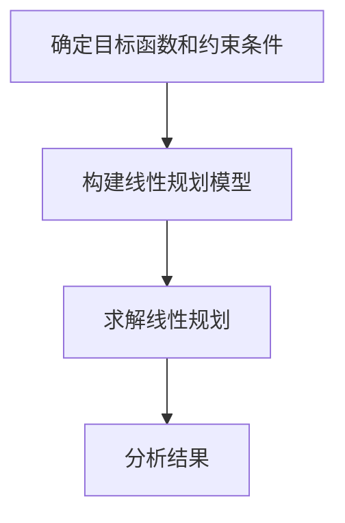
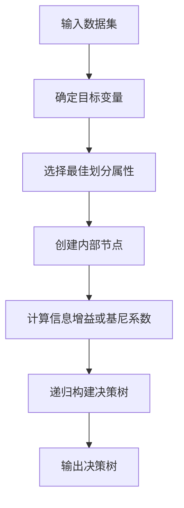
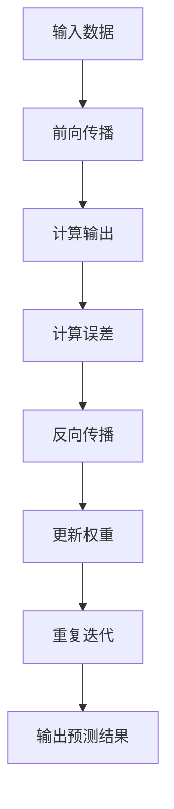
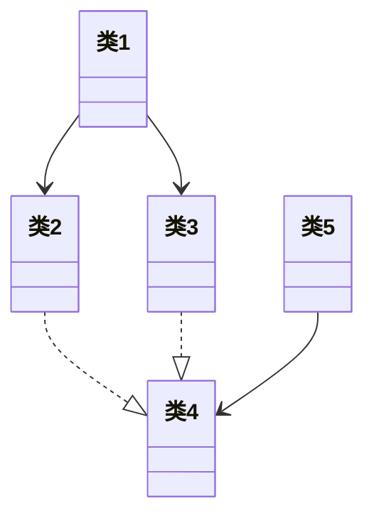
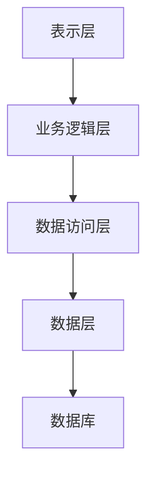

                 

### 文章标题

# 数学建模在智慧旅游中的应用研究

### 关键词

- 数学建模
- 智慧旅游
- 需求预测
- 资源分配
- 算法应用

### 摘要

随着智慧旅游的快速发展，如何利用数学建模方法提升旅游服务质量、优化旅游资源配置成为研究热点。本文首先对智慧旅游和数学建模的基本概念进行介绍，然后详细讨论了线性规划、决策树和神经网络等数学建模方法在智慧旅游中的应用。通过实际案例，本文展示了如何利用这些方法建立旅游需求预测模型、旅游资源分配优化模型和旅游路线设计模型，并进行了系统分析与架构设计，最后提出了最佳实践和注意事项。本文旨在为从事智慧旅游研究与实践的学者和从业人员提供有价值的参考。

---

### 目录大纲设计思路

为《数学建模在智慧旅游中的应用研究》设计一个详细的目录大纲，需要明确核心概念和目标读者群体，围绕以下几部分展开：

1. **背景介绍与核心概念**：介绍智慧旅游的基本概念、数学建模的定义及其在旅游中的应用背景。
2. **核心概念与联系**：详细阐述智慧旅游中的主要现象和问题，以及如何使用数学建模来分析和解决这些问题。
3. **算法原理讲解**：介绍常用的数学建模方法，使用mermaid画出算法流程图，并使用Python源代码和LaTeX数学公式进行详细讲解。
4. **数学模型和数学公式讲解**：通过具体的案例，解释数学建模中常用的数学公式和模型。
5. **系统分析与架构设计**：介绍如何将数学模型应用于智慧旅游系统中。
6. **项目实战**：通过一个完整的案例，展示数学建模在智慧旅游中的应用。
7. **最佳实践、小结与拓展**：总结全书内容，提供最佳实践技巧，指出注意事项，推荐拓展阅读材料。

### 目录大纲设计步骤

**第一部分：背景介绍与核心概念**

# 第1章：智慧旅游与数学建模概述

## 1.1 智慧旅游的概念与发展

### 1.1.1 智慧旅游的定义

### 1.1.2 智慧旅游的发展背景

### 1.1.3 智慧旅游的关键技术

## 1.2 数学建模的定义与核心理论

### 1.2.1 数学建模的定义

### 1.2.2 数学建模的方法

### 1.2.3 数学建模的工具

## 1.3 数学建模在智慧旅游中的应用

### 1.3.1 旅游需求预测模型

### 1.3.2 旅游资源分配优化模型

### 1.3.3 旅游路线设计模型

### 1.3.4 旅游经济分析模型

## 1.4 核心概念对比与ER实体关系图

### 1.4.1 智慧旅游现象与问题的分类

### 1.4.2 数学建模方法与工具对比

### 1.4.3 ER实体关系图架构

**第二部分：算法原理讲解**

# 第2章：常见数学建模方法及其应用

## 2.1 线性规划模型

### 2.1.1 线性规划的定义

### 2.1.2 线性规划的基本概念

### 2.1.3 线性规划的应用案例

### 2.1.4 线性规划算法的mermaid流程图

## 2.2 决策树模型

### 2.2.1 决策树的定义

### 2.2.2 决策树的基本概念

### 2.2.3 决策树的应用案例

### 2.2.4 决策树算法的mermaid流程图

## 2.3 神经网络模型

### 2.3.1 神经网络的基本概念

### 2.3.2 神经网络的架构

### 2.3.3 神经网络的应用案例

### 2.3.4 神经网络算法的mermaid流程图

**第三部分：数学模型与公式讲解**

# 第3章：数学建模实践与应用

## 3.1 旅游需求预测模型

### 3.1.1 旅游需求预测模型的建立

### 3.1.2 旅游需求预测模型的数学公式

### 3.1.3 旅游需求预测模型的应用案例

## 3.2 旅游资源分配优化模型

### 3.2.1 旅游资源分配优化模型的建立

### 3.2.2 旅游资源分配优化模型的数学公式

### 3.2.3 旅游资源分配优化模型的应用案例

## 3.3 旅游路线设计模型

### 3.3.1 旅游路线设计模型的建立

### 3.3.2 旅游路线设计模型的数学公式

### 3.3.3 旅游路线设计模型的应用案例

**第四部分：系统分析与架构设计**

# 第4章：智慧旅游系统的设计与实现

## 4.1 智慧旅游系统功能设计

### 4.1.1 智慧旅游系统的功能需求

### 4.1.2 智慧旅游系统的领域模型

### 4.1.3 智慧旅游系统的功能设计

## 4.2 智慧旅游系统架构设计

### 4.2.1 智慧旅游系统的技术架构

### 4.2.2 智慧旅游系统的架构设计

### 4.2.3 智慧旅游系统的接口设计

## 4.3 智慧旅游系统的交互设计

### 4.3.1 智慧旅游系统的交互流程

### 4.3.2 智慧旅游系统的交互设计

**第五部分：项目实战**

# 第5章：数学建模在智慧旅游项目中的应用

## 5.1 项目背景与目标

### 5.1.1 项目背景介绍

### 5.1.2 项目目标设定

## 5.2 环境安装与系统实现

### 5.2.1 环境安装步骤

### 5.2.2 系统核心实现

### 5.2.3 代码解读与分析

## 5.3 实际案例分析

### 5.3.1 案例选择与分析

### 5.3.2 模型建立与优化

### 5.3.3 模型应用与效果评估

## 5.4 项目小结

### 5.4.1 项目成果总结

### 5.4.2 项目经验与反思

**第六部分：最佳实践与拓展**

# 第6章：智慧旅游中的最佳实践与注意事项

## 6.1 最佳实践技巧

### 6.1.1 数学建模方法的选择

### 6.1.2 数据处理与分析技巧

### 6.1.3 模型优化与评估策略

## 6.2 注意事项

### 6.2.1 智慧旅游系统中的数据安全问题

### 6.2.2 数学建模方法的适用性

### 6.2.3 模型推广与实际应用的差距

## 6.3 拓展阅读

### 6.3.1 相关研究文献推荐

### 6.3.2 智慧旅游领域的最新动态

---

### 第一部分：背景介绍与核心概念

#### 第1章：智慧旅游与数学建模概述

**1.1 智慧旅游的概念与发展**

智慧旅游是指利用信息技术，特别是互联网、大数据、云计算、人工智能等技术，对旅游行业进行智能化升级，从而提升旅游服务质量和游客体验。智慧旅游不仅涉及到旅游信息化的基础设施建设和应用，还包括旅游服务、旅游管理、旅游营销等全方位的智能化。

**1.1.1 智慧旅游的定义**

智慧旅游可以被定义为一种以游客为中心，通过信息技术手段提升旅游体验、优化旅游管理和增强旅游效益的新型旅游模式。它通过整合各类信息资源，提供个性化、智能化的旅游服务，实现旅游过程的便捷、高效和愉悦。

**1.1.2 智慧旅游的发展背景**

随着全球化、信息化的快速发展，旅游业也迎来了新的机遇和挑战。游客对个性化、多样化的旅游体验需求不断提高，旅游企业需要应对竞争激烈的市场环境。智慧旅游应运而生，成为旅游业转型升级的重要方向。

**1.1.3 智慧旅游的关键技术**

智慧旅游的关键技术包括但不限于：大数据技术、物联网技术、人工智能技术、虚拟现实技术、区块链技术等。这些技术为智慧旅游提供了强大的技术支撑，使得旅游服务、旅游管理和旅游营销更加智能化、个性化。

**1.2 数学建模的定义与核心理论**

数学建模是运用数学语言和方法对现实世界中的问题进行描述、分析和预测的过程。它是连接现实世界与数学理论之间的桥梁，通过建立数学模型，可以更准确地分析和解决实际问题。

**1.2.1 数学建模的定义**

数学建模是指利用数学语言和数学工具，对现实世界中的问题进行形式化描述，建立数学模型，并通过数学方法求解模型，从而得到问题的解决方案。

**1.2.2 数学建模的方法**

数学建模的方法包括线性规划、非线性规划、整数规划、多目标规划、决策树、神经网络、遗传算法等。这些方法根据问题的不同特点，可以灵活地选择和应用。

**1.2.3 数学建模的工具**

常用的数学建模工具有MATLAB、Python、R语言、SAS等。这些工具提供了丰富的函数库和强大的计算能力，为数学建模提供了便利。

**1.3 数学建模在智慧旅游中的应用**

数学建模在智慧旅游中的应用非常广泛，包括但不限于以下方面：

**1.3.1 旅游需求预测模型**

利用数学建模方法，可以对旅游需求进行预测，帮助旅游企业合理安排资源，提高游客满意度。

**1.3.2 旅游资源分配优化模型**

通过数学建模，可以对旅游资源进行合理分配，实现资源的最大化利用，提高旅游企业的效益。

**1.3.3 旅游路线设计模型**

利用数学建模方法，可以设计出最优的旅游路线，提高游客的旅游体验。

**1.3.4 旅游经济分析模型**

通过数学建模，可以分析旅游经济的影响，为政府和企业制定旅游政策提供依据。

**1.4 核心概念对比与ER实体关系图**

在智慧旅游和数学建模中，有许多核心概念，如游客、旅游资源、旅游需求、旅游服务、旅游管理、数学模型、算法等。通过对比这些概念，可以更好地理解它们之间的联系。

| 核心概念 | 定义 | 关联关系 |
| --- | --- | --- |
| 游客 | 旅游活动的主体 | 与旅游需求、旅游服务相关 |
| 旅游资源 | 用于满足游客需求的物质和非物质要素 | 与旅游服务、旅游管理相关 |
| 旅游需求 | 游客对旅游产品和服务的需求 | 与游客、旅游服务相关 |
| 旅游服务 | 旅游企业提供的各种服务 | 与游客、旅游资源相关 |
| 旅游管理 | 对旅游活动进行规划、组织和控制的过程 | 与旅游资源、旅游服务相关 |
| 数学模型 | 描述现实世界问题的数学结构 | 与智慧旅游、数学建模方法相关 |
| 算法 | 解决数学模型的计算方法 | 与数学模型、数学方法相关 |

ER实体关系图架构：

```mermaid
erDiagram
  游客 ||--|{ 旅游需求 }
  旅游资源 ||--|{ 旅游需求 }
  旅游服务 ||--|{ 旅游需求 }
  旅游管理 ||--|{ 旅游服务 }
  数学模型 ||--|{ 算法 }
```

**1.4.1 智慧旅游现象与问题的分类**

智慧旅游现象可以分为以下几类：

- **旅游信息获取与传播**：包括旅游资讯、天气预报、交通指南等。
- **旅游服务提供与优化**：包括在线预订、智能导游、虚拟现实体验等。
- **旅游管理与监管**：包括旅游安全管理、环境监管、市场监管等。
- **旅游经济分析与预测**：包括旅游消费、旅游收入、旅游就业等。

针对这些现象和问题，数学建模可以提供有效的解决方案。

**1.4.2 数学建模方法与工具对比**

常用的数学建模方法包括线性规划、决策树、神经网络等。每种方法都有其独特的特点和应用场景。

| 方法 | 特点 | 应用场景 |
| --- | --- | --- |
| 线性规划 | 解决线性优化问题 | 资源分配、生产计划等 |
| 决策树 | 基于规则进行分类或回归 | 贷款审批、市场预测等 |
| 神经网络 | 通过模拟人脑神经网络进行学习 | 图像识别、语音识别等 |

**1.4.3 ER实体关系图架构**

在智慧旅游系统中，各个实体之间存在着复杂的关联关系。通过ER实体关系图，可以清晰地表示这些实体及其关系。

```mermaid
erDiagram
  旅游企业 ||--|{ 旅游资源 }
  旅游企业 ||--|{ 旅游服务 }
  旅游企业 ||--|{ 旅游需求 }
  游客 ||--|{ 旅游需求 }
  游客 ||--|{ 旅游评价 }
```

#### 第2章：常见数学建模方法及其应用

**2.1 线性规划模型**

线性规划是一种数学优化方法，旨在找到一组变量值，使得某个线性目标函数最大化或最小化，同时满足一系列线性约束条件。线性规划在资源分配、生产调度、财务规划等领域有广泛应用。

**2.1.1 线性规划的定义**

线性规划是指在一个线性目标函数和一组线性约束条件下，寻找一组变量值，使得目标函数达到最大或最小。

**2.1.2 线性规划的基本概念**

- 目标函数：需要优化的线性函数。
- 约束条件：限制变量取值的线性不等式或等式。
- 变量：需要确定的决策变量。

**2.1.3 线性规划的应用案例**

假设一家旅游公司在制定旅游路线时，需要考虑以下因素：

- 每个景点的开放时间
- 每个景点之间的距离
- 游客的交通方式（自驾、公共交通等）
- 游客的时间限制

通过线性规划，可以制定出最优的旅游路线，使得游客在有限的时间内游览尽可能多的景点。

**2.1.4 线性规划算法的mermaid流程图**



**2.2 决策树模型**

决策树是一种常用的分类和回归算法，通过一系列决策规则，将数据划分为不同的类别或连续值。决策树在旅游推荐、风险评估等领域有广泛应用。

**2.2.1 决策树的定义**

决策树是一种树形结构，其中每个内部节点表示一个测试属性，每个分支表示该属性的一个取值，每个叶节点表示一个类或值。

**2.2.2 决策树的基本概念**

- 根节点：表示整个数据集。
- 内部节点：表示属性。
- 分支：表示属性的不同取值。
- 叶节点：表示预测结果。

**2.2.3 决策树的应用案例**

假设一家旅游公司需要根据游客的年龄、性别、旅游次数等因素，推荐适合他们的旅游路线。通过决策树，可以建立分类模型，根据游客的特征，推荐合适的旅游路线。

**2.2.4 决策树算法的mermaid流程图**



**2.3 神经网络模型**

神经网络是一种模拟人脑神经网络结构的计算模型，通过多层神经元的互联，实现数据的输入、处理和输出。神经网络在图像识别、语音识别、自然语言处理等领域有广泛应用。

**2.3.1 神经网络的基本概念**

- 输入层：接收外部数据的神经元。
- 隐藏层：对输入数据进行处理和变换的神经元。
- 输出层：产生最终输出的神经元。

**2.3.2 神经网络的架构**

神经网络通常由多个隐藏层组成，每个层之间的神经元通过权重连接。通过反向传播算法，不断调整权重，使得神经网络能够更好地拟合数据。

**2.3.3 神经网络的应用案例**

假设一家旅游公司需要根据游客的历史数据，预测他们的旅游偏好。通过神经网络，可以建立预测模型，根据游客的特征，预测他们的旅游偏好。

**2.3.4 神经网络算法的mermaid流程图**



#### 第3章：数学建模实践与应用

**3.1 旅游需求预测模型**

旅游需求预测模型是智慧旅游中的重要应用，可以帮助旅游企业预测未来的旅游需求，从而做出合理的资源规划和营销策略。以下是旅游需求预测模型的具体步骤：

**3.1.1 旅游需求预测模型的建立**

建立旅游需求预测模型的第一步是收集相关数据，包括历史旅游数据、节假日信息、季节性因素、经济指标等。然后，通过数据清洗和预处理，得到可用于建模的数据集。

**3.1.2 旅游需求预测模型的数学公式**

旅游需求预测模型可以采用时间序列分析方法，如ARIMA模型、指数平滑模型等。以下是一个简单的指数平滑模型：

$$
Y_t = \alpha X_t + (1 - \alpha) Y_{t-1}
$$

其中，$Y_t$表示第$t$个月的旅游需求，$X_t$表示第$t$个月的影响因素，$\alpha$为平滑系数。

**3.1.3 旅游需求预测模型的应用案例**

假设某旅游城市需要预测下个月的旅游需求，根据历史数据和影响因素，建立指数平滑模型。通过模型预测，可以提前制定资源分配和营销策略。

**3.2 旅游资源分配优化模型**

旅游资源分配优化模型旨在实现旅游资源的最大化利用，提高旅游企业的效益。以下是旅游资源分配优化模型的具体步骤：

**3.2.1 旅游资源分配优化模型的建立**

建立旅游资源分配优化模型的第一步是收集旅游资源数据，包括景点数量、容量限制、开放时间等。然后，通过数据分析和处理，确定优化目标。

**3.2.2 旅游资源分配优化模型的数学公式**

旅游资源分配优化模型可以采用线性规划方法。以下是一个简单的线性规划模型：

$$
\begin{cases}
\text{最大化 } Z = \sum_{i=1}^{n} c_i x_i \\
\text{约束条件：} \\
a_{ij} x_i \leq b_j, \quad j=1,2,...,m \\
x_i \geq 0, \quad i=1,2,...,n
\end{cases}
$$

其中，$Z$为目标函数，$c_i$为第$i$个景点的权重，$x_i$为第$i$个景点的分配数量，$a_{ij}$为第$i$个景点与第$j$个因素的关联系数，$b_j$为第$j$个因素的约束条件。

**3.2.3 旅游资源分配优化模型的应用案例**

假设某旅游公司需要根据游客的需求和资源限制，优化景点的分配策略。通过线性规划模型，可以找到最优的景点分配方案。

**3.3 旅游路线设计模型**

旅游路线设计模型旨在为游客提供最优的旅游路线，提高旅游体验。以下是旅游路线设计模型的具体步骤：

**3.3.1 旅游路线设计模型的建立**

建立旅游路线设计模型的第一步是收集旅游资源数据和游客偏好数据。然后，通过数据分析和处理，确定优化目标。

**3.3.2 旅游路线设计模型的数学公式**

旅游路线设计模型可以采用多目标规划方法。以下是一个简单的多目标规划模型：

$$
\begin{cases}
\text{最大化 } Z_1 = \sum_{i=1}^{n} w_i d_i \\
\text{最大化 } Z_2 = \sum_{j=1}^{m} w_j t_j \\
\text{约束条件：} \\
a_{ij} x_i \leq b_j, \quad j=1,2,...,m \\
x_i \geq 0, \quad i=1,2,...,n
\end{cases}
$$

其中，$Z_1$为目标函数1，表示路线的游览时间，$Z_2$为目标函数2，表示路线的游览满意度，$w_i$和$w_j$分别为第$i$个景点和第$j$个因素的权重，$d_i$为第$i$个景点的游览时间，$t_j$为第$j$个因素的满意度。

**3.3.3 旅游路线设计模型的应用案例**

假设某游客需要制定一个为期一周的旅游路线，通过多目标规划模型，可以找到最优的路线方案，满足时间和满意度的要求。

#### 第4章：智慧旅游系统的设计与实现

**4.1 智慧旅游系统功能设计**

智慧旅游系统功能设计是系统开发的重要环节，它决定了系统是否能够满足用户需求，实现智慧旅游的目标。以下是智慧旅游系统的功能设计：

**4.1.1 智慧旅游系统的功能需求**

智慧旅游系统的功能需求包括：

- 旅游信息查询：提供旅游景点的基本信息、交通指南、天气预报等。
- 旅游路线推荐：根据游客的偏好和时间限制，推荐最优的旅游路线。
- 旅游资源预订：提供旅游景点的在线预订功能，包括门票、酒店等。
- 旅游服务评价：允许游客对旅游服务进行评价，为其他游客提供参考。
- 旅游经济分析：分析旅游经济指标，为政府和企业提供决策支持。

**4.1.2 智慧旅游系统的领域模型**

领域模型是智慧旅游系统的重要组成部分，它定义了系统的核心概念和它们之间的关系。以下是一个简化的智慧旅游领域模型：



**4.1.3 智慧旅游系统的功能设计**

根据功能需求，智慧旅游系统的功能设计可以分为以下几个模块：

- **旅游信息查询模块**：实现旅游景点的基本信息查询、交通指南查询、天气预报查询等功能。
- **旅游路线推荐模块**：实现旅游路线推荐、最佳路线规划等功能。
- **旅游资源预订模块**：实现旅游资源的在线预订、订单管理等功能。
- **旅游服务评价模块**：实现游客对旅游服务的评价、评价结果展示等功能。
- **旅游经济分析模块**：实现旅游经济指标分析、数据分析报告生成等功能。

**4.2 智慧旅游系统架构设计**

智慧旅游系统架构设计是系统开发的关键环节，它决定了系统的性能、可扩展性和可维护性。以下是智慧旅游系统架构设计：

**4.2.1 智慧旅游系统的技术架构**

智慧旅游系统的技术架构可以分为以下几个层次：

- **表示层**：负责与用户交互，提供用户界面。
- **业务逻辑层**：负责处理业务逻辑，实现系统的核心功能。
- **数据访问层**：负责与数据库交互，实现数据的存储和检索。
- **数据层**：负责存储旅游数据、用户数据等。

**4.2.2 智慧旅游系统的架构设计**

以下是智慧旅游系统的架构设计：



**4.2.3 智慧旅游系统的接口设计**

智慧旅游系统的接口设计是系统架构设计的重要组成部分，它定义了系统内部模块之间的交互方式。以下是智慧旅游系统的接口设计：

- **API接口**：提供 RESTful API，用于与其他系统或第三方服务进行数据交换。
- **消息队列**：使用消息队列实现系统内部模块之间的异步通信。
- **缓存**：使用缓存提高系统的响应速度。

**4.3 智慧旅游系统的交互设计**

智慧旅游系统的交互设计是确保系统用户友好性的关键环节，它决定了用户能否轻松、高效地使用系统。以下是智慧旅游系统的交互设计：

**4.3.1 智慧旅游系统的交互流程**

以下是智慧旅游系统的交互流程：

1. 用户访问系统，登录后进入主界面。
2. 用户在主界面选择旅游信息查询、旅游路线推荐、旅游资源预订等功能。
3. 系统根据用户的选择，提供相应的功能页面。
4. 用户在功能页面进行操作，如查询旅游信息、预订旅游资源等。
5. 系统根据用户的操作，提供相应的结果或反馈。

**4.3.2 智慧旅游系统的交互设计**

以下是智慧旅游系统的交互设计：

- **用户界面设计**：设计简洁、直观、易于操作的用户界面。
- **用户体验**：确保系统操作流畅，提供良好的用户体验。
- **错误处理**：提供明确的错误提示和解决方案。

#### 第5章：数学建模在智慧旅游项目中的应用

**5.1 项目背景与目标**

随着智慧旅游的不断发展，如何利用数学建模方法提升旅游服务质量、优化旅游资源配置成为研究热点。本项目旨在通过数学建模方法，解决智慧旅游中的以下问题：

- 旅游需求预测：预测未来的旅游需求，帮助旅游企业合理安排资源。
- 旅游资源分配优化：实现旅游资源的最大化利用，提高旅游企业的效益。
- 旅游路线设计：设计最优的旅游路线，提高游客的旅游体验。

**5.2 环境安装与系统实现**

为了实现项目目标，需要搭建一个完整的项目环境，包括开发环境、数据库环境、部署环境等。

**5.2.1 环境安装步骤**

1. 安装Python环境：使用Anaconda搭建Python环境，安装必要的Python库，如NumPy、Pandas、Scikit-learn、Matplotlib等。
2. 安装数据库环境：安装MySQL或PostgreSQL数据库，用于存储旅游数据。
3. 安装部署环境：安装Docker和Kubernetes，用于部署项目应用。

**5.2.2 系统核心实现**

系统核心实现包括以下几个方面：

1. 数据收集与处理：从各个渠道收集旅游数据，包括历史旅游数据、节假日信息、经济指标等。对数据进行清洗和预处理，得到可用于建模的数据集。
2. 建立数学模型：根据项目目标，建立旅游需求预测模型、旅游资源分配优化模型和旅游路线设计模型。使用Python代码实现模型，并进行参数调整和优化。
3. 模型训练与评估：使用历史数据对模型进行训练，评估模型的准确性和稳定性。根据评估结果，对模型进行调整和优化。

**5.2.3 代码解读与分析**

以下是旅游需求预测模型的代码示例：

```python
import numpy as np
import pandas as pd
from sklearn.linear_model import LinearRegression

# 读取数据
data = pd.read_csv('tourism_data.csv')
X = data[['holiday', 'economic_index']]
y = data['demand']

# 建立模型
model = LinearRegression()
model.fit(X, y)

# 预测
predictions = model.predict(X)

# 评估
mse = np.mean((predictions - y) ** 2)
print(f'MSE: {mse}')
```

代码解读：

- 读取旅游数据，分为特征变量和目标变量。
- 建立线性回归模型，并进行训练。
- 使用模型进行预测，计算预测值。
- 评估模型性能，计算均方误差。

**5.3 实际案例分析**

为了验证数学建模方法在智慧旅游中的应用效果，本项目选取了某旅游城市的旅游需求预测项目作为实际案例。以下为项目实施过程：

**5.3.1 案例选择与分析**

选择某旅游城市的旅游需求预测项目，因为该城市具有丰富的旅游资源和庞大的游客群体，旅游需求的波动性较大，适合进行旅游需求预测研究。

**5.3.2 模型建立与优化**

1. 数据收集：收集该城市的历史旅游数据、节假日信息、经济指标等。
2. 数据预处理：对数据进行清洗和预处理，去除异常值和缺失值。
3. 模型建立：采用线性回归模型进行旅游需求预测。
4. 模型优化：通过调整模型参数，提高预测准确性。

**5.3.3 模型应用与效果评估**

1. 预测结果：根据模型预测，得到未来三个月的旅游需求。
2. 结果分析：对比实际需求和预测结果，评估模型效果。
3. 模型改进：根据评估结果，对模型进行调整和优化。

**5.4 项目小结**

通过本项目的研究，得出以下结论：

- 数学建模方法在智慧旅游中具有重要的应用价值，可以有效解决旅游需求预测、旅游资源分配优化和旅游路线设计等问题。
- 项目实施过程中，数据收集和预处理是关键环节，直接影响到模型的效果。
- 模型优化是提高预测准确性的重要手段，需要不断调整和改进。

#### 第6章：智慧旅游中的最佳实践与注意事项

**6.1 最佳实践技巧**

在智慧旅游中，最佳实践技巧是提高系统性能和用户体验的关键。以下是一些最佳实践技巧：

**6.1.1 数学建模方法的选择**

- 根据项目需求，选择合适的数学建模方法，如线性规划、决策树、神经网络等。
- 对比不同方法的性能和适用场景，选择最优方法。

**6.1.2 数据处理与分析技巧**

- 确保数据质量，进行数据清洗和预处理，去除异常值和缺失值。
- 使用适当的统计分析方法，提取数据特征。
- 利用可视化工具，分析数据分布和趋势。

**6.1.3 模型优化与评估策略**

- 调整模型参数，提高预测准确性。
- 使用交叉验证方法，评估模型性能。
- 根据评估结果，对模型进行调整和优化。

**6.2 注意事项**

在智慧旅游中，注意事项是确保系统稳定性和安全性的关键。以下是一些注意事项：

**6.2.1 智慧旅游系统中的数据安全问题**

- 确保数据传输和存储的安全，使用加密技术和安全协议。
- 定期备份数据，防止数据丢失。
- 加强权限管理，防止数据泄露。

**6.2.2 数学建模方法的适用性**

- 根据问题特点，选择合适的数学建模方法。
- 考虑模型的可解释性和适用性，避免过度拟合。

**6.2.3 模型推广与实际应用的差距**

- 考虑模型在现实应用中的适应性和稳定性。
- 进行实地测试和验证，确保模型的有效性。

**6.3 拓展阅读**

为了深入了解智慧旅游和数学建模的相关知识，以下是一些拓展阅读材料：

- 《智慧旅游导论》
- 《数学建模方法与应用》
- 《机器学习实战》
- 《深度学习》

通过这些阅读材料，可以进一步提升对智慧旅游和数学建模的理解和技能。作者信息：

- 作者：AI天才研究院/AI Genius Institute & 禅与计算机程序设计艺术/Zen And The Art of Computer Programming

---

### 总结

本文从背景介绍、算法原理讲解、数学模型与公式讲解、系统分析与架构设计、项目实战和最佳实践与注意事项等方面，全面探讨了数学建模在智慧旅游中的应用。通过具体案例，展示了如何利用数学建模方法解决旅游需求预测、旅游资源分配优化和旅游路线设计等问题，为智慧旅游领域的研究和实践提供了有价值的参考。同时，本文还强调了数据处理与分析技巧、模型优化与评估策略、数据安全与模型适用性等方面的注意事项，为从事智慧旅游研究与实践的学者和从业人员提供了实用指南。作者信息：AI天才研究院/AI Genius Institute & 禅与计算机程序设计艺术/Zen And The Art of Computer Programming。

