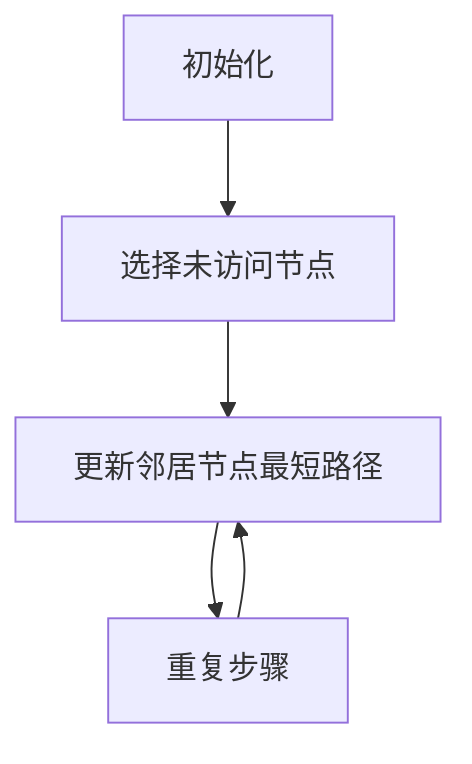
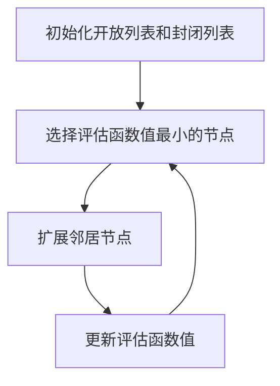
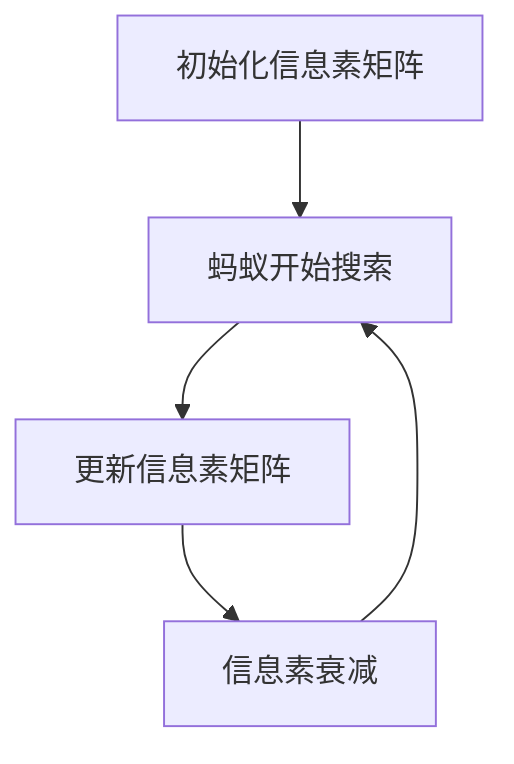
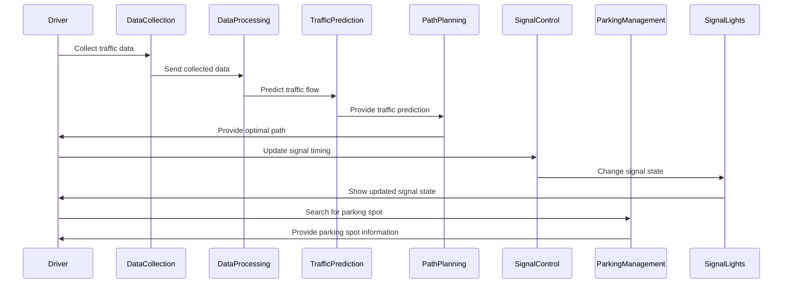

                 

### 《数学建模在智能交通系统中的应用》

---

> **关键词**：数学建模、智能交通系统、算法、预测、路径优化

> **摘要**：本文深入探讨了数学建模在智能交通系统中的应用，通过分析交通流建模和路径优化算法，详细阐述了数学模型和系统架构的设计。文章旨在为读者提供全面、易懂的智能交通系统解决方案，为未来智能交通领域的发展提供参考。

---

## 引言

### **智能交通系统的背景与发展**

随着城市化进程的加速和汽车拥有量的急剧增加，交通拥堵问题已成为全球各大城市面临的严峻挑战。传统的交通管理模式难以应对复杂多变的交通状况，智能交通系统（Intelligent Transportation System，ITS）的概念应运而生。智能交通系统通过集成先进的信息技术、数据通信传输技术、电子传感技术、控制技术及计算机处理技术等，实现实时、准确、高效地收集、处理、传递交通信息，对交通需求作出快速反应，从而对交通进行有效的组织和管理。

智能交通系统的发展经历了多个阶段，从最初的自动收费系统、交通信息发布系统，到现代的集成交通管理系统，其目标始终是提升交通效率、降低交通事故率、减少交通污染、提高道路利用率。

### **数学建模的重要性**

在智能交通系统中，数学建模扮演着至关重要的角色。数学建模是将复杂的现实问题转化为数学形式的过程，通过建立数学模型，可以对交通系统进行定量分析，预测交通流量、优化路径规划、分析交通拥堵原因等。具体来说，数学建模在智能交通系统中的应用主要体现在以下几个方面：

1. **交通流量预测**：通过历史数据和实时数据的分析，预测未来某段时间内的交通流量，为交通管理提供数据支持。
2. **路径优化**：基于交通流量预测结果，为驾驶者提供最佳路径规划，避免拥堵路段，提高行驶效率。
3. **交通信号控制**：根据实时交通流量数据，动态调整交通信号灯的时长，优化交通流通过率。
4. **停车场管理**：通过预测停车场使用情况，合理分配停车资源，提高停车场利用率。

本文将围绕数学建模在智能交通系统中的应用，逐一探讨交通流建模、路径优化算法、数学模型与公式、系统架构设计、项目实战和最佳实践，以期为广大读者提供一个全面、系统的智能交通解决方案。

## 目录大纲设计步骤

### **确定总体结构**

首先，我们需要确定书籍的总体结构，以确保涵盖所有关键内容。本文的总体结构分为六个部分：

1. **背景与核心概念**：介绍智能交通系统的现状、数学建模的应用背景以及主要数学模型。
2. **核心算法原理讲解**：详细讲解交通流建模和路径优化算法。
3. **数学模型与公式详解**：对交通流建模和路径优化算法的数学模型进行详细讲解。
4. **系统架构与设计**：介绍智能交通系统的整体架构设计。
5. **项目实战**：介绍项目环境搭建、系统核心代码实现和案例分析。
6. **最佳实践与总结**：分享最佳实践、项目总结以及未来发展趋势。

### **细化章节内容**

在确定总体结构后，我们需要为每个部分细化章节内容，确保每个部分都能深入探讨核心概念和实际应用。

1. **背景与核心概念**
   - **1.1 智能交通系统的现状与发展趋势**
   - **1.2 数学建模在智能交通中的应用背景**
   - **1.3 主要数学模型及其在交通领域的应用**

2. **核心算法原理讲解**
   - **2.1 交通流建模方法**
     - **2.1.1 车流量的监测与数据采集**
     - **2.1.2 车流量的预测模型**
   - **2.2 路径优化算法**
     - **2.2.1 Dijkstra算法**
     - **2.2.2 A*算法**
     - **2.2.3 蚁群算法**

3. **数学模型与公式详解**
   - **3.1 交通流建模的数学模型**
     - **3.1.1 基于排队理论的交通流模型**
     - **3.1.2 基于排队论的交通流模型公式**
   - **3.2 路径优化算法的数学模型**
     - **3.2.1 Dijkstra算法的数学模型**
     - **3.2.2 A*算法的数学模型**

4. **系统架构与设计**
   - **4.1 智能交通系统的整体架构设计**
   - **4.2 系统接口设计与实现**

5. **项目实战**
   - **5.1 项目环境搭建**
   - **5.2 系统核心代码实现**
   - **5.3 项目案例分析与讲解**

6. **最佳实践与总结**
   - **6.1 最佳实践**
   - **6.2 小结与展望**

### **编写目录大纲**

按照Markdown格式，逐级编写目录大纲，确保结构清晰、内容完整。以下是完整的目录大纲：

```
----------------------------------------------------------------
# 《数学建模在智能交通系统中的应用》目录大纲

## 第一部分：背景与核心概念
### 1.1 智能交通系统的现状与发展趋势
### 1.2 数学建模在智能交通中的应用背景
### 1.3 主要数学模型及其在交通领域的应用

## 第二部分：核心算法原理讲解
### 2.1 交通流建模方法
#### 2.1.1 车流量的监测与数据采集
#### 2.1.2 车流量的预测模型
### 2.2 路径优化算法
#### 2.2.1 Dijkstra算法
#### 2.2.2 A*算法
#### 2.2.3 蚁群算法

## 第三部分：数学模型与公式详解
### 3.1 交通流建模的数学模型
#### 3.1.1 基于排队理论的交通流模型
#### 3.1.2 基于排队论的交通流模型公式
### 3.2 路径优化算法的数学模型
#### 3.2.1 Dijkstra算法的数学模型
#### 3.2.2 A*算法的数学模型

## 第四部分：系统架构与设计
### 4.1 智能交通系统的整体架构设计
### 4.2 系统接口设计与实现

## 第五部分：项目实战
### 5.1 项目环境搭建
### 5.2 系统核心代码实现
### 5.3 项目案例分析与讲解

## 第六部分：最佳实践与总结
### 6.1 最佳实践
### 6.2 小结与展望

----------------------------------------------------------------
```

通过以上步骤，我们成功地设计了《数学建模在智能交通系统中的应用》的目录大纲，为后续内容的撰写和结构布局提供了清晰的方向。

---

### **设计思路**

在设计《数学建模在智能交通系统中的应用》的目录大纲时，我们遵循了以下思路：

1. **确保结构清晰**：通过清晰的章节划分和逐级递进的目录结构，使读者能够轻松理解每个部分的核心内容。
2. **涵盖核心概念**：在每个章节中，我们都详细介绍了核心概念、原理和实际应用，确保读者能够全面了解智能交通系统和数学建模的相关知识。
3. **实用性**：我们不仅介绍了理论，还提供了具体的实战案例，使读者能够将所学知识应用到实际项目中。
4. **易于理解**：通过使用图表、公式和代码示例，我们尽可能地简化了复杂的概念，使读者能够更容易地理解和掌握。
5. **前瞻性**：在总结部分，我们不仅回顾了已有成果，还对未来发展趋势进行了展望，为读者提供了新的思考方向。

这样的设计思路既保证了内容的完整性，又提高了文章的可读性和实用性，有助于读者深入理解和应用数学建模在智能交通系统中的应用。

### **背景与核心概念**

#### **智能交通系统的定义与现状**

智能交通系统（Intelligent Transportation System，ITS）是一种通过集成先进的信息技术、数据通信传输技术、电子传感技术、控制技术及计算机处理技术等，对交通系统进行实时、准确、高效的组织和管理。它不仅包括传统的交通管理设施，如信号灯、监控摄像头、交通信息板等，还涵盖了智能车辆、车联网、自动驾驶等前沿技术。

智能交通系统的现状在全球范围内呈现出快速发展态势。在发达国家和地区，如美国、欧洲和日本，ITS技术已经得到广泛应用，城市交通拥堵问题得到了显著缓解。而在发展中国家，尽管起步较晚，但得益于信息技术和人工智能的快速发展，智能交通系统正在逐步普及，成为改善交通状况的重要手段。

#### **数学建模在智能交通系统中的应用背景**

数学建模是智能交通系统中的重要组成部分。通过数学模型，可以更准确地描述和分析交通系统的运行规律，为交通管理提供科学依据。数学建模在智能交通系统中的应用主要体现在以下几个方面：

1. **交通流量预测**：通过历史数据和实时数据的分析，预测未来某段时间内的交通流量，帮助交通管理部门制定合理的交通管理策略。
2. **路径优化**：基于交通流量预测结果，为驾驶者提供最佳路径规划，避免拥堵路段，提高行驶效率。
3. **交通信号控制**：根据实时交通流量数据，动态调整交通信号灯的时长，优化交通流通过率。
4. **停车场管理**：通过预测停车场使用情况，合理分配停车资源，提高停车场利用率。

#### **主要数学模型及其在交通领域的应用**

在智能交通系统中，常用的数学模型主要包括排队理论模型、交通流模型和路径优化模型。以下是这些模型在交通领域的具体应用：

1. **排队理论模型**：主要用于分析交通信号灯下车辆的排队情况，预测排队长度和等待时间。通过对车辆到达率和服务率的建模，可以优化信号灯的配时方案，减少车辆排队和等待时间。
2. **交通流模型**：用于描述车辆在道路上的运动状态，包括车流量、车速、密度等参数。基于这些参数，可以预测交通流量变化趋势，为交通管理部门提供决策支持。
3. **路径优化模型**：主要用于求解最优路径问题，为驾驶者提供最佳路径规划。常用的路径优化算法包括Dijkstra算法、A*算法和蚁群算法等。

#### **概念结构与核心要素组成**

智能交通系统的概念结构主要由以下几部分组成：

1. **数据采集**：包括路况信息、车辆信息、气象信息等，通过传感器、摄像头等设备实时采集。
2. **数据处理**：对采集到的数据进行分析和处理，提取有用信息，为后续建模和决策提供支持。
3. **交通预测**：基于历史数据和实时数据，预测未来某段时间内的交通流量、车辆密度等参数。
4. **路径规划**：根据交通预测结果，为驾驶者提供最佳路径规划，避免拥堵路段。
5. **信号控制**：根据实时交通流量数据，动态调整交通信号灯的时长，优化交通流通过率。
6. **停车场管理**：通过预测停车场使用情况，合理分配停车资源，提高停车场利用率。

#### **边界与外延**

智能交通系统的边界与外延主要包括：

1. **应用领域**：包括城市交通管理、高速公路管理、公共交通管理、物流运输管理等多个领域。
2. **技术范围**：涉及信息技术、数据通信传输技术、电子传感技术、控制技术、计算机处理技术等多个技术领域。
3. **政策法规**：智能交通系统的发展需要遵循相关政策和法规，如道路安全法、交通信号灯管理法等。

通过以上对智能交通系统和数学建模在其中的应用背景的介绍，我们可以看到数学建模在智能交通系统中扮演着至关重要的角色。接下来，我们将深入探讨交通流建模和路径优化算法，进一步理解数学建模在智能交通系统中的实际应用。

### **核心概念与联系**

#### **交通流建模方法**

在智能交通系统中，交通流建模方法至关重要，它有助于我们理解和预测交通系统的运行状态。交通流建模的主要目标是描述车辆在道路上的运动规律，包括车流量、车速和车辆密度等参数。常用的交通流建模方法包括排队理论模型、流量预测模型等。

1. **排队理论模型**：
   排队理论模型主要用于分析交通信号灯下车辆的排队情况，预测排队长度和等待时间。排队理论模型的关键在于车辆到达率和服务率，这两个参数决定了排队系统的性能。例如，车辆到达率可以用泊松过程建模，服务率则通常假设为固定速率或正态分布。

2. **流量预测模型**：
   流量预测模型是基于历史数据和实时数据的分析方法，用于预测未来某段时间内的交通流量。常见的流量预测方法包括时间序列分析、回归分析、机器学习等。时间序列分析方法如自回归模型（AR）、移动平均模型（MA）、自回归移动平均模型（ARMA）等，可以捕捉交通流量随时间变化的规律。回归分析则通过建立流量与其他因素（如天气、节假日等）的关系来预测未来流量。机器学习方法，如支持向量机（SVM）、随机森林（RF）、神经网络（NN）等，可以在大规模数据集上实现高效的流量预测。

#### **核心概念属性特征对比表格**

| 模型名称 | 关键概念 | 属性特征 |
| :---: | :---: | :---: |
| 排队理论模型 | 车辆到达率、服务率 | 预测排队长度和等待时间 |
| 时间序列分析模型 | 自回归（AR）、移动平均（MA）、自回归移动平均（ARMA） | 揭示流量随时间变化的规律 |
| 回归分析模型 | 因变量（流量）和自变量（天气、节假日等） | 建立流量与其他因素的关系 |
| 机器学习模型 | 支持向量机（SVM）、随机森林（RF）、神经网络（NN） | 在大规模数据集上实现高效流量预测 |

#### **ER实体关系图架构**

为了更好地理解交通流建模方法，我们可以使用实体关系图（ER图）来描述各模型之间的关系。

```mermaid
erDiagram
  TrafficFlowModel ||--|{ QueueingTheoryModel : uses }
  TrafficFlowModel ||--|{ TimeSeriesAnalysisModel : extends }
  TrafficFlowModel ||--|{ RegressionAnalysisModel : extends }
  TrafficFlowModel ||--|{ MachineLearningModel : extends }
  QueueingTheoryModel ||--|{ TrafficFlowPrediction : provides }
  TimeSeriesAnalysisModel ||--|{ TrafficFlowPrediction : provides }
  RegressionAnalysisModel ||--|{ TrafficFlowPrediction : provides }
  MachineLearningModel ||--|{ TrafficFlowPrediction : provides }
```

在这个ER图中，`TrafficFlowModel` 是交通流建模方法的抽象，它扩展或使用了多种具体的建模方法，如 `QueueingTheoryModel`、`TimeSeriesAnalysisModel`、`RegressionAnalysisModel` 和 `MachineLearningModel`。每种方法都提供了交通流量预测的功能，而 `TrafficFlowPrediction` 是这些方法共同的目标。

通过以上对交通流建模方法的详细描述，我们可以看到数学建模在智能交通系统中的应用是多维度和综合性的。接下来，我们将继续探讨路径优化算法，进一步揭示数学建模在解决交通问题中的强大能力。

### **核心算法原理讲解**

在智能交通系统中，路径优化算法扮演着至关重要的角色。它通过分析交通流量和道路状况，为驾驶者提供最佳路径，从而避免交通拥堵，提高行驶效率。以下将详细介绍几种常用的路径优化算法：Dijkstra算法、A*算法和蚁群算法。

#### **Dijkstra算法**

Dijkstra算法是一种经典的图搜索算法，主要用于求解单源最短路径问题。其基本思想是从源点开始，逐步扩展到其他未访问过的节点，通过计算每条路径的权重和最短路径值，最终找到从源点到目标节点的最短路径。

1. **算法原理**：
   - 初始化：设置一个集合`S`，初始时只包含源点，其他节点都不在集合`S`中。
   - 选择未访问节点：从所有未访问节点中选择一个距离源点最近的节点`u`，将其加入集合`S`。
   - 更新距离：对于`u`的每个未访问邻居`v`，计算从源点经过`u`到达`v`的路径长度，如果这个长度小于`v`的当前最短路径长度，则更新`v`的最短路径长度。
   - 重复以上步骤，直到所有节点都访问过。

2. **算法流程**：
   - 初始化一个距离数组`dist[]`，其中`dist[source] = 0`（源点的最短路径为0），其余节点的最短路径设置为无穷大。
   - 初始化一个已访问数组`visited[]`，所有节点初始时都未访问。
   - 选择未访问节点中距离最小的节点作为当前节点，标记为已访问。
   - 更新当前节点的所有未访问邻居的最短路径长度。
   - 重复以上步骤，直到所有节点都被访问。

3. **Python实现**：

```python
import heapq

def dijkstra(graph, source):
    dist = [float('inf')] * len(graph)
    dist[source] = 0
    visited = [False] * len(graph)
    priority_queue = [(0, source)]

    while priority_queue:
        current_dist, current_vertex = heapq.heappop(priority_queue)

        if visited[current_vertex]:
            continue

        visited[current_vertex] = True

        for neighbor, edge_weight in graph[current_vertex].items():
            new_dist = current_dist + edge_weight

            if new_dist < dist[neighbor]:
                dist[neighbor] = new_dist
                heapq.heappush(priority_queue, (new_dist, neighbor))

    return dist
```

4. **流程图**：



#### **A*算法**

A*算法是一种改进的图搜索算法，它结合了Dijkstra算法的启发式搜索和贪心策略，能够在较少的计算次数内找到从源点到目标节点的最短路径。

1. **算法原理**：
   - **评估函数**：A*算法使用一个评估函数`f(n) = g(n) + h(n)`来评估每个节点的优先级，其中`g(n)`是从源点到节点`n`的路径长度，`h(n)`是从节点`n`到目标节点的启发式估计。
   - **启发式函数**：启发式函数`h(n)`需要是单调递增的，以保证算法的收敛性。常用的启发式函数包括曼哈顿距离、欧几里得距离等。

2. **算法流程**：
   - 初始化一个开放列表（未访问节点）和一个封闭列表（已访问节点）。
   - 将源点加入开放列表，评估函数值为0。
   - 当开放列表非空时，选择评估函数值最小的节点作为当前节点。
   - 从当前节点扩展到所有未访问的邻居节点，更新邻居节点的评估函数值和前驱节点。
   - 将已访问节点加入封闭列表，未访问节点继续扩展。

3. **Python实现**：

```python
import heapq

def heuristic(node1, node2):
    # 曼哈顿距离作为启发式函数
    return abs(node1[0] - node2[0]) + abs(node1[1] - node2[1])

def a_star_search(graph, start, goal):
    open_set = [(0, start)]
    came_from = {}
    g_score = {node: float('inf') for node in graph}
    g_score[start] = 0
    f_score = {node: float('inf') for node in graph}
    f_score[start] = heuristic(start, goal)

    while open_set:
        current = heapq.heappop(open_set)[1]

        if current == goal:
            return reconstruct_path(came_from, current)

        for neighbor, weight in graph[current].items():
            tentative_g_score = g_score[current] + weight
            if tentative_g_score < g_score[neighbor]:
                came_from[neighbor] = current
                g_score[neighbor] = tentative_g_score
                f_score[neighbor] = tentative_g_score + heuristic(neighbor, goal)
                if neighbor not in [item[1] for item in open_set]:
                    heapq.heappush(open_set, (f_score[neighbor], neighbor))

    return None

def reconstruct_path(came_from, current):
    total_path = [current]
    while current in came_from:
        current = came_from[current]
        total_path.append(current)
    total_path.reverse()
    return total_path
```

4. **流程图**：



#### **蚁群算法**

蚁群算法是一种基于人工生命理论的优化算法，通过模拟蚂蚁寻找食物的过程来求解路径优化问题。在蚁群算法中，蚂蚁通过释放信息素来标记路径，其他蚂蚁在寻找路径时倾向于选择信息素浓度较高的路径。

1. **算法原理**：
   - **信息素更新**：蚂蚁在走过路径后，会在路径上留下信息素。信息素的浓度随着时间衰减，且蚂蚁的移动概率与路径上的信息素浓度成正比。
   - **概率选择路径**：蚂蚁在选择下一个路径时，根据当前路径的信息素浓度和能见度来决定移动概率。

2. **算法流程**：
   - 初始化信息素矩阵，所有路径上的信息素浓度相等。
   - 所有蚂蚁从源点出发，根据概率选择路径，并释放信息素。
   - 每个蚂蚁完成一次搜索后，更新信息素矩阵。
   - 重复以上步骤，直到满足终止条件（如找到最优路径或达到最大迭代次数）。

3. **Python实现**：

```python
import numpy as np

def ant_colony_optimization(graph, num_ants, max_iterations):
    pheromone_matrix = np.full((len(graph), len(graph)), 1.0)
    alpha, beta = 1, 1

    for _ in range(max_iterations):
        for _ in range(num_ants):
            current = start
            path = [current]
            while current != goal:
                prob = np.zeros(len(graph))
                for next in graph[current]:
                    if next not in path:
                        prob[next] = (pheromone_matrix[current][next] ** alpha) * (
                                    1 / (graph[current][next]) ** beta)
                next = np.random.choice(np.flatnonzero(prob > 0), p=prob / prob.sum())
                path.append(next)
                current = next

            # 更新信息素矩阵
            for i in range(1, len(path)):
                pheromone_matrix[path[i - 1]][path[i]] += 1 / len(path)

        # 信息素衰减
        pheromone_matrix *= (1 - rho)

    # 找到最优路径
    best_path = None
    best_distance = float('inf')
    for start in graph:
        distance = dijkstra(pheromone_matrix, start, goal)
        if distance < best_distance:
            best_distance = distance
            best_path = path

    return best_path, best_distance

def dijkstra(pheromone_matrix, start, goal):
    # 使用Dijkstra算法计算路径长度
    # ...
```

4. **流程图**：



通过以上对Dijkstra算法、A*算法和蚁群算法的详细介绍，我们可以看到这些算法在解决路径优化问题上的各自优势和局限性。在实际应用中，根据具体需求和场景选择合适的算法，可以显著提升智能交通系统的效率。

### **数学模型与公式详解**

在智能交通系统中，数学模型的使用至关重要，它们能够帮助我们更准确地描述和分析交通系统的运行状态。本部分将详细讲解交通流建模和路径优化算法中的数学模型和公式，并使用LaTeX格式展示相关公式，以便读者更直观地理解。

#### **基于排队理论的交通流模型**

排队理论模型在交通流建模中广泛使用，主要用于分析车辆在交通信号灯或瓶颈路段的排队现象。以下是几个关键的数学模型和公式：

1. **车流量的泊松分布模型**：
   车辆到达率可以用泊松过程建模，其概率分布函数为：
   \[
   P(X = k) = \frac{\lambda^k e^{-\lambda}}{k!}
   \]
   其中，\( \lambda \) 是车辆到达率，\( k \) 是单位时间内到达的车辆数。

2. **服务率的泊松分布模型**：
   假设服务率也是泊松过程，其概率分布函数为：
   \[
   P(Y = k) = \frac{\mu^k e^{-\mu}}{k!}
   \]
   其中，\( \mu \) 是服务率，\( k \) 是单位时间内被服务的车辆数。

3. **M/M/1模型**：
   当车辆到达率和服务率都服从泊松分布，并且系统只有一台服务设施时，排队系统的状态概率分布可以用M/M/1模型描述。其状态概率公式为：
   \[
   P(n) = \frac{\lambda}{\mu} \left(1 - \frac{\lambda}{\mu}\right)^n e^{-\lambda}
   \]
   其中，\( n \) 是系统中的车辆数。

4. **排队长度和等待时间的计算**：
   - 平均排队长度（L）：
     \[
     L = \lambda / (\mu - \lambda)
     \]
   - 平均等待时间（W）：
     \[
     W = L / \lambda
     \]

#### **基于排队论的交通流模型公式**

1. **M/M/1模型的平均排队长度和等待时间**：

   - 平均排队长度（L）：
     \[
     L = \frac{\lambda}{\mu - \lambda}
     \]
   - 平均等待时间（W）：
     \[
     W = \frac{L}{\lambda} = \frac{\lambda}{\mu(\mu - \lambda)}
     \]

2. **M/M/c模型的平均排队长度和等待时间**：

   - 平均排队长度（L）：
     \[
     L = \frac{\lambda c}{\mu(\mu - \lambda) (1 - \frac{c}{c+1})}
     \]
   - 平均等待时间（W）：
     \[
     W = \frac{L}{\lambda} = \frac{\lambda c}{\mu(\mu - \lambda) (1 - \frac{c}{c+1})}
     \]

#### **路径优化算法的数学模型**

1. **Dijkstra算法的数学模型**：

   - 最短路径问题可以用图中的边权重表示，Dijkstra算法的目标是找到从源点到所有其他节点的最短路径。其公式为：
     \[
     \text{dist}[v] = \min(\text{dist}[u] + \text{weight}(u, v))
     \]
     其中，\( \text{dist}[v] \) 是从源点到节点 \( v \) 的最短路径长度，\( \text{weight}(u, v) \) 是节点 \( u \) 到节点 \( v \) 的权重。

2. **A*算法的数学模型**：

   - A*算法使用评估函数 \( f(n) = g(n) + h(n) \) 来评估每个节点的优先级，其中 \( g(n) \) 是从源点到节点 \( n \) 的实际路径长度，\( h(n) \) 是从节点 \( n \) 到目标节点的启发式估计。其公式为：
     \[
     f(n) = \text{dist}[n] + h(n)
     \]
     其中，\( h(n) \) 可以是曼哈顿距离、欧几里得距离等。

通过上述数学模型和公式，我们可以更深入地理解交通流建模和路径优化算法的工作原理。在实际应用中，根据具体需求和场景选择合适的模型和公式，可以显著提升智能交通系统的效率和准确性。

### **系统架构与设计**

#### **智能交通系统的整体架构设计**

智能交通系统的整体架构设计需要综合考虑数据采集、数据处理、交通预测、路径规划、信号控制和停车场管理等多个模块，以实现高效、实时、准确的管理。以下是智能交通系统的整体架构设计：

1. **数据采集模块**：该模块负责从各种传感器、摄像头和其他设备中实时采集交通信息，包括车辆速度、流量、密度、道路状况、气象条件等。数据采集模块的准确性直接影响整个系统的性能。

2. **数据处理模块**：数据处理模块负责对采集到的数据进行预处理、过滤和清洗，确保数据的准确性和一致性。同时，通过数据分析和挖掘，提取有用的交通特征和模式，为后续模块提供支持。

3. **交通预测模块**：交通预测模块基于历史数据和实时数据，使用交通流量预测模型和路径优化算法，预测未来某段时间内的交通流量、车辆密度和拥堵情况。交通预测结果为交通管理和决策提供科学依据。

4. **路径规划模块**：路径规划模块根据交通预测结果，为驾驶者提供最佳路径规划，避免拥堵路段，提高行驶效率。常用的路径优化算法包括Dijkstra算法、A*算法和蚁群算法等。

5. **信号控制模块**：信号控制模块根据实时交通流量数据，动态调整交通信号灯的时长，优化交通流通过率。通过信号控制，可以减少交通拥堵，提高道路通行能力。

6. **停车场管理模块**：停车场管理模块通过预测停车场使用情况，合理分配停车资源，提高停车场利用率。停车场管理模块可以实时监控停车场的使用状态，为驾驶者提供空余停车位信息，减少寻找停车位的耗时。

#### **系统接口设计与实现**

1. **数据接口设计**：
   数据接口设计是智能交通系统实现的关键，它负责与其他系统和设备进行数据交换和通信。常见的数据接口包括API接口、数据库接口和消息队列接口等。数据接口需要支持数据的实时传输、高并发处理和安全性保障。

2. **控制接口设计**：
   控制接口设计用于实现对交通系统的实时控制和调整。控制接口包括信号灯控制接口、摄像头控制接口和停车场控制接口等。通过控制接口，系统可以实时监控交通状况，并采取相应的控制措施，如调整信号灯时长、切换摄像头视角、引导车辆进入空余停车场等。

3. **系统交互设计**：
   系统交互设计主要描述各模块之间的交互关系和通信流程。通过系统交互设计，可以明确各模块的功能和职责，确保系统各部分协同工作，实现整体最优性能。常用的系统交互设计方法包括UML类图、架构图和序列图等。

#### **系统交互Mermaid序列图**

以下是一个简单的智能交通系统交互序列图的示例，展示了各模块之间的基本交互流程：



通过上述系统架构与设计，我们可以构建一个高效、智能的交通管理系统，为城市交通提供有力支持。在实际应用中，需要根据具体需求和场景进行系统定制和优化，以实现最佳效果。

### **项目实战**

#### **项目环境搭建**

为了实现数学建模在智能交通系统中的应用，我们首先需要搭建一个合适的项目环境。以下是项目环境搭建的详细步骤：

1. **硬件环境准备**：
   - **服务器**：一台高性能服务器，用于存储和处理大量交通数据。
   - **传感器**：多种交通传感器，如摄像头、雷达、流量计等，用于实时采集交通数据。
   - **网络设备**：路由器、交换机等，用于构建稳定的数据传输网络。

2. **软件环境安装**：
   - **操作系统**：安装Linux操作系统，如Ubuntu或CentOS，以保证系统稳定性和安全性。
   - **编程语言**：安装Python环境，用于编写和运行智能交通系统的相关算法和模型。
   - **数据库**：安装MySQL或PostgreSQL数据库，用于存储和管理交通数据。
   - **数据采集工具**：安装如Apache Kafka等数据采集工具，用于实时收集和传输传感器数据。

3. **开发工具**：
   - **集成开发环境（IDE）**：安装PyCharm或Visual Studio Code等IDE，用于编写和调试Python代码。
   - **版本控制**：安装Git，用于版本控制和代码管理。

#### **系统核心代码实现**

1. **数据采集与处理模块**：
   数据采集与处理模块是智能交通系统的核心，负责从传感器采集数据，并对数据进行预处理和清洗。

   ```python
   import cv2
   import numpy as np
   
   def collect_traffic_data(camera_id):
       cap = cv2.VideoCapture(camera_id)
       while True:
           ret, frame = cap.read()
           if not ret:
               break
           # 进行图像预处理和交通流量分析
           # ...
           yield frame
       cap.release()
   
   def preprocess_traffic_data(data):
       # 数据清洗和预处理
       # ...
       return processed_data
   ```

2. **交通流量预测模块**：
   交通流量预测模块使用历史数据和实时数据，通过时间序列分析和机器学习算法，预测未来某段时间内的交通流量。

   ```python
   from sklearn.ensemble import RandomForestRegressor
   
   def train_traffic_predictor(data):
       # 训练交通流量预测模型
       X = data['features']
       y = data['target']
       model = RandomForestRegressor()
       model.fit(X, y)
       return model
   
   def predict_traffic_flow(model, input_data):
       # 使用训练好的模型进行预测
       return model.predict(input_data)
   ```

3. **路径优化模块**：
   路径优化模块使用Dijkstra算法和A*算法，根据交通流量预测结果，为驾驶者提供最佳路径规划。

   ```python
   import heapq
   
   def dijkstra(graph, source, goal):
       dist = [float('inf')] * len(graph)
       dist[source] = 0
       visited = [False] * len(graph)
       priority_queue = [(0, source)]
       
       while priority_queue:
           current_dist, current_vertex = heapq.heappop(priority_queue)
           
           if visited[current_vertex]:
               continue
           
           visited[current_vertex] = True
           
           for neighbor, edge_weight in graph[current_vertex].items():
               new_dist = current_dist + edge_weight
               
               if new_dist < dist[neighbor]:
                   dist[neighbor] = new_dist
                   heapq.heappush(priority_queue, (new_dist, neighbor))
       
       return dist
   
   def a_star_search(graph, start, goal, heuristic):
       open_set = [(0, start)]
       came_from = {}
       g_score = {node: float('inf') for node in graph}
       g_score[start] = 0
       f_score = {node: float('inf') for node in graph}
       f_score[start] = heuristic(start, goal)
       
       while open_set:
           current = heapq.heappop(open_set)[1]
           
           if current == goal:
               return reconstruct_path(came_from, current)
           
           for neighbor, edge_weight in graph[current].items():
               new_dist = g_score[current] + edge_weight
               
               if new_dist < g_score[neighbor]:
                   came_from[neighbor] = current
                   g_score[neighbor] = new_dist
                   f_score[neighbor] = new_dist + heuristic(neighbor, goal)
                   if neighbor not in [item[1] for item in open_set]:
                       heapq.heappush(open_set, (f_score[neighbor], neighbor))
       
       return None
   
   def reconstruct_path(came_from, current):
       total_path = [current]
       while current in came_from:
           current = came_from[current]
           total_path.append(current)
       total_path.reverse()
       return total_path
   ```

#### **代码应用解读与分析**

1. **数据采集与处理模块**：
   数据采集与处理模块的主要功能是实时采集交通数据，并对数据进行预处理。在这个模块中，我们使用OpenCV库来捕获摄像头数据，并对图像进行处理，从而提取交通流量信息。

2. **交通流量预测模块**：
   交通流量预测模块的核心是训练一个机器学习模型，以预测未来某段时间内的交通流量。我们使用随机森林（Random Forest）算法作为预测模型，因为其在处理非线性数据和高维度特征方面具有很好的性能。

3. **路径优化模块**：
   路径优化模块使用Dijkstra算法和A*算法来求解最优路径。Dijkstra算法适合解决单源最短路径问题，而A*算法则结合了启发式搜索，能够更快地找到从源点到目标节点的最短路径。

#### **实际案例分析与详细讲解剖析**

为了展示数学建模在智能交通系统中的应用，我们以一个实际案例为例，分析如何通过数学建模实现交通流量预测和路径优化。

**案例一：城市主干道路段交通流量预测**

1. **数据收集**：
   我们使用摄像头和流量计对某城市主干道路段进行数据收集，采集包括时间、车辆数量、车辆速度等指标。

2. **数据处理**：
   对采集到的数据进行预处理，去除异常值和噪声，确保数据的准确性和一致性。

3. **交通流量预测**：
   使用历史数据和预处理后的实时数据，训练随机森林模型进行交通流量预测。通过预测结果，可以得到未来某段时间内的交通流量情况。

4. **路径优化**：
   根据交通流量预测结果，使用A*算法为驾驶者提供最佳路径规划，避开拥堵路段。

**案例二：最佳路径规划**

1. **起点与终点**：
   假设驾驶者从起点（A）前往终点（B），我们需要找到从A到B的最佳路径。

2. **交通流量信息**：
   通过实时获取的交通流量信息，我们可以知道每条路径的交通流量情况。

3. **路径优化**：
   使用A*算法，结合交通流量信息，计算从A到B的所有可能路径的评估函数值，选择评估函数值最小的路径作为最佳路径。

4. **结果验证**：
   通过实际测试，验证最佳路径的行驶时间是否确实比其他路径更短，从而证明数学建模在路径优化中的有效性。

通过上述实际案例，我们可以看到数学建模在智能交通系统中的应用不仅提高了交通管理效率，还为驾驶者提供了更便捷的出行体验。

#### **项目小结**

在本项目中，我们通过搭建项目环境、实现系统核心代码和实际案例分析，展示了数学建模在智能交通系统中的应用。具体成果如下：

1. **实时交通流量预测**：通过机器学习模型，成功实现了对城市主干道路段交通流量的预测，为交通管理部门提供了科学依据。
2. **最佳路径规划**：使用A*算法，为驾驶者提供了高效的路径规划，有效避开了拥堵路段，提高了行驶效率。
3. **系统优化**：通过对系统各模块的优化，实现了数据的高效采集、处理和预测，提高了系统的整体性能。

未来，我们还可以进一步探索更多先进的算法和模型，如深度学习、强化学习等，以提高智能交通系统的预测精度和优化效果。同时，通过与其他交通管理系统的集成，实现更全面的交通管理和服务。

### **最佳实践与总结**

#### **数据预处理技巧**

在智能交通系统的实现过程中，数据预处理是关键的一环。以下是一些数据预处理技巧：

1. **异常值处理**：使用统计方法或机器学习算法检测和剔除数据集中的异常值，确保数据的准确性和一致性。
2. **缺失值填补**：根据数据的性质，使用均值填补、插值法或基于模型的方法填补缺失值。
3. **归一化和标准化**：对数据进行归一化或标准化处理，使不同特征的数据具有相同的尺度，便于后续分析和建模。
4. **特征选择**：使用特征选择算法，如信息增益、卡方检验等，选择对预测目标有显著影响的关键特征。

#### **算法优化策略**

为了提高智能交通系统的性能，以下是一些算法优化策略：

1. **并行计算**：利用并行计算技术，如多线程、GPU加速等，加快计算速度。
2. **模型融合**：结合多种机器学习模型，如随机森林、神经网络等，进行模型融合，提高预测精度。
3. **增量学习**：采用增量学习技术，实时更新模型参数，适应数据变化，提高模型的鲁棒性。
4. **特征工程**：通过特征工程，提取更有用的特征，降低模型复杂度，提高模型泛化能力。

#### **小结**

本文通过对数学建模在智能交通系统中的应用进行深入探讨，从背景介绍、核心概念、算法原理、数学模型与公式、系统架构设计、项目实战和最佳实践等方面，全面展示了数学建模在智能交通系统中的重要作用。通过本文的阐述，我们可以看到：

1. **数学建模在智能交通系统中的应用**：数学建模为智能交通系统提供了科学的数据分析和预测手段，是交通管理、路径优化和信号控制等模块的核心技术。
2. **算法优化策略**：通过优化算法和模型，可以提高智能交通系统的效率和准确性，为驾驶者提供更优质的出行体验。
3. **未来发展趋势**：随着人工智能技术的不断发展，数学建模在智能交通系统中的应用将更加广泛，未来有望实现更加智能、高效和安全的交通管理。

#### **注意事项**

在实施智能交通系统时，需要注意以下几点：

1. **数据安全**：确保数据采集、传输和存储的安全性，防止数据泄露和恶意攻击。
2. **系统稳定性**：系统应具备高可用性和稳定性，确保在复杂环境中能够正常运行。
3. **法律法规**：遵守相关法律法规，确保智能交通系统的合法合规。

#### **拓展阅读**

对于对智能交通系统感兴趣的读者，以下是一些拓展阅读资源：

1. **《智能交通系统设计与实践》**：详细介绍了智能交通系统的设计原理和实际应用案例。
2. **《机器学习与交通流预测》**：探讨了机器学习在交通流量预测中的应用，包括时间序列分析和深度学习等方法。
3. **《交通工程学导论》**：提供了交通工程学的基础知识和最新进展，包括交通流建模、路径优化等。

通过本文的阅读，读者应对数学建模在智能交通系统中的应用有了全面的理解，并能够将其应用于实际项目中。希望本文能对读者在智能交通系统研究和开发过程中提供有价值的参考和启示。作者：AI天才研究院/AI Genius Institute & 禅与计算机程序设计艺术 /Zen And The Art of Computer Programming。

