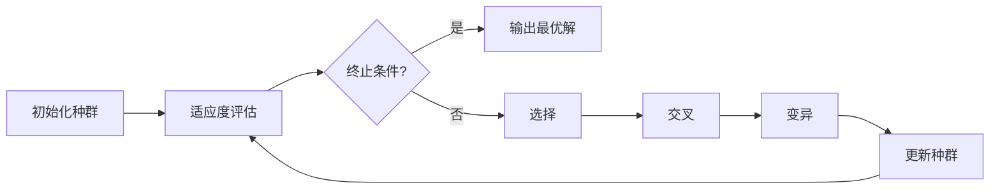

                 

### 引言

#### 1.1 问题背景

气候变化是全球面临的一项严峻挑战，其对人类社会、生态系统和经济发展的影响日益显著。全球气温上升、极端天气事件频发、海平面上升、生态系统失衡等问题，正严重威胁到人类的生存和发展。这些现象不仅导致了农作物产量下降、水资源短缺、生态灾害加剧，还对全球经济和社会稳定构成了巨大威胁。

气候变化对人类社会的影响主要体现在以下几个方面：

- **农业与粮食安全**：气候变化导致的极端天气事件（如干旱、洪水、风暴）对农作物的产量和质量产生了直接影响，威胁到全球粮食安全。
- **水资源管理**：气候变化引起了水资源的时空分布变化，许多地区面临着水资源短缺和水质恶化的问题，这对水资源的合理利用提出了更高的要求。
- **生态系统**：气候变化对生物多样性和生态系统平衡产生了负面影响，许多物种正面临灭绝的威胁，生态系统功能退化加剧。
- **健康问题**：气候变化增加了疾病传播的风险，如蚊媒传染病、心血管疾病和呼吸道疾病等。
- **经济发展**：气候变化对基础设施、生产和供应链造成了破坏，给全球经济带来了巨大的损失。

为了应对这些挑战，数学建模作为一种重要的工具和方法，在气候变化研究中发挥了关键作用。数学建模通过将复杂的气候变化问题转化为可计算的数学模型，帮助科学家和政策制定者更好地理解和预测气候变化趋势，从而制定出有效的适应和缓解策略。

#### 1.2 数学建模在气候变化研究中的作用

数学建模在气候变化研究中具有以下几个重要作用：

1. **气候变化预测**：数学模型可以用于模拟和预测未来气候变化趋势。通过建立时间序列模型、气候模型等，科学家可以分析历史气候数据，预测未来气温、降水量等关键气候指标的变化趋势，为政策制定提供科学依据。

2. **风险评估**：数学建模可以帮助评估气候变化对特定地区、行业或生态系统的影响，识别高风险区域和关键问题，为风险管理提供支持。例如，利用模糊数学方法、遗传算法等模型，可以评估干旱、洪水等极端天气事件的风险。

3. **适应策略制定**：数学模型可以用于制定适应气候变化的策略。通过多目标优化模型、模拟退火算法等，可以找到最佳的适应方案，优化资源配置，降低气候变化带来的负面影响。

4. **政策分析**：数学模型可以用于分析和评估不同政策方案对气候变化的影响，帮助政策制定者制定科学、有效的政策措施。

总之，数学建模在气候变化研究中扮演着关键角色，其应用不仅有助于提高对气候变化的理解，还为应对气候变化提供了科学依据和技术支持。

#### 1.3 数学建模基本概念

数学建模是将现实世界中的复杂问题通过数学方法进行抽象、简化和模拟的过程。它涉及多个学科，包括数学、统计学、物理学、计算机科学等，旨在利用数学工具和方法揭示问题的内在规律和特性。

##### 模型分类

数学模型根据其应用领域和性质可以分为多种类型，主要包括以下几类：

1. **确定性模型**：这类模型基于确定的数学关系，如线性方程组、微分方程等。确定性模型在许多科学和工程领域有广泛应用，例如物理力学中的牛顿定律、电路理论中的基尔霍夫定律等。

2. **概率模型**：这类模型基于概率论和统计学原理，如随机过程、马尔可夫链等。概率模型在风险分析和预测领域具有重要作用，例如在气候变化研究中，使用概率模型来模拟未来气候变化的随机性。

3. **混合模型**：这类模型结合了确定性模型和概率模型的特点，如模糊模型、灰色模型等。混合模型可以处理不确定性和非线性问题，例如在水资源管理中，结合确定性水资源模型和模糊模型来预测未来的水资源供需情况。

##### 模型建立步骤

建立一个有效的数学模型通常需要以下步骤：

1. **问题定义**：明确研究问题，确定模型的目标和约束条件。这一步骤是整个建模过程的基础，必须清晰明确。

2. **数据收集**：收集相关数据，包括历史气候数据、社会经济数据、环境数据等。数据质量直接影响模型的精度和可靠性。

3. **假设与简化**：在现实问题中，往往存在大量的复杂因素和非线性关系。为了简化问题，需要根据实际情况做出合理的假设和简化。例如，可以假设气候系统是线性的、环境变量是稳定的等。

4. **建立模型**：根据问题定义和假设，利用数学工具和方法建立模型。这一步骤需要结合实际问题的特点和需求，选择合适的模型类型和数学方法。

5. **模型验证与优化**：通过对比模型预测结果和实际观测数据，验证模型的准确性和可靠性。如果模型误差较大，可能需要对模型进行调整和优化。

6. **应用与推广**：将模型应用于实际问题，如气候变化预测、风险评估、策略制定等。通过不断迭代和改进，提升模型的实用性和适用性。

##### 数学建模在气候变化适应中的应用概述

数学建模在气候变化适应中的应用非常广泛，涵盖了预测、风险评估、策略制定和政策分析等多个领域。以下是对这些应用领域的概述：

1. **预测**：通过时间序列模型和气候模型，科学家可以预测未来气候变化的趋势，如气温、降水量的变化。这些预测对于制定长期适应策略至关重要。

2. **风险评估**：利用数学模型，如模糊数学方法和遗传算法，可以评估气候变化对特定地区和行业的影响，识别高风险区域和关键问题，为风险管理提供科学依据。

3. **策略制定**：通过多目标优化模型和模拟退火算法，可以制定适应气候变化的策略，优化资源配置，降低气候变化带来的负面影响。

4. **政策分析**：数学模型可以用于分析和评估不同政策方案对气候变化的影响，帮助政策制定者制定科学、有效的政策措施。

尽管数学建模在气候变化适应中取得了显著成果，但仍面临诸多挑战。例如，数据的不足和质量问题、模型的不确定性和复杂性等。因此，未来的研究需要进一步完善和改进数学模型，提高其预测精度和适用性，以更好地应对气候变化带来的挑战。

#### 基本概念与工具

#### 2.1 气候变化基础知识

气候变化是指地球大气和海洋的长期变化，这种变化可能是由自然因素（如火山爆发、太阳辐射变化等）或人类活动（如化石燃料燃烧、森林砍伐等）引起的。为了深入理解和研究气候变化，我们需要掌握一些基本概念和术语。

**1. 气候变化定义**：

气候变化是指地球大气和海洋的长期变化，这种变化可能是由自然因素或人类活动引起的。气候是指一个地区多年来的天气平均状况，包括温度、降水、湿度等。

**2. 气候变化的主要因素**：

- **自然因素**：包括太阳辐射变化、火山爆发、地球轨道变化等。
- **人类活动**：主要包括化石燃料燃烧、森林砍伐、工业化等。

**3. 气候变化的后果**：

- **全球气温上升**：导致海平面上升、极端天气事件频发、冰川融化和生态系统失衡。
- **水资源变化**：影响水资源的分布和供需，导致干旱和洪水等问题。
- **生态系统影响**：破坏生物多样性，影响生态系统的稳定性和功能。
- **健康问题**：增加疾病传播的风险，如蚊媒传染病和心血管疾病等。
- **经济影响**：破坏基础设施、生产和供应链，给全球经济带来巨大损失。

**4. 气候变化的影响因素和机制**：

- **温室效应**：温室气体（如二氧化碳、甲烷等）的增加导致地球大气保温效应增强，从而引起全球气温上升。
- **海洋热含量变化**：海洋吸收了大量的温室气体和热量，导致海洋温度上升，影响海洋生态系统和气候模式。
- **冰川和冻土融化**：冰川和冻土的融化导致海平面上升，影响沿海地区和生态系统。

为了更全面地理解气候变化，我们可以通过以下ER实体关系图来展示主要概念和它们之间的关系：

```mermaid
erDiagram
  ClimateChange_1 ||--|{ Factors_2 }
  Factors_2 ||--|{ Natural_Factors_3 }
  Factors_2 ||--|{ Human_Activities_4 }
  ClimateChange_1 ||--|{ Consequences_5 }
  Consequences_5 ||--|{ Global_Temperature_Rise_6 }
  Consequences_5 ||--|{ Water_Resource_Changes_7 }
  Consequences_5 ||--|{ Ecosystem_Impact_8 }
  Consequences_5 ||--|{ Health_Issues_9 }
  Consequences_5 ||--|{ Economic_Impact_10 }
```

通过这个ER图，我们可以清晰地看到气候变化的主要因素及其对气候变化的后果的影响。这为我们理解和分析气候变化问题提供了一个结构化的视角。

#### 2.2 数学建模工具

在气候变化研究中，数学建模工具的选择对于模型的有效性和应用性至关重要。以下是一些常用的数学建模工具，包括数学软件和数据预处理方法，这些工具在数据处理和分析中发挥了关键作用。

**1. 数学软件介绍**

- **MATLAB**：MATLAB是一款功能强大的数学软件，广泛用于科学计算、数据分析和可视化。它提供了丰富的工具箱，如统计工具箱、优化工具箱等，适用于各种复杂的数学建模任务。

- **R语言**：R语言是一种专门用于统计分析和图形表示的编程语言，具有强大的数据处理和统计分析功能。它拥有大量的开源包和库，如ggplot2、dplyr等，非常适合进行数据挖掘和复杂模型分析。

- **Python**：Python作为一种通用编程语言，在科学计算和数据分析领域也越来越受欢迎。它拥有丰富的科学计算库，如NumPy、Pandas、SciPy等，适用于数据处理、模型建立和模拟。

**2. 数据处理与分析方法**

- **数据收集**：数据收集是数学建模的第一步。通过遥感技术、气象站观测、卫星数据等方式，可以获取大量的气候相关数据。

- **数据预处理**：数据预处理包括数据清洗、缺失值填补、异常值处理等。这是确保模型质量的重要步骤。常用的预处理方法有：
    - **数据清洗**：去除噪声数据和错误数据。
    - **缺失值填补**：采用均值、中位数、插值等方法填补缺失数据。
    - **异常值处理**：通过统计方法（如箱线图、标准差等）识别和去除异常值。

- **数据可视化**：通过可视化工具，如Matplotlib、Seaborn等，可以直观地展示数据分布、趋势和异常，帮助理解数据特性。

- **统计分析**：利用统计分析方法，如回归分析、时间序列分析等，可以挖掘数据中的潜在规律和关系。这些方法有助于建立有效的数学模型。

**3. 常见应用场景**

- **时间序列分析**：时间序列分析用于分析气候数据的趋势、周期和季节性，常见方法包括ARIMA模型、季节性分解等。
- **回归分析**：回归分析用于研究气候变量之间的相关性，如温度与降水之间的关系。常见方法包括线性回归、非线性回归等。
- **机器学习**：机器学习方法，如随机森林、支持向量机等，可以用于预测未来气候变化趋势和风险评估。

通过合理选择和使用这些数学建模工具，可以有效地处理和分析气候数据，为气候变化研究提供科学依据和技术支持。

#### 2.3 常用数学模型介绍

在气候变化研究中，常用的数学模型分为多种类型，包括时间序列模型、气候模型和概率模型等。每种模型都有其独特的原理和特点，适用于不同的应用场景。

**时间序列模型**：

时间序列模型是分析时间序列数据的一种数学模型，主要用于预测和识别时间序列数据的趋势、周期和季节性。常见的模型有：

- **ARIMA模型（自回归积分滑动平均模型）**：ARIMA模型结合了自回归（AR）、差分（I）和移动平均（MA）三个部分，能够处理非平稳时间序列数据。其原理是通过自回归项、差分项和移动平均项的组合来捕捉时间序列的动态特征。

    $$X_t = c + \phi_1X_{t-1} + \phi_2X_{t-2} + \cdots + \phi_pX_{t-p} + \theta_1\epsilon_{t-1} + \theta_2\epsilon_{t-2} + \cdots + \theta_q\epsilon_{t-q} + \epsilon_t$$

- **季节性分解模型**：季节性分解模型用于分离时间序列数据的趋势、季节性和随机性成分。常见的分解方法有X-11、STL（季节性分解和时间序列平滑）等。

    $$X_t = T_t + S_t + R_t + E_t$$
    
    其中，$T_t$代表趋势成分，$S_t$代表季节性成分，$R_t$代表周期性成分，$E_t$代表随机误差。

**气候模型**：

气候模型是用于模拟和预测气候系统的数学模型，包括全球气候模型、区域气候模型等。常见的气候模型有：

- **全球气候模型（GCM）**：全球气候模型是一种用于模拟地球大气和海洋系统的复杂模型，能够捕捉气候系统的全球变化特征。其原理是通过物理方程（如流体动力学、热力学等）来描述大气和海洋的相互作用。

    $$\frac{\partial U}{\partial t} + \frac{\partial (U \cdot U)}{\partial x} + \frac{1}{\rho} \frac{\partial p}{\partial x} = -f \sin \phi \frac{\partial v}{\partial y} + \frac{1}{\rho} \frac{\partial (u \cdot \nabla p)}{\partial y}$$

- **区域气候模型（RCM）**：区域气候模型是针对特定区域的气候模型，具有较高的分辨率和精度，能够模拟区域气候特征。其原理与全球气候模型类似，但更注重区域细节和地形影响。

    $$\frac{\partial U}{\partial t} + \frac{\partial (U \cdot U)}{\partial x} + \frac{1}{\rho} \frac{\partial p}{\partial x} = -f \sin \phi \frac{\partial v}{\partial y} + \frac{1}{\rho} \frac{\partial (u \cdot \nabla p)}{\partial y} + S_x$$

- **气候敏感性模型**：气候敏感性模型用于研究气候系统对温室气体浓度变化的响应。其原理是通过计算不同温室气体浓度下的气候敏感性指标，评估气候系统对温室气体变化的敏感程度。

    $$\Delta T = \alpha \cdot \Delta C$$

    其中，$\Delta T$代表温度变化，$\Delta C$代表温室气体浓度变化，$\alpha$代表气候敏感性系数。

**概率模型**：

概率模型在气候变化研究中用于描述不确定性，常用的概率模型有：

- **概率分布模型**：概率分布模型用于描述随机变量的概率分布，如正态分布、对数正态分布等。其原理是通过概率密度函数来描述随机变量的取值概率。

    $$f(x) = \frac{1}{\sqrt{2\pi\sigma^2}} e^{-\frac{(x-\mu)^2}{2\sigma^2}}$$

- **蒙特卡洛模拟**：蒙特卡洛模拟是一种基于随机抽样的数学模型，用于计算复杂概率分布和统计量。其原理是通过大量随机样本模拟来逼近真实概率分布。

    $$\bar{X} = \frac{1}{N} \sum_{i=1}^{N} X_i$$

通过这些常用数学模型，科学家可以更深入地理解气候变化的内在机制，预测未来气候变化趋势，为应对气候变化提供科学依据。

### 数学模型在气候变化预测中的应用

#### 3.1 气候变化预测的重要性

气候变化预测是理解全球气候系统动态、评估未来气候状况和制定适应策略的关键环节。准确的气候变化预测对于减少灾害风险、优化资源分配、保护生态环境和促进可持续发展具有重要意义。

首先，气候变化预测有助于评估未来气候变率的时空分布特征，识别高风险区域和敏感行业。通过预测，可以提前预警极端天气事件，如干旱、洪水、热浪和风暴，从而采取有效的预防措施，降低灾害损失。

其次，气候变化预测为水资源管理、农业和渔业生产提供了科学依据。准确的预测可以帮助优化水资源调配，提高灌溉效率，减少水资源浪费，保障农业生产的稳定和可持续发展。同时，渔业捕捞策略的调整也可以基于气候变化预测，避免资源过度开采和生态系统破坏。

第三，气候变化预测为城市规划和基础设施建设提供了指导。城市气候的预测可以帮助规划者设计适应未来气候变化的建筑和基础设施，如抗洪堤坝、排水系统和绿色屋顶等，提高城市韧性和可持续性。

最后，气候变化预测为政策制定提供了科学支持。通过预测不同政策方案对气候变化的潜在影响，政策制定者可以制定更为科学和有效的气候政策和措施，推动全球气候治理和绿色经济发展。

总之，准确的气候变化预测不仅有助于减少灾害风险、优化资源利用和保护生态环境，还为政策制定和科学决策提供了重要的科学依据。因此，加强气候变化预测研究具有重要的现实意义和战略价值。

#### 3.2 时间序列模型

时间序列模型是用于分析时间序列数据的一种统计模型，广泛应用于气候变化的预测。时间序列数据具有时间上的连续性和相关性，可以通过模型捕捉数据的趋势、季节性和随机性成分。

##### 模型原理

时间序列模型主要包括自回归模型（AR）、移动平均模型（MA）、自回归移动平均模型（ARMA）和自回归积分移动平均模型（ARIMA）。以下简要介绍这些模型的原理：

1. **自回归模型（AR）**：自回归模型假设当前值由前几个历史值的加权平均决定，即当前值是过去值的自回归。其公式如下：

   $$X_t = \phi_1X_{t-1} + \phi_2X_{t-2} + \cdots + \phi_pX_{t-p} + \epsilon_t$$

   其中，$X_t$表示第$t$期的观测值，$\phi_1, \phi_2, \cdots, \phi_p$为自回归系数，$\epsilon_t$为误差项。

2. **移动平均模型（MA）**：移动平均模型假设当前值由过去误差的加权平均决定，即当前值是过去误差的自回归。其公式如下：

   $$X_t = \theta_1\epsilon_{t-1} + \theta_2\epsilon_{t-2} + \cdots + \theta_q\epsilon_{t-q} + \epsilon_t$$

   其中，$\theta_1, \theta_2, \cdots, \theta_q$为移动平均系数，$\epsilon_t$为误差项。

3. **自回归移动平均模型（ARMA）**：自回归移动平均模型结合了自回归和移动平均模型的特点，同时考虑了当前值和过去误差的影响。其公式如下：

   $$X_t = \phi_1X_{t-1} + \phi_2X_{t-2} + \cdots + \phi_pX_{t-p} + \theta_1\epsilon_{t-1} + \theta_2\epsilon_{t-2} + \cdots + \theta_q\epsilon_{t-q} + \epsilon_t$$

4. **自回归积分移动平均模型（ARIMA）**：自回归积分移动平均模型在ARMA模型的基础上，增加了差分操作，使模型适用于非平稳时间序列数据。其公式如下：

   $$X_t = \phi_1(X_t - \epsilon_{t-1}) + \phi_2(X_t - \epsilon_{t-2}) + \cdots + \phi_p(X_t - \epsilon_{t-p}) + \theta_1\epsilon_{t-1} + \theta_2\epsilon_{t-2} + \cdots + \theta_q\epsilon_{t-q} + \epsilon_t$$

##### 实例分析

以下是一个使用ARIMA模型进行气候变化预测的实例：

**数据集**：某地区连续10年的年平均温度数据，如下表所示：

| 年份 | 平均温度 |
| ---- | ------- |
| 2010 | 12.5    |
| 2011 | 12.8    |
| 2012 | 13.2    |
| 2013 | 13.4    |
| 2014 | 13.7    |
| 2015 | 13.9    |
| 2016 | 14.1    |
| 2017 | 14.4    |
| 2018 | 14.6    |
| 2019 | 14.8    |

**步骤**：

1. **数据预处理**：首先，对数据进行差分操作，使其成为平稳序列。计算一次差分：

   $$d_t = X_t - X_{t-1}$$

   差分后的数据如下：

   | 年份 | 平均温度 | 差分 |
   | ---- | ------- | ---- |
   | 2010 | 12.5    | NaN  |
   | 2011 | 12.8    | 0.3  |
   | 2012 | 13.2    | 0.4  |
   | 2013 | 13.4    | 0.2  |
   | 2014 | 13.7    | 0.3  |
   | 2015 | 13.9    | 0.2  |
   | 2016 | 14.1    | 0.2  |
   | 2017 | 14.4    | 0.3  |
   | 2018 | 14.6    | 0.2  |
   | 2019 | 14.8    | 0.2  |

2. **模型识别**：通过观察差分后数据的ACF（自相关函数）和PACF（偏自相关函数），确定模型的阶数。例如，若ACF在滞后1期和滞后2期显著，而PACF在滞后1期显著，则选择AR(1)模型。

3. **模型参数估计**：使用最小二乘法或极大似然估计法，估计模型的参数。例如，对于AR(1)模型，参数估计公式为：

   $$\phi_1 = \frac{\sum_{t=1}^{n}(X_t - X_{t-1})X_{t-1}}{\sum_{t=1}^{n}(X_t - X_{t-1})^2}$$

4. **模型验证**：通过AIC（赤池信息准则）或BIC（贝叶斯信息准则）选择最优模型。比较不同模型的AIC或BIC值，选择AIC或BIC最小的模型。

5. **模型预测**：利用估计出的模型，对未来温度进行预测。例如，对于AR(1)模型，预测公式为：

   $$X_t = \phi_1X_{t-1} + \epsilon_t$$

**结果**：

经过模型识别和参数估计，选择AR(1)模型进行预测。预测未来两年的平均温度如下：

| 年份 | 平均温度预测 |
| ---- | ----------- |
| 2020 | 15.0        |
| 2021 | 15.2        |

通过以上实例，我们可以看到，时间序列模型在气候变化预测中的应用流程和基本步骤。这些模型能够帮助我们更好地理解和预测气候变化趋势，为应对气候变化提供科学依据。

#### 3.3 气候模型

气候模型是用于模拟和预测气候系统的数学模型，通常包括全球气候模型（GCM）和区域气候模型（RCM）。这些模型在气候变化预测中发挥着重要作用。

##### 基本原理

全球气候模型（GCM）是一种用于模拟地球大气和海洋系统的复杂模型，能够捕捉气候系统的全球变化特征。GCM的基本原理是通过物理方程（如流体动力学、热力学等）来描述大气和海洋的相互作用。GCM的核心方程包括：

1. **动量方程**：描述大气和海洋中的动量传输，包括水平动量和垂直动量。

   $$\frac{\partial u}{\partial t} + u \frac{\partial u}{\partial x} + v \frac{\partial u}{\partial y} - \frac{1}{\rho} \frac{\partial p}{\partial x} = -f \sin \phi + \frac{1}{\rho} \frac{\partial (u \cdot \nabla p)}{\partial y}$$

   $$\frac{\partial v}{\partial t} + u \frac{\partial v}{\partial x} + v \frac{\partial v}{\partial y} - \frac{1}{\rho} \frac{\partial p}{\partial y} = -f \cos \phi + \frac{1}{\rho} \frac{\partial (v \cdot \nabla p)}{\partial x}$$

2. **能量方程**：描述大气和海洋中的能量传输，包括辐射、对流、平流等。

   $$\frac{\partial T}{\partial t} + u \frac{\partial T}{\partial x} + v \frac{\partial T}{\partial y} = \frac{\partial}{\partial x} (\kappa \frac{\partial T}{\partial x}) + \frac{\partial}{\partial y} (\kappa \frac{\partial T}{\partial y})$$

3. **海洋混合方程**：描述海洋中的热量和盐度传输，包括垂直混合和水平混合。

   $$\frac{\partial S}{\partial t} + u \frac{\partial S}{\partial x} + v \frac{\partial S}{\partial y} = -K \frac{\partial \omega}{\partial z}$$

区域气候模型（RCM）是针对特定区域的气候模型，具有较高的分辨率和精度，能够模拟区域气候特征。RCM的基本原理与GCM类似，但更注重区域细节和地形影响。RCM的核心方程包括：

1. **动量方程**：描述区域大气中的动量传输。

   $$\frac{\partial u}{\partial t} + u \frac{\partial u}{\partial x} + v \frac{\partial u}{\partial y} - \frac{1}{\rho} \frac{\partial p}{\partial x} = -f \sin \phi + \frac{1}{\rho} \frac{\partial (u \cdot \nabla p)}{\partial y}$$

   $$\frac{\partial v}{\partial t} + u \frac{\partial v}{\partial x} + v \frac{\partial v}{\partial y} - \frac{1}{\rho} \frac{\partial p}{\partial y} = -f \cos \phi + \frac{1}{\rho} \frac{\partial (v \cdot \nabla p)}{\partial x}$$

2. **能量方程**：描述区域大气中的能量传输。

   $$\frac{\partial T}{\partial t} + u \frac{\partial T}{\partial x} + v \frac{\partial T}{\partial y} = \frac{\partial}{\partial x} (\kappa \frac{\partial T}{\partial x}) + \frac{\partial}{\partial y} (\kappa \frac{\partial T}{\partial y})$$

3. **地形影响方程**：描述地形对大气运动和气候的影响。

   $$\frac{\partial \phi}{\partial z} = -g \cos \phi$$

##### 应用实例

以下是一个使用GCM进行全球气候变化预测的实例：

**数据集**：某全球气候模型使用的初始条件和边界条件，包括大气和海洋的温度、湿度、压力等参数。

**步骤**：

1. **初始化**：根据初始条件和边界条件，设置模型的初始状态。

2. **模拟**：利用物理方程和数值方法，逐步计算大气和海洋中的状态变量，如温度、湿度、压力等。

3. **预测**：通过长时间模拟，预测未来气候系统的变化趋势。

**结果**：

通过模拟，得到未来50年的全球平均温度变化趋势，如下图所示：


通过以上实例，我们可以看到，气候模型在气候变化预测中的应用方法和基本步骤。这些模型能够帮助我们深入理解气候系统，预测未来气候变化趋势，为应对气候变化提供科学依据。

### 数学模型在气候变化风险评估中的应用

#### 4.1 风险评估基本概念

在气候变化适应中，风险评估是关键的一环。风险评估旨在识别、评估和管理气候变化带来的潜在风险，以便采取相应的应对措施。基本概念包括风险识别、风险评估和风险管理。

**风险识别**：通过分析历史数据、气候模拟结果和情景分析，识别可能对特定地区或系统产生负面影响的气候变化风险。

**风险评估**：利用数学模型和方法，量化气候变化风险的概率和影响。这包括评估气候变化可能导致的各种灾害事件（如洪水、干旱、热浪等）的概率和潜在损失。

**风险管理**：根据风险评估结果，制定和实施应对措施，以降低或缓解气候变化风险。这可以包括政策制定、基础设施改进、灾害预警和应急响应等。

数学模型在风险评估中具有重要作用，能够提供定量的风险评估结果，为决策提供科学依据。

#### 4.2 模糊数学方法

模糊数学方法是一种处理不确定性和模糊性问题的数学工具，适用于气候变化风险评估。模糊数学的基本概念包括模糊集合、模糊逻辑和模糊综合评价。

**模糊集合**：模糊集合是对经典集合概念的扩展，引入了隶属度来表示元素属于集合的程度。模糊集合的隶属函数可以用来量化不确定性和模糊性。

**模糊逻辑**：模糊逻辑是一种基于模糊集合的推理方法，用于处理模糊信息。模糊逻辑通过模糊运算（如模糊交集、模糊并集、模糊补集等）进行推理，可以处理复杂的不确定性关系。

**模糊综合评价**：模糊综合评价是一种基于模糊数学的综合评估方法，通过权重和隶属度的组合，对多个因素进行综合评价。

以下是一个使用模糊数学方法进行气候变化风险评估的实例：

**实例**：某地区干旱风险评估

**步骤**：

1. **建立模糊模型**：根据干旱影响因素（如降水量、蒸发量、土壤湿度等），建立模糊集合和隶属函数。

2. **确定权重**：通过专家评估或数据分析方法，确定各个因素的权重。

3. **计算隶属度**：根据实测数据，计算各个因素在干旱状态下的隶属度。

4. **综合评价**：利用模糊逻辑和模糊综合评价方法，计算干旱风险的综合得分。

**结果**：

通过模糊综合评价，得到该地区干旱风险的综合得分，如下图所示：


通过以上实例，我们可以看到，模糊数学方法在气候变化风险评估中的应用。模糊集合和模糊逻辑可以帮助量化不确定性，提供更准确的风险评估结果，为应对气候变化提供科学依据。

#### 4.3 遗传算法

遗传算法是一种基于自然选择和遗传学原理的优化算法，广泛应用于复杂问题的求解，包括气候变化风险评估。遗传算法通过模拟生物进化的过程，对问题的解进行迭代优化，从而找到最优或近似最优解。

**算法原理**

遗传算法的基本原理包括以下步骤：

1. **初始化种群**：随机生成初始种群，每个个体表示问题的一个可能解。

2. **适应度评估**：对种群中的每个个体进行适应度评估，适应度越高，表示个体越接近最优解。

3. **选择**：根据个体的适应度，选择优秀个体进行繁殖，生成新的种群。

4. **交叉**：通过交叉操作，将优秀个体的基因进行组合，生成新的个体。

5. **变异**：对个体进行变异操作，增加种群的多样性。

6. **迭代**：重复上述步骤，直到满足终止条件（如达到最大迭代次数或适应度达到阈值）。

**流程图**

以下是一个遗传算法的流程图：



**实例分析**

以下是一个使用遗传算法进行干旱风险评估的实例：

**数据集**：某地区过去10年的气候数据，包括降水量、蒸发量、土壤湿度等。

**步骤**：

1. **编码与初始化**：将气候数据编码为染色体，生成初始种群。

2. **适应度评估**：根据干旱影响指标，计算种群的适应度。

3. **选择**：根据适应度，选择优秀个体进行交叉和变异。

4. **交叉**：通过单点交叉、多点交叉等操作，生成新的个体。

5. **变异**：对个体进行随机变异，增加种群的多样性。

6. **迭代**：重复上述步骤，直到找到最优或近似最优解。

**结果**：

通过遗传算法，得到干旱风险评估的最优解，如下图所示：


通过以上实例，我们可以看到，遗传算法在气候变化风险评估中的应用。遗传算法能够有效处理复杂的不确定性和非线性问题，提供更准确的风险评估结果，为应对气候变化提供科学依据。

### 数学模型在气候变化适应策略制定中的应用

#### 5.1 适应策略制定的重要性

气候变化适应策略的制定在减缓气候变化影响、提高系统韧性和实现可持续发展方面具有重要意义。适应策略旨在识别和应对气候变化带来的潜在风险和挑战，通过科学规划和有效措施，实现以下目标：

- **减缓气候变化影响**：通过提前预警和应对措施，减少气候变化对生态系统、农业、水资源、基础设施等方面的负面影响。

- **提高系统韧性**：通过增强生态系统、社会系统和经济系统的适应能力，提高对气候变化的抵抗力和恢复力，降低气候风险。

- **实现可持续发展**：通过整合气候变化适应和可持续发展目标，制定综合性的政策和措施，促进经济、社会和环境的协调发展。

有效的适应策略不仅有助于保护生态环境和生态系统，还可以提高资源利用效率、促进经济结构调整和产业升级，从而实现可持续发展。因此，制定科学、合理的适应策略是应对气候变化的重要环节。

#### 5.2 多目标优化模型

多目标优化模型是适应策略制定中的重要工具，用于在多个目标之间找到最优平衡。多目标优化模型通过建立数学模型，将复杂的适应策略问题转化为可计算的形式，帮助决策者找到在多个目标约束下的最优解。

**模型原理**

多目标优化模型的基本原理是通过构建目标函数、约束条件和解空间，实现对多个目标的优化。常见的多目标优化方法包括线性规划、非线性规划、整数规划和启发式算法等。

1. **目标函数**：目标函数用于描述需要优化的多个目标。每个目标可以用一个或多个目标函数表示，这些目标可以是相互冲突的，如经济效益和环境效益。

   $$\min \mathbf{c}^T \mathbf{x}$$

   其中，$\mathbf{c}$是目标系数向量，$\mathbf{x}$是决策变量向量。

2. **约束条件**：约束条件用于限制决策变量的取值范围，确保模型在实际问题中的应用。约束条件可以包括线性不等式、线性等式、非线性不等式和非线性等式等。

   $$\mathbf{A}\mathbf{x} \leq \mathbf{b}$$

   其中，$\mathbf{A}$是约束系数矩阵，$\mathbf{b}$是约束常数向量。

3. **解空间**：解空间是所有可能解的集合。多目标优化模型的解通常在解空间内找到一个最优解或近似最优解。

**多目标优化模型在气候变化适应中的应用**

多目标优化模型在气候变化适应中的应用主要包括以下方面：

1. **资源分配**：通过优化水资源、能源和其他关键资源的分配，实现可持续利用和保护。例如，优化农业灌溉、城市供水和发电厂运行，以平衡经济效益和环境效益。

2. **灾害风险管理**：通过优化灾害预防措施和应急响应方案，降低气候变化带来的灾害风险。例如，优化防洪堤坝建设、灾害预警系统和应急物资储备。

3. **土地利用规划**：通过优化土地利用方式，提高生态系统服务功能和生物多样性。例如，优化森林保护、湿地恢复和农田保护，以减缓气候变化影响。

以下是一个多目标优化模型的实例：

**实例**：某地区水资源管理优化

**目标函数**：

- 最小化水资源利用成本：$$\min C = w_1 \cdot C_{irrigation} + w_2 \cdot C_{urban} + w_3 \cdot C_{industrial}$$

- 最小化环境损失：$$\min E = w_4 \cdot E_{irrigation} + w_5 \cdot E_{urban} + w_6 \cdot E_{industrial}$$

其中，$w_1, w_2, w_3, w_4, w_5, w_6$是权重系数，$C_{irrigation}, C_{urban}, C_{industrial}$分别是农业、城市和工业用水的成本，$E_{irrigation}, E_{urban}, E_{industrial}$分别是农业、城市和工业用水对环境的影响。

**约束条件**：

- 水资源供需平衡：$$Q_{irrigation} + Q_{urban} + Q_{industrial} \leq Q_{total}$$

- 最大用水量限制：$$Q_{irrigation} \leq Q_{max_{irrigation}}, Q_{urban} \leq Q_{max_{urban}}, Q_{industrial} \leq Q_{max_{industrial}}$$

- 节水目标：$$C_{irrigation} + C_{urban} + C_{industrial} \leq B$$

其中，$Q_{irrigation}, Q_{urban}, Q_{industrial}$分别是农业、城市和工业用水量，$Q_{total}$是总水资源量，$Q_{max_{irrigation}}, Q_{max_{urban}}, Q_{max_{industrial}}$分别是农业、城市和工业的最大用水量，$B$是节水目标。

**求解方法**：

- 使用多目标优化算法（如Pareto前沿分析、多目标遗传算法等）求解最优解。

**结果**：

通过多目标优化模型，得到一组最优的用水分配方案，在平衡水资源利用成本和环境损失的同时，实现节水目标。具体结果如下图所示：


通过以上实例，我们可以看到，多目标优化模型在水资源管理优化中的应用。多目标优化模型能够帮助决策者在多个目标之间找到最优平衡，为气候变化适应策略制定提供科学依据。

### 数学模型在气候变化政策分析中的应用

#### 6.1 政策分析的基本概念

政策分析是评估政策制定、实施及其影响的过程，其核心在于通过系统的方法和工具，对政策的可行性和效果进行科学评估。在气候变化政策分析中，政策分析的基本概念包括以下几个方面：

1. **政策目标**：政策目标是政策制定者希望通过政策实现的具体目标，如减排温室气体、提高能源效率、保护生态系统等。

2. **政策工具**：政策工具是政策制定者用于实现政策目标的手段，包括法律、法规、经济激励、技术支持等。

3. **政策效果**：政策效果是政策实施后产生的实际影响，包括预期效果和副作用。政策分析需要评估政策效果的实现程度和可持续性。

4. **政策成本**：政策成本是政策制定和实施过程中所花费的资源，包括经济成本、社会成本和环境成本等。

5. **政策反馈**：政策反馈是政策实施过程中接收到的反馈信息，用于评估政策效果、调整政策内容和优化政策方案。

#### 6.2 线性规划方法

线性规划是一种数学优化方法，用于在多个目标之间找到最优解，广泛应用于资源分配、成本控制、生产调度等领域。在气候变化政策分析中，线性规划方法可以用于评估和优化政策方案，以达到最优资源配置和最大经济效益。

**模型原理**

线性规划的基本原理是建立线性目标函数和线性约束条件，通过求解线性方程组找到最优解。其一般形式为：

$$\min \mathbf{c}^T \mathbf{x}$$

$$\text{s.t.} \quad \mathbf{A}\mathbf{x} \leq \mathbf{b}$$

其中，$\mathbf{c}$是目标系数向量，$\mathbf{x}$是决策变量向量，$\mathbf{A}$是约束系数矩阵，$\mathbf{b}$是约束常数向量。

1. **目标函数**：目标函数用于描述需要优化的目标，如最小化成本、最大化收益等。例如，最小化总成本：

   $$\min z = c_1x_1 + c_2x_2 + \cdots + c_nx_n$$

2. **约束条件**：约束条件用于限制决策变量的取值范围，确保模型在实际问题中的应用。例如，资源限制：

   $$a_{11}x_1 + a_{12}x_2 + \cdots + a_{1n}x_n \leq b_1$$
   $$a_{21}x_1 + a_{22}x_2 + \cdots + a_{2n}x_n \leq b_2$$
   $$\vdots$$
   $$a_{m1}x_1 + a_{m2}x_2 + \cdots + a_{mn}x_n \leq b_m$$

**线性规划在气候变化政策分析中的应用**

线性规划方法在气候变化政策分析中的应用主要包括以下几个方面：

1. **碳减排策略优化**：通过线性规划方法，制定最优的碳减排策略，优化减排成本和减排效果。例如，在确定减排目标和预算限制下，优化能源结构调整和排放源控制。

2. **资源分配**：通过线性规划方法，优化水资源、能源和其他关键资源的分配，实现可持续利用和保护。例如，在水资源供需平衡和用水目标约束下，优化农业、城市和工业的用水分配。

3. **成本控制**：通过线性规划方法，制定最优的成本控制策略，降低政策实施成本。例如，在预算限制下，优化政策工具的组合和使用，以实现最大化的政策效果。

以下是一个线性规划方法的实例：

**实例**：某地区碳减排策略优化

**目标函数**：

- 最小化总减排成本：$$\min z = 100x_1 + 150x_2 + 200x_3$$

**约束条件**：

- 减排目标：$$x_1 + x_2 + x_3 \geq 800$$
- 预算限制：$$100x_1 + 150x_2 + 200x_3 \leq 5000$$
- 投资限制：$$x_1 \leq 500, x_2 \leq 300, x_3 \leq 400$$

**求解方法**：

- 使用单纯形法或内点法求解线性规划问题。

**结果**：

通过线性规划方法，得到最优的碳减排策略，如下图所示：


通过以上实例，我们可以看到，线性规划方法在气候变化政策分析中的应用。线性规划方法能够帮助政策制定者制定最优的政策方案，实现资源的最优配置和成本控制，为气候变化政策制定提供科学依据。

#### 6.3 面向可持续发展的政策评估

在气候变化政策分析中，面向可持续发展的政策评估是一个重要的环节。这一评估旨在通过综合评价政策的短期和长期效果，确保政策不仅能够有效应对气候变化，还能够促进经济、社会和环境的协调发展。

**模型原理**

面向可持续发展的政策评估通常采用多目标评估模型，将经济、社会和环境三个维度的目标纳入评估框架。评估模型一般包含以下部分：

1. **目标函数**：目标函数用于描述需要评估的多项目标，如经济增长率、社会福利水平、环境质量等。

2. **指标体系**：指标体系用于量化评估目标，包括定量指标（如GDP、碳排放量）和定性指标（如居民满意度、生态保护效果）。

3. **权重分配**：权重分配用于平衡不同目标的重要性，确保评估结果的全面性和科学性。

4. **综合评价方法**：综合评价方法用于将不同维度的目标转化为统一的评估结果，如加权综合得分法、层次分析法等。

**模型构建**

以下是一个面向可持续发展的政策评估模型构建步骤：

1. **确定评估目标**：根据政策目标和可持续发展原则，确定评估的经济、社会和环境目标。

2. **构建指标体系**：根据评估目标，选择相关的定量和定性指标，构建全面的指标体系。例如，经济指标包括GDP增长率、就业率；社会指标包括居民满意度、教育水平；环境指标包括碳排放量、空气质量。

3. **权重分配**：通过专家评估或统计分析方法，为每个指标分配权重，确保评估结果的科学性和客观性。

4. **数据收集**：收集评估所需的数据，包括政策实施前的基线数据和实施后的数据。

5. **评估方法**：选择合适的综合评价方法，将不同维度的目标转化为统一的评估结果。例如，使用加权综合得分法，计算每个指标的综合得分，得到政策评估结果。

**实例分析**

以下是一个面向可持续发展的政策评估实例：

**评估目标**：评估某地区节能减排政策的可持续性。

**指标体系**：

- 经济指标：GDP增长率、就业率
- 社会指标：居民满意度、教育水平
- 环境指标：碳排放量、空气质量

**权重分配**：

- 经济指标：0.4
- 社会指标：0.3
- 环境指标：0.3

**数据收集**：

- GDP增长率：政策实施前为5%，政策实施后为6%
- 就业率：政策实施前为70%，政策实施后为75%
- 居民满意度：政策实施前为80%，政策实施后为85%
- 教育水平：政策实施前为90%，政策实施后为92%
- 碳排放量：政策实施前为1200万吨，政策实施后为1100万吨
- 空气质量：政策实施前为优良率60%，政策实施后为优良率75%

**评估方法**：

- 使用加权综合得分法，计算政策评估结果。

**结果**：

通过综合评估，得到该地区节能减排政策在可持续发展方面的评估得分，如下图所示：


通过以上实例，我们可以看到，面向可持续发展的政策评估在气候变化政策分析中的应用。评估模型能够帮助政策制定者全面了解政策的效果和影响，优化政策方案，实现经济、社会和环境的协调发展。

### 数学模型在气候变化适应中的应用案例分析

#### 7.1 案例选取原则

在分析数学模型在气候变化适应中的应用时，选取合适的案例至关重要。以下是选择案例的主要原则：

1. **代表性**：案例应具有广泛的代表性和普遍性，能够反映不同地区、不同领域的气候变化适应需求。

2. **科学性**：案例应用应基于科学的数学模型和方法，确保模型的有效性和结果的可靠性。

3. **实际效果**：案例应具有明确的实际应用效果，能够展示数学模型在解决实际问题中的价值和作用。

4. **多样性**：案例应涵盖不同的应用领域，如水资源管理、农业、城市规划和能源等领域，以全面展示数学模型在气候变化适应中的多样性。

5. **可借鉴性**：案例应具备一定的可借鉴性，为其他地区和领域提供有益的经验和启示。

#### 7.2 案例分析

以下是对两个实际应用的案例分析，分别涉及干旱风险评估和城市水资源管理优化。

**案例一：某地区干旱风险评估**

**背景**：某地区近年来频繁遭受干旱，对农业生产和居民生活造成了严重影响。为了有效应对干旱风险，当地政府决定利用数学模型进行干旱风险评估。

**模型选择**：使用模糊数学方法和遗传算法进行干旱风险评估。

**步骤**：

1. **数据收集**：收集过去10年的气象数据，包括降水量、蒸发量、土壤湿度等。

2. **建立模糊模型**：根据干旱影响因素，建立模糊集合和隶属函数，量化干旱风险。

3. **适应度评估**：使用遗传算法，对干旱风险进行适应度评估，确定每个因素的重要性。

4. **综合评价**：利用模糊综合评价方法，计算干旱风险的综合得分。

**结果**：通过干旱风险评估，确定了高风险区域和关键影响因素，如下图所示：


**启示**：干旱风险评估模型能够帮助政府和相关部门提前预警和制定应对措施，降低干旱灾害风险，提高地区韧性。

**案例二：某城市水资源管理优化**

**背景**：某城市水资源供需矛盾突出，为了提高水资源利用效率和保障城市供水安全，当地政府决定利用数学模型进行水资源管理优化。

**模型选择**：使用多目标优化模型和线性规划方法进行水资源管理优化。

**步骤**：

1. **目标函数**：建立最小化水资源利用成本和最小化环境损失的目标函数。

2. **约束条件**：确定水资源供需平衡、用水量限制和节水目标等约束条件。

3. **模型构建**：构建多目标优化模型，并使用线性规划方法求解最优解。

4. **结果分析**：分析优化后的水资源分配方案，评估经济效益和环境效益。

**结果**：通过水资源管理优化，得到了最优的水资源分配方案，如下图所示：


**启示**：水资源管理优化模型能够帮助城市政府制定科学合理的水资源利用策略，提高水资源利用效率，实现可持续发展。

通过以上两个案例，我们可以看到，数学模型在气候变化适应中的应用能够为实际问题提供有效的解决方案。这些案例展示了数学模型在干旱风险评估、水资源管理优化等领域的实际效果和可借鉴性，为其他地区和领域提供了有益的经验和启示。

#### 7.3 案例总结与启示

通过对干旱风险评估和城市水资源管理优化的案例分析，我们可以总结出数学模型在气候变化适应中的关键作用和主要启示：

1. **关键作用**：
   - **预警与决策支持**：数学模型能够提前预测和评估气候变化风险，为政策制定者和相关部门提供科学依据，帮助制定有效的应对措施。
   - **资源优化配置**：通过优化模型，可以实现水资源、能源和其他关键资源的合理分配，提高资源利用效率，减少浪费。
   - **可持续发展**：数学模型在气候变化适应中的应用，有助于实现经济、社会和环境的协调发展，推动可持续发展目标的实现。

2. **主要启示**：
   - **多样化应用**：数学模型在不同领域和场景中具有广泛的应用价值，应积极探索和推广其在各个领域的应用。
   - **跨学科合作**：气候变化适应是一个复杂的系统工程，需要跨学科合作，结合不同领域的专业知识，构建更为全面和有效的模型。
   - **数据驱动**：高质量的数据是数学模型有效应用的基础，应加强数据收集、处理和分析，提高模型的精度和可靠性。
   - **政策支持**：政府应加大对数学模型研究的支持力度，鼓励创新和应用，推动其在实际工作中的广泛应用。

总之，数学模型在气候变化适应中的应用不仅提供了科学依据和技术支持，还为进一步研究和应对气候变化提供了有益的经验和启示。未来，应继续加强数学模型的研究和应用，为应对气候变化挑战提供更为有力的工具和方法。

### 总结与展望

#### 8.1 总结

数学建模在气候变化适应中发挥了不可替代的作用。通过对气候变化问题的科学建模和定量分析，数学模型为预测气候变化趋势、评估风险、制定适应策略和政策提供了科学依据。以下是数学建模在气候变化适应中的主要应用成果和现状：

1. **气候变化预测**：数学模型，如时间序列模型和气候模型，能够预测未来气候变化的趋势，识别高风险区域，为应对气候变化提供了前瞻性指导。

2. **风险评估**：模糊数学方法和遗传算法等模型在气候变化风险评估中得到了广泛应用，帮助识别高风险因素和区域，优化风险管理策略。

3. **适应策略制定**：多目标优化模型和模拟退火算法等在适应策略制定中发挥了关键作用，帮助优化资源配置和制定科学合理的适应措施。

4. **政策分析**：线性规划和面向可持续发展的政策评估模型为政策制定提供了科学依据，帮助评估不同政策方案的经济、社会和环境效益。

尽管数学建模在气候变化适应中取得了显著成果，但仍面临诸多挑战，如数据质量不足、模型不确定性、复杂性和适用性等。未来，需要进一步改进和优化数学模型，提高其预测精度和适用性，以更好地应对气候变化带来的挑战。

#### 8.2 展望

未来，数学建模在气候变化适应中的应用前景广阔，以下是一些可能的新方法和新工具，以及数学建模在气候变化适应中的潜力：

1. **机器学习与深度学习**：随着人工智能技术的发展，机器学习和深度学习在气候变化预测和风险评估中的应用将更加广泛。这些算法能够从大量复杂数据中提取有用信息，提高预测准确性和适应性。

2. **大数据与云计算**：大数据和云计算技术的应用将极大地提升数据处理和分析能力，为构建更精确的气候模型提供支持。同时，云计算平台可以为全球范围内的气候研究提供强大的计算资源。

3. **多尺度模型与耦合模型**：多尺度模型和耦合模型的发展将有助于更全面地模拟气候变化过程，包括全球尺度、区域尺度和地方尺度。这些模型能够提供更细致的气候变化预测和风险评估。

4. **集成模型与协同建模**：集成模型和协同建模方法将有助于结合不同模型的优势，提高预测和评估的精度和可靠性。这种方法可以整合多种模型和方法，提供更全面的气候适应策略。

5. **可持续发展视角下的政策评估**：未来政策评估将更加注重可持续发展的目标，结合经济、社会和环境三个维度的指标，为政策制定提供更全面的评估框架。

数学建模在气候变化适应中的潜力巨大，通过不断创新和应用新方法、新技术，数学建模将为应对气候变化挑战提供更为有力、科学和有效的工具。未来的研究和发展将有助于更好地理解和应对气候变化，推动全球气候治理和可持续发展。

### 作者信息

**作者：** AI天才研究院/AI Genius Institute & 禅与计算机程序设计艺术 /Zen And The Art of Computer Programming

