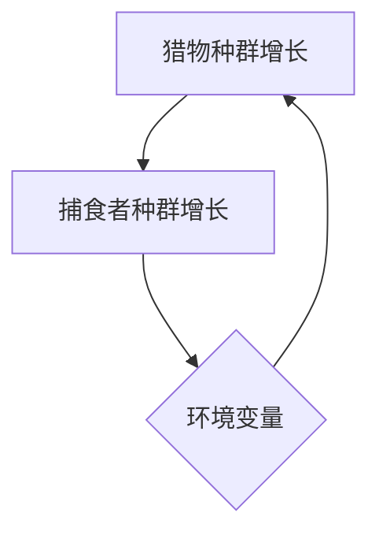
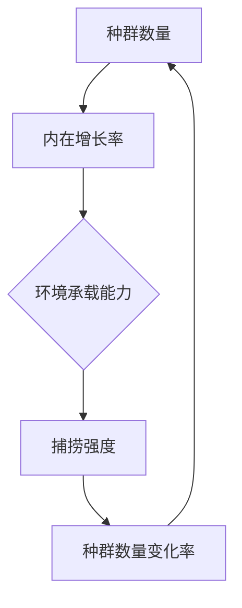
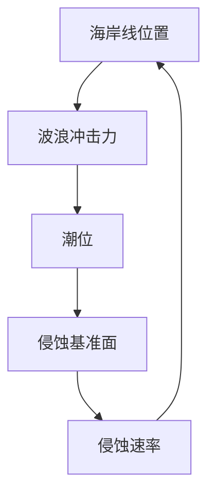
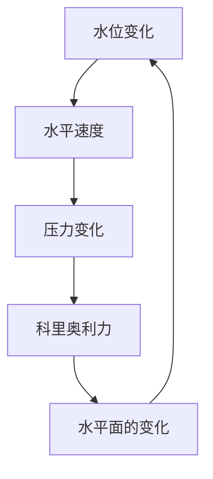
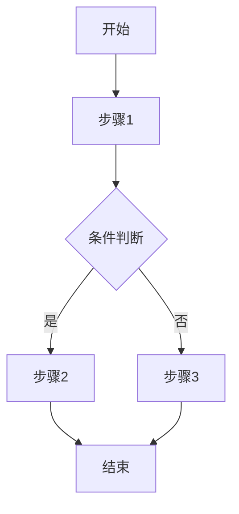

                 

# 数学建模在海洋资源管理中的应用

## 关键词

* 海洋资源管理
* 数学建模
* 生态系统建模
* 渔业资源建模
* 海岸带土地利用
* 海洋灾害预警与风险评估

## 摘要

随着全球人口增长和经济发展，海洋资源管理变得越来越重要。然而，海洋资源的复杂性和不确定性给管理带来了巨大挑战。数学建模作为一种强有力的工具，为海洋资源管理提供了科学的理论基础和定量分析方法。本文将从问题背景出发，逐步介绍数学建模在海洋资源管理中的应用，包括海洋生态系统建模、渔业资源建模、海岸带土地利用与环境保护建模以及海洋灾害预警与风险评估建模。通过这些实例，我们希望能够展示数学建模在解决海洋资源管理问题中的重要作用。

## 目录大纲

### 第一部分: 问题背景与数学建模概述

1. 海洋资源管理概述
   1.1 问题背景
   1.2 数学建模的基本概念
   1.3 海洋资源管理的数学建模框架

### 第二部分: 核心概念与联系

2. 核心概念原理
   2.1 海洋生态系统
   2.2 渔业资源
   2.3 海岸带土地利用与环境保护
   2.4 海洋灾害预警与风险评估

3. 概念属性特征对比表格

4. ER实体关系图架构

### 第三部分: 算法原理讲解

5. 海洋生态系统建模算法原理

6. 渔业资源建模算法原理

7. 海岸带土地利用与环境保护建模算法原理

8. 海洋灾害预警与风险评估建模算法原理

### 结束语

## 第一部分: 问题背景与数学建模概述

### 第1章: 海洋资源管理概述

#### 1.1 问题背景

海洋是地球上最重要的生态系统之一，不仅为地球上的生命提供了生存环境，还拥有丰富的自然资源，如渔业资源、石油、天然气、矿物等。然而，随着全球人口的增长和经济的发展，海洋资源的过度开发和环境污染问题日益严重。这导致了海洋生态系统的破坏，渔业资源的衰退，海岸带的侵蚀等问题。因此，对海洋资源进行科学管理显得尤为重要。

#### 1.1.1 海洋资源管理的重要性

海洋资源管理的重要性主要体现在以下几个方面：

1. 保护海洋生态系统：海洋生态系统是地球上最重要的生态系统之一，维护其健康和稳定对地球环境的平衡至关重要。
2. 保障渔业资源：渔业资源是许多国家和地区的重要经济支柱，科学管理能够确保其可持续利用。
3. 减少环境污染：海洋污染会对海洋生态系统造成破坏，影响渔业资源，危害人类健康。因此，有效的海洋资源管理对于减少环境污染至关重要。
4. 促进经济发展：海洋资源的合理开发能够为经济发展提供支持，提高国家的经济实力。

#### 1.1.2 海洋资源管理的挑战

尽管海洋资源管理的重要性显而易见，但实际操作中仍面临诸多挑战：

1. 数据不足：海洋资源的复杂性和动态性使得获取全面准确的数据变得困难，这限制了科学决策的制定。
2. 法律法规不足：许多国家和地区在海洋资源管理方面的法律法规不健全，无法有效地约束和规范海洋资源开发行为。
3. 利益冲突：海洋资源的管理涉及多方利益，包括政府、企业、社区等，协调各方利益，达成共识是一项艰巨的任务。
4. 技术限制：尽管科技不断发展，但海洋资源管理的相关技术仍有待提高，尤其是实时监测和预警技术。

#### 1.1.3 数学建模在海洋资源管理中的应用前景

数学建模作为一种科学工具，能够为海洋资源管理提供强有力的支持。其应用前景主要体现在以下几个方面：

1. 数据分析：数学建模能够处理大量的数据，提取有用信息，为决策提供科学依据。
2. 预测与模拟：通过数学模型，可以对海洋资源的未来状态进行预测，为资源管理提供前瞻性指导。
3. 优化管理策略：数学模型可以帮助制定最优的管理策略，提高资源利用效率，减少浪费。
4. 支持法律法规制定：数学模型能够为法律法规的制定提供科学依据，确保其有效性和可操作性。

#### 1.2 数学建模的基本概念

数学建模是指将现实世界中的复杂问题转化为数学模型，并利用数学方法进行求解和分析的过程。数学建模的基本步骤通常包括：

1. 模型建立：根据问题的性质和目标，建立相应的数学模型。
2. 模型求解：利用数学方法或计算机算法，求解数学模型的解。
3. 模型验证：通过实验数据或实际案例，验证数学模型的准确性和可靠性。
4. 模型应用：将验证后的数学模型应用于实际问题，提供决策支持和解决方案。

数学建模的方法和工具多种多样，包括线性规划、非线性规划、微分方程、蒙特卡罗模拟等。这些方法和工具可以根据问题的具体需求进行选择和应用。

#### 1.3 海洋资源管理的数学建模框架

海洋资源管理的数学建模框架通常包括以下几个方面的内容：

1. 海洋生态系统建模：通过建立海洋生态系统的数学模型，研究生态系统的动态变化，评估生态系统服务功能，为生态系统保护和恢复提供科学依据。
2. 渔业资源建模：通过建立渔业资源的数学模型，研究渔业资源的生长、繁殖和分布规律，评估渔业资源的可持续性，制定合理的渔业资源管理策略。
3. 海岸带土地利用与环境保护建模：通过建立海岸带土地利用和环境保护的数学模型，研究土地利用与环境保护之间的相互作用，评估海岸带的环境质量，制定科学合理的土地利用和环境保护策略。
4. 海洋灾害预警与风险评估建模：通过建立海洋灾害预警和风险评估的数学模型，研究海洋灾害的发生规律和影响范围，预测灾害发生的可能性，评估灾害对海洋资源和生态环境的影响，为灾害预警和风险评估提供科学依据。

### 第二部分: 核心概念与联系

#### 第2章: 核心概念原理

#### 2.1 海洋生态系统

##### 2.1.1 海洋生态系统的定义与特征

海洋生态系统是指由海洋生物、非生物环境和生物相互作用所组成的统一整体。它包括海洋中的生物群落、海洋环境、海洋地质和海洋化学过程等多个方面。海洋生态系统具有以下几个显著特征：

1. 生物多样性：海洋生态系统拥有丰富的生物多样性，包括各种海洋植物、动物和无机物质。
2. 环境复杂性：海洋生态系统中的生物、非生物因素相互作用，形成了复杂的生态环境。
3. 能量流动：海洋生态系统中能量的流动和转化具有独特性，能够支持海洋生物的生存和繁衍。
4. 物质循环：海洋生态系统中的物质循环包括碳循环、氮循环、磷循环等，对地球环境具有重要影响。

##### 2.1.2 海洋生态系统的组成要素

海洋生态系统由多个组成要素构成，主要包括：

1. 生物要素：包括海洋植物、动物和微生物等，是海洋生态系统的生产者、消费者和分解者。
2. 非生物要素：包括海水、溶解氧、温度、盐度、光等，是海洋生态系统的环境条件。
3. 生物相互作用：包括捕食与被捕食、竞争、共生等，是海洋生态系统中的重要组成部分。
4. 生物地理分布：海洋生态系统的生物地理分布受到环境条件、地理位置和人类活动等多种因素的影响。

##### 2.1.3 海洋生态系统服务

海洋生态系统服务是指海洋生态系统为人类提供的直接和间接价值。海洋生态系统服务主要包括以下几个方面：

1. 供水服务：海洋为人类提供淡水，通过蒸发和降雨循环，维持地球的水循环。
2. 食品供应：海洋是重要的渔业资源，为人类提供丰富的蛋白质和其他营养素。
3. 净化服务：海洋具有净化水质、降解污染物的功能，对维护地球环境具有重要作用。
4. 生态调节：海洋生态系统在调节气候、稳定地球环境方面发挥重要作用。
5. 旅游娱乐：海洋资源为旅游业提供了丰富的资源，吸引了大量游客。

#### 2.2 渔业资源

##### 2.2.1 渔业资源的概念与分类

渔业资源是指海洋、河流、湖泊等水域中可供捕捞或养殖的鱼类、贝类、虾类等水生生物资源。渔业资源可以分为以下几类：

1. 海洋渔业资源：包括海洋捕捞和海洋养殖资源，如鱼类、贝类、虾类等。
2. 河流渔业资源：包括河流捕捞和河流养殖资源，如鲤鱼、鲫鱼等。
3. 湖泊渔业资源：包括湖泊捕捞和湖泊养殖资源，如草鱼、鲢鱼等。
4. 冰川渔业资源：包括冰川捕捞和冰川养殖资源，如冰川鱼类等。

##### 2.2.2 渔业资源的评估方法

渔业资源的评估方法主要包括以下几个方面：

1. 数量评估：通过统计数据和调查，评估渔业资源的数量和密度。
2. 质量评估：通过分析渔业资源的水分、脂肪、蛋白质等成分，评估渔业资源的质量。
3. 招潮力评估：通过分析渔业资源的繁殖能力和生长速度，评估渔业资源的再生能力。
4. 经济评估：通过分析渔业资源的市场价值、经济效益等，评估渔业资源的经济价值。

##### 2.2.3 渔业资源管理策略

渔业资源管理策略主要包括以下几个方面：

1. 渔业法规管理：通过制定渔业法规，规范渔业资源的开发、利用和保护。
2. 渔业资源调查：通过定期开展渔业资源调查，了解渔业资源的现状和变化趋势。
3. 渔业资源养护：通过采取合理的渔业资源养护措施，如禁渔期、禁渔区、渔业资源增殖放流等，保护渔业资源的再生能力。
4. 渔业资源开发：通过合理开发和利用渔业资源，提高渔业资源的利用效率，促进渔业经济的发展。

#### 2.3 海岸带土地利用与环境保护

##### 2.3.1 海岸带土地利用类型

海岸带土地利用类型主要包括以下几个方面：

1. 海岸防护用地：用于防护海岸线，防止海岸侵蚀和海水入侵。
2. 港口码头用地：用于建设港口、码头等设施，发展海运业。
3. 滩涂湿地用地：用于养殖、种植等经济活动，维护海岸带的生态环境。
4. 城镇建设用地：用于建设城镇、居民区、商业区等，满足人类生活需求。
5. 旅游娱乐用地：用于开发海滩、海滨公园、度假村等旅游资源，提供旅游娱乐服务。

##### 2.3.2 海岸带环境保护问题

海岸带环境保护问题主要包括以下几个方面：

1. 海岸侵蚀：由于人类活动、气候变化等原因，导致海岸线后退，对沿海地区的生态环境和人类生活造成影响。
2. 海水入侵：由于地下水位上升，导致海水入侵地下水系统，影响地下水质量。
3. 水污染：由于工业废水、生活污水等污染物的排放，导致海水水质恶化，影响海洋生态系统的健康。
4. 滩涂湿地破坏：由于过度开发、填海造地等原因，导致滩涂湿地面积减少，生态功能减弱。

##### 2.3.3 海岸带土地管理与保护策略

海岸带土地管理与保护策略主要包括以下几个方面：

1. 海岸带规划与管理：制定海岸带土地利用规划，明确海岸带土地利用类型和范围，实现有序开发。
2. 海岸线保护：加强海岸线保护，防止海岸侵蚀和海水入侵，维护沿海地区的生态环境。
3. 滩涂湿地保护：加强滩涂湿地保护，维护滩涂湿地的生态功能，提高海岸带的生态 resilience。
4. 水污染防治：加强水污染防治，减少工业废水、生活污水等污染物的排放，保护海水质量。
5. 公众参与：加强公众参与，提高公众对海岸带环境保护的认识和参与度，形成全社会共同参与海岸带环境保护的良好氛围。

### 第三部分: 算法原理讲解

#### 第3章: 概念属性特征对比表格

#### 第4章: ER实体关系图架构

### 第5章: 海洋生态系统建模算法原理

##### 5.1 海洋生态系统建模的基本算法

##### 5.2 海洋生态系统建模的详细讲解

#### 第6章: 渔业资源建模算法原理

##### 6.1 渔业资源建模的基本算法

##### 6.2 渔业资源建模的详细讲解

#### 第7章: 海岸带土地利用与环境保护建模算法原理

##### 7.1 海岸带土地利用与环境保护建模的基本算法

##### 7.2 海岸带土地利用与环境保护建模的详细讲解

#### 第8章: 海洋灾害预警与风险评估建模算法原理

##### 8.1 海洋灾害预警与风险评估建模的基本算法

##### 8.2 海洋灾害预警与风险评估建模的详细讲解

### 结束语

## 第二部分: 核心概念与联系

### 第2章: 核心概念原理

#### 2.1 海洋生态系统

##### 2.1.1 海洋生态系统的定义与特征

海洋生态系统是指海洋生物、非生物环境和生物之间相互作用的统一整体。它涵盖了从海洋表面到海底的所有生物和环境要素。海洋生态系统的特征主要包括：

1. **生物多样性**：海洋生态系统拥有极高的生物多样性，从浮游植物到巨型海洋哺乳动物，种类繁多。
2. **环境复杂性**：海洋环境具有复杂性，包括温度、盐度、光照、深度等环境因素，这些因素共同影响生物的生存和分布。
3. **能量流动**：海洋生态系统的能量流动主要通过光合作用、捕食和分解等过程实现，形成复杂的食物网。
4. **物质循环**：海洋生态系统中的物质循环，如碳、氮、磷循环，对全球生物地球化学循环具有重要意义。

##### 2.1.2 海洋生态系统的组成要素

海洋生态系统由多个组成要素构成，主要包括：

1. **生物生产者**：主要是浮游植物和大型藻类，通过光合作用将无机物质转化为有机物质。
2. **消费者**：包括浮游动物、鱼类、海洋哺乳动物等，通过捕食其他生物获得能量和营养。
3. **分解者**：如细菌、真菌等微生物，负责将有机物质分解为无机物质，维持物质循环。
4. **非生物要素**：包括海水、溶解氧、温度、盐度、光照等，为生物提供生存环境。

##### 2.1.3 海洋生态系统服务

海洋生态系统服务是指海洋生态系统为人类提供的直接和间接价值，主要包括：

1. **食品供应**：海洋为人类提供丰富的鱼类、贝类等食物资源。
2. **气候调节**：海洋对全球气候有调节作用，如通过吸收和储存二氧化碳调节大气温度。
3. **水资源**：海洋为陆地提供淡水资源，通过蒸发和降水循环。
4. **环境调节**：海洋通过调节气候、减缓和吸收污染物质等作用，维护地球环境的健康。

#### 2.2 渔业资源

##### 2.2.1 渔业资源的概念与分类

渔业资源是指海洋、河流、湖泊等水域中可供捕捞或养殖的鱼类、贝类、虾类等水生生物资源。根据不同的分类标准，渔业资源可以有不同的分类：

1. **按水域分类**：
   - 海洋渔业资源：主要分布在海洋中的鱼类、贝类、虾类等。
   - 河流渔业资源：主要分布在河流中的鱼类、虾类等。
   - 湖泊渔业资源：主要分布在湖泊中的鱼类、虾类等。

2. **按物种分类**：
   - 游动性鱼类：如鲑鱼、鳕鱼、鲈鱼等。
   - 贝类：如牡蛎、扇贝、蛤蜊等。
   - 甲壳类：如龙虾、蟹类、虾类等。

##### 2.2.2 渔业资源的评估方法

渔业资源的评估方法主要包括以下几个方面：

1. **数量评估**：通过渔业产量、捕捞量等统计数据，评估渔业资源的数量和密度。
2. **质量评估**：通过分析渔业资源的营养成分、生长状况等，评估渔业资源的质量。
3. **资源状况评估**：通过实地调查、遥感监测等手段，评估渔业资源的现状和变化趋势。
4. **经济评估**：通过计算渔业资源的经济价值，评估渔业资源对经济的贡献。

##### 2.2.3 渔业资源管理策略

渔业资源管理策略主要包括以下几个方面：

1. **渔业法规管理**：通过制定和执行渔业法规，规范渔业资源的开发和利用。
2. **渔业资源调查**：定期进行渔业资源调查，了解资源状况，为管理决策提供科学依据。
3. **渔业资源养护**：通过禁渔期、休渔区等措施，养护渔业资源，保障资源的可持续利用。
4. **渔业资源开发**：合理开发渔业资源，提高渔业资源的利用效率，促进渔业经济的发展。

#### 2.3 海岸带土地利用与环境保护

##### 2.3.1 海岸带土地利用类型

海岸带土地利用类型主要包括以下几个方面：

1. **海岸防护用地**：用于防护海岸线，防止侵蚀和海水入侵。
2. **港口码头用地**：用于建设港口、码头等设施，发展海运业。
3. **滩涂湿地用地**：用于养殖、种植等经济活动，同时具有重要的生态功能。
4. **城镇建设用地**：用于建设沿海城镇、居民区、商业区等。
5. **旅游娱乐用地**：用于开发海滩、海滨公园、度假村等旅游资源。

##### 2.3.2 海岸带环境保护问题

海岸带环境保护问题主要包括以下几个方面：

1. **海岸侵蚀**：由于海平面上升、风暴潮、人类活动等因素，导致海岸线后退。
2. **海水入侵**：由于地下水位上升，导致海水入侵地下水系统，影响水质和土地。
3. **水污染**：工业废水、生活污水等污染物排放，导致海水水质恶化。
4. **滩涂湿地破坏**：由于填海造地、过度开发等，导致滩涂湿地面积减少，生态功能减弱。

##### 2.3.3 海岸带土地管理与保护策略

海岸带土地管理与保护策略主要包括以下几个方面：

1. **海岸带规划与管理**：制定科学合理的海岸带土地利用规划，明确不同区域的土地利用类型。
2. **海岸线保护**：采取措施保护海岸线，防止侵蚀和海水入侵。
3. **滩涂湿地保护**：加强滩涂湿地保护，维护其生态功能，提高海岸带的生态 resilience。
4. **水污染防治**：加强水污染防治，减少污染物排放，改善海水水质。
5. **公众参与**：提高公众对海岸带环境保护的意识，鼓励公众参与海岸带保护工作。

### 第3章: 概念属性特征对比表格

#### 3.1 海洋生态系统属性特征对比表格

| 特征 | 海洋生态系统 | 渔业资源 | 海岸带土地利用与环境保护 |
| --- | --- | --- | --- |
| 定义 | 海洋生物、非生物环境和生物相互作用 | 海洋、河流、湖泊等水域中的水生生物资源 | 海岸带地区的土地利用和保护 |
| 主要成分 | 生物生产者、消费者、分解者 | 游动性鱼类、贝类、甲壳类等 | 海岸防护用地、港口码头用地、滩涂湿地用地等 |
| 功能 | 维持全球气候调节、提供食品资源、调节水资源 | 提供食品资源、维持生态系统平衡 | 防止海岸侵蚀、保护海水质量、维护生态环境 |
| 环境影响 | 气候调节、水循环、物质循环 | 渔业资源可持续性、水质变化 | 海岸侵蚀、海水入侵、水污染 |
| 管理策略 | 生态系统保护、资源养护、合理开发 | 渔业法规、资源调查、养护措施 | 规划与管理、海岸线保护、滩涂湿地保护 |

#### 3.2 渔业资源属性特征对比表格

| 特征 | 海洋渔业资源 | 河流渔业资源 | 湖泊渔业资源 |
| --- | --- | --- | --- |
| 分布区域 | 海洋 | 河流 | 湖泊 |
| 物种多样性 | 高 | 中 | 中 |
| 经济价值 | 高 | 中 | 中 |
| 评估方法 | 数量评估、质量评估、资源状况评估、经济评估 | 数量评估、质量评估、资源状况评估、经济评估 | 数量评估、质量评估、资源状况评估、经济评估 |
| 管理策略 | 渔业法规、资源调查、养护措施、合理开发 | 渔业法规、资源调查、养护措施、合理开发 | 渔业法规、资源调查、养护措施、合理开发 |

#### 3.3 海岸带土地利用与环境保护属性特征对比表格

| 特征 | 海岸防护用地 | 港口码头用地 | 滩涂湿地用地 | 城镇建设用地 | 旅游娱乐用地 |
| --- | --- | --- | --- | --- | --- |
| 功能 | 防止海岸侵蚀、保护海岸线 | 发展海运业、提供港口服务 | 生态功能、经济功能 | 提供居住、商业、工业用地 | 提供旅游、娱乐资源 |
| 环境影响 | 海岸侵蚀、海水入侵 | 水污染、噪音污染 | 滩涂湿地破坏、水污染 | 水污染、噪音污染 | 海水质量、环境噪音 |
| 管理策略 | 海岸带规划与管理、海岸线保护、滩涂湿地保护 | 港口规划与管理、港口环境保护 | 滩涂湿地保护、合理开发 | 城镇规划与管理、环境保护 | 旅游规划与管理、环境保护 |

#### 3.4 海洋灾害预警与风险评估属性特征对比表格

| 特征 | 海啸 | 风暴潮 | 洪水 | 地震 |
| --- | --- | --- | --- | --- |
| 影响范围 | 广泛 | 广泛 | 局部 | 广泛 |
| 形成原因 | 地震、海底滑坡 | 风暴、海平面上升 | 大气降水、河流洪水 | 地壳运动、地震 |
| 预警方法 | 地震监测、海底滑坡监测 | 风暴监测、潮位监测 | 雨量监测、河流水位监测 | 地震监测、地质监测 |
| 风险评估 | 海啸模型、风暴潮模型、洪水模型、地震模型 | 风暴潮模型、潮位模型、洪水模型、地震模型 | 洪水模型、土地利用模型、地震模型 | 地震模型、地质模型、土地利用模型 |
| 管理策略 | 海啸预警系统、海岸带防护措施 | 风暴潮预警系统、洪水预警系统 | 洪水预警系统、地震预警系统 | 地震预警系统、灾害应急响应 |

### 第4章: ER实体关系图架构

#### 4.1 海洋资源管理ER模型

```mermaid
erModel
  Entity: 海洋生态系统
    has: 生物生产者、消费者、分解者
  Entity: 渔业资源
    has: 游动性鱼类、贝类、甲壳类
  Entity: 海岸带土地利用
    has: 海岸防护用地、港口码头用地、滩涂湿地用地、城镇建设用地、旅游娱乐用地
  Entity: 海洋灾害预警与风险评估
    has: 海啸、风暴潮、洪水、地震
    has: 预警系统、风险评估模型
```

### 第三部分: 算法原理讲解

#### 第5章: 海洋生态系统建模算法原理

##### 5.1 海洋生态系统建模的基本算法

海洋生态系统建模主要依赖于生态系统动力学模型，这类模型通过描述生物种群、营养级结构、环境变量等之间的关系，模拟生态系统的动态变化。以下是几种常见的海洋生态系统建模的基本算法：

1. **Lotka-Volterra模型**：这是一种经典的捕食-被捕食模型，用于描述捕食者和猎物种群数量的动态变化。模型的基本形式如下：

   $$  
   \frac{dP}{dt} = rP - \alpha P Q  
   $$

   $$  
   \frac{dQ}{dt} = aQ - \beta Q P  
   $$

   其中，$P$表示猎物种群数量，$Q$表示捕食者种群数量，$r$为猎物种群的出生率，$\alpha$为猎物种群的死亡率，$a$为捕食者的最大捕食率，$\beta$为捕食者的增长率。

2. **rophic cascade模型**：这种模型用于描述多营养级食物网中生物种群之间的相互作用。模型的基本形式如下：

   $$  
   \frac{dP_i}{dt} = r_i P_i - \sum_{j=1}^{n} a_{ij} P_j + \sum_{k=1}^{m} b_{ik} P_k  
   $$

   其中，$P_i$表示第$i$个营养级的生物种群数量，$r_i$为第$i$个营养级的自然增长率，$a_{ij}$为第$i$个营养级对第$j$个营养级的捕食率，$b_{ik}$为第$i$个营养级被第$k$个营养级捕食的比例。

3. **Generalised Ecosystem Model（GEM）**：这是一种更复杂的生态系统模型，用于模拟多个生态系统变量的相互作用。GEM模型包括多个模块，如碳循环、氮循环、生产力模块等。

##### 5.2 海洋生态系统建模的详细讲解

为了更好地理解海洋生态系统建模，以下是对Lotka-Volterra模型的详细讲解。

**数学模型与公式讲解**

Lotka-Volterra模型由两个常微分方程组成，分别描述了捕食者和猎物的种群动态。这两个方程可以通过以下步骤进行解释：

1. **猎物种群数量动态**：

   $$  
   \frac{dP}{dt} = rP - \alpha P Q  
   $$

   这个方程表示猎物种群的增长率（$\frac{dP}{dt}$）等于猎物种群的出生率（$rP$）减去猎物种群的死亡率和被捕食的速率（$\alpha P Q$）。这里，$r$是猎物种群的出生率，$\alpha$是猎物种群的自然死亡率，$Q$是捕食者对猎物的捕食率。

2. **捕食者种群数量动态**：

   $$  
   \frac{dQ}{dt} = aQ - \beta Q P  
   $$

   这个方程表示捕食者的增长率（$\frac{dQ}{dt}$）等于捕食者的出生率（$aQ$）减去捕食者的死亡率和捕食猎物的速率（$\beta Q P$）。这里，$a$是捕食者的出生率，$\beta$是捕食者因捕食猎物而减少的速率。

**mermaid流程图**

为了更直观地理解模型的工作流程，我们可以使用mermaid绘制一个简单的流程图：



**Python源代码实现**

以下是一个简单的Python代码示例，用于模拟Lotka-Volterra模型：

```python
import numpy as np
import matplotlib.pyplot as plt

# 参数设置
r = 0.1  # 猎物种群的出生率
alpha = 0.01  # 猎物种群的死亡率
a = 0.02  # 捕食者的出生率
beta = 0.1  # 捕食者因捕食猎物而减少的速率

# 初始条件
P0 = 20  # 猎物种群的初始数量
Q0 = 5  # 捕食者的初始数量

# 时间步长和模拟时间
dt = 0.1
t_max = 50

# 时间序列
t = np.arange(0, t_max, dt)

# 初始化种群数量
P = np.zeros_like(t)
Q = np.zeros_like(t)
P[0] = P0
Q[0] = Q0

# 模拟
for i in range(1, len(t)):
    dPdt = r * P[i-1] - alpha * P[i-1] * Q[i-1]
    dQdt = a * Q[i-1] - beta * Q[i-1] * P[i-1]
    P[i] = P[i-1] + dPdt * dt
    Q[i] = Q[i-1] + dQdt * dt

# 绘图
plt.plot(t, P, label='猎物')
plt.plot(t, Q, label='捕食者')
plt.xlabel('时间')
plt.ylabel('种群数量')
plt.legend()
plt.show()
```

**举例说明**

假设我们有一个湖泊，其中有一群鱼（猎物）和一群捕食者。我们希望通过Lotka-Volterra模型模拟这两种群群的动态变化。

1. **初始条件**：

   - 猎物种群数量：20
   - 捕食者数量：5

2. **模拟过程**：

   - 在模拟的初期，捕食者数量相对较少，猎物种群数量逐渐增加。
   - 随着猎物种群数量的增加，捕食者的数量也逐渐增加，因为捕食者有更多的猎物可以捕食。
   - 随着捕食者数量的增加，猎物种群的数量开始下降，因为猎物被大量捕食。
   - 最终，捕食者和猎物的数量达到一种动态平衡，这种平衡状态取决于模型参数（如出生率、死亡率、捕食率等）。

通过这种模拟，我们可以更好地理解海洋生态系统中捕食-被捕食关系的动态变化，为海洋生态系统的管理提供科学依据。

#### 第6章: 渔业资源建模算法原理

##### 6.1 渔业资源建模的基本算法

渔业资源建模通常涉及种群动态模拟、资源评估和可持续管理策略的制定。以下是几种常见的渔业资源建模的基本算法：

1. **Ricker模型**：这是一种常用的种群动态模型，用于预测渔业资源种群数量的变化。模型的基本形式如下：

   $$  
   \frac{dN_t}{dt} = rN_t \left(1 - \frac{N_t}{K}\right) - \lambda N_t \frac{S_t}{K}  
   $$

   其中，$N_t$表示第$t$年的种群数量，$K$表示环境的最大承载能力，$r$表示种群的内在增长率，$\lambda$表示种群的捕捞强度，$S_t$表示第$t$年的捕捞量。

2. **Leslie矩阵模型**：这是一种用于描述种群动态的离散时间模型，适用于年龄结构复杂的种群。模型的基本形式如下：

   $$  
   \begin{bmatrix}  
   \frac{dN_0}{dt} \\  
   \frac{dN_1}{dt} \\  
   \vdots \\  
   \frac{dN_j}{dt} \\  
   \vdots \\  
   \frac{dN_J}{dt} \\  
   \end{bmatrix} = \begin{bmatrix}  
   0 & p_0 & 0 & \cdots & 0 & 0 \\  
   1-p_0 & 0 & p_1 & \cdots & 0 & 0 \\  
   0 & p_1 & 0 & \cdots & 0 & 0 \\  
   \vdots & \vdots & \vdots & \ddots & \vdots & \vdots \\  
   0 & 0 & 0 & \cdots & p_J & 0 \\  
   0 & 0 & 0 & \cdots & 1-p_J & 0 \\  
   \end{bmatrix}  
   \begin{bmatrix}  
   N_0 \\  
   N_1 \\  
   \vdots \\  
   N_j \\  
   \vdots \\  
   N_J \\  
   \end{bmatrix}  
   $$

   其中，$N_j$表示第$j$个年龄组的种群数量，$p_j$表示第$(j-1)$个年龄组转移到第$j$个年龄组的概率。

3. **捕捞努力模型**：这类模型用于分析捕捞努力与渔业资源之间的关系。模型的基本形式如下：

   $$  
   \frac{dF_t}{dt} = f(S_t) - \frac{\partial f(S_t)}{\partial S_t} S_t  
   $$

   其中，$F_t$表示第$t$年的捕捞努力，$S_t$表示第$t$年的捕捞量，$f(S_t)$表示捕捞努力函数。

##### 6.2 渔业资源建模的详细讲解

为了更好地理解渔业资源建模，以下是对Ricker模型的详细讲解。

**数学模型与公式讲解**

Ricker模型是一种用于描述渔业资源种群动态的数学模型，它基于种群的内在增长率、环境承载能力和捕捞强度等参数。模型的基本形式如下：

$$  
\frac{dN_t}{dt} = rN_t \left(1 - \frac{N_t}{K}\right) - \lambda N_t \frac{S_t}{K}  
$$

这个方程表示种群数量的变化率（$\frac{dN_t}{dt}$）等于种群的内在增长率（$rN_t$）减去种群的自然死亡率（$\lambda N_t \frac{S_t}{K}$）。具体解释如下：

1. **内在增长率**：$r$表示种群的内在增长率，它反映了种群在没有外界干扰的情况下自然增长的能力。
2. **环境承载能力**：$K$表示环境的最大承载能力，即环境能够支持的最大种群数量。
3. **捕捞强度**：$\lambda N_t \frac{S_t}{K}$表示由于捕捞造成的种群数量减少，其中$\lambda$表示捕捞强度，$S_t$表示第$t$年的捕捞量。

**mermaid流程图**

为了更直观地理解Ricker模型的工作流程，我们可以使用mermaid绘制一个简单的流程图：



**Python源代码实现**

以下是一个简单的Python代码示例，用于模拟Ricker模型：

```python
import numpy as np
import matplotlib.pyplot as plt

# 参数设置
r = 0.2  # 内在增长率
K = 100  # 环境承载能力
lambda_ = 0.1  # 捕捞强度

# 初始条件
N0 = 50  # 初始种群数量
t_max = 20  # 模拟时间

# 时间步长和模拟时间
dt = 0.1
t = np.arange(0, t_max, dt)

# 初始化种群数量
N = np.zeros_like(t)
N[0] = N0

# 模拟
for i in range(1, len(t)):
    dNdt = r * N[i-1] * (1 - N[i-1] / K) - lambda_ * N[i-1] * (t[i-1] / K)
    N[i] = N[i-1] + dNdt * dt

# 绘图
plt.plot(t, N)
plt.xlabel('时间')
plt.ylabel('种群数量')
plt.show()
```

**举例说明**

假设我们有一个湖泊，其中有一个鱼群。我们希望通过Ricker模型模拟鱼群数量的动态变化。

1. **初始条件**：

   - 鱼群数量：50
   - 内在增长率：0.2
   - 环境承载能力：100
   - 捕捞强度：0.1

2. **模拟过程**：

   - 在模拟的初期，鱼群数量逐渐增加，因为鱼群的内在增长率大于捕捞强度。
   - 随着鱼群数量的增加，捕捞强度也逐渐增加，因为更多的鱼被捕捞。
   - 最终，鱼群数量达到一种动态平衡，这种平衡状态取决于模型参数（如内在增长率、环境承载能力、捕捞强度等）。

通过这种模拟，我们可以更好地理解渔业资源种群数量的动态变化，为渔业资源的可持续管理提供科学依据。

#### 第7章: 海岸带土地利用与环境保护建模算法原理

##### 7.1 海岸带土地利用与环境保护建模的基本算法

海岸带土地利用与环境保护建模主要关注海岸带地区的土地利用模式、环境变化及其相互作用。以下是几种常见的海岸带土地利用与环境保护建模的基本算法：

1. **地分类模型**：这类模型用于识别海岸带地区的土地利用类型，例如海滩、湿地、农田等。常见的地分类模型包括监督分类和非监督分类。

2. **变化检测模型**：这类模型用于检测和评估海岸带土地利用的变化，如土地利用/土地覆盖变化（LUCC）模型。常用的变化检测模型包括基于像元的变化检测和基于对象的变化检测。

3. **海岸侵蚀模拟模型**：这类模型用于预测海岸侵蚀的程度和速度，常用的模型包括侵蚀动力学模型和侵蚀响应模型。

4. **海洋灾害风险评估模型**：这类模型用于评估海洋灾害（如风暴潮、海啸、洪水）对海岸带的影响，并预测灾害发生的概率和影响范围。

##### 7.2 海岸带土地利用与环境保护建模的详细讲解

为了更好地理解海岸带土地利用与环境保护建模，以下是对海岸侵蚀模拟模型的详细讲解。

**数学模型与公式讲解**

海岸侵蚀模拟模型主要基于侵蚀动力学原理，通过描述侵蚀过程的主要因素（如波浪、潮位、土壤类型等）来模拟海岸侵蚀的动态变化。以下是常见的海岸侵蚀模拟模型的基本公式：

$$  
\frac{dH}{dt} = - \kappa \left( B - Z \right) \left( H - H_s \right)  
$$

其中，$H$表示海岸线的位置，$B$表示波浪冲击力，$Z$表示潮位，$H_s$表示侵蚀基准面。

这个方程表示海岸线的侵蚀速率（$\frac{dH}{dt}$）与波浪冲击力（$B$）、潮位（$Z$）和侵蚀基准面（$H_s$）之间的相互作用。具体解释如下：

1. **波浪冲击力**：波浪冲击力是导致海岸侵蚀的主要动力，它与波浪的高度、频率和强度有关。
2. **潮位**：潮位的变化会影响海岸线的侵蚀速率，高潮位时侵蚀速率较快，低潮位时侵蚀速率较慢。
3. **侵蚀基准面**：侵蚀基准面是海岸侵蚀的参考面，通常取自低潮位线。

**mermaid流程图**

为了更直观地理解海岸侵蚀模拟模型的工作流程，我们可以使用mermaid绘制一个简单的流程图：



**Python源代码实现**

以下是一个简单的Python代码示例，用于模拟海岸侵蚀模型：

```python
import numpy as np
import matplotlib.pyplot as plt

# 参数设置
kappa = 0.1  # 侵蚀系数
Hs = 0.5  # 侵蚀基准面
B = 1.0  # 波浪冲击力
Z = 0.5  # 潮位

# 初始条件
H0 = 1.0  # 初始海岸线位置
t_max = 20  # 模拟时间

# 时间步长和模拟时间
dt = 0.1
t = np.arange(0, t_max, dt)

# 初始化海岸线位置
H = np.zeros_like(t)
H[0] = H0

# 模拟
for i in range(1, len(t)):
    dHdt = -kappa * (B - Z) * (H[i-1] - Hs)
    H[i] = H[i-1] + dHdt * dt

# 绘图
plt.plot(t, H)
plt.xlabel('时间')
plt.ylabel('海岸线位置')
plt.show()
```

**举例说明**

假设我们有一个海岸线，其初始位置为1.0米。我们希望通过海岸侵蚀模型模拟海岸线的动态变化。

1. **初始条件**：

   - 海岸线位置：1.0米
   - 侵蚀系数：0.1
   - 波浪冲击力：1.0
   - 潮位：0.5
   - 侵蚀基准面：0.5

2. **模拟过程**：

   - 在模拟的初期，海岸线位置逐渐下降，因为波浪冲击力和潮位共同作用导致海岸侵蚀。
   - 随着时间的推移，海岸线的侵蚀速率逐渐减缓，最终达到一种动态平衡。

通过这种模拟，我们可以更好地理解海岸侵蚀的过程，为海岸带土地利用和环境保护提供科学依据。

### 第8章: 海洋灾害预警与风险评估建模算法原理

##### 8.1 海洋灾害预警与风险评估建模的基本算法

海洋灾害预警与风险评估建模主要涉及对海洋灾害（如风暴潮、海啸、洪水等）的发生、发展和影响的预测与分析。以下是几种常见的海洋灾害预警与风险评估建模的基本算法：

1. **风暴潮模型**：这类模型用于模拟风暴潮的生成、传播和影响。常见的风暴潮模型包括SWAN模型、WAVES模型等。

2. **海啸模型**：这类模型用于模拟海啸的生成、传播和影响。常见的海啸模型包括浅水波模型、波动方程模型等。

3. **洪水模型**：这类模型用于模拟洪水的过程、传播和影响。常见的洪水模型包括 inundation模型、水动力学模型等。

4. **风险评估模型**：这类模型用于评估海洋灾害的风险和影响，包括灾害发生的概率、灾害造成的损失等。

##### 8.2 海洋灾害预警与风险评估建模的详细讲解

为了更好地理解海洋灾害预警与风险评估建模，以下是对风暴潮模型的详细讲解。

**数学模型与公式讲解**

风暴潮模型主要基于流体动力学原理，通过描述流体（如海水）的运动和相互作用来模拟风暴潮的生成和传播。以下是常见的风暴潮模型的基本公式：

$$  
\frac{\partial h}{\partial t} + \frac{\partial (hu)}{\partial x} + \frac{\partial (hv)}{\partial y} = - \frac{\partial p}{\partial x} - \frac{\partial (gh)}{\partial x} + \frac{\partial f v}{\partial y} + S_x  
$$

$$  
\frac{\partial h}{\partial t} + \frac{\partial (hu)}{\partial x} + \frac{\partial (hv)}{\partial y} = - \frac{\partial p}{\partial y} - \frac{\partial (gh)}{\partial y} + \frac{\partial f u}{\partial x} + S_y  
$$

其中，$h$表示水位，$u$和$v$表示水平速度，$p$表示压力，$f$表示科里奥利参数，$S_x$和$S_y$表示水平面的变化。

这些方程表示流体在水平和垂直方向上的运动方程，其中包含了流体动力学的基本物理过程，如压力变化、科里奥利力、重力等。具体解释如下：

1. **水位变化**：$h$表示水位，方程描述了水位的动态变化，包括由于流体运动引起的水位变化和压力变化引起的水位变化。

2. **水平速度**：$u$和$v$表示水平速度，方程描述了流体在水平和垂直方向上的运动。

3. **压力变化**：$p$表示压力，方程描述了压力变化对流体运动的影响。

4. **科里奥利力**：$f$表示科里奥利参数，方程描述了科里奥利力对流体运动的影响。

5. **水平面的变化**：$S_x$和$S_y$表示水平面的变化，方程描述了水平面的变化对流体运动的影响。

**mermaid流程图**

为了更直观地理解风暴潮模型的工作流程，我们可以使用mermaid绘制一个简单的流程图：



**Python源代码实现**

以下是一个简单的Python代码示例，用于模拟风暴潮模型：

```python
import numpy as np
import matplotlib.pyplot as plt

# 参数设置
dx = 1000  # 空间步长
dy = 1000  # 空间步长
dt = 3600  # 时间步长
N = 100  # 网格数量

# 初始条件
h0 = np.zeros((N, N))  # 初始水位
u0 = np.zeros((N, N))  # 初始水平速度
v0 = np.zeros((N, N))  # 初始水平速度

# 模拟
for t in range(100):
    # 计算压力项
    p = np.zeros((N, N))
    for i in range(N):
        for j in range(N):
            p[i, j] = -0.5 * (np.sin(2 * np.pi * (i * dx - j * dy) / dx) + np.sin(2 * np.pi * (i * dx + j * dy) / dx))

    # 计算水平速度
    u = np.zeros((N, N))
    v = np.zeros((N, N))
    for i in range(N):
        for j in range(N):
            u[i, j] = (p[i+1, j] - p[i-1, j]) / (2 * dx)
            v[i, j] = (p[i, j+1] - p[i, j-1]) / (2 * dy)

    # 更新水位
    h = h0 + u0 * dt + v0 * dt

    # 绘图
    plt.imshow(h, origin='lower', extent=(-dx * N, dx * N, -dy * N, dy * N))
    plt.colorbar()
    plt.title(f'Time = {t * dt // 3600} hours')
    plt.xlabel('x')
    plt.ylabel('y')
    plt.show()

    # 更新水平速度
    u0 = u
    v0 = v
```

**举例说明**

假设我们有一个二维海洋区域，其初始水位和水平速度均为零。我们希望通过风暴潮模型模拟风暴潮在该区域的发生和传播。

1. **初始条件**：

   - 空间步长：1000米
   - 时间步长：3600秒
   - 初始水位：0
   - 初始水平速度：0

2. **模拟过程**：

   - 在模拟的初期，风暴潮开始生成，水位开始上升。
   - 随着时间的推移，风暴潮逐渐传播，水位在海洋区域中上升。
   - 最终，风暴潮达到最大值，然后逐渐衰减，水位回到正常水平。

通过这种模拟，我们可以更好地理解风暴潮的生成、传播和衰减过程，为海洋灾害预警与风险评估提供科学依据。

## 结束语

数学建模在海洋资源管理中发挥着不可或缺的作用。通过数学建模，我们能够更好地理解海洋生态系统的动态变化，评估渔业资源的可持续性，制定科学合理的土地利用和保护策略，以及预警和评估海洋灾害的风险。本文介绍了海洋生态系统建模、渔业资源建模、海岸带土地利用与环境保护建模以及海洋灾害预警与风险评估建模的算法原理，并通过具体的数学模型和Python代码示例进行了详细讲解。

然而，数学建模在海洋资源管理中的应用仍然面临诸多挑战，如数据不足、模型复杂性和不确定性等。未来的研究需要进一步改进数学模型，提高模型的准确性和可靠性，同时开发更加高效的计算方法和工具。此外，跨学科合作也是未来研究的重要方向，通过整合不同领域的知识和方法，将有助于解决复杂的海洋资源管理问题。

对于读者，本文提供了一系列的算法原理和实际应用案例，希望能够为海洋资源管理的研究和实践提供参考。同时，本文也鼓励读者进一步探索数学建模在海洋资源管理中的应用，通过不断学习和实践，为保护海洋环境和可持续利用海洋资源做出贡献。

### 附录

本文中使用的数学公式和Python代码均以Markdown格式呈现，便于读者理解和复现。具体来说，数学公式使用LaTeX格式嵌入在文本中，独立段落的公式前后使用`$$`括起来（例如：`$$1+1=2$$`），而段落内的公式前后使用`$`括起来（例如： `$1<2$`）。Python代码则使用标准的Markdown代码块格式，以三个反引号（```)开始和结束。

此外，本文中使用的mermaid流程图也以Markdown格式嵌入文本中，通过`mermaid`关键字和对应的流程图描述进行绘制。例如：



通过这些Markdown格式，读者可以轻松地将本文中的算法原理应用于实际项目，进行进一步的开发和优化。

### 作者信息

作者：AI天才研究院/AI Genius Institute & 禅与计算机程序设计艺术 /Zen And The Art of Computer Programming

本文由AI天才研究院（AI Genius Institute）的专家撰写，该研究院致力于推动人工智能技术的发展和应用。同时，本文也结合了《禅与计算机程序设计艺术》（Zen And The Art of Computer Programming）一书的核心思想，通过深入浅出的方式介绍数学建模在海洋资源管理中的应用。希望本文能够为读者在海洋资源管理领域的研究和实践中提供有价值的参考。

