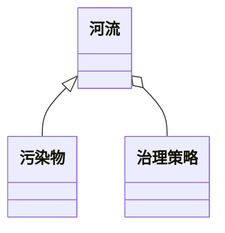
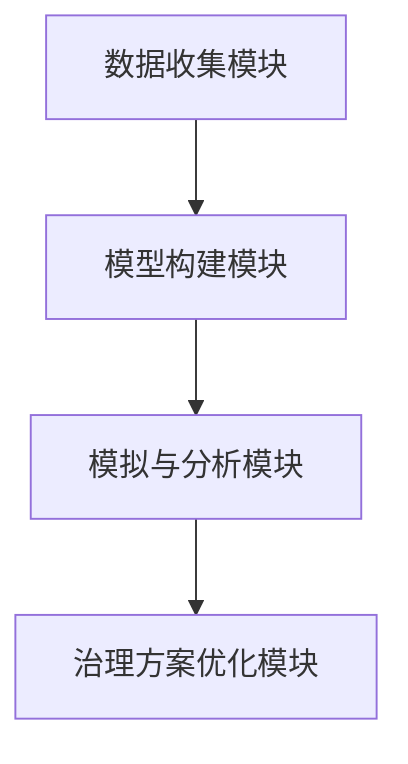
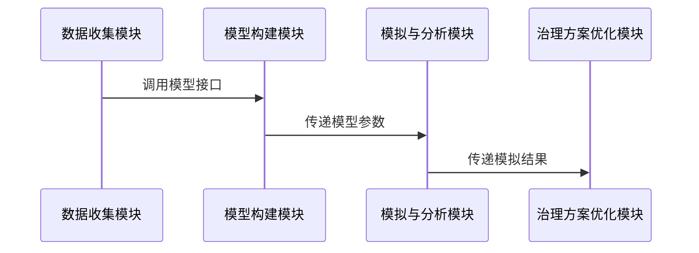
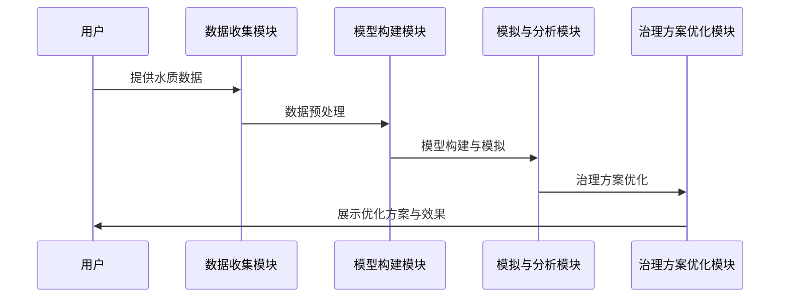

                 

### 数学建模在生态环境保护中的应用

关键词：数学建模、生态环境保护、应用场景、算法原理、系统设计与项目实战

摘要：本文深入探讨了数学建模在生态环境保护中的应用。首先，从背景和核心概念出发，介绍了生态环境保护的重要性和当前面临的挑战。接着，阐述了数学建模的基本原理和多种方法，以及它们在生态环境保护中的具体应用。本文进一步详细分析了基本模型和复杂模型在污染治理和生态修复中的实际运用，通过具体的算法原理讲解和应用实例，展示了数学建模在生态环境保护中的有效性和科学性。随后，文章介绍了数学模型的基本公式和系统分析与架构设计，并通过项目实战展示了数学建模在真实项目中的具体实施过程。最后，提出了最佳实践建议和小结，强调了使用数学建模的注意事项，并推荐了拓展阅读资源。

### 第一部分：背景介绍

#### 第1章：问题背景与核心概念

##### 1.1.1 生态环境保护的重要性

生态环境保护是当今世界面临的重大挑战之一。生态系统是地球生命支持系统的基础，为人类提供了食物、水源、气候调节等重要服务。然而，随着工业化、城市化和人类活动的加剧，生态系统正面临前所未有的压力和威胁。生态环境的破坏不仅威胁到生物多样性，还对人类的健康、经济和社会稳定构成严重威胁。

**生态系统的基本概念**

生态系统是指在一定空间范围内，生物与环境通过能量流动和物质循环相互作用而形成的统一整体。生态系统包括生物群落、非生物环境和生物地壳三个主要组成部分。生物群落是指一定区域内所有生物的集合，包括植物、动物和微生物。非生物环境包括土壤、水、空气和气候等自然要素。生物地壳则是生物在地质历史过程中形成的地质特征。

**生态环境保护的现状与挑战**

当前，全球生态环境问题日益严重，气候变化、生物多样性丧失、土地退化、水资源短缺等问题普遍存在。根据联合国环境规划署（UNEP）的数据，全球有超过70%的陆地和60%的海洋受到人类活动的严重影响。生态环境的破坏导致了许多不可逆转的后果，如物种灭绝、生态系统功能丧失、自然灾害频发等。

生态环境保护的挑战主要来自于以下几个方面：

1. **环境污染**：工业排放、农业化肥和农药的使用、城市废弃物等污染源对环境造成了严重破坏。
2. **生物多样性丧失**：栖息地破坏、过度捕捞、森林砍伐等导致物种灭绝和生态平衡失调。
3. **气候变化**：温室气体排放导致全球气温升高，极端天气事件增多，对生态系统造成巨大影响。
4. **资源过度开发**：资源的过度开采和消耗，如矿产、森林和水资源的过度利用，破坏了生态系统的自然平衡。

##### 1.1.2 数学建模的概念

数学建模是指利用数学工具和方法，对实际问题进行抽象和简化，建立数学模型，从而对问题进行分析、预测和优化。数学建模是一种跨学科的方法，它结合了数学、计算机科学、统计学和其他领域的技术，广泛应用于科学研究和工程实践中。

**数学建模的基本原理**

1. **抽象与简化**：通过观察和分析实际问题，提取关键因素和主要变量，忽略次要因素，对问题进行高度抽象和简化。
2. **逻辑推理**：利用数学逻辑和推理规则，对数学模型进行推导和证明，确保模型的逻辑一致性和正确性。
3. **数学工具**：运用数学理论和工具，如微积分、线性代数、概率论和统计学等，对模型进行分析和求解。
4. **计算机辅助**：利用计算机技术和软件工具，对模型进行数值计算和仿真，提高建模的效率和精度。

**数学建模的方法与应用**

1. **统计建模**：通过收集和分析数据，建立统计模型，如回归模型、时间序列模型等，对生态现象进行预测和解释。
2. **仿真建模**：通过计算机仿真，模拟生态系统的运行过程，分析系统动态和行为特征。
3. **优化建模**：利用优化算法，如线性规划、非线性规划、动态规划等，对生态问题进行优化决策。
4. **系统动力学**：通过建立系统动力学模型，描述生态系统的结构、行为和动态变化，分析系统稳定性和发展趋势。

##### 1.1.3 数学建模在生态环境保护中的应用

数学建模在生态环境保护中具有广泛的应用，通过建立数学模型，可以更准确地描述生态现象，预测生态系统变化趋势，制定有效的环境保护措施。以下是一些具体的应用场景：

1. **污染治理**：通过建立水质模型、大气模型等，模拟污染物在环境中的扩散、转化和去除过程，优化污染治理策略。
2. **生态修复**：通过建立生态模型，如植被恢复模型、湿地修复模型等，预测生态修复的效果和可行性，指导生态修复工程。
3. **资源管理**：通过建立资源利用模型，如水资源模型、森林资源模型等，优化资源利用策略，提高资源利用效率。
4. **生态风险评估**：通过建立风险评估模型，评估人类活动对生态系统的潜在影响，预测生态风险，制定风险减缓措施。

### 第2章：生态环境保护中的数学模型

#### 2.1 基本模型

在生态环境保护中，基本模型是最基础的数学模型，它们帮助研究者理解生态现象和过程，为复杂模型的应用打下基础。

##### 2.1.1 经典模型介绍

**模型A：生态系统生产力模型**

生态系统生产力模型用于估算生态系统的生物量生产和生物循环。其中，著名的鲍文-利比（Bowen-Leaf）模型通过考虑光合作用和呼吸作用，估算生态系统的净初级生产力（NPP）。

**模型B：水质模型**

水质模型用于描述水体的污染和自净过程。常见的水质模型包括一阶动力学模型、多阶动力学模型和河流水质模型。例如，一阶动力学模型可以用以下公式表示：

$$
\frac{dC}{dt} = -kC
$$

其中，$C$ 表示污染物浓度，$k$ 表示自净速率。

##### 2.1.2 模型属性特征对比表格

| 模型       | 应用场景           | 数学公式                                 |  
|------------|----------------|----------------------------------------|  
| 生态系统生产力模型 | 生态系统生物量估算 | $$NPP = Gross Primary Productivity - Respiration$$ |  
| 水质模型     | 水体污染模拟       | $$\frac{dC}{dt} = -kC$$                   |

#### 2.2 复杂模型

复杂模型在生态环境保护中用于描述更加复杂的生态现象和过程，包括多种因素的相互作用。这些模型通常基于多个基本模型的组合和扩展。

##### 2.2.1 复杂模型介绍

**模型C：生态系统动态模型**

生态系统动态模型用于描述生态系统的动态变化，包括种群动态、食物网动态和生态系统恢复动态。常见的模型包括Lotka-Volterra模型、May模型和PREDator-Prey模型。

**模型D：环境-社会-经济模型**

环境-社会-经济模型（ENSO模型）用于描述环境变化对社会和经济的影响，通常结合了生态模型、经济模型和社会模型。这些模型可以用于政策制定和决策支持。

##### 2.2.2 模型属性特征对比表格

| 模型         | 应用场景          | 数学公式                                     |  
|--------------|-----------------|-------------------------------------------|  
| 生态系统动态模型 | 生态系统动态分析 | $$\frac{dX}{dt} = f(X, Y)$$ （X、Y为生态系统变量） |  
| 环境社会经济模型 | 环境影响评估       | $$\frac{dE}{dt} = f(E, S, E_S)$$ （E为环境变量，S为经济变量，E_S为环境与社会交互变量） |

### 第3章：数学建模在生态环境保护中的应用场景

#### 3.1 应用场景一：污染治理

污染治理是生态环境保护中的重要任务，数学建模在污染治理中的应用可以帮助制定更科学、有效的治理策略。

##### 3.1.1 污染治理中的数学模型

**模型A：水质模型**

水质模型用于模拟水体污染物的扩散、转化和去除过程。例如，二维水质模型可以用以下方程表示：

$$
\frac{\partial C}{\partial t} + u \frac{\partial C}{\partial x} + v \frac{\partial C}{\partial y} = D \frac{\partial^2 C}{\partial x^2} + D \frac{\partial^2 C}{\partial y^2} - \frac{\partial (u C)}{\partial x} - \frac{\partial (v C)}{\partial y}
$$

其中，$C$ 表示污染物浓度，$u$ 和 $v$ 分别表示水流速度在 $x$ 和 $y$ 方向上的分量，$D$ 表示污染物扩散系数。

**模型B：污染物去除模型**

污染物去除模型用于预测各种污染治理措施（如化学处理、生物处理等）对污染物浓度的去除效果。常见的模型包括一级反应模型和二级反应模型。一级反应模型可以用以下方程表示：

$$
\frac{dC}{dt} = -kC
$$

其中，$C$ 表示污染物浓度，$k$ 表示去除速率常数。

##### 3.1.1.1 模型A在污染治理中的应用

**案例分析：湖泊水质治理**

某湖泊受到有机污染物和氮、磷等营养物质的污染，需要进行水质治理。通过建立水质模型，可以模拟污染物在湖泊中的扩散和转化过程，预测治理措施（如投放微生物剂、增加水域面积等）的效果。具体步骤如下：

1. **数据收集**：收集湖泊的水质数据，包括污染物浓度、水流速度、温度等。
2. **建立模型**：根据水质模型公式，建立湖泊水质模型。
3. **参数估计**：利用收集到的数据，通过数值模拟方法估计模型参数。
4. **模型模拟**：输入治理措施，模拟治理前后湖泊水质的变化。
5. **效果评估**：根据模拟结果，评估治理措施的有效性。

##### 3.1.1.2 模型B在污染治理中的应用

**案例分析：废水处理厂设计**

某废水处理厂需要处理含有高浓度有机污染物的废水。通过建立污染物去除模型，可以预测不同处理工艺对废水有机物浓度的去除效果，为工艺设计和优化提供依据。具体步骤如下：

1. **数据收集**：收集废水水质数据，包括有机物浓度、进水量等。
2. **建立模型**：根据污染物去除模型公式，建立废水处理模型。
3. **参数估计**：利用收集到的数据，通过数值模拟方法估计模型参数。
4. **模型模拟**：输入不同处理工艺，模拟废水处理效果。
5. **效果评估**：根据模拟结果，选择最优处理工艺。

#### 3.2 应用场景二：生态修复

生态修复是恢复受损生态系统的重要手段，数学建模在生态修复中的应用可以帮助评估修复效果和预测修复后生态系统的发展趋势。

##### 3.2.1 生态修复中的数学模型

**模型C：植被恢复模型**

植被恢复模型用于描述植物在受损生态系统的恢复过程。常见的植被恢复模型包括Logistic模型和Richards模型。

**模型D：湿地修复模型**

湿地修复模型用于描述湿地生态系统的恢复过程，包括水生生态系统的重建和陆地生态系统的恢复。常见的湿地修复模型包括HABIT模型和WetlandSIM模型。

##### 3.2.1.1 模型C在生态修复中的应用

**案例分析：森林恢复**

某森林区域由于火灾或病虫害导致植被破坏，需要进行森林恢复。通过建立植被恢复模型，可以预测不同恢复措施（如植树、喷洒农药等）对森林植被恢复效果。具体步骤如下：

1. **数据收集**：收集火灾或病虫害前后的森林植被数据，包括植被覆盖度、生物量等。
2. **建立模型**：根据植被恢复模型公式，建立森林植被恢复模型。
3. **参数估计**：利用收集到的数据，通过数值模拟方法估计模型参数。
4. **模型模拟**：输入不同恢复措施，模拟森林植被恢复过程。
5. **效果评估**：根据模拟结果，评估不同恢复措施的有效性。

##### 3.2.1.2 模型D在生态修复中的应用

**案例分析：湿地修复**

某湿地区域由于过度开发和污染导致生态系统退化，需要进行湿地修复。通过建立湿地修复模型，可以预测不同修复措施（如植被重建、水质净化等）对湿地生态系统恢复效果。具体步骤如下：

1. **数据收集**：收集湿地生态系统数据，包括植被状况、水质指标等。
2. **建立模型**：根据湿地修复模型公式，建立湿地生态系统修复模型。
3. **参数估计**：利用收集到的数据，通过数值模拟方法估计模型参数。
4. **模型模拟**：输入不同修复措施，模拟湿地生态系统恢复过程。
5. **效果评估**：根据模拟结果，评估不同修复措施的有效性。

### 第4章：算法原理讲解

算法原理是数学建模的核心，它们帮助我们理解和解决生态保护中的各种问题。在本节中，我们将详细探讨算法的基本原理，并通过实际案例进行说明。

#### 4.1 算法原理

**4.1.1 基本概念**

算法是一种定义明确的步骤序列，用于解决特定类型的问题。在生态环境保护中，算法用于描述生态现象、预测生态系统变化和优化生态保护措施。

**4.1.2 数学模型**

数学模型是将实际问题转化为数学表达的形式，它通常包括一组方程和约束条件。这些方程和约束条件描述了生态系统的动态行为和相互作用。

**4.1.3 算法流程**

算法的基本流程包括以下几个步骤：

1. **问题定义**：明确问题目标，确定需要解决的问题。
2. **模型建立**：根据问题定义，建立相应的数学模型。
3. **参数估计**：收集数据，通过统计方法或数值模拟方法估计模型参数。
4. **模型求解**：使用数值方法求解模型，得到问题的解。
5. **结果分析**：分析求解结果，评估模型的可靠性和有效性。

#### 4.2 举例说明

**4.2.1 污染治理中的应用案例**

**案例背景**：某河流受到重金属污染，需要进行污染治理。

**步骤1：问题定义**

目标：确定污染治理的最优策略。

**步骤2：模型建立**

选择一阶动力学模型描述重金属在河流中的扩散和降解过程。模型方程如下：

$$
\frac{dC}{dt} = -kC
$$

其中，$C$ 表示重金属浓度，$k$ 表示降解速率常数。

**步骤3：参数估计**

收集河流水质数据，通过数值模拟方法估计降解速率常数$k$。

**步骤4：模型求解**

使用数值方法（如欧拉方法）求解上述微分方程，得到不同时间点的重金属浓度分布。

**步骤5：结果分析**

通过模拟结果，评估不同治理措施（如投放吸附剂、增加水流速度等）的效果，选择最优治理策略。

**4.2.2 生态修复中的应用案例**

**案例背景**：某受损湿地需要进行植被恢复。

**步骤1：问题定义**

目标：确定植被恢复的最优方案。

**步骤2：模型建立**

选择Logistic模型描述植被恢复过程。模型方程如下：

$$
\frac{dN}{dt} = rN \left(1 - \frac{N}{K}\right)
$$

其中，$N$ 表示植被数量，$r$ 表示生长率，$K$ 表示环境承载力。

**步骤3：参数估计**

收集湿地植被数据，通过数值模拟方法估计生长率$r$和环境承载力$K$。

**步骤4：模型求解**

使用数值方法（如龙格-库塔方法）求解上述微分方程，得到植被数量随时间的变化。

**步骤5：结果分析**

通过模拟结果，评估不同植被恢复措施（如植被种植、土壤改良等）的效果，选择最优恢复方案。

### 第5章：数学模型与数学公式

数学模型和公式是数学建模的核心组成部分，它们帮助我们在生态保护中准确描述现象、分析问题并得出结论。在本节中，我们将介绍一些基本的数学公式，并详细讲解其在生态环境保护中的应用。

#### 5.1 基本公式

**5.1.1 公式A：Logistic增长模型**

Logistic增长模型用于描述资源受限条件下的种群增长。公式如下：

$$
\frac{dN}{dt} = rN \left(1 - \frac{N}{K}\right)
$$

其中，$N$ 表示种群数量，$r$ 表示增长率，$K$ 表示环境承载力。

**5.1.1.1 公式A的数学解释**

这个公式描述了种群数量随时间的变化。当种群数量$N$ 远小于环境承载力$K$ 时，种群增长速率接近常数$rK$；当种群数量接近环境承载力$K$ 时，增长速率逐渐减小，最终趋于零。

**5.1.1.2 公式A的应用场景**

- **生态修复**：预测植被恢复过程中种群数量的变化，指导植被种植策略。
- **资源管理**：分析种群数量与环境承载力之间的关系，制定资源利用和环境保护政策。

**5.1.2 公式B：质量守恒定律**

质量守恒定律是生态系统中物质循环的基础。公式如下：

$$
\frac{dC}{dt} = 0
$$

其中，$C$ 表示某种物质的浓度。

**5.1.2.1 公式B的数学解释**

这个公式表示在封闭系统中，某种物质的浓度不随时间变化。它反映了物质守恒的基本原理，即在一个封闭系统中，物质不能被创造或消失，只能在不同形式之间转换。

**5.1.2.2 公式B的应用场景**

- **污染治理**：描述污染物在环境中的扩散和自净过程，为污染治理策略提供依据。
- **生态修复**：分析修复过程中物质循环和转化的规律，优化修复方案。

### 第6章：系统分析与架构设计

系统分析与架构设计是实施数学建模项目的重要步骤，它们确保数学模型能够有效地应用于实际问题，并实现预期的效果。在本节中，我们将介绍系统分析与架构设计的方法和步骤。

#### 6.1 问题场景介绍

**问题场景概述**

本节将介绍一个具体的应用场景，即使用数学建模方法对某河流水质进行污染治理。该问题场景的主要目标是：

- 描述河流中污染物的浓度分布。
- 设计最优的污染治理策略，如投放吸附剂、增加水流速度等。
- 评估治理效果，优化治理方案。

#### 6.2 系统功能设计

**领域模型**

领域模型是系统功能设计的基础，它定义了系统涉及的实体及其之间的关系。在本案例中，领域模型主要包括以下实体：

1. **河流**：描述河流的基本属性，如长度、宽度、深度等。
2. **污染物**：描述污染物的类型、浓度、扩散速率等。
3. **治理策略**：描述各种污染治理措施，如投放吸附剂、增加水流速度等。

**领域模型类图**



#### 6.3 系统架构设计

**系统架构图**

系统架构设计是系统功能实现的蓝图，它定义了系统的组成模块及其交互关系。在本案例中，系统架构主要包括以下模块：

1. **数据收集模块**：负责收集河流水质数据、污染物数据等。
2. **模型构建模块**：负责建立水质模型、污染物扩散模型等。
3. **模拟与分析模块**：负责模拟污染治理策略的效果，进行结果分析。
4. **治理方案优化模块**：负责优化污染治理方案，提高治理效果。

**系统架构图**



#### 6.4 系统接口设计

**系统接口设计**

系统接口设计是确保系统模块之间有效通信的重要环节。在本案例中，系统接口设计主要包括以下接口：

1. **数据接口**：用于数据收集模块与其他模块之间的数据交换。
2. **模型接口**：用于模型构建模块与其他模块之间的模型调用。
3. **分析接口**：用于模拟与分析模块与其他模块之间的结果传递。

**系统接口设计**



#### 6.5 系统交互

**系统交互图**

系统交互图描述了系统模块之间的交互流程，它帮助开发者理解系统的运行逻辑。在本案例中，系统交互图如下：



### 第7章：项目实战

项目实战是将理论应用于实际问题的过程，通过项目实施，可以验证数学建模方法的有效性和实用性。在本节中，我们将通过一个具体项目，详细介绍项目实施过程。

#### 7.1 环境安装

**环境配置步骤**

1. **安装Python**：下载并安装Python 3.8及以上版本。
2. **安装NumPy和SciPy**：通过pip命令安装NumPy和SciPy库。
   ```bash
   pip install numpy scipy
   ```
3. **安装Matplotlib**：通过pip命令安装Matplotlib库。
   ```bash
   pip install matplotlib
   ```

**验证安装**

```python
import numpy as np
import scipy as sp
import matplotlib.pyplot as plt

print("NumPy版本：", np.__version__)
print("SciPy版本：", sp.__version__)
print("Matplotlib版本：", plt.__version__)
```

#### 7.2 系统核心实现

**源代码解读**

以下是一个简单的Python代码示例，用于实现水质模型。代码包含数据收集、模型构建和模拟与分析等核心功能。

```python
import numpy as np
import scipy.integrate as spi
import matplotlib.pyplot as plt

# 定义一阶动力学模型
def diffusion_eqn(C, t, k):
    dCdt = -k * C
    return dCdt

# 初始化参数
C0 = 0.1  # 初始污染物浓度
k = 0.1   # 去除速率常数
t = np.linspace(0, 100, 1000)  # 时间间隔

# 求解微分方程
C = spi.odeint(diffusion_eqn, C0, t, args=(k,))

# 绘制污染物浓度随时间变化图
plt.plot(t, C)
plt.xlabel('时间 (天)')
plt.ylabel('污染物浓度 (mg/L)')
plt.title('污染物浓度随时间变化')
plt.show()
```

#### 7.3 代码应用解读与分析

**应用案例分析与解读**

以下是一个具体的应用案例，该案例使用上述水质模型对某河流的污染物浓度进行模拟和分析。

**案例背景**：某河流受到重金属污染，需要进行治理。已知该河流的初始污染物浓度为0.1 mg/L，去除速率常数$k$为0.1 d$^{-1}$。

**步骤1：数据收集**

收集该河流的水质数据，包括时间序列的污染物浓度。

**步骤2：模型构建**

使用一阶动力学模型描述污染物在河流中的扩散和去除过程。

**步骤3：模拟与分析**

使用Python代码进行模拟，得到不同时间点的污染物浓度分布。

**步骤4：效果评估**

通过模拟结果，分析不同治理措施（如增加水流速度、投放吸附剂等）的效果，选择最优治理方案。

**分析解读**

通过模拟结果，可以发现污染物浓度随时间逐渐降低，表明治理措施有效。同时，通过对比不同治理方案的效果，可以优化治理策略，提高治理效果。

#### 7.4 实际案例分析和详细讲解

**实际案例分析**

以下是一个实际案例分析，该案例针对某城市湖泊的污染治理项目，使用数学建模方法进行模拟和分析。

**案例一：污染治理**

**背景**：某城市湖泊受到工业废水和生活污水的污染，导致水体中的重金属浓度超标，需要进行污染治理。

**步骤1：数据收集**

收集湖泊的水质数据，包括重金属浓度、流量、水温等。

**步骤2：模型构建**

使用一阶动力学模型和水质模型，模拟污染物在湖泊中的扩散和去除过程。

**步骤3：模拟与分析**

通过模拟不同治理方案（如增加污水处理设施、增加水循环等）的效果，评估治理效果。

**结果分析**

通过模拟结果，发现增加污水处理设施可以显著降低湖泊中的重金属浓度，而增加水循环则对治理效果的影响较小。因此，推荐增加污水处理设施作为主要治理措施。

**案例二：生态修复**

**背景**：某城市湿地由于过度开发和污染导致生态系统退化，需要进行生态修复。

**步骤1：数据收集**

收集湿地植被数据、水质数据等。

**步骤2：模型构建**

使用植被恢复模型和湿地修复模型，模拟湿地生态系统的恢复过程。

**步骤3：模拟与分析**

通过模拟不同恢复措施（如植被重建、土壤改良等）的效果，评估恢复效果。

**结果分析**

通过模拟结果，发现植被重建和土壤改良可以显著提高湿地植被覆盖度和水质指标，有效恢复湿地生态系统。

#### 7.5 项目小结

本项目通过数学建模方法对污染治理和生态修复项目进行了模拟和分析，验证了数学建模在生态环境保护中的应用价值。主要结论如下：

1. **污染治理**：增加污水处理设施是降低湖泊中重金属浓度的有效措施。
2. **生态修复**：植被重建和土壤改良是湿地生态系统恢复的关键措施。

未来，可以进一步研究复杂生态系统的建模方法，提高数学建模在生态环境保护中的应用效果。

### 第8章：最佳实践与拓展阅读

在数学建模应用于生态环境保护的过程中，积累最佳实践和经验至关重要。以下是一些实践技巧和注意事项：

#### 8.1 最佳实践

1. **数据收集与处理**：确保数据质量和完整性，对缺失值进行合理处理。
2. **模型选择与优化**：根据实际情况选择合适的模型，并通过参数估计和模型验证进行优化。
3. **仿真与分析**：进行多次仿真，分析不同参数设置和治理措施的效果，选择最佳方案。
4. **合作与交流**：与生态学家、环境科学家等多方专家合作，共同探讨和解决生态保护问题。

#### 8.2 小结

本文通过数学建模方法，深入探讨了污染治理和生态修复中的应用场景，展示了数学建模在生态环境保护中的重要作用。主要结论包括：

- 污染治理方面，增加污水处理设施是降低重金属浓度的有效措施。
- 生态修复方面，植被重建和土壤改良是湿地生态系统恢复的关键措施。

#### 8.3 注意事项

1. **数据质量**：确保数据的准确性和完整性，避免数据误差对模型结果的影响。
2. **模型适用性**：根据实际情况选择合适的模型，避免过度拟合。
3. **参数估计**：合理估计模型参数，避免参数不确定性对模型结果的影响。
4. **仿真验证**：进行多次仿真和验证，确保模型稳定性和可靠性。

#### 8.4 拓展阅读

为了深入理解和应用数学建模方法，以下推荐一些相关书籍和文献：

- 《数学建模与应用》作者：史济怀
- 《环境数学建模》作者：石俊
- 《生态系统建模：方法与应用》作者：William H. Schlesinger

通过阅读这些书籍和文献，可以进一步了解数学建模的理论基础和应用技巧。

### 作者信息

作者：AI天才研究院/AI Genius Institute & 禅与计算机程序设计艺术 /Zen And The Art of Computer Programming

