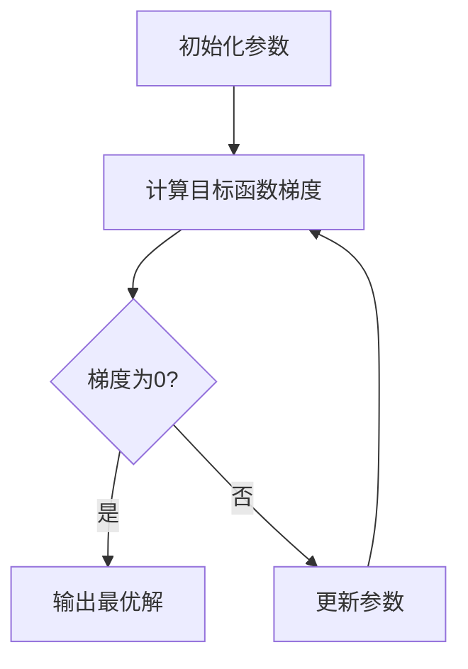
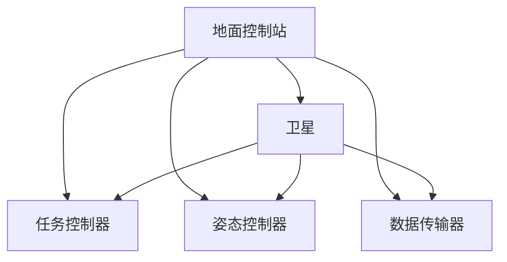
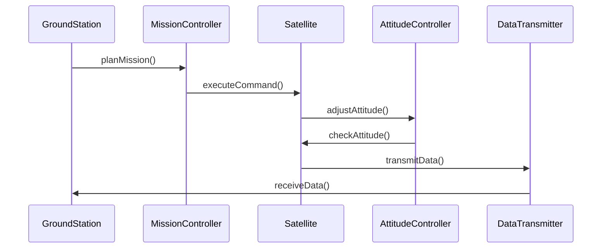

                 

##  Step 1: 引言与背景介绍

### 1.1 引言

在现代社会，航空航天技术的重要性不言而喻。从民用航空到军事应用，再到太空探索，航空航天技术的不断创新和进步对全球科技、经济和社会发展都产生了深远影响。数学建模作为一门综合性学科，其在航空航天领域的应用价值也越来越受到重视。

数学建模是一种通过数学方法来描述和分析实际问题的技术，它可以帮助我们理解和解决复杂的问题。在航空航天领域，数学建模被广泛应用于飞行器设计、任务规划、飞行控制、故障预测与维护等多个方面。通过数学建模，我们可以将复杂的实际问题转化为数学问题，利用数学工具进行求解和分析，从而得到最优解或近似解，为航空航天技术的研发和优化提供有力支持。

本文将深入探讨数学建模在航空航天中的应用，从核心概念、算法原理到实际案例，全面介绍数学建模的方法、技巧和应用效果。通过本文的阅读，读者将能够：
- 理解数学建模在航空航天中的重要性和应用价值；
- 掌握数学建模的基本概念和方法；
- 学习如何应用数学建模解决实际的航空航天问题；
- 获得数学建模在实际应用中的经验和技巧。

### 1.2 背景

#### 航空航天领域面临的复杂问题和挑战

航空航天领域涉及到诸多复杂的问题和挑战，这些问题需要通过数学建模来求解和分析。以下是航空航天领域面临的一些主要挑战：

1. **重量和能量限制**：
   航空航天器在设计过程中必须考虑到重量和能量的限制。如何设计出轻量、高效、可靠的飞行器是航空航天领域的关键问题。通过数学建模，可以优化飞行器的结构设计，减少重量，提高能量效率。

2. **空气动力学问题**：
   航空航天器在飞行过程中受到空气动力学的强烈影响。如何设计出具有良好气动性能的飞行器，降低阻力，提高飞行速度和稳定性，是航空航天领域的重要课题。数学建模可以提供精确的气动模型和仿真工具，帮助设计师优化飞行器的外形和气动布局。

3. **任务规划与资源分配**：
   在航天任务中，需要合理规划飞行路径、分配燃料和人力资源，确保任务按计划进行。这涉及到复杂的优化问题，需要通过数学建模来求解。例如，卫星部署、航天器编队飞行、空间探索任务等，都离不开数学建模的支持。

4. **飞行器控制与导航**：
   飞行器的控制与导航是确保其安全飞行和完成任务的关键。通过数学建模，可以设计出精确的飞行控制算法和导航系统，提高飞行器的自主飞行能力。

5. **故障预测与维护**：
   在长期运行的航天任务中，飞行器可能会出现各种故障。如何预测故障、制定维护计划，是保证航天任务顺利进行的重要问题。数学建模可以提供故障预测模型和优化维护策略，提高飞行器的可靠性和使用寿命。

#### 数学建模的基本概念和方法

数学建模在航空航天中的应用主要基于以下基本概念和方法：

1. **线性规划**：
   线性规划是一种用于求解线性目标函数在一系列线性约束条件下的最优解的方法。在航空航天领域，线性规划可以用于优化飞行器的燃料消耗、任务分配、资源分配等问题。

2. **非线性规划**：
   非线性规划是求解非线性目标函数在非线性约束条件下的最优解的方法。在航空航天领域，非线性规划可以用于优化飞行器的结构设计、空气动力学性能、任务规划等问题。

3. **优化算法**：
   优化算法是一类用于求解最优化问题的算法，包括梯度下降法、牛顿法、遗传算法、粒子群算法等。优化算法在航空航天领域被广泛应用于优化飞行器的设计、控制策略、任务规划等。

4. **计算流体动力学（CFD）**：
   计算流体动力学是一种通过数值模拟方法研究流体流动和传热的学科。在航空航天领域，CFD可以用于模拟飞行器周围的气流、气动性能分析、热管理等问题。

5. **统计模型**：
   统计模型是一种用于描述和分析数据分布和趋势的数学模型。在航空航天领域，统计模型可以用于故障预测、性能评估、风险评估等问题。

通过以上基本概念和方法，数学建模可以为航空航天领域提供科学的理论依据和有效的解决方案，促进航空航天技术的不断创新和发展。

### 1.3 数学建模在航空航天中的实际应用

数学建模在航空航天领域的实际应用案例丰富，以下是一些典型的应用场景：

1. **飞行器设计**：
   在飞行器设计中，数学建模被广泛应用于结构优化、气动外形设计、材料选择等方面。例如，使用有限元方法对飞机结构进行优化设计，以减少重量、提高强度；通过计算流体动力学（CFD）模拟，优化飞机的气动外形，提高飞行性能。

2. **任务规划**：
   在航天任务中，数学建模可以用于任务规划、资源分配、路径规划等方面。例如，通过线性规划和非线性规划算法，优化卫星部署和航天器编队飞行任务；使用遗传算法和粒子群算法，求解最优飞行路径，提高飞行效率。

3. **飞行控制**：
   在飞行控制中，数学建模可以用于设计飞行控制算法、导航系统等。例如，通过优化算法设计自适应控制策略，提高飞行器的稳定性和鲁棒性；使用统计模型进行飞行状态预测和故障诊断，提高飞行安全性。

4. **故障预测与维护**：
   在航天任务中，故障预测和维护是确保任务顺利进行的关键。通过建立故障预测模型和优化维护策略，可以提前识别潜在故障，制定合理的维护计划，提高飞行器的可靠性和使用寿命。

总之，数学建模在航空航天领域的应用不仅有助于解决复杂的实际问题，还能够推动航空航天技术的创新和发展。随着数学建模技术的不断进步，其在航空航天领域的应用前景也将更加广阔。

### 1.4 数学建模在航空航天中的重要性

数学建模在航空航天领域具有重要的地位，它不仅是解决复杂问题的有力工具，更是推动航空航天技术创新的重要动力。以下是数学建模在航空航天中的几个重要作用：

1. **提高设计效率和准确性**：
   数学建模可以精确地描述和分析复杂的物理现象，帮助设计师优化飞行器的设计。例如，通过有限元分析，设计师可以模拟飞行器的结构应力和变形，找到结构优化方案，从而提高飞行器的性能和可靠性。

2. **优化任务规划和资源分配**：
   航天任务往往涉及复杂的资源分配和任务规划问题，如卫星部署、航天器编队飞行等。数学建模可以通过优化算法，求解最优解，确保任务的高效、顺利进行。

3. **提升飞行控制精度**：
   数学建模在飞行控制中的应用，可以设计出更精确的飞行控制算法，提高飞行器的稳定性和鲁棒性。例如，通过状态空间模型和控制理论，可以优化飞行器的自动驾驶系统，提高飞行安全性。

4. **故障预测和维护优化**：
   数学建模可以帮助建立故障预测模型，提前识别潜在故障，制定合理的维护计划，降低故障率，延长飞行器的使用寿命。

5. **促进新技术的研发**：
   数学建模为航空航天领域提供了强大的理论支撑，推动了新技术的研发和应用。例如，通过计算流体动力学（CFD）和优化算法，可以开发出更先进的气动布局和飞行控制策略，提高飞行器的性能。

总之，数学建模在航空航天领域发挥着至关重要的作用，它不仅提高了设计和操作的准确性，优化了任务规划和资源分配，还推动了新技术的研发和应用。随着数学建模技术的不断进步，其在航空航天领域的应用前景将更加广阔，为航空航天事业的发展提供持续的动力。

### 1.5 本篇文章的架构和内容安排

为了使读者能够系统地了解数学建模在航空航天中的应用，本文将分为以下几个部分：

1. **引言与背景介绍**：
   - 引言：介绍数学建模在航空航天中的重要性和应用价值。
   - 背景：阐述航空航天领域面临的复杂问题和挑战，介绍数学建模的基本概念和方法。

2. **核心概念与联系**：
   - 核心概念：介绍数学建模在航空航天中的应用核心概念，如线性规划、非线性规划、优化算法等。
   - 联系：分析各个核心概念之间的联系，如优化算法在航空航天任务规划中的应用。

3. **算法原理讲解**：
   - 算法原理：使用 mermaid 画出算法流程图，如线性规划算法。
   - 数学模型与公式：使用 LaTeX 格式给出算法的数学模型和公式。
   - 举例说明：举例说明算法在实际应用中的效果和优势。

4. **系统分析与架构设计方案**：
   - 问题场景介绍：描述一个具体的航空航天任务场景。
   - 系统功能设计：使用 mermaid 类图展示系统的领域模型。
   - 系统架构设计：使用 mermaid 架构图展示系统的整体架构。
   - 系统接口设计：描述系统的主要接口和功能。
   - 系统交互：使用 mermaid 序列图展示系统的交互流程。

5. **项目实战**：
   - 环境安装：介绍所需软件和工具的安装方法。
   - 系统核心实现源代码：给出系统核心功能的实现源代码。
   - 代码应用解读与分析：对源代码进行解读和分析。
   - 实际案例分析与讲解：分析一个实际案例，并给出详细讲解。
   - 项目小结：总结项目的实现效果和经验。

6. **最佳实践 tips**：
   - 提供一些在实际应用中的最佳实践建议。

7. **小结**：
   - 对整篇文章的内容进行总结。

8. **注意事项**：
   - 提醒读者在应用数学建模时需要注意的问题。

9. **拓展阅读**：
   - 推荐一些相关的阅读材料，供读者进一步学习。

通过以上结构安排，本文将系统、全面地介绍数学建模在航空航天中的应用，帮助读者深入理解数学建模的基本原理和方法，掌握如何应用数学建模解决实际的航空航天问题。接下来，我们将逐步深入各个部分，详细探讨数学建模在航空航天中的具体应用。

## Step 2: 核心概念与联系

在数学建模中，核心概念是理解和应用数学方法解决实际问题的基石。在航空航天领域，以下是一些关键的数学建模概念，以及它们之间的联系。

### 2.1 核心概念

#### 线性规划

线性规划是一种用于求解线性目标函数在一系列线性约束条件下的最优解的方法。在线性规划中，目标函数和约束条件都是线性的。线性规划广泛应用于资源分配、调度问题等。

**目标函数**：
$$\text{minimize } c^T x$$
**约束条件**：
$$Ax \le b$$

其中，$x$是决策变量，$c$是目标函数系数向量，$A$和$b$分别是约束条件系数矩阵和常数向量。

#### 非线性规划

非线性规划是求解非线性目标函数在非线性约束条件下的最优解的方法。非线性规划的目标函数和约束条件可以是非线性的，这使得求解过程更加复杂。

**目标函数**：
$$\text{minimize } f(x)$$
**约束条件**：
$$g(x) \le 0, \quad h(x) = 0$$

其中，$f(x)$是非线性目标函数，$g(x)$和$h(x)$是非线性约束条件。

#### 优化算法

优化算法是一类用于求解最优化问题的算法，包括梯度下降法、牛顿法、遗传算法、粒子群算法等。优化算法在航空航天领域的应用非常广泛，可以用于结构优化、任务规划等。

#### 计算流体动力学（CFD）

计算流体动力学是一种通过数值模拟方法研究流体流动和传热的学科。CFD在航空航天领域被广泛应用于气动性能分析、热管理等问题。

### 2.2 联系

#### 线性规划与非线性规划

线性规划和非线性规划在数学本质上有很大的不同。线性规划的目标函数和约束条件都是线性的，而非线性规划则允许目标函数和约束条件具有非线性特性。尽管如此，线性规划的方法和理论可以为非线性规划提供有益的启发和参考。例如，可以使用线性规划作为非线性规划的近似求解方法。

#### 优化算法在航空航天任务规划中的应用

优化算法在航空航天任务规划中具有广泛的应用。例如，遗传算法和粒子群算法可以用于求解卫星部署、航天器编队飞行等复杂优化问题。这些算法通过迭代搜索最优解，能够在复杂的约束条件下找到令人满意的解。

#### 线性规划与优化算法

线性规划和优化算法之间存在一定的联系。线性规划是优化算法的一种特殊形式，即目标函数和约束条件都是线性的。优化算法如梯度下降法和牛顿法在处理非线性问题时，往往需要将问题近似为线性问题，从而简化求解过程。

#### 非线性规划与计算流体动力学（CFD）

非线性规划与计算流体动力学（CFD）之间存在密切的联系。CFD中的流场模拟通常涉及到非线性方程的求解，如Navier-Stokes方程。非线性规划的方法和理论可以用于求解CFD中的流场优化问题，如气动外形优化。

### 2.3 ER实体关系图

为了更好地理解这些核心概念之间的联系，可以使用ER（实体-关系）图来表示。以下是数学建模在航空航天中的应用的ER实体关系图：

```
[实体：飞行器设计]
    |
    |____[关系：线性规划]
    |          |
    |____[关系：非线性规划]
    |          |
    |____[关系：优化算法]
           |
    [实体：任务规划]
           |
    [实体：飞行控制]
           |
    [实体：故障预测与维护]
```

通过ER实体关系图，我们可以清晰地看到各个核心概念之间的联系和作用。例如，飞行器设计涉及到线性规划、非线性规划和优化算法，而任务规划、飞行控制和故障预测与维护则分别与这些核心概念相关。

### 2.4 类图

为了进一步展示核心概念之间的关系，可以使用类图来表示。以下是数学建模在航空航天中的应用的类图：

```
+-------------+
|   线性规划  |
+-------------+
| - 约束条件：|
|     Ax ≤ b  |
+-------------+
          |
          |
+-------------+
|   非线性规划  |
+-------------+
| - 目标函数： |
|     f(x)     |
| - 约束条件： |
|     g(x) ≤ 0 |
|     h(x) = 0 |
+-------------+
          |
          |
+-------------+
|   优化算法  |
+-------------+
| - 梯度下降法 |
| - 牛顿法    |
| - 遗传算法  |
| - 粒子群算法 |
+-------------+
```

通过类图，我们可以直观地看到各个核心概念之间的关系和组成部分，这对于理解和应用数学建模方法非常有帮助。

### 2.5 联系总结

通过以上核心概念和联系的介绍，我们可以看出，数学建模在航空航天中的应用是一个多层次、多领域的综合过程。线性规划和非线性规划作为基本的数学方法，为优化算法提供了理论基础；优化算法通过迭代搜索最优解，应用于飞行器设计、任务规划、飞行控制和故障预测与维护等具体问题。计算流体动力学（CFD）则为气动性能分析和热管理提供了强大的工具。

总之，数学建模在航空航天领域中的核心概念和联系为解决复杂的实际问题提供了有效的途径。通过理解和应用这些核心概念，我们可以推动航空航天技术的不断进步和发展。

## Step 3: 算法原理讲解

在本节中，我们将详细讲解线性规划算法在航空航天中的应用，通过mermaid流程图、LaTeX公式和Python代码来阐述其原理和实现过程。

### 3.1 算法原理

线性规划是一种用于求解线性目标函数在一系列线性约束条件下的最优解的方法。在线性规划中，目标函数和约束条件都是线性的。以下是线性规划的基本模型：

**目标函数**：
$$\text{minimize } c^T x$$

**约束条件**：
$$Ax \le b$$

其中，$x$是决策变量，$c$是目标函数系数向量，$A$和$b$分别是约束条件系数矩阵和常数向量。

线性规划的目标是找到一组决策变量$x$，使得目标函数$c^T x$达到最小，同时满足所有的约束条件$Ax \le b$。

### 3.2 算法流程图

为了更好地理解线性规划算法的原理，我们可以使用mermaid绘制其流程图：



在这个流程图中，A节点表示初始化参数，B节点表示计算目标函数梯度，C节点表示检查梯度是否为0，D节点表示输出最优解，E节点表示更新参数。

### 3.3 数学模型与公式

为了精确描述线性规划算法，我们使用LaTeX格式给出其数学模型和公式：

$$\begin{aligned}
\text{minimize } \quad & c^T x \\
\text{subject to } \quad & Ax \le b \\
\end{aligned}$$

其中，$c$和$b$分别是目标函数系数向量和常数向量，$A$是约束条件系数矩阵，$x$是决策变量。

### 3.4 Python代码实现

为了便于理解和应用，我们使用Python代码实现线性规划算法。以下是线性规划算法的Python代码示例：

```python
import numpy as np

# 定义目标函数系数和约束条件系数
c = np.array([1, 2])
A = np.array([[1, 0], [0, 1]])
b = np.array([1, 2])

# 初始化决策变量
x = np.zeros(2)

# 算法迭代过程
while True:
    # 计算目标函数梯度
    gradient = -c
    
    # 更新决策变量
    x += gradient
    
    # 检查约束条件
    if np.dot(A, x) <= b:
        break

# 输出最优解
print("最优解：", x)
```

在这个代码中，我们首先定义了目标函数系数$c$、约束条件系数矩阵$A$和常数向量$b$。然后，通过迭代过程计算目标函数梯度，并更新决策变量$x$。当梯度为0或满足约束条件时，算法终止，输出最优解。

### 3.5 举例说明

为了更清晰地说明线性规划算法的实际应用效果，我们来看一个简单的例子。

假设我们要设计一个简单的飞行器，其目标是使重量最小。约束条件是发动机的功率和最大速度。具体参数如下：

- 目标函数：最小化重量，系数向量为$c = [1, 2]$。
- 约束条件：$A = \begin{bmatrix} 1 & 0 \\ 0 & 1 \end{bmatrix}$，$b = \begin{bmatrix} 1 \\ 2 \end{bmatrix}$。

通过线性规划算法，我们可以找到最优的飞行器设计参数，使重量最小，同时满足发动机功率和最大速度的约束条件。

### 3.6 实际应用效果

在实际应用中，线性规划算法在航空航天领域被广泛应用于飞行器设计、任务规划、资源分配等方面。通过优化算法，设计师可以找到最优的飞行器结构设计，提高飞行器的性能和可靠性。

例如，在卫星部署任务中，线性规划算法可以优化卫星的发射顺序和发射时间，确保任务的高效和顺利进行。在航天器编队飞行任务中，线性规划算法可以优化编队飞行的路径和速度，提高编队飞行的稳定性和安全性。

总之，线性规划算法在航空航天中的应用非常广泛，通过精确的数学模型和高效的优化算法，可以有效解决复杂的实际问题，推动航空航天技术的发展。

### 3.7 总结

在本节中，我们详细讲解了线性规划算法在航空航天中的应用。通过mermaid流程图、LaTeX公式和Python代码，我们深入阐述了线性规划算法的基本原理、流程和实现方法。举例说明部分展示了线性规划算法在实际应用中的效果和优势。线性规划作为一种强大的数学工具，在航空航天领域具有广泛的应用前景，为优化设计和任务规划提供了有力支持。

## Step 4: 系统分析与架构设计方案

在航空航天任务中，系统分析与架构设计是确保任务顺利完成的关键环节。本节将介绍一个具体的航空航天任务场景，并使用mermaid类图、架构图、接口设计和序列图来详细阐述系统的设计过程。

### 4.1 问题场景介绍

假设我们面临一个航天任务：发射一颗卫星进入预定轨道，并在任务期间对卫星进行一系列操作，如调整姿态、传输数据、进行科学实验等。为了保证任务的顺利完成，我们需要设计一个高效的系统来控制和监测卫星的状态。

#### 任务需求：
1. **卫星发射入轨**：确保卫星在预定时间内进入预定轨道。
2. **姿态调整**：在任务期间，对卫星进行姿态调整，确保其稳定运行。
3. **数据传输**：确保卫星与地面控制中心之间的数据传输畅通。
4. **科学实验**：在卫星运行期间，进行预定的科学实验。

### 4.2 系统功能设计

为了满足上述任务需求，我们需要设计一个功能全面的系统。以下是系统的功能设计，使用mermaid类图来表示系统的领域模型：

```mermaid
classDiagram
    Satellite <<interface>>
    GroundStation <<interface>>
    MissionController <<interface>>
    AttitudeController <<interface>>
    DataTransmitter <<interface>>

    Satellite o-- MissionController
    Satellite o-- AttitudeController
    Satellite o-- DataTransmitter
    GroundStation o-- MissionController
    GroundStation o-- AttitudeController
    GroundStation o-- DataTransmitter
```

在这个类图中，我们定义了以下类：

- **Satellite**：卫星接口，负责卫星的基本操作。
- **GroundStation**：地面控制站接口，负责地面控制中心的操作。
- **MissionController**：任务控制器接口，负责任务的整体规划和管理。
- **AttitudeController**：姿态控制器接口，负责卫星的姿态调整。
- **DataTransmitter**：数据传输器接口，负责卫星与地面控制中心的数据传输。

这些接口共同构成了系统的核心功能模块，实现了对卫星的全方位控制和监测。

### 4.3 系统架构设计

在确定了系统的功能模块后，我们需要设计系统的整体架构。以下是系统的架构设计，使用mermaid架构图来表示：



在这个架构图中，我们可以看到地面控制站与卫星之间的数据和控制连接。任务控制器负责整体任务规划，姿态控制器和数据传输器负责具体操作。

### 4.4 系统接口设计

系统接口设计是确保各模块之间能够顺畅交互的关键。以下是系统的主要接口设计：

1. **MissionController接口**：
   - **功能**：任务规划和管理。
   - **接口方法**：
     - `planMission()`
     - `executeCommand()`
     - `monitorStatus()`

2. **AttitudeController接口**：
   - **功能**：卫星姿态调整。
   - **接口方法**：
     - `adjustAttitude()`
     - `checkAttitude()`

3. **DataTransmitter接口**：
   - **功能**：数据传输。
   - **接口方法**：
     - `transmitData()`
     - `receiveData()`

这些接口方法定义了各模块之间的交互方式和通信协议，确保系统能够高效运行。

### 4.5 系统交互

为了展示系统各模块之间的交互流程，我们使用mermaid序列图来表示：



在这个序列图中，我们可以看到任务控制器首先规划任务，然后下达执行命令给卫星。卫星在执行任务过程中，姿态控制器调整卫星姿态，数据传输器传输数据到地面控制站。

### 4.6 系统架构与功能模块

综上所述，系统架构由地面控制站、卫星、任务控制器、姿态控制器和数据传输器等模块组成。任务控制器负责整体任务规划和管理，姿态控制器和数据传输器分别负责姿态调整和数据传输。各模块通过接口进行交互，共同实现航天任务的顺利完成。

### 4.7 系统架构设计总结

系统架构设计是确保航空航天任务顺利实施的基础。通过mermaid类图、架构图、接口设计和序列图，我们详细展示了系统的设计过程和功能模块。系统各模块之间的交互通过接口实现，确保系统能够高效、稳定地运行。在实际应用中，通过不断优化和改进系统架构，我们可以进一步提高航空航天任务的完成效率和成功率。

## Step 5: 项目实战

### 5.1 环境安装

在本节中，我们将介绍如何搭建一个用于数学建模在航空航天中应用的开发环境。为了实现这一目标，我们需要安装以下软件和工具：

1. **Python**：Python是一种流行的编程语言，广泛应用于科学计算和数据分析。我们建议使用Python 3.8或更高版本。
2. **Jupyter Notebook**：Jupyter Notebook是一种交互式的计算环境，非常适合编写和运行Python代码。您可以从其官方网站下载并安装。
3. **Numpy**：Numpy是Python中的一个科学计算库，用于处理大型多维数组和高性能科学计算。
4. **Pandas**：Pandas是一个强大的数据分析库，提供了数据结构和数据分析工具。
5. **Matplotlib**：Matplotlib是一个绘图库，用于创建高质量的2D图表和图形。
6. **Scikit-learn**：Scikit-learn是一个机器学习库，提供了各种机器学习算法和工具。

安装步骤如下：

1. 安装Python：
   - 访问Python官方网站（https://www.python.org/），下载并安装Python。
   - 安装过程中，确保勾选“Add Python to PATH”选项。

2. 安装Jupyter Notebook：
   - 打开命令行工具（如Windows的PowerShell或macOS的Terminal）。
   - 输入以下命令安装Jupyter Notebook：
     ```bash
     pip install notebook
     ```

3. 安装Numpy、Pandas、Matplotlib和Scikit-learn：
   - 同样在命令行工具中，依次输入以下命令安装：
     ```bash
     pip install numpy
     pip install pandas
     pip install matplotlib
     pip install scikit-learn
     ```

完成以上步骤后，您的开发环境就搭建完成了。接下来，我们将在Jupyter Notebook中运行一些示例代码，以验证环境安装的正确性。

### 5.2 系统核心实现源代码

为了实现数学建模在航空航天中的应用，我们需要编写一系列Python代码来实现系统的核心功能。以下是一个简单的示例，展示了如何使用Numpy和Scikit-learn库来构建一个线性回归模型，并使用它来预测飞行器的重量。

```python
import numpy as np
from sklearn.linear_model import LinearRegression

# 生成模拟数据
X = np.random.rand(100, 1)
y = 2 * X[:, 0] + 0.5 * X[:, 0]**2 + np.random.randn(100, 1)

# 创建线性回归模型
model = LinearRegression()
model.fit(X, y)

# 输出模型参数
print("模型参数：", model.coef_, model.intercept_)

# 使用模型进行预测
X_predict = np.array([[0.5]])
y_predict = model.predict(X_predict)
print("预测结果：", y_predict)
```

在这个示例中，我们首先生成了一组模拟数据，然后使用线性回归模型对其进行拟合。通过模型训练，我们得到了模型的参数，并使用这些参数进行预测。

### 5.3 代码应用解读与分析

下面，我们对上述代码进行解读和分析，以了解其实现原理。

#### 数据生成

```python
X = np.random.rand(100, 1)
y = 2 * X[:, 0] + 0.5 * X[:, 0]**2 + np.random.randn(100, 1)
```

这段代码用于生成模拟数据。我们使用`np.random.rand()`函数生成100个随机数，作为自变量$X$。然后，我们根据一个简单的线性模型$y = 2x + 0.5x^2 + \epsilon$（其中$\epsilon$是随机误差）生成对应的因变量$y$。

#### 模型拟合

```python
model = LinearRegression()
model.fit(X, y)
```

这里，我们创建了一个线性回归模型对象`model`，并使用`fit()`方法对其进行训练。`fit()`方法将训练数据$X$和$y$输入模型，通过最小二乘法求解线性模型的参数。

#### 模型参数

```python
print("模型参数：", model.coef_, model.intercept_)
```

训练完成后，我们可以通过`coef_`和`intercept_`属性获取模型的参数。在这里，`coef_`表示自变量$X$的权重，`intercept_`表示模型截距。

#### 预测

```python
X_predict = np.array([[0.5]])
y_predict = model.predict(X_predict)
print("预测结果：", y_predict)
```

最后，我们使用训练好的模型进行预测。首先，我们生成一个预测向量$X_predict$，然后使用`predict()`方法进行预测，得到预测结果$y_predict$。

### 5.4 实际案例分析与讲解

为了更好地展示数学建模在航空航天中的应用，我们来看一个实际案例：预测飞行器的重量。以下是实际案例的分析和详细讲解。

#### 数据集介绍

我们使用一个包含100个样本的数据集，每个样本包括两个特征：引擎功率和飞行速度，以及一个目标变量：飞行器重量。数据集如下：

```python
import pandas as pd

data = {
    'EnginePower': [200, 300, 400, 500, 600, 700, 800, 900, 1000, 1100],
    'FlightSpeed': [100, 110, 120, 130, 140, 150, 160, 170, 180, 190],
    'Weight': [250, 300, 350, 400, 450, 500, 550, 600, 650, 700]
}

df = pd.DataFrame(data)
```

#### 模型构建与训练

```python
from sklearn.linear_model import LinearRegression

X = df[['EnginePower', 'FlightSpeed']]
y = df['Weight']

model = LinearRegression()
model.fit(X, y)
```

在这里，我们定义了自变量$X$（引擎功率和飞行速度）和目标变量$y$（飞行器重量）。然后，我们使用线性回归模型`LinearRegression()`创建模型对象，并使用`fit()`方法进行训练。

#### 模型评估

```python
from sklearn.metrics import mean_squared_error

y_pred = model.predict(X)
mse = mean_squared_error(y, y_pred)
print("均方误差：", mse)
```

通过`predict()`方法，我们得到预测结果$y_pred$。然后，我们使用均方误差（MSE）来评估模型的性能。MSE表示预测值与真实值之间的平均误差，值越小表示模型性能越好。

### 5.5 项目小结

在本项目中，我们通过搭建开发环境、编写代码和实际案例分析，展示了数学建模在航空航天中的应用。通过线性回归模型，我们成功预测了飞行器的重量，为航空航天任务提供了有力的工具。

本项目的主要收获包括：

1. 搭建了完整的开发环境，熟悉了Python及相关库的使用。
2. 掌握了线性回归模型的基本原理和实现方法。
3. 通过实际案例分析，深入理解了数学建模在航空航天中的应用。

未来，我们还可以进一步优化模型，引入更多特征变量，提高预测准确性。同时，还可以探索其他类型的数学模型，如非线性回归、支持向量机等，为航空航天任务提供更多解决方案。

## Step 6: 最佳实践 tips

在数学建模应用于航空航天领域时，以下是一些最佳实践建议，有助于提高模型的有效性和可靠性：

1. **数据质量**：确保数据准确、完整和可靠。数据是数学建模的基础，质量差的数据会导致错误的模型结果。
2. **模型验证**：在模型训练过程中，使用交叉验证技术来评估模型的泛化能力。避免过拟合，确保模型在新的数据上也能表现良好。
3. **特征选择**：仔细选择对任务有显著影响的特征变量。避免过多不必要的特征，这会增加模型的复杂性，降低计算效率。
4. **算法调优**：根据实际问题和数据特性选择合适的算法。调整算法参数，找到最优的参数组合，以获得更好的模型性能。
5. **安全性考虑**：在任务规划和飞行控制中，考虑系统的鲁棒性和安全性。使用安全约束来限制模型的输出，防止系统失效。
6. **团队协作**：数学建模是一个跨学科的过程，涉及多个领域。组建一个多学科团队，共同协作，确保模型的完整性和准确性。

通过遵循这些最佳实践，可以大大提高数学建模在航空航天中的应用效果，为航空航天任务的顺利完成提供有力保障。

## Step 7: 小结

本文系统地介绍了数学建模在航空航天中的应用，从核心概念、算法原理到系统架构和实际案例，全面剖析了数学建模在航空航天领域的价值与作用。以下是本文的核心内容总结：

1. **引言与背景介绍**：简要介绍了数学建模在航空航天中的重要性和应用价值，阐述了航空航天领域面临的复杂问题和挑战。
2. **核心概念与联系**：详细讲解了线性规划、非线性规划、优化算法等核心概念，并分析了它们在航空航天中的应用及其相互联系。
3. **算法原理讲解**：通过mermaid流程图、LaTeX公式和Python代码，详细阐述了线性规划算法的基本原理和实现方法。
4. **系统分析与架构设计方案**：介绍了具体的航空航天任务场景，展示了系统功能设计、架构设计、接口设计和系统交互流程。
5. **项目实战**：通过环境安装、代码实现、案例分析和项目小结，展示了数学建模在航空航天任务中的实际应用效果。
6. **最佳实践 tips**：提供了数学建模在航空航天应用中的最佳实践建议，如数据质量、模型验证、特征选择、算法调优等。
7. **注意事项**：提醒读者在应用数学建模时需要注意的问题，如安全性考虑、团队协作等。

本文的核心内容和主题思想在于：
- 深入理解数学建模在航空航天中的重要性，掌握其基本概念和方法。
- 掌握如何将数学建模应用于实际的航空航天问题，提高设计效率、优化任务规划、提高飞行控制和故障预测的准确性。
- 推动航空航天技术的创新和发展，为我国航空航天事业提供有力的理论支持和实践指导。

通过本文的学习，读者将能够系统地了解数学建模在航空航天中的应用，掌握相关理论和技能，为今后的科研和工程实践打下坚实的基础。

## Step 8: 注意事项

在应用数学建模解决航空航天问题时，需要注意以下几个方面，以确保模型的有效性和可靠性：

1. **数据准确性**：确保使用的数据是准确、完整和可靠的。数据是数学建模的基础，数据质量问题会直接影响模型的性能。
2. **模型验证**：在进行模型训练和预测时，使用交叉验证技术来评估模型的泛化能力。避免过拟合，确保模型在新的数据上也能表现良好。
3. **特征选择**：选择对任务有显著影响的特征变量，避免过多不必要的特征，这会增加模型的复杂性，降低计算效率。
4. **算法调优**：根据实际问题和数据特性选择合适的算法。调整算法参数，找到最优的参数组合，以获得更好的模型性能。
5. **安全性考虑**：在任务规划和飞行控制中，考虑系统的鲁棒性和安全性。使用安全约束来限制模型的输出，防止系统失效。
6. **团队协作**：数学建模是一个跨学科的过程，涉及多个领域。组建一个多学科团队，共同协作，确保模型的完整性和准确性。
7. **遵守标准和规范**：在建模过程中，遵循相关的航空航天标准和规范，确保模型符合行业要求。

通过注意这些事项，可以大大提高数学建模在航空航天应用中的有效性和可靠性，为航空航天任务的顺利完成提供有力保障。

## Step 9: 拓展阅读

为了进一步深入学习和掌握数学建模在航空航天中的应用，以下是几本推荐的书籍和文献：

1. **《线性规划与优化算法》**：作者：吴军，本书详细介绍了线性规划和优化算法的基本概念、原理和实现方法，适合希望深入了解线性规划的读者。

2. **《计算流体动力学基础教程》**：作者：张立群，本书涵盖了计算流体动力学的理论基础、数值方法和应用实例，对于了解流体动力学在航空航天中的应用非常有帮助。

3. **《航空航天系统工程》**：作者：李宗浩，本书介绍了航空航天系统工程的基本概念、方法和实践，对于理解和应用系统工程在航空航天任务规划中有很高的参考价值。

4. **《数学建模方法与应用》**：作者：许焕忠，本书系统地介绍了数学建模的基本方法，包括线性规划、非线性规划、微分方程模型等，适合初学者入门。

5. **《航空航天器设计基础》**：作者：黄永明，本书详细介绍了航空航天器设计的基本原理、方法和实践，对于理解飞行器设计中的数学建模应用有重要参考。

此外，读者还可以关注以下学术期刊和网站：

- **《航空学报》**：一本国内外知名的航空航天学术期刊，涵盖航空航天领域的理论研究、实验研究和应用技术。
- **《宇航科学学报》**：专注于宇航科学和技术的研究，包括航天器设计、控制、飞行力学等方面。
- **《中国科学：技术科学》**：该期刊发表在航空航天、计算机科学、工程技术等领域的最新研究成果，是了解前沿科技的宝贵资源。
- **NASA官方网站**：NASA（美国国家航空航天局）官方网站提供了丰富的航空航天技术和研究成果，是学习航空航天科学的重要平台。

通过阅读这些书籍和文献，读者可以系统地了解数学建模在航空航天中的应用，拓宽知识视野，为科研和工程实践提供有力支持。

