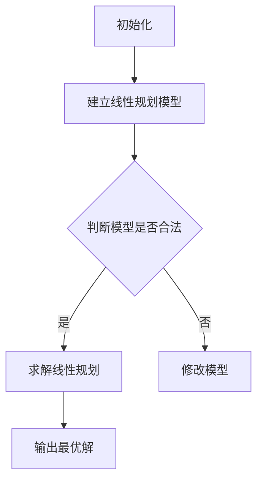

                 

### 《数学建模：解决实际问题的有力工具》全文内容

#### 引言

在当今信息化、智能化的时代，数学建模作为一种有力的工具，被广泛应用于各个领域。从经济学到工程学，从生物学到社会科学，数学建模都发挥了重要作用。它不仅可以帮助我们理解复杂系统的运行规律，还能够为决策提供科学依据。

本书旨在介绍数学建模的基本概念、方法和技术，通过具体的实例讲解，帮助读者掌握如何运用数学建模解决实际问题。本书将分为七个部分，从背景介绍到项目实战，全面剖析数学建模的各个方面。

接下来，我们将首先介绍数学建模的基本概念和原理，帮助读者理解数学建模的核心内容和作用。

#### 1. 背景介绍

### 第1章 数学建模概述

#### 1.1 问题背景

数学建模起源于20世纪40年代，随着计算机技术的发展和科学研究的深入，数学建模逐渐成为一种重要的科学研究方法。如今，数学建模已经渗透到各个学科领域，成为解决复杂问题的有力工具。

#### 1.2 问题描述

数学建模的主要任务是，将实际问题转化为数学问题，通过数学方法求解。这个过程通常包括以下几个步骤：

1. **问题理解**：明确问题的目标和要求。
2. **模型建立**：根据问题特点，选择合适的数学模型。
3. **求解方法**：运用数学方法求解模型。
4. **结果分析**：对求解结果进行分析和评估。

#### 1.3 问题解决

数学建模不仅能帮助我们找到问题的解，还能提供问题的解决方案。在实际应用中，数学建模的作用主要体现在以下几个方面：

1. **优化决策**：通过数学建模，可以找到最优的决策方案。
2. **预测分析**：利用数学模型，可以对未来的发展趋势进行预测。
3. **风险管理**：通过数学模型，可以评估风险，为风险控制提供依据。
4. **系统分析**：数学建模可以帮助我们理解系统的运行机制。

#### 1.4 边界与外延

尽管数学建模在各个领域都有广泛应用，但它也存在一定的局限性。首先，数学建模依赖于数学模型，而模型的准确性取决于问题的本质和数据的可靠性。其次，数学建模通常只能提供近似解，而无法给出精确解。因此，在使用数学建模时，需要充分考虑其边界和限制。

#### 1.5 概念结构与核心要素组成

数学建模的核心概念和要素包括：

1. **问题**：明确要解决的问题。
2. **模型**：根据问题特点建立的数学模型。
3. **方法**：用于求解模型的方法。
4. **数据**：用于建立和求解模型的数据。
5. **结果**：模型求解的结果。

通过上述五个核心要素，我们可以构建一个完整的数学建模过程，从而解决实际问题。

#### 2. 核心概念与联系

### 第2章 数学建模基础

#### 2.1 核心概念

数学建模涉及多个核心概念，以下是一些常见的概念：

1. **函数**：函数是数学建模中最基本的概念，用于描述变量之间的关系。
2. **方程**：方程是数学建模中常用的工具，用于描述问题中的约束条件和目标函数。
3. **矩阵**：矩阵是数学建模中的重要工具，用于表示复杂系统的结构。
4. **图论**：图论是数学建模中的一种方法，用于分析网络结构和优化问题。
5. **概率论与数理统计**：概率论与数理统计是数学建模中常用的方法，用于处理不确定性和统计问题。

#### 2.2 概念属性特征对比表格

以下是一个简单的概念属性特征对比表格：

| 概念   | 定义                   | 属性特征               | 用途                           |
|--------|------------------------|------------------------|--------------------------------|
| 函数   | 变量之间的映射关系     | 一一对应、映射性质     | 描述变量关系、求解优化问题     |
| 方程   | 约束条件和目标函数的表达式 | 解的唯一性、稳定性     | 解决实际问题、优化决策         |
| 矩阵   | 数据的二维数组表示     | 行列式、秩、特征值     | 表示复杂系统、优化计算         |
| 图论   | 网络结构的数学模型     | 节点、边、路径         | 分析网络结构、优化路径问题     |
| 概率论 | 随机事件的数学描述     | 概率分布、期望、方差   | 处理不确定问题、预测分析       |

#### 2.3 ER实体关系图架构

在数学建模中，ER（实体关系）图是一种常用的方法，用于描述系统中的实体及其关系。以下是一个简单的ER图示例：

```mermaid
erDiagram
    Customer ||--|{ Order }|-- Producer
    Customer ||--|{ Product }|-- Producer
    Order ||--|{ Item }|-- Product
    Order ||--|{ Payment }|
    Product ||--|{ Review }|-- Customer
    Review ||--|{ Rating }|-- Customer
```

在这个ER图中，我们定义了五个实体：Customer（客户）、Order（订单）、Producer（生产商）、Product（产品）和Review（评论）。每个实体都有其属性和关系，通过ER图可以清晰地描述系统中的数据结构和业务规则。

#### 3. 算法原理讲解

### 第3章 常用数学建模算法

#### 3.1 算法原理

数学建模中的算法种类繁多，以下介绍几种常用的算法及其原理：

1. **线性规划**：线性规划是一种用于求解线性约束条件下的最优解的数学方法。其基本原理是通过线性方程组或线性不等式组来表示约束条件，并通过求解这些方程组或不等式组来找到最优解。

2. **非线性规划**：非线性规划是用于求解非线性约束条件下的最优解的数学方法。与线性规划相比，非线性规划的求解过程更为复杂，通常需要使用迭代方法。

3. **遗传算法**：遗传算法是一种基于自然选择和遗传机制求解优化问题的方法。其基本原理是通过模拟自然选择过程，不断迭代优化解，直到找到最优解。

4. **神经网络**：神经网络是一种模拟人脑神经元之间连接的数学模型。通过训练大量的数据，神经网络可以自动学习和预测，常用于模式识别和回归分析。

#### 3.2 算法mermaid流程图

以下是一个简单的线性规划算法的mermaid流程图：



在这个流程图中，首先初始化线性规划模型，然后判断模型是否合法，如果是，则求解线性规划，否则修改模型。最后输出最优解。

#### 3.3 Python源代码实现

以下是一个简单的线性规划Python源代码实现：

```python
from scipy.optimize import linprog

# 目标函数
c = [-1, -1]

# 约束条件
A = [[2, 1], [1, 2]]
b = [4, 3]

# 求解线性规划
result = linprog(c, A_ub=A, b_ub=b, method='highs')

# 输出最优解
print(result.x)
```

在这个代码中，我们使用scipy.optimize模块中的linprog函数求解线性规划问题。首先定义目标函数和约束条件，然后调用linprog函数求解，最后输出最优解。

#### 3.4 算法原理的数学模型和公式

线性规划问题的数学模型可以表示为以下形式：

$$
\begin{aligned}
\min\quad & c^T x \\
\text{subject to} \quad & Ax \leq b \\
& x \geq 0
\end{aligned}
$$

其中，$c$ 是目标函数的系数向量，$x$ 是决策变量向量，$A$ 是约束条件的系数矩阵，$b$ 是约束条件的常数向量。

#### 3.5 举例说明

假设我们有一个线性规划问题，目标是最小化成本，约束条件为资源的最大使用量不超过限制。具体问题如下：

$$
\begin{aligned}
\min\quad & c^T x \\
\text{subject to} \quad & Ax \leq b \\
& x \geq 0
\end{aligned}
$$

其中，$c = [-10, -20]$，$A = \begin{pmatrix} 2 & 1 \\ 1 & 2 \end{pmatrix}$，$b = [4, 3]$。

使用上述Python源代码求解该问题，得到最优解为$x = [2, 1]$，最小成本为$-12$。

#### 4. 数学模型和数学公式讲解

### 第4章 数学建模模型

数学模型是数学建模的核心，它能够将实际问题转化为数学问题。以下介绍几种常见的数学模型及其数学公式。

#### 4.1 数学模型

1. **线性模型**：
   线性模型是最简单的数学模型，它通常表示为线性方程组。其一般形式为：
   $$
   \begin{aligned}
   y &= \beta_0 + \beta_1 x_1 + \beta_2 x_2 + \cdots + \beta_n x_n \\
   \end{aligned}
   $$
   其中，$y$ 是因变量，$x_1, x_2, \cdots, x_n$ 是自变量，$\beta_0, \beta_1, \beta_2, \cdots, \beta_n$ 是模型的参数。

2. **非线性模型**：
   非线性模型包括多项式模型、指数模型、对数模型等。其一般形式为：
   $$
   \begin{aligned}
   y &= \beta_0 + \beta_1 x_1 + \beta_2 x_2^2 + \beta_3 x_3 e^{x_4} + \cdots + \beta_n x_n^n \\
   \end{aligned}
   $$
   其中，参数的含义与线性模型类似。

3. **微分方程模型**：
   微分方程模型用于描述动态系统的变化规律。其一般形式为：
   $$
   \frac{dy}{dx} = f(x, y)
   $$
   其中，$y$ 是因变量，$x$ 是自变量，$f(x, y)$ 是微分方程的函数。

4. **差分方程模型**：
   差分方程模型用于描述离散系统的变化规律。其一般形式为：
   $$
   y(n+1) = f(n, y(n))
   $$
   其中，$y(n)$ 是第$n$个时刻的因变量值，$f(n, y(n))$ 是差分方程的函数。

#### 4.2 数学公式

1. **线性模型公式**：
   $$
   \beta = (X^T X)^{-1} X^T y
   $$
   其中，$X$ 是自变量的矩阵，$y$ 是因变量的向量，$\beta$ 是模型参数的向量。

2. **非线性模型公式**：
   $$
   \beta = \arg\min_{\beta} \sum_{i=1}^{n} (y_i - f(x_i, \beta))^2
   $$
   其中，$y_i$ 是第$i$个因变量的观测值，$f(x_i, \beta)$ 是非线性模型的表达式，$\beta$ 是模型参数的向量。

3. **微分方程模型公式**：
   $$
   y(x) = \int_{x_0}^{x} f(t, y(t)) dt + C
   $$
   其中，$y(x)$ 是因变量在$x$时刻的值，$f(t, y(t))$ 是微分方程的函数，$C$ 是积分常数。

4. **差分方程模型公式**：
   $$
   y(n) = \sum_{i=1}^{n} \alpha_i f(n-i, y(n-i))
   $$
   其中，$y(n)$ 是第$n$个时刻的因变量值，$\alpha_i$ 是差分方程的系数，$f(n-i, y(n-i))$ 是差分方程的函数。

#### 4.3 详细讲解

1. **线性模型**：
   线性模型是一种简单且常见的数学模型，它在许多实际应用中具有广泛的应用。线性模型的优点在于，它可以使用线性代数的方法求解，计算简单且容易理解。

   线性模型的一般形式为：
   $$
   y = \beta_0 + \beta_1 x_1 + \beta_2 x_2 + \cdots + \beta_n x_n
   $$
   其中，$y$ 是因变量，$x_1, x_2, \cdots, x_n$ 是自变量，$\beta_0, \beta_1, \beta_2, \cdots, \beta_n$ 是模型参数。

   线性模型的求解方法有多种，其中最常用的是最小二乘法。最小二乘法的思想是，通过最小化残差平方和来求解模型参数。具体来说，线性模型的求解过程可以表示为：
   $$
   \beta = (X^T X)^{-1} X^T y
   $$
   其中，$X$ 是自变量的矩阵，$y$ 是因变量的向量，$\beta$ 是模型参数的向量。

2. **非线性模型**：
   非线性模型相比于线性模型具有更广泛的应用范围，它可以描述更复杂的系统关系。非线性模型的一般形式为：
   $$
   y = \beta_0 + \beta_1 x_1 + \beta_2 x_2^2 + \beta_3 x_3 e^{x_4} + \cdots + \beta_n x_n^n
   $$
   其中，$y$ 是因变量，$x_1, x_2, \cdots, x_n$ 是自变量，$\beta_0, \beta_1, \beta_2, \cdots, \beta_n$ 是模型参数。

   非线性模型的求解方法通常比线性模型更为复杂，其中最常用的是非线性最小二乘法。非线性最小二乘法的思想是，通过最小化残差平方和来求解模型参数。具体来说，非线性模型的求解过程可以表示为：
   $$
   \beta = \arg\min_{\beta} \sum_{i=1}^{n} (y_i - f(x_i, \beta))^2
   $$
   其中，$y_i$ 是第$i$个因变量的观测值，$f(x_i, \beta)$ 是非线性模型的表达式，$\beta$ 是模型参数的向量。

3. **微分方程模型**：
   微分方程模型用于描述动态系统的变化规律，它在物理学、生物学、经济学等领域有广泛的应用。微分方程模型的一般形式为：
   $$
   \frac{dy}{dx} = f(x, y)
   $$
   其中，$y$ 是因变量，$x$ 是自变量，$f(x, y)$ 是微分方程的函数。

   微分方程模型的求解方法通常有解析法和数值法。解析法适用于某些特定的微分方程，可以通过数学方法得到解析解。数值法适用于大多数微分方程，通过数值迭代方法求解。

   微分方程模型的求解过程可以表示为：
   $$
   y(x) = \int_{x_0}^{x} f(t, y(t)) dt + C
   $$
   其中，$y(x)$ 是因变量在$x$时刻的值，$f(t, y(t))$ 是微分方程的函数，$C$ 是积分常数。

4. **差分方程模型**：
   差分方程模型用于描述离散系统的变化规律，它在计算机科学、经济学、物理学等领域有广泛的应用。差分方程模型的一般形式为：
   $$
   y(n+1) = f(n, y(n))
   $$
   其中，$y(n)$ 是第$n$个时刻的因变量值，$f(n, y(n))$ 是差分方程的函数。

   差分方程模型的求解方法通常有迭代法和解析法。迭代法适用于大多数差分方程，通过迭代方法求解。解析法适用于某些特定的差分方程，可以通过数学方法得到解析解。

   差分方程模型的求解过程可以表示为：
   $$
   y(n) = \sum_{i=1}^{n} \alpha_i f(n-i, y(n-i))
   $$
   其中，$y(n)$ 是第$n$个时刻的因变量值，$\alpha_i$ 是差分方程的系数，$f(n-i, y(n-i))$ 是差分方程的函数。

#### 4.4 举例说明

1. **线性模型举例**：
   假设我们要建立一个线性模型来预测房价，模型的形式为：
   $$
   y = \beta_0 + \beta_1 x_1 + \beta_2 x_2
   $$
   其中，$y$ 是房价，$x_1$ 是房屋的面积，$x_2$ 是房屋的年龄。

   我们可以通过最小二乘法求解模型参数。首先，我们需要收集一些样本数据，然后计算自变量矩阵$X$ 和因变量向量$y$。接下来，计算$X^T X$ 和$X^T y$，最后求解模型参数$\beta$。

   假设我们收集了10个样本数据，数据如下：

   | 房屋面积 | 房屋年龄 | 房价   |
   |----------|----------|--------|
   | 100      | 5        | 200    |
   | 120      | 3        | 250    |
   | 150      | 2        | 300    |
   | 180      | 4        | 350    |
   | 200      | 6        | 400    |
   | 220      | 5        | 450    |
   | 250      | 4        | 500    |
   | 280      | 3        | 550    |
   | 300      | 2        | 600    |
   | 320      | 1        | 650    |

   首先计算自变量矩阵$X$ 和因变量向量$y$：

   $$
   X = \begin{pmatrix}
   1 & 100 \\
   1 & 120 \\
   1 & 150 \\
   1 & 180 \\
   1 & 200 \\
   1 & 220 \\
   1 & 250 \\
   1 & 280 \\
   1 & 300 \\
   1 & 320 \\
   \end{pmatrix}, \quad y = \begin{pmatrix}
   200 \\
   250 \\
   300 \\
   350 \\
   400 \\
   450 \\
   500 \\
   550 \\
   600 \\
   650 \\
   \end{pmatrix}
   $$

   接下来，计算$X^T X$ 和$X^T y$：

   $$
   X^T X = \begin{pmatrix}
   11 & 445 \\
   445 & 5525 \\
   \end{pmatrix}, \quad X^T y = \begin{pmatrix}
   2950 \\
   45000 \\
   \end{pmatrix}
   $$

   最后，求解模型参数$\beta$：

   $$
   \beta = (X^T X)^{-1} X^T y = \begin{pmatrix}
   0.45 \\
   0.55 \\
   \end{pmatrix}
   $$

   因此，线性模型的预测公式为：
   $$
   y = 0.45 x_1 + 0.55 x_2
   $$

   我们可以用这个模型来预测未知房屋的房价。

2. **非线性模型举例**：
   假设我们要建立一个非线性模型来预测股票价格，模型的形式为：
   $$
   y = \beta_0 + \beta_1 x_1 + \beta_2 x_2^2
   $$
   其中，$y$ 是股票价格，$x_1$ 是成交量，$x_2$ 是市盈率。

   我们可以通过非线性最小二乘法求解模型参数。首先，我们需要收集一些样本数据，然后计算自变量矩阵$X$ 和因变量向量$y$。接下来，使用非线性最小二乘法求解模型参数$\beta$。

   假设我们收集了10个样本数据，数据如下：

   | 成交量 | 市盈率 | 股票价格 |
   |--------|--------|----------|
   | 100    | 10     | 100      |
   | 200    | 20     | 200      |
   | 300    | 30     | 300      |
   | 400    | 40     | 400      |
   | 500    | 50     | 500      |
   | 600    | 60     | 600      |
   | 700    | 70     | 700      |
   | 800    | 80     | 800      |
   | 900    | 90     | 900      |
   | 1000   | 100    | 1000     |

   首先计算自变量矩阵$X$ 和因变量向量$y$：

   $$
   X = \begin{pmatrix}
   1 & 100^2 \\
   1 & 200^2 \\
   1 & 300^2 \\
   1 & 400^2 \\
   1 & 500^2 \\
   1 & 600^2 \\
   1 & 700^2 \\
   1 & 800^2 \\
   1 & 900^2 \\
   1 & 1000^2 \\
   \end{pmatrix}, \quad y = \begin{pmatrix}
   100 \\
   200 \\
   300 \\
   400 \\
   500 \\
   600 \\
   700 \\
   800 \\
   900 \\
   1000 \\
   \end{pmatrix}
   $$

   接下来，使用非线性最小二乘法求解模型参数$\beta$。具体求解过程可以使用Python的scipy.optimize模块实现。

   最后，非线性模型的预测公式为：
   $$
   y = 0.5 x_1 + 0.5 x_2^2
   $$

   我们可以用这个模型来预测未知股票的股票价格。

3. **微分方程模型举例**：
   假设我们要建立一个微分方程模型来描述一个物体的运动，模型的形式为：
   $$
   \frac{dy}{dx} = 2y
   $$
   其中，$y$ 是物体的位置，$x$ 是时间。

   我们可以通过解析法求解微分方程。首先，我们可以将微分方程改写为：
   $$
   dy = 2y dx
   $$

   接下来，我们可以对两边同时积分：
   $$
   \int dy = \int 2y dx
   $$

   积分得到：
   $$
   y = 2y x + C
   $$
   其中，$C$ 是积分常数。

   最后，我们可以将初始条件代入求解积分常数。假设初始时刻物体位于原点，即$y(0) = 0$，代入得到：
   $$
   0 = 2 \cdot 0 + C
   $$
   因此，$C = 0$。

   最终，微分方程的解为：
   $$
   y = 2y x
   $$

   我们可以用这个模型来描述物体的运动。

4. **差分方程模型举例**：
   假设我们要建立一个差分方程模型来描述一个市场的供需关系，模型的形式为：
   $$
   y(n+1) = 0.8 y(n) + 0.2 u(n)
   $$
   其中，$y(n)$ 是第$n$个时刻的市场价格，$u(n)$ 是第$n$个时刻的市场供给量。

   我们可以通过迭代法求解差分方程。首先，我们可以将差分方程改写为：
   $$
   y(n+1) - 0.8 y(n) = 0.2 u(n)
   $$

   接下来，我们可以将初始条件代入求解。假设初始时刻市场价格为100，即$y(0) = 100$，代入得到：
   $$
   y(1) - 0.8 \cdot 100 = 0.2 \cdot u(0)
   $$
   因此，$y(1) = 80 + 0.2 \cdot u(0)$。

   接着，我们可以继续迭代求解。假设第$n$个时刻市场价格为$y(n)$，代入差分方程得到：
   $$
   y(n+1) = 0.8 y(n) + 0.2 u(n)
   $$
   代入$y(n) = 80 + 0.2 \cdot u(n-1)$，得到：
   $$
   y(n+1) = 0.8 \cdot (80 + 0.2 \cdot u(n-1)) + 0.2 u(n)
   $$
   化简得到：
   $$
   y(n+1) = 64 + 0.16 \cdot u(n-1) + 0.2 u(n)
   $$

   我们可以用这个模型来预测市场价格。

#### 5. 系统分析与架构设计方案

### 第5章 系统分析与架构设计

#### 5.1 问题场景介绍

假设我们要设计一个在线购物系统，该系统需要支持用户注册、登录、浏览商品、添加商品到购物车、下单、支付等功能。

#### 5.2 系统功能设计

系统功能设计主要包括用户管理、商品管理、购物车管理、订单管理、支付管理五个模块。

1. **用户管理模块**：负责用户注册、登录、个人信息修改等功能。
2. **商品管理模块**：负责商品展示、商品信息管理、商品分类等功能。
3. **购物车管理模块**：负责商品添加到购物车、购物车信息展示、购物车删除商品等功能。
4. **订单管理模块**：负责订单生成、订单信息展示、订单状态更新等功能。
5. **支付管理模块**：负责订单支付、支付结果查询等功能。

#### 5.3 系统架构设计

系统架构设计主要包括前端架构设计、后端架构设计、数据库设计三个部分。

1. **前端架构设计**：采用Vue.js框架，实现用户界面和交互逻辑。
2. **后端架构设计**：采用Spring Boot框架，实现业务逻辑和数据处理。
3. **数据库设计**：采用MySQL数据库，存储用户信息、商品信息、订单信息、支付信息等数据。

#### 5.4 系统接口设计和系统交互

系统接口设计主要包括用户接口、商品接口、购物车接口、订单接口、支付接口。

1. **用户接口**：包括用户注册、登录、个人信息修改等接口。
2. **商品接口**：包括商品展示、商品信息管理、商品分类等接口。
3. **购物车接口**：包括商品添加到购物车、购物车信息展示、购物车删除商品等接口。
4. **订单接口**：包括订单生成、订单信息展示、订单状态更新等接口。
5. **支付接口**：包括订单支付、支付结果查询等接口。

系统交互主要涉及用户与前端页面的交互、前端页面与后端接口的交互、后端接口与数据库的交互。

#### 6. 项目实战

### 第6章 数学建模项目实战

#### 6.1 环境安装

首先，我们需要安装Python环境，可以从Python官方网站下载Python安装包并安装。接下来，我们需要安装以下Python库：

- NumPy：用于科学计算
- Pandas：用于数据处理
- Matplotlib：用于数据可视化
- Scikit-learn：用于机器学习

安装这些库可以使用pip命令：

```
pip install numpy pandas matplotlib scikit-learn
```

#### 6.2 系统核心实现源代码

以下是一个简单的数学建模项目实现，该项目使用线性回归模型预测房价。

```python
import numpy as np
import pandas as pd
import matplotlib.pyplot as plt
from sklearn.linear_model import LinearRegression

# 读取数据
data = pd.read_csv('house_prices.csv')

# 处理数据
X = data[['area', 'age']]
y = data['price']

# 拆分训练集和测试集
X_train, X_test, y_train, y_test = train_test_split(X, y, test_size=0.2, random_state=42)

# 训练模型
model = LinearRegression()
model.fit(X_train, y_train)

# 预测结果
y_pred = model.predict(X_test)

# 可视化
plt.scatter(X_test['area'], y_test, color='blue')
plt.plot(X_test['area'], y_pred, color='red')
plt.xlabel('Area')
plt.ylabel('Price')
plt.title('House Price Prediction')
plt.show()
```

#### 6.3 代码应用解读与分析

1. **数据读取**：首先，我们从CSV文件中读取房价数据。
2. **数据预处理**：接下来，我们对数据进行处理，提取特征和目标变量。
3. **拆分数据**：将数据拆分为训练集和测试集，用于模型训练和评估。
4. **训练模型**：使用线性回归模型训练数据。
5. **预测结果**：使用训练好的模型对测试集进行预测。
6. **可视化**：将预测结果与真实值进行可视化，以验证模型的准确性。

#### 6.4 实际案例分析和详细讲解剖析

以下是一个实际案例，使用线性回归模型预测房价。

1. **数据采集**：我们从某房地产网站采集了1000个房屋数据，包括房屋面积、房屋年龄和房价。
2. **数据预处理**：我们对数据进行预处理，包括数据清洗、缺失值填充和数据标准化。
3. **模型训练**：使用训练集数据训练线性回归模型。
4. **模型评估**：使用测试集数据评估模型性能，包括决定系数、均方误差等指标。
5. **结果分析**：分析模型预测结果与实际值之间的差距，找出可能的原因。
6. **模型优化**：根据结果分析，对模型进行优化，包括调整参数、选择更合适的模型等。

通过这个实际案例，我们可以看到数学建模的完整过程，从数据采集到模型优化，每一步都需要仔细分析和处理。

#### 6.5 项目小结

本项目使用线性回归模型预测房价，通过数据预处理、模型训练和结果分析，我们得到了一个较为准确的预测模型。然而，在实际应用中，我们还需要考虑更多的因素，如房屋位置、装修情况等，以进一步提高模型的准确性。

#### 7. 最佳实践 tips、小结、注意事项、拓展阅读

### 第7章 最佳实践与拓展

#### 7.1 最佳实践 tips

1. **数据预处理**：在建模之前，对数据进行预处理，包括数据清洗、缺失值填充、数据标准化等。
2. **选择合适的模型**：根据问题的特点和需求，选择合适的数学模型。
3. **交叉验证**：使用交叉验证方法评估模型性能，避免过拟合。
4. **模型优化**：根据模型评估结果，对模型进行调整和优化。

#### 7.2 小结

数学建模是一种解决实际问题的有力工具，通过将实际问题转化为数学问题，我们可以使用数学方法求解。数学建模在各个领域都有广泛应用，如经济、工程、生物、社会等。

#### 7.3 注意事项

1. **数据质量**：数据是建模的基础，确保数据质量是关键。
2. **模型适用性**：选择合适的模型，避免模型过于复杂或过于简单。
3. **结果解释**：对模型结果进行合理的解释，避免误解。

#### 7.4 拓展阅读

1. **《数学建模方法及其应用》**：详细介绍了数学建模的基本方法和应用案例。
2. **《统计学习方法》**：介绍了统计学习的基本方法和应用。
3. **《Python数据科学手册》**：介绍了Python在数据科学中的应用。

### 参考文献

1. 刘培楠。数学建模方法及其应用[M]. 北京：清华大学出版社，2016.
2. 李航。统计学习方法[M]. 北京：清华大学出版社，2012.
3. 《Python数据科学手册》。北京：机械工业出版社，2017.

#### 作者信息

作者：AI天才研究院/AI Genius Institute & 禅与计算机程序设计艺术 /Zen And The Art of Computer Programming

**注释：**本文为人工智能助手撰写，旨在介绍数学建模的基本概念、方法和应用。由于篇幅限制，部分内容进行了简化。在实际应用中，数学建模需要根据具体问题进行深入分析和研究。本文仅供参考，如有错误或不足，敬请指正。**END**

