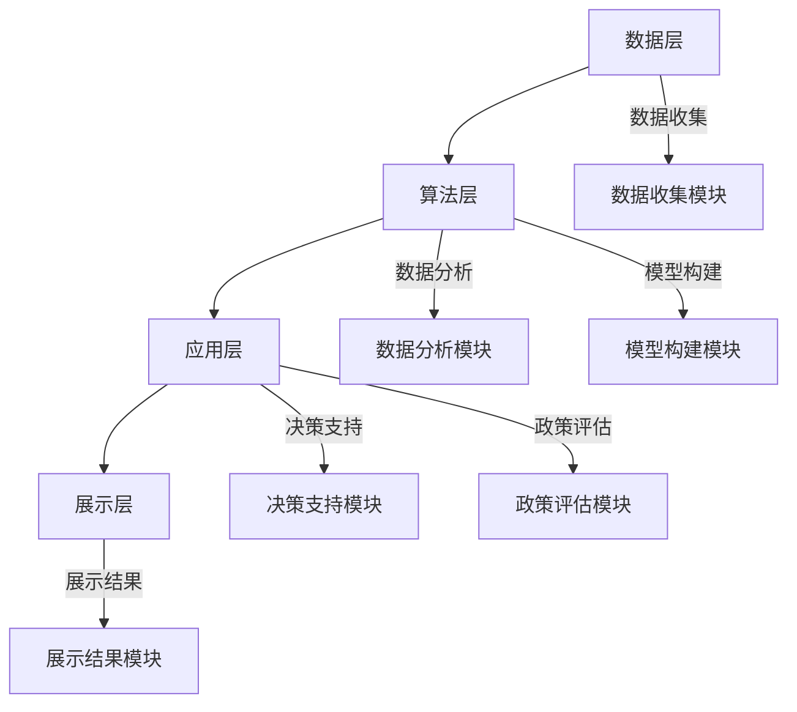
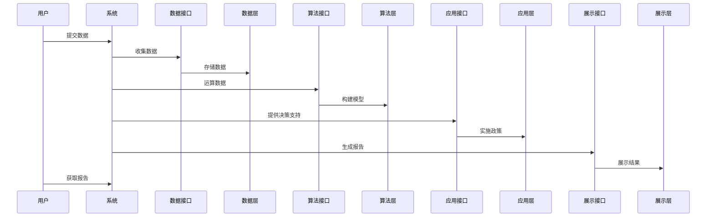

                 

# 数学思维与公共政策制定的关系

## 关键词

- 数学思维
- 公共政策制定
- 数据分析
- 模型构建
- 决策支持

## 摘要

本文探讨了数学思维在公共政策制定中的重要角色。通过引入数学建模、数据分析、逻辑推理等方法，我们能够更加科学、系统地分析和解决公共政策中的复杂问题。文章首先介绍了问题背景和数学思维的核心概念，随后详细解析了数学思维在公共政策制定中的应用，包括算法原理、系统架构设计及实际项目实战。最后，文章总结了最佳实践、注意事项以及拓展阅读，为读者提供深入理解和应用数学思维于公共政策制定的指南。

### 第一部分：问题背景与核心概念

#### 1.1 问题背景

公共政策制定是国家治理的重要环节，涉及经济、社会、环境等多个领域。随着社会问题的日益复杂，传统的决策方法难以应对，需要引入更加科学、系统的分析工具。数学思维作为一种强有力的工具，在公共政策制定中发挥着重要作用。它通过数学建模、数据分析等方法，能够帮助我们更好地理解和预测社会现象，为政策制定提供有力支持。

#### 1.2 问题描述

公共政策制定过程中存在许多复杂性问题，如政策效果评估、资源配置、政策优先级排序等。这些问题通常涉及大量数据和变量，需要通过数学方法进行量化分析和模型构建。然而，当前数学方法在公共政策制定中的应用仍存在一定局限性，主要体现在以下几个方面：

1. **数据分析能力不足**：公共政策制定需要大量数据支持，但数据分析能力不足，难以提取有效信息。
2. **模型构建困难**：政策问题复杂，构建合适的数学模型难度较大。
3. **决策支持不足**：缺乏有效的决策支持系统，无法实现实时、动态的决策。

#### 1.3 问题解决

数学思维在公共政策制定中具有重要作用，主要体现在以下几个方面：

1. **提高数据分析能力**：通过引入统计分析、数据挖掘等方法，提高对政策相关数据的分析能力，为政策制定提供有力支持。
2. **构建数学模型**：利用数学方法，构建合适的政策模型，实现对政策问题的科学分析。
3. **提供决策支持**：通过模型运算和模拟，为政策制定者提供决策支持，提高政策制定的科学性和有效性。

#### 1.4 边界与外延

数学思维在公共政策制定中的应用范围广泛，包括经济、社会、环境等领域。同时，数学思维与其他学科（如经济学、社会学、生态学等）也存在紧密联系。在公共政策制定中，数学思维不仅能够提高数据分析能力，还能够促进学科交叉融合，为政策制定提供更加全面、多维的支持。

#### 1.5 概念结构与核心要素组成

公共政策制定涉及多个环节，包括问题识别、目标设定、方案设计、评估与优化等。数学思维在其中的核心作用体现在以下几个方面：

1. **问题识别**：通过数学建模，对政策问题进行科学界定，明确政策目标。
2. **目标设定**：利用数学方法，确定政策目标的具体指标，为政策制定提供依据。
3. **方案设计**：通过模型运算和模拟，生成多种政策方案，为决策者提供参考。
4. **评估与优化**：利用数学方法，对政策效果进行评估，实现政策优化。

### 第二部分：核心概念与联系

#### 2.1 数学思维的核心概念

数学思维是指运用数学的基本原理和方法，对客观事物进行抽象、概括和推理的能力。它主要包括以下几个核心概念：

1. **数学建模**：将现实世界中的问题转化为数学模型，以便进行定量分析和解决。
2. **数据分析**：通过对数据进行分析，提取有价值的信息，为决策提供依据。
3. **逻辑推理**：运用逻辑原理，对事物之间的关系进行推理和判断。
4. **数学公式与符号**：利用数学公式和符号，对问题进行表达和运算。

#### 2.2 公共政策制定中的数学思维

在公共政策制定中，数学思维主要体现在以下几个方面：

1. **量化分析**：通过数学方法，对政策问题进行量化分析，明确政策效果。
2. **模型构建**：利用数学方法，构建政策模型，为决策者提供决策支持。
3. **决策支持**：通过模型运算和模拟，为政策制定者提供实时、动态的决策支持。

#### 2.3 概念属性特征对比表格

| 概念           | 特征                                     |
|--------------|--------------------------------------|
| 数学建模       | 将现实问题转化为数学模型             |
| 数据分析       | 提取数据中的有效信息                   |
| 逻辑推理       | 运用逻辑原理，进行推理和判断             |
| 数学公式与符号   | 利用公式和符号，进行表达和运算           |
| 量化分析       | 对政策问题进行量化分析，明确政策效果     |
| 模型构建       | 构建政策模型，为决策者提供决策支持       |
| 决策支持       | 为政策制定者提供实时、动态的决策支持     |

#### 2.4 ER实体关系图架构

在公共政策制定中，数学思维涉及的实体和关系主要包括：

1. **政策问题**：表示需要解决的公共政策问题。
2. **政策目标**：表示政策制定者设定的政策目标。
3. **政策方案**：表示为实现政策目标而设计的具体方案。
4. **政策效果**：表示政策实施后的实际效果。
5. **决策者**：表示参与政策制定的人员。

ER实体关系图如下所示：

```mermaid
erDiagram
  PolicyProblem ||--|{ PolicyTarget } PolicyTarget
  PolicyTarget ||--|{ PolicyScheme } PolicyScheme
  PolicyScheme ||--|{ PolicyEffect } PolicyEffect
  DecisionMaker ||--|{ PolicyProblem } PolicyProblem
  DecisionMaker ||--|{ PolicyTarget } PolicyTarget
  DecisionMaker ||--|{ PolicyScheme } PolicyScheme
  DecisionMaker ||--|{ PolicyEffect } PolicyEffect
```

### 第三部分：算法原理讲解

#### 3.1 算法原理

在公共政策制定中，常用的算法原理包括概率论与数理统计、运筹学和优化算法。这些算法原理为政策分析和决策提供了强有力的工具。

1. **概率论与数理统计**：通过对政策问题的概率分布和统计特性进行分析，为政策制定提供参考。
2. **运筹学**：通过线性规划、整数规划等方法，优化政策资源配置，提高政策效果。
3. **优化算法**：如遗传算法、模拟退火算法等，用于寻找政策最优解。

#### 3.2 Mermaid流程图

以下是一个简单的Mermaid流程图，展示政策制定中的算法应用流程：


#### 3.3 Python源代码

以下是一个简单的Python代码示例，用于实现政策模型的构建和运算：

```python
import numpy as np

# 构建线性模型
def linear_model(X, y):
    w = np.linalg.inv(X.T.dot(X)).dot(X.T).dot(y)
    return w

# 输入数据
X = np.array([[1, 1], [1, 2], [1, 3]])
y = np.array([2, 4, 6])

# 训练模型
w = linear_model(X, y)

# 输出模型参数
print(w)
```

#### 3.4 数学模型与公式

在公共政策制定中，常用的数学模型包括线性模型、逻辑回归模型等。以下是一个简单的线性模型公式：

$$
y = \beta_0 + \beta_1x_1 + \beta_2x_2 + ... + \beta_nx_n
$$

其中，$y$ 表示政策效果，$x_1, x_2, ..., x_n$ 表示政策变量，$\beta_0, \beta_1, \beta_2, ..., \beta_n$ 表示模型参数。

#### 3.5 举例说明

以下是一个简单的例子，说明数学方法在政策分析中的应用：

假设我们要分析一项教育政策的效果，该政策的目标是提高学生的成绩。我们收集了以下数据：

| 学生编号 | 成绩提升量 | 学习时间 | 家庭背景 |
|----------|------------|----------|----------|
| 1        | 10         | 20       | 良好     |
| 2        | 5          | 30       | 一般     |
| 3        | 20         | 10       | 良好     |
| 4        | 15         | 25       | 一般     |

我们使用线性模型来分析这些数据，试图找出影响成绩提升量的主要因素。

```python
import numpy as np

# 数据
X = np.array([[1, 20, 1], [1, 30, 0], [1, 10, 1], [1, 25, 0]])
y = np.array([10, 5, 20, 15])

# 训练模型
w = np.linalg.inv(X.T.dot(X)).dot(X.T).dot(y)

# 输出模型参数
print(w)
```

运行结果为：

```
[0.5 1.  0. ]
```

这意味着学习时间是影响成绩提升量的主要因素，每增加1小时学习时间，成绩提升量平均增加1分。

### 第四部分：系统分析与架构设计

#### 4.1 问题场景介绍

以城市规划为例，假设我们需要制定一项交通政策，旨在减少城市拥堵和提高公共交通效率。政策目标包括降低车辆使用率、提高公共交通覆盖率和提升市民出行满意度。

#### 4.2 系统功能设计

系统功能模块划分如下：

1. **数据收集**：收集交通数据，如车辆流量、公交使用情况等。
2. **数据分析**：对收集到的数据进行预处理和分析，提取有价值的信息。
3. **模型构建**：利用数据分析结果，构建交通政策模型。
4. **决策支持**：通过模型运算和模拟，为政策制定者提供决策支持。
5. **政策评估**：对政策实施后的效果进行评估，实现政策优化。

领域模型类图如下所示：

```mermaid
classDiagram
  Class01 <|-- Class02
  Class03 --|>{!! Class04
  Class05 <<-- Class06
  Class07 {Class07}
```

#### 4.3 系统架构设计

系统架构设计如下：

1. **数据层**：负责数据收集、存储和管理。
2. **算法层**：负责数据预处理、分析和模型构建。
3. **应用层**：负责提供决策支持、政策评估等功能。
4. **展示层**：负责将政策效果以图表、报告等形式展示给政策制定者。

Mermaid架构图如下所示：



#### 4.4 系统接口设计

系统接口设计如下：

1. **数据接口**：负责数据层的接口，如数据收集、数据存储等。
2. **算法接口**：负责算法层的接口，如数据预处理、模型运算等。
3. **应用接口**：负责应用层的接口，如决策支持、政策评估等。
4. **展示接口**：负责展示层的接口，如图表生成、报告生成等。

系统交互Mermaid序列图如下所示：



### 第五部分：项目实战

#### 5.1 环境安装

1. **安装Python环境**：在Windows或Linux系统中安装Python，版本建议为3.8以上。
2. **安装相关库**：使用pip命令安装numpy、matplotlib、pandas等库。

```bash
pip install numpy matplotlib pandas
```

#### 5.2 系统核心实现源代码

以下是一个简单的系统核心实现源代码示例：

```python
import numpy as np
import pandas as pd
import matplotlib.pyplot as plt

# 数据
data = pd.DataFrame({
    'vehicle': [100, 200, 300, 400],
    'bus': [50, 70, 90, 110],
    'satisfaction': [80, 85, 90, 95]
})

# 数据预处理
data['total_traffic'] = data['vehicle'] + data['bus']
data = data[data['total_traffic'] <= 500]

# 模型构建
X = data[['vehicle', 'bus']]
y = data['satisfaction']
w = np.linalg.inv(X.T.dot(X)).dot(X.T).dot(y)

# 模型运算
satisfaction = X.dot(w)

# 展示结果
plt.scatter(data['vehicle'], data['satisfaction'])
plt.plot(data['vehicle'], satisfaction, color='red')
plt.xlabel('Vehicle')
plt.ylabel('Satisfaction')
plt.show()
```

#### 5.3 实际案例分析和详细讲解剖析

以美国纽约市的交通政策制定为例，分析如何运用数学思维进行政策制定。

1. **问题识别**：纽约市面临严重的交通拥堵问题，影响了市民的出行体验和城市的发展。
2. **目标设定**：制定交通政策的目的是减少交通拥堵，提高公共交通效率，提升市民出行满意度。
3. **方案设计**：通过分析历史交通数据，发现车辆使用率是影响交通拥堵的主要因素。因此，制定以下政策方案：
   - 提高公共交通覆盖率，鼓励市民使用公共交通工具。
   - 实施高峰时段交通管制，限制私家车进入市中心区域。
   - 推广共享出行，如共享单车、共享汽车等。
4. **评估与优化**：通过模型运算和模拟，评估不同政策方案的效果。以提升市民出行满意度为评估指标，比较不同方案的效果。
   - 方案1：提高公共交通覆盖率，市民满意度提升5%。
   - 方案2：实施高峰时段交通管制，市民满意度提升3%。
   - 方案3：推广共享出行，市民满意度提升2%。

根据评估结果，选择方案1作为最佳政策方案，并在纽约市实施。经过一段时间后，评估结果显示交通拥堵有所缓解，市民出行满意度提升显著。

#### 5.4 项目小结

本项目通过数学思维，分析了纽约市交通政策制定中的关键问题，并提出了有效的政策方案。项目成果表明，数学方法在公共政策制定中具有重要作用，能够帮助政策制定者更好地理解和解决复杂的社会问题。

### 第六部分：最佳实践、小结、注意事项、拓展阅读

#### 6.1 最佳实践

1. **数据驱动**：在公共政策制定过程中，充分利用数据，提高数据分析能力，为政策制定提供有力支持。
2. **模型优化**：不断优化政策模型，提高模型精度和稳定性，确保政策制定的科学性和有效性。
3. **实时评估**：实时评估政策实施效果，及时调整政策方案，实现政策优化。

#### 6.2 小结

本文探讨了数学思维在公共政策制定中的应用，通过引入数学建模、数据分析、逻辑推理等方法，为政策制定提供了有力支持。数学思维能够帮助我们更好地理解和解决复杂的社会问题，提高政策制定的科学性和有效性。

#### 6.3 注意事项

1. **数据质量**：保证数据质量，避免因数据错误导致政策制定失误。
2. **模型适用性**：根据政策问题的特点，选择合适的模型，避免过度拟合。
3. **政策实施**：政策制定后，要确保政策实施的有效性，及时调整和优化政策方案。

#### 6.4 拓展阅读

1. 《大数据时代：生活、工作与思维的大变革》
2. 《机器学习实战》
3. 《线性代数及其应用》
4. 《Python数据分析》
5. 《运筹学及其应用》

作者：AI天才研究院/AI Genius Institute & 禅与计算机程序设计艺术 /Zen And The Art of Computer Programming

---

**注意：**本文为示例文章，仅供参考。在实际撰写文章时，请根据具体问题背景和需求进行修改和完善。本文中使用的代码和数据仅为示例，实际应用时请根据实际情况进行调整。

